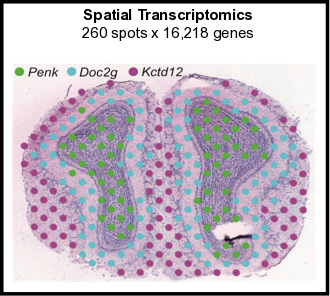
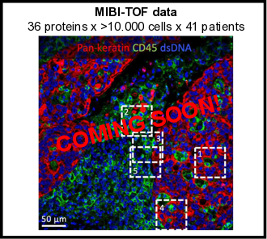
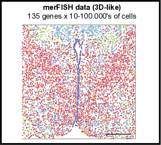

<!-- README.md is generated from README.Rmd. Please edit that file -->

```{r, include = FALSE}
knitr::opts_chunk$set(
  collapse = TRUE,
  comment = "#>",
  fig.path = "man/figures/README-",
  out.width = "100%"
)
```
# Giotto

<!-- badges: start -->
<!-- badges: end -->

The goal of Giotto is to process, analyze and visualize **single-cell spatial expression** data. It can be used on virtually all current spatial datasets, although not all implemented analyses work for each type of technology. Firstly Giotto provides a flexible framework for common single-cell processing steps such as quality control, normalization, dimension reduction, clustering and cell type annotation. 
Next, it incorporates spatial information through the formation of a spatial grid and a spatial proximity network, which will be used in subsequent analyses to identify spatial genes or patterns, cell-cell preferential interactions and ligand-receptor signaling. Furthermore, the outcome of Giotto can be interactivily explored using [Giotto Viewer](http://spatial.rc.fas.harvard.edu/giotto-viewer/), which allows you to overlay the obtained results with raw or additional images of the profiled tissue section(s). 
Simultaneously this package contains the data that was used in the recent [**seqFISH+**](https://www.nature.com/articles/s41586-019-1049-y) paper and can thus be used to explore or re-analyze this dataset. 

Make sure to check out the **Examples** and **FAQ** section to learn everything about the Giotto workflow.

\  


## Latest News

- New examples on mouse kidney and brain using the recently released [10X Visium datasets](https://www.10xgenomics.com/spatial-transcriptomics/) (**NEW**)
- Added tools to identify spatial enrichment based on cell-type (or other) specific gene signature lists  (**NEW**)
- Updated support for 3D spatial data (**NEW**)
- Added support for the use of global instructions and automatically saving your plots (**NEW**)
- Implemented [SpatialDE](https://github.com/Teichlab/SpatialDE)
- Add wrapper for differential expression with [MAST](https://github.com/RGLab/MAST)
- New example with 3D spatial data [STARmap](https://science.sciencemag.org/content/361/6400/eaat5691)
- New example with the highly sensitive data from [osmFISH](https://www.nature.com/articles/s41592-018-0175-z)
- New example on the Cerebellum with the scalable data from [Slideseq](https://science.sciencemag.org/content/363/6434/1463)
- New example on mouse olfactory bulb using immobilized primers on glass slides from [Spatial Transcriptomics](https://science.sciencemag.org/content/353/6294/78)
- Updated seqFISH+ cortex example (**NEW**)
- Updated STARmap cortex example (**NEW**)
- New examples for merFISH (3D) and MIBI (multiple patient tumor samples) will follow soon.

\  


## Requirements

- R (>= 3.5.1)
- Python (>= 3.0)
- Windows, MacOS, Linux

\  


## Installation


#### Package development prerequisites
If this is the first time you build and install an R package you can follow this [link](https://support.rstudio.com/hc/en-us/articles/200486498-Package-Development-Prerequisites),
which has simple installation instructions for Windows, Mac OSX and Linux.

To specifically install the command-line tools of Xcode for Mac OSX you might also need to run this line in terminal:  
``` bash
xcode-select --install
```


#### R installation
You can install (~1-5 mins) the development version of Giotto with:

``` r
library(devtools) # if not installed: install.packages('devtools') 
library(remotes)  # if not installed: install.packages('remotes')
# to install the latest version (development)
remotes::install_github("RubD/Giotto")

# to install a specific release version (example)
remotes::install_github("RubD/Giotto@v0.1.3")
```


#### Python tools (optional)  
This is necessary to run all available analyses, including Leiden / Louvain clustering and to build and use the interactive visualization tool. An alternative, but less flexible, R version for Louvain clustering is also available. It is advisable to install everything within a specific conda environment and specify the python path at the beginning with createGiottoInstructions() or in the R function itself when required.

Required python modules:  
- pandas  
- igraph  
- networkx  
- leidenalg  
- community 

Conda installation:  
If conda install does not work, try 'pip'
``` python
# pandas:
conda install -c anaconda pandas

# python-igraph:
conda install -c conda-forge python-igraph

# networkx:
conda install -c anaconda networkx

# louvain:
conda install -c conda-forge python-louvain

# leidenalg:
conda install -c conda-forge leidenalg
```


#### HMRF
See [**HMRF**](http://www.nature.com/articles/nbt.4260) installation [instructions](http://spatial.rc.fas.harvard.edu/install.html).
  
  
\   


## Examples 
- see https://github.com/RubD/spatial-datasets to find raw and pre-processed input data and Giotto scripts (in progress). 
- typical run time range for the different datasets on a personal computer is around 10~45 mins.  
- click on the image and try them out yourself.

[{width=10cm}](./inst/examples/mouse_cortex_svz/seqfish_cortex_Giotto_v0.1.2_update.md)
[{width=10cm}](./inst/examples/mouse_starmap_cortex/starmap_cortex_Giotto_v0.1.2_update.md)  

[{width=10cm}](./inst/examples/mouse_osmFISH_SS_cortex/osmFISH_SS_cortex_Giotto_v0.1.2.md)
[{width=10cm}](./inst/examples/mouse_SpatTx_OB/mouse_SpatTx_OB_Giotto_v0.1.2.md)  

[{width=10cm}](./inst/examples/mouse_visium_kidney/mouse_visium_kidney_Giotto_v0.1.3.md) 
[{width=10cm}](./inst/examples/mouse_visium_brain/mouse_visium_brain_Giotto_v0.1.3.md)  

[{width=10cm}](./inst/examples/mouse_slideseq_cerebellum/slideseq_cerebellum_Giotto_v0.1.2.md)  

[{width=10cm}]
[{width=10cm}]  


\  

## FAQ  

Howto's and faqs examples:  

##### Data availability  
- Cortex/SVZ and olfactory bulb data availability?  
**Expression and centroid information is part of Giotto, see examples.**
- Where to find other ready-to-use datasets?  
**Checkout https://github.com/RubD/spatial-datasets to find already preprocessed datasets**  

##### Giotto tips & tricks 
- [How to add metadata and subset a Giotto object?](./inst/faqs/metadata_and_subset/metadata_and_subset_VC.md)
- [How to create global instructions and show or save your created plots?](./inst/faqs/instructions_and_plotting/instructions_and_plotting.md)
- [Different ways to visualize your spatial data?](./inst/faqs/visualization_options/visualization_options.md)
- How to test and store multiple parameters or analyses?
- How to create a giotto object with your own spatial network/grid, dimensions reduction, ... ?  

##### Giotto analyses 
- How to identify highly variable genes?  
- Different ways to cluster data?
- Methods to identify differentially expressed genes?  
- How to perform cell-type or cell-process gene signature spatial enrichment analysis?
- Algorithmes to find spatial genes, patterns or domains?
- Effect of neighboring cells on gene expression?  
- ...

##### Giotto Analyzer and Viewer interaction  
- How to switch between Giotto Analyzer and Viewer?


\  


## References

- Dries, R. et al. Giotto, a pipeline for integrative analysis and visualization of single-cell spatial transcriptomic data. bioRxiv 701680 (2019). doi:10.1101/701680 [link](https://www.biorxiv.org/content/10.1101/701680v1)

- Eng, C.-H. L. et al. Transcriptome-scale super-resolved imaging in tissues by RNA seqFISH+. Nature 1 (2019). doi:10.1038/s41586-019-1049-y [link](https://www.nature.com/articles/s41586-019-1049-y)

- Zhu, Q., Shah, S., Dries, R., Cai, L. & Yuan, G.-C. Identification of spatially associated subpopulations by combining scRNAseq and sequential fluorescence in situ hybridization data. Nature Biotechnology (2018). doi:10.1038/nbt.4260 [link](https://www.nature.com/articles/nbt.4260)


