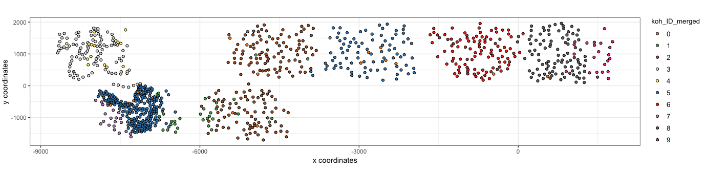

<!-- README.md is generated from README.Rmd. Please edit that file -->

```{r, include = FALSE}
knitr::opts_chunk$set(
  collapse = TRUE,
  comment = "#>",
  fig.path = "man/figures/README-",
  out.width = "100%"
)
```
# Giotto

<!-- badges: start -->
<!-- badges: end -->

The goal of Giotto is to process, analyze and visualize single-cell **spatial** transcriptomic data. Simultaneously this package contains the data that was used in the recent [**seqFISH+**](https://www.nature.com/articles/s41586-019-1049-y) paper and can thus be used to explore or re-analyze this dataset.

## Requirements

- R (>= 3.5.1)
- Python (>= 3.0)
- Unix/Linux


## Installation

#### R installation

You can install the development version of Giotto with:

``` r
library(devtools)
install_github("RubD/Giotto")
```

You can NOT YET install the released version of Giotto from [CRAN](https://CRAN.R-project.org) with:

``` r
install.packages("Giotto")
```

#### Python tools (optional)

``` python
conda install GioTools
```


## Examples

{width=7cm}

[{width=10cm}](./inst/examples/mouse_cortex_svz/mouse_cortex_example.md)
{width=10cm}


## Latest News

- First release (beta)
- ...

## FAQ

## References

- seqFISH+ paper 


