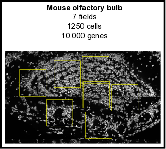

<!-- README.md is generated from README.Rmd. Please edit that file -->

```{r, include = FALSE}
knitr::opts_chunk$set(
  collapse = TRUE,
  comment = "#>",
  fig.path = "man/figures/README-",
  out.width = "100%"
)
```
# Giotto

<!-- badges: start -->
<!-- badges: end -->

The goal of Giotto is to process, analyze and visualize **single-cell spatial transcriptomic** data. Simultaneously this package contains the data that was used in the recent [**seqFISH+**](https://www.nature.com/articles/s41586-019-1049-y) paper and can thus be used to explore or re-analyze this dataset.

\  

## Requirements

- R (>= 3.5.1)
- Python (>= 3.0)
- Unix/Linux

\  


## Installation

#### R installation

You can install the development version of Giotto with:

``` r
library(devtools)
install_github("RubD/Giotto")
```


#### Python tools (optional)  
This is necessary to run all available analyses, including Leiden / Louvain clustering and to build and use the interactive visualization tool. An alternative, but less flexible, R version for Louvain clustering is also available. It is advisable to install everything within a specific conda environment and specify the python path in the R function when required.

Required python modules:  
- pandas  
- igraph  
- networkx  
- leidenalg  
- community 

Conda installation:
``` python
# pandas:
conda install -c anaconda pandas

# python-igraph:
conda install -c conda-forge python-igraph
conda install -c conda-forge/label/gcc7 python-igraph
conda install -c conda-forge/label/cf201901 python-igraph 

# networkx:
conda install -c anaconda networkx

# louvain:
conda install -c conda-forge python-louvain
conda install -c conda-forge/label/gcc7 python-louvain
conda install -c conda-forge/label/cf201901 python-louvain

# leidenalg:
conda install -c conda-forge leidenalg
```


#### HMRF
See [**HMRF**](http://www.nature.com/articles/nbt.4260) installation [instructions](http://spatial.rc.fas.harvard.edu/install.html).
  
  
\   


## Examples (outdated)
[{width=10cm}](./inst/examples/mouse_cortex_svz/mouse_cortex_example.md)
[{width=10cm}](./inst/examples/mouse_olfactory_bulb/mouse_olfactory_bulb_example.md)

\  


## Latest News

- First release (beta)
- ...

\  


## FAQ  

Howto's and faqs examples:  

- Cortex/SVZ and olfactory bulb data availability?  
**Expression and centroid information is part of Giotto, see examples.**
- How to create a giotto object with your own spatial network/grid, dimensions reduction, ... ?  
- [How to add metadata and subset a Giotto object?](./inst/faqs/metadata_and_subset/metadata_and_subset_VC.md)
- How to test and store multiple parameters or analyses?
- ...

\  


## References

- Eng, C.-H. L. et al. Transcriptome-scale super-resolved imaging in tissues by RNA seqFISH+. Nature 1 (2019). doi:10.1038/s41586-019-1049-y

- Zhu, Q., Shah, S., Dries, R., Cai, L. & Yuan, G.-C. Identification of spatially associated subpopulations by combining scRNAseq and sequential fluorescence in situ hybridization data. Nature Biotechnology (2018). doi:10.1038/nbt.4260


