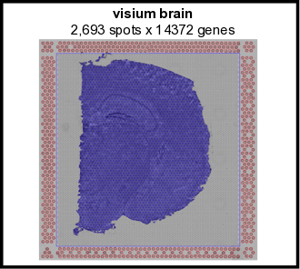
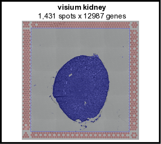
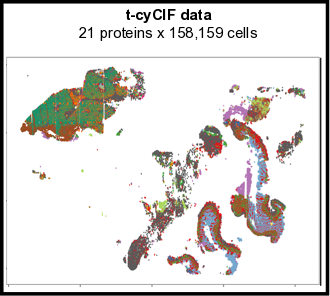
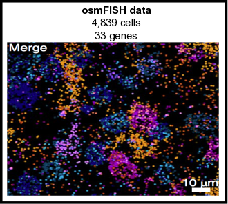

<!-- README.md is generated from README.Rmd. Please edit that file -->
<!-- This line is from RStudio -->


# Giotto

<!-- badges: start -->
<!-- badges: end -->

The Giotto package consists of two modules, Giotto Analyzer and Viewer (see [www.spatialgiotto.com](http://spatial.rc.fas.harvard.edu/spatialgiotto/giotto.html)), which provide tools to process, analyze and visualize **single-cell spatial expression** data. The underlying framework is generalizable to virtually all currently available spatial datasets. We recently demonstrated the general applicability on 10 different datasets created by 9 different state-of-the-art spatial technologies, including *in situ* hybridization (seqFISH+, merFISH, osmFISH), sequencing (Slide-seq, Visium, STARmap) and imaging-based multiplexing/proteomics (CyCIF, MIBI, CODEX). These technologies differ in terms of resolution (single cell vs multiple cells), spatial dimension (2D vs 3D), molecular modality (protein vs RNA), and throughput (number of cells and genes). More information and documentation about the latest (developmental) version of Giotto Analyzer can be found at https://rubd.github.io/Giotto/.


## Requirements

- R (>= 3.5.1)
- Python (>= 3.0)
- Windows, MacOS, Linux


\   


## Installation

See [FAQs](https://rubd.github.io/Giotto/articles/faqs.html) for additional information.

#### R installation
You can install (~1-5 mins) Giotto with:

``` r
library(remotes)  # if not installed: install.packages('remotes')
# to install the latest version
remotes::install_github("RubD/Giotto")
```


#### Required python modules
This is necessary to run all available analyses.

Required python modules:  
- pandas  
- python-igraph (igraph)  
- networkx  
- leidenalg  
- python-louvain (community)  
- smfishHmrf  

##### Automatic installation  
The python modules will be installed automatically in a miniconda environment when installing Giotto. However, it will ask you whether you want to install them and you can opt out and select your preferred python path. In that case you need to do a manual installation of the python modules.

##### Manual installation  
Install with pip in python 3
``` bash
pip3 install pandas python-igraph networkx python-louvain leidenalg smfishHmrf
```
 
If pip install does not work, try installing them with conda within a [conda environment](https://docs.conda.io/projects/conda/en/latest/user-guide/tasks/manage-environments.html#creating-an-environment-with-commands):
``` bash
conda install -c anaconda pandas
conda install -c conda-forge python-igraph
conda install -c anaconda networkx
conda install -c conda-forge python-louvain
conda install -c conda-forge leidenalg
```
  
#### Giotto Viewer  
See [link](http://spatial.rc.fas.harvard.edu/spatialgiotto/giotto.install.native.html)


\   


## Examples 
- see https://github.com/RubD/spatial-datasets to find raw and pre-processed input data and Giotto scripts (in progress). 
- typical run time range for the different datasets on a personal computer is around 10~45 mins.  
- click on the image and try them out yourself.


[{width=10cm}](https://rubd.github.io/Giotto/articles/mouse_seqFISH_cortex_200319.html)
[{width=10cm}](https://rubd.github.io/Giotto/articles/mouse_merFISH_hypoth_preoptic_region_200326.html)
[{width=10cm}](https://rubd.github.io/Giotto/articles/mouse_starmap_cortex.html)
[{width=10cm}](https://rubd.github.io/Giotto/articles/mouse_visium_brain_200325.html)
[{width=10cm}](https://rubd.github.io/Giotto/articles/mouse_visium_kidney_200326.html)
[{width=10cm}](https://rubd.github.io/Giotto/articles/human_cycif_PDAC_200322.html)
[{width=10cm}](https://rubd.github.io/Giotto/articles/mouse_osmFISH_SScortex.html)
[{width=10cm}](https://rubd.github.io/Giotto/articles/mouse_CODEX_spleen.html)


## References

- [Dries, R. et al. Giotto, a pipeline for integrative analysis and visualization of single-cell spatial transcriptomic data. bioRxiv 701680 (2019).](https://www.biorxiv.org/content/10.1101/701680v1) doi:10.1101/701680

- [Eng, C.-H. L. et al. Transcriptome-scale super-resolved imaging in tissues by RNA seqFISH+. Nature 1 (2019).](https://www.nature.com/articles/s41586-019-1049-y) doi:10.1038/s41586-019-1049-y

- [Zhu, Q., Shah, S., Dries, R., Cai, L. & Yuan, G.-C. Identification of spatially associated subpopulations by combining scRNAseq and sequential fluorescence in situ hybridization data. Nature Biotechnology (2018).](https://www.nature.com/articles/nbt.4260) doi:10.1038/nbt.4260


