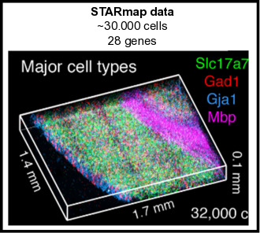
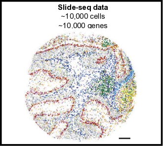

<!-- README.md is generated from README.Rmd. Please edit that file -->

```{r, include = FALSE}
knitr::opts_chunk$set(
  collapse = TRUE,
  comment = "#>",
  fig.path = "man/figures/README-",
  out.width = "100%"
)
```
# Giotto

<!-- badges: start -->
<!-- badges: end -->

The goal of Giotto is to process, analyze and visualize **single-cell spatial expression** data. It can be used on virtually all current spatial datasets, although not all implemented analyses work for each type of technology. Firstly Giotto provides a flexible framework for common single-cell processing steps such as quality control, normalization, dimension reduction, clustering and cell type annotation. Next, it incorporates spatial information through the formation of a spatial grid and a spatial proximity network, which will be used in subsequent analyses to identify spatial genes or patterns, cell-cell preferential interactions and ligand-receptor signaling. Simultaneously this package contains the data that was used in the recent [**seqFISH+**](https://www.nature.com/articles/s41586-019-1049-y) paper and can thus be used to explore or re-analyze this dataset.

\  

## Requirements

- R (>= 3.5.1)
- Python (>= 3.0)
- Unix/Linux

\  


## Installation

#### R installation

You can install (~1-5 mins) the development version of Giotto with:

``` r
library(remotes)
# to install the latest stable version (advised)
remotes::install_github("RubD/Giotto")

# to install a specific release version (example)
remotes::install_github("RubD/Giotto@v0.1.0")
```


#### Python tools (optional)  
This is necessary to run all available analyses, including Leiden / Louvain clustering and to build and use the interactive visualization tool. An alternative, but less flexible, R version for Louvain clustering is also available. It is advisable to install everything within a specific conda environment and specify the python path in the R function when required.

Required python modules:  
- pandas  
- igraph  
- networkx  
- leidenalg  
- community 

Conda installation:
``` python
# pandas:
conda install -c anaconda pandas

# python-igraph, run on of the following:
conda install -c conda-forge python-igraph
conda install -c conda-forge/label/gcc7 python-igraph
conda install -c conda-forge/label/cf201901 python-igraph 

# networkx:
conda install -c anaconda networkx

# louvain, run of the following:
conda install -c conda-forge python-louvain
conda install -c conda-forge/label/gcc7 python-louvain
conda install -c conda-forge/label/cf201901 python-louvain

# leidenalg:
conda install -c conda-forge leidenalg
```


#### HMRF
See [**HMRF**](http://www.nature.com/articles/nbt.4260) installation [instructions](http://spatial.rc.fas.harvard.edu/install.html).
  
  
\   


## Examples 
- see https://github.com/RubD/spatial-datasets to find raw and pre-processed input data and Giotto scripts (in progress). 
- typical run time for the cortex dataset on a personal computer is around 20~30 mins.  

[{width=10cm}](./inst/examples/mouse_cortex_svz/seqfish_cortex_Giotto_v0.1.2.md)
[{width=10cm}](./inst/examples/mouse_starmap_cortex/starmap_cortex_Giotto_v0.1.2.md)  

[{width=10cm}](./inst/examples/mouse_osmFISH_SS_cortex/osmFISH_SS_cortex_Giotto_v0.1.2.md)
[{width=10cm}](./inst/examples/mouse_slideseq_cerebellum/slideseq_cerebellum_Giotto_v0.1.2.md)


\  


## Latest News

- Release of v.0.1.2
- Add support for 3D spatial data
- Implemented [SpatialDE](https://github.com/Teichlab/SpatialDE)
- Add wrapper for differential expression with [MAST](https://github.com/RGLab/MAST)
- New example with 3D spatial data [STARmap](https://science.sciencemag.org/content/361/6400/eaat5691)
- New example with the highly sensitive data from [osmFISH](https://www.nature.com/articles/s41592-018-0175-z)
- New example on the Cerebellum with the scalable data from [Slideseq](https://science.sciencemag.org/content/363/6434/1463)
- Updated osmFISH example by using global instructions to automatically save all generated plots (**NEW**)
- New examples for merFISH, Spatial Transcriptomics, MIBI and others will follow soon.
\  


## FAQ  

Howto's and faqs examples:  

- Cortex/SVZ and olfactory bulb data availability?  
**Expression and centroid information is part of Giotto, see examples.**
- How to create a giotto object with your own spatial network/grid, dimensions reduction, ... ?  
- [How to add metadata and subset a Giotto object?](./inst/faqs/metadata_and_subset/metadata_and_subset_VC.md)
- [How to create global instructions and show or save your created plots?](./inst/faqs/instructions_and_plotting/instructions_and_plotting.md)
- How to test and store multiple parameters or analyses?
- ...

\  


## References

- Dries, R. et al. Giotto, a pipeline for integrative analysis and visualization of single-cell spatial transcriptomic data. bioRxiv 701680 (2019). doi:10.1101/701680 [link](https://www.biorxiv.org/content/10.1101/701680v1)

- Eng, C.-H. L. et al. Transcriptome-scale super-resolved imaging in tissues by RNA seqFISH+. Nature 1 (2019). doi:10.1038/s41586-019-1049-y [link](https://www.nature.com/articles/s41586-019-1049-y)

- Zhu, Q., Shah, S., Dries, R., Cai, L. & Yuan, G.-C. Identification of spatially associated subpopulations by combining scRNAseq and sequential fluorescence in situ hybridization data. Nature Biotechnology (2018). doi:10.1038/nbt.4260 [link](https://www.nature.com/articles/nbt.4260)


