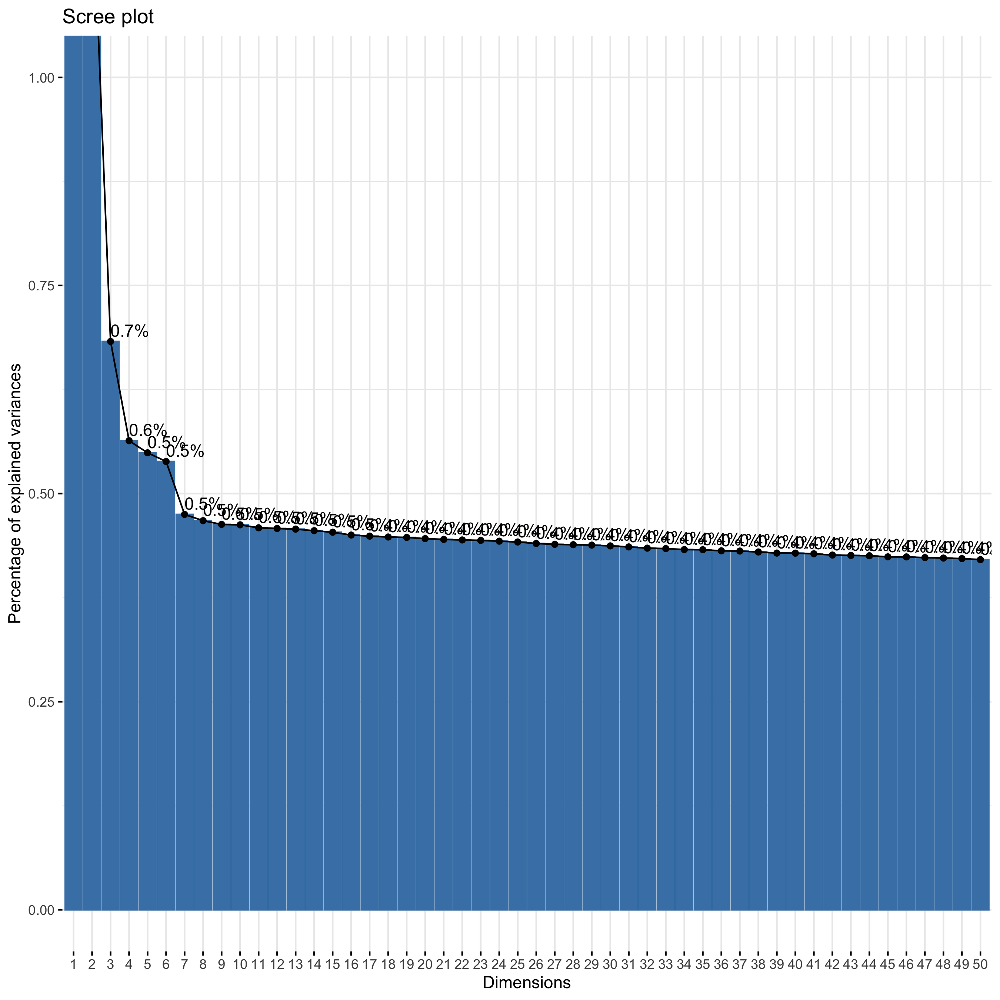
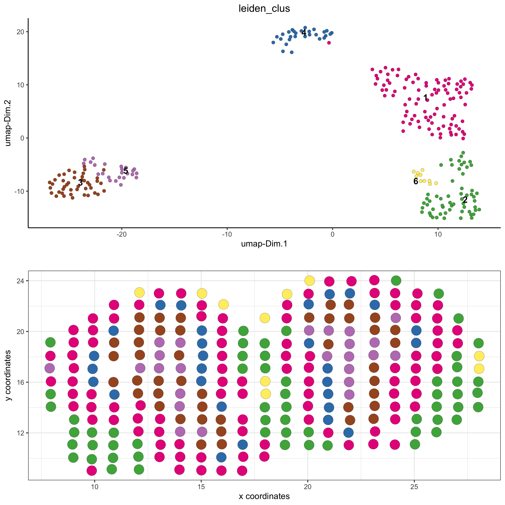
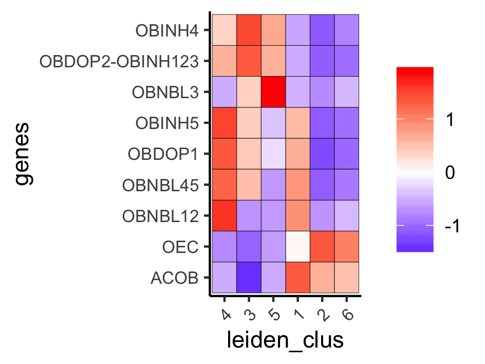
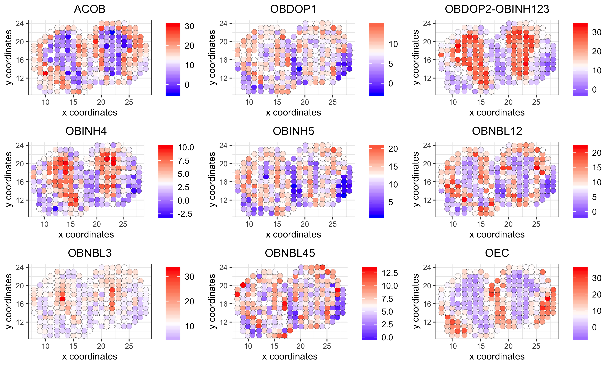
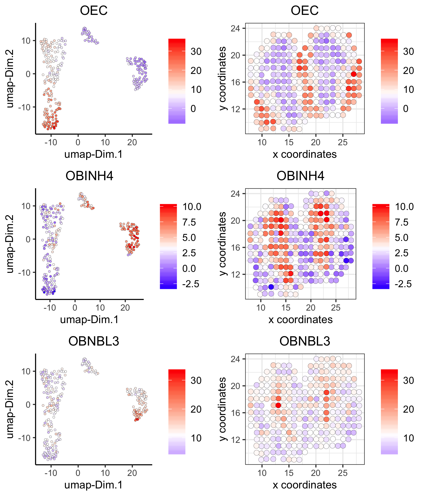
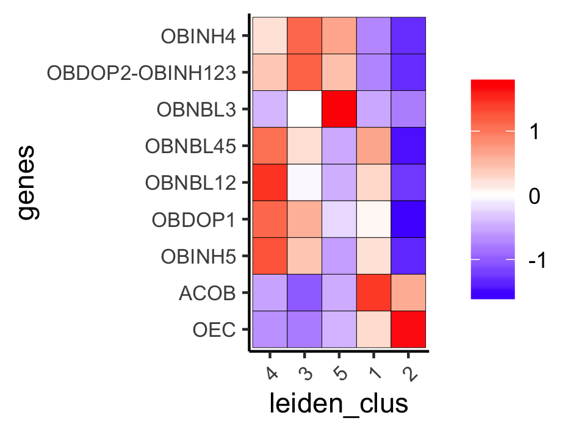
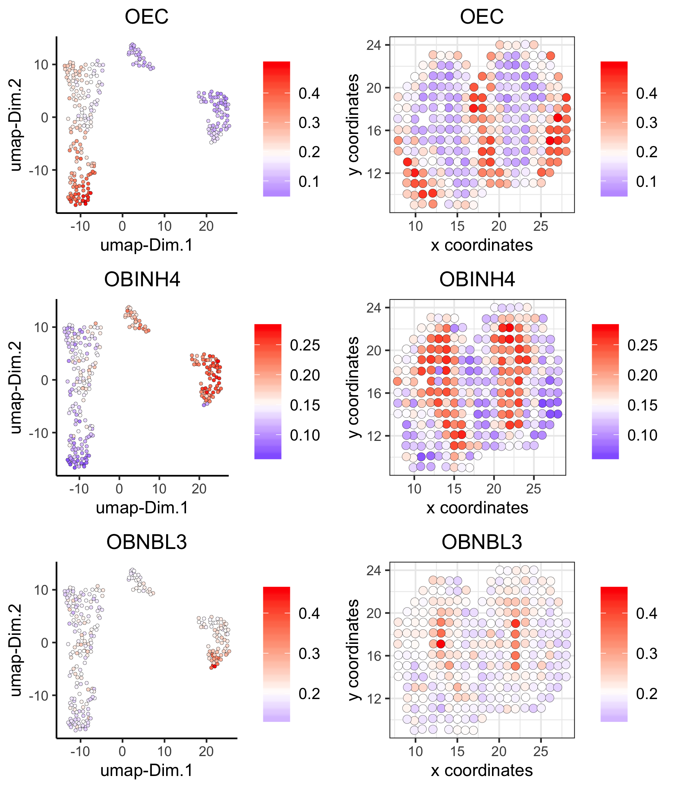

<!-- mouse_cortex_1_simple.md is generated from mouse_cortex_1_simple.Rmd Please edit that file -->


```{r, include = FALSE}
knitr::opts_chunk$set(
  collapse = TRUE,
  comment = "#>",
  fig.path = "man/figures/README-",
  out.width = "100%"
)
```

### Giotto global instructions
```{r eval=FALSE, message=FALSE, warning=FALSE}
# this example works with Giotto v.0.1.3
library(Giotto)

## create instructions
## setting save_plot = TRUE allows to automatically save all made plots to a predetermined save directory (save_dir)
## changes in saving parameters for each plotting function can be made with the save_param parameter 
my_python_path = "/Users/rubendries/Bin/anaconda3/envs/py36/bin/pythonw" # need to give a general template
results_folder = '/Path/to/Results/SpatTx_OB_results/'
instrs = createGiottoInstructions(python_path = my_python_path,
                                  show_plot = F, return_plot = T, save_plot = T,
                                  save_dir = results_folder,
                                  plot_format = 'png',
                                  dpi = 300, height = 9, width = 9)

```

### Data input

[Stahl et al.](https://science.sciencemag.org/content/353/6294/78) used immobilized reverse-transcription oligo(dT) primers on glass glides to profile the spatial expression of the mouse olfactory bulb.
  
{width=20cm} .

```{r, eval=FALSE}
## select the directory where you have saved the Spatial Transcriptomics data
data_folder = '/path/to/ST_data/'
expr = read.table(paste0(data_folder,'/','count_matrix/Rep11_MOB_0_expr.txt'))
cell_locs = fread(paste0(data_folder,'/','cell_locations/Rep11_MOB_0_location.txt'))
```

***


### part 1: Create Giotto object & process data
<details>
  <summary>Expand</summary>
  \ 
 
```{r eval=FALSE}
## create
ST_test <- createGiottoObject(raw_exprs = expr, spatial_locs = cell_locs[,-1], instructions = instrs)
showGiottoInstructions(ST_test)

## filter
ST_test <- filterGiotto(gobject = ST_test,
                         expression_threshold = 1,
                         gene_det_in_min_cells = 1,
                         min_det_genes_per_cell = 100,
                         expression_values = c('raw'),
                         verbose = T)

## normalize
ST_test <- normalizeGiotto(gobject = ST_test)
ST_test <- addStatistics(gobject = ST_test)

## visualize
spatPlot(gobject = ST_test,
         save_param = list(save_folder = '2_Gobject', save_name = 'spatial_locations'))

```
  
{width=16cm} 

</details>

### part 2: dimension reduction

<details>
  <summary>Expand</summary>
  \ 
 
```{r eval=FALSE, message=FALSE, warning=FALSE, fig.width=7, fig.height=5, out.width="50%", fig.align='center'}
## highly variable genes (HVG)
ST_test <- calculateHVG(gobject = ST_test)
gene_metadata = fDataDT(ST_test)
featgenes = gene_metadata[hvg == 'yes' & perc_cells > 4 & mean_expr_det > 0.25]$gene_ID

## run PCA on expression values (default)
ST_test <- runPCA(gobject = ST_test, genes_to_use = featgenes, expression_values = 'scaled', scale_unit = F)
signPCA(gobject = ST_test, expression_values = 'scaled', scale_unit = F, scree_ylim = c(0,1),
        save_param = list(save_folder = '3_DimRed', save_name = 'screeplot'))
plotPCA(ST_test,
           save_param = list(save_folder = '3_DimRed', save_name = 'PCA_reduction'))

## run UMAP and tSNE on PCA space (default)
ST_test <- runUMAP(ST_test, dimensions_to_use = 1:10, expression_values = 'scaled', n_threads = 2)
plotUMAP(gobject = ST_test,
            save_param = list(save_folder = '3_DimRed', save_name = 'UMAP_reduction'))

```

{width=16cm} 

{width=16cm} 

{width=16cm} 

***

</details>

### part 3: cluster

<details>
  <summary>Expand</summary>
  \ 
  
```{r eval=FALSE}

## Leiden clustering
ST_test <- createNearestNetwork(gobject = ST_test, dimensions_to_use = 1:10, k = 10)
ST_test <- doLeidenCluster(gobject = ST_test, resolution = 0.2, n_iterations = 200)
plotUMAP(gobject = ST_test, cell_color = 'leiden_clus', point_size = 3,
            save_param = list(save_folder = '4_Cluster', save_name = 'UMAP_leiden'))

```


{width=16cm} 

***

</details>


### part 4: co-visualize ####
<details>
  <summary>Expand</summary>
  \ 
  
```{r eval=FALSE}
spatDimPlot(gobject = ST_test, cell_color = 'leiden_clus', 
            dim_point_size = 2, spat_point_size = 6,
            save_param = list(save_folder = '5_Covisuals', save_name = 'covisual_leiden'))
```

Co-visualzation:
{width=16cm} 

***

</details>


### part 5: differential expression ####

<details>
  <summary>Expand</summary>
  \
  
```{r eval=FALSE}
## gini ##
## very specific to a cluster, but not necessarily expressed in all cells of that cluster
gini_markers_subclusters = findMarkers_one_vs_all(gobject = ST_test,
                                                  method = 'gini',
                                                  expression_values = 'normalized',
                                                  cluster_column = 'leiden_clus',
                                                  min_genes = 20,
                                                  min_expr_gini_score = 0.5,
                                                  min_det_gini_score = 0.5)
topgenes_gini = gini_markers_subclusters[, head(.SD, 2), by = 'cluster']$genes

# violinplot
violinPlot(ST_test, genes = unique(topgenes_gini), cluster_column = 'leiden_clus',
           strip_text = 8, strip_position = 'top',
           save_param = c(save_folder = '6_DEG', save_name = 'violinplot_gini',  base_width = 5, base_height = 10))

# cluster heatmap
plotMetaDataHeatmap(ST_test, selected_genes = topgenes_gini,metadata_cols = c('leiden_clus'),
                    save_param = c(save_folder = '6_DEG', save_name = 'metaheatmap_gini'))


# visualize genes
topgenes_gini = gini_markers_subclusters[, head(.SD, 1), by = 'cluster']$genes
spatDimGenePlot(ST_test, expression_values = 'scaled',
                  genes = topgenes_gini,
                  plot_alignment = 'horizontal', cow_n_col = 1, point_size = 2,
                  genes_high_color = 'red', genes_mid_color = 'white', genes_low_color = 'darkblue', midpoint = 0,
                  save_param = c(save_folder = '6_DEG', save_name = 'genes_gini', base_width = 6, base_height = 14))

# error message: 
# Error in spatDimGenePlot(ST_test, expression_values = "scaled", genes = topgenes_gini,  : 
# unused argument (point_size = 2)

## scran ##
scran_markers_subclusters = findMarkers_one_vs_all(gobject = ST_test,
                                                   method = 'scran',
                                                   expression_values = 'normalized',
                                                   cluster_column = 'leiden_clus')
# warning message: 
# 'clusters=' is deprecated.
# Use 'groups=' instead.
# See help("Deprecated")

topgenes_scran = scran_markers_subclusters[, head(.SD, 2), by = 'cluster_ID']$gene_ID
# error message: 
# Error in eval(bysub, x, parent.frame()) : object 'cluster_ID' not found


# violinplot
violinPlot(ST_test, genes = unique(topgenes_scran), cluster_column = 'leiden_clus',
           strip_text = 10, strip_position = 'top',
           save_param = c(save_folder = '6_DEG', save_name = 'violinplot_scran',  base_width = 5, base_height = 10))

# cluster heatmap
plotMetaDataHeatmap(ST_test, selected_genes = topgenes_scran, metadata_cols = c('leiden_clus'),
                    save_param = c(save_folder = '6_DEG', save_name = 'metaheatmap_scran'))

# visualize genes
topgenes_scran = scran_markers_subclusters[, head(.SD, 1), by = 'cluster_ID']$gene_ID
spatDimGenePlot(ST_test, expression_values = 'scaled',
                  genes = topgenes_scran,
                  plot_alignment = 'horizontal', cow_n_col = 1, point_size = 2,
                  genes_high_color = 'red', genes_mid_color = 'white', genes_low_color = 'darkblue', midpoint = 0,
                  save_param = c(save_folder = '6_DEG', save_name = 'genes_scran', base_width = 6, base_height = 14))
```

Gini:
- violinplot:
{width=16cm} 

- Heatmap clusters:
{width=16cm} 

- Genes:
{width=16cm} 

Scran:
- violinplot:
{width=16cm} 

- Heatmap clusters:
{width=16cm} 

- Genes:
{width=16cm} 

***

</details>


### part 6: cell-type annotation

<details>
  <summary>Expand</summary>
  \
  

Spatial transcriptomics does not provide single-cell resolution, making cell type annotation a harder problem. Giotto provides 3 ways to calculate enrichment of specific cell-type signature gene list:    
- PAGE  
- rank  
- hypergeometric test  

To generate the cell-type specific gene lists for the olfactory bulb (OB) data we reanalyzed the paper from Zeisel et al, associated with the [mouse brain atlas](http://mousebrain.org/), and identified cell-type specific genes for cells from the OB.

{width=12cm}  
  
 
#### part 6.1: using cell-type specific markers genes
It's hard to identify cell-type enrichment based on single gene markers only
```{r eval=FALSE}

## cell type identification based on individual marker genes is hard 
# known markers for different interneuron subtypes
spatDimGenePlot(ST_test, expression_values = 'scaled',
                genes = c('Vip', 'Camk4', 'Th', 'Igfbpl1'),
                plot_alignment = 'vertical', cow_n_col = 4, point_size = 3,
                genes_high_color = 'red', genes_mid_color = 'white', genes_low_color = 'darkblue', midpoint = 0,
                save_param = c(save_folder = '7_annotation', save_name = 'interneuron_genes', base_width = 13, base_height = 5))

# error message: 
# Error in spatDimGenePlot(ST_test, expression_values = "scaled", genes = c("Vip",  : 
#   unused argument (point_size = 3)

# to continue error testing from here

```

Markers for interneuron genes:
{width=16cm} 


#### part 6.2: PAGE gene signature enrichment
- based on list of cell-type specific marker genes  
```{r, eval=FALSE}

## full cell type signature
PAGE_sign_matrix = read.table('/Volumes/Ruben_Seagate/Dropbox/Projects/GC_lab/Ruben_Dries/190225_spatial_package/Data/ST_data/PAGE_sign_matrix.txt')
newcolnames = gsub('OBDOP2.OBINH123', 'OBDOP2-OBINH123', colnames(PAGE_sign_matrix)); colnames(PAGE_sign_matrix) = newcolnames

## example to make small signature matrix from list of 2 signature genesets
OBDOP1_sig = PAGE_sign_matrix[,'OBDOP1'];names(OBDOP1_sig) = rownames(PAGE_sign_matrix)
OBDOP1_sig_genes = names(OBDOP1_sig[OBDOP1_sig == 1])
ACOB_sig = PAGE_sign_matrix[,'ACOB'];names(ACOB_sig) = rownames(PAGE_sign_matrix)
ACOB_sig_genes = names(ACOB_sig[ACOB_sig == 1])

small_PAGE_matrix = makeSignMatrixPAGE(sign_names = c('OBDOP1', 'ACOB'),
                                       sign_list = list(OBDOP1_sig_genes, ACOB_sig_genes))

## enrichment tests 
ST_test = createSpatialEnrich(ST_test, sign_matrix = PAGE_sign_matrix, enrich_method = 'PAGE') #default = 'PAGE'
ST_test = createSpatialEnrich(ST_test, sign_matrix = PAGE_sign_matrix, output_enrichment = 'zscore', name = 'PAGEz') #default = 'PAGE'


## heatmap
cell_types = colnames(PAGE_sign_matrix)
plotMetaDataCellsHeatmap(gobject = ST_test,
                         metadata_cols = 'leiden_clus',
                         value_cols = cell_types,
                         spat_enr_names = 'PAGE',
                         save_param = c(save_folder = '7_annotation', save_name = 'heatmap_PAGE',
                                        base_width = 8, base_height = 6, units = 'cm'))

## multiple value columns with spatPlot ##
cell_types = colnames(PAGE_sign_matrix)
spatCellPlot(gobject = ST_test, spat_enr_names = 'PAGE',
             cell_annotation_values = cell_types,
             cow_n_col = 3,coord_fix_ratio = NULL,
             save_param = c(save_folder = '7_annotation', save_name = 'PAGE_spatplot',
                            base_width = 10, base_height = 6))

## visualize individual enrichments
spatDimCellPlot(gobject = ST_test,
                spat_enr_names = 'PAGE',
                cell_annotation_values = c('OEC', 'OBINH4', 'OBNBL3'),
                cow_n_col = 1, spat_point_size = 2.5, plot_alignment = 'horizontal',
                save_param = c(save_folder = '7_annotation', save_name = 'PAGE_spatdimplot',
                               base_width = 6, base_height = 7))

```

PAGE:  

Heatmap:  
{width=16cm} 


Spatial plots:  
{width=16cm} 

Spatial and dimension plots:  
{width=16cm} 

#### part 6.3: Rank gene signature enrichment
- only requires a scRNAseq count matrix and corresponding clusters  
```{r, eval=FALSE}

## signature based on scRNAseq expression matrix and clusters
sc_labels = read.table('/Volumes/Ruben_Seagate/Dropbox/Projects/GC_lab/Ruben_Dries/190225_spatial_package/Data/ST_data/scRNAseq_clusters.txt')
sc_labels = as.character(sc_labels$V1)
sc_matrix = readRDS('/Volumes/Ruben_Seagate/Dropbox/Projects/GC_lab/Ruben_Dries/190225_spatial_package/Data/ST_data/scRNAseq_matrix.RDS')

rank_matrix = makeSignMatrixRank(sc_matrix = sc_matrix, sc_cluster_ids = sc_labels, gobject = ST_test)

## enrichment test
ST_test = createSpatialEnrich(ST_test, sign_matrix = rank_matrix, enrich_method = 'rank', name = 'rank')

## heatmap 
cell_types = colnames(rank_matrix)
plotMetaDataCellsHeatmap(gobject = ST_test,
                         metadata_cols = 'leiden_clus',
                         value_cols = cell_types,
                         spat_enr_names = 'rank',
                         save_param = c(save_folder = '7_annotation', save_name = 'heatmap_rank',
                                        base_width = 8, base_height = 6, units = 'cm'))


## multiple value columns with spatPlot ##
cell_types = colnames(rank_matrix)
spatCellPlot(gobject = ST_test, 
             spat_enr_names = 'rank',
             cell_annotation_values = cell_types,
             cow_n_col = 3,coord_fix_ratio = NULL,
             save_param = c(save_folder = '7_annotation', save_name = 'Rank_spatplot',
                            base_width = 10, base_height = 6))

## visualize individual enrichments
spatDimCellPlot(gobject = ST_test,
                spat_enr_names = 'rank',
                cell_annotation_values = c('OEC', 'OBINH4', 'OBNBL3'),
                cow_n_col = 1, spat_point_size = 2.5, plot_alignment = 'horizontal',
                save_param = c(save_folder = '7_annotation', save_name = 'rank_spatdimplot',
                               base_width = 6, base_height = 7))

```

Rank:  

Heatmap:  
{width=16cm} 


Spatial plots:  
{width=16cm} 

Spatial and dimension plots:  
{width=16cm} 


***

</details>


### part 7: spatial grid ####

<details>
  <summary>Expand</summary>
  \
  
```{r eval=FALSE}
## create spatial grid
ST_test <- createSpatialGrid(gobject = ST_test,
                              sdimx_stepsize = 2,
                              sdimy_stepsize = 2,
                              minimum_padding = 0)
spatPlot(ST_test, cell_color = 'leiden_clus', show_grid = T,
           grid_color = 'lightblue', spatial_grid_name = 'spatial_grid', 
           save_param = c(save_folder = '8_grid', save_name = 'grid'))

## identify spatial patterns with spatial grid #
pattern_osm = detectSpatialPatterns(gobject = ST_test, 
                                    spatial_grid_name = 'spatial_grid',
                                    min_cells_per_grid = 2, 
                                    scale_unit = T, 
                                    PC_zscore = 1, 
                                    show_plot = T)

# dimension 1
showPattern2D(ST_test, pattern_osm, dimension = 1, point_size = 4,
              save_param = c(save_folder = '8_grid', save_name = 'pattern1_PCA'))
showPatternGenes(ST_test, pattern_osm, dimension = 1,
                 save_param = c(save_folder = '8_grid', save_name = 'pattern1_genes'))

# dimension 2
showPattern2D(ST_test, pattern_osm, dimension = 2, point_size = 4,
              save_param = c(save_folder = '8_grid', save_name = 'pattern2_PCA'))
showPatternGenes(ST_test, pattern_osm, dimension = 2,
                 save_param = c(save_folder = '8_grid', save_name = 'pattern2_genes'))

view_pattern_genes = selectPatternGenes(pattern_osm, return_top_selection = TRUE)

```

{width=16cm} 

Dimension 1:
{width=16cm} 
{width=16cm} 

Dimension 2:
{width=16cm} 

{width=16cm} 

***  

</details>


### part 8: spatial network ####

<details>
  <summary>Expand</summary>
  \
  
```{r eval=FALSE}
ST_test <- createSpatialNetwork(gobject = ST_test, k = 5)
spatPlot(gobject = ST_test, show_network = T,
           network_color = 'blue', spatial_network_name = 'spatial_network',
           save_param = c(save_name = 'spatial_network_k5', save_folder = '9_spatial_network'))

```

{width=16cm} 

***  

</details>


### part 9: spatial genes ####

<details>
  <summary>Expand</summary>
  \
  
```{r eval=FALSE}
## kmeans binarization
kmtest = binGetSpatialGenes(ST_test, bin_method = 'kmeans',
                            do_fisher_test = T, community_expectation = 5,
                            spatial_network_name = 'spatial_network', verbose = T)

spatGenePlot(ST_test, expression_values = 'scaled',
               genes = kmtest$genes[1:6], cow_n_col = 2, point_size = 3,
               genes_high_color = 'red', genes_mid_color = 'white', genes_low_color = 'darkblue', midpoint = 0,
               save_param = c(save_name = 'spatial_genes_km', save_folder = '10_spatial_genes'))

## rank binarization
ranktest = binGetSpatialGenes(ST_test, bin_method = 'rank',
                              do_fisher_test = T, community_expectation = 5,
                              spatial_network_name = 'spatial_network', verbose = T)

spatGenePlot(ST_test, expression_values = 'scaled',
               genes = ranktest$genes[1:6], cow_n_col = 2, point_size = 3,
               genes_high_color = 'red', genes_mid_color = 'white', genes_low_color = 'darkblue', midpoint = 0,
               save_param = c(save_name = 'spatial_genes_rank', save_folder = '10_spatial_genes'))

```

Spatial genes:
- kmeans 
{width=16cm} 

- rank
{width=16cm} 


***

</details>


### part 10: HMRF domains ####

<details>
  <summary>Expand</summary>
  \

not available for this specific dataset

***

</details>


### part 11: Cell-cell preferential proximity 

<details>
  <summary>Expand</summary>
  \

{width=12cm}  

```{r eval=FALSE}
## calculate frequently seen proximities
cell_proximities = cellProximityEnrichment(gobject = ST_test,
                                           cluster_column = 'leiden_clus',
                                           spatial_network_name = 'spatial_network',
                                           number_of_simulations = 1000)

## barplot
cellProximityBarplot(gobject = ST_test, CPscore = cell_proximities, min_orig_ints = 5, min_sim_ints = 5, 
                     save_param = c(save_name = 'barplot_cell_cell_enrichment', save_folder = '12_cell_proxim'))
## heatmap
cellProximityHeatmap(gobject = ST_test, CPscore = cell_proximities, order_cell_types = T, scale = T,
                     color_breaks = c(-1.5, 0, 1.5), color_names = c('blue', 'white', 'red'),
                     save_param = c(save_name = 'heatmap_cell_cell_enrichment', save_folder = '12_cell_proxim', unit = 'in'))
## network
cellProximityNetwork(gobject = ST_test, CPscore = cell_proximities, remove_self_edges = T, only_show_enrichment_edges = F,
                     save_param = c(save_name = 'network_cell_cell_enrichment', save_folder = '12_cell_proxim'))

## visualization
spec_interaction = "2--6"
cellProximitySpatPlot2D(gobject = ST_test,
                        interaction_name = spec_interaction,
                        cluster_column = 'leiden_clus', show_network = T,
                        cell_color = 'leiden_clus', coord_fix_ratio = 0.5,
                        point_size_select = 4, point_size_other = 2,
                        save_param = c(save_name = 'selected_enrichment', save_folder = '12_cell_proxim'))

```
barplot:  
{width=16cm} 

heatmap:  
{width=16cm} 


network:  
{width=16cm} 

selected enrichment:  
{width=16cm} 


***

</details>


