<!-- mouse_cortex_1_simple.md is generated from mouse_cortex_1_simple.Rmd Please edit that file -->

### Giotto global instructions

``` r
# this example works with Giotto v.0.1.2
library(Giotto)

## create instructions
my_python_path = "/Users/rubendries/Bin/anaconda3/envs/py36/bin/pythonw"
results_folder = '/Path/to/Results/SpatTx_OB_results/'
instrs = createGiottoInstructions(python_path = my_python_path,
                                  show_plot = F, return_plot = T, save_plot = T,
                                  save_dir = results_folder,
                                  plot_format = 'png',
                                  dpi = 300, height = 9, width = 9)
```

### Data input

[Stahl et al.](https://science.sciencemag.org/content/353/6294/78) used
immobilized reverse-transcription oligo(dT) primers on glass glides to
profile the spatial expression of the mouse olfactory bulb.

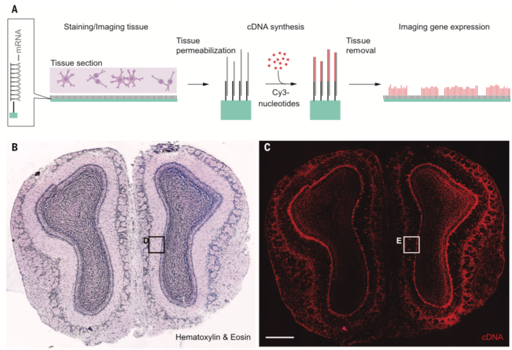 .

``` r
## select the directory where you have saved the Spatial Transcriptomics data
data_folder = '/path/to/ST_data/'
expr = read.table(paste0(data_folder,'/','Rep11_MOB_0_expr.txt'))
cell_locs = fread(paste0(data_folder,'/','Rep11_MOB_0_location.txt'))
```

-----

### 1\. Create Giotto object & process data

<details>

<summary>Expand</summary>  

``` r
## create
ST_test <- createGiottoObject(raw_exprs = expr, spatial_locs = cell_locs[,-1], instructions = instrs)
showGiottoInstructions(ST_test)

## filter
ST_test <- filterGiotto(gobject = ST_test,
                         expression_threshold = 1,
                         gene_det_in_min_cells = 1,
                         min_det_genes_per_cell = 100,
                         expression_values = c('raw'),
                         verbose = T)

## normalize
ST_test <- normalizeGiotto(gobject = ST_test)
ST_test <- addStatistics(gobject = ST_test)

## visualize
spatPlot2D(gobject = ST_test,
           save_param = list(save_folder = '2_Gobject', save_name = 'spatial_locations'))
```

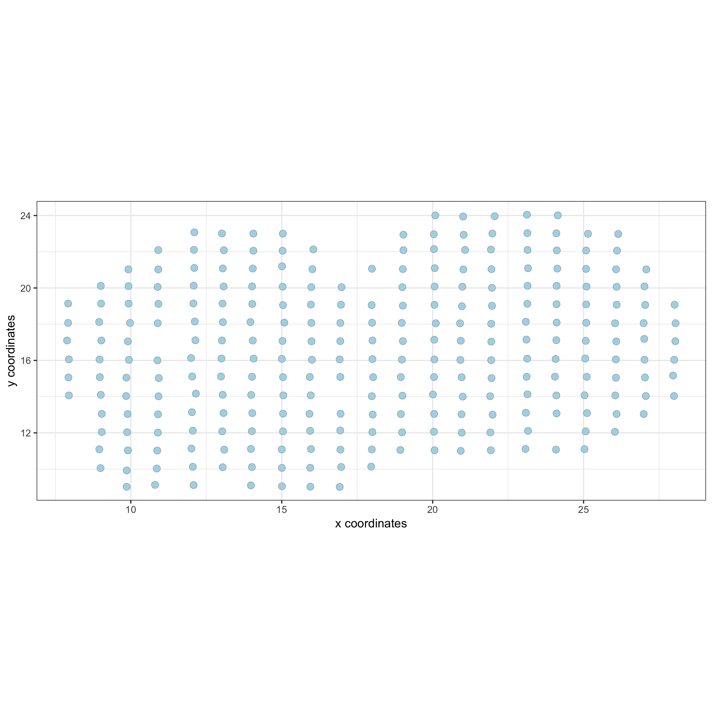

</details>

### 2\. dimension reduction

<details>

<summary>Expand</summary>  

``` r
## highly variable genes (HVG)
ST_test <- calculateHVG(gobject = ST_test)
gene_metadata = fDataDT(ST_test)
featgenes = gene_metadata[hvg == 'yes' & perc_cells > 4 & mean_expr_det > 0.25]$gene_ID

## run PCA on expression values (default)
ST_test <- runPCA(gobject = ST_test, genes_to_use = featgenes, expression_values = 'scaled', scale_unit = F)
signPCA(gobject = ST_test, expression_values = 'scaled', scale_unit = F, scree_ylim = c(0,1))
plotPCA_2D(ST_test,
           save_param = list(save_folder = '3_DimRed', save_name = 'PCA_reduction'))

## run UMAP and tSNE on PCA space (default)
ST_test <- runUMAP(ST_test, dimensions_to_use = 1:10, expression_values = 'scaled', n_threads = 2)
plotUMAP_2D(gobject = ST_test,
            save_param = list(save_folder = '3_DimRed', save_name = 'UMAP_reduction'))
```

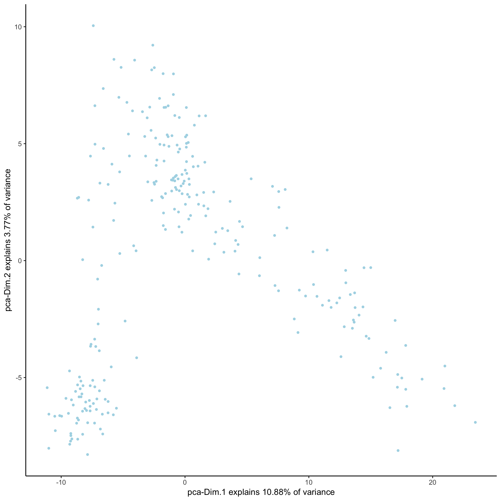

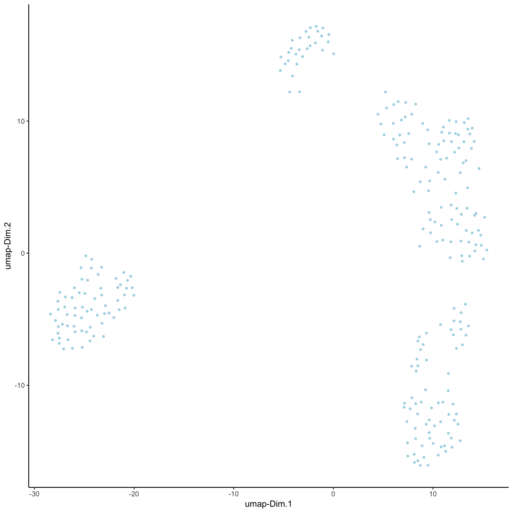

-----

</details>

### 3\. cluster

<details>

<summary>Expand</summary>  

``` r

## Leiden clustering
ST_test <- createNearestNetwork(gobject = ST_test, dimensions_to_use = 1:10, k = 10)
ST_test <- doLeidenCluster(gobject = ST_test, resolution = 0.2, n_iterations = 200)
plotUMAP_2D(gobject = ST_test, cell_color = 'leiden_clus', point_size = 3,
            save_param = list(save_folder = '4_Cluster', save_name = 'UMAP_leiden'))
```

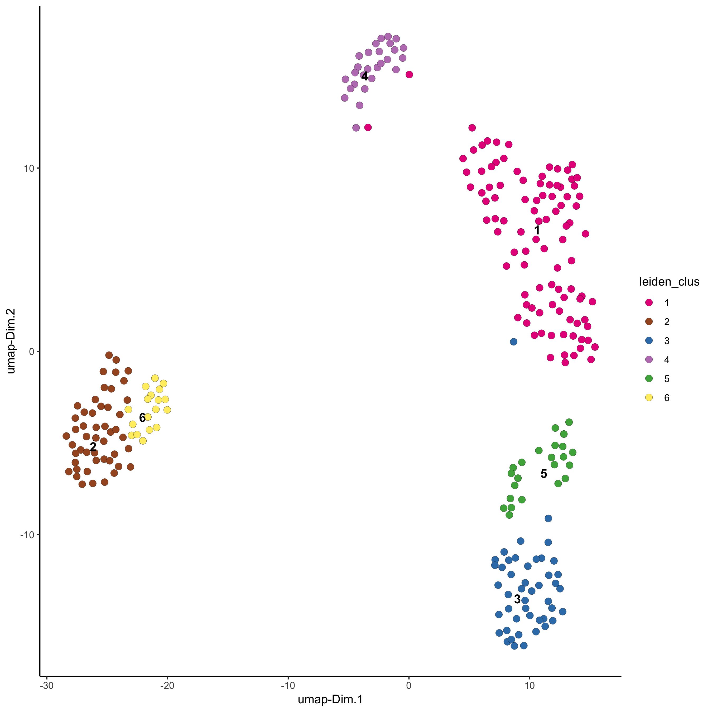

-----

</details>

### 4\. co-visualize

<details>

<summary>Expand</summary>  

``` r
spatDimPlot2D(gobject = ST_test, cell_color = 'leiden_clus', 
               dim_point_size = 2, spatial_point_size = 6,
              save_param = list(save_folder = '5_Covisuals', save_name = 'covisual_kmeans'))
```

Co-visualzation: 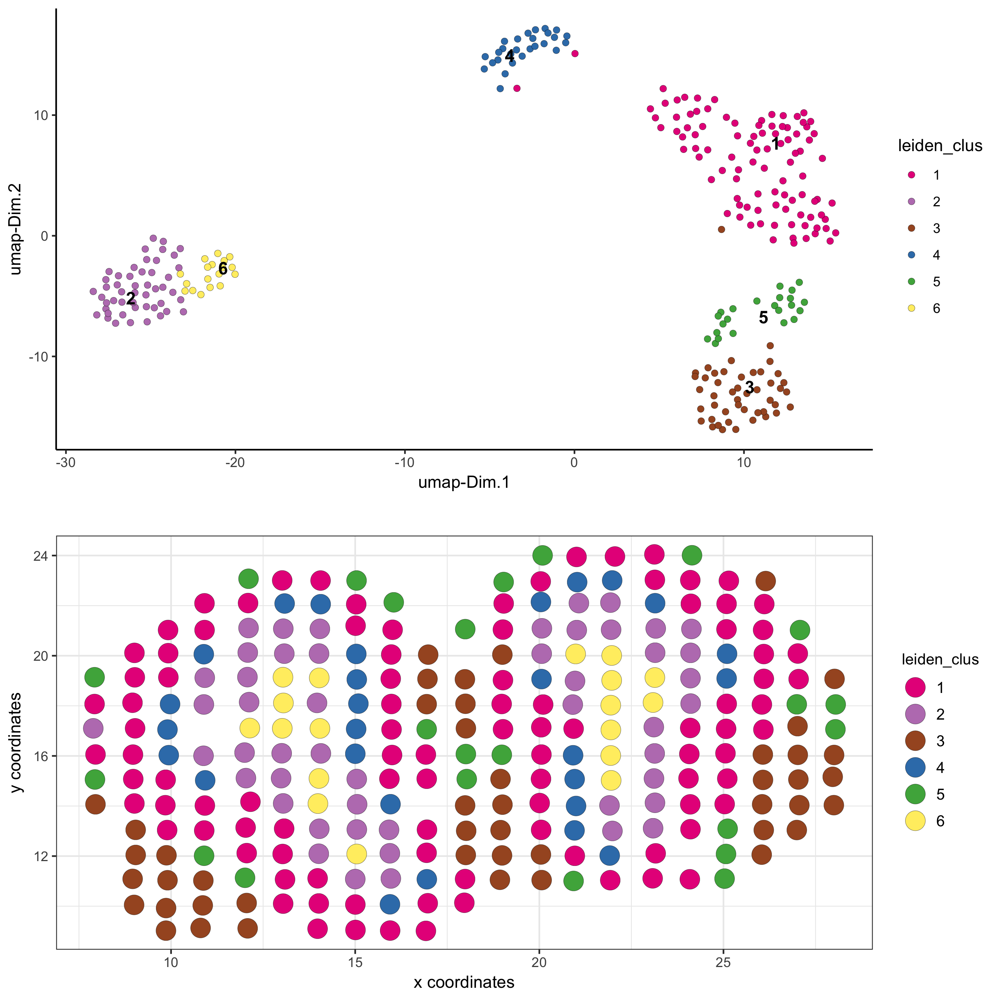

-----

</details>

### 5\. differential expression

<details>

<summary>Expand</summary>  

``` r
## gini ##
## very specific to a cluster, but not necessarily expressed in all cells of that cluster
gini_markers_subclusters = findMarkers_one_vs_all(gobject = ST_test,
                                                  method = 'gini',
                                                  expression_values = 'normalized',
                                                  cluster_column = 'leiden_clus',
                                                  min_genes = 20,
                                                  min_expr_gini_score = 0.5,
                                                  min_det_gini_score = 0.5)
topgenes_gini = gini_markers_subclusters[, head(.SD, 2), by = 'cluster']$genes

# violinplot
violinPlot(ST_test, genes = unique(topgenes_gini), cluster_column = 'leiden_clus',
           strip_text = 8, strip_position = 'top',
           save_param = c(save_folder = '6_DEG', save_name = 'violinplot_gini',  base_width = 5, base_height = 10))

# cluster heatmap
plotMetaDataHeatmap(ST_test, selected_genes = topgenes_gini,metadata_cols = c('leiden_clus'),
                    save_param = c(save_folder = '6_DEG', save_name = 'metaheatmap_gini'))


# visualize genes
topgenes_gini = gini_markers_subclusters[, head(.SD, 1), by = 'cluster']$genes
spatDimGenePlot2D(ST_test, expression_values = 'scaled',
                  genes = topgenes_gini,
                  plot_alignment = 'horizontal', cow_n_col = 1, point_size = 2,
                  genes_high_color = 'red', genes_mid_color = 'white', genes_low_color = 'darkblue', midpoint = 0,
                  save_param = c(save_folder = '6_DEG', save_name = 'genes_gini', base_width = 6, base_height = 14))


## scran ##
scran_markers_subclusters = findMarkers_one_vs_all(gobject = ST_test,
                                                   method = 'scran',
                                                   expression_values = 'normalized',
                                                   cluster_column = 'leiden_clus')
topgenes_scran = scran_markers_subclusters[, head(.SD, 2), by = 'cluster_ID']$gene_ID

# violinplot
violinPlot(ST_test, genes = unique(topgenes_scran), cluster_column = 'leiden_clus',
           strip_text = 10, strip_position = 'top',
           save_param = c(save_folder = '6_DEG', save_name = 'violinplot_scran',  base_width = 5, base_height = 10))

# cluster heatmap
plotMetaDataHeatmap(ST_test, selected_genes = topgenes_scran, metadata_cols = c('leiden_clus'),
                    save_param = c(save_folder = '6_DEG', save_name = 'metaheatmap_scran'))

# visualize genes
topgenes_scran = scran_markers_subclusters[, head(.SD, 1), by = 'cluster_ID']$gene_ID
spatDimGenePlot2D(ST_test, expression_values = 'scaled',
                  genes = topgenes_scran,
                  plot_alignment = 'horizontal', cow_n_col = 1, point_size = 2,
                  genes_high_color = 'red', genes_mid_color = 'white', genes_low_color = 'darkblue', midpoint = 0,
                  save_param = c(save_folder = '6_DEG', save_name = 'genes_scran', base_width = 6, base_height = 14))
```

Gini: - violinplot: 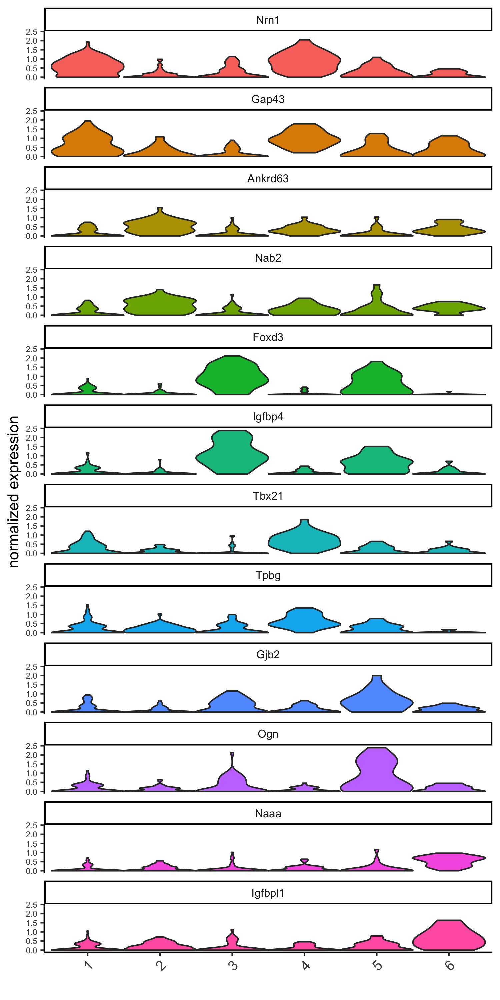

  - Heatmap clusters: 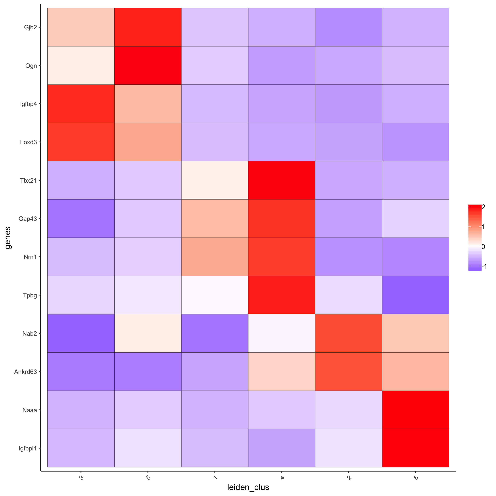

  - Genes: 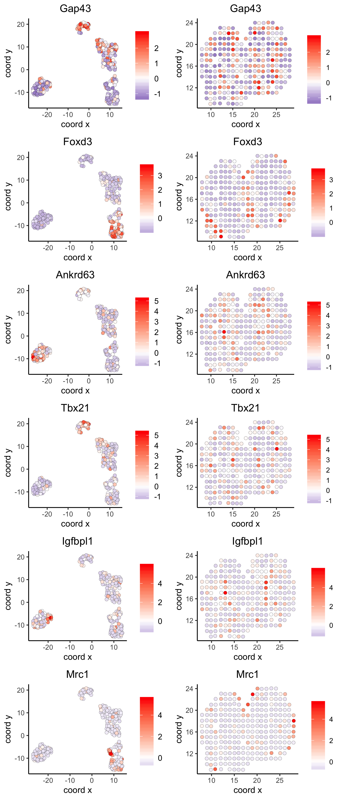

Scran: - violinplot: 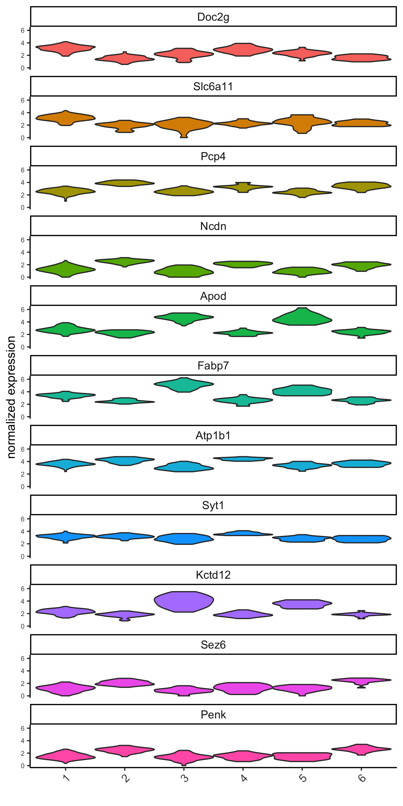

  - Heatmap clusters: 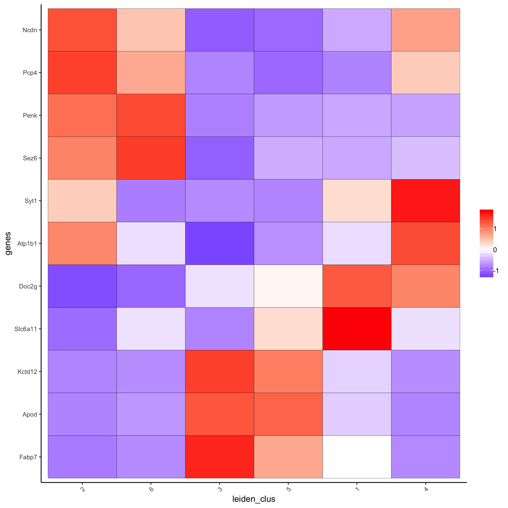

  - Genes: 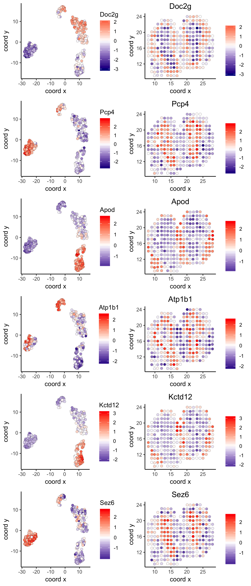

-----

</details>

### 6\. cell-type annotation

<details>

<summary>Expand</summary>  

``` r

# not available at the moment
```

Markers for interneuron genes: 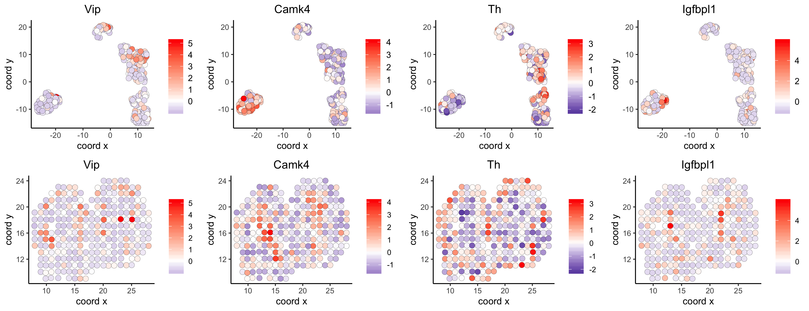

-----

</details>

### 7\. spatial grid

<details>

<summary>Expand</summary>  

``` r
## create spatial grid
ST_test <- createSpatialGrid(gobject = ST_test,
                              sdimx_stepsize = 2,
                              sdimy_stepsize = 2,
                              minimum_padding = 0)
spatPlot2D(ST_test, cell_color = 'leiden_clus', show_grid = T,
           grid_color = 'lightblue', spatial_grid_name = 'spatial_grid', 
           save_param = c(save_folder = '8_grid', save_name = 'grid'))

## identify spatial patterns with spatial grid #
pattern_osm = detectSpatialPatterns(gobject = ST_test, 
                                    spatial_grid_name = 'spatial_grid',
                                    min_cells_per_grid = 2, 
                                    scale_unit = T, 
                                    PC_zscore = 1, 
                                    show_plot = T)

# dimension 1
showPattern2D(ST_test, pattern_osm, dimension = 1, point_size = 4,
              save_param = c(save_folder = '8_grid', save_name = 'pattern1_PCA'))
showPatternGenes(ST_test, pattern_osm, dimension = 1,
                 save_param = c(save_folder = '8_grid', save_name = 'pattern1_genes'))

# dimension 2
showPattern2D(ST_test, pattern_osm, dimension = 2, point_size = 4,
              save_param = c(save_folder = '8_grid', save_name = 'pattern2_PCA'))
showPatternGenes(ST_test, pattern_osm, dimension = 2,
                 save_param = c(save_folder = '8_grid', save_name = 'pattern2_genes'))

view_pattern_genes = selectPatternGenes(pattern_osm, return_top_selection = TRUE)
```

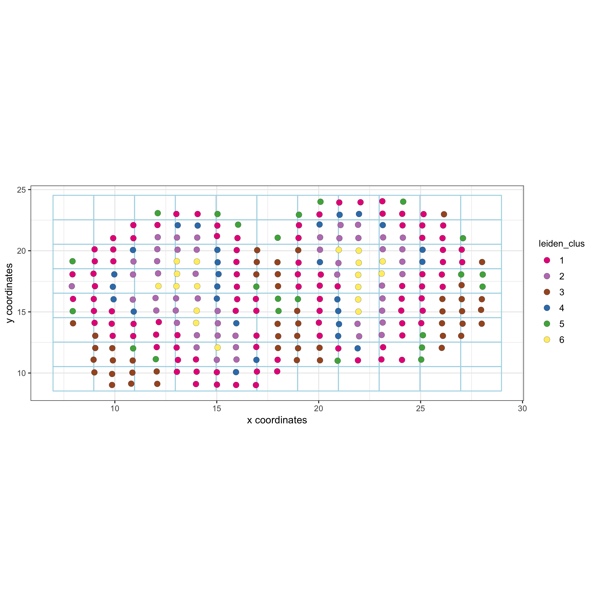

Dimension 1: 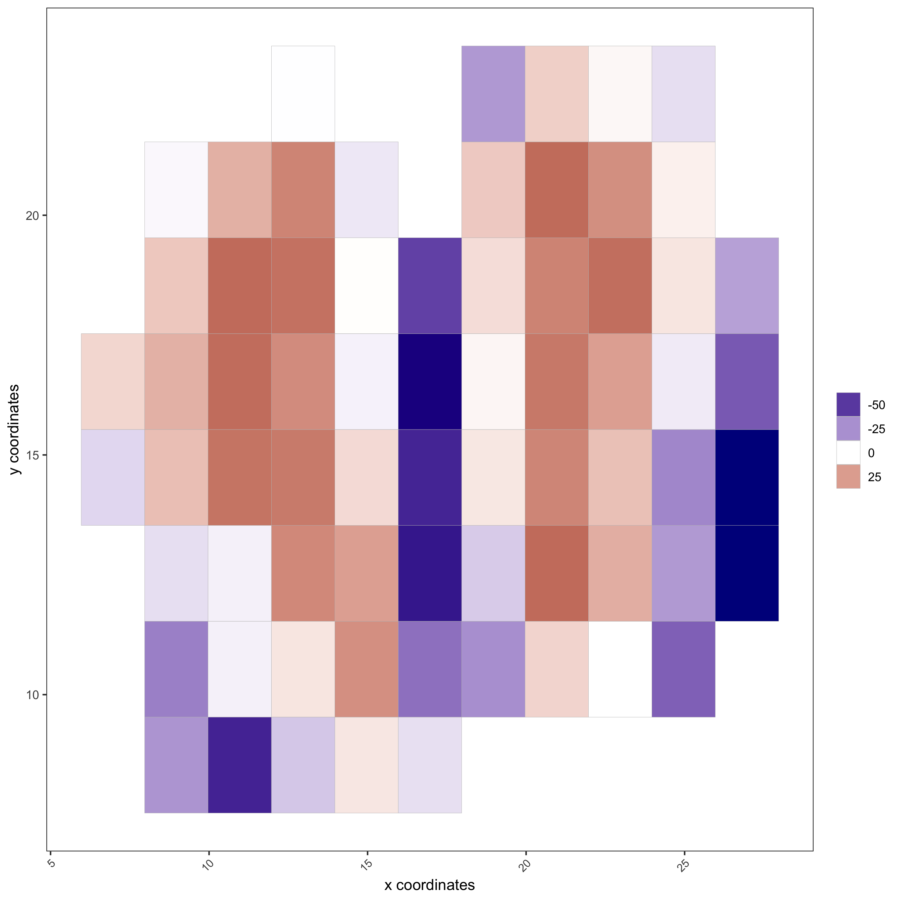
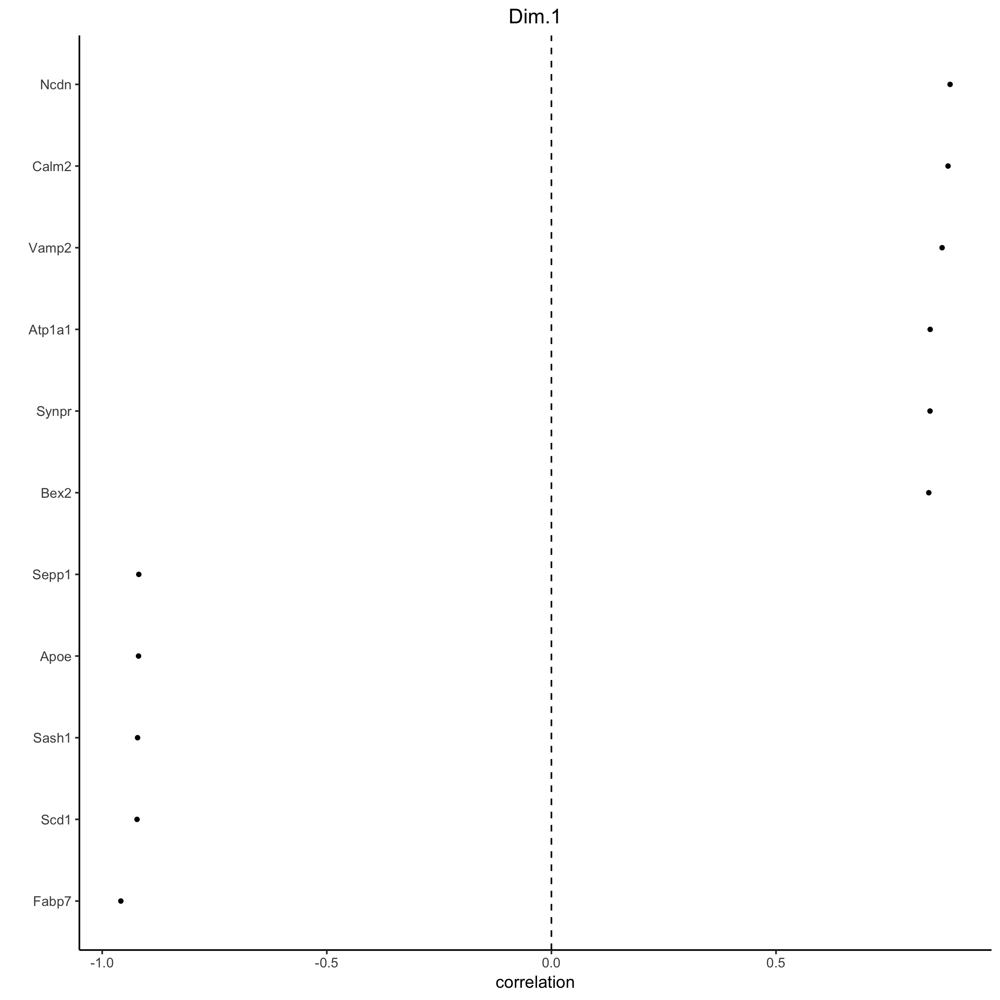

Dimension 2: 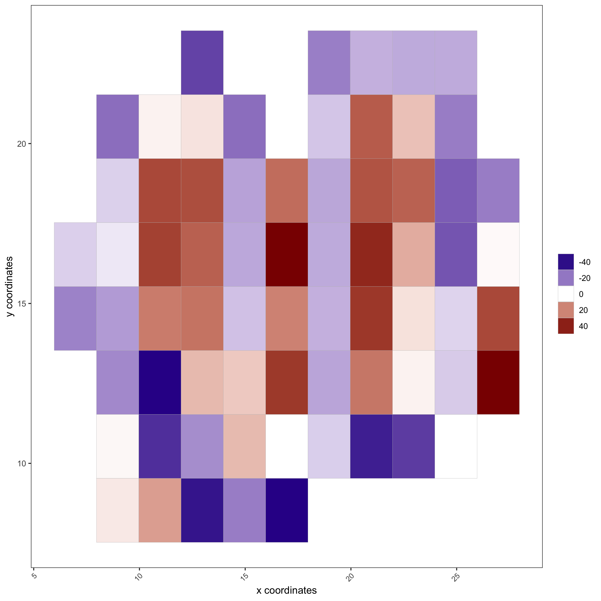

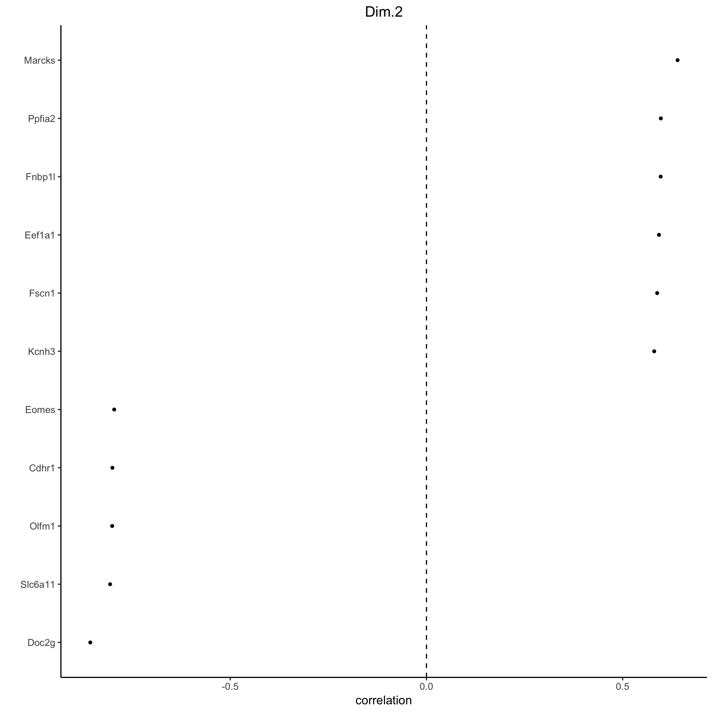

-----

</details>

### 8\. spatial network

<details>

<summary>Expand</summary>  

``` r
ST_test <- createSpatialNetwork(gobject = ST_test, k = 5)
spatPlot2D(gobject = ST_test, show_network = T,
           network_color = 'blue', spatial_network_name = 'spatial_network',
           save_param = c(save_name = 'spatial_network_k5', save_folder = '9_spatial_network'))
```

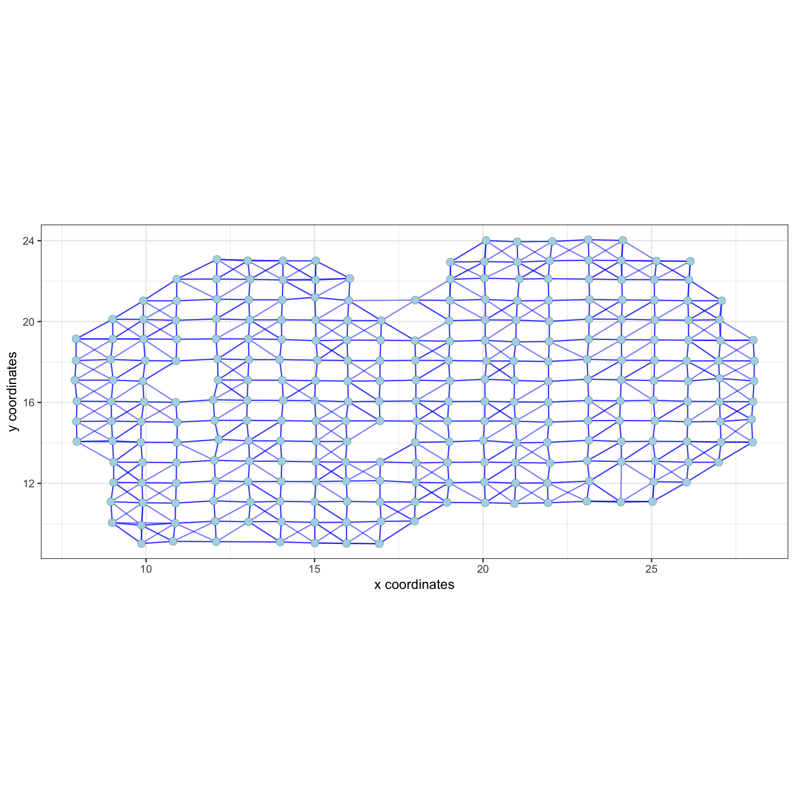

-----

</details>

### 9\. spatial genes

<details>

<summary>Expand</summary>  

``` r
## kmeans binarization
kmtest = binGetSpatialGenes(ST_test, bin_method = 'kmeans',
                            do_fisher_test = T, community_expectation = 5,
                            spatial_network_name = 'spatial_network', verbose = T)

spatGenePlot2D(ST_test, expression_values = 'scaled',
               genes = kmtest$genes[1:6], cow_n_col = 2, point_size = 3,
               genes_high_color = 'red', genes_mid_color = 'white', genes_low_color = 'darkblue', midpoint = 0,
               save_param = c(save_name = 'spatial_genes_km', save_folder = '10_spatial_genes'))

## rank binarization
ranktest = binGetSpatialGenes(ST_test, bin_method = 'rank',
                              do_fisher_test = T, community_expectation = 5,
                              spatial_network_name = 'spatial_network', verbose = T)

spatGenePlot2D(ST_test, expression_values = 'scaled',
               genes = ranktest$genes[1:6], cow_n_col = 2, point_size = 3,
               genes_high_color = 'red', genes_mid_color = 'white', genes_low_color = 'darkblue', midpoint = 0,
               save_param = c(save_name = 'spatial_genes_rank', save_folder = '10_spatial_genes'))

# distance
spatial_genes = calculate_spatial_genes_python(gobject = ST_test,
                                               expression_values = 'scaled',
                                               rbp_p=0.99, examine_top=0.1)

spatGenePlot2D(ST_test, expression_values = 'scaled',
                  genes = spatial_genes$genes[1:6], cow_n_col = 2, point_size = 3,
                  genes_high_color = 'red', genes_mid_color = 'white', genes_low_color = 'darkblue', midpoint = 0,
                  save_param = c(save_name = 'spatial_genes', save_folder = '10_spatial_genes'))
```

Spatial genes: - kmeans 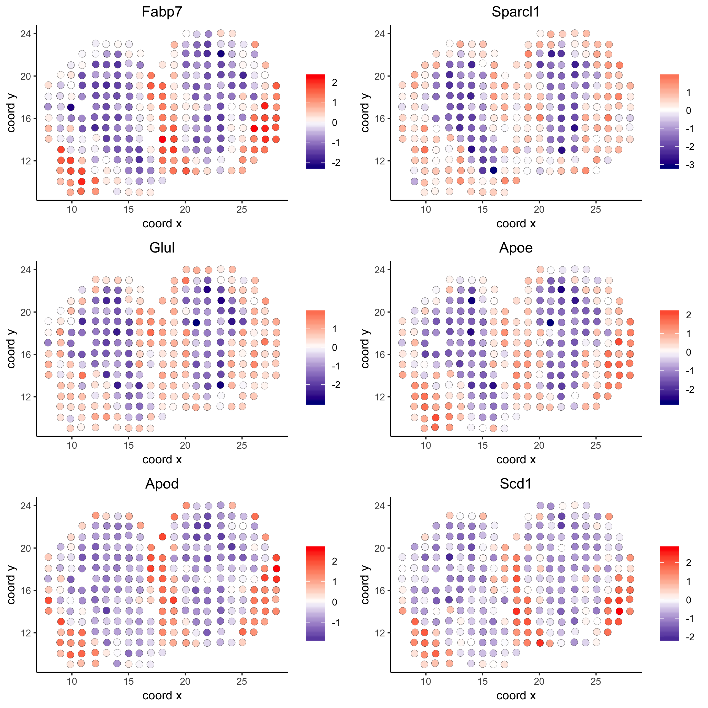

  - rank 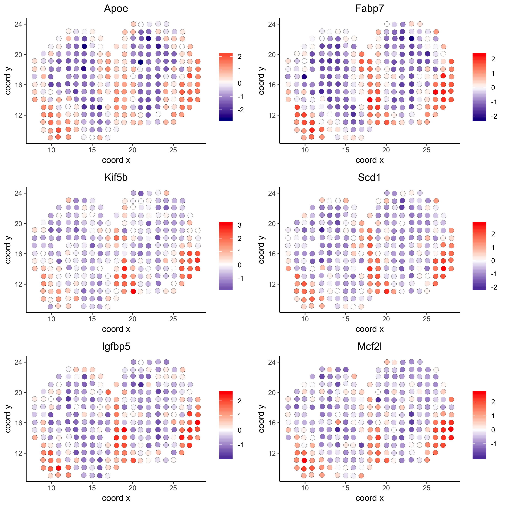

  - distance 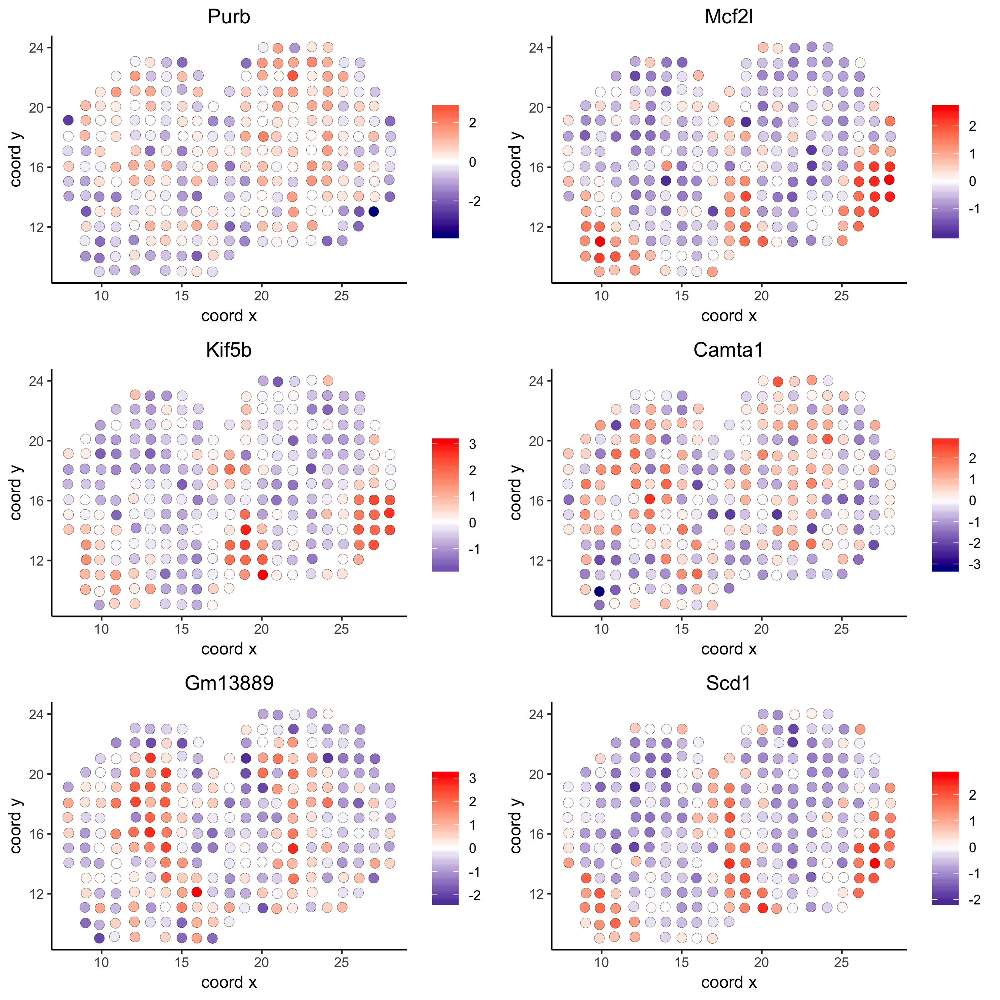

-----

</details>

### 10\. HMRF domains

<details>

<summary>Expand</summary>  

not available for this specific dataset

-----

</details>

### 11\. Cell-cell preferential proximity

<details>

<summary>Expand</summary>  


``` r
## calculate frequently seen proximities
cell_proximities = cellProximityEnrichment(gobject = ST_test,
                                           cluster_column = 'leiden_clus',
                                           spatial_network_name = 'spatial_network',
                                           number_of_simulations = 1000)

## barplot
cellProximityBarplot(gobject = ST_test, CPscore = cell_proximities, min_orig_ints = 5, min_sim_ints = 5, 
                     save_param = c(save_name = 'barplot_cell_cell_enrichment', save_folder = '12_cell_proxim'))
## heatmap
cellProximityHeatmap(gobject = ST_test, CPscore = cell_proximities, order_cell_types = T, scale = T,
                     color_breaks = c(-1.5, 0, 1.5), color_names = c('blue', 'white', 'red'),
                     save_param = c(save_name = 'heatmap_cell_cell_enrichment', save_folder = '12_cell_proxim', unit = 'in'))
## network
cellProximityNetwork(gobject = ST_test, CPscore = cell_proximities, remove_self_edges = T, only_show_enrichment_edges = F,
                     save_param = c(save_name = 'network_cell_cell_enrichment', save_folder = '12_cell_proxim'))

## visualization
spec_interaction = "2--6"
cellProximitySpatPlot2D(gobject = ST_test,
                        interaction_name = spec_interaction,
                        cluster_column = 'leiden_clus', show_network = T,
                        cell_color = 'leiden_clus', coord_fix_ratio = 0.5,
                        point_size_select = 4, point_size_other = 2,
                        save_param = c(save_name = 'selected_enrichment', save_folder = '12_cell_proxim'))
```

barplot:  
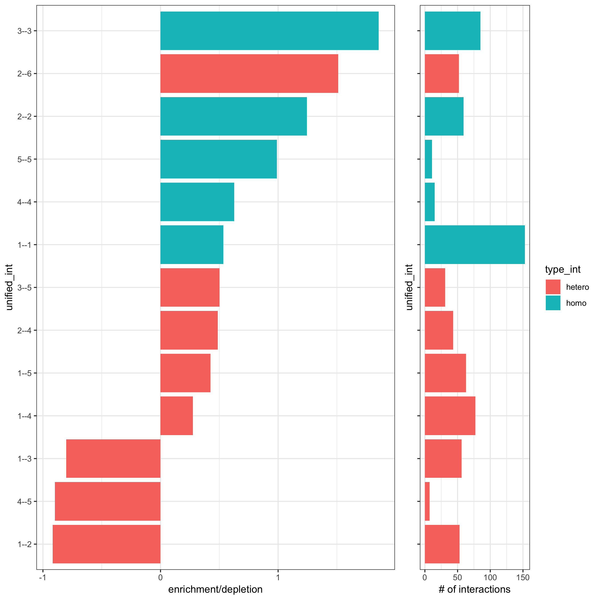

heatmap:  
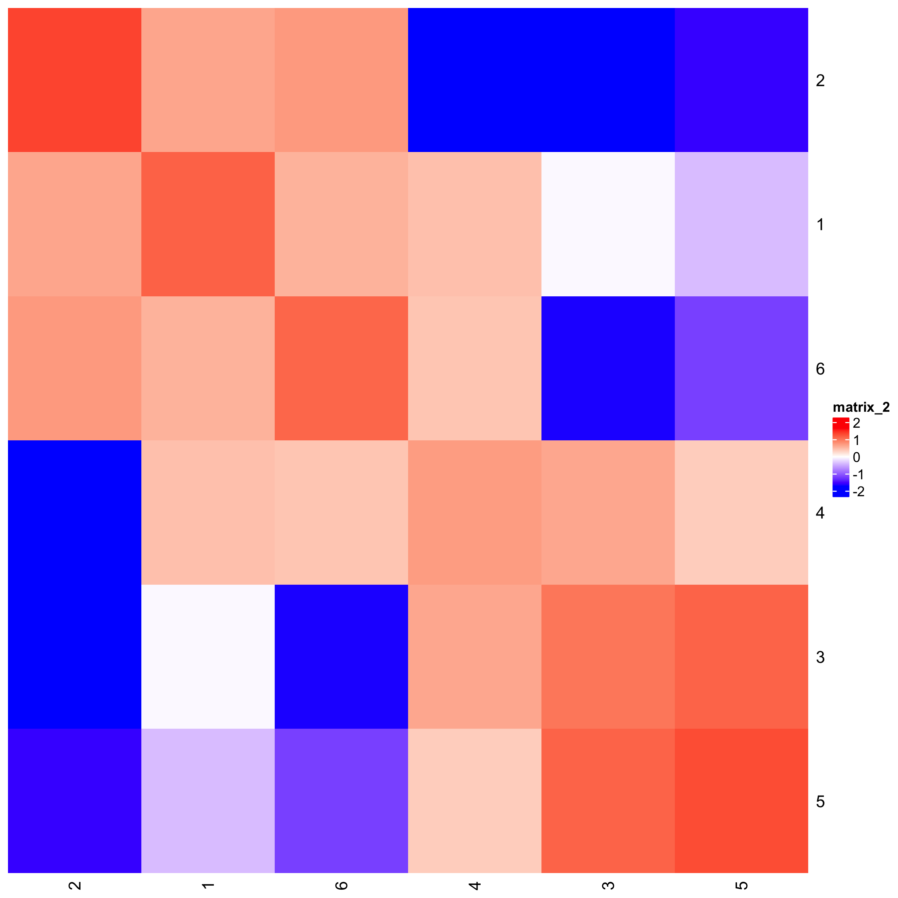

network:  
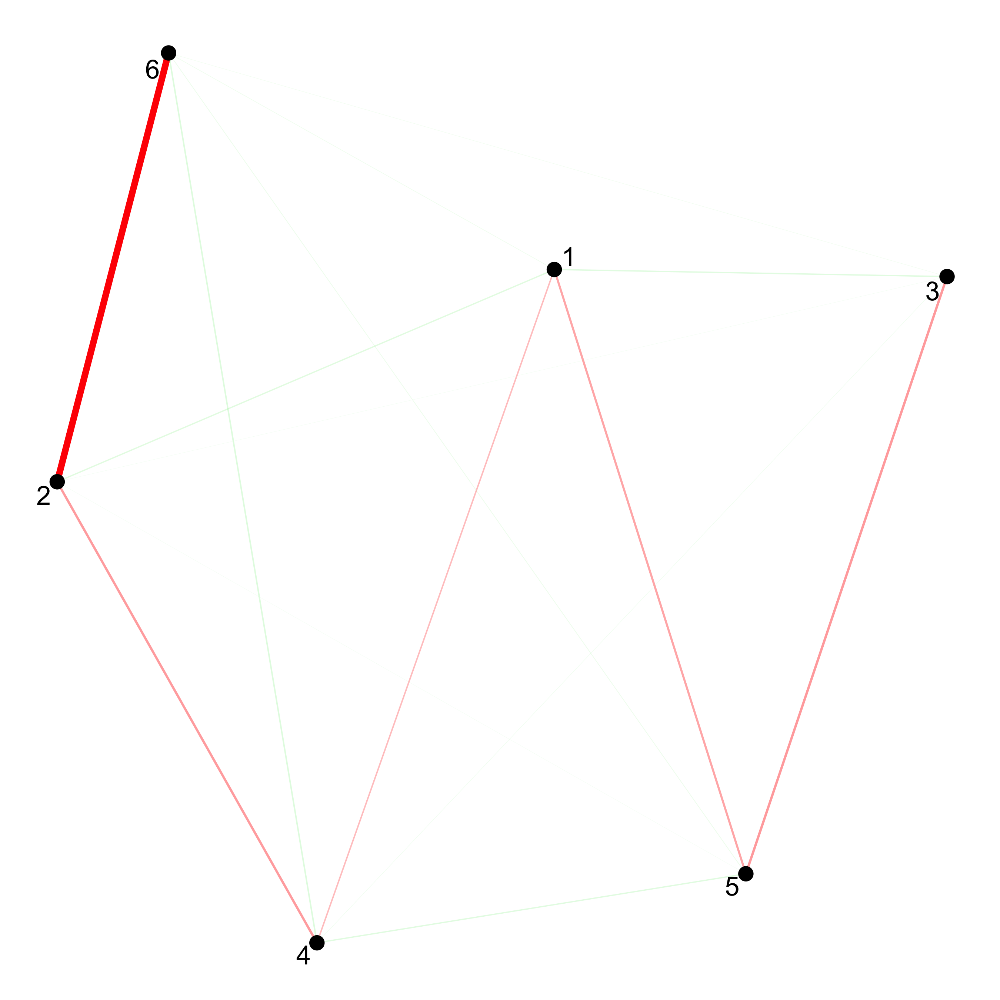

selected enrichment:  
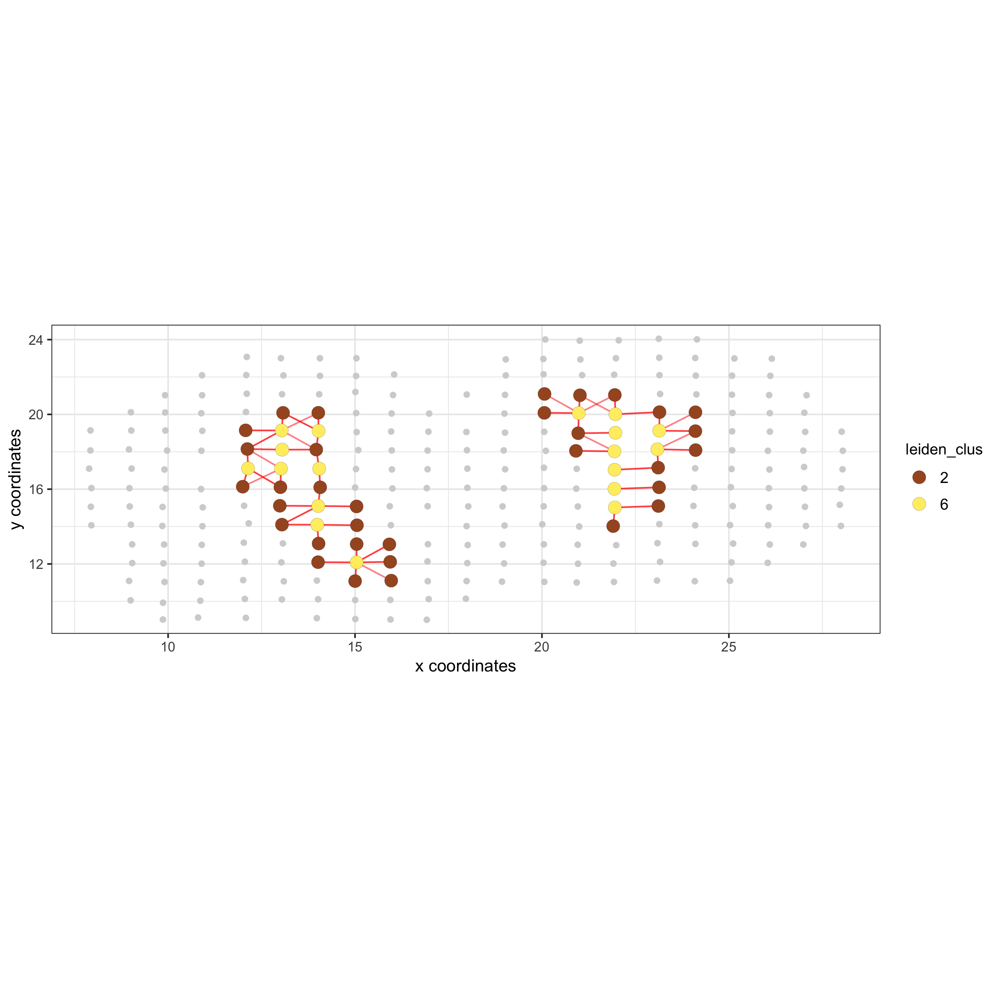

-----

</details>
