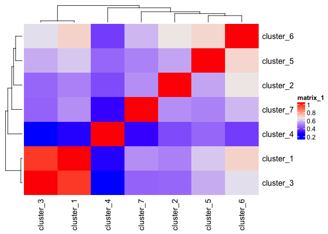

<!-- README.md is generated from README.Rmd. Please edit that file -->
``` r
library(Giotto)
```

### Data input

-   prepare cell coordinates by stitching imaging fields
-   load cortex/svz gene expression matrix

``` r
## prepare cell locations
VC_locs = fread(system.file("extdata", "cortex_svz_centroids_rotated.csv", package = "Giotto"))
my_offset_file = data.table(field = c(0, 1, 2, 3, 4, 5, 6),
                            x_offset = c(0, 2048, 2048, 2048, 675, 2048, 675),
                            y_offset = c(2048, 2048, 2048, 2048,0, 0, 2048))
stitch_file = stitchFieldCoordinates(location_file = VC_locs, offset_file = my_offset_file,
                                     cumulate_offset_x = T, cumulate_offset_y = F,
                                     field_col = 'Field of View',
                                     reverse_final_x = F,
                                     reverse_final_y = T)
stitch_file    = stitch_file[,.(X_final, Y_final)]
my_offset_file = my_offset_file[,.(field, x_offset_final, y_offset_final)]

## visual cortex expression DATA ##
VC_exprs = read.table(system.file("extdata", "cortex_svz_expression.txt", package = "Giotto"))
```

------------------------------------------------------------------------

 

### 1. Create Giotto object & process data

``` r
## create
VC_test <- createGiottoObject(raw_exprs = VC_exprs, spatial_locs = stitch_file, offset_file = my_offset_file)
## filter
VC_test <- filterGiotto(gobject = VC_test,
                        expression_threshold = 1,
                        minimum_detected_genes = 10,
                        minimum_expression_in_cell = 10,
                        expression_values = c('raw'),
                        verbose = T)
#> Number of cells removed:  0  out of  913 
#> Number of genes removed:  0  out of  10000
## normalize
VC_test <- normalizeGiotto(gobject = VC_test)
# gene and cell statistics
VC_test <- addStatistics(gobject = VC_test)
# adjust for covariates
VC_test = adjustGiottoMatrix(gobject = VC_test, expression_values = c('normalized'),
                             batch_columns = NULL, covariate_columns = c('nr_genes', 'total_expr'),
                             return_gobject = TRUE,
                             update_slot = c('custom'))
# plain visualization
visPlot(gobject = VC_test)
#> first and second dimenion need to be defined, default is first 2
```


------------------------------------------------------------------------

 

### 2. dimension reduction

``` r
## HVG genes
VC_test <- calculateHVG(gobject = VC_test)
#> 
#>   no  yes 
#> 8771 1229
```


``` r
# selected genes
gene_metadata = fDataDT(VC_test)
featgenes = gene_metadata[(hvg == 'yes') & perc_cells > 4 & mean_expr_det > 0.5]$gene_ID
# pca
VC_test <- runPCA(gobject = VC_test, genes_to_use = featgenes)
# umap
VC_test <- runUMAP(VC_test)
# tsne
VC_test <- runtSNE(VC_test)
```

------------------------------------------------------------------------

 

### 3. cluster

``` r
## cluster
# SNN
VC_test <- createNearestNetwork(gobject = VC_test)

# cluster on network
VC_test = doLeidenCluster(gobject = VC_test, resolution = 0.5,
                          python_path = "/Users/rubendries/Bin/anaconda3/envs/py36/bin/python")

plotUMAP(gobject = VC_test, cell_color = 'pleiden_clus', point_size = 1.5,
        show_NN_network = T, edge_alpha = 0.1)
```


------------------------------------------------------------------------

 

### 4. co-visualize

``` r
# spatial
visPlot(gobject = VC_test, cell_color = 'pleiden_clus', point_size = 2)
#> first and second dimenion need to be defined, default is first 2
```


``` r
# expression and spatial
visSpatDimPlot(gobject = VC_test, cell_color = 'pleiden_clus', dim_point_size = 2, spatial_point_size = 2)
#> first and second dimenion need to be defined, default is first 2
```


``` r
# relationship between clusters
clusterheatmap <- showClusterHeatmap(gobject = VC_test, cluster_column = 'pleiden_clus')
print(clusterheatmap)
```



------------------------------------------------------------------------

 

### 5. differential expression

``` r
# pairwise t-test #
gene_markers = findMarkers(gobject = VC_test, cluster_column = 'pleiden_clus')
gene_markers_pair = findMarkers(gobject = VC_test, cluster_column = 'pleiden_clus',
                                group_1 = c(1,2), group_2 = c(3,4,5))

# Gini markers #
gini_markers = findGiniMarkers(gobject = VC_test, cluster_column = 'pleiden_clus')
gini_markers_DT = gini_markers[, head(.SD, 3), by = 'cluster']
myheat = plotHeatmap(gobject = VC_test, genes = gini_markers_DT$genes,
                     cluster_column = 'pleiden_clus')
```


``` r
violinPlot(gobject = VC_test, genes = c('Dlx1', 'Rtn4r', 'Csf1r', 'Cldn11', 'Cldn5', 'Igfbp5'),
           cluster_column = 'pleiden_clus')
```


------------------------------------------------------------------------

 

### 6. spatial network + grid

``` r
## spatial network
VC_test <- createSpatialNetwork(gobject = VC_test, k = 3)
VC_test <- createSpatialNetwork(gobject = VC_test, k = 100, maximum_distance = 200, minimum_k = 1, name = 'distance_network')
## spatial grid
VC_test <- createSpatialGrid(gobject = VC_test,
                             sdimx_stepsize = 500,
                             sdimy_stepsize = 500,
                             minimum_padding = 50 )
# spatial pattern genes
VC_test = detectSpatialPatterns(gobject = VC_test, dims_to_plot = 2)
```


    #> [1] "Dim.1"
    #> [1] "Dim.2"


``` r
## spatial genes
VC_test <- calculateSpatialGenes(gobject = VC_test, min_N = 20)
spatial_gene_DT <- calculateSpatialGenes(gobject = VC_test , method = 'kmeans', return_gobject = F)
# visualize
visGenePlot(gobject = VC_test,  genes = c('Enpp2', 'Aqp1', 'Shank1', 'Clic6', 'Nptxr', 'Rtn4r'),
            scale_alpha_with_expression = T)
```


