<!-- mouse_cortex_example.md is generated from mouse_cortex_example.Rmd Please edit that file -->
``` r
library(Giotto)
```

### Data input

-   load cortex/svz gene expression matrix
-   prepare cell coordinates by stitching imaging fields

Several fields - containing 100's of cells - in the mouse cortex and subventricular zone were imaged. The coordinates of the cells within each field are independent of eachother, so in order to visualize and process all cells together imaging fields will be stitched together by providing x and y-offset values specific to each field. These offset values are estimates based on the original raw image:
 .

``` r
## visual cortex expression DATA ##
VC_exprs = read.table(system.file("extdata", "cortex_svz_expression.txt", package = "Giotto"))

## prepare cell locations
VC_locs = fread(system.file("extdata", "cortex_svz_centroids_rotated.csv", package = "Giotto"))
my_offset_file = data.table(field = c(0, 1, 2, 3, 4, 5, 6),
                            x_offset = c(0, 2048, 2048, 2048, 675, 2048, 675),
                            y_offset = c(2048, 2048, 2048, 2048,0, 0, 2048))
stitch_file = stitchFieldCoordinates(location_file = VC_locs, offset_file = my_offset_file,
                                     cumulate_offset_x = T, cumulate_offset_y = F,
                                     field_col = 'Field of View',
                                     reverse_final_x = F,
                                     reverse_final_y = T)
stitch_file    = stitch_file[,.(X_final, Y_final)]
my_offset_file = my_offset_file[,.(field, x_offset_final, y_offset_final)]
```

------------------------------------------------------------------------

 

### 1. Create Giotto object & process data

``` r
## create
VC_test <- createGiottoObject(raw_exprs = VC_exprs, spatial_locs = stitch_file, offset_file = my_offset_file)
## filter
VC_test <- filterGiotto(gobject = VC_test,
                        expression_threshold = 1,
                        minimum_detected_genes = 10,
                        minimum_expression_in_cell = 10,
                        expression_values = c('raw'),
                        verbose = T)
#> Number of cells removed:  0  out of  913 
#> Number of genes removed:  0  out of  10000
## normalize
VC_test <- normalizeGiotto(gobject = VC_test)
# gene and cell statistics
VC_test <- addStatistics(gobject = VC_test)
# adjust for covariates
VC_test = adjustGiottoMatrix(gobject = VC_test, expression_values = c('normalized'),
                             batch_columns = NULL, covariate_columns = c('nr_genes', 'total_expr'),
                             return_gobject = TRUE,
                             update_slot = c('custom'))
# plain visualization
visPlot(gobject = VC_test)
#> first and second dimenion need to be defined, default is first 2
```

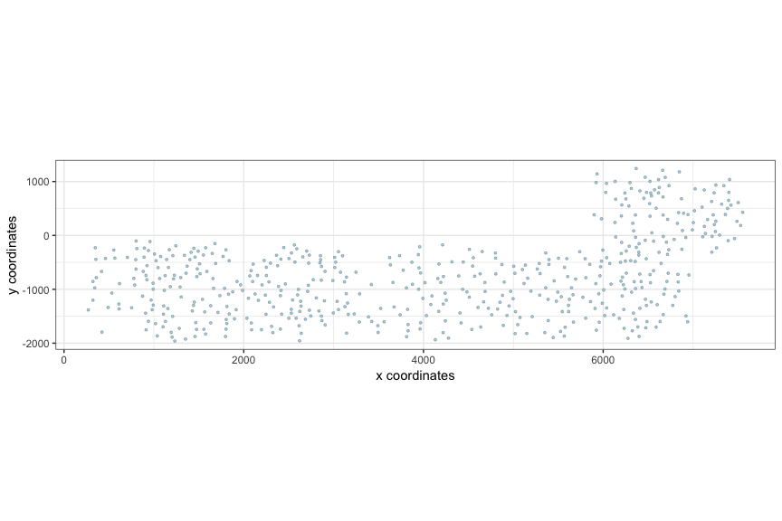

------------------------------------------------------------------------

 

### 2. dimension reduction

``` r
## HVG genes
VC_test <- calculateHVG(gobject = VC_test)
#> 
#>   no  yes 
#> 8771 1229
```

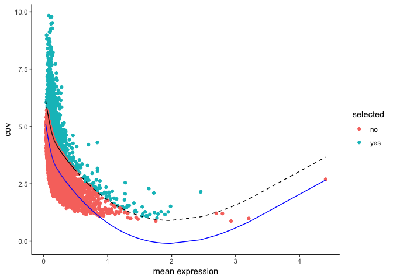

``` r
# selected genes
gene_metadata = fDataDT(VC_test)
featgenes = gene_metadata[(hvg == 'yes') & perc_cells > 4 & mean_expr_det > 0.5]$gene_ID
# pca
VC_test <- runPCA(gobject = VC_test, genes_to_use = featgenes)
# umap
VC_test <- runUMAP(VC_test)
# tsne
VC_test <- runtSNE(VC_test)
```

------------------------------------------------------------------------

 

### 3. cluster

``` r
## cluster
# SNN
VC_test <- createNearestNetwork(gobject = VC_test)

# cluster on network
VC_test = doLeidenCluster(gobject = VC_test, resolution = 0.5,
                          python_path = "/Users/rubendries/Bin/anaconda3/envs/py36/bin/python")

plotUMAP(gobject = VC_test, cell_color = 'pleiden_clus', point_size = 1.5,
        show_NN_network = T, edge_alpha = 0.1)
```

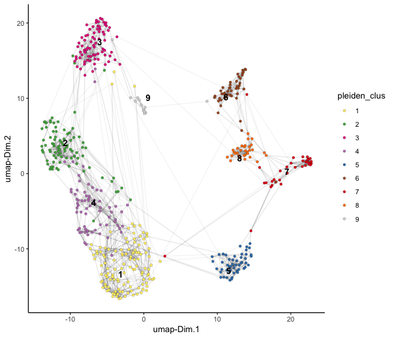

------------------------------------------------------------------------

 

### 4. co-visualize

``` r
# expression and spatial
visSpatDimPlot(gobject = VC_test, cell_color = 'pleiden_clus', dim_point_size = 2, spatial_point_size = 2)
#> first and second dimenion need to be defined, default is first 2
```

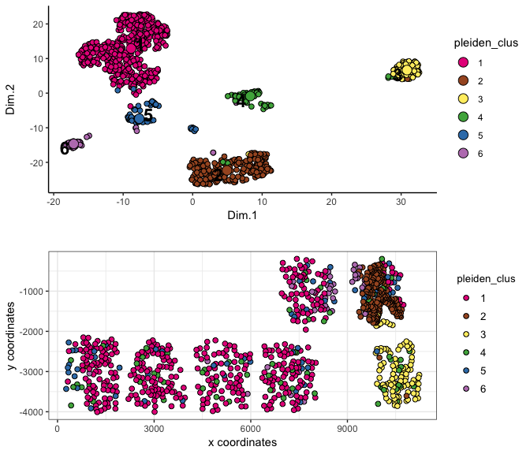

``` r
# relationship between clusters
clusterheatmap <- showClusterHeatmap(gobject = VC_test, cluster_column = 'pleiden_clus')
print(clusterheatmap)
```

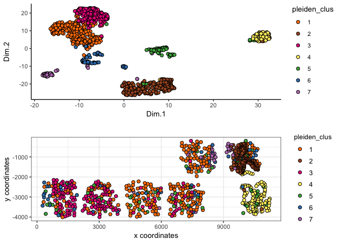

------------------------------------------------------------------------

 

### 5. differential expression

``` r
# pairwise t-test #
gene_markers = findMarkers(gobject = VC_test, cluster_column = 'pleiden_clus')
gene_markers_pair = findMarkers(gobject = VC_test, cluster_column = 'pleiden_clus',
                                group_1 = c(1,2), group_2 = c(3,4,5))

# Gini markers #
gini_markers = findGiniMarkers(gobject = VC_test, cluster_column = 'pleiden_clus')
gini_markers_DT = gini_markers[, head(.SD, 3), by = 'cluster']
myheat = plotHeatmap(gobject = VC_test, genes = gini_markers_DT$genes,
                     cluster_column = 'pleiden_clus')
```

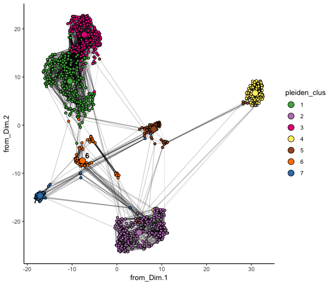

``` r
violinPlot(gobject = VC_test, genes = c('Dlx1', 'Rtn4r', 'Csf1r', 'Cldn11', 'Cldn5', 'Igfbp5'),
           cluster_column = 'pleiden_clus')
```

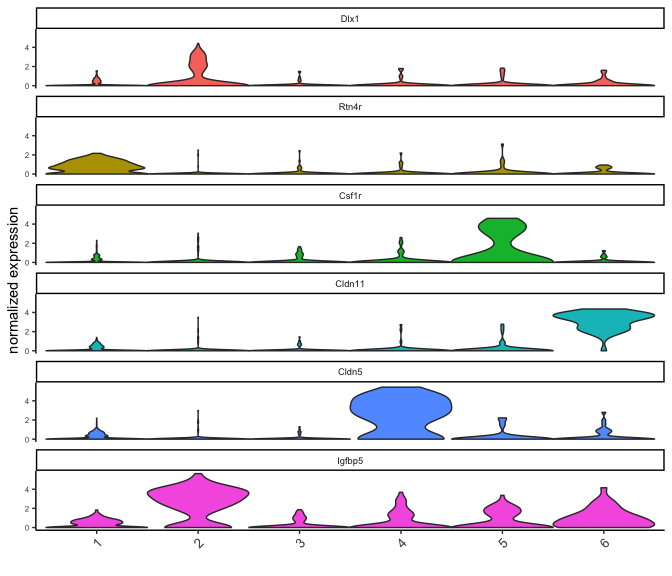

------------------------------------------------------------------------

 

### 6. spatial network + grid

``` r
## spatial network
VC_test <- createSpatialNetwork(gobject = VC_test, k = 3)
VC_test <- createSpatialNetwork(gobject = VC_test, k = 100, maximum_distance = 200, minimum_k = 1, name = 'distance_network')
## spatial grid
VC_test <- createSpatialGrid(gobject = VC_test,
                             sdimx_stepsize = 500,
                             sdimy_stepsize = 500,
                             minimum_padding = 50 )
# spatial pattern genes
VC_test = detectSpatialPatterns(gobject = VC_test, dims_to_plot = 2)
```

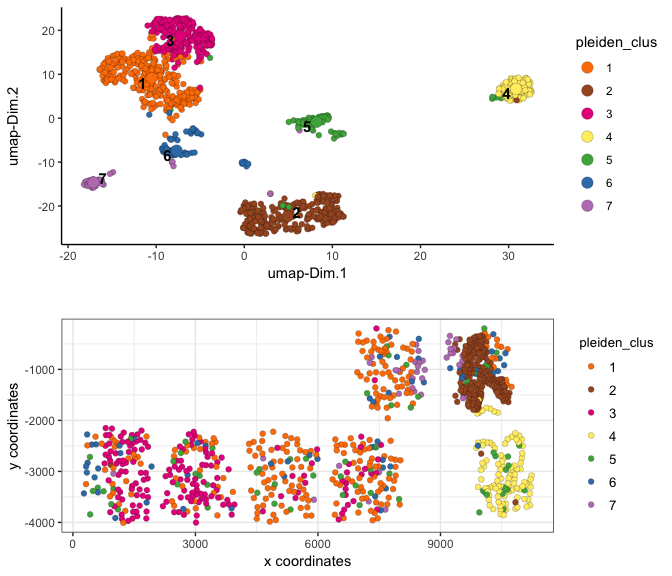

    #> [1] "Dim.1"
    #> [1] "Dim.2"

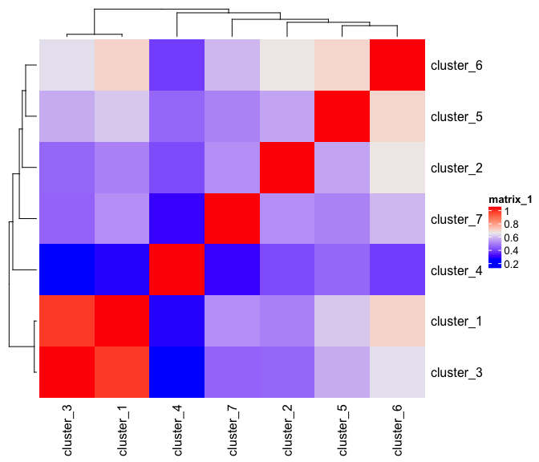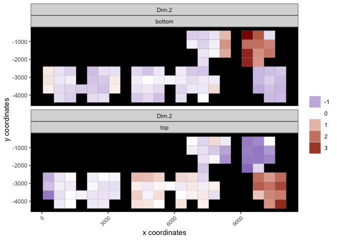

``` r
## spatial genes
VC_test <- calculateSpatialGenes(gobject = VC_test, min_N = 20)
spatial_gene_DT <- calculateSpatialGenes(gobject = VC_test , method = 'kmeans', return_gobject = F)
# visualize
visGenePlot(gobject = VC_test,  genes = c('Enpp2', 'Aqp1', 'Shank1', 'Clic6', 'Nptxr', 'Rtn4r'),
            scale_alpha_with_expression = T)
```

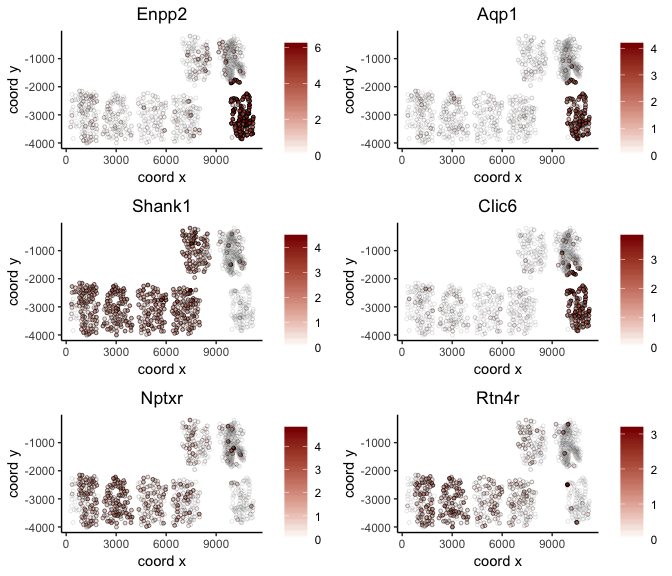

------------------------------------------------------------------------

 

### 7. HMRF

``` r
# select 500 spatial genes
gene_data = fDataDT(VC_test)
spatial_genes = gene_data[SV == 'yes' | spg == 'yes']$gene_ID
set.seed(seed = 1234)
spatial_genes = spatial_genes[sample(x = 1:length(spatial_genes), size = 500)]

# run HMRF
HMRFtest = doHMRF(gobject = VC_test, expression_values = 'scaled',
                  spatial_genes = spatial_genes,
                  k = 10,
                  betas = c(40, 4, 3),
                  output_folder = '/Volumes/Ruben_Seagate/Dropbox/Projects/GC_lab/Ruben_Dries/190225_spatial_package/Data/package_testHMRF/',
                  python_path = "/Users/rubendries/Bin/anaconda3/envs/py36/bin/pythonw")

# view HMRF results for multiple tested betas
viewHMRFresults(gobject = VC_test,
                HMRFoutput = HMRFtest,
                k = 10, betas_to_view = c(44, 48), point_size = 2)
#> [1] "/Users/rubendries/Bin/anaconda3/envs/py36/bin/pythonw /Library/Frameworks/R.framework/Versions/3.5/Resources/library/Giotto/python/get_result2.py -r /Volumes/Ruben_Seagate/Dropbox/Projects/GC_lab/Ruben_Dries/190225_spatial_package/Data/package_testHMRF//result.spatial.zscore -a test -k 10 -b 44"
#> first and second dimenion need to be defined, default is first 2
```

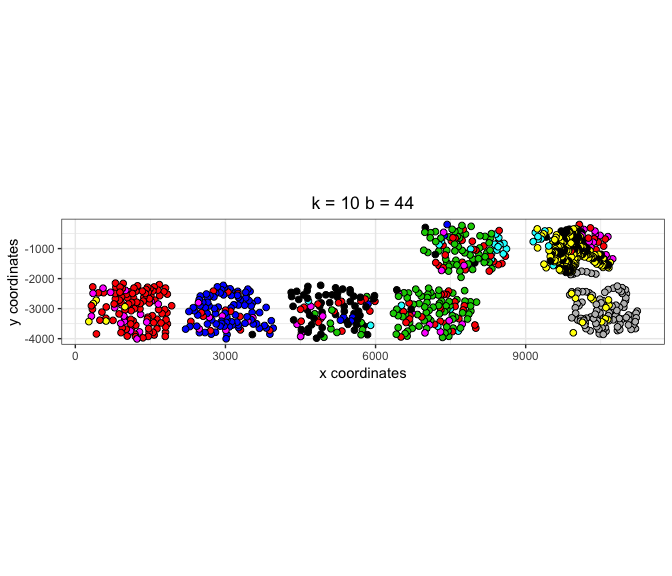

    #> [1] "/Users/rubendries/Bin/anaconda3/envs/py36/bin/pythonw /Library/Frameworks/R.framework/Versions/3.5/Resources/library/Giotto/python/get_result2.py -r /Volumes/Ruben_Seagate/Dropbox/Projects/GC_lab/Ruben_Dries/190225_spatial_package/Data/package_testHMRF//result.spatial.zscore -a test -k 10 -b 48"
    #> first and second dimenion need to be defined, default is first 2

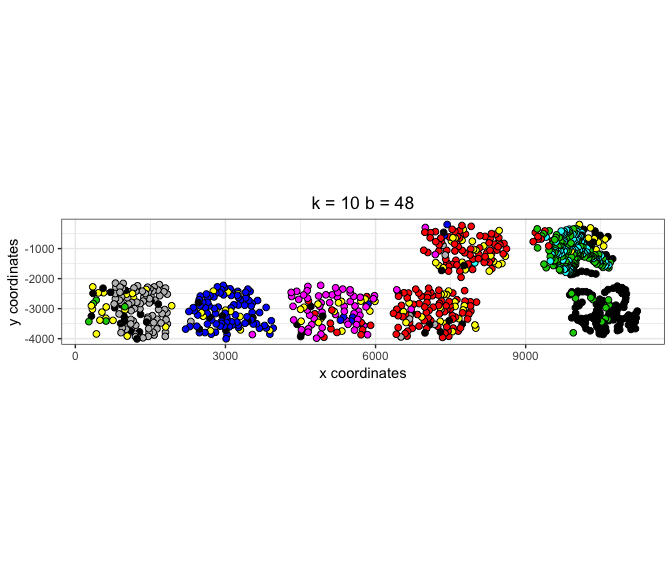

``` r

# add the HMRF results of interest
VC_test = addHMRF(gobject = VC_test,
                  HMRFoutput = HMRFtest,
                  k = 10, betas_to_add = c(48))
#> [1] "/Users/rubendries/Bin/anaconda3/envs/py36/bin/pythonw /Volumes/Ruben_Seagate/Dropbox/Projects/GC_lab/Ruben_Dries/190225_spatial_package/Data/Qian_input_files//get_result2.py -r /Volumes/Ruben_Seagate/Dropbox/Projects/GC_lab/Ruben_Dries/190225_spatial_package/Data/package_testHMRF//result.spatial.zscore -a test -k 10 -b 48"

# co-visualize
visSpatDimPlot(gobject = VC_test, cell_color = 'hmrf_k.10_b.48', dim_point_size = 2, spatial_point_size = 2)
#> first and second dimenion need to be defined, default is first 2
```

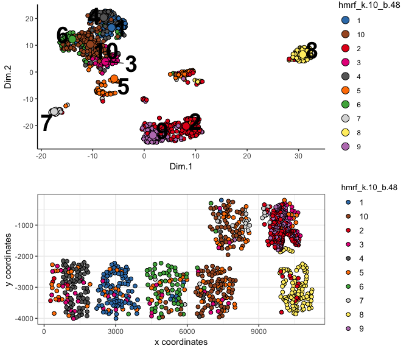

------------------------------------------------------------------------

 

### 8. spatial analysis

``` r
## cell-cell interaction ##
## calculate and visualize cell-cell proximities
cell_proximities = cellProximityEnrichment(gobject = VC_test, cluster_column = 'pleiden_clus')
cellProximityBarplot(CPscore = cell_proximities)
```

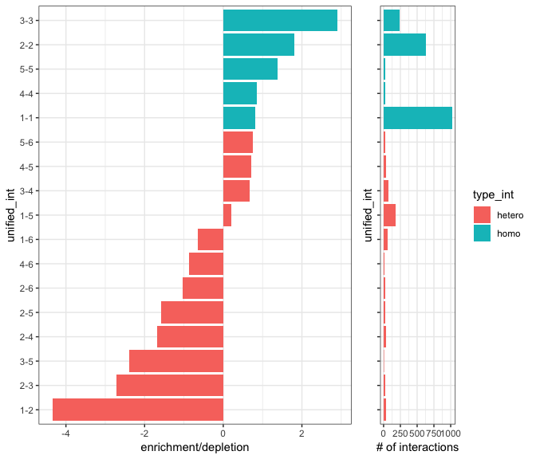

``` r
cellProximityHeatmap(CPscore = cell_proximities, order_cell_types = T)
```

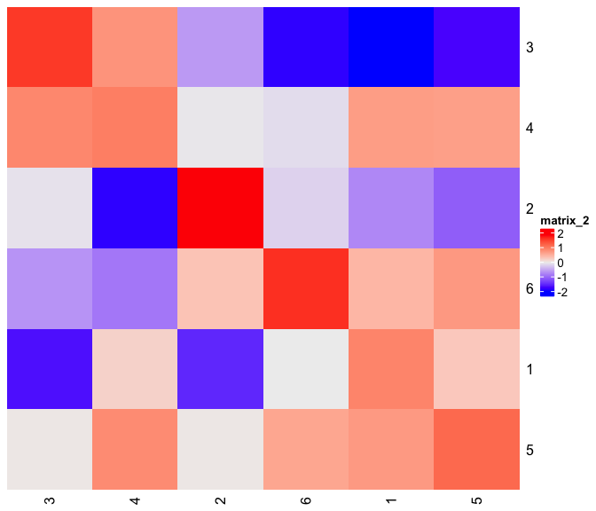

``` r

cellProximityVisPlot(gobject = VC_test, interaction_name = '1-5',
                     cluster_column = 'pleiden_clus',
                     cell_color = 'pleiden_clus', show_network = T, network_color = 'blue')
#> first and second dimenion need to be defined, default is first 2
```

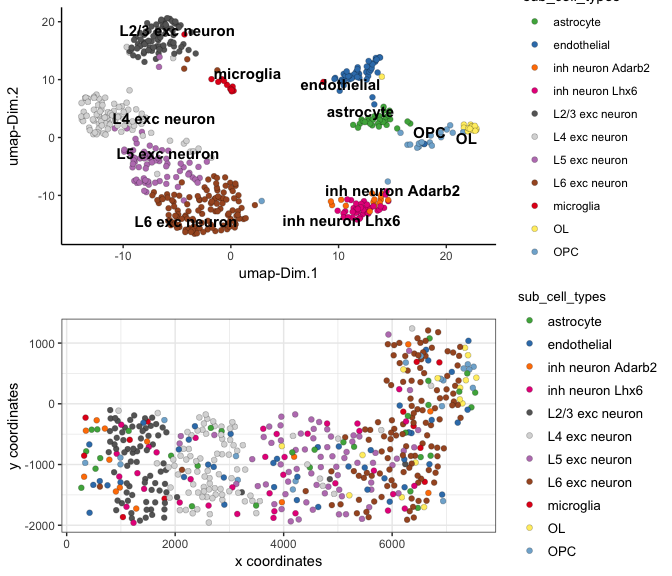

``` r


## 1 gene enrichment for cell-cell interaction ##
test_int_gene_scores = getAverageCellProximityGeneScores(gobject = VC_test, cluster_column = 'pleiden_clus')
#> start  1-1 
#> start  1-4 
#> start  1-5 
#> start  5-5 
#> start  1-2 
#> start  1-6 
#> start  4-4 
#> start  4-5 
#> start  5-6 
#> start  4-6 
#> start  6-6 
#> start  2-2 
#> start  2-5 
#> start  3-3 
#> start  2-4 
#> start  2-6 
#> start  2-3 
#> start  3-4 
#> start  3-5
test_gene_example = showGeneExpressionProximityScore(scores = test_int_gene_scores, selected_gene = 'Dlx1')
```

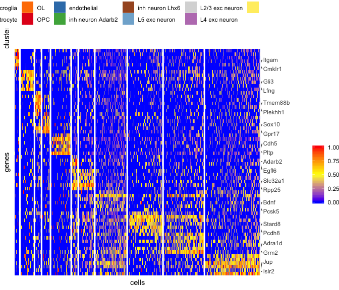

``` r
test_interaction_example = showIntExpressionProximityScore(scores = test_int_gene_scores, selected_interaction = '5-6')
```

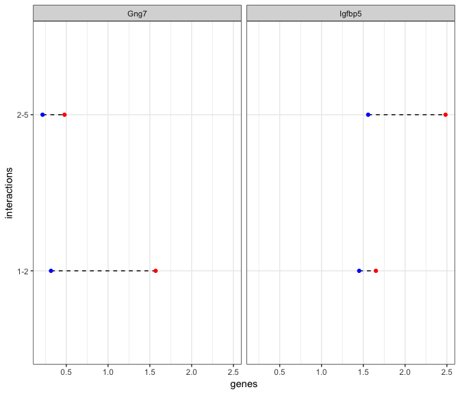

``` r


## 2 selected ligand - receptor ##
LR_data = fread(system.file("extdata", "mouse_ligand_receptors.txt", package = 'Giotto'))
ligands = LR_data$mouseLigand
receptors = LR_data$mouseReceptor

my_subset_interactions = c('5-6','3-6','1-2')
LR_VC = getGeneToGeneScores(CPGscore = test_int_gene_scores,
                            selected_genes = NULL,
                            selected_cell_interactions = my_subset_interactions,
                            specific_genes_1 = ligands, specific_genes_2 = receptors)
#> 
#>  use specific gene-gene interactions 
#> 
#>  start specific gene-gene interactions

showTopGeneToGene(GTGscore = LR_VC, top_interactions = 10,
                  direction = c('increased'),
                  complement_data = T)
```

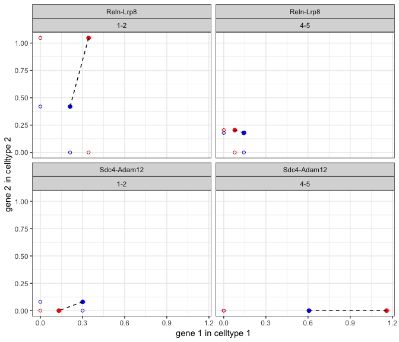

``` r

showTopGeneToGene(GTGscore = LR_VC, top_interactions = 10,
                  direction = c('decreased'),
                  complement_data = T, subset_cell_ints = '5-6')
```

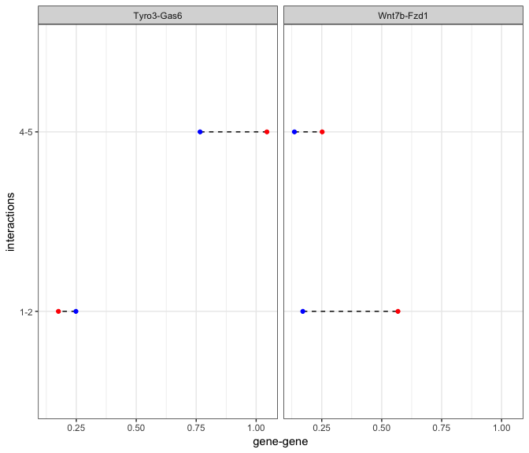
