<!-- mouse_cortex_1_simple.md is generated from mouse_cortex_1_simple.Rmd Please edit that file -->

``` r
library(Giotto)
# this example works with Giotto v.0.1.2
```

### Data input

<details>

<summary>Expand</summary>  

  - load cortex/svz gene expression matrix  
  - prepare cell coordinates by stitching imaging fields

Several fields - containing 100’s of cells - in the mouse cortex and
subventricular zone were imaged. The coordinates of the cells within
each field are independent of eachother, so in order to visualize and
process all cells together imaging fields will be stitched together by
providing x and y-offset values specific to each field. These offset
values are known or estimates based on the original raw image:  
 .

``` r
## visual cortex expression DATA ##
VC_exprs = read.table(system.file("extdata", "cortex_svz_expression.txt", package = "Giotto"))

## prepare cell locations
VC_locs = fread(system.file("extdata", "cortex_svz_centroids_rotated.csv", package = "Giotto"))

## create or import offset scores if several imaging fields need to be combined
my_offset_file = data.table(field = c(0, 1, 2, 3, 4, 5, 6),
                            x_offset = c(0, 1654.97, 1750.75, 1674.35, 675.5, 2048, 675),
                            y_offset = c(0, 0, 0, 0, -1438.02, -1438.02, 0))
stitch_file = stitchFieldCoordinates(location_file = VC_locs, offset_file = my_offset_file,
                                     cumulate_offset_x = T, cumulate_offset_y = F,
                                     field_col = 'Field of View',
                                     reverse_final_x = F, reverse_final_y = T)
stitch_file    = stitch_file[,.(X_final, Y_final)]
my_offset_file = my_offset_file[,.(field, x_offset_final, y_offset_final)]
```

-----

</details>

 

### 1\. Create Giotto object & process data

<details>

<summary>Expand</summary>  

``` r
## create
VC_test <- createGiottoObject(raw_exprs = VC_exprs, spatial_locs = stitch_file, offset_file = my_offset_file)

## add field annotation
cortex_fields = fread(system.file("extdata", "cortex_fields_info.txt", package = "Giotto"))
VC_test = addCellMetadata(VC_test, new_metadata = cortex_fields,
                          by_column = T, column_cell_ID = 'uniq_ID')

## subset for cortex only (first 5 fields)
cell_metadata = pDataDT(VC_test)
cortex_cell_ids = cell_metadata[Field_of_View %in% 0:4]$cell_ID
VC_test = subsetGiotto(VC_test, cell_ids = cortex_cell_ids)

## filter
VC_test <- filterGiotto(gobject = VC_test,
                        expression_threshold = 1,
                        gene_det_in_min_cells = 10,
                        min_det_genes_per_cell = 10,
                        expression_values = c('raw'),
                        verbose = T)
#> Number of cells removed:  0  out of  523 
#> Number of genes removed:  0  out of  10000
## normalize
VC_test <- normalizeGiotto(gobject = VC_test, scalefactor = 6000, verbose = T)
#> 
#>  first scale genes and then cells
## add gene & cell statistics
VC_test <- addStatistics(gobject = VC_test)
## adjust expression matrix for technical or known variables
VC_test <- adjustGiottoMatrix(gobject = VC_test, expression_values = c('normalized'),
                              batch_columns = NULL, covariate_columns = c('nr_genes', 'total_expr'),
                              return_gobject = TRUE,
                              update_slot = c('custom'))
# plain visualization
visPlot(gobject = VC_test)
```


-----

</details>

 

### 2\. dimension reduction

<details>

<summary>Expand</summary>  

``` r
## highly variable genes (HVG)
VC_test <- calculateHVG(gobject = VC_test, method = 'cov_loess', difference_in_variance = 0.5)
```


``` r
## select genes based on HVG and gene statistics, both found in gene metadata
gene_metadata = fDataDT(VC_test)
featgenes = gene_metadata[hvg == 'yes' & perc_cells > 4 & mean_expr_det > 0.5]$gene_ID
## run PCA on expression values (default)
VC_test <- runPCA(gobject = VC_test, genes_to_use = featgenes, scale_unit = F)
## run UMAP and tSNE on PCA space (default)
VC_test <- runUMAP(VC_test, dimensions_to_use = 1:15)
VC_test <- runtSNE(VC_test, dimensions_to_use = 1:15)
```

-----

</details>

 

### 3\. cluster

<details>

<summary>Expand</summary>  

``` r


## sNN network (default)
VC_test <- createNearestNetwork(gobject = VC_test, dimensions_to_use = 1:15, k = 15)
## Leiden clustering
VC_test <- doLeidenCluster(gobject = VC_test, resolution = 0.4, n_iterations = 1000,
                           python_path = "/Users/rubendries/Bin/anaconda3/envs/py36/bin/python")

plotUMAP(gobject = VC_test, cell_color = 'leiden_clus', point_size = 2.5,
         show_NN_network = T, edge_alpha = 0.05, plot_method = 'ggplot')
```


``` r


## Leiden subclustering for specified clusters
VC_test = doLeidenSubCluster(gobject = VC_test, cluster_column = 'leiden_clus',
                             resolution = 0.2, k_neighbors = 10,
                             hvg_param = list(reverse_log_scale = T, show_plot = F,
                                              difference_in_variance = 1, expression_values = 'normalized'),
                             pca_param = list(expression_values = 'normalized', scale_unit = F),
                             nn_param = list(dimensions_to_use = 1:5),
                             selected_clusters = c(5,7),
                             name = 'sub_leiden_clus_select')
#> 
#>  start with cluster:  1 
#> 
#>  start with cluster:  2 
#> 
#>  start with cluster:  3 
#> 
#>  start with cluster:  4 
#> 
#>  start with cluster:  5 
#> 
#>  gene statistics has already been applied once, will be overwritten 
#> 
#>  cells statistics has already been applied once, will be overwritten 
#> 
#>   hvg  has already been used, will be overwritten 
#> 
#>  157 highly variable genes have been selected 
#> 
#>   pca  has already been used, will be overwritten 
#> 
#>   sNN.pca  has already been used, will be overwritten 
#> 
#>  start with cluster:  6 
#> 
#>  start with cluster:  7 
#> 
#>  gene statistics has already been applied once, will be overwritten 
#> 
#>  cells statistics has already been applied once, will be overwritten 
#> 
#>   hvg  has already been used, will be overwritten 
#> 
#>  469 highly variable genes have been selected 
#> 
#>   pca  has already been used, will be overwritten 
#> 
#>   sNN.pca  has already been used, will be overwritten 
#> 
#>  start with cluster:  8 
#> 
#>  start with cluster:  9
```

-----

</details>

 

### 4\. co-visualize

<details>

<summary>Expand</summary>  

``` r
# expression and spatial
visSpatDimPlot_2D(gobject = VC_test, cell_color = 'sub_leiden_clus_select',
               dim_point_size = 2, spatial_point_size = 2)
```


``` r
# relationship between clusters
clusterheatmap <- showClusterHeatmap(gobject = VC_test, cluster_column = 'sub_leiden_clus_select')
print(clusterheatmap)
```


-----

</details>

 

### 5\. differential expression

<details>

<summary>Expand</summary>  

``` r

gini_markers_subclusters = findMarkers_one_vs_all(gobject = VC_test,
                                                  method = 'gini',
                                                  expression_values = 'normalized',
                                                  cluster_column = 'sub_leiden_clus_select',
                                                  min_genes = 20,
                                                  min_expr_gini_score = 0.5,
                                                  min_det_gini_score = 0.5)
#> 
#>  start with cluster  1.1 
#> 
#>  start with cluster  2.1 
#> 
#>  start with cluster  3.1 
#> 
#>  start with cluster  4.1 
#> 
#>  start with cluster  5.1 
#> 
#>  start with cluster  5.2 
#> 
#>  start with cluster  6.1 
#> 
#>  start with cluster  7.1 
#> 
#>  start with cluster  7.2 
#> 
#>  start with cluster  8.1 
#> 
#>  start with cluster  9.1
gini_markers_subclusters_DT = gini_markers_subclusters[, head(.SD, 2), by = 'cluster']
```

-----

</details>

 

### 6\. cell-type annotation

<details>

<summary>Expand</summary>  

``` r

## general cell types
clusters_cell_types_cortex = c('L6 exc neuron', 'L4 exc neuron', 'L2/3 exc neuron',
                               'L5 exc neuron', 'inh neuron', 'inh neuron',
                              'endothelial',
                              'OL', 'OL',
                              'astrocyte', 'microglia')
names(clusters_cell_types_cortex) = c(1.1, 2.1, 3.1, 4.1, 5.1, 5.2, 6.1, 7.1, 7.2, 8.1, 9.1)
VC_test = annotateGiotto(gobject = VC_test, annotation_vector = clusters_cell_types_cortex,
                         cluster_column = 'sub_leiden_clus_select', name = 'cell_types')


## general + subcluster cell types
clusters_sub_cell_types_cortex = c('L6 exc neuron', 'L4 exc neuron', 'L2/3 exc neuron',
                                   'L5 exc neuron', 'inh neuron Lhx6', 'inh neuron Adarb2',
                                   'endothelial',
                                   'OPC', 'OL',
                                   'astrocyte', 'microglia')
names(clusters_sub_cell_types_cortex) = c(1.1, 2.1, 3.1, 4.1, 5.1, 5.2, 6.1, 7.1, 7.2, 8.1, 9.1)
VC_test = annotateGiotto(gobject = VC_test, annotation_vector = clusters_sub_cell_types_cortex,
                         cluster_column = 'sub_leiden_clus_select', name = 'sub_cell_types')
```

``` r
## violinplot
cell_type_order = c('microglia', 'astrocyte', 'OL', 'OPC',
                    'endothelial',
                    'inh neuron Adarb2', 'inh neuron Lhx6',
                    'L5 exc neuron', 'L2/3 exc neuron', 'L4 exc neuron', 'L6 exc neuron')

violingenes = unique(c(gini_markers_subclusters[, head(.SD, 1), by = 'cluster']$genes, 'Lhx6'))
violinPlot(gobject = VC_test, genes = violingenes, cluster_custom_order = cell_type_order,
           strip_text = 6, cluster_column = 'sub_cell_types', color_violin = 'cluster')
```


``` r
## heatmap genes vs cells
plotHeatmap(gobject = VC_test,
            genes = gini_markers_subclusters[, head(.SD, 3), by = 'cluster']$genes,
            cluster_column = 'sub_cell_types', cluster_order = 'custom',
            cluster_custom_order = cell_type_order, legend_nrows = 2)
```


``` r

plotHeatmap(gobject = VC_test,
            genes = gini_markers_subclusters[, head(.SD, 6), by = 'cluster']$genes,
            gene_label_selection = gini_markers_subclusters[, head(.SD, 2), by = 'cluster']$genes,
            cluster_column = 'sub_cell_types', cluster_order = 'custom',
            cluster_custom_order = cell_type_order, legend_nrows = 2)
```


``` r

## heatmap cells
clusterheatmap <- showClusterHeatmap(gobject = VC_test, cluster_column = 'sub_cell_types')
print(clusterheatmap)
```


``` r

## co-visualization
visSpatDimPlot_2D(gobject = VC_test, cell_color = 'sub_cell_types', plot_method = 'ggplot',
               dim_point_size = 2, spatial_point_size = 2, show_cluster_center = F, show_center_label = T)
```


-----

</details>

 

### 7\. spatial grid

<details>

<summary>Expand</summary>  

``` r

## spatial grid
VC_test <- createSpatialGrid(gobject = VC_test,
                             sdimx_stepsize = 500,
                             sdimy_stepsize = 500,
                             minimum_padding = 50)

visPlot(gobject = VC_test, show_grid = T,
        point_size = 1.5, cell_color = NULL)
```

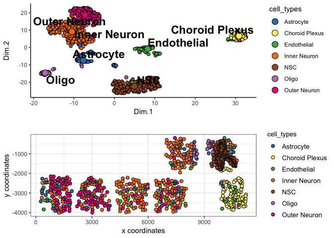

``` r

## identify spatial patterns
pattern_VC = detectSpatialPatterns(gobject = VC_test, expression_values = 'normalized',
                                   min_cells_per_grid = 5, scale_unit = T, PC_zscore = 1, show_plot = T)
```

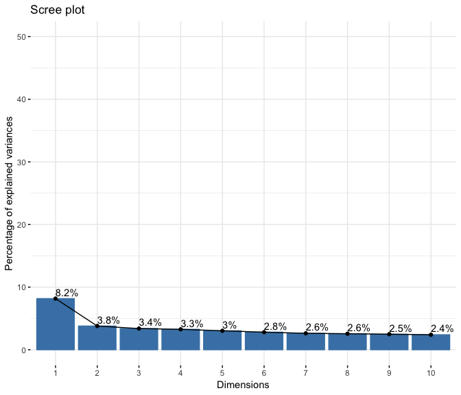

``` r

## show pattern and top genes for principal component 1
dim1_pattern = showPattern(pattern_VC, dimension = 1)
dim1_genes = showPatternGenes(pattern_VC, dimension = 1)
print(dim1_pattern)
```

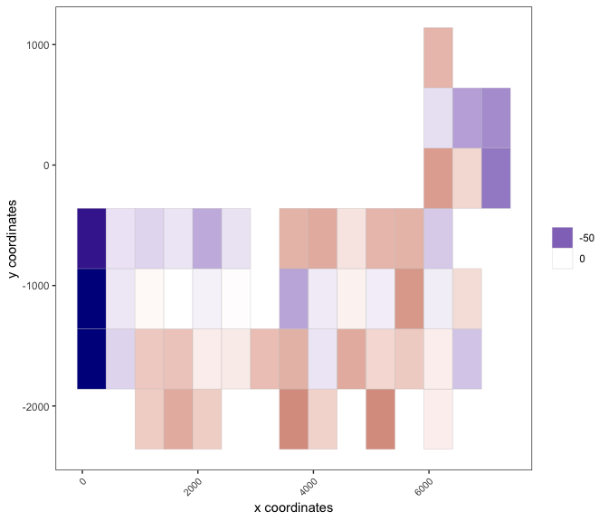

``` r
print(dim1_genes)
```

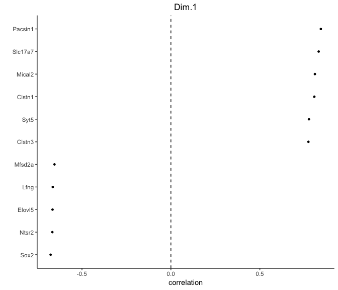

``` r

## show pattern and top genes for principal component 2
dim2_pattern = showPattern(pattern_VC, dimension = 2)
dim2_genes = showPatternGenes(pattern_VC, dimension = 2)
print(dim2_pattern)
```

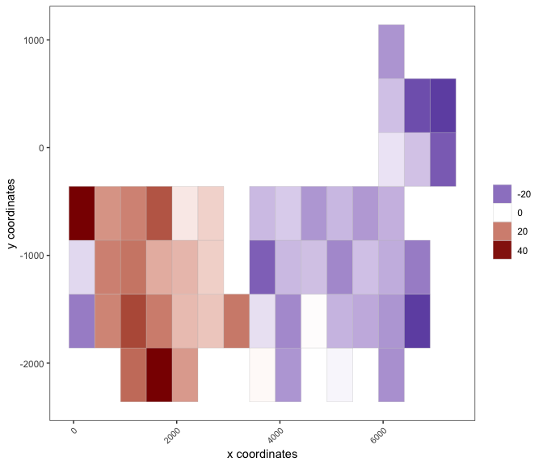

``` r
print(dim2_genes)
```

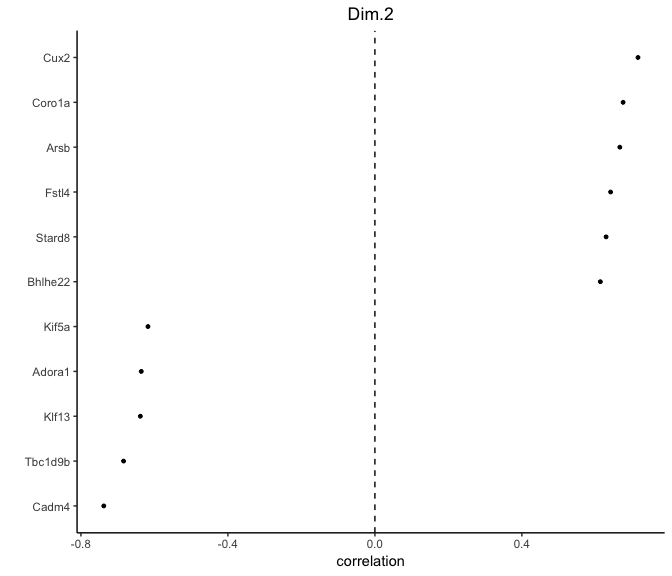

``` r

## select genes associated with significant patterns and add to giotto object
patterned_Genes = selectPatternGenes(pattern_VC, dimensions = 1:4,
                                     top_pos_genes = 50, top_neg_genes = 50,
                                     min_pos_cor = 0.3, min_neg_cor = 0.3)

VC_test = addGeneMetadata(gobject = VC_test, new_metadata = patterned_Genes,
                          by_column = T, column_gene_ID = 'gene_ID')
```

-----

</details>

 

### 8\. spatial network

<details>

<summary>Expand</summary>  

``` r

## create spatial networks based on k and/or distance from centroid
VC_test <- createSpatialNetwork(gobject = VC_test, k = 3)
VC_test <- createSpatialNetwork(gobject = VC_test, k = 10, name = 'large_network')
VC_test <- createSpatialNetwork(gobject = VC_test, k = 100, maximum_distance = 200,
                                minimum_k = 2, name = 'distance_network')

## visualize different spatial networks on first field (~ layer 1)
field1_ids = cell_metadata[Field_of_View == 0]$cell_ID
subVC_test = subsetGiotto(VC_test, cell_ids = field1_ids)

visPlot(gobject = subVC_test, show_network = T,
        network_color = 'blue', spatial_network_name = 'spatial_network',
        point_size = 2.5, cell_color = 'sub_cell_types')
```

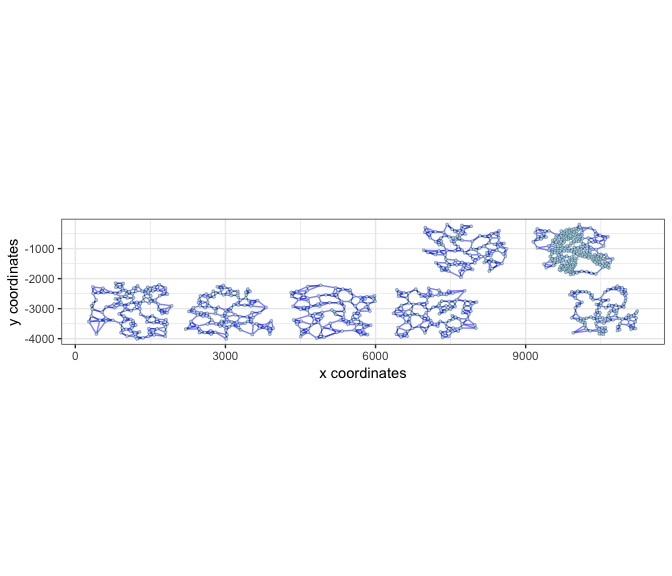

``` r

visPlot(gobject = subVC_test, show_network = T,
        network_color = 'blue', spatial_network_name = 'large_network',
        point_size = 2.5, cell_color = 'sub_cell_types')
```

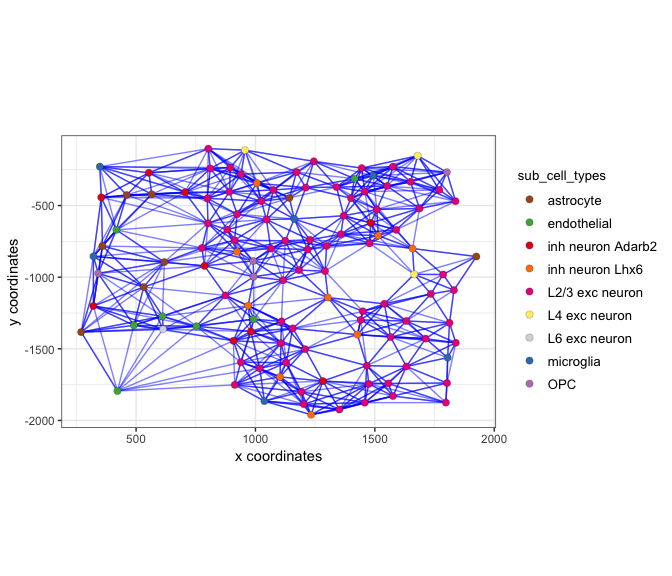

``` r

visPlot(gobject = subVC_test, show_network = T,
        network_color = 'blue', spatial_network_name = 'distance_network',
        point_size = 2.5, cell_color = 'sub_cell_types')
```

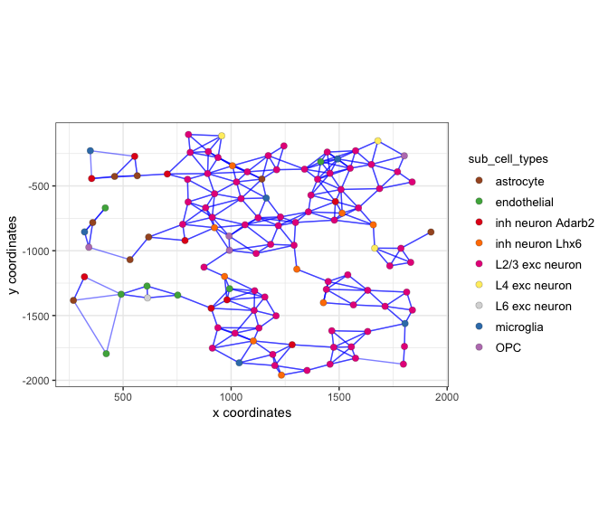

-----

</details>

 

### 9\. spatial genes

<details>

<summary>Expand</summary>  

``` r

## identify spatial genes based on network and add to object
# VC_test <- calculateSpatialGenes(gobject = VC_test, method = 'kmeans', min_N = 20)

## identify spatial genes, but return results
spatial_gene_DT <- binGetSpatialGenes(gobject = VC_test, bin_method = 'kmeans')

## identify spatial genes based on physical distance directly
spatial_python_DT <- calculate_spatial_genes_python(gobject = VC_test,
                                                    expression_values = 'scaled',
                                                    python_path = "/Users/rubendries/Bin/anaconda3/envs/py36/bin/pythonw")

## visualize genes with spatial expression pattern
visGenePlot(gobject = VC_test,  genes = c('Cux2', 'Grm2', 'Cadm4', 'Islr2'),
            point_size = 2.5, cow_n_col = 1, genes_high_color = 'darkred', genes_mid_color = 'blue', genes_low_color = 'darkblue',
            scale_alpha_with_expression = T, point_border_stroke = 0.05,
            point_border_col = 'lightgrey')
```

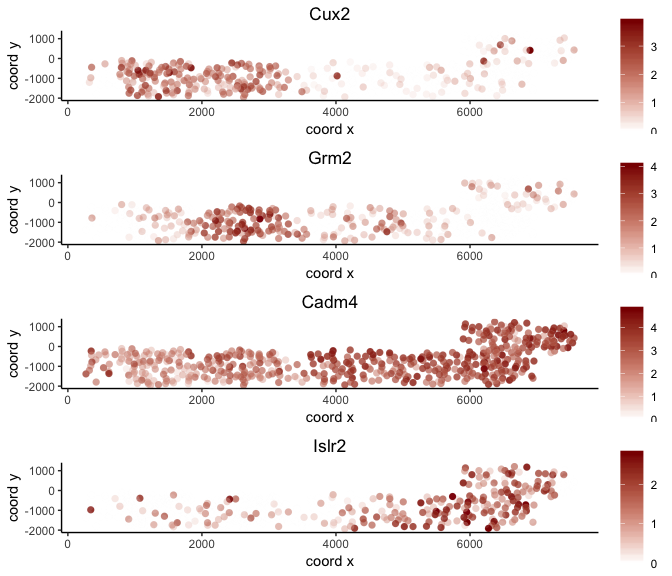

-----

</details>

 

### 10\. HMRF domains

<details>

<summary>Expand</summary>  

``` r

# select out put folder
hmrf_folder = '/Volumes/Ruben_Seagate/Dropbox/Projects/GC_lab/Ruben_Dries/190225_spatial_package/Results/Seqfish_cortex_results/190830_results/HMRF_results//'
spatial_genes = spatial_python_DT[1:100]$genes

# do HMRF with different betas
HMRF_spatial_genes = doHMRF(gobject = VC_test, expression_values = 'scaled',
                            spatial_genes = spatial_genes,
                            k = 9,
                            betas = c(28,2,3), 
                            output_folder = paste0(hmrf_folder, '/', 'Spatial_genes/SG_top100_k9_scaled'),
                            python_path = "/Users/rubendries/Bin/anaconda3/envs/py36/bin/pythonw")

## view results of HMRF
viewHMRFresults(gobject = VC_test,
                HMRFoutput = HMRF_spatial_genes,
                k = 9, betas_to_view = seq(28, 34, by = 2),
                point_size = 2)
#> [1] "/Users/rubendries/Bin/anaconda3/envs/py36/bin/pythonw /Library/Frameworks/R.framework/Versions/3.5/Resources/library/Giotto/python/get_result2.py -r /Volumes/Ruben_Seagate/Dropbox/Projects/GC_lab/Ruben_Dries/190225_spatial_package/Results/Seqfish_cortex_results/190830_results/HMRF_results///Spatial_genes/SG_top100_k9_scaled/result.spatial.zscore -a test -k 9 -b 28"
```

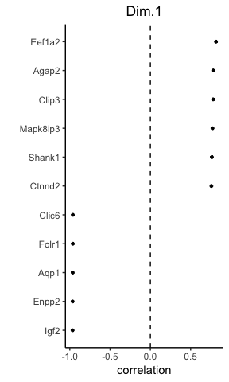

    #> [1] "/Users/rubendries/Bin/anaconda3/envs/py36/bin/pythonw /Library/Frameworks/R.framework/Versions/3.5/Resources/library/Giotto/python/get_result2.py -r /Volumes/Ruben_Seagate/Dropbox/Projects/GC_lab/Ruben_Dries/190225_spatial_package/Results/Seqfish_cortex_results/190830_results/HMRF_results///Spatial_genes/SG_top100_k9_scaled/result.spatial.zscore -a test -k 9 -b 30"

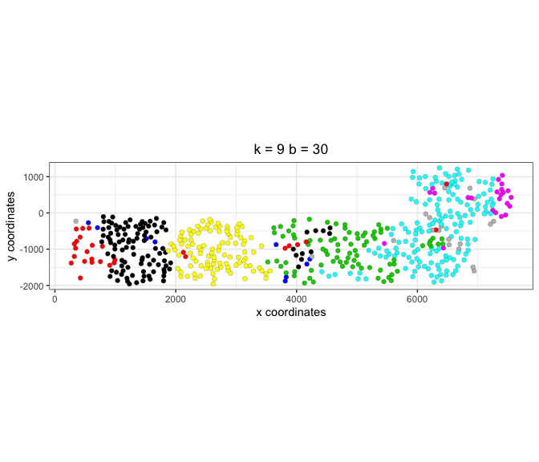

    #> [1] "/Users/rubendries/Bin/anaconda3/envs/py36/bin/pythonw /Library/Frameworks/R.framework/Versions/3.5/Resources/library/Giotto/python/get_result2.py -r /Volumes/Ruben_Seagate/Dropbox/Projects/GC_lab/Ruben_Dries/190225_spatial_package/Results/Seqfish_cortex_results/190830_results/HMRF_results///Spatial_genes/SG_top100_k9_scaled/result.spatial.zscore -a test -k 9 -b 32"

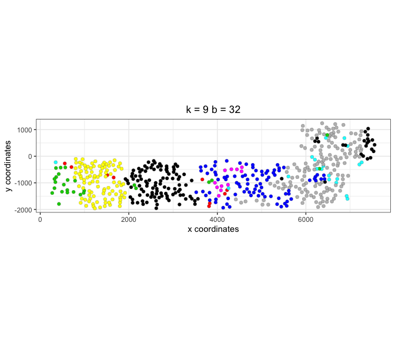

``` r

## add HMRF of interest to giotto object
VC_test = addHMRF(gobject = VC_test,
                  HMRFoutput = HMRF_spatial_genes,
                  k = 9, betas_to_add = 30,
                  hmrf_name = 'HMRF')
#> [1] "/Users/rubendries/Bin/anaconda3/envs/py36/bin/pythonw /Library/Frameworks/R.framework/Versions/3.5/Resources/library/Giotto/python/get_result2.py -r /Volumes/Ruben_Seagate/Dropbox/Projects/GC_lab/Ruben_Dries/190225_spatial_package/Results/Seqfish_cortex_results/190830_results/HMRF_results///Spatial_genes/SG_top100_k9_scaled/result.spatial.zscore -a test -k 9 -b 30"

## visualize
visPlot(gobject = VC_test, cell_color = 'HMRF_k9_b.30', point_size = 2)
```

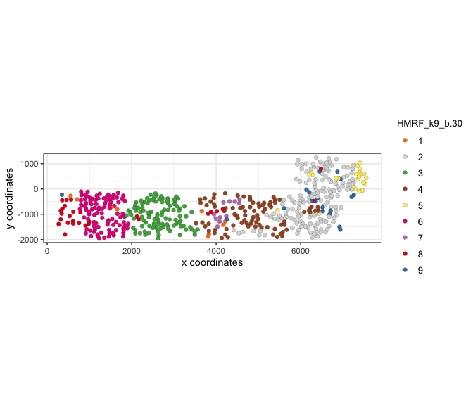

-----

</details>

 

### 11\. Cell-cell preferential proximity

<details>

<summary>Expand</summary>  


``` r

## calculate frequently seen proximities
cell_proximities = cellProximityEnrichment(gobject = VC_test,
                                           cluster_column = 'cell_types',
                                           spatial_network_name = 'spatial_network',
                                           number_of_simulations = 400)

## barplot
cellProximityBarplot(CPscore = cell_proximities, min_orig_ints = 5, min_sim_ints = 5)
```

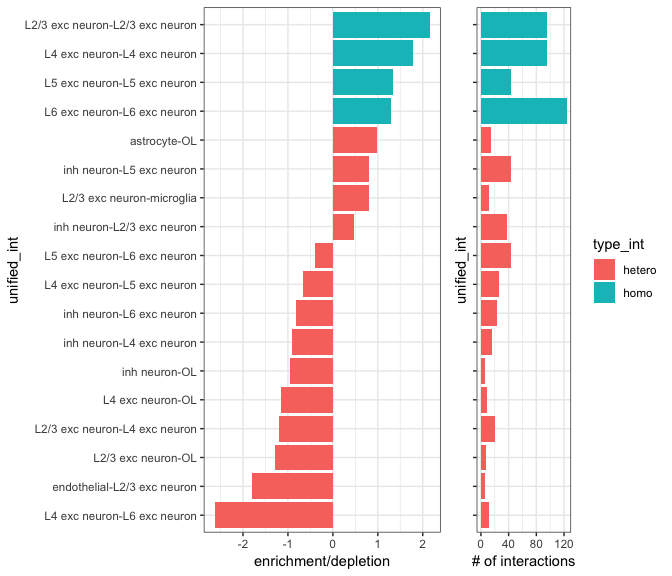

``` r

## heatmap
cellProximityHeatmap(CPscore = cell_proximities, order_cell_types = T, scale = T)
```

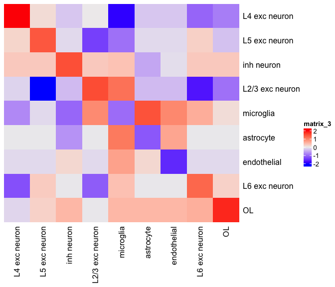

``` r


## visualize inh neuron - L5 exc neuron
cellProximityVisPlot(gobject = VC_test, interaction_name = 'inh neuron-L5 exc neuron', spatial_network_name = 'spatial_network',
                     cluster_column = 'cell_types',
                     cell_color = 'cell_types', show_network = T,
                     network_color = 'blue', point_size_select = 2)
#> first and second dimenion need to be defined, default is first 2
```

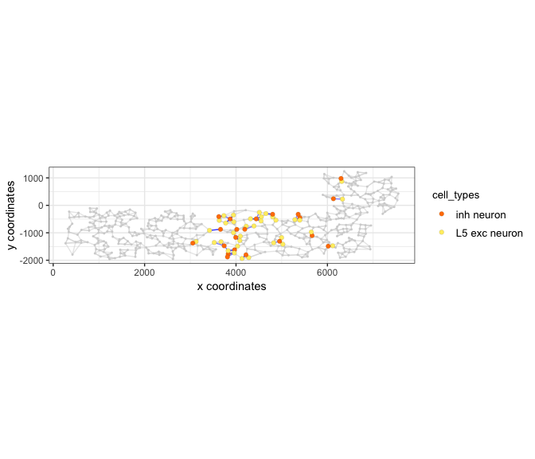

``` r

## zoom-in of field 2 (~ layer 5)
selected_cells = cell_metadata[Field_of_View %in% c(2)]$cell_ID
sub_VC_test = subsetGiotto(VC_test, cell_ids = selected_cells)

cellProximityVisPlot(gobject = sub_VC_test, interaction_name = 'inh neuron-L5 exc neuron',
                     cluster_column = 'cell_types',
                     cell_color = 'cell_types', show_network = T,
                     network_color = 'blue', point_size_select = 3)
#> first and second dimenion need to be defined, default is first 2
```

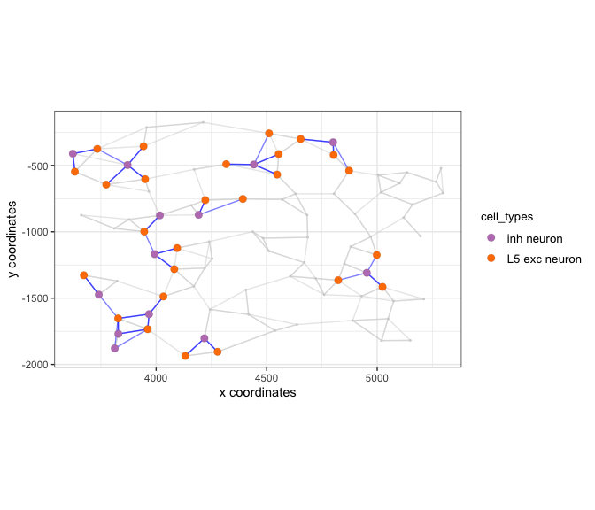

-----

</details>

 

### 12\. 1 gene enrichment in cell neighborhood

<details>

<summary>Expand</summary>  


``` r

## get cell proximity scores (CPG scores)
CPGscores = getCellProximityGeneScores(gobject = VC_test, cluster_column = 'cell_types')
#> start  L2/3 exc neuron-L2/3 exc neuron 
#> start  inh neuron-L2/3 exc neuron 
#> start  L2/3 exc neuron-microglia 
#> start  astrocyte-microglia 
#> start  astrocyte-L2/3 exc neuron 
#> start  endothelial-L2/3 exc neuron 
#> start  L2/3 exc neuron-OL 
#> start  OL-OL 
#> start  inh neuron-OL 
#> start  endothelial-inh neuron 
#> start  L2/3 exc neuron-L4 exc neuron 
#> start  inh neuron-inh neuron 
#> start  astrocyte-inh neuron 
#> start  endothelial-endothelial 
#> start  astrocyte-endothelial 
#> start  endothelial-L6 exc neuron 
#> start  L4 exc neuron-L4 exc neuron 
#> start  L4 exc neuron-microglia 
#> start  L4 exc neuron-L5 exc neuron 
#> start  L4 exc neuron-OL 
#> start  endothelial-L4 exc neuron 
#> start  astrocyte-L4 exc neuron 
#> start  L5 exc neuron-L5 exc neuron 
#> start  inh neuron-L5 exc neuron 
#> start  inh neuron-L4 exc neuron 
#> start  L5 exc neuron-OL 
#> start  astrocyte-L5 exc neuron 
#> start  endothelial-L5 exc neuron 
#> start  L4 exc neuron-L6 exc neuron 
#> start  L5 exc neuron-L6 exc neuron 
#> start  L2/3 exc neuron-L6 exc neuron 
#> start  L2/3 exc neuron-L5 exc neuron 
#> start  L6 exc neuron-OL 
#> start  L6 exc neuron-L6 exc neuron 
#> start  astrocyte-OL 
#> start  astrocyte-L6 exc neuron 
#> start  endothelial-OL 
#> start  inh neuron-L6 exc neuron 
#> start  L6 exc neuron-microglia 
#> start  inh neuron-microglia 
#> start  L5 exc neuron-microglia 
#> start  endothelial-microglia 
#> start  astrocyte-astrocyte 
#> start  microglia-OL

## visualize
barplot = showCPGscores(CPGscore = CPGscores, method = 'cell_barplot')
```

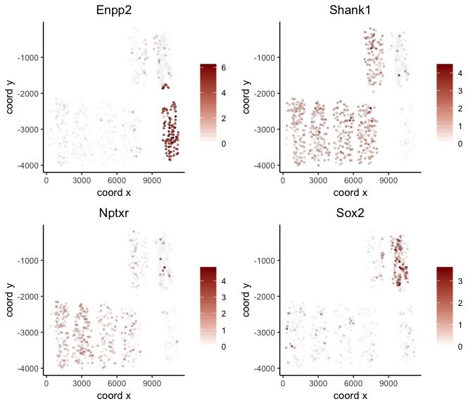

``` r
cell_cell_barplot = showCPGscores(CPGscore = CPGscores, method = 'cell-cell')
```

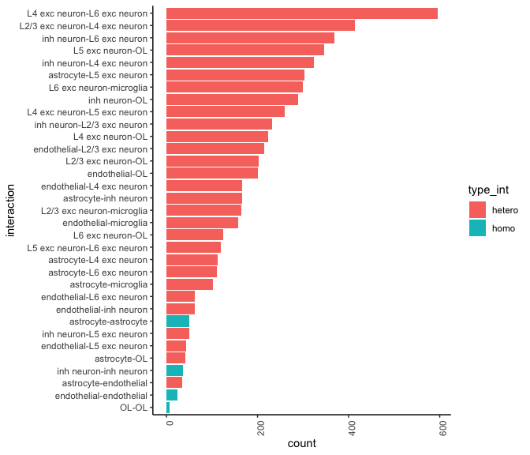

``` r
library(ggalluvial)
sankey = showCPGscores(CPGscore = CPGscores, method = 'cell_sankey')
```

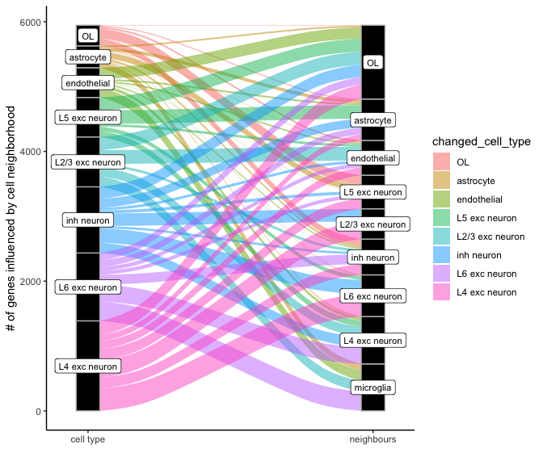

``` r

## filter CPG scores
filter_CPGscores = showCPGscores(CPGscore = CPGscores,
                                 min_cells = 5, min_pval = 0.05,
                                 min_spat_diff = 0.2, min_log2_fc = 0.5,
                                 return_DT = T)
```

-----

</details>

 

### 13\. 2 gene enrichment in cell neighborhood

<details>

<summary>Expand</summary>  

example: ligand - receptor combinations  


``` r
LR_data = fread(system.file("extdata", "mouse_ligand_receptors.txt", package = 'Giotto'))
ligands = LR_data$mouseLigand
receptors = LR_data$mouseReceptor


select_GTG = getGeneToGeneSelection(CPGscore = CPGscores,
                                    specific_genes_1 = ligands, specific_genes_2 = receptors,
                                    min_cells = 1, min_pval = 1, min_spat_diff = 0, min_log2_fc = 0,
                                    verbose = T,
                                    direction = 'both')
#> 
#>  astrocyte-astrocyte 
#> 
#>  astrocyte-L2/3 exc neuron 
#> 
#>  L5 exc neuron-microglia 
#> 
#>  L4 exc neuron-microglia 
#> 
#>  endothelial-endothelial 
#> 
#>  microglia-OL 
#> 
#>  L2/3 exc neuron-L5 exc neuron 
#> 
#>  astrocyte-microglia 
#> 
#>  endothelial-L2/3 exc neuron 
#> 
#>  inh neuron-OL 
#> 
#>  L2/3 exc neuron-OL 
#> 
#>  inh neuron-microglia 
#> 
#>  endothelial-microglia 
#> 
#>  L6 exc neuron-microglia 
#> 
#>  L2/3 exc neuron-microglia 
#> 
#>  L2/3 exc neuron-L6 exc neuron 
#> 
#>  astrocyte-OL 
#> 
#>  L4 exc neuron-OL 
#> 
#>  endothelial-OL 
#> 
#>  astrocyte-endothelial 
#> 
#>  astrocyte-L5 exc neuron 
#> 
#>  endothelial-inh neuron 
#> 
#>  inh neuron-L4 exc neuron 
#> 
#>  astrocyte-inh neuron 
#> 
#>  astrocyte-L4 exc neuron 
#> 
#>  endothelial-L4 exc neuron 
#> 
#>  inh neuron-L2/3 exc neuron 
#> 
#>  L4 exc neuron-L6 exc neuron 
#> 
#>  inh neuron-inh neuron 
#> 
#>  L6 exc neuron-OL 
#> 
#>  astrocyte-L6 exc neuron 
#> 
#>  inh neuron-L6 exc neuron 
#> 
#>  L5 exc neuron-OL 
#> 
#>  endothelial-L5 exc neuron 
#> 
#>  L4 exc neuron-L5 exc neuron 
#> 
#>  OL-OL 
#> 
#>  endothelial-L6 exc neuron 
#> 
#>  L5 exc neuron-L6 exc neuron 
#> 
#>  L2/3 exc neuron-L4 exc neuron 
#> 
#>  inh neuron-L5 exc neuron 
#> 
#>  L5 exc neuron-L5 exc neuron 
#> 
#>  L2/3 exc neuron-L2/3 exc neuron 
#> 
#>  L4 exc neuron-L4 exc neuron 
#> 
#>  L6 exc neuron-L6 exc neuron 
#> 
#>  calculate additional information
```

-----

</details>

 

##### 13.1 difference scRNAseq and seqfish+

<details>

<summary>Expand</summary>  

``` r
# filter nr cells
filter_GTG = select_GTG[nr_1 >= 5 & nr_2 >= 5]
filter_GTG[, all_cell_rank := rank(-all_cell_expr), by = unif_gene_gene]
filter_GTG[, spatial_cell_rank := rank(-spatial_cell_expr), by = unif_gene_gene]

rnaseq_guess = filter_GTG[all_cell_rank == 1]
rnaseq_guess[, spatial_cell_rank := floor(spatial_cell_rank)]
rnaseq_guess[, concordant := ifelse(all_cell_rank == spatial_cell_rank, 'yes', 'no')]
prop.table(table(rnaseq_guess$concordant))
#> 
#>        no       yes 
#> 0.8245192 0.1754808

pl <- ggplot()
pl <- pl + geom_bar(data = rnaseq_guess, aes(x = spatial_cell_rank))
pl <- pl + theme_classic()
pl <- pl + labs(x = 'spatial rank vs 1st expression rank')
pl
```

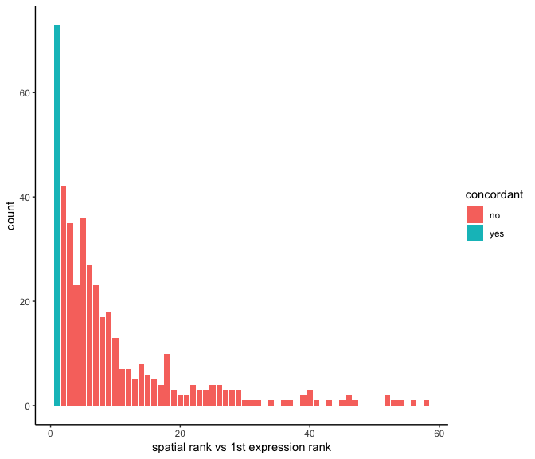

``` r


pl <- ggplot(data = filter_GTG, aes(x = all_cell_rank, y = spatial_cell_rank))
pl <- pl + stat_density2d(aes(fill = stat(level)), geom = 'polygon')
pl <- pl + geom_abline(intercept = 0, slope = 1, linetype = 2)
pl <- pl + scale_fill_viridis_c()
pl <- pl + theme_classic()
pl <- pl + labs(x = 'expression only ranking', y = 'spatial expression ranking')
pl
```

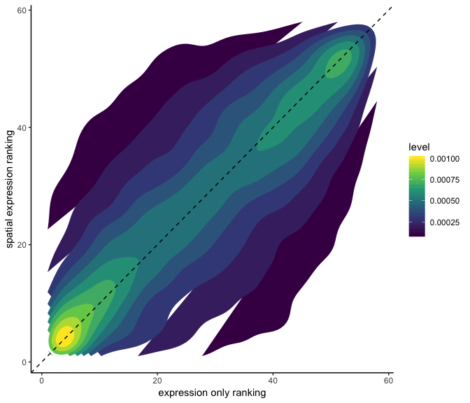

-----

</details>

 

##### 13.2 statistical framework to detect significant cell-cell communication gene-pairs

<details>

<summary>Expand</summary>  

``` r
LR_data[, ligand_det := ifelse(mouseLigand %in% VC_test@gene_ID, T, F)]
LR_data[, receptor_det := ifelse(mouseReceptor %in% VC_test@gene_ID, T, F)]
LR_data_det = LR_data[ligand_det == T & receptor_det == T]

select_ligands = LR_data_det$mouseLigand
select_receptors = LR_data_det$mouseReceptor

## get statistical significance of gene pair expression changes based on expression ##
expr_only_scores = exprOnlyCellCellcommunicationScores(gobject = VC_test,
                                          cluster_column = 'cell_types', 
                                          random_iter = 50,
                                          gene_set_1 = select_ligands,
                                          gene_set_2 = select_receptors)
#> simulation  1 
#> simulation  2 
#> simulation  3 
#> simulation  4 
#> simulation  5 
#> simulation  6 
#> simulation  7 
#> simulation  8 
#> simulation  9 
#> simulation  10 
#> simulation  11 
#> simulation  12 
#> simulation  13 
#> simulation  14 
#> simulation  15 
#> simulation  16 
#> simulation  17 
#> simulation  18 
#> simulation  19 
#> simulation  20 
#> simulation  21 
#> simulation  22 
#> simulation  23 
#> simulation  24 
#> simulation  25 
#> simulation  26 
#> simulation  27 
#> simulation  28 
#> simulation  29 
#> simulation  30 
#> simulation  31 
#> simulation  32 
#> simulation  33 
#> simulation  34 
#> simulation  35 
#> simulation  36 
#> simulation  37 
#> simulation  38 
#> simulation  39 
#> simulation  40 
#> simulation  41 
#> simulation  42 
#> simulation  43 
#> simulation  44 
#> simulation  45 
#> simulation  46 
#> simulation  47 
#> simulation  48 
#> simulation  49 
#> simulation  50


## get statistical significance of gene pair expression changes upon cell-cell interaction
spatial_all_scores = allCellCellcommunicationsScores(VC_test,
                                                  spatial_network_name = 'spatial_network',
                                                  cluster_column = 'cell_types', 
                                                  random_iter = 200,
                                                  gene_set_1 = select_ligands,
                                                  gene_set_2 = select_receptors,
                                                  verbose = 'none')

## filter
selected_spat = spatial_all_scores[pvalue <= 0.01 & abs(log2fc) > 0.5 &
                                 lig_nr >= 5 & rec_nr >= 5]
selected_spat[, lig_rec_cell_types := paste0(lig_cell_type,'-',rec_cell_type)]


## visualize top ints ##
top_ints = unique(selected_spat[order(-abs(log2fc))]$LR_comb)[1:50]

gdt = spatial_all_scores[LR_comb %in% top_ints]
gdt[, lig_rec_cell_types := paste0(lig_cell_type,' - ',rec_cell_type)]

pl <- ggplot()
pl <- pl + geom_point(data = gdt, aes(x = lig_rec_cell_types,
                                      y = LR_comb, size = pvalue, color = log2fc))
pl <- pl + theme_classic() + theme(axis.text.x = element_text(angle = 90,
                                                              size = 6,
                                                              vjust = 1,
                                                              hjust = 1),
                                   axis.text.y = element_text(size = 6))
pl <- pl + scale_size_continuous(range = c(2, 0.1)) + scale_color_gradientn(colours = c('darkblue', 'blue', 'white', 'red', 'darkred'))
pl <- pl + labs(x = '', y = '')
pl
```

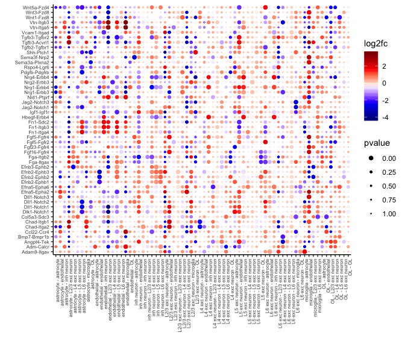

-----

</details>

 

##### 13.3 highlight specific gene pairs (ligand-receptor) interactions

<details>

<summary>Expand</summary>  

example for specific interaction ‘Nrp2-Sema3f’

``` r


## astrocyte - inh neuron
selected_LR = select_GTG[unif_gene_gene == 'Nrp2-Sema3f' &
                           unified_int == 'astrocyte-inh neuron' & genes_1 == 'Nrp2']

plotGTGscores(GTGscore = selected_LR,
              selected_interactions = c('astrocyte-inh neuron'),
              selected_gene_to_gene = 'Nrp2-Sema3f',
              simple_plot = F, detail_plot = T)
```

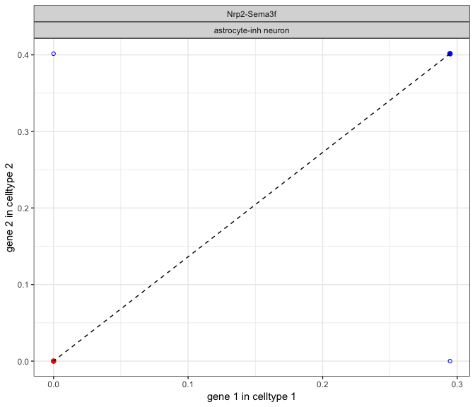

``` r

cellProximityVisPlot(gobject = VC_test, interaction_name = "astrocyte-inh neuron",
                     spatial_network_name = 'spatial_network',
                     cluster_column = 'cell_types', cell_color_code = NULL,
                     cell_color = 'cell_types', show_network = T,
                     network_color = 'blue', point_size_select = 3)
#> first and second dimenion need to be defined, default is first 2
```

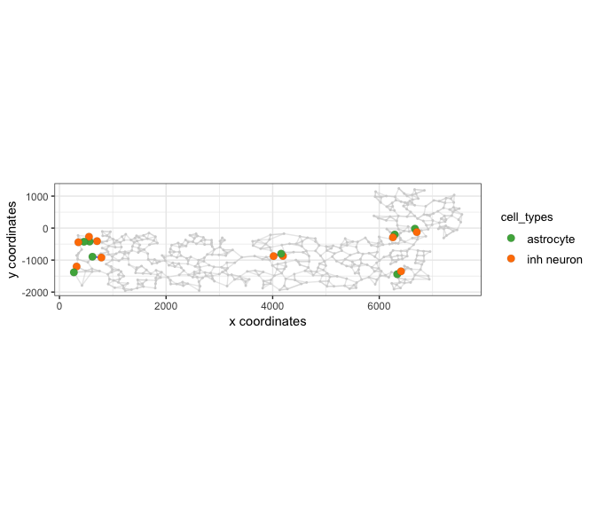

``` r


## microglia - endothelial
selected_LR = select_GTG[unif_gene_gene == 'Nrp2-Sema3f' &
                           unified_int == 'endothelial-microglia' & genes_1 == 'Nrp2']

plotGTGscores(GTGscore = selected_LR,
              selected_interactions = c('endothelial-microglia'),
              selected_gene_to_gene = 'Nrp2-Sema3f',
              simple_plot = F, detail_plot = T)
```

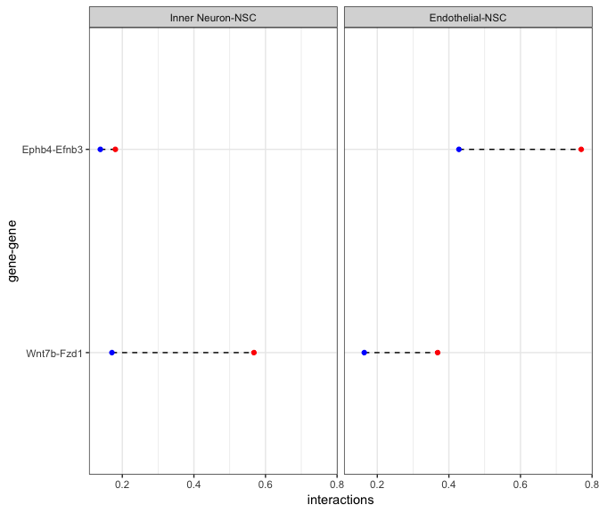

``` r

cellProximityVisPlot(gobject = VC_test, interaction_name = 'endothelial-microglia', spatial_network_name = 'spatial_network',
                     cluster_column = 'cell_types', cell_color_code = NULL,
                     cell_color = 'cell_types', show_network = T,
                     network_color = 'blue', point_size_select = 3)
#> first and second dimenion need to be defined, default is first 2
```

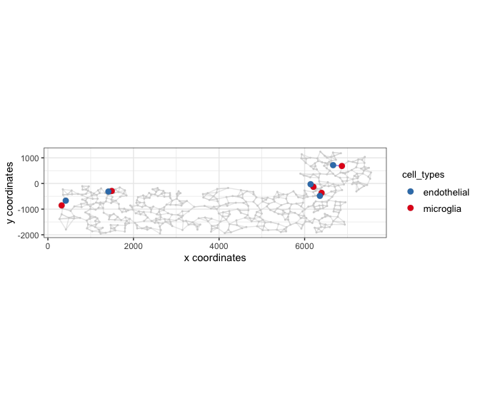

-----

</details>

 

### 14\. export Giotto Analyzer to Viewer

<details>

<summary>Expand</summary>  

``` r

viewer_folder = '/Volumes/Ruben_Seagate/Dropbox/Projects/GC_lab/Ruben_Dries/190225_spatial_package/Results/Mouse_cortex_viewer/'

# select annotations, reductions and expression values to view in Giotto Viewer
exportGiottoViewer(gobject = VC_test, output_directory = viewer_folder,
                   annotations = c('cell_types', 'kmeans',
                                   'global_cell_types', 'sub_cell_types',
                                   'HMRF_k9_b.30'),
                   dim_reductions = c('tsne', 'umap'),
                   dim_reduction_names = c('tsne', 'umap'),
                   expression_values = 'scaled',
                   expression_rounding = 3,
                   overwrite_dir = T)
```

</details>
