<!-- mouse_cortex_1_simple.md is generated from mouse_cortex_1_simple.Rmd Please edit that file -->


```{r, include = FALSE}
knitr::opts_chunk$set(
  collapse = TRUE,
  comment = "#>",
  fig.path = "man/figures/README-",
  out.width = "100%"
)
```

### Giotto global instructions

```{r eval=FALSE, message=FALSE, warning=FALSE}
# this example works with Giotto v.0.1.3
library(Giotto)

## create instructions
## instructions allow us to automatically save all plots into a chosen results folder
## Here we will not automatically save plots, for an example see the osmFISH dataset
## We will only set the python path which is needed for certain analyses
my_python_path = "/Users/rubendries/Bin/anaconda3/envs/py36/bin/pythonw"
results_folder = '/my/results/folder/path/'
instrs = createGiottoInstructions(python_path = my_python_path)
```

### Data input
  
- load cortex/svz gene expression matrix  
- prepare cell coordinates by stitching imaging fields  

Several fields - containing 100's of cells - in the mouse cortex and subventricular zone were imaged. The coordinates of the cells within each field are independent of eachother, so in order to visualize and process all cells together imaging fields will be stitched together by providing x and y-offset values specific to each field. These offset values are known or estimates based on the original raw image:  
{width=7cm} .

```{r, eval=FALSE}
## expression and cell location
data_dir = '/path/to/data/Seqfish_SS_cortex/'
VC_exprs = read.table(paste0(data_dir,"/", "cortex_svz_expression.txt"))
VC_locs = fread(paste0(data_dir,"/", "cortex_svz_centroids_rotated.csv"))

## offset file to combine fields
my_offset_file = data.table(field = c(0, 1, 2, 3, 4, 5, 6),
                            x_offset = c(0, 1654.97, 1750.75, 1674.35, 675.5, 2048, 675),
                            y_offset = c(0, 0, 0, 0, -1438.02, -1438.02, 0))
stitch_file = stitchFieldCoordinates(location_file = VC_locs, offset_file = my_offset_file,
                                     cumulate_offset_x = T, cumulate_offset_y = F,
                                     field_col = 'Field of View',
                                     reverse_final_x = F, reverse_final_y = T)
stitch_file    = stitch_file[,.(X_final, Y_final)]
my_offset_file = my_offset_file[,.(field, x_offset_final, y_offset_final)]
```

***


### part 1: Create Giotto object & process data
<details>
  <summary>Expand</summary>
  \ 
 
```{r eval=FALSE}
## create
VC_test <- createGiottoObject(raw_exprs = VC_exprs, spatial_locs = stitch_file,
                              offset_file = my_offset_file, instructions = instrs)

## add known field annotation
cortex_fields = fread(paste0(data_dir,"/", "cortex_fields_info.txt"))
VC_test = addCellMetadata(VC_test, new_metadata = cortex_fields,
                          by_column = T, column_cell_ID = 'uniq_ID')

## subset for cortex only (first 5 fields)
cell_metadata = pDataDT(VC_test)
cortex_cell_ids = cell_metadata[Field_of_View %in% 0:4]$cell_ID
VC_test = subsetGiotto(VC_test, cell_ids = cortex_cell_ids)

## filter
VC_test <- filterGiotto(gobject = VC_test,
                        expression_threshold = 1,
                        gene_det_in_min_cells = 10,
                        min_det_genes_per_cell = 10,
                        expression_values = c('raw'),
                        verbose = T)

## normalize
VC_test <- normalizeGiotto(gobject = VC_test, scalefactor = 6000, verbose = T)

## add gene & cell statistics
VC_test <- addStatistics(gobject = VC_test)

## adjust expression matrix for technical or known variables
VC_test <- adjustGiottoMatrix(gobject = VC_test, expression_values = c('normalized'),
                              batch_columns = NULL, covariate_columns = c('nr_genes', 'total_expr'),
                              return_gobject = TRUE,
                              update_slot = c('custom'))

## visualize
spatPlot(gobject = VC_test)

```
  
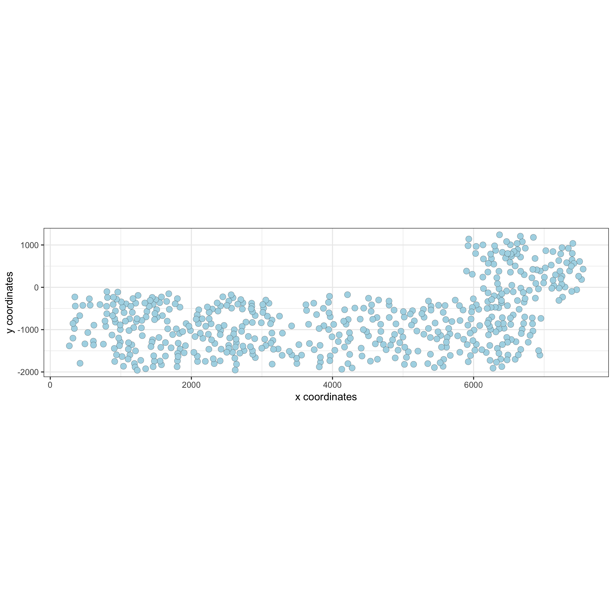{width=16cm} 

</details>

### part 2: dimension reduction

<details>
  <summary>Expand</summary>
  \ 
 
```{r eval=FALSE}
## highly variable genes (HVG)
VC_test <- calculateHVG(gobject = VC_test, method = 'cov_loess', difference_in_cov = 0.1)

## select genes based on HVG and gene statistics, both found in gene metadata
gene_metadata = fDataDT(VC_test)
featgenes = gene_metadata[hvg == 'yes' & perc_cells > 4 & mean_expr_det > 0.5]$gene_ID

## run PCA on expression values (default)
VC_test <- runPCA(gobject = VC_test, genes_to_use = featgenes, scale_unit = F)
signPCA(VC_test, genes_to_use = featgenes, scale_unit = F)

plotPCA(gobject = VC_test)

## run UMAP and tSNE on PCA space (default)
VC_test <- runUMAP(VC_test, dimensions_to_use = 1:30)
plotUMAP(gobject = VC_test)

VC_test <- runtSNE(VC_test, dimensions_to_use = 1:30)
plotTSNE(gobject = VC_test)

```

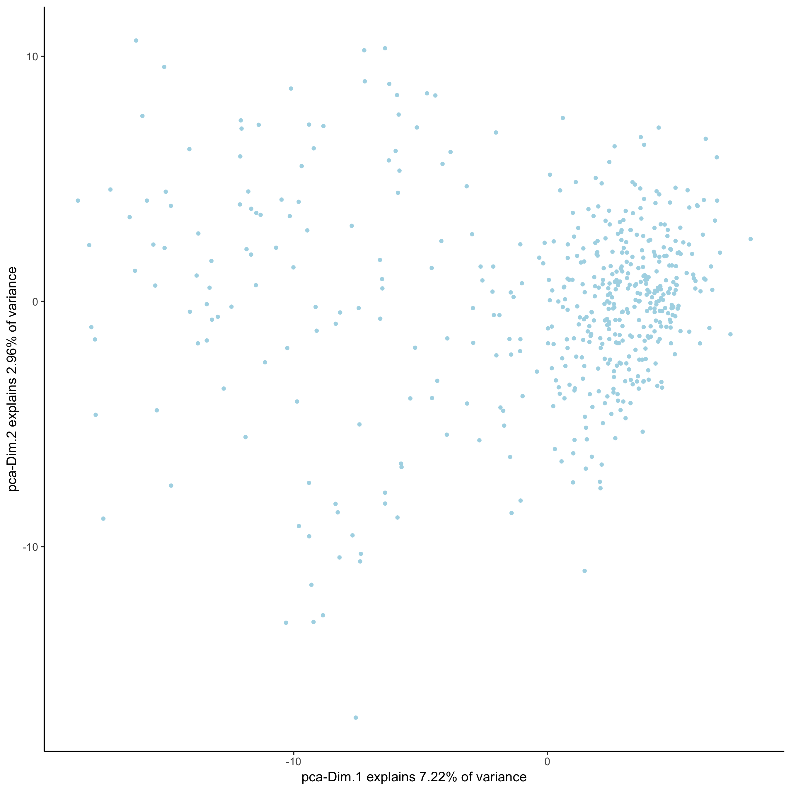{width=16cm} 

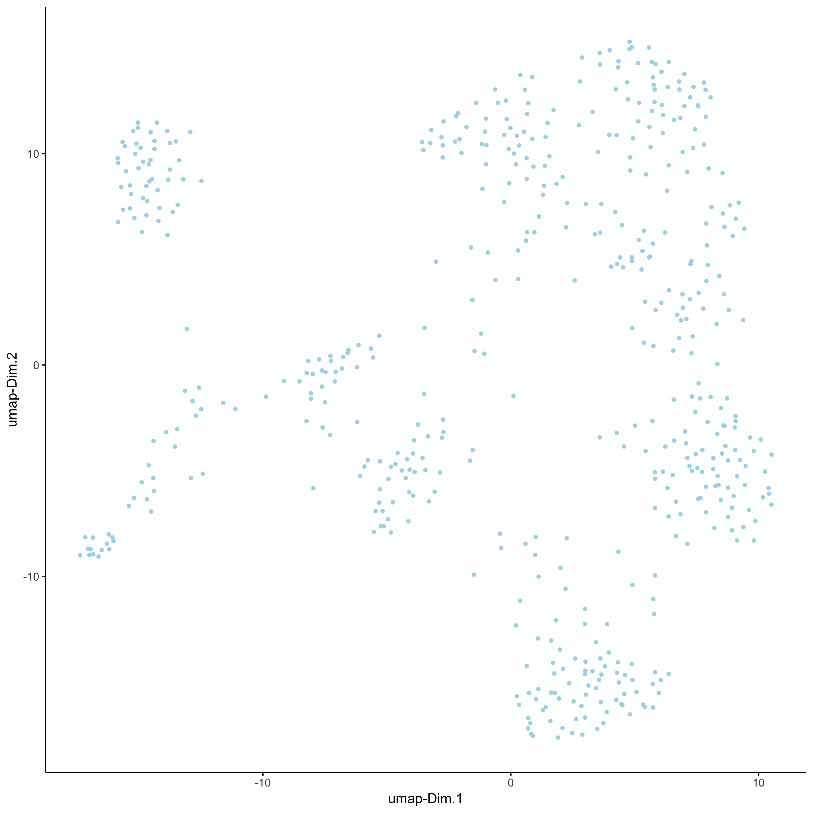{width=16cm} 
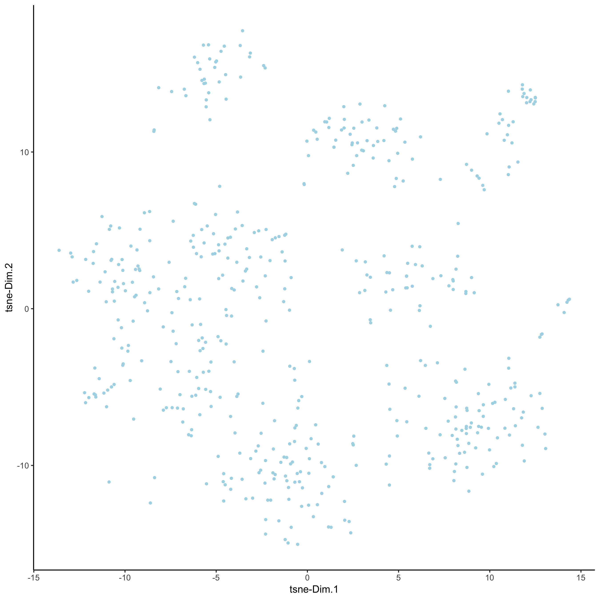{width=16cm} 

***

</details>

### part 3: cluster

<details>
  <summary>Expand</summary>
  \ 
  
```{r eval=FALSE}
## sNN network (default)
VC_test <- createNearestNetwork(gobject = VC_test, dimensions_to_use = 1:15, k = 15)

## Leiden clustering
VC_test <- doLeidenCluster(gobject = VC_test, resolution = 0.4, n_iterations = 1000)
plotUMAP(gobject = VC_test, cell_color = 'leiden_clus', show_NN_network = T, point_size = 2.5)

## Leiden subclustering for specified clusters
VC_test = doLeidenSubCluster(gobject = VC_test, cluster_column = 'leiden_clus',
                             resolution = 0.2, k_neighbors = 10,
                             hvg_param = list(method = 'cov_loess', difference_in_cov = 0.1),
                             pca_param = list(expression_values = 'normalized', scale_unit = F),
                             nn_param = list(dimensions_to_use = 1:5),
                             selected_clusters = c(4, 6, 7),
                             name = 'sub_leiden_clus_select')
plotUMAP(gobject = VC_test,
         cell_color = 'sub_leiden_clus_select', show_NN_network = T, point_size = 2.5)

## show cluster relationships
showClusterHeatmap(gobject = VC_test, cluster_column = 'sub_leiden_clus_select',
                   row_names_gp = grid::gpar(fontsize = 9), column_names_gp = grid::gpar(fontsize = 9))

showClusterDendrogram(VC_test, h = 0.5, rotate = T, cluster_column = 'sub_leiden_clus_select')

```


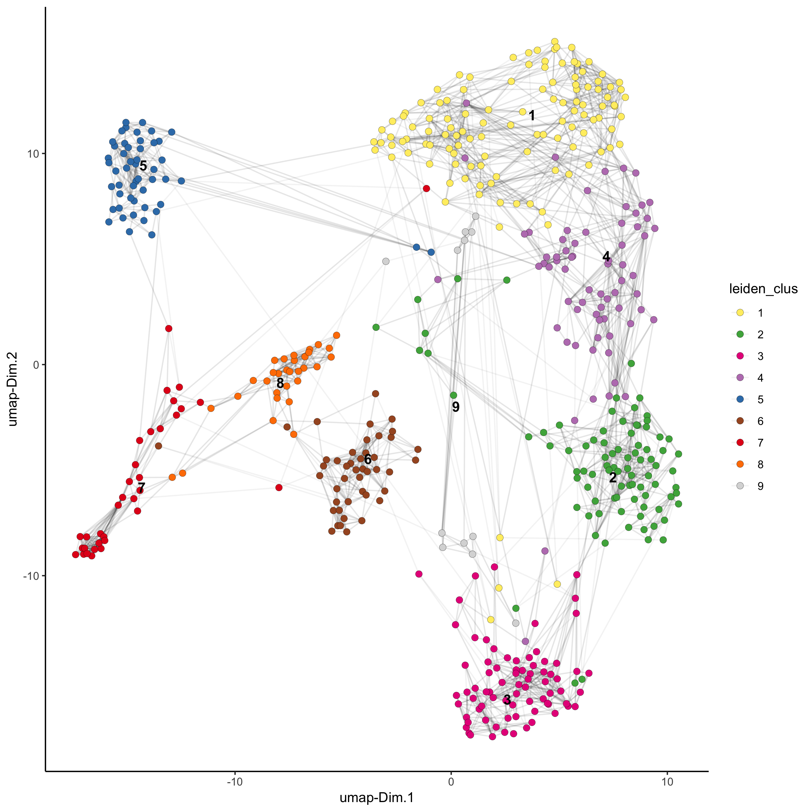{width=16cm} 

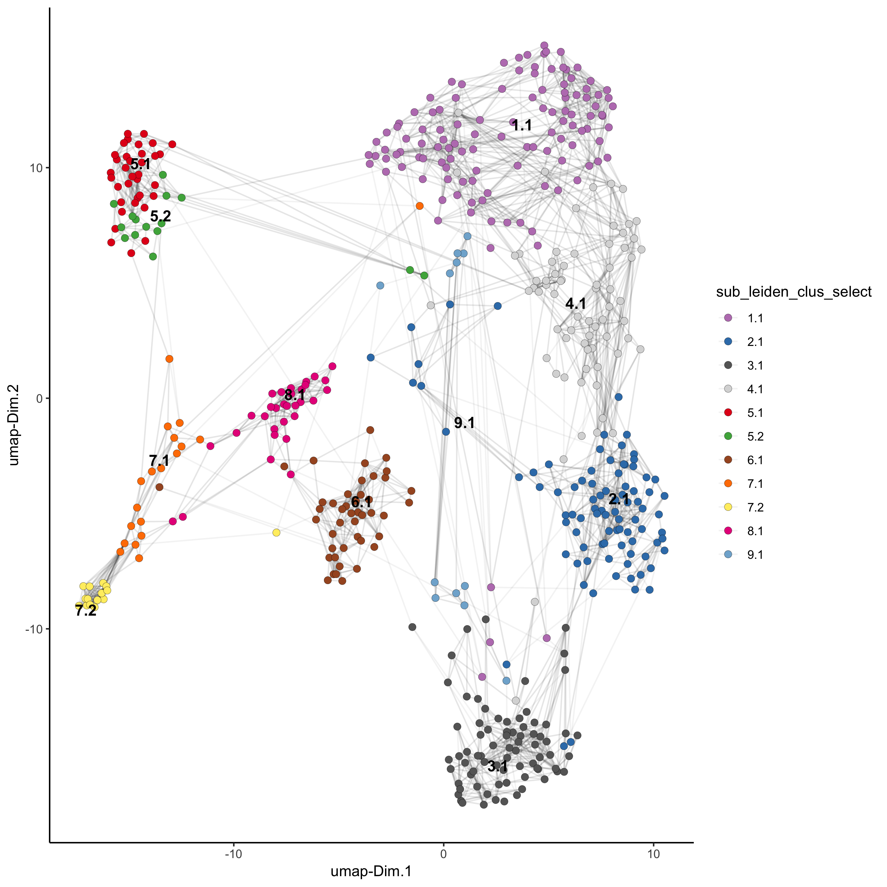{width=16cm} 

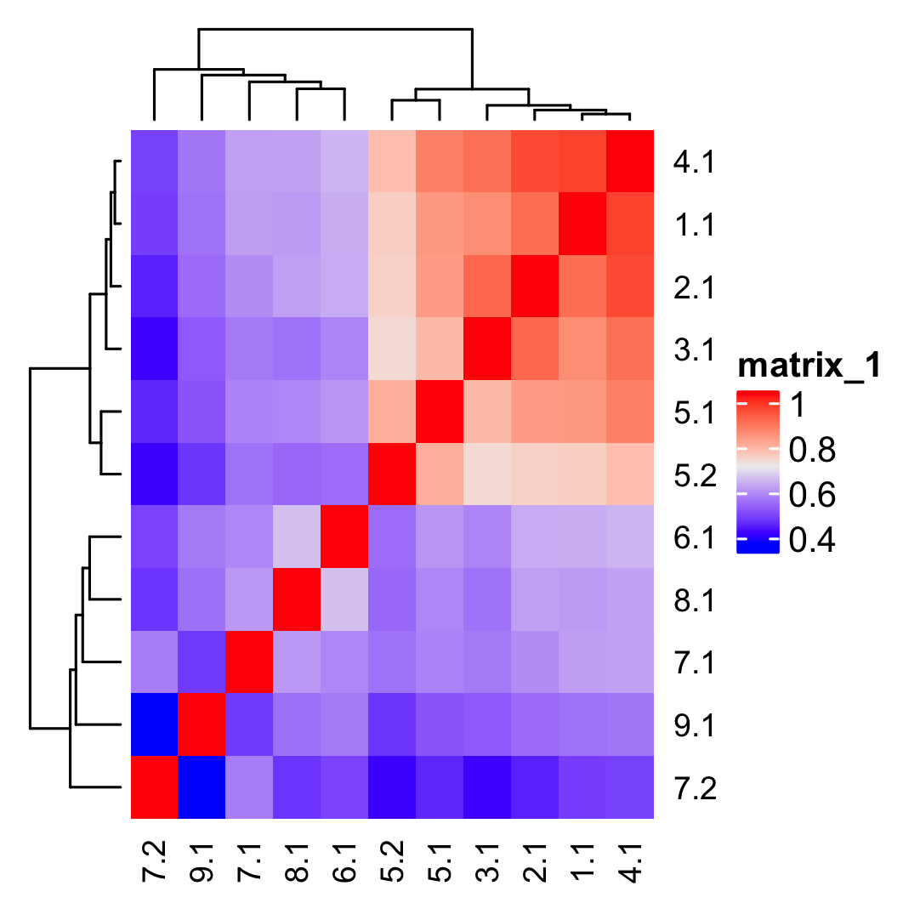{width=16cm} 
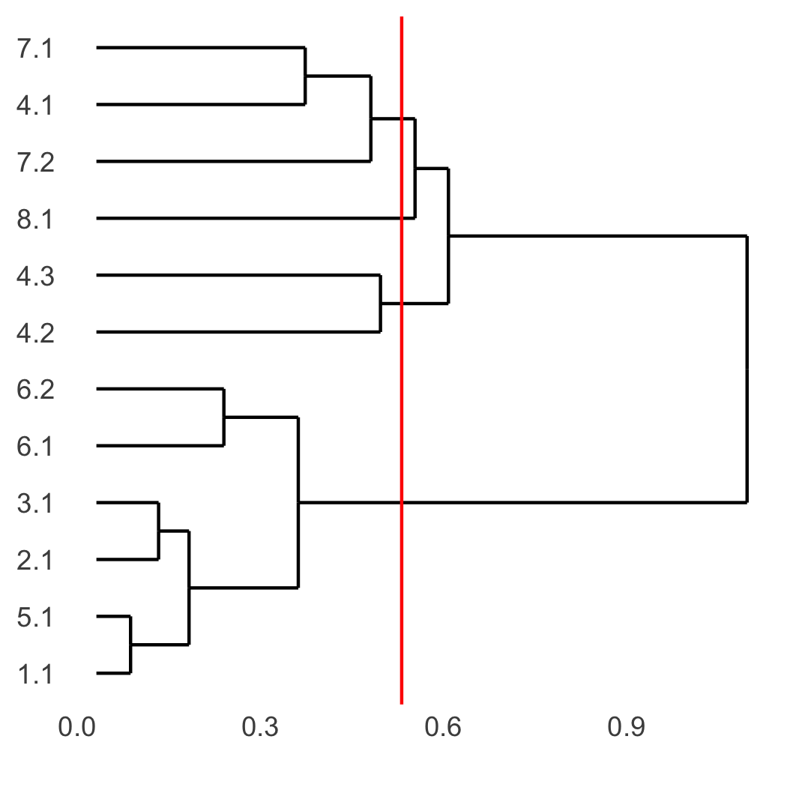{width=16cm} 
***

</details>


### part 4: co-visualize ####
<details>
  <summary>Expand</summary>
  \ 
  
```{r eval=FALSE}
# expression and spatial
spatDimPlot(gobject = VC_test, cell_color = 'sub_leiden_clus_select',
            dim_point_size = 2, spat_point_size = 2)

# selected groups
groups_of_interest = c(5.1, 6.1, 7.1)
group_colors = c('red', 'green', 'blue'); names(group_colors) = groups_of_interest
spatDimPlot(gobject = VC_test, cell_color = 'sub_leiden_clus_select', 
            dim_point_size = 2, spat_point_size = 2,
            select_cell_groups = groups_of_interest, cell_color_code = group_colors)

```

Co-visualzation:
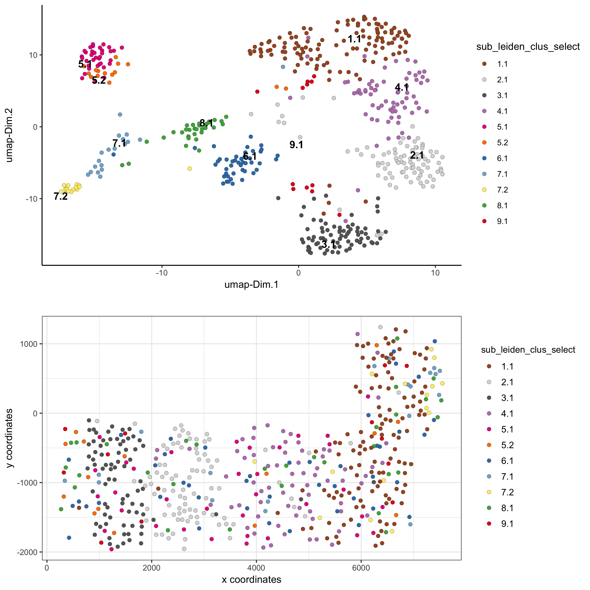{width=16cm} 
Selection:
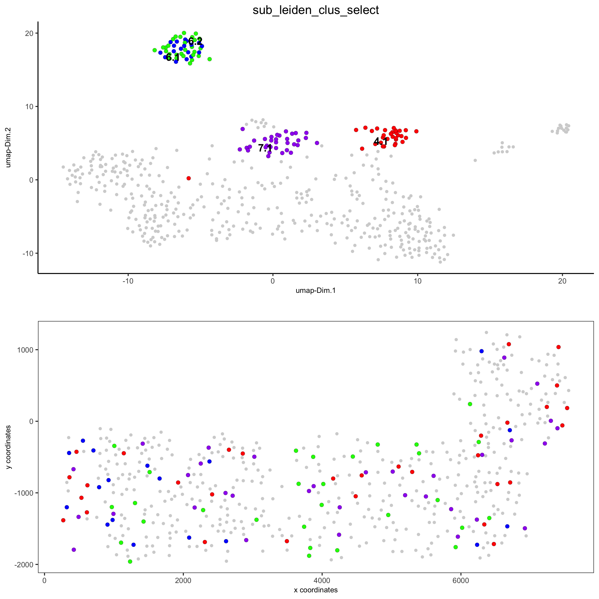{width=16cm} 
***

</details>


### part 5: differential expression ####

<details>
  <summary>Expand</summary>
  \
  
```{r eval=FALSE}
## gini ##
gini_markers_subclusters = findMarkers_one_vs_all(gobject = VC_test,
                                                  method = 'gini',
                                                  expression_values = 'normalized',
                                                  cluster_column = 'sub_leiden_clus_select',
                                                  min_genes = 20,
                                                  min_expr_gini_score = 0.5,
                                                  min_det_gini_score = 0.5)
topgenes_gini = gini_markers_subclusters[, head(.SD, 2), by = 'cluster']$genes

# violinplot
violinPlot(VC_test, genes = unique(topgenes_gini), cluster_column = 'sub_leiden_clus_select',
           strip_text = 8, strip_position = 'right')

# cluster heatmap
my_cluster_order = c(9.1, 3.1, 6.1, 8.1, 5.2, 5.1, 1.1, 4.1, 2.1, 7.1, 7.2)
plotMetaDataHeatmap(VC_test, selected_genes = topgenes_gini, custom_cluster_order = my_cluster_order,
                    metadata_cols = c('sub_leiden_clus_select'))


## scran ##
scran_markers_subclusters = findMarkers_one_vs_all(gobject = VC_test,
                                                   method = 'scran',
                                                   expression_values = 'normalized',
                                                   cluster_column = 'sub_leiden_clus_select')
topgenes_scran = scran_markers_subclusters[, head(.SD, 1), by = 'cluster']$genes

# violinplot
violinPlot(VC_test, genes = unique(topgenes_scran), cluster_column = 'sub_leiden_clus_select',
           strip_text = 10, strip_position = 'right')

# cluster heatmap
plotMetaDataHeatmap(VC_test, selected_genes = topgenes_scran, custom_cluster_order = my_cluster_order,
                    metadata_cols = c('sub_leiden_clus_select'))
```

violinplot gini:
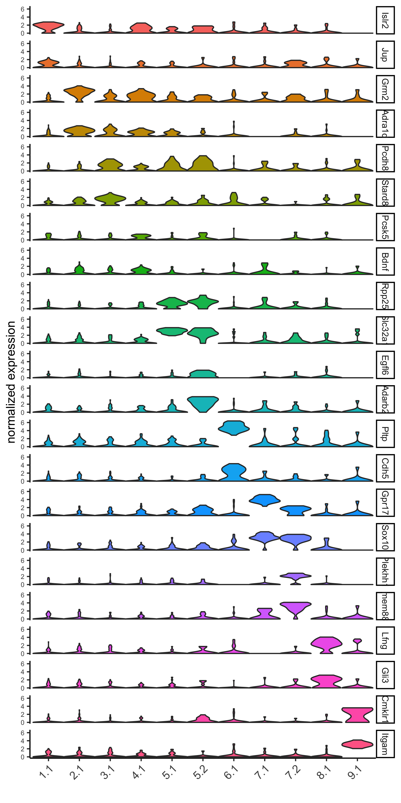{width=16cm} 

Heatmap clusters gini:
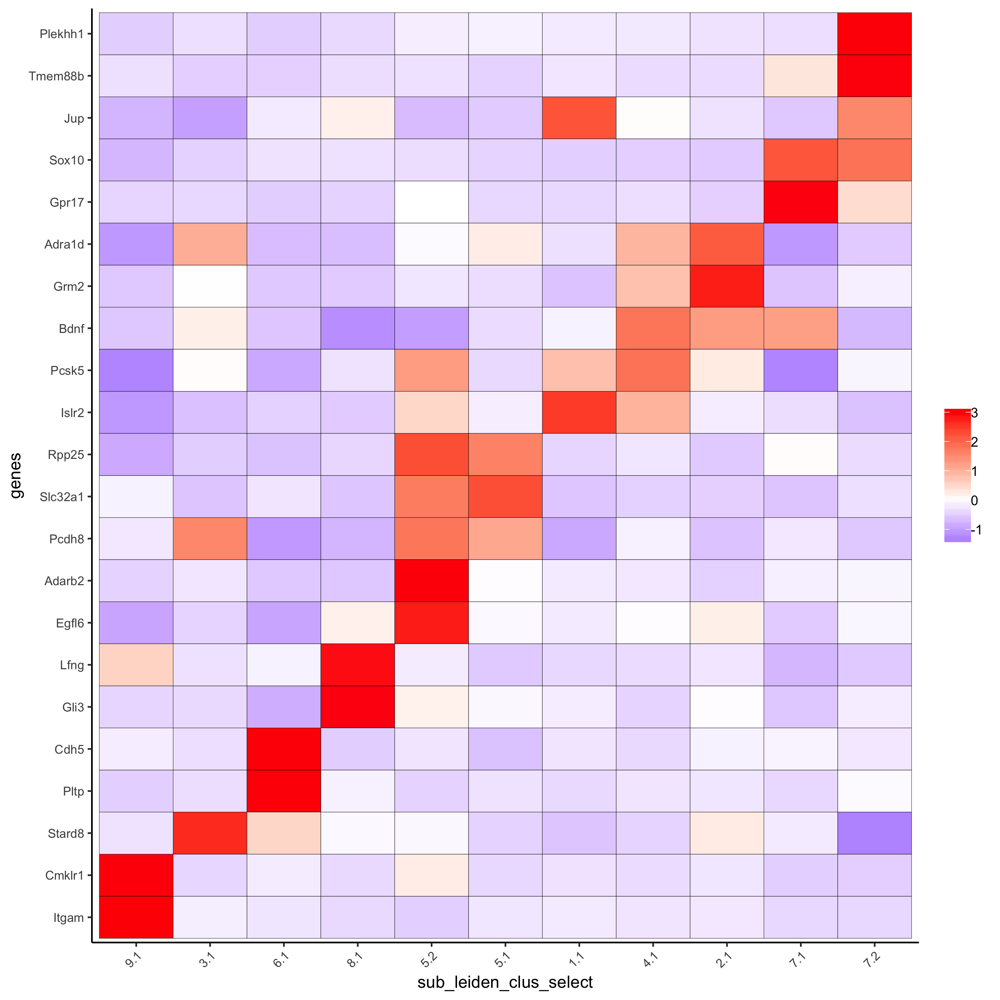{width=16cm} 

violinplot scran:
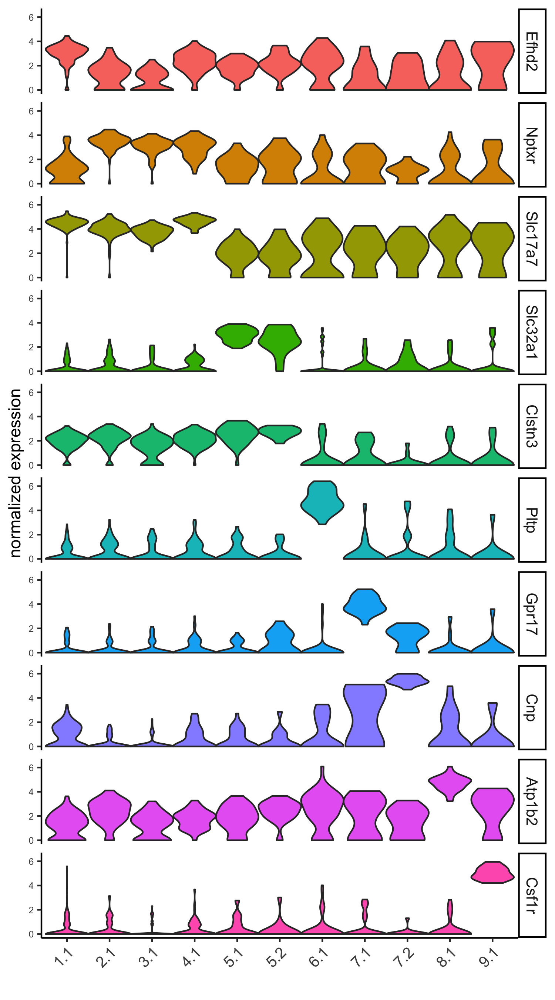{width=16cm} 

Heatmap clusters scran:
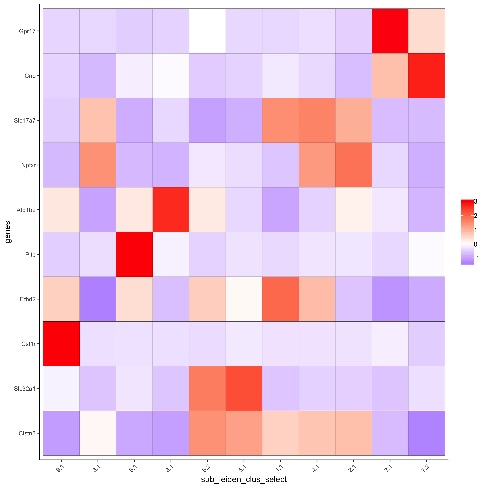{width=16cm} 

***

</details>


### part 6: cell-type annotation

<details>
  <summary>Expand</summary>
  \
  
```{r eval=FALSE}

## general cell types
# create vector with names
clusters_cell_types_cortex = c('microglia', 'L2/3 eNeuron', 'endothelial',
                               'astrocytes', 'Adarb2 iNeuron', 'Lhx6 iNeuron',
                               'L6 eNeuron', 'L5 eNeuron', 'L4 eNeuron',
                               'OPC', 'Olig')
names(clusters_cell_types_cortex) = c(9.1, 3.1, 6.1, 8.1, 5.2, 5.1, 1.1, 4.1, 2.1, 7.1, 7.2)
VC_test = annotateGiotto(gobject = VC_test, annotation_vector = clusters_cell_types_cortex,
                         cluster_column = 'sub_leiden_clus_select', name = 'cell_types')

## violinplot
cell_type_order = c('L6 eNeuron', 'L5 eNeuron', 'L4 eNeuron', 'L2/3 eNeuron',
                    'Adarb2 iNeuron', 'Lhx6 iNeuron','endothelial',
                    'OPC', 'Olig', 'astrocytes',  'microglia')

violinPlot(gobject = VC_test, genes = unique(topgenes_gini),
           strip_text = 7, strip_position = 'right', cluster_custom_order = cell_type_order,
           cluster_column = 'cell_types', color_violin = 'cluster')


## heatmap genes vs cells
plotHeatmap(gobject = VC_test,
            genes = gini_markers_subclusters[, head(.SD, 3), by = 'cluster']$genes,
            gene_custom_order = unique(gini_markers_subclusters[, head(.SD, 3), by = 'cluster']$genes),
            cluster_column = 'cell_types', cluster_order = 'custom',
            cluster_custom_order = cell_type_order, legend_nrows = 2)

plotHeatmap(gobject = VC_test,
            genes = gini_markers_subclusters[, head(.SD, 6), by = 'cluster']$genes,
            gene_label_selection = gini_markers_subclusters[, head(.SD, 2), by = 'cluster']$genes,
            gene_custom_order = unique(gini_markers_subclusters[, head(.SD, 6), by = 'cluster']$genes),
            cluster_column = 'cell_types', cluster_order = 'custom',
            cluster_custom_order = cell_type_order, legend_nrows = 2)

## co-visualization
spatDimPlot(gobject = VC_test, cell_color = 'cell_types',
            dim_point_size = 2, spat_point_size = 2, dim_show_cluster_center = F, dim_show_center_label = T)

spatDimPlot(gobject = VC_test, cell_color = 'cell_types', select_cell_groups = c('astrocytes', 'Olig', 'OPC'),
            dim_point_size = 2, spat_point_size = 2, dim_show_cluster_center = F, dim_show_center_label = T)
```

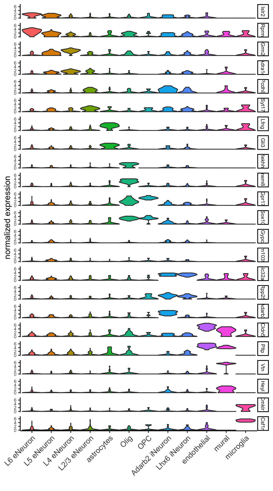{width=16cm} 

{width=16cm} 

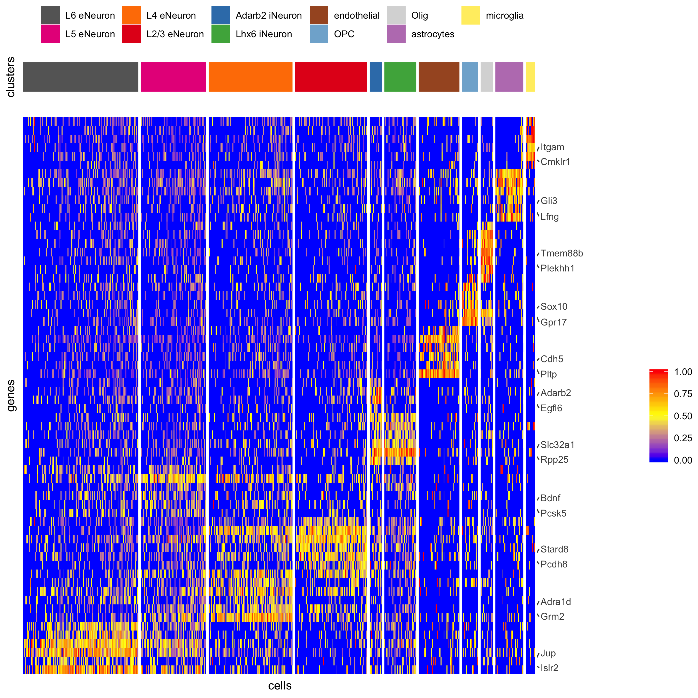{width=16cm} 

{width=16cm} 

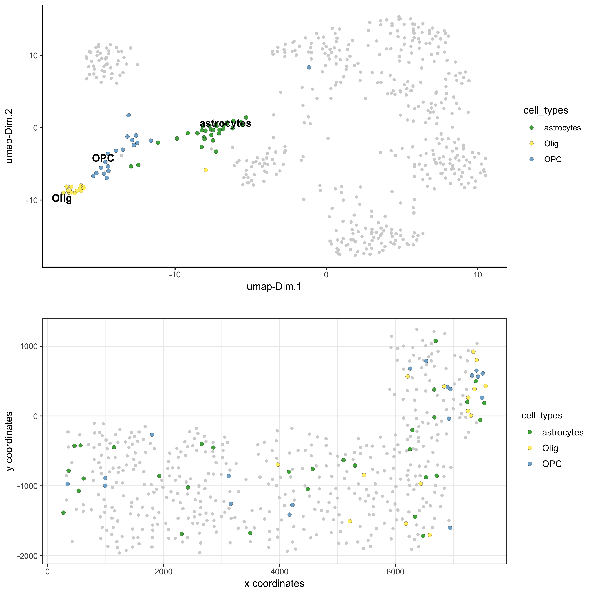{width=16cm} 

***

</details>


### part 7: spatial grid ####

<details>
  <summary>Expand</summary>
  \
  
```{r eval=FALSE}
## create spatial grid
VC_test <- createSpatialGrid(gobject = VC_test,
                             sdimx_stepsize = 500,
                             sdimy_stepsize = 500,
                             minimum_padding = 50)

spatPlot(gobject = VC_test, show_grid = T, point_size = 1.5)

## identify spatial patterns
pattern_VC = detectSpatialPatterns(gobject = VC_test,
                                   expression_values = 'normalized',
                                   min_cells_per_grid = 5,
                                   scale_unit = T, PC_zscore = 1,
                                   show_plot = T)

## show pattern and genes for first identified principal component
showPattern2D(VC_test, pattern_VC, dimension = 1, point_size = 4)
showPatternGenes(VC_test, pattern_VC, dimension = 1, save_plot = T)

```

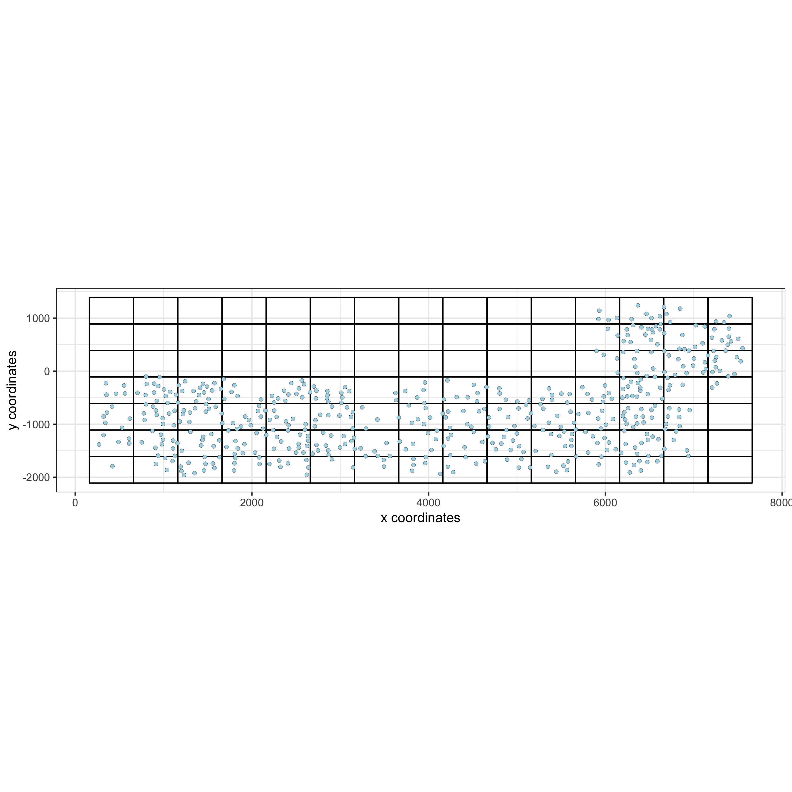{width=16cm} 

pattern 1:
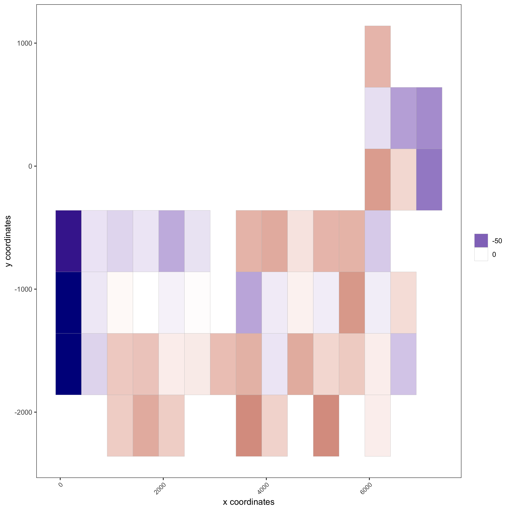{width=16cm} 

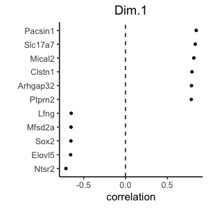{width=16cm} 

***  

</details>


### part 8: spatial network ####

<details>
  <summary>Expand</summary>
  \
  
```{r eval=FALSE}
## create spatial networks based on k and/or distance from centroid
VC_test <- createSpatialNetwork(gobject = VC_test, k = 5)
VC_test <- createSpatialNetwork(gobject = VC_test, k = 10, name = 'large_network')
VC_test <- createSpatialNetwork(gobject = VC_test, k = 100, maximum_distance = 200,
                                minimum_k = 2, name = 'distance_network')

## visualize different spatial networks on first field (~ layer 1)
field1_ids = cell_metadata[Field_of_View == 0]$cell_ID
subVC_test = subsetGiotto(VC_test, cell_ids = field1_ids)

spatPlot(gobject = subVC_test, show_network = T,
        network_color = 'blue', spatial_network_name = 'spatial_network',
        point_size = 2.5, cell_color = 'cell_types')

spatPlot(gobject = subVC_test, show_network = T,
         network_color = 'blue', spatial_network_name = 'large_network',
         point_size = 2.5, cell_color = 'cell_types')

spatPlot(gobject = subVC_test, show_network = T,
         network_color = 'blue', spatial_network_name = 'distance_network',
         point_size = 2.5, cell_color = 'cell_types')
           
```

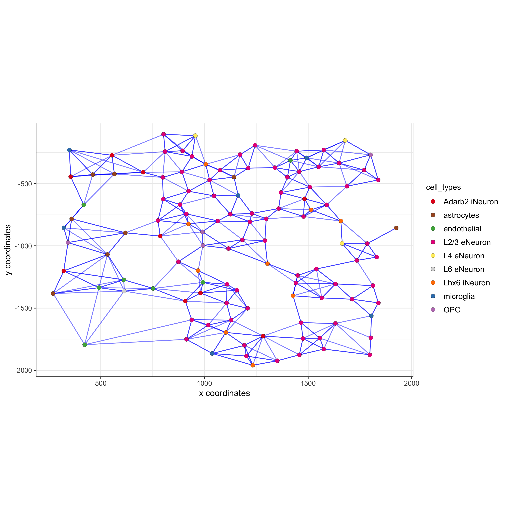{width=16cm} 

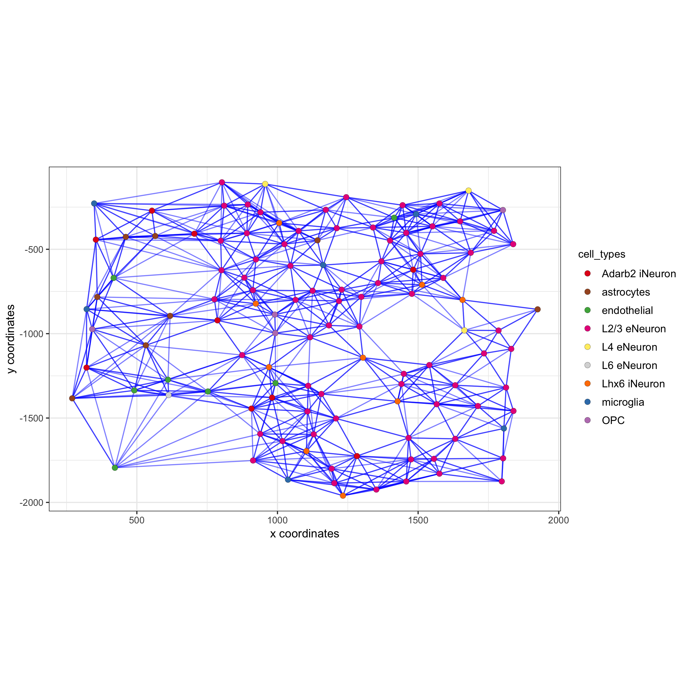{width=16cm} 

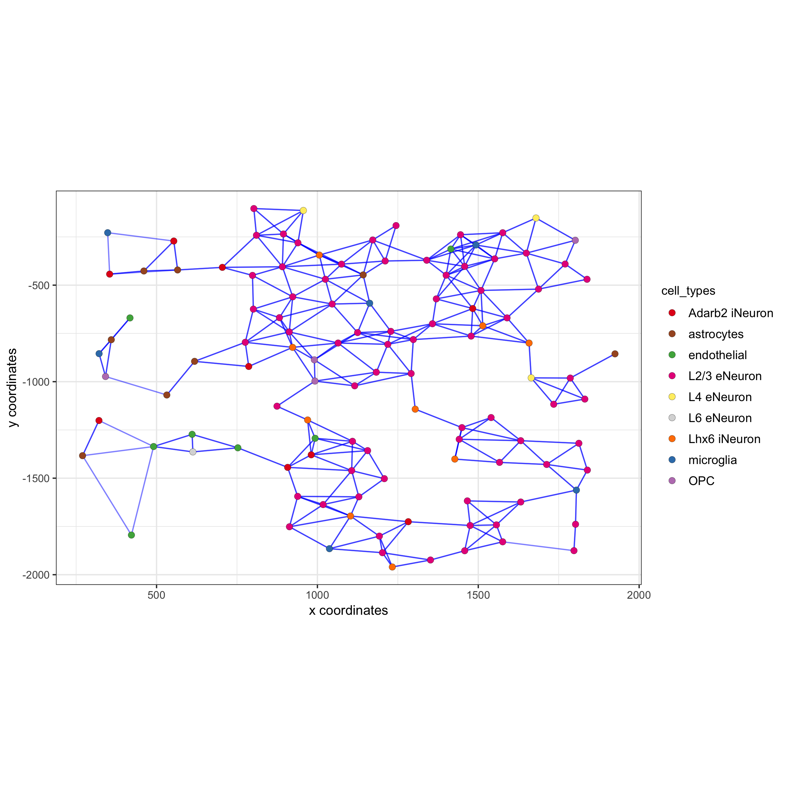{width=16cm} 

***  

</details>


### part 9: spatial genes ####

<details>
  <summary>Expand</summary>
  \
  
```{r eval=FALSE}
kmtest = binGetSpatialGenes(VC_test, bin_method = 'kmeans',
                            do_fisher_test = T, community_expectation = 5,
                            spatial_network_name = 'large_network', verbose = T)

ranktest = binGetSpatialGenes(VC_test, bin_method = 'rank',
                              do_fisher_test = T, community_expectation = 5,
                              spatial_network_name = 'large_network', verbose = T)

spatial_genes = calculate_spatial_genes_python(gobject = VC_test,
                                               expression_values = 'scaled',
                                               rbp_p=0.99, examine_top=0.1)

spatGenePlot(VC_test, expression_values = 'scaled', show_plot = F,
             genes = head(ranktest_m$genes,8), point_size = 2, cow_n_col = 4,
             genes_high_color = 'red', genes_mid_color = 'white', genes_low_color = 'darkblue',
             midpoint = 0, return_plot = F)


```

Spatial genes:  
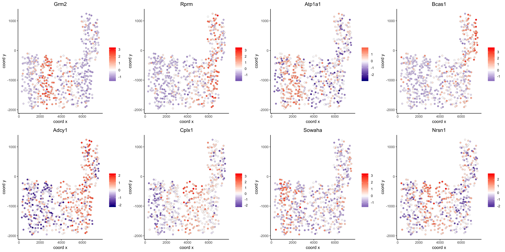{width=16cm} 


***

</details>


### part 10: HMRF domains ####

<details>
  <summary>Expand</summary>
  \

```{r, eval = FALSE}
hmrf_folder = paste0(results_folder,'/','11_HMRF/')
if(!file.exists(hmrf_folder)) dir.create(hmrf_folder, recursive = T)

my_spatial_genes = spatial_genes[1:100]$genes
showClusterHeatmap(gobject = VC_test, cluster_column = 'cell_types', genes = my_spatial_genes)

# do HMRF with different betas
HMRF_spatial_genes = doHMRF(gobject = VC_test, expression_values = 'scaled',
                            spatial_genes = my_spatial_genes,
                            k = 9,
                            betas = c(28,2,3), 
                            output_folder = paste0(hmrf_folder, '/', 'Spatial_genes/SG_top100_k9_scaled'))

## view results of HMRF
for(i in seq(28, 32, by = 2)) {
  viewHMRFresults2D(gobject = VC_test,
                    HMRFoutput = HMRF_spatial_genes,
                    k = 9, betas_to_view = i,
                    point_size = 2)
}

## add HMRF of interest to giotto object
VC_test = addHMRF(gobject = VC_test,
                   HMRFoutput = HMRF_spatial_genes,
                   k = 9, betas_to_add = c(28),
                   hmrf_name = 'HMRF')
## visualize
spatPlot(gobject = VC_test, cell_color = 'HMRF_k9_b.28', point_size = 3)
```

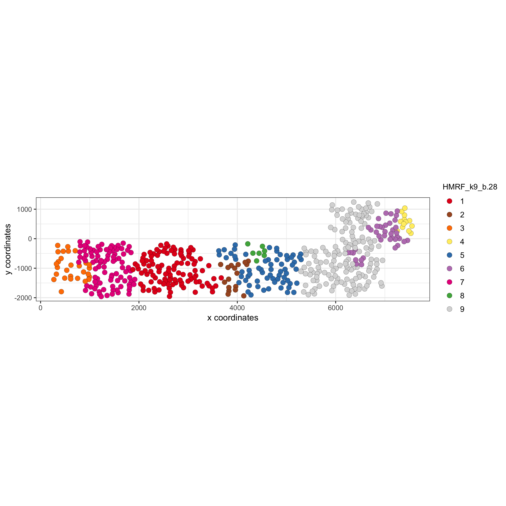{width=16cm} 

***

</details>


### part 11: Cell-cell preferential proximity 

<details>
  <summary>Expand</summary>
  \

{width=12cm}  

```{r eval=FALSE}
## calculate frequently seen proximities
cell_proximities = cellProximityEnrichment(gobject = VC_test,
                                           cluster_column = 'cell_types',
                                           spatial_network_name = 'spatial_network',
                                           number_of_simulations = 1000)
## barplot
cellProximityBarplot(gobject = VC_test, CPscore = cell_proximities, min_orig_ints = 5, min_sim_ints = 5)
## heatmap
cellProximityHeatmap(gobject = VC_test, CPscore = cell_proximities, order_cell_types = T, scale = T,
                     color_breaks = c(-1.5, 0, 1.5), color_names = c('blue', 'white', 'red'))
## network
cellProximityNetwork(gobject = VC_test, CPscore = cell_proximities, remove_self_edges = T, only_show_enrichment_edges = T)

## visualization
spec_interaction = "astrocytes--Olig"
cellProximitySpatPlot(gobject = VC_test,
                      interaction_name = spec_interaction,
                      cluster_column = 'cell_types',
                      cell_color = 'cell_types',
                      point_size_select = 4, point_size_other = 2)

```

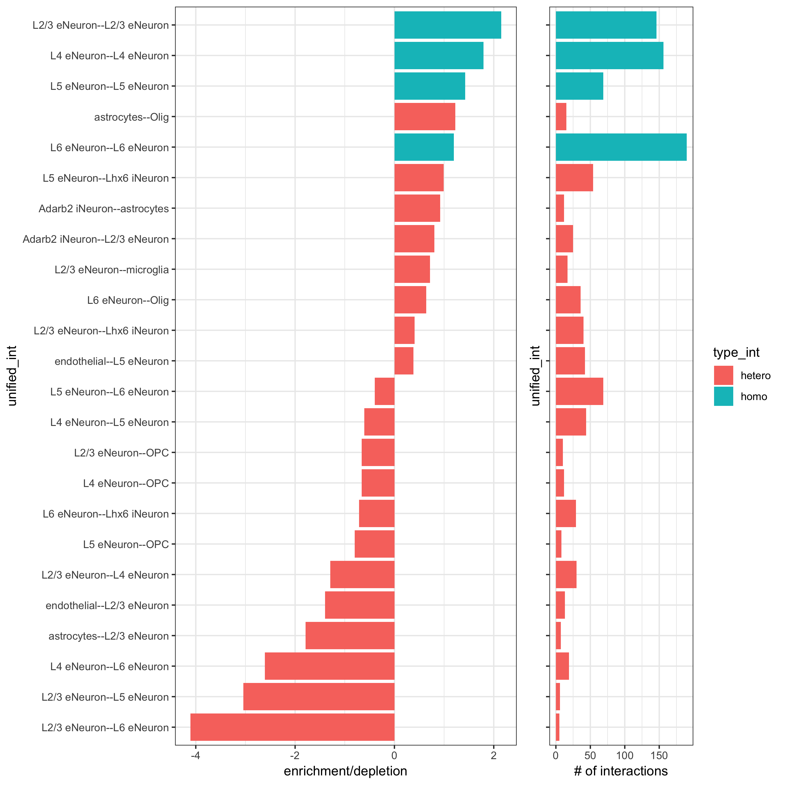{width=16cm} 

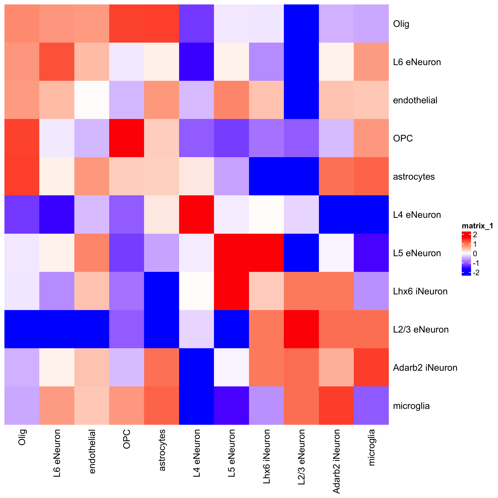{width=16cm} 

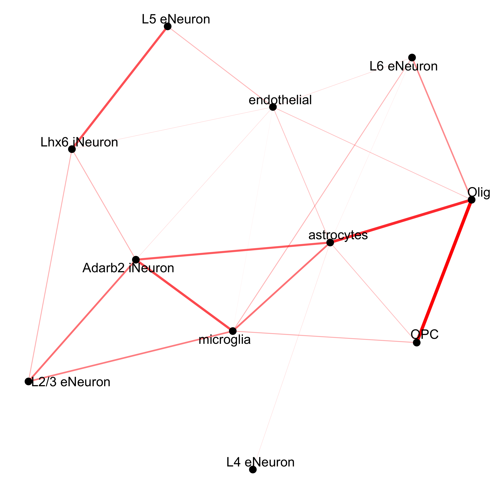{width=16cm} 

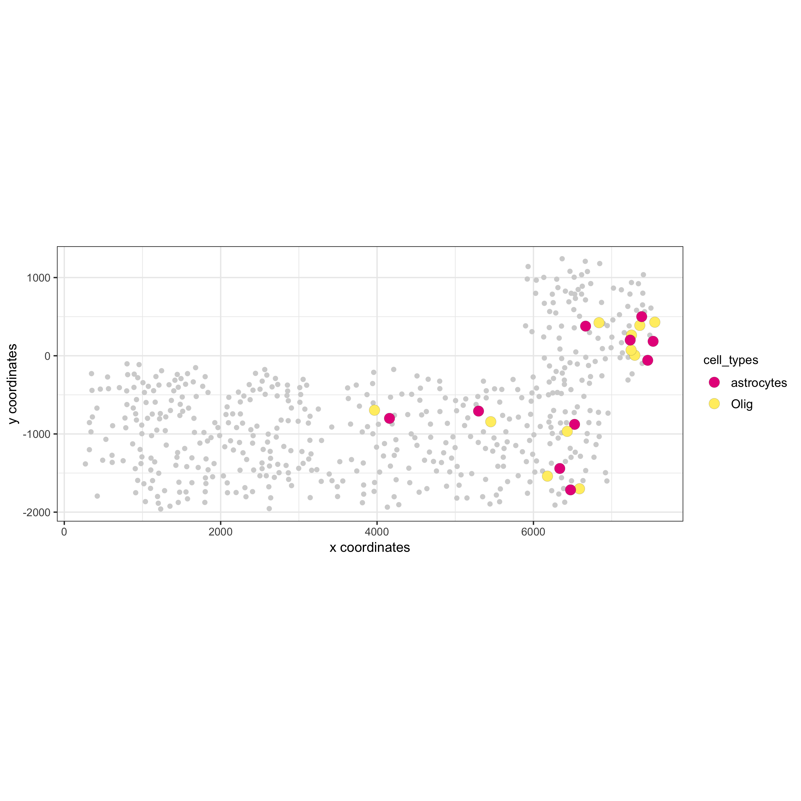{width=16cm} 


***

</details>


### part 12: single gene enrichment in cell neighborhood

<details>
  <summary>Expand</summary>
  \
  
{width=12cm}      

```{r eval=FALSE}
## get cell proximity scores (CPG scores)
CPGscores_wcox =  getCellProximityGeneScores(gobject = VC_test,
                                             cluster_column = 'cell_types',
                                             spatial_network_name = 'spatial_network',
                                             minimum_unique_cells = 5,
                                             diff_test = 'wilcox',
                                             exclude_selected_cells_from_test = T)

## visualize
# volcano plot
volcano = showCPGscores(VC_test, CPGscore = CPGscores_wcox, method = 'volcano')
# barplot
barplot = showCPGscores(VC_test, CPGscore = CPGscores_wcox, method = 'cell_barplot')
# cell-cell plot
cell_cell_barplot = showCPGscores(VC_test, CPGscore = CPGscores_wcox, method = 'cell-cell')
# sankey plot
library(ggalluvial)
sankey = showCPGscores(VC_test, CPGscore = CPGscores_wcox, method = 'cell_sankey')

## filter CPG scores
filter_CPGscores = filterCPGscores(CPGscore = CPGscores_wcox)
```

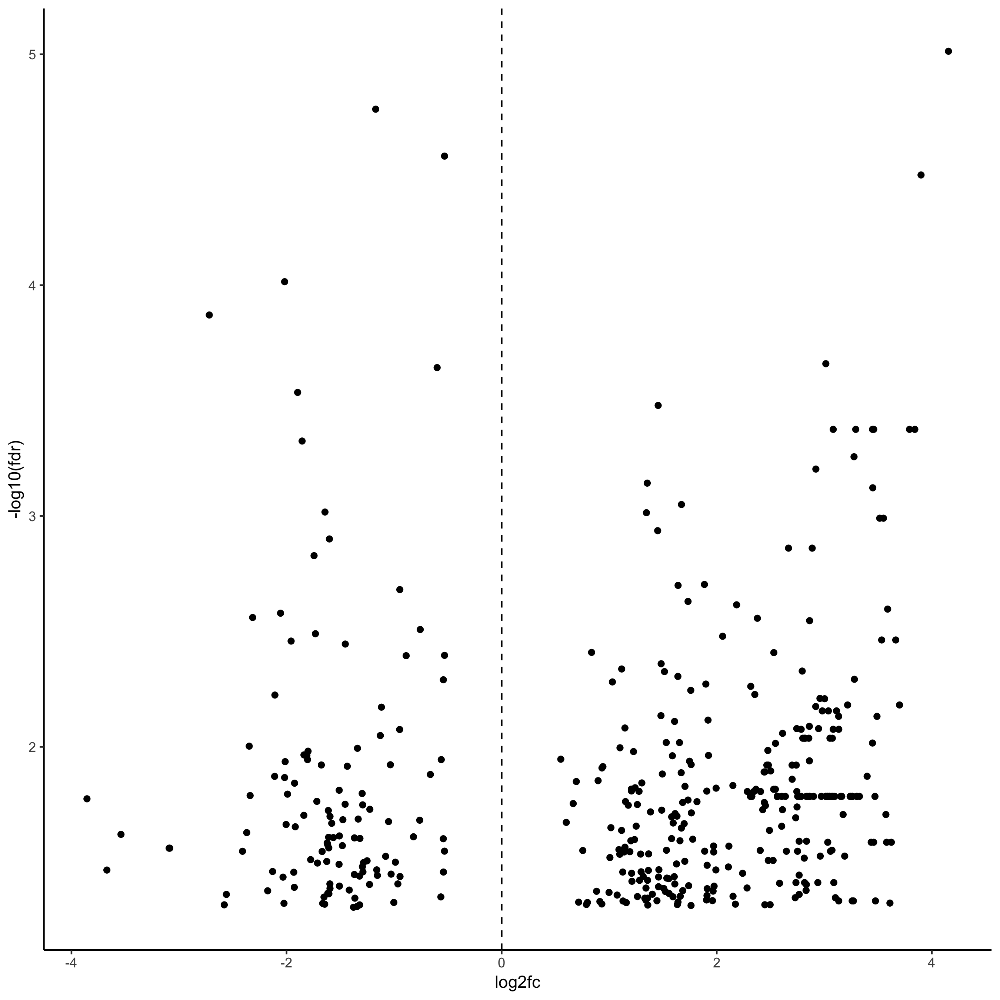{width=16cm} 

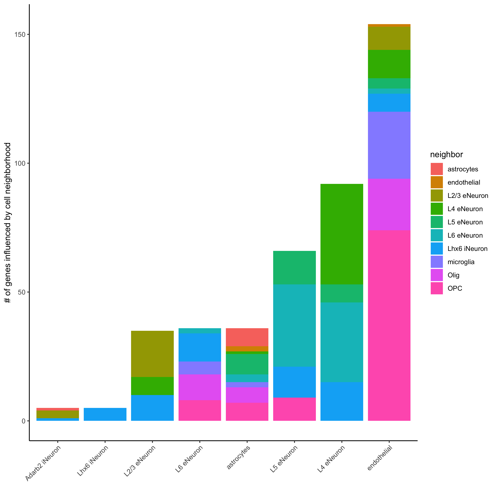{width=16cm} 

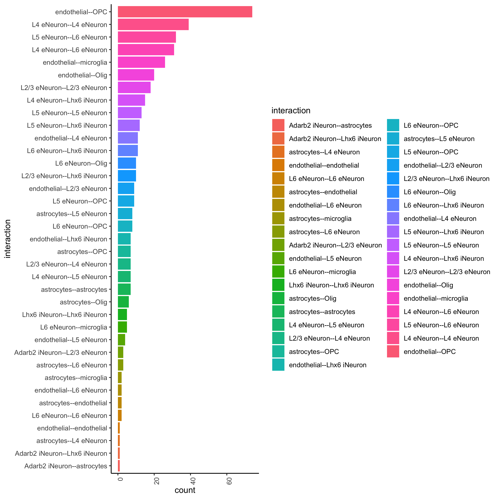{width=16cm} 

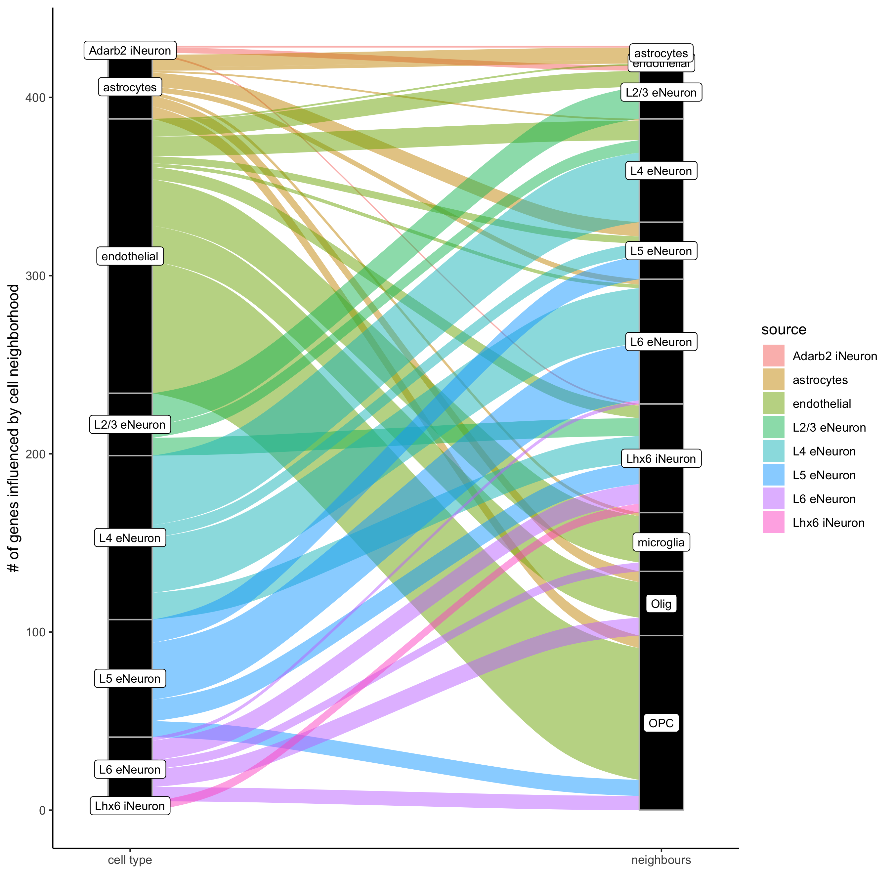{width=16cm} 


*** 

</details>


### part 13: double gene enrichment in cell neighborhood

<details>
  <summary>Expand</summary>
  \

```{r eval=FALSE}
## get gene-to-gene scores from the CPG scores
GTG_scores = getGeneToGeneScores(CPGscore = filter_CPGscores,
                                    specific_genes_1 = NULL,
                                    specific_genes_2 = NULL,
                                    min_cells = 5, min_fdr = 0.05,
                                    min_spat_diff = 0, min_log2_fc = 0,
                                    verbose = T,
                                    direction = 'both')

## Anxa6 vs Tmem98 in astrocyte - inh neuron is one of the top pairs and biologically interesting!
selected_LR = GTG_scores[unif_gene_gene == 'Anxa6--Tmem98' & unified_int == 'astrocytes--OPC']

plotGTGscores(gobject = VC_test,
              GTGscore = selected_LR,
              selected_interactions = c('astrocytes--OPC'),
              selected_gene_to_gene = 'Anxa6--Tmem98',
              simple_plot = F, detail_plot = T)

cellProximitySpatPlot(gobject = VC_test, interaction_name = "astrocytes--OPC",
                      spatial_network_name = 'spatial_network',
                      cluster_column = 'cell_types', cell_color_code = NULL,
                      cell_color = 'cell_types', show_network = T,
                      network_color = 'blue', point_size_select = 3)

```

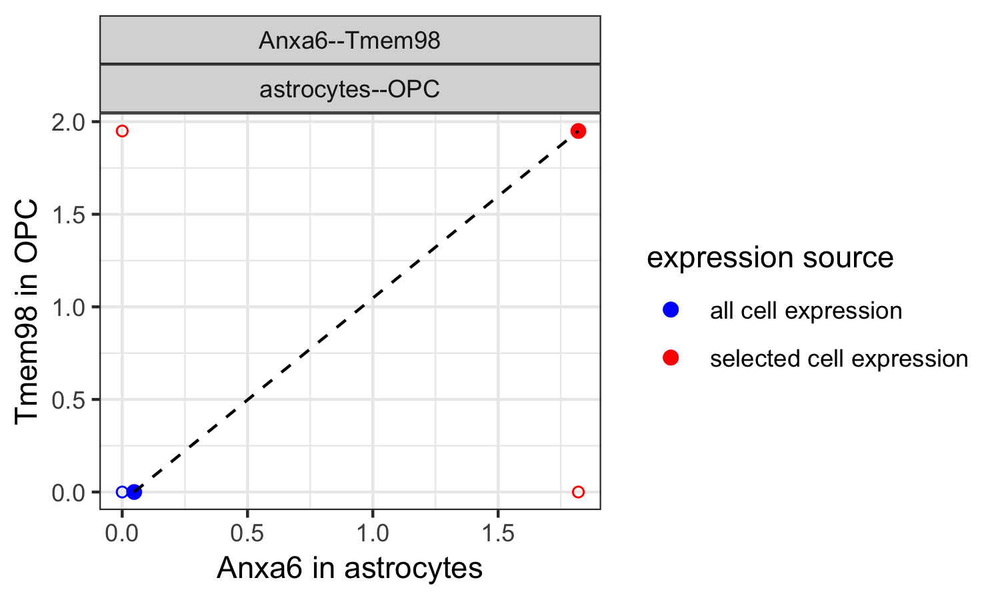{width=16cm}

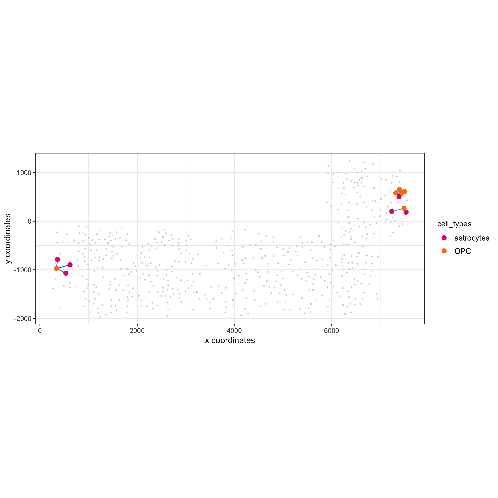{width=16cm}

*** 

</details>


### part 14: Ligand receptor statistical enrichment analysis

<details>
  <summary>Expand</summary>
  \

```{r eval=FALSE}
## read ligand receptor information
LR_data = fread(system.file("extdata", "mouse_ligand_receptors.txt", package = 'Giotto'))

LR_data[, ligand_det := ifelse(mouseLigand %in% VC_test@gene_ID, T, F)]
LR_data[, receptor_det := ifelse(mouseReceptor %in% VC_test@gene_ID, T, F)]
LR_data_det = LR_data[ligand_det == T & receptor_det == T]
select_ligands = LR_data_det$mouseLigand
select_receptors = LR_data_det$mouseReceptor

## get statistical significance of gene pair expression changes based on expression only
expr_only_scores = exprOnlyCellCellcommunicationScores(gobject = VC_test,
                                                       cluster_column = 'cell_types', 
                                                       random_iter = 100,
                                                       gene_set_1 = select_ligands,
                                                       gene_set_2 = select_receptors)


## get statistical significance of gene pair expression changes upon cell-cell interaction
spatial_all_scores = allCellCellcommunicationsScores(VC_test,
                                                     spatial_network_name = 'spatial_network',
                                                     cluster_column = 'cell_types', 
                                                     random_iter = 200,
                                                     gene_set_1 = select_ligands,
                                                     gene_set_2 = select_receptors,
                                                     verbose = 'a little')


## filter
selected_spat = spatial_all_scores[pvalue <= 0.01 & abs(log2fc) > 0.25 &
                                     lig_nr >= 5 & rec_nr >= 5]
selected_spat[, lig_rec_cell_types := paste0(lig_cell_type,'-',rec_cell_type)]
setorder(selected_spat, -log2fc)

## visualize top ints ##
top_ints = unique(selected_spat[order(-abs(log2fc))]$LR_comb)[1:30]
gdt = spatial_all_scores[LR_comb %in% top_ints]
gdt[, lig_rec_cell_types := paste0(lig_cell_type,' - ',rec_cell_type)]
gdt = gdt[pvalue < 0.01]

## ggplot visualization of L-R usage enrichment of depletion between cell-types
pl <- ggplot()
pl <- pl + geom_point(data = gdt, aes(x = lig_rec_cell_types,
                                      y = LR_comb, size = pvalue, color = log2fc))
pl <- pl + theme_classic() + theme(axis.text.x = element_text(angle = 90,
                                                              size = 10,
                                                              vjust = 1,
                                                              hjust = 1),
                                   axis.text.y = element_text(size = 10))
pl <- pl + scale_size_continuous(range = c(2, 1)) 
pl <- pl + scale_color_gradientn(colours = c('darkblue', 'blue', 'white', 'red', 'darkred'))
pl <- pl + labs(x = '', y = '')
pl
```

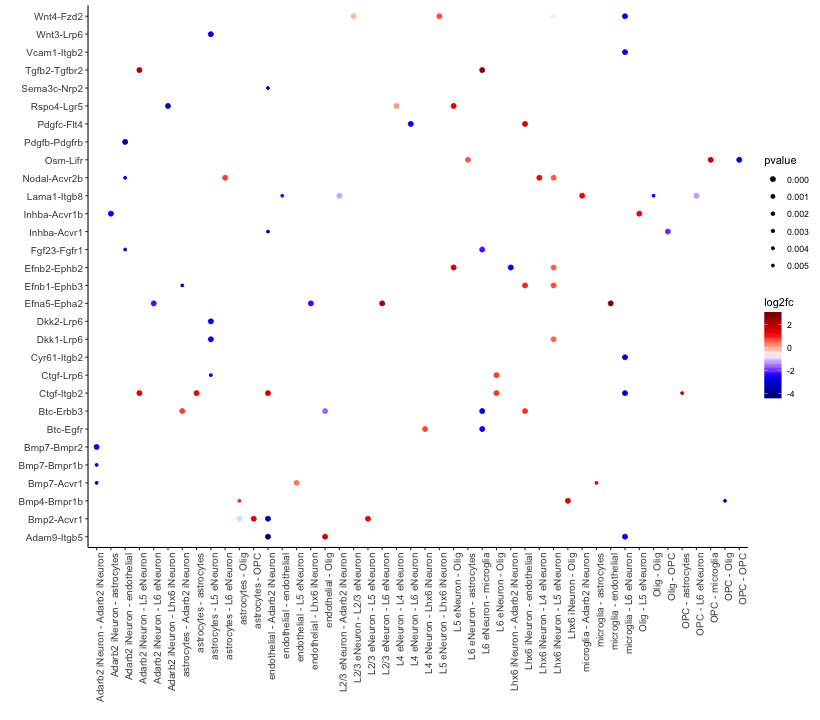{width=16cm}

*** 

</details>


### part 15: export results to view in Giotto viewer
<details>
  <summary>Expand</summary>
  \

```{r eval=FALSE}
viewer_folder = paste0(results_folder, '/', 'Mouse_cortex_viewer')

# select annotations, reductions and expression values to view in Giotto Viewer
exportGiottoViewer(gobject = VC_test, output_directory = viewer_folder,
                   annotations = c('cell_types', 'kmeans',
                                   'cell_types',
                                   'HMRF_k9_b.28'),
                   dim_reductions = c('tsne', 'umap'),
                   dim_reduction_names = c('tsne', 'umap'),
                   expression_values = 'scaled',
                   expression_rounding = 3,
                   overwrite_dir = T)
```

*** 

</details>

