<!-- mouse_hypo_1_simple.md is generated from mouse_hypo_1_simple.Rmd Please edit that file -->


```{r, include = FALSE}
knitr::opts_chunk$set(
  collapse = TRUE,
  comment = "#>",
  fig.path = "man/figures/README-",
  out.width = "100%"
)
```

### Giotto global instructions
```{r eval=FALSE, message=FALSE, warning=FALSE}
# this example works with Giotto v.0.1.2
library(Giotto)

# create instructions
# my_python_path = "/Users/rubendries/Bin/anaconda3/envs/py36/bin/pythonw"
my_python_path = "/homes6/kanliu/miniconda3/bin/python"
# results_folder = '/path/to/merFISH_neohypo_results/'
results_folder = '/gcdata/kliu/Datasets/spatial-datasets-result/merfish'

instrs = createGiottoInstructions(python_path = my_python_path,
                                  show_plot = F, return_plot = T, save_plot = T,
                                  save_dir = results_folder,
                                  plot_format = 'png',
                                  dpi = 300, height = 9, width = 9)

```

### Data input

[Moffitt et al.](https://science.sciencemag.org/content/362/6416/eaau5324) created a 3D spatial expression dataset consisting of 155 genes from ~1 million single cells acquired over the mouse hypothalamic preoptic regions.
  
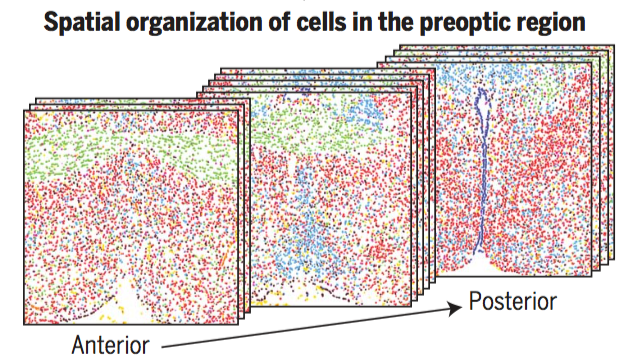{width=20cm} .

```{r, eval=FALSE}
## select the directory where you have saved the Spatial Transcriptomics data
# data_dir = '/path/to/merFISH_data/'
data_dir = '/gcdata/kliu/Datasets/spatial-datasets-master/data/2019_merFISH_PNAS'
# data_dir = '/gcdata/kliu/Datasets/spatial-datasets-master/data/2019_merFISH_PNAS_ds_3'
expr = read.table(paste0(data_dir, '/', 'count_matrix/merFISH_3D_data_expression.txt'))
cell_loc = read.table(paste0(data_dir, '/', 'cell_locations/merFISH_3D_data_cell_locations.txt'))
cell_type = read.table(paste0(data_dir, '/', 'cell_types/merFISH_3D_data_cell_types.txt'))
type_level = read.table(paste0(data_dir, '/', 'cell_types/merFISH_3D_data_type_levels.txt'))
```

***


### 1. Create Giotto object & process data
<details>
  <summary>Expand</summary>
  \ 
 
```{r eval=FALSE}
## create
merFISH_test <- createGiottoObject(raw_exprs = expr, spatial_locs = cell_loc, instructions = instrs)

## add layer annotation
layer_ID = data.table(merFISH_test@cell_metadata$cell_ID)
colnames(layer_ID) = 'layer_ID'
layers = unique(merFISH_test@spatial_locs$sdimz)
for(i in 1:length(layers)){
  cell_ids = merFISH_test@spatial_locs$cell_ID
  layer_ID[merFISH_test@spatial_locs$sdimz == layers[i]] = i
}
layer_ID = as.data.frame(sapply(layer_ID, as.numeric))
layer_ID = cbind(merFISH_test@cell_metadata, layer_ID)
merFISH_test = addCellMetadata(merFISH_test, new_metadata = layer_ID,
                               by_column = T, column_cell_ID = 'cell_ID')

## filter raw data
# 1. pre-test filter parameters
filterDistributions(merFISH_test, detection = 'genes')
filterDistributions(merFISH_test, detection = 'cells')
filterCombinations(merFISH_test, expression_thresholds = c(0,1e-6,1e-5), gene_det_in_min_cells = c(500, 1000, 1500), min_det_genes_per_cell = c(1, 5, 10))
# 2. filter data
merFISH_test <- filterGiotto(gobject = merFISH_test,
                          gene_det_in_min_cells = 0,
                          min_det_genes_per_cell = 0)
## normalize
merFISH_test <- normalizeGiotto(gobject = merFISH_test, scalefactor = 10000, verbose = T)
merFISH_test <- addStatistics(gobject = merFISH_test)
merFISH_test <- adjustGiottoMatrix(gobject = merFISH_test, expression_values = c('normalized'),
                                batch_columns = NULL, covariate_columns = c('nr_genes', 'total_expr'),
                                return_gobject = TRUE,
                                update_slot = c('custom'))

# save according to giotto instructions
# 2D
spatPlot2D(gobject = merFISH_test, point_size = 1.5, 
           save_param = list(save_folder = '2_Gobject', save_name = 'spatial_locations2D', units = 'in'))
spatPlot2D(gobject = merFISH_test, point_size = 1.5)

# 3D
spatPlot3D(gobject = merFISH_test, point_size = 2.0, axis_scale = 'real',
           save_param = list(save_folder = '2_Gobject', save_name = 'spatial_locations3D', units = 'in'))
spatPlot3D(gobject = merFISH_test, point_size = 2.0, axis_scale = 'real')


```
  
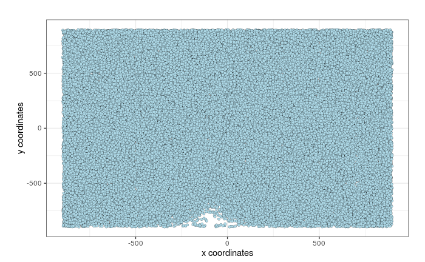{width=16cm} 

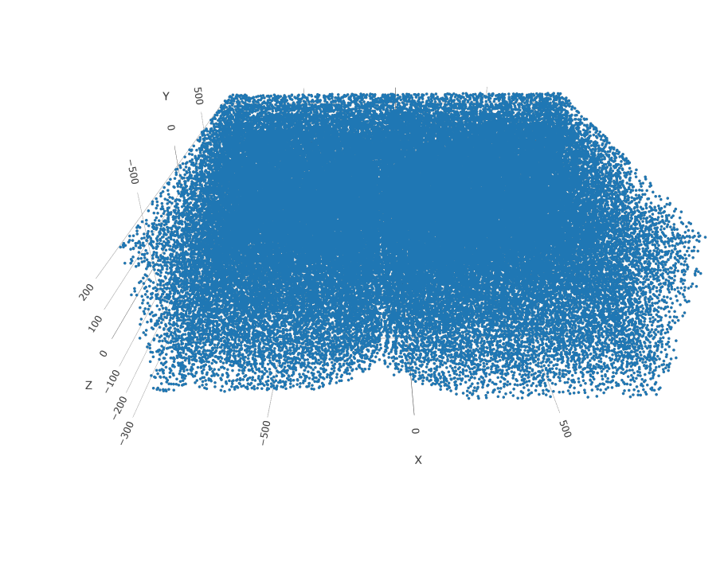{width=16cm} 

</details>

### 2. dimension reduction

<details>
  <summary>Expand</summary>
  \ 
 
```{r eval=FALSE, message=FALSE, warning=FALSE, fig.width=7, fig.height=5, out.width="50%", fig.align='center'}
merFISH_test <- calculateHVG(gobject = merFISH_test, method = 'cov_groups', zscore_threshold = 0.5, nr_expression_groups = 3)
merFISH_test <- runPCA(gobject = merFISH_test, genes_to_use = NULL, scale_unit = F)
signPCA(merFISH_test)
merFISH_test <- runUMAP(merFISH_test, dimensions_to_use = 1:8, n_components = 3, n_threads = 4)

plotUMAP_3D(gobject = merFISH_test, point_size = 1.5,
            save_param = list(save_folder = '3_DimRed', save_name = 'UMAP_reduction'))
```

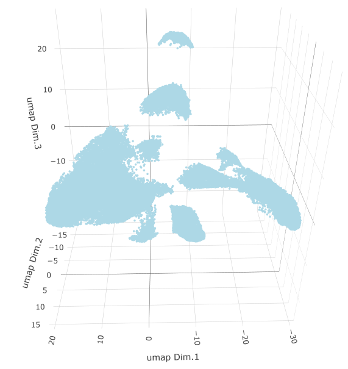{width=16cm} 


***

</details>

### 3. cluster

<details>
  <summary>Expand</summary>
  \ 
  
```{r eval=FALSE}
## sNN network (default)
merFISH_test <- createNearestNetwork(gobject = merFISH_test, dimensions_to_use = 1:8, k = 15)
## Leiden clustering
merFISH_test <- doLeidenCluster(gobject = merFISH_test, resolution = 0.2, n_iterations = 100,
                             name = 'leiden_0.2')
plotUMAP_3D(gobject = merFISH_test, cell_color = 'leiden_0.2', point_size = 1.5,
            save_param = list(save_folder = '4_Cluster', save_name = 'UMAP_leiden'))

```


{width=16cm} 

***

</details>


### 4. co-visualize ####
<details>
  <summary>Expand</summary>
  \ 
  
```{r eval=FALSE}
spatDimPlot3D(gobject = merFISH_test,
              cell_color = 'leiden_0.2', dim3_to_use = 3,
              axis_scale = 'real', spatial_point_size = 2.0,
              save_param = list(save_folder = '5_Covisuals', save_name = 'covis_leiden'))

spatPlot2D(gobject = merFISH_test, point_size = 1.5, 
           cell_color = 'leiden_0.2', 
           group_by = 'layer_ID', cow_n_col = 2, group_by_subset = c(seq(1, 12, 2)),
           save_param = list(save_folder = '5_Covisuals', save_name = 'leiden_2D'))

```

Co-visualzation:
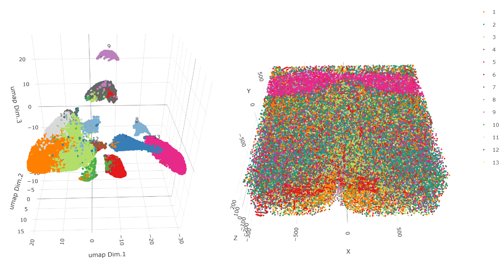{width=16cm} 

***

</details>


### 5. differential expression ####

<details>
  <summary>Expand</summary>
  \
  
```{r eval=FALSE}
markers = findMarkers_one_vs_all(gobject = merFISH_test,
                                 method = 'gini',
                                 expression_values = 'normalized',
                                 cluster_column = 'leiden_0.2',
                                 min_genes = 1, rank_score = 2)
markers[, head(.SD, 2), by = 'cluster']


# violinplot
violinPlot(merFISH_test, genes = unique(markers$genes), cluster_column = 'leiden_0.2',
           save_param = c(save_name = 'violinplot', save_folder = '6_DEG'))


# cluster heatmap
plotMetaDataHeatmap(merFISH_test, expression_values = 'scaled',
                    metadata_cols = c('leiden_0.2'),
                    selected_genes = rownames(merFISH_test@norm_scaled_expr)[seq(1,dim(merFISH_test@norm_scaled_expr)[1],3)],
                    save_param = c(save_name = 'clusterheatmap', save_folder = '6_DEG'))

```

Gini:  

- violinplot:  
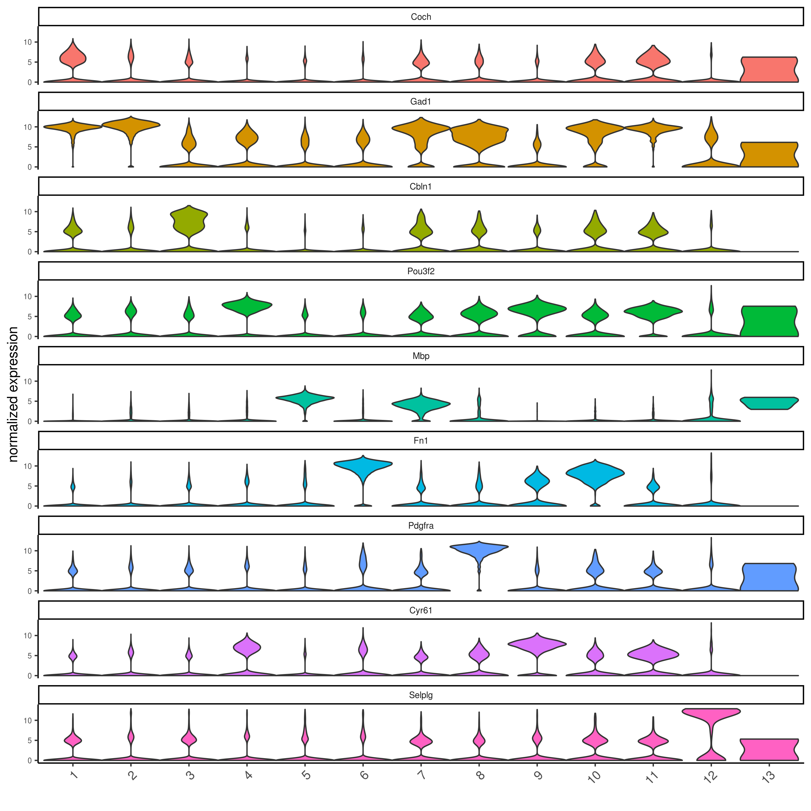{width=8cm} 

- Heatmap clusters:  
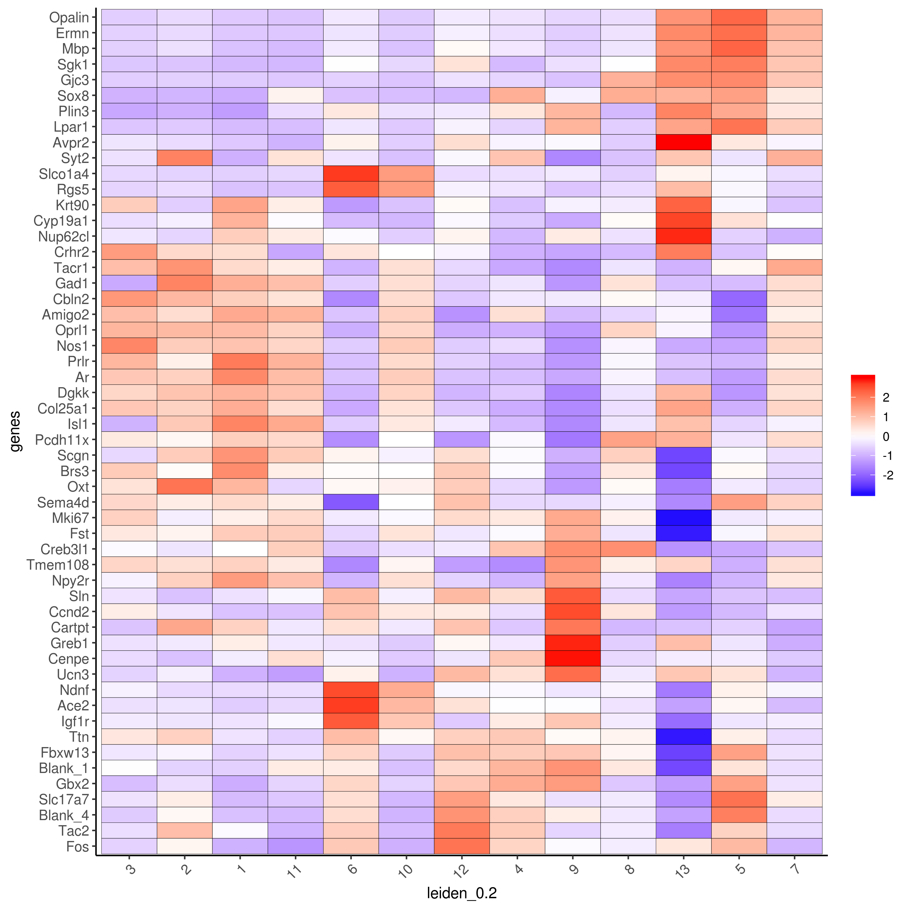{width=16cm} 


***

</details>


### 6. cell-type annotation

<details>
  <summary>Expand</summary>
  \
  
```{r eval=FALSE}

## detailed cell types
clusterList = merFISH_test@cell_metadata$leiden_0.2
cluster_cell_types = matrix(nrow=length(unique(clusterList)), ncol=dim(type_level)[1], 0)
for(i in 1:length(clusterList)){
  cluster_cell_types[clusterList[i], which(as.character(cell_type[i,1])==type_level)] =
    cluster_cell_types[clusterList[i], which(as.character(cell_type[i,1])==type_level)] + 1
}

clusters_cell_types_hypo = NULL
for(i in 1:length(unique(clusterList))){
  clusters_cell_types_hypo = c(clusters_cell_types_hypo, as.character(type_level[[which.max(cluster_cell_types[i,]),1]]))
}

merFISH_test = annotateGiotto(gobject = merFISH_test, annotation_vector = clusters_cell_types_hypo,
                           cluster_column = 'leiden_0.2', name = 'cell_types')

# create consistent color code
mynames = as.character(type_level$x)
mycolorcode = c('gray', 'darkred','yellow','yellow','yellow','mediumblue','lightblue','red',
                'magenta','purple','purple','yellowgreen','yellowgreen','yellowgreen','yellowgreen','orange')
names(mycolorcode) = mynames

plotUMAP_3D(merFISH_test, cell_color = 'cell_types', point_size = 1.5, cell_color_code = mycolorcode,
            save_param = c(save_name = 'umap_cell_types', save_folder = '7_annotation'))

plotMetaDataHeatmap(merFISH_test, expression_values = 'scaled',
                    metadata_cols = c('cell_types'),
                    selected_genes = rownames(merFISH_test@norm_scaled_expr)[seq(1,dim(merFISH_test@norm_scaled_expr)[1],3)],
                    save_param = c(save_name = 'heatmap_cell_types', save_folder = '7_annotation'))


spatPlot3D(merFISH_test,
           cell_color = 'cell_types', axis_scale = 'real',
           sdimx = 'sdimx', sdimy = 'sdimy', sdimz = 'sdimz',
           show_grid = F, cell_color_code = mycolorcode,
           save_param = c(save_name = 'spatPlot_cell_types_all', save_folder = '7_annotation'))

spatPlot2D(gobject = merFISH_test, point_size = 1.0,
           cell_color = 'cell_types', cell_color_code = mycolorcode,
           group_by = 'layer_ID', cow_n_col = 2, group_by_subset = c(seq(1, 12, 2)),
           save_param = c(save_name = 'spatPlot2D_cell_types_all', save_folder = '7_annotation'))


## subsets
spatPlot3D(merFISH_test,
           cell_color = 'cell_types', axis_scale = 'real',
           sdimx = 'sdimx', sdimy = 'sdimy', sdimz = 'sdimz',
           show_grid = F, cell_color_code = mycolorcode,
           select_cell_groups = c(as.character(type_level[1][7,1])), show_other_cells = F,
           save_param = c(save_name = 'spatPlot_cell_types_excit', save_folder = '7_annotation'))

spatPlot2D(gobject = merFISH_test, point_size = 1.0, 
           cell_color = 'cell_types', cell_color_code = mycolorcode,
           select_cell_groups = c(as.character(type_level[1][7,1])), show_other_cells = F,
           group_by = 'layer_ID', cow_n_col = 2, group_by_subset = c(seq(1, 12, 2)),
           save_param = c(save_name = 'spatPlot2D_cell_types_excit', save_folder = '7_annotation'))


spatPlot3D(merFISH_test,
           cell_color = 'cell_types', axis_scale = 'real',
           sdimx = 'sdimx', sdimy = 'sdimy', sdimz = 'sdimz',
           show_grid = F, cell_color_code = mycolorcode,
           select_cell_groups = c(as.character(type_level[1][8,1])), show_other_cells = F,
           save_param = c(save_name = 'spatPlot_cell_types_inhib', save_folder = '7_annotation'))

spatPlot2D(gobject = merFISH_test, point_size = 1.0, 
           cell_color = 'cell_types', cell_color_code = mycolorcode,
           select_cell_groups = c(as.character(type_level[1][8,1])), show_other_cells = F,
           group_by = 'layer_ID', cow_n_col = 2, group_by_subset = c(seq(1, 12, 2)),
           save_param = c(save_name = 'spatPlot2D_cell_types_inhib', save_folder = '7_annotation'))


spatPlot3D(merFISH_test,
           cell_color = 'cell_types', axis_scale = 'real',
           sdimx = 'sdimx', sdimy = 'sdimy', sdimz = 'sdimz',
           show_grid = F, cell_color_code = mycolorcode,
           select_cell_groups = c(as.character(type_level[1][c(10:15, 2),1])), show_other_cells = F,
           save_param = c(save_name = 'spatPlot_cell_types_ODandAstro', save_folder = '7_annotation'))

spatPlot2D(gobject = merFISH_test, point_size = 1.0, 
           cell_color = 'cell_types', cell_color_code = mycolorcode,
           select_cell_groups = c(as.character(type_level[1][c(10:15, 2),1])), show_other_cells = F,
           group_by = 'layer_ID', cow_n_col = 2, group_by_subset = c(seq(1, 12, 2)),
           save_param = c(save_name = 'spatPlot2D_cell_types_ODandAstro', save_folder = '7_annotation'))


spatPlot3D(merFISH_test,
           cell_color = 'cell_types', axis_scale = 'real',
           sdimx = 'sdimx', sdimy = 'sdimy', sdimz = 'sdimz',
           show_grid = F, cell_color_code = mycolorcode,
           select_cell_groups = c(as.character(type_level[1][c(9, 6, 3, 4, 5, 6, 16),1])), show_other_cells = F,
           save_param = c(save_name = 'spatPlot_cell_types_other', save_folder = '7_annotation'))

spatPlot2D(gobject = merFISH_test, point_size = 1.0, 
           cell_color = 'cell_types', cell_color_code = mycolorcode,
           select_cell_groups = c(as.character(type_level[1][c(9, 6, 3, 4, 5, 6, 16),1])), show_other_cells = F,
           group_by = 'layer_ID', cow_n_col = 2, group_by_subset = c(seq(1, 12, 2)),
           save_param = c(save_name = 'spatPlot2D_cell_types_other', save_folder = '7_annotation'))

```

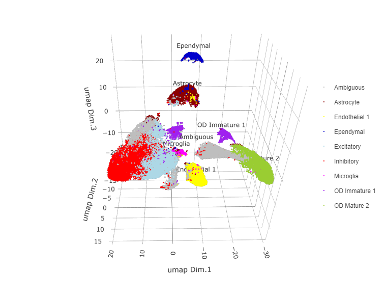{width=16cm} 

cluster heatmap for cell types
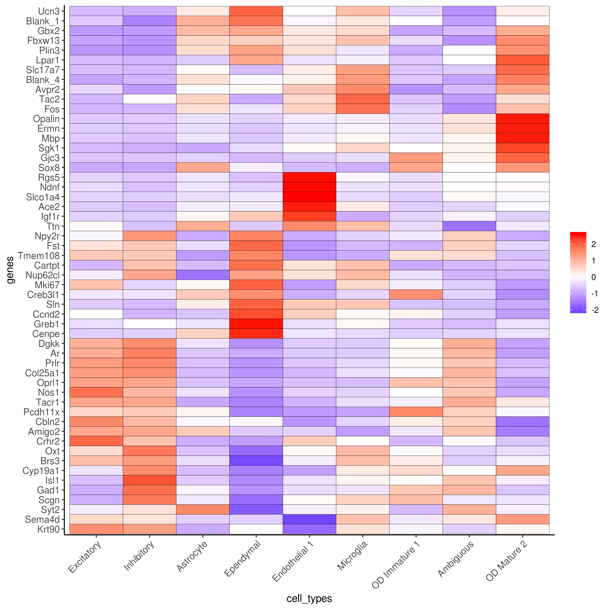{width=16cm} 

all cells:  
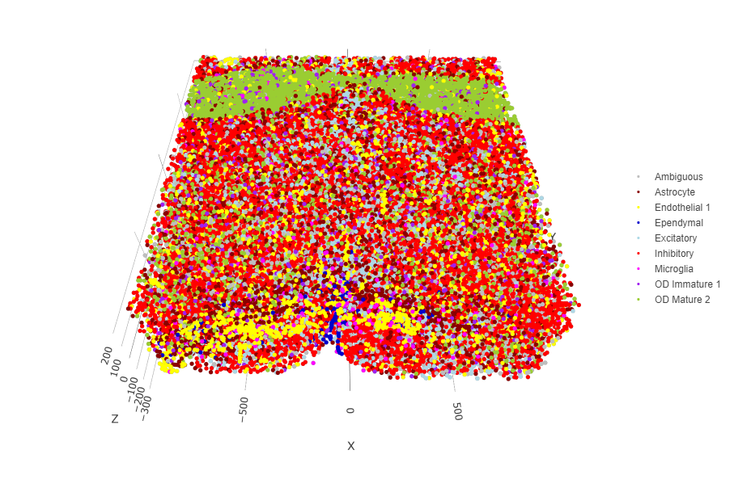{width=16cm} 
{width=16cm} 

excitatory neurons cells:  
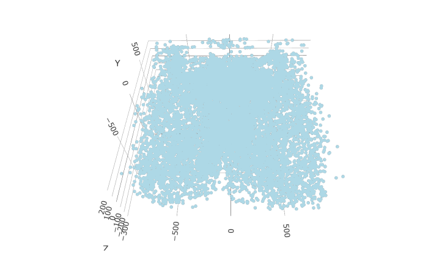{width=16cm} 
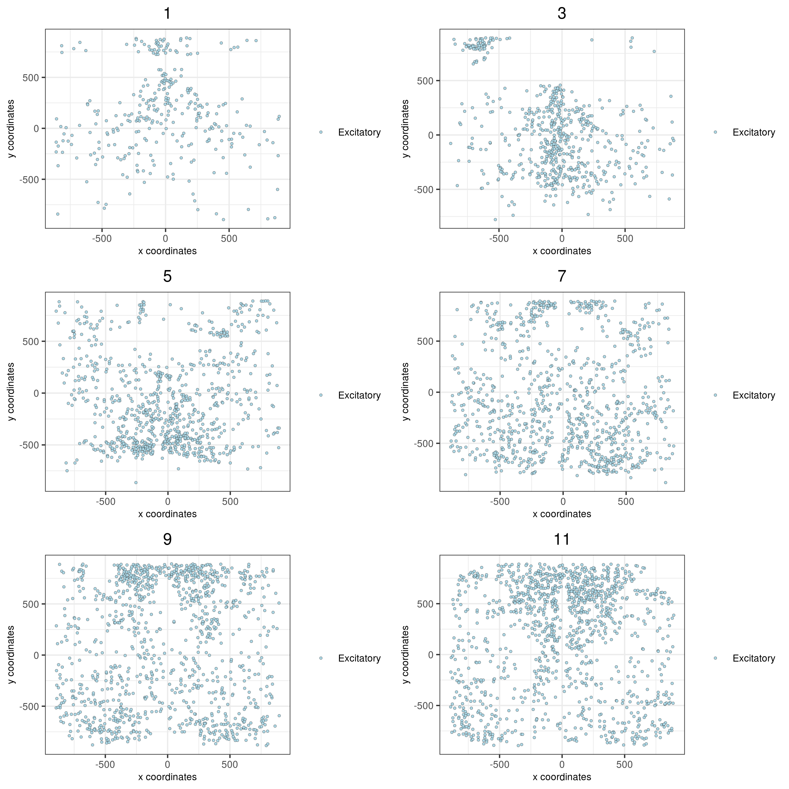{width=16cm} 

inhibitory neurons cells:  
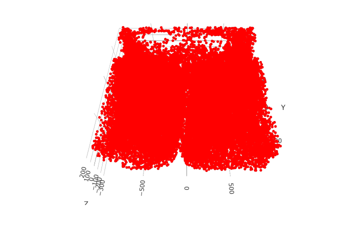{width=16cm} 
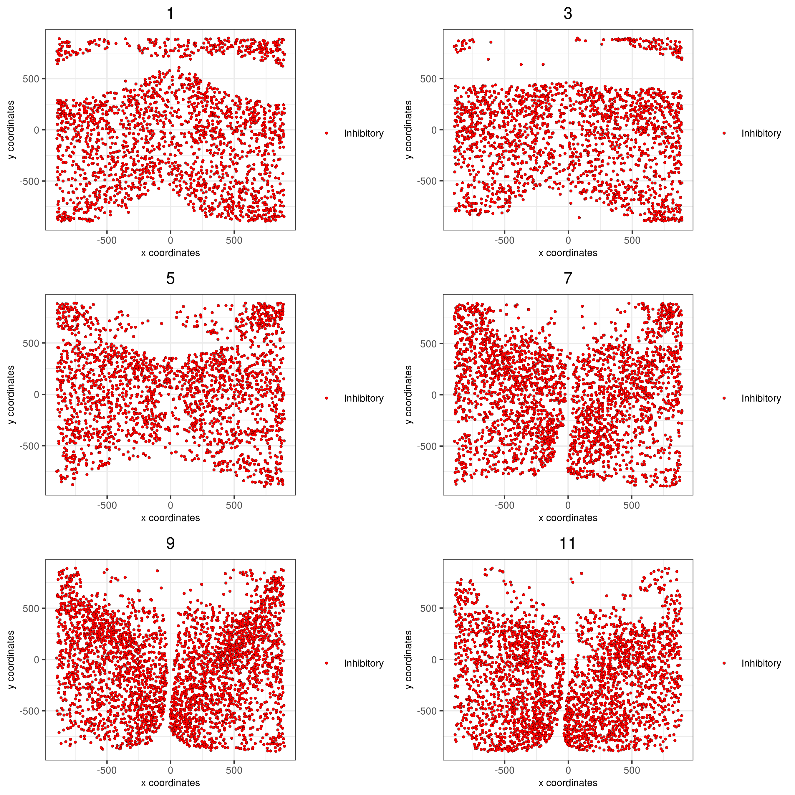{width=16cm} 

OD and Astrocytes neurons cells:  
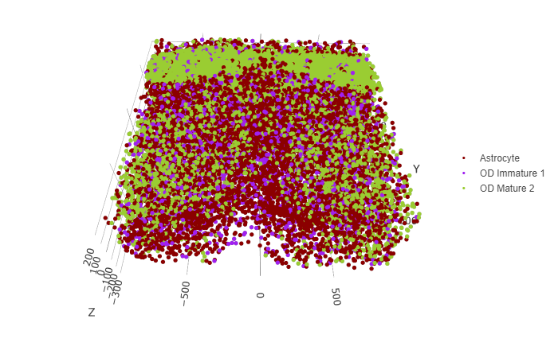{width=16cm} 
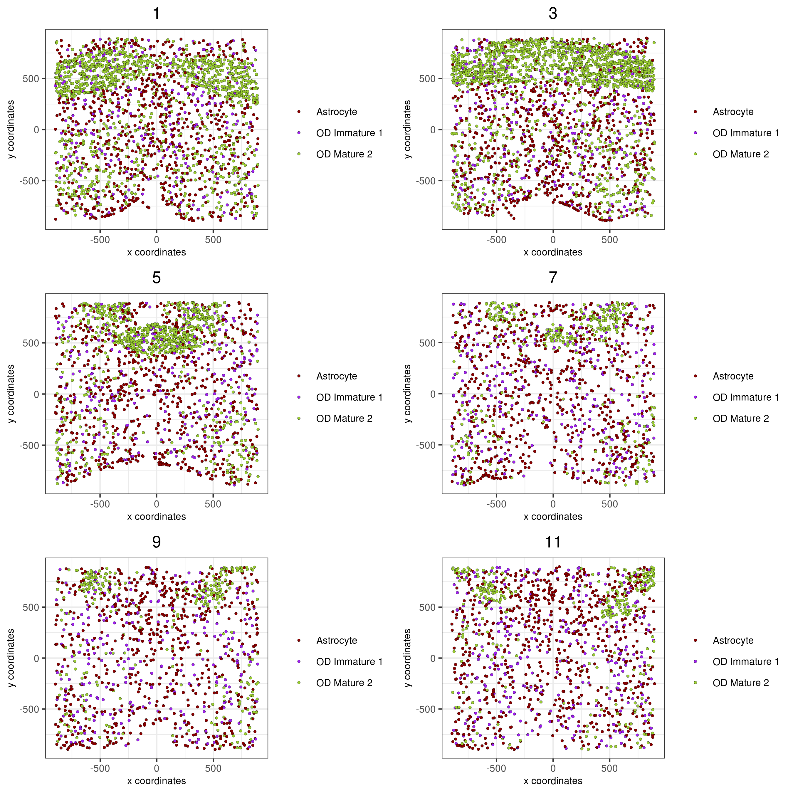{width=16cm} 

other type of cells:  
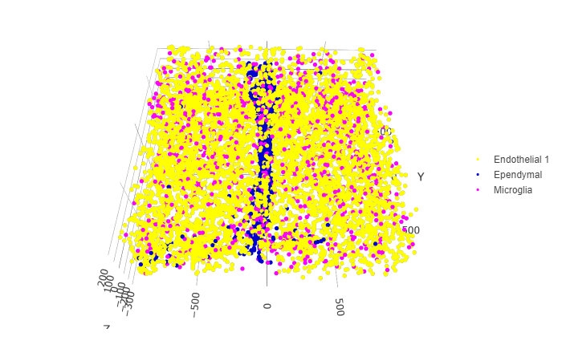{width=16cm} 
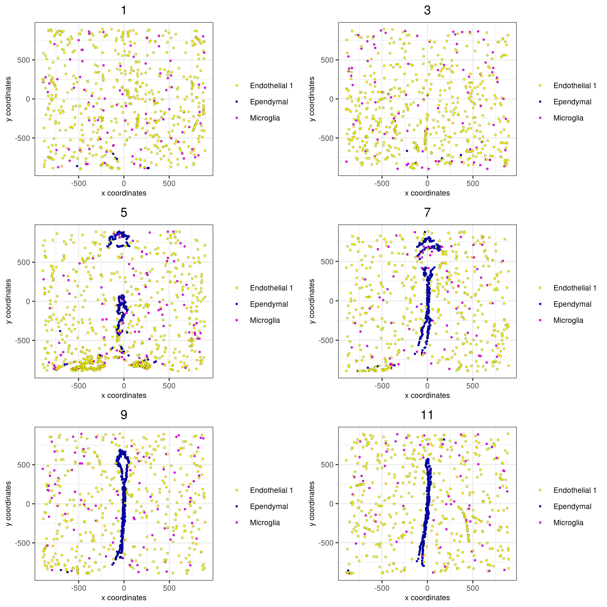{width=16cm} 
  
***

</details>


### 7. spatial grid ####

<details>
  <summary>Expand</summary>
  \
  
```{r eval=FALSE}
## create spatial grid
merFISH_test <- createSpatialGrid(gobject = merFISH_test,
                               sdimx_stepsize = 100,
                               sdimy_stepsize = 100,
                               sdimz_stepsize = 20,
                               minimum_padding = 0)

mycolorcode = c('red', 'blue')
names(mycolorcode) = type_level[1][c(6, 7),1]

spatPlot3D(merFISH_test, cell_color = 'cell_types', 
        show_grid = T, grid_color = 'green', spatial_grid_name = 'spatial_grid',
        point_size = 1.5, axis_scale = "real",
        select_cell_groups = type_level[1][c(6, 7),1], cell_color_code = mycolorcode,
        save_param = c(save_name = 'grid', save_folder = '8_grid'))

#### spatial patterns ##
pattern_VC = detectSpatialPatterns(gobject = merFISH_test, 
                                   expression_values = 'normalized',
                                   spatial_grid_name = 'spatial_grid',
                                   min_cells_per_grid = 1, 
                                   scale_unit = T, 
                                   PC_zscore = 1, 
                                   show_plot = T)

# dimension 1
showPattern3D(gobject = merFISH_test,spatPatObj = pattern_VC,
              dimension = 1, point_size = 3, axis_scale = "real",
              save_param = c(save_name = 'dimension1', save_folder = '8_grid'))
showPatternGenes(gobject = merFISH_test, spatPatObj = pattern_VC, dimension = 1,
                 save_param = c(save_name = 'dimension1_genes', save_folder = '8_grid',
                                base_height = 3, base_width = 3, dpi = 100))

# dimension 2
showPattern3D(gobject = merFISH_test,spatPatObj = pattern_VC,
              dimension = 2, point_size = 3, axis_scale = "real",
              save_param = c(save_name = 'dimension2', save_folder = '8_grid'))
showPatternGenes(gobject = merFISH_test, spatPatObj = pattern_VC, dimension = 2,
                 save_param = c(save_name = 'dimension2_genes', save_folder = '8_grid',
                                base_height = 3, base_width = 3, dpi = 100))

```


Dimension 1:  

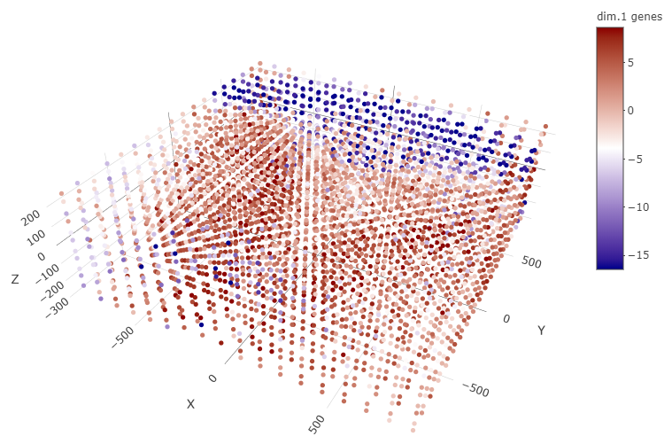{width=16cm} 
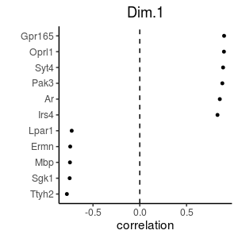{width=16cm} 


Dimension 2:  changes over z-axis  


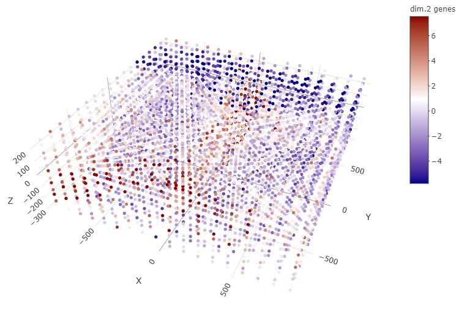{width=16cm} 

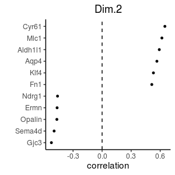{width=16cm} 

***  

</details>


### 8. spatial network ####

<details>
  <summary>Expand</summary>
  \
  
```{r eval=FALSE}

# creat a network without connection in Z
merFISH_test@spatial_locs$sdimz = merFISH_test@spatial_locs$sdimz*100

merFISH_test <- createSpatialNetwork(gobject = merFISH_test, k = 5)

zab=merFISH_test@spatial_network$spatial_network$sdimz_begin==merFISH_test@spatial_network$spatial_network$sdimz_end
sum(zab)/length(zab)
merFISH_test@spatial_network$spatial_network = merFISH_test@spatial_network$spatial_network[zab,]

merFISH_test@spatial_locs$sdimz = merFISH_test@spatial_locs$sdimz/100
merFISH_test@spatial_network$spatial_network$sdimz_begin = merFISH_test@spatial_network$spatial_network$sdimz_begin/100
merFISH_test@spatial_network$spatial_network$sdimz_end = merFISH_test@spatial_network$spatial_network$sdimz_end/100


spatPlot3D(gobject = merFISH_test,
           show_network = T,
           network_color = 'blue', spatial_network_name = 'spatial_network',
           axis_scale = "real", z_ticks = 2,
           point_size = 2.5, cell_color = 'cell_types', cell_color_code = mycolorcode,
           save_param = c(save_name = 'network', save_folder = '9_spatial_network'))

spatPlot2D(gobject = merFISH_test,
           show_network = T, 
           network_color = 'blue', spatial_network_name = 'spatial_network',
           point_size = 0.75, cell_color = 'cell_types', cell_color_code = mycolorcode,
           group_by = 'layer_ID', cow_n_col = 2, group_by_subset = c(seq(1, 12, 2)),
           save_param = c(save_name = 'network_2D', save_folder = '9_spatial_network'))

```

spatial network:  
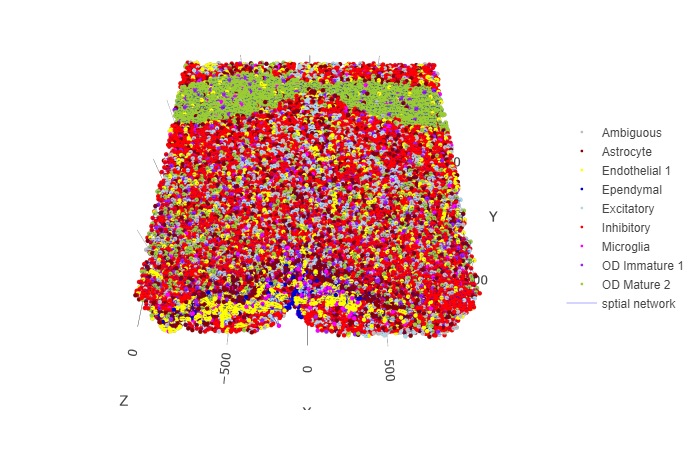{width=16cm} 
{width=16cm} 

spatial network zoomed in:    
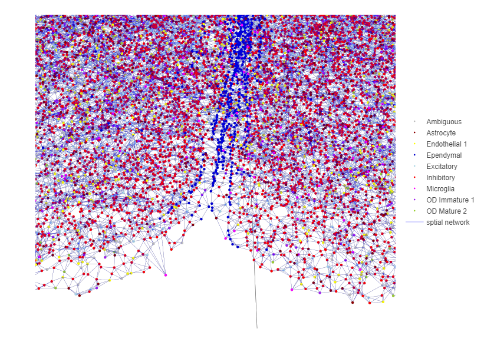{width=16cm} 

***  

</details>


### 9. spatial genes ####

<details>
  <summary>Expand</summary>
  \
  
```{r eval=FALSE}
# kmeans binarization
kmtest = binGetSpatialGenes(merFISH_test, bin_method = 'kmeans',
                            do_fisher_test = T, community_expectation = 5,
                            spatial_network_name = 'spatial_network', verbose = T)
spatGenePlot2D(merFISH_test, expression_values = 'scaled', show_plot = F,
               genes = head(kmtest$genes, 4), point_size = 2, cow_n_col = 2, 
               genes_high_color = 'red', genes_mid_color = 'white', genes_low_color = 'darkblue',
               midpoint = 0, return_plot = F,
               save_param = c(save_name = 'spatial_genes_scaled_km', save_folder = '10_spatial_genes', base_width = 16))

# rank binarization
ranktest = binGetSpatialGenes(merFISH_test, bin_method = 'rank',
                              do_fisher_test = T, community_expectation = 5,
                              spatial_network_name = 'spatial_network', verbose = T)
spatGenePlot2D(merFISH_test, expression_values = 'scaled', show_plot = F,
               genes = head(ranktest$genes, 4), point_size = 2, cow_n_col = 2, 
               genes_high_color = 'red', genes_mid_color = 'white', genes_low_color = 'darkblue',
               midpoint = 0, return_plot = F,
               save_param = c(save_name = 'spatial_genes_scaled_rank', save_folder = '10_spatial_genes', base_width = 16))

# creat a subset in case of out of memory
cell_ids = merFISH_test@spatial_locs$cell_ID
subcell_ids = cell_ids[seq(1, length(cell_ids), 3)]
submerFISH_test = subsetGiotto(merFISH_test, cell_ids = subcell_ids)

# distance
spatial_genes = calculate_spatial_genes_python(gobject = submerFISH_test,
                                               expression_values = 'scaled',
                                               rbp_p=0.95, examine_top=0.3)
spatGenePlot2D(merFISH_test, expression_values = 'scaled', show_plot = F,
               genes = head(spatial_genes$genes, 4), point_size = 2, cow_n_col = 2,
               genes_high_color = 'red', genes_mid_color = 'white', genes_low_color = 'darkblue',
               midpoint = 0, return_plot = F,
               save_param = c(save_name = 'spatial_genes_scaled_distance', save_folder = '10_spatial_genes', base_width = 16))

```

Spatial genes:  

- kmeans 
{width=16cm} 

- rank
{width=16cm} 

- distance
{width=16cm} 

***

</details>


### 10. HMRF domains ####

<details>
  <summary>Expand</summary>
  \

```{r, eval=FALSE}

hmrf_folder = paste0(results_folder,'/','11_HMRF/')
if(!file.exists(hmrf_folder)) dir.create(hmrf_folder, recursive = T)

my_spatial_genes = spatial_genes[1:30]$genes

# do HMRF with different betas
HMRF_spatial_genes = doHMRF(gobject = merFISH_test, expression_values = 'scaled',
                            spatial_genes = my_spatial_genes,
                            k = 10,
                            betas = c(0, 0.5, 5), 
                            output_folder = paste0(hmrf_folder, '/', 'Spatial_genes/SG_top100_k10_scaled'),
                            zscore = "rowcol", tolerance=1e-5)

## view results of HMRF
for(i in seq(0, 2, by = 0.5)) {
  viewHMRFresults3D(gobject = merFISH_test,
                    HMRFoutput = HMRF_spatial_genes,
                    k = 10, betas_to_view = i,
                    point_size = 2)
}

## add HMRF of interest to giotto object
merFISH_test = addHMRF(gobject = merFISH_test,
                  HMRFoutput = HMRF_spatial_genes,
                  k = 10, betas_to_add = seq(0, 2, by = 0.5),
                  hmrf_name = 'HMRF')

## visualize
for(beta in seq(0, 1, by = 0.5)){
  vis_name = paste0('HMRF_k10_b.', beta)
  color_code = c('1'='lightblue','2'='red','3'='lightgrey','4'='mediumblue','5'='yellow',
                 '6'='yellowgreen','7'='brown','8'='pink','9'='orange','10'='purple')
  spatPlot2D(gobject = merFISH_test, cell_color = vis_name, point_size = 1.0, cell_color_code = color_code,
             group_by = 'layer_ID', cow_n_col = 2, group_by_subset = c(seq(1, 12, 2)),
             save_param = c(save_name = paste0(vis_name, '_2D'), save_folder = '11_HMRF'))
  spatPlot3D(gobject = merFISH_test, cell_color = vis_name, point_size = 2.5, cell_color_code = color_code, axis_scale = "real", 
             save_param = c(save_name = paste0(vis_name, '_3D'), save_folder = '11_HMRF'))
}


```
***

- b = 0.5  

2D version: 

{width=16cm} 

3D version:  

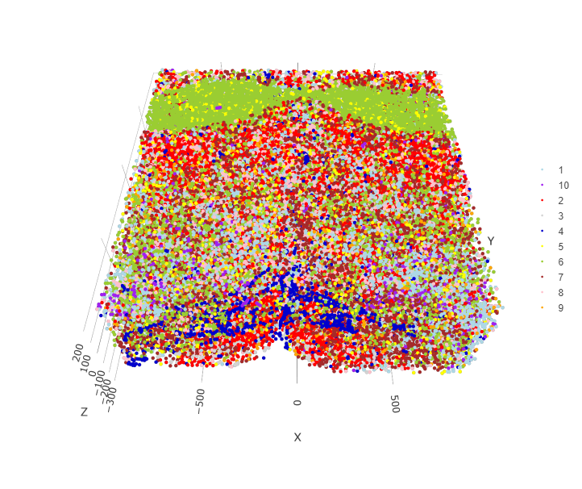{width=16cm} 

</details>


### 11. Cell-cell preferential proximity 

<details>
  <summary>Expand</summary>
  \

{width=12cm}  

```{r eval=FALSE}
## calculate frequently seen proximities
cell_proximities = cellProximityEnrichment(gobject = merFISH_test,
                                           cluster_column = 'cell_types',
                                           spatial_network_name = 'spatial_network',
                                           number_of_simulations = 400)
## barplot
cellProximityBarplot(gobject = merFISH_test, CPscore = cell_proximities, min_orig_ints = 25, min_sim_ints = 25, 
                     save_param = c(save_name = 'barplot_cell_cell_enrichment', save_folder = '12_cell_proxim'))
## heatmap
cellProximityHeatmap(gobject = merFISH_test, CPscore = cell_proximities, order_cell_types = T, scale = T,
                     color_breaks = c(-1.5, 0, 1.5), color_names = c('blue', 'white', 'red'),
                     save_param = c(save_name = 'heatmap_cell_cell_enrichment', save_folder = '12_cell_proxim', unit = 'in'))
## network
cellProximityNetwork(gobject = merFISH_test, CPscore = cell_proximities, remove_self_edges = T, only_show_enrichment_edges = T,
                     save_param = c(save_name = 'network_cell_cell_enrichment', save_folder = '12_cell_proxim'))


## visualization
spec_interaction = paste0('Endothelial 1', '--', 'Microglia')

# rescaled spatial dimensions
cellProximitySpatPlot3D(gobject = merFISH_test,
                        interaction_name = spec_interaction,
                        cluster_column = 'cell_types',
                        cell_color = 'cell_types', coord_fix_ratio = 0.5,
                        cell_color_code = c('Endothelial 1'='green', 'Microglia'='red'),
                        point_size_select = 4, point_size_other = 2,
                        save_param = c(save_name = 'cell_cell_enrichment_selected', save_folder = '12_cell_proxim'))

# real spatial dimensions
cellProximitySpatPlot3D(gobject = merFISH_test,
                        interaction_name = spec_interaction,
                        cluster_column = 'cell_types',
                        cell_color = 'cell_types', coord_fix_ratio = 0.5,
                        cell_color_code = c('Endothelial 1'='green', 'Microglia'='red'),
                        point_size_select = 4, point_size_other = 2, axis_scale = 'real',
                        save_param = c(save_name = 'cell_cell_enrichment_selected_real', save_folder = '12_cell_proxim'))

```
barplot:  
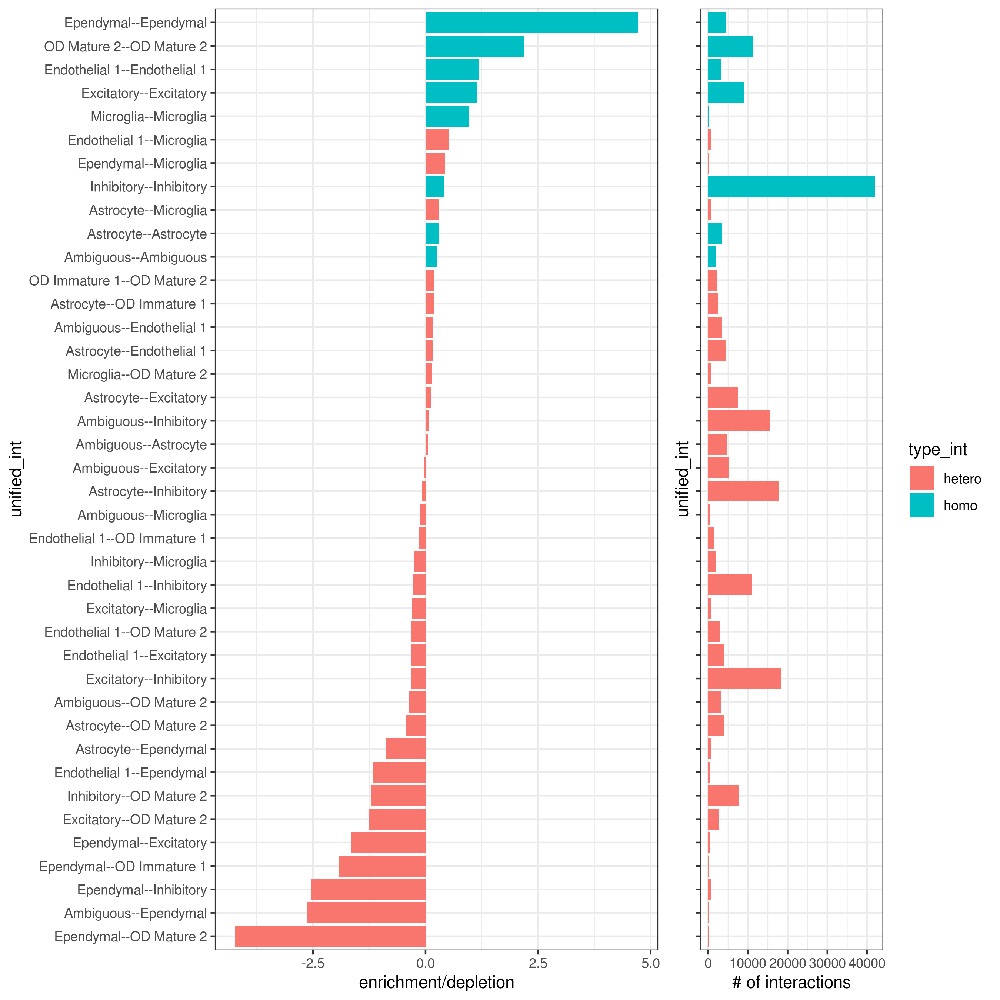{width=16cm} 

heatmap:  
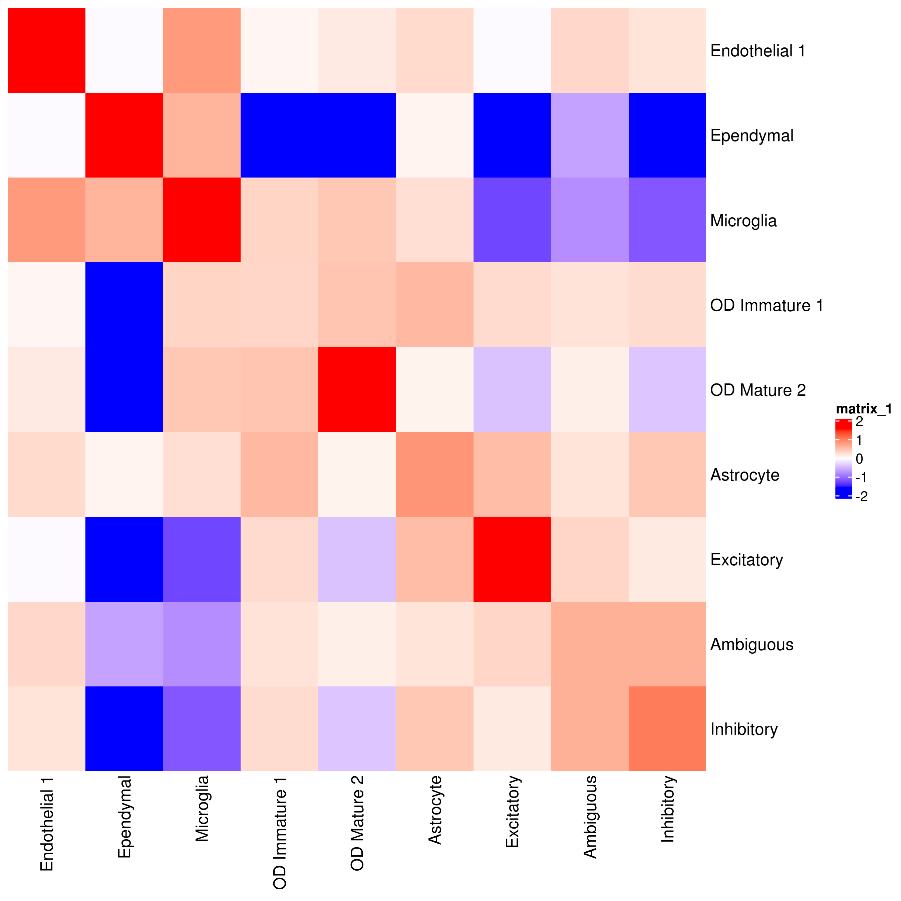{width=16cm} 

network:  
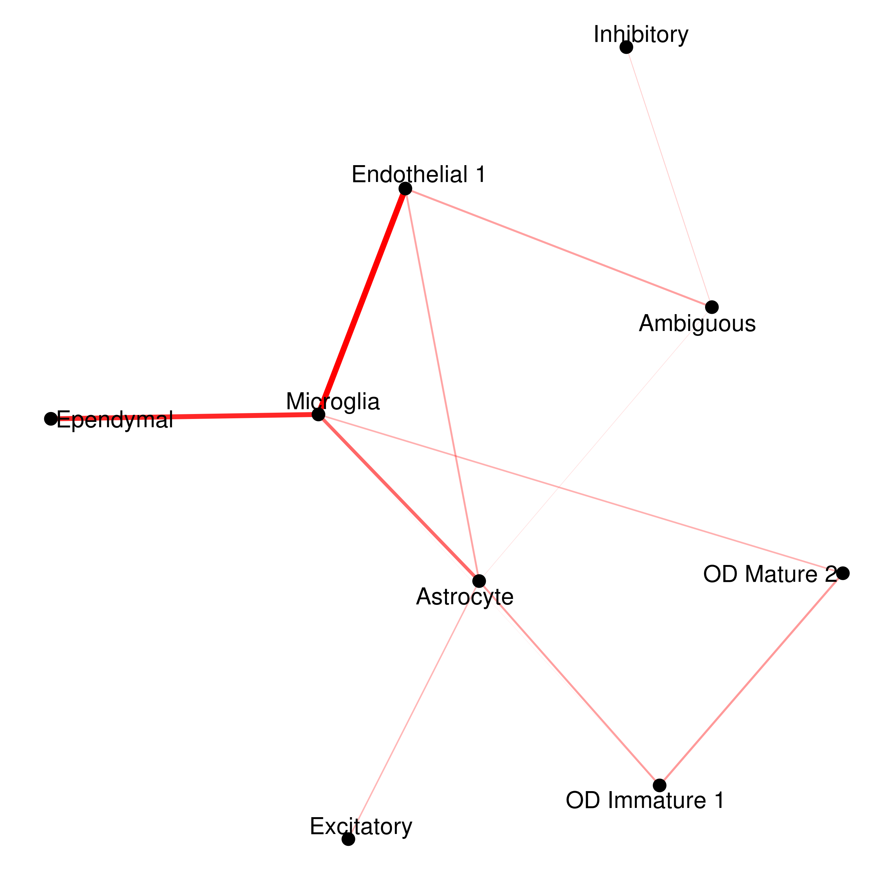{width=16cm} 

selected enrichment:  

- real dimensions  

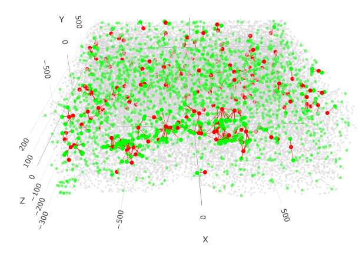{width=16cm} 

- rescaled dimensions  

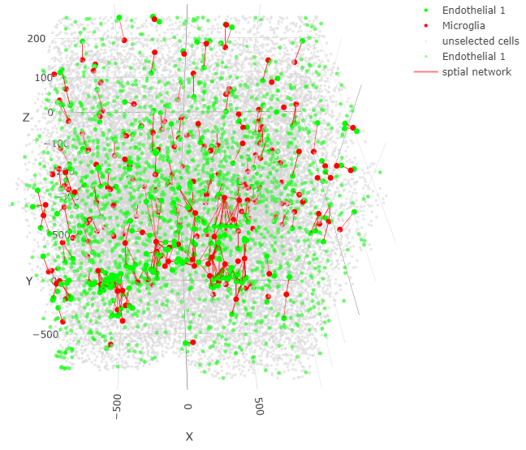{width=16cm} 

***

</details>


