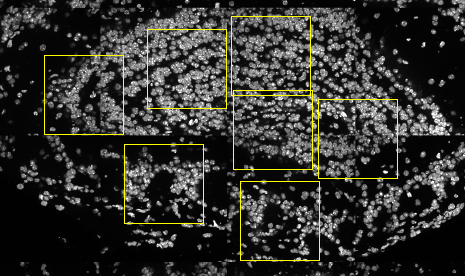

<!-- mouse_cortex_example.md is generated from mouse_cortex_example.Rmd Please edit that file -->

```{r, include = FALSE}
knitr::opts_chunk$set(
  collapse = TRUE,
  comment = "#>",
  fig.path = "man/figures/README-",
  out.width = "100%"
)
```

```{r eval=TRUE, message=FALSE, warning=FALSE}
library(Giotto)
```


### Data input

- load cortex/svz gene expression matrix  
- prepare cell coordinates by stitching imaging fields  

Several fields - containing 100's of cells - in the mouse olfactory bulb were imaged. The coordinates of the cells within each field are independent of eachother, so in order to visualize and process all cells together imaging fields will be stitched together by providing x and y-offset values specific to each field. These offset values are estimates based on the original raw image:  
{width=7cm} .

```{r eval=TRUE}
## prepare cell locations
# stitch fields together with offset
OB_locs = fread(system.file("extdata", "OB_centroids.csv", package = "Giotto"))
my_offset_file = data.table(field = c(0, 1, 2, 3, 4, 5, 6),
                            x_offset = c(4079, 6212, 4164, 4096, 2048, 0, 2031),
                            y_offset = c(4079, 1997, 1835, 0, 640, 1553, 3507))
stitch_file = stitchFieldCoordinates(location_file = OB_locs, offset_file = my_offset_file,
                                     cumulate_offset_x = F, cumulate_offset_y = F,
                                     field_col = 'Field of View',
                                     reverse_final_x = F,
                                     reverse_final_y = T)
stitch_file    = stitch_file[,.(X_final, Y_final)]
my_offset_file = my_offset_file[,.(field, x_offset_final, y_offset_final)]

## visual cortex expression DATA ##
OB_exprs = read.table(system.file("extdata", "OB_expression.txt", package = "Giotto"))
```


***

\ 

### 1. Create Giotto object & process data

```{r eval=TRUE, message=FALSE, warning=FALSE, fig.width=9, fig.height=6, out.width="75%", fig.align='center'}
## create
OB_test <- createGiottoObject(raw_exprs = OB_exprs,
                              spatial_locs = stitch_file,
                              offset_file = my_offset_file)
## filter
OB_test <- filterGiotto(gobject = OB_test,
                        expression_threshold = 1,
                        minimum_detected_genes = 10,
                        minimum_expression_in_cell = 10,
                        expression_values = c('raw'),
                        verbose = T)
## normalize
OB_test <- normalizeGiotto(gobject = OB_test)
# gene and cell statistics
OB_test <- addStatistics(gobject = OB_test)
# adjust for covariates
OB_test = adjustGiottoMatrix(gobject = OB_test, expression_values = c('normalized'),
                             batch_columns = NULL, covariate_columns = c('nr_genes', 'total_expr'),
                             return_gobject = TRUE,
                             update_slot = c('custom'))
# plain visualization
visPlot(gobject = OB_test)
```

***

\ 


### 2. dimension reduction

```{r eval=TRUE, message=FALSE, warning=FALSE, fig.width=7, fig.height=5, out.width="50%", fig.align='center'}
## HVG genes
OB_test <- calculateHVG(gobject = OB_test)
# selected genes
gene_metadata = fDataDT(OB_test)
featgenes = gene_metadata[(hvg == 'yes') & perc_cells > 4 & mean_expr_det > 0.5]$gene_ID
# pca
OB_test <- runPCA(gobject = OB_test, genes_to_use = featgenes)
# umap
OB_test <- runUMAP(OB_test)
# tsne
OB_test <- runtSNE(OB_test)
```

***

\ 

### 3. cluster

```{r eval=TRUE, message=FALSE, warning=FALSE, fig.width=7, fig.height=6, out.width="60%", fig.align='center'}
## cluster
# SNN
OB_test <- createNearestNetwork(gobject = OB_test)

# cluster on network
OB_test = doLeidenCluster(gobject = OB_test, resolution = 0.5,
                          python_path = "/Users/rubendries/Bin/anaconda3/envs/py36/bin/python")

plotUMAP(gobject = OB_test, cell_color = 'pleiden_clus', point_size = 1.5,
         show_NN_network = T, edge_alpha = 0.02)

```

***

\ 

### 4. co-visualize ####

```{r eval=TRUE, message=FALSE, warning=FALSE, fig.width=7, fig.height=6, out.width="60%", fig.align='center'}
# expression and spatial
visSpatDimPlot(gobject = OB_test, cell_color = 'pleiden_clus', dim_point_size = 2, spatial_point_size = 2)
# relationship between clusters
clusterheatmap <- showClusterHeatmap(gobject = OB_test, cluster_column = 'pleiden_clus')
print(clusterheatmap)
```

***

\ 

### 5. differential expression ####

```{r eval=TRUE, message=FALSE, warning=FALSE, fig.width=7, fig.height=6, out.width="60%", fig.align='center'}
# pairwise t-test #
gene_markers = findMarkers(gobject = OB_test, cluster_column = 'pleiden_clus')
# Gini markers #
gini_markers = findGiniMarkers(gobject = OB_test, cluster_column = 'pleiden_clus')
gini_markers_DT = gini_markers[, head(.SD, 3), by = 'cluster']

myheat = plotHeatmap(gobject = OB_test, genes = gini_markers_DT$genes,
                     cluster_column = 'pleiden_clus')
violinPlot(gobject = OB_test, genes = c('Cldn5', 'Apod', 'Myo16', 'Sv2a', 'Gjb6', 'Samd5'),
           cluster_column = 'pleiden_clus')
```

***

\ 

### 6. spatial network + grid ####
```{r eval=TRUE, message=FALSE, warning=FALSE, fig.width=7, fig.height=6, out.width="60%", fig.align='center'}
## spatial network
OB_test <- createSpatialNetwork(gobject = OB_test, k = 3)
OB_test <- createSpatialNetwork(gobject = OB_test, k = 100, maximum_distance = 200, minimum_k = 1, name = 'distance_network')
## spatial grid
OB_test <- createSpatialGrid(gobject = OB_test,
                             sdimx_stepsize = 500,
                             sdimy_stepsize = 500,
                             minimum_padding = 50 )
# spatial pattern genes
OB_test = detectSpatialPatterns(gobject = OB_test, dims_to_plot = 2)
## spatial genes
OB_test <- calculateSpatialGenes(gobject = OB_test, min_N = 20)
spatial_gene_DT <- calculateSpatialGenes(gobject = OB_test , method = 'kmeans', return_gobject = F)

# visualize
visGenePlot(gobject = OB_test,  genes = c('Apod', 'Heyl', 'Neurod1', 'Sash1', 'Gja1', 'Gng4'),
            scale_alpha_with_expression = T)

```

***

\ 

### 7. HMRF
```{r eval=TRUE, message=FALSE, warning=FALSE, fig.width=7, fig.height=6, out.width="60%", fig.align='center'}
# select 500 spatial genes
gene_data = fDataDT(OB_test)
spatial_genes = gene_data[SV == 'yes' | spg == 'yes']$gene_ID
set.seed(seed = 1234)
spatial_genes = spatial_genes[sample(x = 1:length(spatial_genes), size = 500)]

# run HMRF
HMRFtest = doHMRF(gobject = OB_test, expression_values = 'scaled',
                  spatial_genes = spatial_genes,
                  k = 10,
                  betas = c(44, 4, 2),
                  output_folder = '/Volumes/Ruben_Seagate/Dropbox/Projects/GC_lab/Ruben_Dries/190225_spatial_package/Data/package_OB_HMRF/',
                  python_path = "/Users/rubendries/Bin/anaconda3/envs/py36/bin/pythonw")

# view HMRF results for multiple tested betas
viewHMRFresults(gobject = OB_test,
                HMRFoutput = HMRFtest,
                k = 10, betas_to_view = c(44, 48), point_size = 2)

# add the HMRF results of interest
OB_test = addHMRF(gobject = OB_test,
                  HMRFoutput = HMRFtest,
                  k = 10, betas_to_add = c(48))

# co-visualize
visSpatDimPlot(gobject = OB_test, cell_color = 'hmrf_k.10_b.48', dim_point_size = 2, spatial_point_size = 2)

```

***

\ 


### 8. spatial analysis
```{r eval=TRUE, message=FALSE, warning=FALSE, fig.width=7, fig.height=6, out.width="60%", fig.align='center'}
## cell-cell interaction ##
## calculate and visualize cell-cell proximities
cell_proximities = cellProximityEnrichment(gobject = OB_test, cluster_column = 'pleiden_clus')
cellProximityBarplot(CPscore = cell_proximities)
cellProximityHeatmap(CPscore = cell_proximities, order_cell_types = T)

cellProximityVisPlot(gobject = OB_test, interaction_name = '1-5',
                     cluster_column = 'pleiden_clus',
                     cell_color = 'pleiden_clus', show_network = T, network_color = 'blue')


## 1 gene enrichment for cell-cell interaction ##
test_int_gene_scores = getAverageCellProximityGeneScores(gobject = OB_test, cluster_column = 'pleiden_clus')
test_gene_example = showGeneExpressionProximityScore(scores = test_int_gene_scores, selected_gene = 'Dlx1')
test_interaction_example = showIntExpressionProximityScore(scores = test_int_gene_scores, selected_interaction = '5-6')


## 2 selected ligand - receptor ##
LR_data = fread(system.file("extdata", "mouse_ligand_receptors.txt", package = 'Giotto'))
ligands = LR_data$mouseLigand
receptors = LR_data$mouseReceptor

my_subset_interactions = c('5-6','3-6','1-2')
LR_OB = getGeneToGeneScores(CPGscore = test_int_gene_scores,
                            selected_genes = NULL,
                            selected_cell_interactions = my_subset_interactions,
                            specific_genes_1 = ligands, specific_genes_2 = receptors)

showTopGeneToGene(GTGscore = LR_OB, top_interactions = 10,
                  direction = c('increased'),
                  complement_data = T)

showTopGeneToGene(GTGscore = LR_OB, top_interactions = 10,
                  direction = c('decreased'),
                  complement_data = T, subset_cell_ints = '5-6')
```
