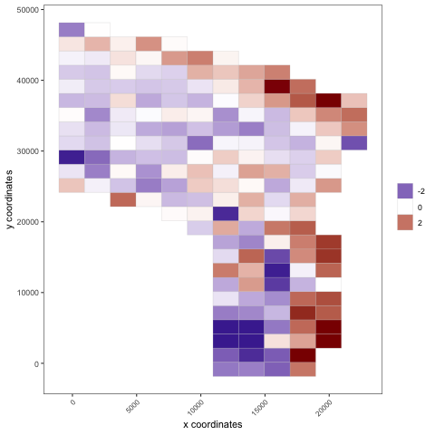
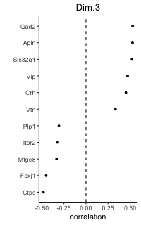
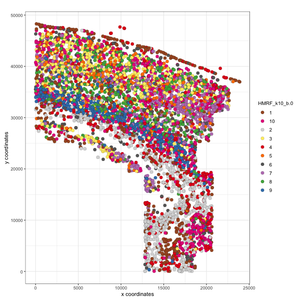
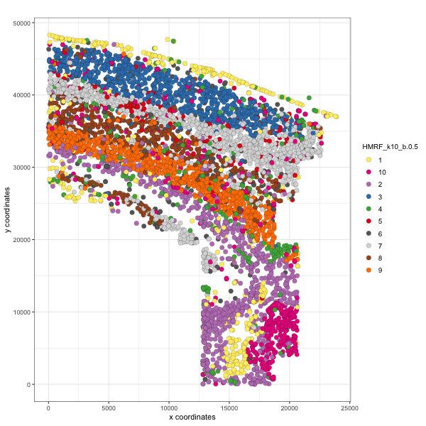

<!-- mouse_cortex_1_simple.md is generated from mouse_cortex_1_simple.Rmd Please edit that file -->


```{r, include = FALSE}
knitr::opts_chunk$set(
  collapse = TRUE,
  comment = "#>",
  fig.path = "man/figures/README-",
  out.width = "100%"
)
```


```{r eval=FALSE, message=FALSE, warning=FALSE}
# this example works with Giotto v.0.1.2
library(Giotto)

# specify your python path
my_python_path = "/Users/rubendries/Bin/anaconda3/envs/py36/bin/python"
```

### Data input

<details>
  <summary>Expand</summary>
  \ 
  
[Codeluppi et al.](https://www.nature.com/articles/s41592-018-0175-z) created a high quality and very sensitive spatial expression dataset consisting of 33 genes from 4,839 single cells acquired with osmFISH in the somatosensory mosue cortex.
  
{width=20cm} .

```{r, eval=FALSE}
## select the directory where you have saved the osmFISH data
data_dir = '/Volumes/Ruben_Seagate/Dropbox/Projects/GC_lab/Ruben_Dries/190225_spatial_package/Data/osmFISH_data/'
## ss cortex expression DATA ##
osm_exprs = read.table(file = paste0(data_dir,'/','osmFISH_prep_expression.txt'))
## prepare cell locations
osm_locs = read.table(file = paste0(data_dir,'/','osmFISH_prep_cell_coordinates.txt'))
osm_locs = osm_locs[rownames(osm_locs) %in% colnames(osm_exprs),]
```

***

</details>

\ 

### 1. Create Giotto object & process data
<details>
  <summary>Expand</summary>
  \ 
 
```{r eval=FALSE}
## create
osm_test <- createGiottoObject(raw_exprs = osm_exprs, spatial_locs = osm_locs)

## add field annotation
metadata = fread(file = paste0(data_dir,'/','osmFISH_prep_cell_metadata.txt'))
osm_test = addCellMetadata(osm_test, new_metadata = metadata,
                          by_column = T, column_cell_ID = 'CellID')

## filter
osm_test <- filterGiotto(gobject = osm_test,
                        expression_threshold = 1,
                        gene_det_in_min_cells = 10,
                        min_det_genes_per_cell = 10,
                        expression_values = c('raw'),
                        verbose = T)

## normalize
# 1. standard z-score way
osm_test <- normalizeGiotto(gobject = osm_test)

# 2. osmFISH way, add to custom expression slot
raw_expr_matrix = osm_test@raw_exprs
norm_genes = (raw_expr_matrix/rowSums(raw_expr_matrix)) * nrow(raw_expr_matrix)
norm_genes_cells = t((t(norm_genes)/colSums(norm_genes)) * ncol(raw_expr_matrix))
osm_test@custom_expr = norm_genes_cells

## add gene & cell statistics
osm_test <- addStatistics(gobject = osm_test)

## visualize original annotations ##
visPlot(gobject = osm_test, sdimx = 'sdimx', sdimy = 'sdimy', cell_color = 'ClusterName')

visPlot(gobject = osm_test, sdimx = 'sdimx', sdimy = 'sdimy', cell_color = 'Region')
```
  
osmFISH cell types from paper:
{width=16cm} 

osmFISH regions from paper:
{width=16cm} 

</details>

### 2. dimension reduction

<details>
  <summary>Expand</summary>
  \ 
 
```{r eval=FALSE, message=FALSE, warning=FALSE, fig.width=7, fig.height=5, out.width="50%", fig.align='center'}
## highly variable genes (HVG)
# only 33 genes so use all genes

## run PCA on expression values (default)
osm_test <- runPCA(gobject = osm_test, expression_values = 'custom', scale_unit = F)
signPCA(gobject = osm_test, expression_values = 'custom', scale_unit = F)
plotPCA(osm_test)

## run UMAP and tSNE on PCA space (default)
osm_test <- runUMAP(osm_test, dimensions_to_use = 1:31, expression_values = 'custom')
plotUMAP(gobject = osm_test)

osm_test <- runtSNE(osm_test, dimensions_to_use = 1:31, perplexity = 70, check_duplicates = F)
plotTSNE(gobject = osm_test)
```

{width=16cm} 

{width=16cm} 
{width=16cm} 

{width=16cm} 


***

</details>

### 3. cluster

<details>
  <summary>Expand</summary>
  \ 
  
```{r eval=FALSE, message=FALSE, warning=FALSE, fig.width=7, fig.height=6, out.width="60%", fig.align='center'}

## hierarchical clustering
osm_test = doHclust(gobject = osm_test, expression_values = 'custom', k = 34)
plotUMAP(gobject = osm_test, cell_color = 'hclust', point_size = 2.5,
         show_NN_network = F, edge_alpha = 0.05, plot_method = 'ggplot')

## kmeans clustering
osm_test = doKmeans(gobject = osm_test, expression_values = 'custom', centers = 32, nstart = 2000)
plotUMAP(gobject = osm_test, cell_color = 'kmeans',
         point_size = 2.5, show_NN_network = F, edge_alpha = 0.05, plot_method = 'ggplot')

## Leiden clustering
# sNN network (default)
osm_test <- createNearestNetwork(gobject = osm_test, dimensions_to_use = 1:31, k = 15)
osm_test <- doLeidenCluster(gobject = osm_test, resolution = 0.05, n_iterations = 1000,
                           python_path = my_python_path)
plotUMAP(gobject = osm_test, cell_color = 'leiden_clus', point_size = 2.5,
         show_NN_network = F, edge_alpha = 0.05, plot_method = 'ggplot')

# merge small groups based on similarity
leiden_similarities = getClusterSimilarity(osm_test,
                                           expression_values = 'custom',
                                           cluster_column = 'leiden_clus')
osm_test = mergeClusters(osm_test, expression_values = 'custom',
                         cluster_column = 'leiden_clus',
                         new_cluster_name = 'leiden_clus_m',
                         max_group_size = 30, force_min_group_size = 20,
                         return_gobject = T)
plotUMAP(gobject = osm_test, cell_color = 'leiden_clus_m', point_size = 2.5,
         show_NN_network = F, edge_alpha = 0.05, plot_method = 'ggplot')

## show cluster relationships
showClusterHeatmap(gobject = osm_test, expression_values = 'custom', cluster_column = 'leiden_clus_m')

showClusterDendrogram(gobject = osm_test, expression_values = 'custom', cluster_column = 'leiden_clus_m')
```


{width=16cm} 

{width=16cm} 

{width=16cm} 
{width=16cm} 
{width=16cm} 
{width=16cm} 
***

</details>


### 4. co-visualize ####
<details>
  <summary>Expand</summary>
  \ 
  
```{r eval=FALSE}
# co-visualization
visSpatDimPlot(gobject = osm_test, cell_color = 'leiden_clus_m', sdimx = 'sdimx', sdimy = 'sdimy',
               dim_point_size = 2, spatial_point_size = 2)

# select and show group m_8 only
visSpatDimPlot(gobject = osm_test, cell_color = 'leiden_clus_m', sdimx = 'sdimx', sdimy = 'sdimy',
               dim_point_size = 2, spatial_point_size = 2, select_cell_groups = 'm_8')
```

Co-visualzation:
{width=16cm} 
Selection:
{width=16cm} 
***

</details>


### 5. differential expression ####

<details>
  <summary>Expand</summary>
  \
  
```{r eval=FALSE}
## split dendrogram nodes ##
## can be used to find markers for branches of the tree
dendsplits = getDendrogramSplits(gobject = osm_test,
                                 expression_values = 'custom',
                                 cluster_column = 'leiden_clus_m')
split_3_markers = findGiniMarkers(gobject = osm_test, expression_values = 'custom', cluster_column = 'leiden_clus_m',
                      group_1 = unlist(dendsplits[3]$tree_1), group_2 = unlist(dendsplits[3]$tree_2))

## Individual populations ##
markers = findMarkers_one_vs_all(gobject = osm_test,
                                 method = 'scran',
                                 expression_values = 'custom',
                                 cluster_column = 'leiden_clus_m',
                                 min_genes = 2, rank_score = 2)

## violinplot
topgenes = markers[, head(.SD, 1), by = 'cluster_ID']$gene_ID
violinPlot(osm_test, genes = unique(topgenes), cluster_column = 'leiden_clus_m', expression_values = 'custom', strip_text = 5)

## cluster heatmap
ranked_genes = c('Bmp4', 'Itpr2', 'Tmem2', 'Ctps', 'Plp1',
                 'Sox10','Foxj1', 'Aldoc', 'Gfap', 'Acta2',
                 'Mrc1', 'Vtn', 'Crhbp', 'Slc32a1', 'Gad2',
                 'Syt6', 'Serpinf1', 'Cpne5', 'Lamp5', 'Hexb',
                 'Kcnip2', 'Tbr1', 'Ttr', 'Apln', 'Anln',
                 'Crh', 'Vip', 'Cnr1', 'Pthlh', 'Rorb',
                 'Flt1', 'Mfge8', 'Pdgfra')
plotMetaDataHeatmap(osm_test, expression_values = 'custom',
                    metadata_cols = c('leiden_clus_m'), custom_gene_order = ranked_genes)
```

violinplot:
{width=16cm} 

Heatmap clusters:
{width=16cm} 

***

</details>


### 6. cell-type annotation

<details>
  <summary>Expand</summary>
  \
  
```{r eval=FALSE}

## create vector with names
clusters_SS_cortex = c('OOP', 'OL1', 'OL2', 'OL3', 'OL4',
                       'Ependymal', 'unknown', 'Astro_Gfap', 'vSMC', 'Pericytes',
                       'IN1', 'IN2', 'Pyr1', 'Astro', 'IN3',
                       'IN4', 'Pyr2', 'Miglia1', 'IN5', 'Pyr3',
                       'Choroid', 'Vend1', 'OL5', 'IN6', 'IN7',
                       'IN8', 'IN9', 'Pyr4', 'Pyr5', 'Pyr6',
                       'Vend2', 'Astro_Mfge8', 'OPC')
names(clusters_SS_cortex) = c('m_1', '18', 'm_2', 'm_5', 'm_8',
                              'm_10', 'm_21', '9', 'm_17', 'm_19',
                              'm_11', 'm_14', 'm_6', '30', 'm_3',
                              'm_16', 'm_7', 'm_12', '11', '13',
                              'm_15', 'm_18', '27', 'm_20', '20',
                              '17', '31', '33', '22', 'm_4',
                              'm_13', '8', 'm_9')
osm_test = annotateGiotto(gobject = osm_test, annotation_vector = clusters_SS_cortex,
                          cluster_column = 'leiden_clus_m', name = 'leiden_clus_m_types')
visSpatDimPlot(gobject = osm_test, cell_color = 'leiden_clus_m_types', sdimx = 'sdimx', sdimy = 'sdimy',
               dim_point_size = 2, spatial_point_size = 2)
```

{width=16cm} 

```{r eval=FALSE}
## compare clusters with osmFISH paper
clusters_det_SS_cortex = c('Olig_COP', 'Olig_NF', 'Olig_MF', 'Olig_mat', 'Olig_mat',
                           'Ependymal', 'unknown', 'Astro_Gfap', 'vSMC', 'Pericytes',
                           'Inh_Crhbp', 'Inh_IC', 'Pyr_L6', 'Periv_Macro', 'Pyr_Cpne5',
                           'unknown', 'Pyr_L2/3', 'Microglia', 'Hippocampus', 'Pyr_L5',
                           'Choroid', 'vEnd', 'unknown', 'Inh_Anln', 'Inh_Crh',
                           'Inh_Vip', 'Inh_Pthlh', 'Pyr_Apln', 'Pyr_Kcnip2', 'Pyr_L4',
                           'vEnd', 'Astro_Mfge8', 'Olig_precursor')
names(clusters_det_SS_cortex) = c('m_1', '18', 'm_2', 'm_5', 'm_8',
                                  'm_10', 'm_21', '9', 'm_17', 'm_19',
                                  'm_11', 'm_14', 'm_6', '30', 'm_3',
                                  'm_16', 'm_7', 'm_12', '11', '13',
                                  'm_15', 'm_18', '27', 'm_20', '20',
                                  '17', '31', '33', '22', 'm_4',
                                  'm_13', '8', 'm_9')
osm_test = annotateGiotto(gobject = osm_test, annotation_vector = clusters_det_SS_cortex,
                          cluster_column = 'leiden_clus_m', name = 'det_cell_types')
visSpatDimPlot(gobject = osm_test, cell_color = 'det_cell_types', sdimx = 'sdimx', sdimy = 'sdimy',
               dim_point_size = 2, spatial_point_size = 2)

```

{width=16cm} 

```{r eval=FALSE}
## coarse cell types
clusters_coarse_SS_cortex = c('Olig', 'Olig', 'Olig', 'Olig', 'Olig',
                              'Ependymal', 'unknown', 'Astro', 'vSMC', 'Pericytes',
                              'Inh', 'Inh', 'Pyr', 'Periv_Macro', 'Pyr',
                              'unknown', 'Pyr', 'Microglia', 'Hippocampus', 'Pyr',
                              'Choroid', 'vEnd', 'unknown', 'Inh', 'Inh',
                              'Inh', 'Inh', 'Pyr', 'Pyr', 'Pyr',
                              'vEnd', 'Astro', 'Olig')
names(clusters_coarse_SS_cortex) = c('Olig_COP', 'Olig_NF', 'Olig_MF', 'Olig_mat', 'Olig_mat',
                                     'Ependymal', 'unknown', 'Astro_Gfap', 'vSMC', 'Pericytes',
                                     'Inh_Crhbp', 'Inh_IC', 'Pyr_L6', 'Periv_Macro', 'Pyr_Cpne5',
                                     'unknown', 'Pyr_L2/3', 'Microglia', 'Hippocampus', 'Pyr_L5',
                                     'Choroid', 'vEnd', 'unknown', 'Inh_Anln', 'Inh_Crh',
                                     'Inh_Vip', 'Inh_Pthlh', 'Pyr_Apln', 'Pyr_Kcnip2', 'Pyr_L4',
                                     'vEnd', 'Astro_Mfge8', 'Olig_precursor')
osm_test = annotateGiotto(gobject = osm_test, annotation_vector = clusters_coarse_SS_cortex,
                          cluster_column = 'det_cell_types', name = 'coarse_cell_types')
visSpatDimPlot(gobject = osm_test, cell_color = 'coarse_cell_types', sdimx = 'sdimx', sdimy = 'sdimy',
               dim_point_size = 2, spatial_point_size = 2)

```

{width=16cm} 

  
***

</details>


### 7. spatial grid ####

<details>
  <summary>Expand</summary>
  \
  
```{r eval=FALSE}
## spatial grid
osm_test <- createSpatialGrid(gobject = osm_test,
                               sdimx_stepsize = 2000,
                               sdimy_stepsize = 2000,
                               minimum_padding = 0)
visPlot(osm_test, cell_color = 'det_cell_types', sdimx = 'sdimx', sdimy = 'sdimy',
        show_grid = T, grid_color = 'lightblue', spatial_grid_name = 'spatial_grid',
        point_size = 1.5, plot_method = 'ggplot')
```

{width=16cm} 


```{r eval=FALSE}
#### spatial patterns ####
pattern_osm = detectSpatialPatterns(gobject = osm_test, 
                                   expression_values = 'custom',
                                   spatial_grid_name = 'spatial_grid',
                                   min_cells_per_grid = 5, 
                                   scale_unit = T, 
                                   PC_zscore = 1, 
                                   show_plot = T)

showPattern(pattern_osm, dimension = 1,  plot_dim = 2, point_size = 4)
showPatternGenes(pattern_osm, dimension = 1)

showPattern(pattern_osm, dimension = 3,  plot_dim = 2, point_size = 4)
showPatternGenes(pattern_osm, dimension = 3)
```

pattern 1:
{width=16cm} 

{width=16cm} 


pattern 3:
{width=10cm} 

{width=10cm} 
***  

</details>


### 8. spatial network ####

<details>
  <summary>Expand</summary>
  \
  
```{r eval=FALSE}
osm_test <- createSpatialNetwork(gobject = osm_test, k = 5)
visPlot(gobject = osm_test, show_network = T,
        sdimx = "sdimx",sdimy = "sdimy",
        network_color = 'blue', spatial_network_name = 'spatial_network',
        point_size = 1, cell_color = 'det_cell_types')
```

{width=16cm} 

***  

</details>


### 9. spatial genes ####

<details>
  <summary>Expand</summary>
  \
  
```{r eval=FALSE}
kmtest = binGetSpatialGenes(osm_test, bin_method = 'kmeans',
                            do_fisher_test = T, community_expectation = 5,
                            spatial_network_name = 'spatial_network', verbose = T)

ranktest = binGetSpatialGenes(osm_test, bin_method = 'rank',
                              do_fisher_test = T, community_expectation = 5,
                              spatial_network_name = 'spatial_network', verbose = T)

spatial_genes = calculate_spatial_genes_python(gobject = osm_test,
                                               expression_values = 'scaled',
                                               python_path = my_python_path,
                                               rbp_p=0.99, examine_top=0.1)

visSpatDimGenePlot(osm_test, plot_method = 'ggplot', expression_values = 'normalized',
                   genes = c('Rorb', 'Syt6', 'Gfap', 'Kcnip2'),
                   plot_alignment = 'vertical', cow_n_col = 4,
                   genes_high_color = 'red', genes_mid_color = 'white', genes_low_color = 'darkblue', midpoint = 4)

visSpatDimGenePlot(osm_test, plot_method = 'ggplot', expression_values = 'scaled',
                   genes = c('Rorb', 'Syt6', 'Gfap', 'Kcnip2'),
                   plot_alignment = 'vertical', cow_n_col = 4,
                   genes_high_color = 'red', genes_mid_color = 'white', genes_low_color = 'darkblue', midpoint = 0)
```

Spatial genes:  
{width=16cm} 


***

</details>


### 10. HMRF domains ####

<details>
  <summary>Expand</summary>
  \

```{r, eval = FALSE}
my_spatial_genes = spatial_genes[1:20]$genes

# do HMRF with different betas
HMRF_spatial_genes = doHMRF(gobject = osm_test, expression_values = 'normalized',
                            spatial_genes = my_spatial_genes,
                            k = 10,
                            betas = c(0, 0.5, 10), 
                            output_folder = paste0(hmrf_folder, '/', 'Spatial_genes/SG_top10_k10_scaled'),
                            python_path = my_python_path,
                            zscore="rowcol", tolerance=1e-5)

## view results of HMRF
viewHMRFresults(gobject = osm_test,
                  HMRFoutput = HMRF_spatial_genes,
                  k = 10, betas_to_view = seq(0, 5, by = 0.5),
                  point_size = 2)

## add HMRF result of interest to giotto object
osm_test = addHMRF(gobject = osm_test,
                  HMRFoutput = HMRF_spatial_genes,
                  k = 10, betas_to_add = c(0, 0.5),
                  hmrf_name = 'HMRF')

## visualize
# b = 0, no information from cell neighbors
visPlot(gobject = osm_test, cell_color = 'HMRF_k10_b.0', point_size = 3)

# b = 0.5
visPlot(gobject = osm_test, cell_color = 'HMRF_k10_b.0.5', point_size = 3)
```

Without information from neighboring cells, b = 0:  
{width=16cm} 


b = 0.5:  
{width=16cm} 

***

</details>


### 11. Cell-cell preferential proximity 

<details>
  <summary>Expand</summary>
  \

{width=12cm}  

```{r eval=FALSE}
## calculate frequently seen proximities
cell_proximities = cellProximityEnrichment(gobject = osm_test,
                                           cluster_column = 'det_cell_types',
                                           spatial_network_name = 'spatial_network',
                                           number_of_simulations = 400)

## barplot
cellProximityBarplot(CPscore = cell_proximities, min_orig_ints = 25, min_sim_ints = 25)
```
barplot:  
{width=16cm} 

```{r eval=FALSE}
## heatmap
cellProximityHeatmap(CPscore = cell_proximities, order_cell_types = T, scale = T,
                     color_breaks = c(-1.5, 0, 1.5), color_names = c('blue', 'white', 'red'))

```
heatmap:  
{width=16cm} 


```{r eval=FALSE}
## network
cellProximityNetwork(CPscore = cell_proximities)
```
networks:  
{width=16cm} 


```{r eval=FALSE}
## visualization
spec_interaction = "Astro_Gfap--Olig_mat"

## heatmap
cellProximityVisPlot(gobject = osm_test,
                     interaction_name = spec_interaction,
                     cluster_column = 'det_cell_types',
                     cell_color = 'det_cell_types', coord_fix_ratio = 0.5,
                     point_size_select = 4, point_size_other = 2)
```

{width=16cm} 


***

</details>


