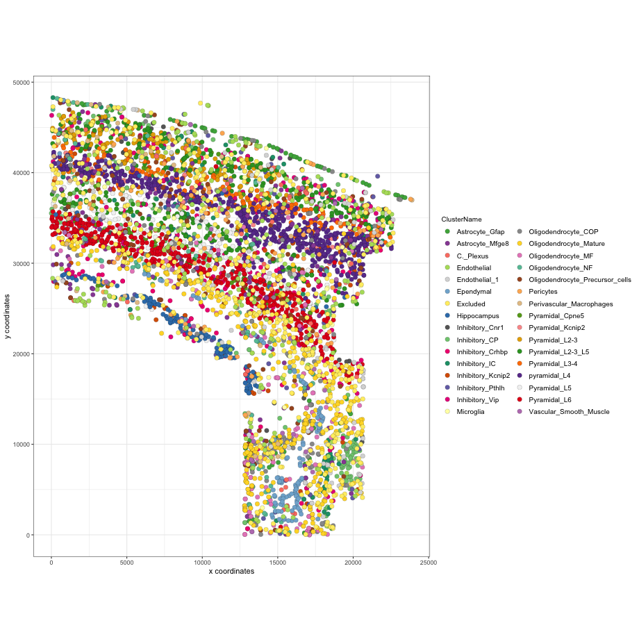

<!-- mouse_cortex_1_simple.md is generated from mouse_cortex_1_simple.Rmd Please edit that file -->


```{r, include = FALSE}
knitr::opts_chunk$set(
  collapse = TRUE,
  comment = "#>",
  fig.path = "man/figures/README-",
  out.width = "100%"
)
```


```{r eval=FALSE, message=FALSE, warning=FALSE}
library(Giotto)
# this example works with Giotto v.0.1.2
```

### Data input

<details>
  <summary>Expand</summary>
  \ 
  
[Codeluppi et al.](https://www.nature.com/articles/s41592-018-0175-z) created a high quality and very sensitive spatial expression dataset consisting of 33 genes from 4,839 single cells acquired with osmFISH in the somatosensory mosue cortex.
  
{width=20cm} .

```{r, eval=FALSE}
## select the directory where you have saved the osmFISH data
data_dir = '/Volumes/Ruben_Seagate/Dropbox/Projects/GC_lab/Ruben_Dries/190225_spatial_package/Data/osmFISH_data/'
## ss cortex expression DATA ##
osm_exprs = read.table(file = paste0(data_dir,'/','osmFISH_prep_expression.txt'))
## prepare cell locations
osm_locs = read.table(file = paste0(data_dir,'/','osmFISH_prep_cell_coordinates.txt'))
osm_locs = osm_locs[rownames(osm_locs) %in% colnames(osm_exprs),]
```

***

</details>

\ 

### 1. Create Giotto object & process data
<details>
  <summary>Expand</summary>
  \ 
 
```{r eval=FALSE}
## create
osm_test <- createGiottoObject(raw_exprs = osm_exprs, spatial_locs = osm_locs)

## add field annotation
metadata = fread(file = paste0(data_dir,'/','osmFISH_prep_cell_metadata.txt'))
osm_test = addCellMetadata(osm_test, new_metadata = metadata,
                          by_column = T, column_cell_ID = 'CellID')

## filter
osm_test <- filterGiotto(gobject = osm_test,
                        expression_threshold = 1,
                        gene_det_in_min_cells = 10,
                        min_det_genes_per_cell = 10,
                        expression_values = c('raw'),
                        verbose = T)

## normalize
# 1. standard z-score way
osm_test <- normalizeGiotto(gobject = osm_test)

# 2. osmFISH way, add to custom expression slot
raw_expr_matrix = osm_test@raw_exprs
norm_genes = (raw_expr_matrix/rowSums(raw_expr_matrix)) * nrow(raw_expr_matrix)
norm_genes_cells = t((t(norm_genes)/colSums(norm_genes)) * ncol(raw_expr_matrix))
osm_test@custom_expr = norm_genes_cells

## add gene & cell statistics
osm_test <- addStatistics(gobject = osm_test)

## visualize original annotations ##
visPlot(gobject = osm_test, sdimx = 'sdimx', sdimy = 'sdimy', cell_color = 'ClusterName')

visPlot(gobject = osm_test, sdimx = 'sdimx', sdimy = 'sdimy', cell_color = 'Region')
```
  
osmFISH cell types from paper:
{width=16cm} 

osmFISH regions from paper:
{width=16cm} 


