  - [Giotto global instructions](#giotto-global-instructions)
  - [Data input](#data-input)
  - [part 1: Create Giotto object & process
    data](#part-1-create-giotto-object-process-data)
  - [part 2: dimension reduction](#part-2-dimension-reduction)
  - [part 3: cluster](#part-3-cluster)
  - [part 4: co-visualize](#part-4-co-visualize)
  - [part 5: differential expression](#part-5-differential-expression)
  - [part 6: cell-type annotation](#part-6-cell-type-annotation)
  - [part 7: spatial grid](#part-7-spatial-grid)
  - [part 8: spatial network](#part-8-spatial-network)
  - [part 9: spatial genes](#part-9-spatial-genes)
  - [part 10: HMRF domains](#part-10-hmrf-domains)
  - [part 11: Cell-cell preferential
    proximity](#part-11-cell-cell-preferential-proximity)

<!-- mouse_cortex_1_simple.md is generated from mouse_cortex_1_simple.Rmd Please edit that file -->

### Giotto global instructions

  - save\_plot = T : plots will be automatically saved in the designated
    save\_dir (i.e. here provided as results\_folder)
  - plot parameters: png formation, with resolution of 300 and height
    and width of 9 in
  - changes or additions to the plot parameters will be given through
    the save\_param parameter: like this **save\_param =
    list(save\_folder = ‘my\_subfolder’, save\_name =
    ‘my\_own\_plotname’)**

<!-- end list -->

``` r
# this example was created with Giotto v.0.1.3
library(Giotto)

# create instructions
my_python_path = "/Users/rubendries/Bin/anaconda3/envs/py36/bin/pythonw"
results_folder = '/my/results/folder/path/'
instrs = createGiottoInstructions(python_path = my_python_path,
                                  show_plot = F, return_plot = T, save_plot = T,
                                  save_dir = results_folder,
                                  plot_format = 'png',
                                  dpi = 300, height = 9, width = 9)
```

### Data input

[Codeluppi et al.](https://www.nature.com/articles/s41592-018-0175-z)
created a high quality and very sensitive spatial expression dataset
consisting of 33 genes from 4,839 single cells acquired with osmFISH in
the somatosensory mosue cortex.

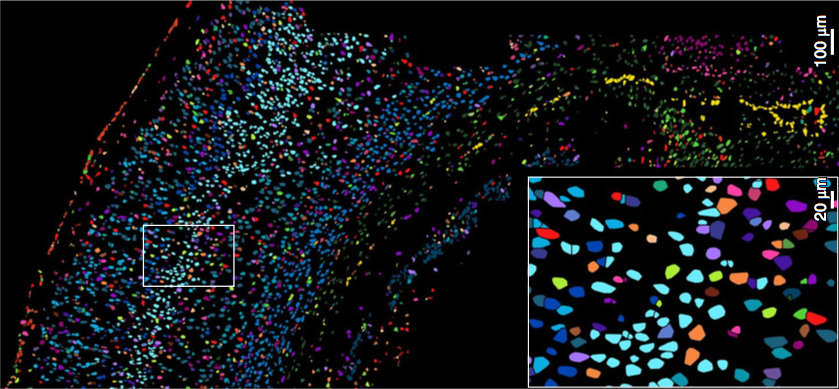 .

``` r
## select the directory where you have saved the osmFISH data
data_dir = '/path/to/directory/of/osmFISH_data/'
## ss cortex expression DATA ##
osm_exprs = read.table(file = paste0(data_dir,'/','osmFISH_prep_expression.txt'))
## prepare cell locations
osm_locs = read.table(file = paste0(data_dir,'/','osmFISH_prep_cell_coordinates.txt'))
osm_locs = osm_locs[rownames(osm_locs) %in% colnames(osm_exprs),]
```

-----

### part 1: Create Giotto object & process data

<details>

<summary>Expand</summary>  

``` r
## create
osm_test <- createGiottoObject(raw_exprs = osm_exprs, spatial_locs = osm_locs, instructions = instrs)
showGiottoInstructions(osm_test)

## add field annotation
metadata = fread(file = paste0(data_dir,'/','osmFISH_prep_cell_metadata.txt'))
osm_test = addCellMetadata(osm_test, new_metadata = metadata,
                           by_column = T, column_cell_ID = 'CellID')
## filter
osm_test <- filterGiotto(gobject = osm_test,
                         expression_threshold = 1,
                         gene_det_in_min_cells = 10,
                         min_det_genes_per_cell = 10,
                         expression_values = c('raw'),
                         verbose = T)

## normalize
# 1. standard z-score way
osm_test <- normalizeGiotto(gobject = osm_test)

# 2. osmFISH way
raw_expr_matrix = osm_test@raw_exprs
norm_genes = (raw_expr_matrix/rowSums(raw_expr_matrix)) * nrow(raw_expr_matrix)
norm_genes_cells = t((t(norm_genes)/colSums(norm_genes)) * ncol(raw_expr_matrix))
osm_test@custom_expr = norm_genes_cells

## add gene & cell statistics
osm_test <- addStatistics(gobject = osm_test)

# save according to giotto instructions
# - create subfolder
# - provide your own plot name
spatPlot(gobject = osm_test, cell_color = 'ClusterName',
           save_param = list(save_folder = '2_Gobject', save_name = 'original_clusters', units = 'in'))

spatPlot(gobject = osm_test, cell_color = 'Region',
           save_param = list(save_folder = '2_Gobject', save_name = 'original_regions', units = 'in'))
```

osmFISH cell types from paper: 

osmFISH regions from paper: 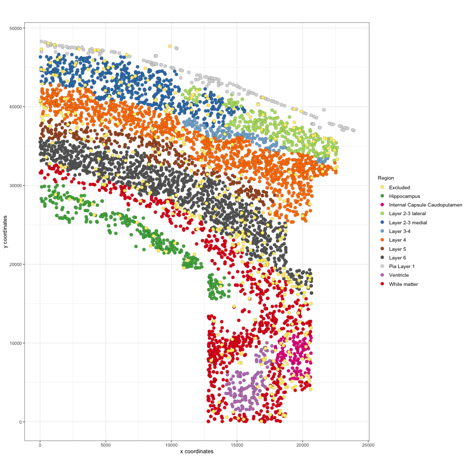

</details>

### part 2: dimension reduction

<details>

<summary>Expand</summary>  

``` r
## highly variable genes (HVG)
# only 33 genes so use all genes

## run PCA on expression values (default)
osm_test <- runPCA(gobject = osm_test, expression_values = 'custom', scale_unit = F)
signPCA(gobject = osm_test, expression_values = 'custom')
plotPCA(osm_test, save_param = list(save_folder = '3_DimRed', save_name = 'PCA_reduction', units = 'in'))

## run UMAP and tSNE on PCA space (default)
osm_test <- runUMAP(osm_test, dimensions_to_use = 1:31, expression_values = 'custom', n_threads = 2)
plotUMAP(gobject = osm_test,  save_param = list(save_folder = '3_DimRed', save_name = 'UMAP_reduction', units = 'in'))

osm_test <- runtSNE(osm_test, dimensions_to_use = 1:31, perplexity = 70, check_duplicates = F)
plotTSNE(gobject = osm_test,  save_param = list(save_folder = '3_DimRed', save_name = 'tSNE_reduction', units = 'in'))
```

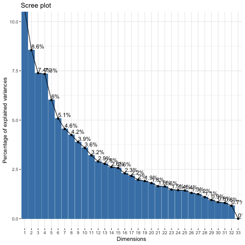

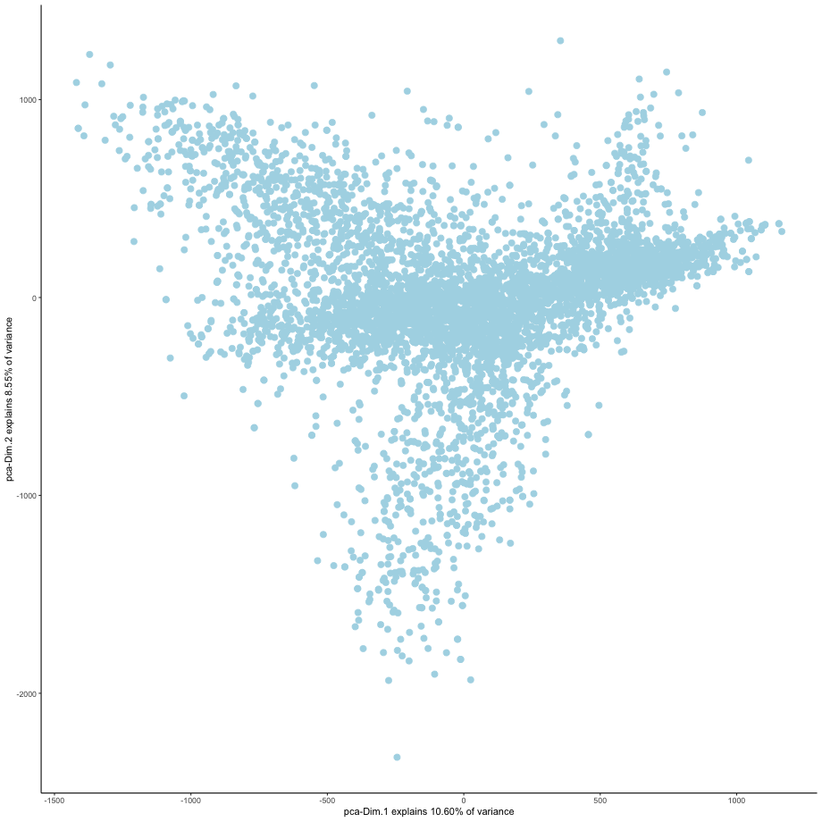 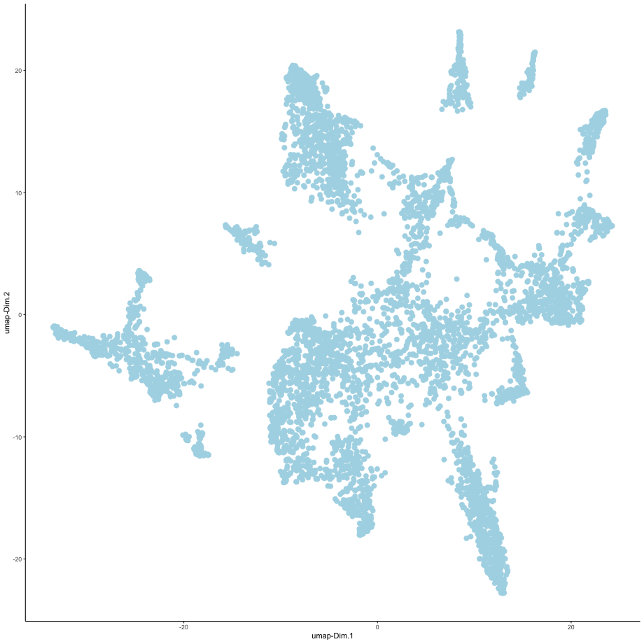

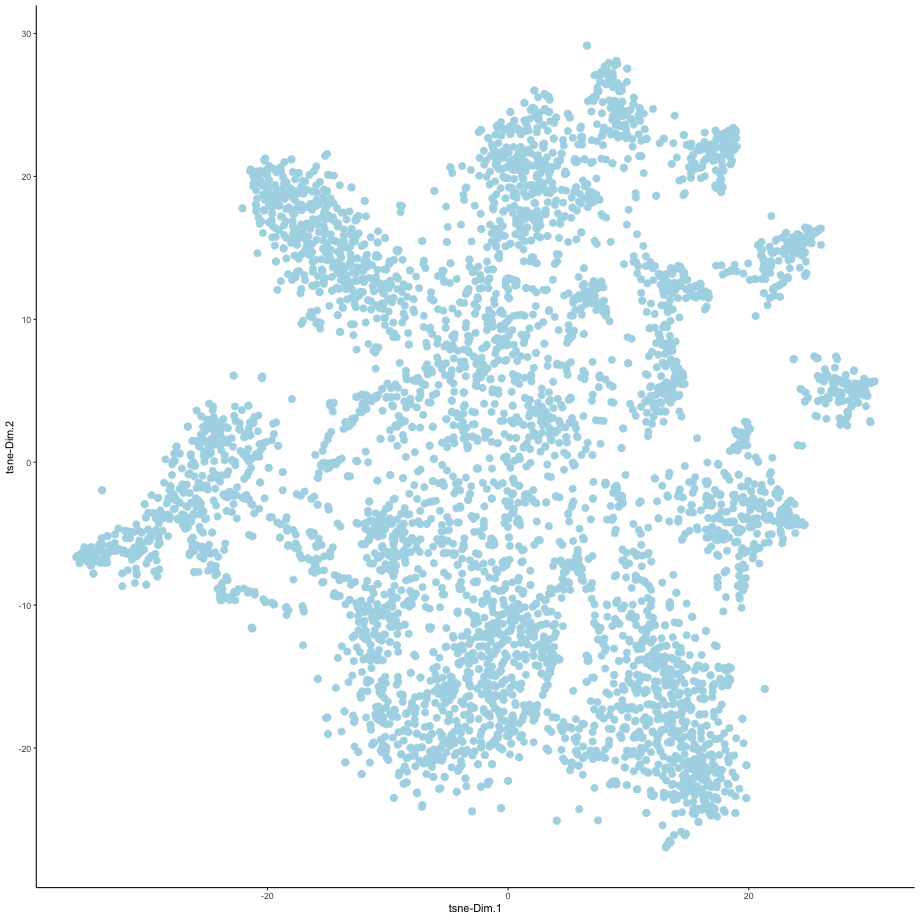

-----

</details>

### part 3: cluster

<details>

<summary>Expand</summary>  

``` r

## hierarchical clustering
osm_test = doHclust(gobject = osm_test, expression_values = 'custom', k = 34)
plotUMAP(gobject = osm_test, cell_color = 'hclust', point_size = 2.5,
         show_NN_network = F, edge_alpha = 0.05,
         save_param = list(save_folder = '4_Cluster', save_name = 'UMAP_hclust', units = 'in'))

## kmeans clustering
osm_test = doKmeans(gobject = osm_test, expression_values = 'custom', centers = 32, nstart = 500)
plotUMAP(gobject = osm_test, cell_color = 'kmeans',
         point_size = 2.5, show_NN_network = F, edge_alpha = 0.05, 
         save_param =  list(save_folder = '4_Cluster', save_name = 'UMAP_kmeans', units = 'in'))

## Leiden clustering
# sNN network (default)
osm_test <- createNearestNetwork(gobject = osm_test, dimensions_to_use = 1:31, k = 15)
osm_test <- doLeidenCluster(gobject = osm_test, resolution = 0.05, n_iterations = 100)
plotUMAP(gobject = osm_test, cell_color = 'leiden_clus', point_size = 2.5,
         show_NN_network = F, edge_alpha = 0.05,
         save_param = list(save_folder = '4_Cluster', save_name = 'UMAP_leiden', units = 'in'))

# merge small groups based on similarity
leiden_similarities = getClusterSimilarity(osm_test,
                                           expression_values = 'custom',
                                           cluster_column = 'leiden_clus')
osm_test = mergeClusters(osm_test, expression_values = 'custom',
                         cluster_column = 'leiden_clus',
                         new_cluster_name = 'leiden_clus_m',
                         max_group_size = 30, force_min_group_size = 20)
plotUMAP(gobject = osm_test, cell_color = 'leiden_clus_m', point_size = 2.5,
         show_NN_network = F, edge_alpha = 0.05,
         save_param = list(save_folder = '4_Cluster', save_name = 'UMAP_leiden_merged', units = 'in'))

## show cluster relationships
showClusterHeatmap(gobject = osm_test, expression_values = 'custom', cluster_column = 'leiden_clus_m',
                   save_param = list(save_name = 'heatmap', save_folder = '4_Cluster', units = 'cm'),
                   row_names_gp = grid::gpar(fontsize = 6), column_names_gp = grid::gpar(fontsize = 6))

showClusterDendrogram(osm_test, cluster_column = 'leiden_clus_m', h = 1, rotate = T,
                      save_param = list(save_name = 'dendro', save_folder = '4_Cluster', units = 'cm'))
```

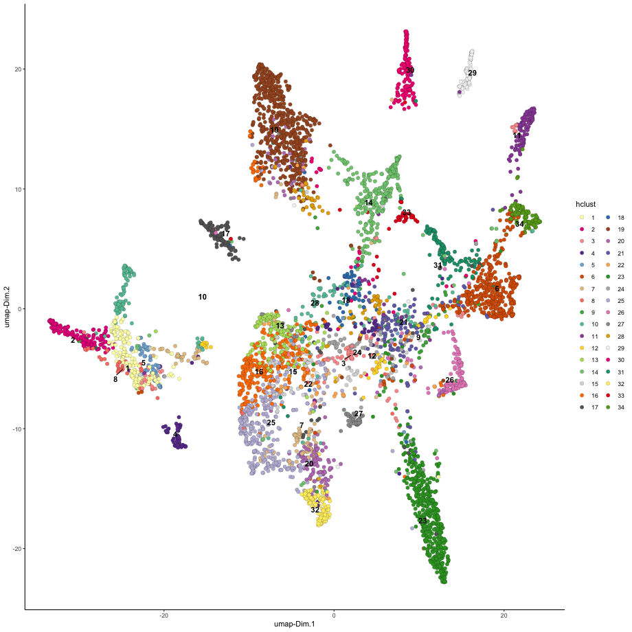

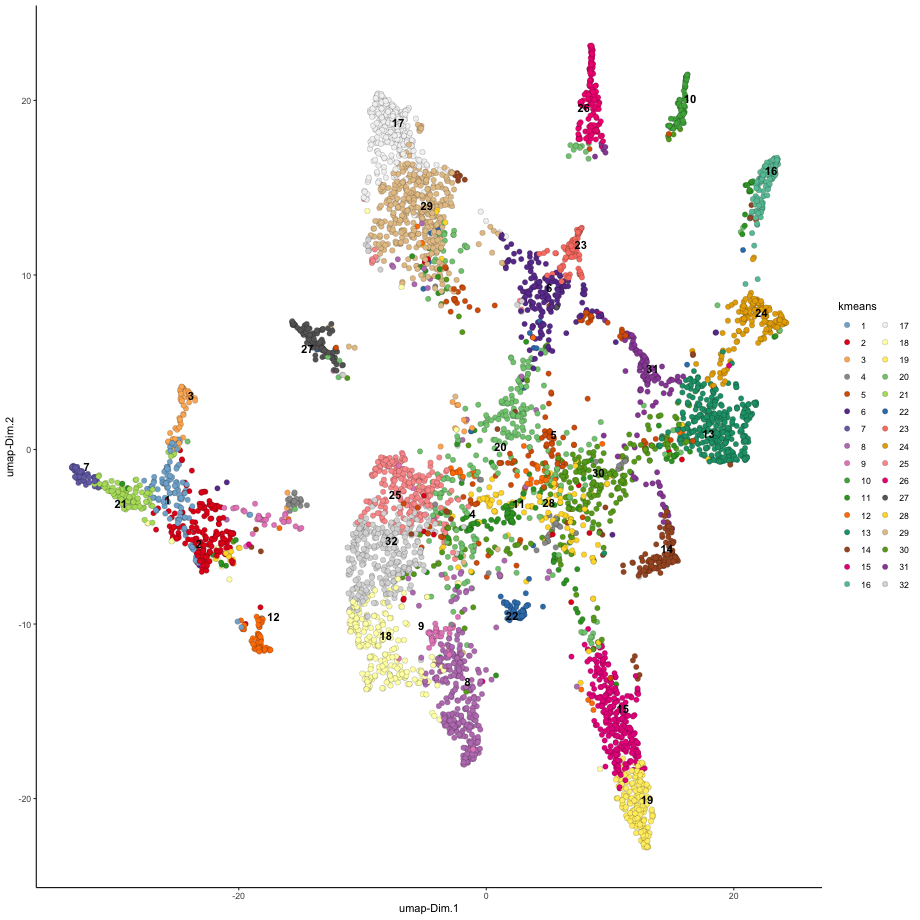

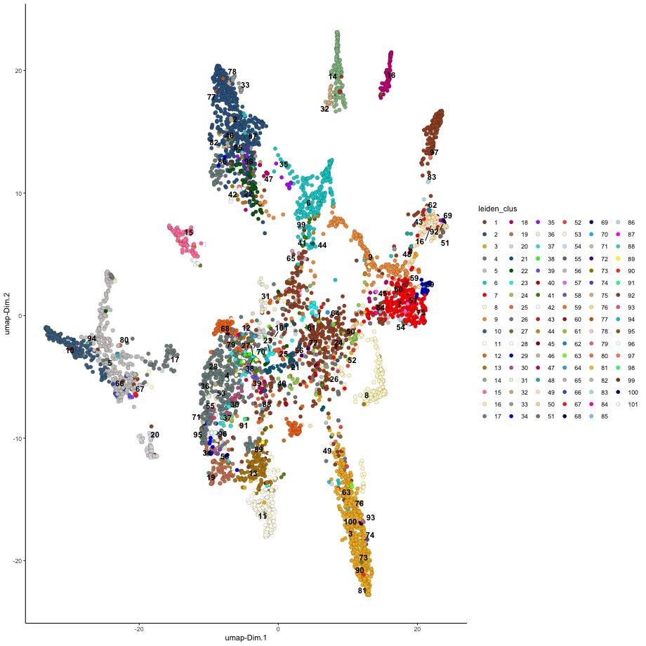 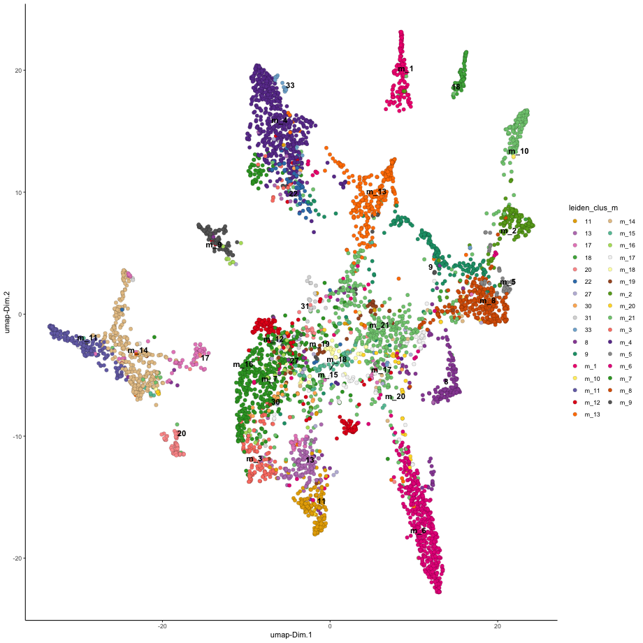
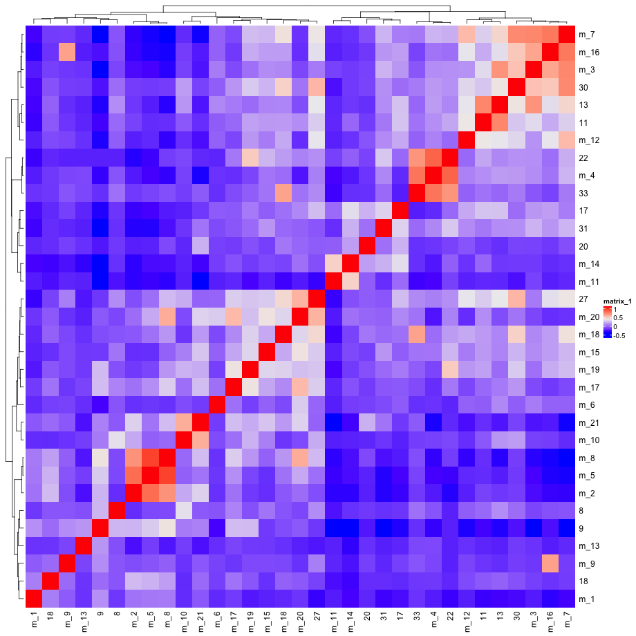
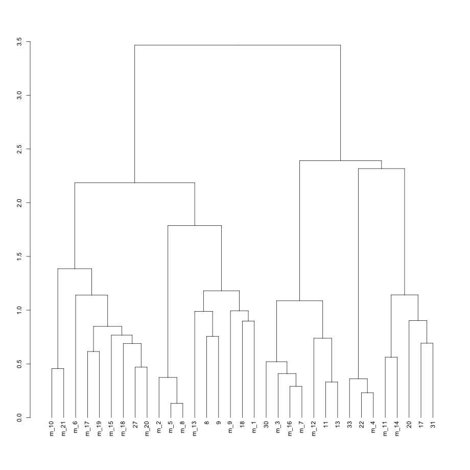 \*\*\*

</details>

### part 4: co-visualize

<details>

<summary>Expand</summary>  

``` r
# co-visualization
spatDimPlot(gobject = osm_test, cell_color = 'leiden_clus_m',
              save_param = list(save_name = 'covis_leiden_m', save_folder = '5_Covisuals'))

# select group m_8 only
spatDimPlot(gobject = osm_test, cell_color = 'leiden_clus_m', 
              dim_point_size = 2, spat_point_size = 2, select_cell_groups = 'm_8',
              save_param = list(save_name = 'covis_leiden_merged_selected', save_folder = '5_Covisuals'))
```

Co-visualzation: 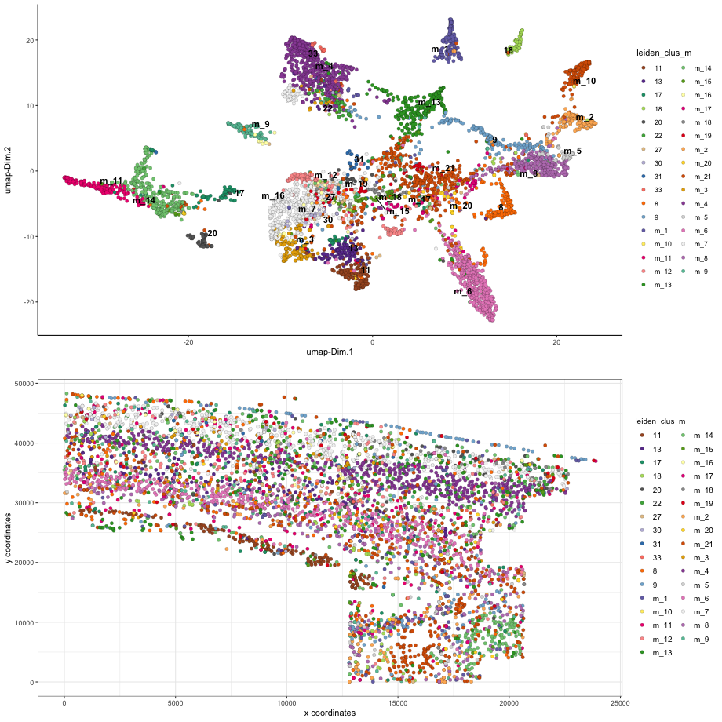 Selection:
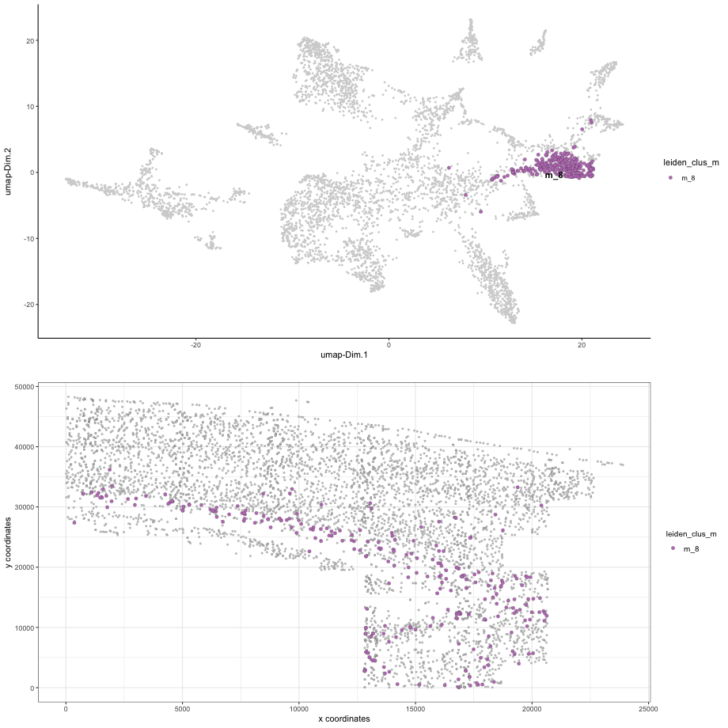 \*\*\*

</details>

### part 5: differential expression

<details>

<summary>Expand</summary>  

``` r
## split dendrogram nodes ##
## can be used to find DEGs at each split of a tree
dendsplits = getDendrogramSplits(gobject = osm_test,
                                 expression_values = 'custom',
                                 cluster_column = 'leiden_clus_m')
split_3_markers = findGiniMarkers(gobject = osm_test, expression_values = 'custom', cluster_column = 'leiden_clus_m',
                                  group_1 = unlist(dendsplits[3]$tree_1), group_2 = unlist(dendsplits[3]$tree_2))

## Individual populations ##
markers = findMarkers_one_vs_all(gobject = osm_test,
                                 method = 'scran',
                                 expression_values = 'custom',
                                 cluster_column = 'leiden_clus_m',
                                 min_genes = 2, rank_score = 2)
## violinplot
topgenes = markers[, head(.SD, 1), by = 'cluster']$genes
violinPlot(osm_test, genes = unique(topgenes), cluster_column = 'leiden_clus_m', expression_values = 'custom',
           strip_text = 5, strip_position = 'right',
           save_param = c(save_name = 'violinplot', save_folder = '6_DEG'))

## cluster heatmap
ranked_genes = c('Bmp4', 'Itpr2', 'Tmem2', 'Ctps', 'Plp1',
                 'Sox10','Foxj1', 'Aldoc', 'Gfap', 'Acta2',
                 'Mrc1', 'Vtn', 'Crhbp', 'Slc32a1', 'Gad2',
                 'Syt6', 'Serpinf1', 'Cpne5', 'Lamp5', 'Hexb',
                 'Kcnip2', 'Tbr1', 'Ttr', 'Apln', 'Anln',
                 'Crh', 'Vip', 'Cnr1', 'Pthlh', 'Rorb',
                 'Flt1', 'Mfge8', 'Pdgfra')

plotMetaDataHeatmap(osm_test, expression_values = 'custom',
                    metadata_cols = c('leiden_clus_m'), custom_gene_order = ranked_genes,
                    save_param = c(save_name = 'metaheatmap', save_folder = '6_DEG'))
```

violinplot: 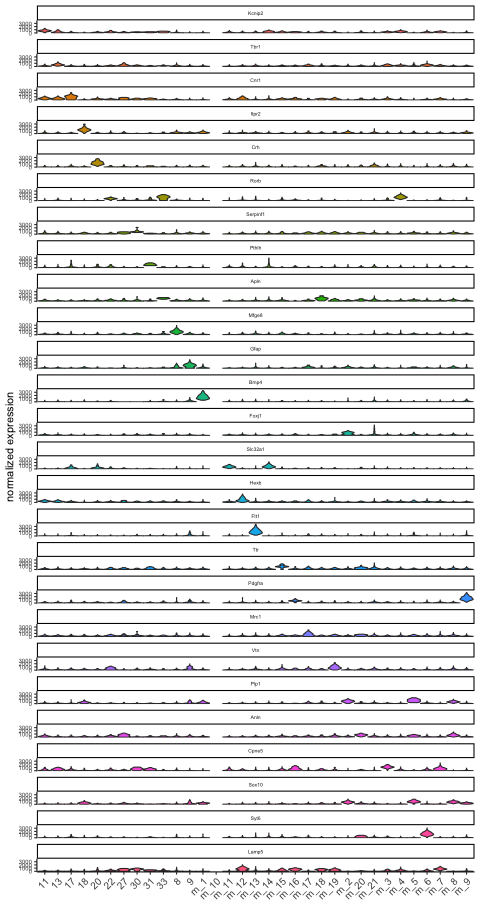

Heatmap clusters: 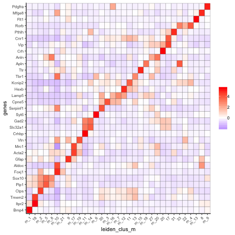

-----

</details>

### part 6: cell-type annotation

<details>

<summary>Expand</summary>  

``` r

## create vector with names
clusters_SS_cortex = c('OOP', 'OL1', 'OL2', 'OL3', 'OL4',
                       'Ependymal', 'unknown', 'Astro_Gfap', 'vSMC', 'Pericytes',
                       'IN1', 'IN2', 'Pyr1', 'Astro', 'IN3',
                       'IN4', 'Pyr2', 'Miglia1', 'IN5', 'Pyr3',
                       'Choroid', 'Vend1', 'OL5', 'IN6', 'IN7',
                       'IN8', 'IN9', 'Pyr4', 'Pyr5', 'Pyr6',
                       'Vend2', 'Astro_Mfge8', 'OPC')
names(clusters_SS_cortex) = c('m_1', '18', 'm_2', 'm_5', 'm_8',
                              'm_10', 'm_21', '9', 'm_17', 'm_19',
                              'm_11', 'm_14', 'm_6', '30', 'm_3',
                              'm_16', 'm_7', 'm_12', '11', '13',
                              'm_15', 'm_18', '27', 'm_20', '20',
                              '17', '31', '33', '22', 'm_4',
                              'm_13', '8', 'm_9')
osm_test = annotateGiotto(gobject = osm_test, annotation_vector = clusters_SS_cortex,
                          cluster_column = 'leiden_clus_m', name = 'leiden_clus_m_types')
spatDimPlot(gobject = osm_test, cell_color = 'leiden_clus_m_types',dim_point_size = 2, spat_point_size = 2,
              save_param = c(save_name = 'annotation_leiden_merged_first', save_folder = '7_annotation'))
```

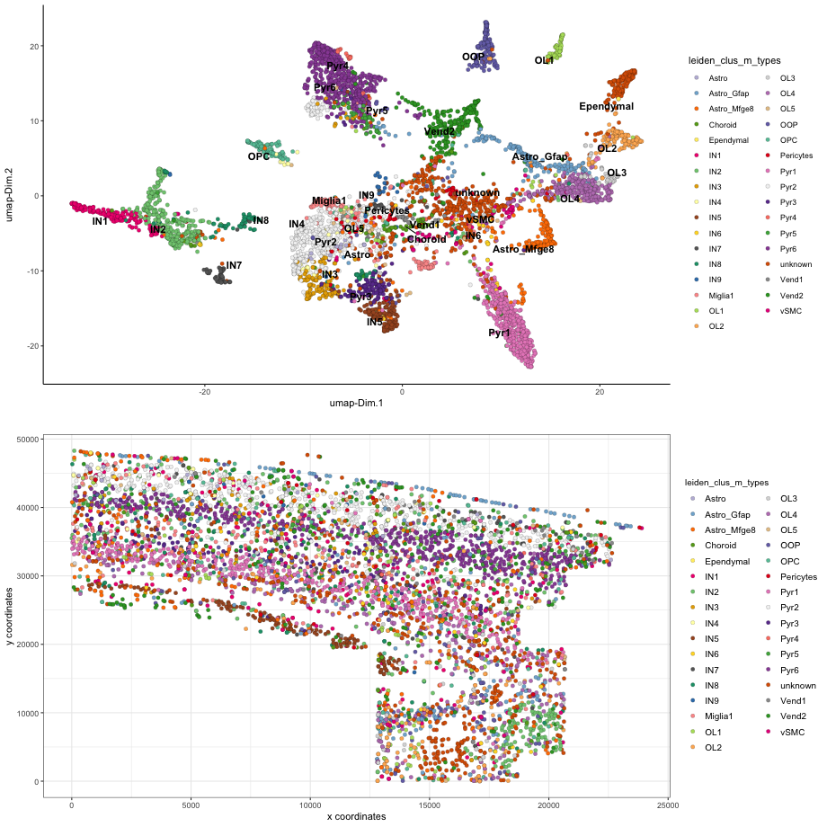

``` r
## compare clusters with osmFISH paper
clusters_det_SS_cortex = c('Olig_COP', 'Olig_NF', 'Olig_MF', 'Olig_mat', 'Olig_mat',
                           'Ependymal', 'unknown', 'Astro_Gfap', 'vSMC', 'Pericytes',
                           'Inh_Crhbp', 'Inh_IC', 'Pyr_L6', 'Periv_Macro', 'Pyr_Cpne5',
                           'unknown', 'Pyr_L2/3', 'Microglia', 'Hippocampus', 'Pyr_L5',
                           'Choroid', 'vEnd', 'unknown', 'Inh_Anln', 'Inh_Crh',
                           'Inh_Vip', 'Inh_Pthlh', 'Pyr_Apln', 'Pyr_Kcnip2', 'Pyr_L4',
                           'vEnd', 'Astro_Mfge8', 'Olig_precursor')
names(clusters_det_SS_cortex) = c('m_1', '18', 'm_2', 'm_5', 'm_8',
                                  'm_10', 'm_21', '9', 'm_17', 'm_19',
                                  'm_11', 'm_14', 'm_6', '30', 'm_3',
                                  'm_16', 'm_7', 'm_12', '11', '13',
                                  'm_15', 'm_18', '27', 'm_20', '20',
                                  '17', '31', '33', '22', 'm_4',
                                  'm_13', '8', 'm_9')
osm_test = annotateGiotto(gobject = osm_test, annotation_vector = clusters_det_SS_cortex,
                          cluster_column = 'leiden_clus_m', name = 'det_cell_types')
spatDimPlot(gobject = osm_test, cell_color = 'det_cell_types',dim_point_size = 2, spat_point_size = 2,
             save_param = c(save_name = 'annotation_leiden_merged_detailed', save_folder = '7_annotation'))
```

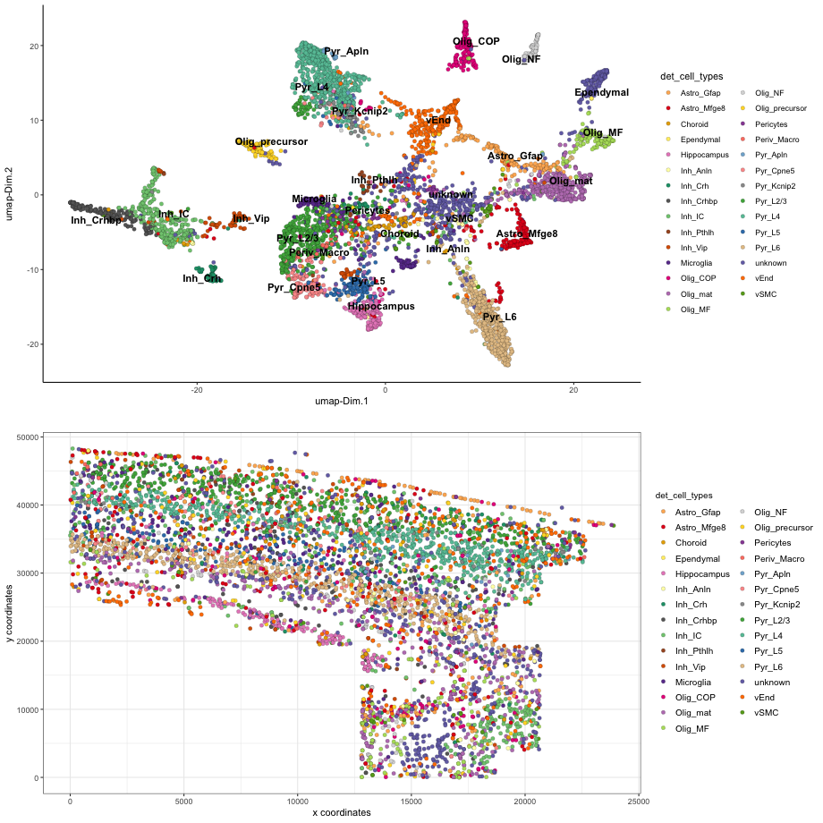

``` r
## coarse cell types
clusters_coarse_SS_cortex = c('Olig', 'Olig', 'Olig', 'Olig', 'Olig',
                              'Ependymal', 'unknown', 'Astro', 'vSMC', 'Pericytes',
                              'Inh', 'Inh', 'Pyr', 'Periv_Macro', 'Pyr',
                              'unknown', 'Pyr', 'Microglia', 'Hippocampus', 'Pyr',
                              'Choroid', 'vEnd', 'unknown', 'Inh', 'Inh',
                              'Inh', 'Inh', 'Pyr', 'Pyr', 'Pyr',
                              'vEnd', 'Astro', 'Olig')
names(clusters_coarse_SS_cortex) = c('Olig_COP', 'Olig_NF', 'Olig_MF', 'Olig_mat', 'Olig_mat',
                                     'Ependymal', 'unknown', 'Astro_Gfap', 'vSMC', 'Pericytes',
                                     'Inh_Crhbp', 'Inh_IC', 'Pyr_L6', 'Periv_Macro', 'Pyr_Cpne5',
                                     'unknown', 'Pyr_L2/3', 'Microglia', 'Hippocampus', 'Pyr_L5',
                                     'Choroid', 'vEnd', 'unknown', 'Inh_Anln', 'Inh_Crh',
                                     'Inh_Vip', 'Inh_Pthlh', 'Pyr_Apln', 'Pyr_Kcnip2', 'Pyr_L4',
                                     'vEnd', 'Astro_Mfge8', 'Olig_precursor')
osm_test = annotateGiotto(gobject = osm_test, annotation_vector = clusters_coarse_SS_cortex,
                          cluster_column = 'det_cell_types', name = 'coarse_cell_types')
spatDimPlot(gobject = osm_test, cell_color = 'coarse_cell_types',dim_point_size = 2, spat_point_size = 2,
              save_param = c(save_name = 'annotation_leiden_merged_coarse', save_folder = '7_annotation'))
```

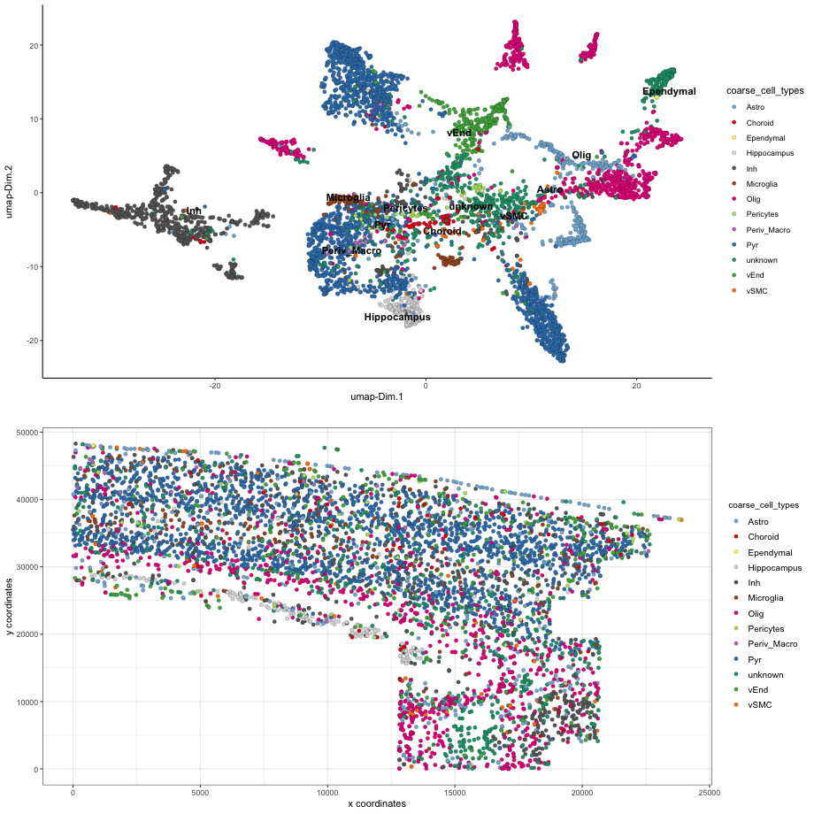

-----

</details>

### part 7: spatial grid

<details>

<summary>Expand</summary>  

``` r
## spatial grid
osm_test <- createSpatialGrid(gobject = osm_test,
                               sdimx_stepsize = 2000,
                               sdimy_stepsize = 2000,
                               minimum_padding = 0)
spatPlot(osm_test, cell_color = 'det_cell_types', show_grid = T,
           grid_color = 'lightblue', spatial_grid_name = 'spatial_grid',
           save_param = c(save_name = 'grid_det_cell_types', save_folder = '8_grid'))
```

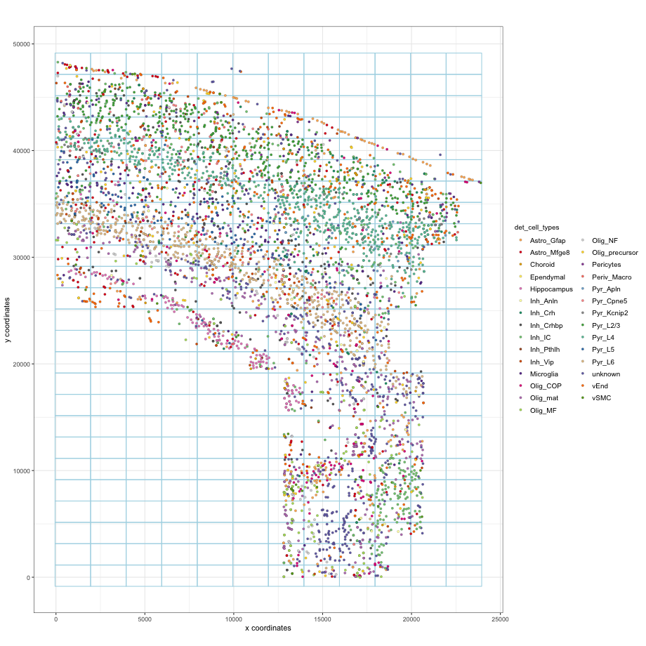

``` r
#### spatial patterns ####
pattern_osm = detectSpatialPatterns(gobject = osm_test, 
                                   expression_values = 'custom',
                                   spatial_grid_name = 'spatial_grid',
                                   min_cells_per_grid = 5, 
                                   scale_unit = T, 
                                   PC_zscore = 1, 
                                   show_plot = T)

showPattern2D(osm_test, pattern_osm, dimension = 1, point_size = 4,
              save_param = c(save_name = 'pattern1_pca', save_folder = '8_grid'))

showPatternGenes(osm_test, pattern_osm, dimension = 1, save_plot = T,
                 save_param = c(save_name = 'pattern1_genes', save_folder = '8_grid', base_height = 3, base_width = 3, dpi = 100))
```

pattern 1: 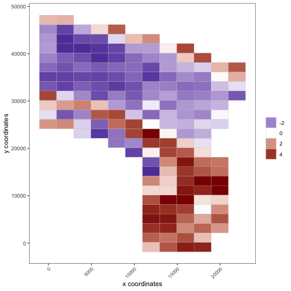

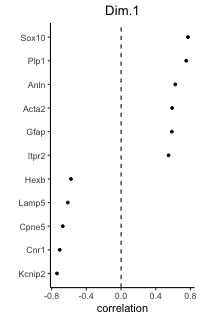

-----

</details>

### part 8: spatial network

<details>

<summary>Expand</summary>  

``` r
osm_test <- createSpatialNetwork(gobject = osm_test, k = 5)
spatPlot(gobject = osm_test, show_network = T,
        network_color = 'blue', spatial_network_name = 'spatial_network',
        point_size = 1, cell_color = 'det_cell_types',
        save_param = c(save_name = 'spatial_network_k10', save_folder = '9_spatial_network'))
```

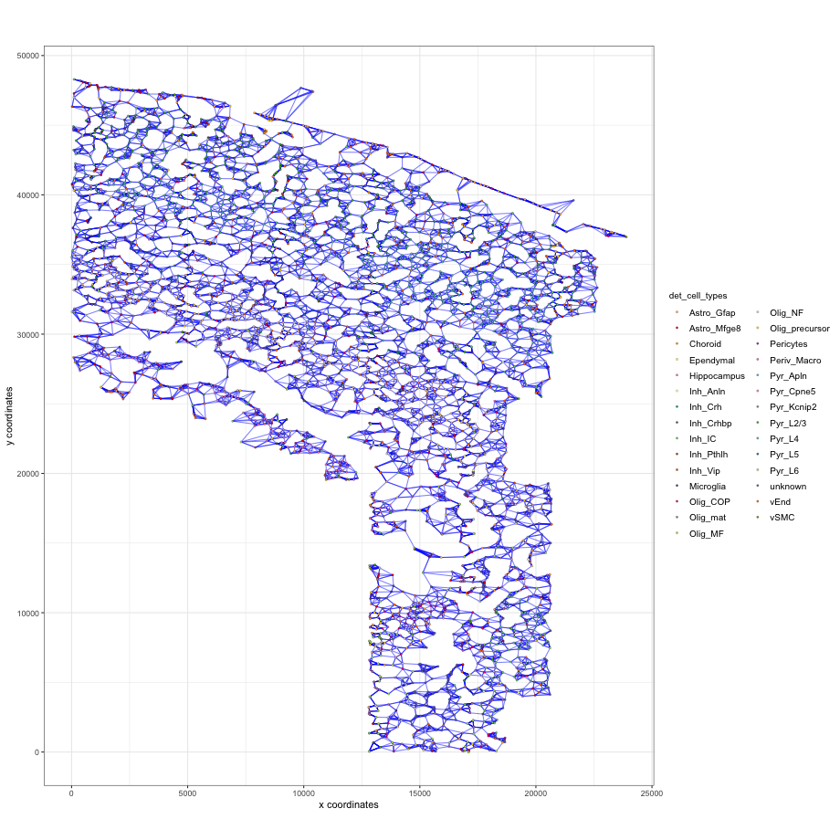

-----

</details>

### part 9: spatial genes

<details>

<summary>Expand</summary>  

``` r
kmtest = binGetSpatialGenes(osm_test, bin_method = 'kmeans',
                            do_fisher_test = T, community_expectation = 5,
                            spatial_network_name = 'spatial_network', verbose = T)

ranktest = binGetSpatialGenes(osm_test, bin_method = 'rank',
                              do_fisher_test = T, community_expectation = 5,
                              spatial_network_name = 'spatial_network', verbose = T)

spatial_genes = calculate_spatial_genes_python(gobject = osm_test,
                                               expression_values = 'scaled',
                                               python_path = my_python_path,
                                               rbp_p=0.99, examine_top=0.1)

spatDimGenePlot(osm_test, expression_values = 'normalized',
                  genes = c('Rorb', 'Syt6', 'Gfap', 'Kcnip2'),
                  plot_alignment = 'vertical', cow_n_col = 4,
                  genes_high_color = 'red', genes_mid_color = 'white', genes_low_color = 'darkblue', midpoint = 4,
                  save_param = c(save_name = 'spatial_genes_norm', save_folder = '10_spatial_genes', base_width = 16))

spatDimGenePlot(osm_test, expression_values = 'scaled',
                  genes = c('Rorb', 'Syt6', 'Gfap', 'Kcnip2'),
                  plot_alignment = 'vertical', cow_n_col = 4,
                  genes_high_color = 'red', genes_mid_color = 'white', genes_low_color = 'darkblue', midpoint = 0,
                  save_param = c(save_name = 'spatial_genes_scaled', save_folder = '10_spatial_genes', base_width = 16))
```

Spatial genes:  
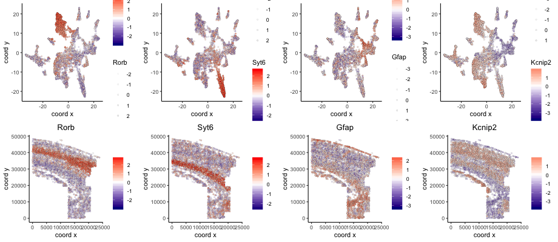

-----

</details>

### part 10: HMRF domains

<details>

<summary>Expand</summary>  

``` r
my_spatial_genes = spatial_genes[1:20]$genes

my_spatial_genes

 [1] "Rorb"    "Syt6"    "Gfap"    "Lamp5"   "Plp1"    "Sox10"   "Cpne5"  
 [8] "Kcnip2"  "Foxj1"   "Tbr1"    "Cnr1"    "Slc32a1" "Hexb"    "Itpr2"  
[15] "Ttr"     "Anln"    "Ctps"    "Gad2"    "Mfge8"   "Flt1"


# do HMRF with different betas
HMRF_spatial_genes = doHMRF(gobject = osm_test, expression_values = 'normalized',
                            spatial_genes = my_spatial_genes,
                            k = 10,
                            betas = c(0, 0.5, 10), 
                            output_folder = paste0(hmrf_folder, '/', 'Spatial_genes/SG_top10_k10_scaled'),
                            python_path = my_python_path,
                            zscore="rowcol", tolerance=1e-5)

## view results of HMRF
viewHMRFresults(gobject = osm_test,
                  HMRFoutput = HMRF_spatial_genes,
                  k = 10, betas_to_view = seq(0, 5, by = 0.5),
                  point_size = 1)

## add HMRF result of interest to giotto object
osm_test = addHMRF(gobject = osm_test,
                  HMRFoutput = HMRF_spatial_genes,
                  k = 10, betas_to_add = c(0, 0.5, 1.0, 1.5, 2.0),
                  hmrf_name = 'HMRF')

## visualize
# b = 0, no information from cell neighbors
spatPlot(gobject = osm_test, cell_color = 'HMRF_k10_b.0', point_size = 3,
           save_param = c(save_name = 'HMRF_k10_b.0', save_folder = '11_HMRF'))

# b = 0.5
spatPlot(gobject = osm_test, cell_color = 'HMRF_k10_b.0.5', point_size = 3,
           save_param = c(save_name = 'HMRF_k10_b.0.5', save_folder = '11_HMRF'))
```

Without information from neighboring cells, b = 0:  
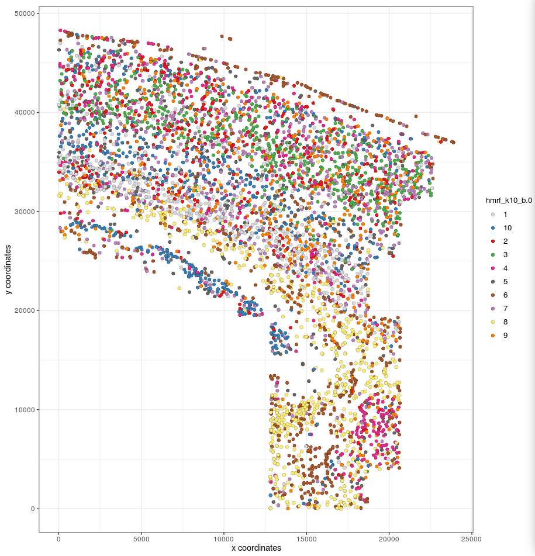


```
# b = 1.0
spatPlot2D(gobject = osm_test, cell_color = 'HMRF_k10_b.1.0', point_size = 1,
           save_param = c(save_name = 'HMRF_k10_b.1.0', save_folder = '11_HMRF'))
```


b = 1.0:  
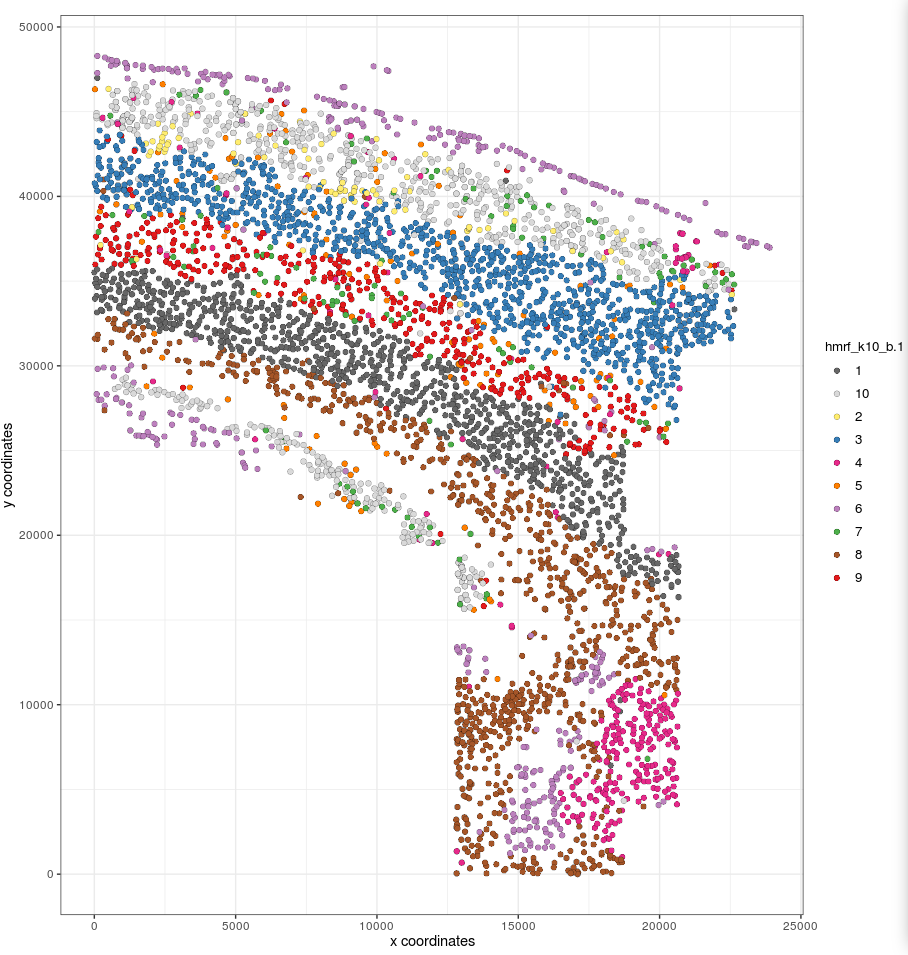

-----

</details>

### part 11: Cell-cell preferential proximity

<details>

<summary>Expand</summary>  


``` r
## calculate frequently seen proximities
cell_proximities = cellProximityEnrichment(gobject = osm_test,
                                           cluster_column = 'det_cell_types',
                                           spatial_network_name = 'spatial_network',
                                           number_of_simulations = 400)
## barplot
cellProximityBarplot(gobject = osm_test, CPscore = cell_proximities, min_orig_ints = 25, min_sim_ints = 25, 
                     save_param = c(save_name = 'barplot_cell_cell_enrichment', save_folder = '12_cell_proxim'))
```

barplot:  
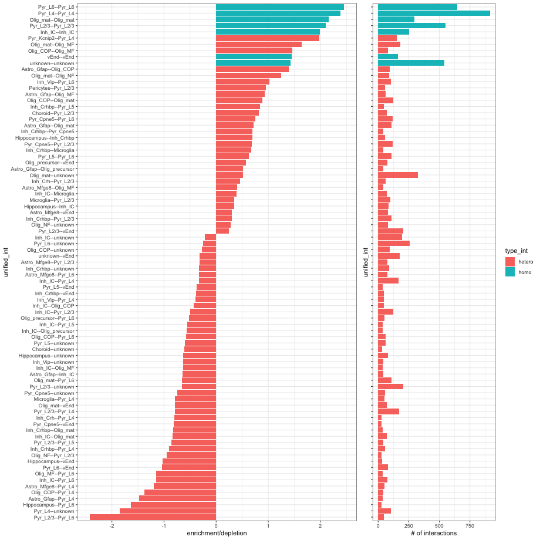

``` r
## heatmap
cellProximityHeatmap(gobject = osm_test, CPscore = cell_proximities, order_cell_types = T, scale = T,
                     color_breaks = c(-1.5, 0, 1.5), color_names = c('blue', 'white', 'red'),
                     save_param = c(save_name = 'heatmap_cell_cell_enrichment', save_folder = '12_cell_proxim', unit = 'in'))
```

heatmap:  
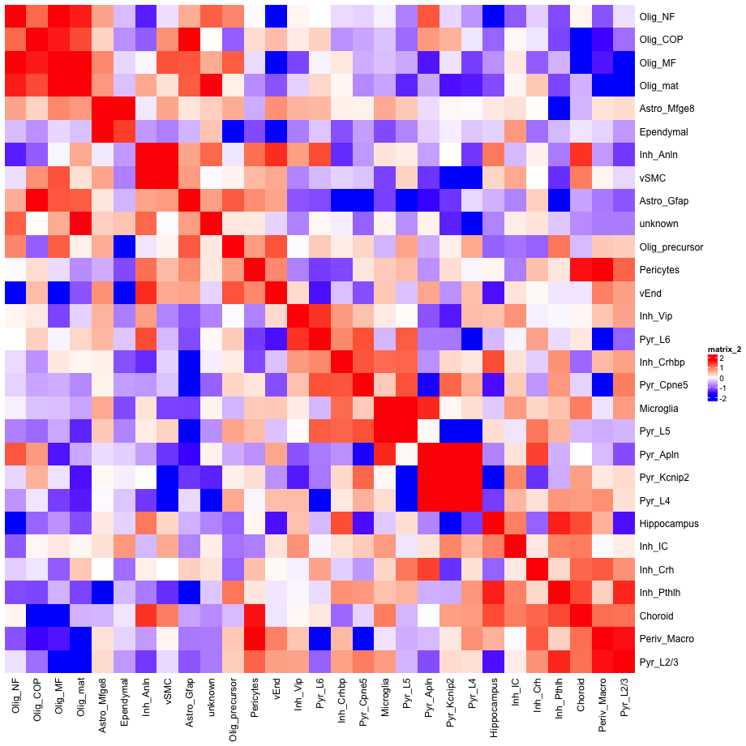

``` r
## network
cellProximityNetwork(gobject = osm_test, CPscore = cell_proximities, remove_self_edges = T, only_show_enrichment_edges = T,
                     save_param = c(save_name = 'network_cell_cell_enrichment', save_folder = '12_cell_proxim'))
```

networks:  
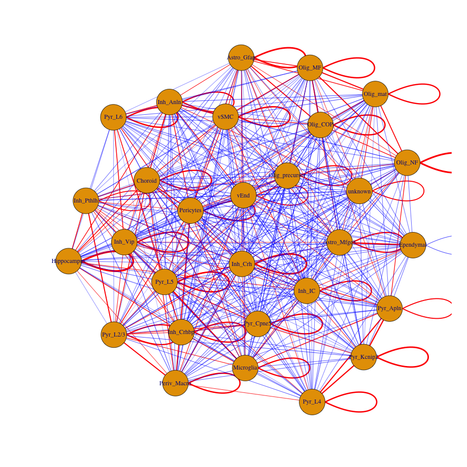

``` r
## visualization
spec_interaction = "Astro_Gfap--Olig_mat"
cellProximitySpatPlot(gobject = osm_test,
                        interaction_name = spec_interaction,
                        cluster_column = 'det_cell_types',
                        cell_color = 'det_cell_types', coord_fix_ratio = 0.5,
                        point_size_select = 4, point_size_other = 2,
                        save_param = c(save_name = 'cell_cell_enrichment_selected', save_folder = '12_cell_proxim'))
```


-----

</details>
