<!-- mouse_cortex_1_simple.md is generated from mouse_cortex_1_simple.Rmd Please edit that file -->


```{r, include = FALSE}
knitr::opts_chunk$set(
  collapse = TRUE,
  comment = "#>",
  fig.path = "man/figures/README-",
  out.width = "100%"
)
```


```{r eval=FALSE, message=FALSE, warning=FALSE}
library(Giotto)
# this example works with Giotto v.0.1.2
```

### Data input

<details>
  <summary>Expand</summary>
  \ 
  
[Rodrigues, Stickels et al.](https://science.sciencemag.org/content/363/6434/1463) used Slide-seq as a scalable technology to profile the cerebellum ast spatial resolution.
  
{width=20cm} .

```{r, eval=FALSE}
## select the directory where you have saved the osmFISH data
Slideseq_data_folder = '/Volumes/Ruben_Seagate/Dropbox/Projects/GC_lab/Ruben_Dries/190225_spatial_package/Data/Slideseq_data/Puck_180430_6/'
bead_positions <- fread(file = paste0(Slideseq_data_folder, '/', "BeadLocationsForR.csv"))
expr_matrix <- fread(paste0(Slideseq_data_folder, '/', "MappedDGEForR.csv"))
expr_mat = as.matrix(expr_matrix[,-1]);rownames(expr_mat) = expr_matrix$Row
```

***

</details>


### 1. Create Giotto object & process data
<details>
  <summary>Expand</summary>
  \ 
 
```{r eval=FALSE}
Slide_test <- createGiottoObject(raw_exprs = expr_mat, spatial_locs = bead_positions[,.(xcoord, ycoord)])
filterDistributions(Slide_test, detection = 'genes', nr_bins = 100, scale_axis = 'log2')
filterDistributions(Slide_test, detection = 'cells', nr_bins = 100, scale_axis = 'log2')
filterCombinations(Slide_test, expression_thresholds = c(1, 1), gene_det_in_min_cells = c(10, 20), min_det_genes_per_cell = c(100, 200))

# spatial data before filtering
visPlot(gobject = Slide_test)

Slide_test <- filterGiotto(gobject = Slide_test,
                           gene_det_in_min_cells = 30,
                           min_det_genes_per_cell = 150)

# remove mt-genes and blood genes (contamination)
non_mito_genes = grep(pattern = 'mt-', Slide_test@gene_ID, value = T, invert = T)
non_mito_or_blood_genes = grep(pattern = 'Hb[ab]', non_mito_genes, value = T, invert = T)

Slide_test = subsetGiotto(gobject = Slide_test, gene_ids = non_mito_or_blood_genes)

## normalize & adjust
Slide_test <- normalizeGiotto(gobject = Slide_test, scalefactor = 10000, verbose = T)
Slide_test <- addStatistics(gobject = Slide_test)
Slide_test <- adjustGiottoMatrix(gobject = Slide_test, expression_values = c('normalized'),
                                batch_columns = NULL, covariate_columns = c('nr_genes', 'total_expr'),
                                return_gobject = TRUE,
                                update_slot = c('custom'))

# spatial data after filtering
visPlot(gobject = Slide_test)
```
  
Slide-seq data before filter steps:
{width=16cm} 

Slide-seq data after filter steps:
{width=16cm} 

</details>

### 2. dimension reduction

<details>
  <summary>Expand</summary>
  \ 
 
```{r eval=FALSE}
Slide_test <- calculateHVG(gobject = Slide_test, method = 'cov_groups', 
                           zscore_threshold = 0.5, nr_expression_groups = 10)
gene_metadata = fDataDT(Slide_test)
featgenes = gene_metadata[hvg == 'yes' & perc_cells > 0.5 & mean_expr_det > 1]$gene_ID

# PCA
Slide_test <- runPCA(gobject = Slide_test,
                     expression_values = 'custom', genes_to_use = featgenes,
                     scale_unit = F)
signPCA(Slide_test, genes_to_use = featgenes, scale_unit = F, scree_ylim = c(0,0.3))
plotPCA(gobject = Slide_test)
```
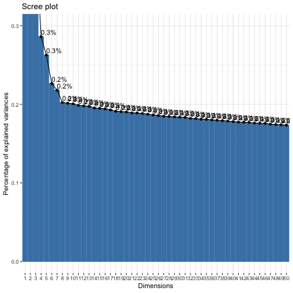{width=16cm} 
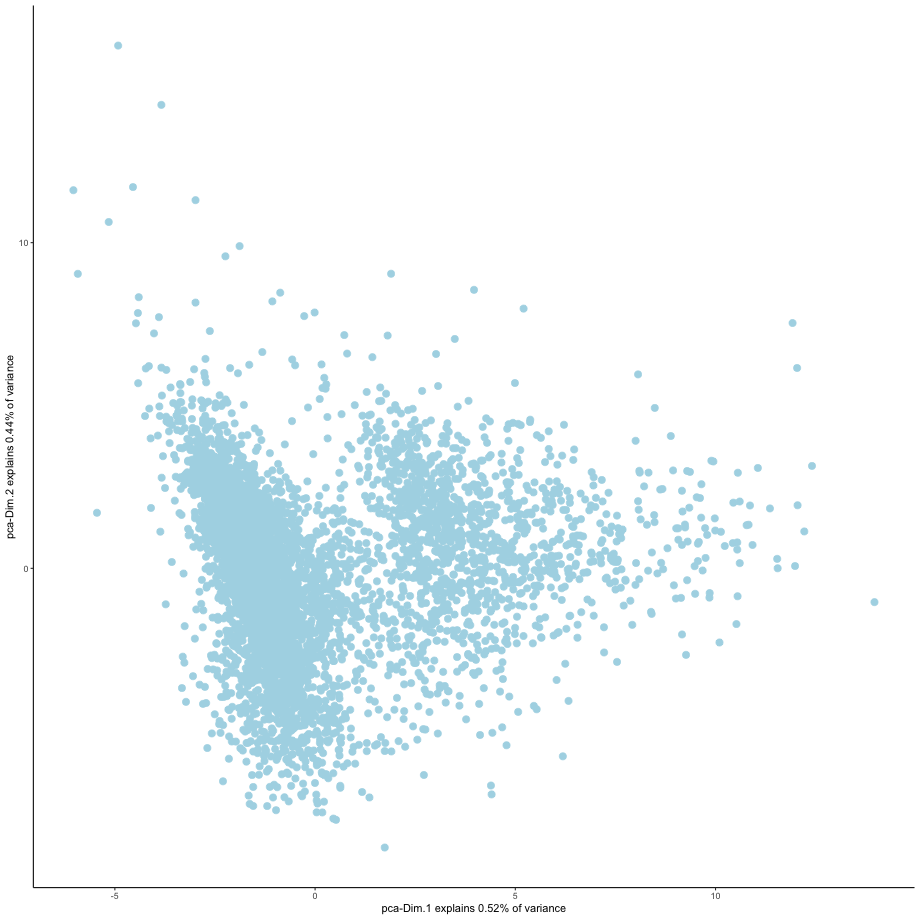{width=16cm} 
```{r eval=FALSE}
# UMAP
Slide_test <- runUMAP(Slide_test, dimensions_to_use = 1:9, n_components = 2, n_threads = 4)
plotUMAP(gobject = Slide_test)
```

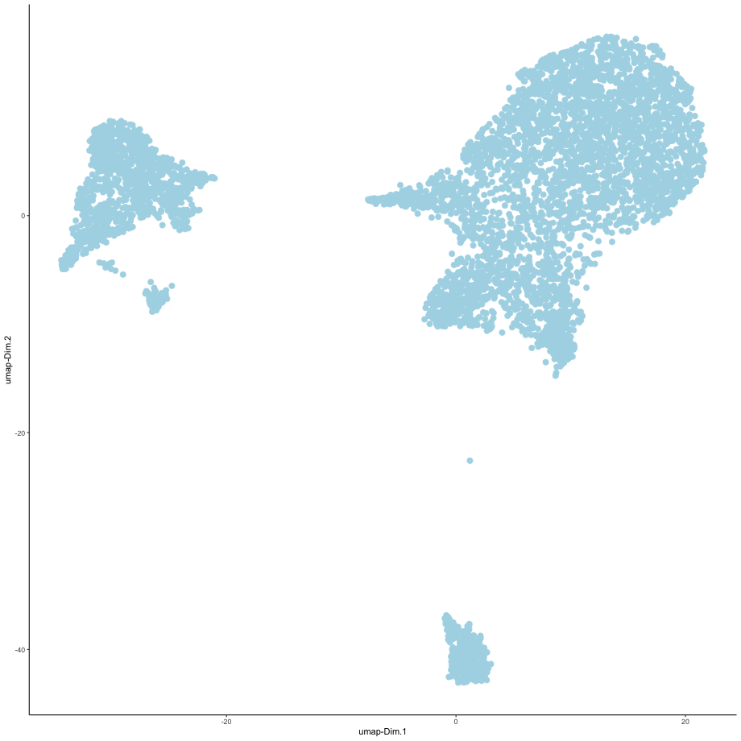{width=16cm} 


***

</details>

### 3. cluster

<details>
  <summary>Expand</summary>
  \ 
  
```{r eval=FALSE}
## sNN network (default)
Slide_test <- createNearestNetwork(gobject = Slide_test, dimensions_to_use = 1:9, k = 20)

## Leiden clustering
## 0.2 resolution
Slide_test <- doLeidenCluster(gobject = Slide_test, resolution = 0.2, n_iterations = 500,
                             name = 'leiden_0.2',
                             python_path = "/Users/rubendries/Bin/anaconda3/envs/py36/bin/python")

plotUMAP(gobject = Slide_test,
         cell_color = 'leiden_0.2', 
         point_size = 1.5,
         plot_method = "ggplot",
         show_NN_network = F, 
         edge_alpha = 0.05)
showClusterHeatmap(gobject = Slide_test, cluster_column = 'leiden_0.2')
showClusterDendrogram(Slide_test, cluster_column = 'leiden_0.2')
```

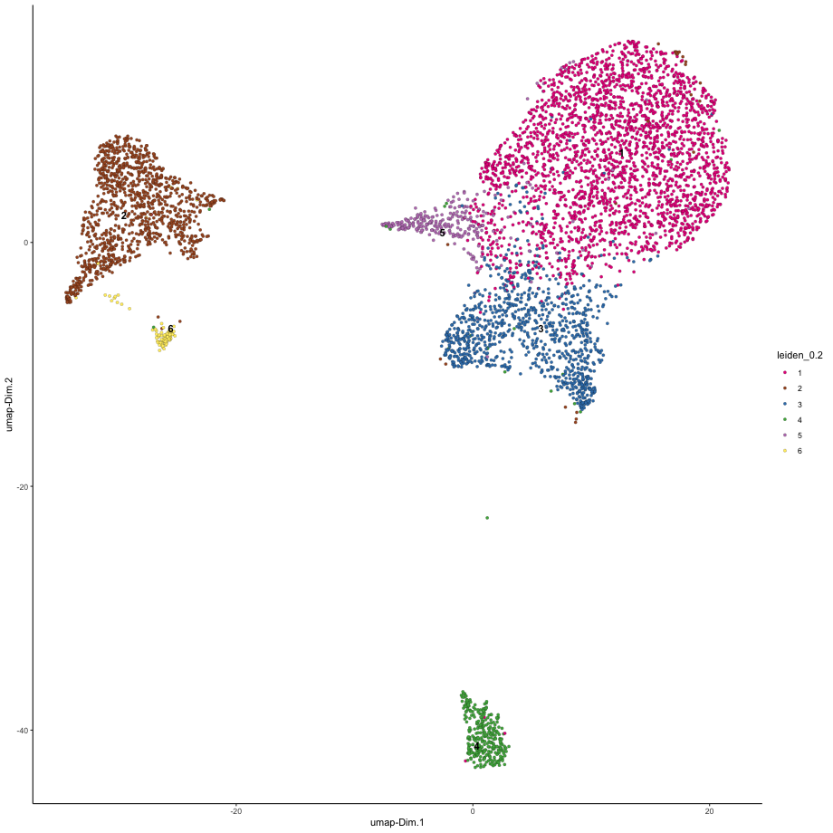{width=16cm} 

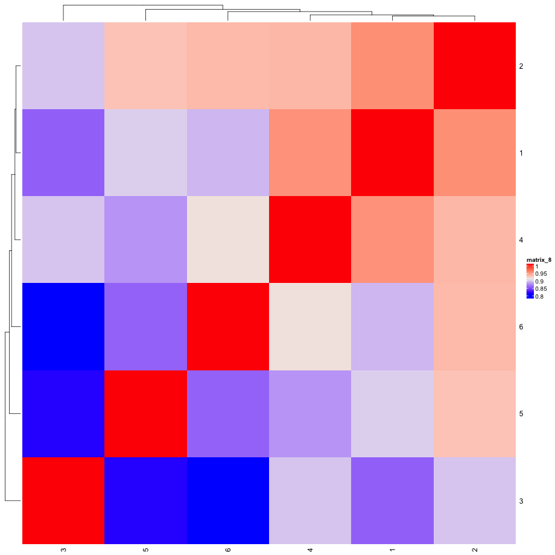{width=16cm} 

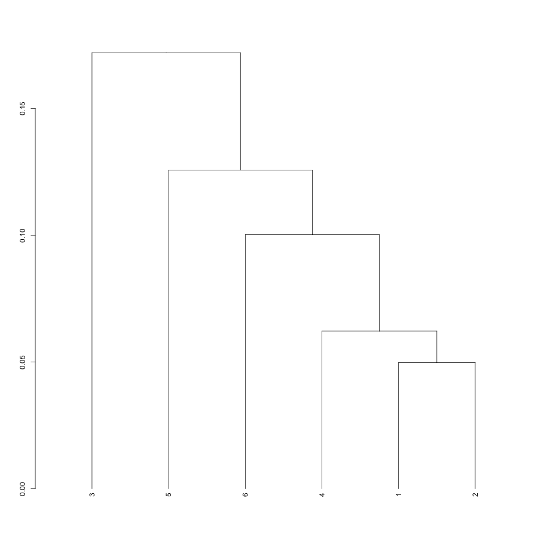{width=16cm} 

***

</details>


### 4. co-visualize ####
<details>
  <summary>Expand</summary>
  \ 
  
```{r eval=FALSE}
# co-visualization
visSpatDimPlot(gobject = Slide_test, plot_method = 'ggplot',
               sdimx = 'sdimx', sdimy = 'sdimy',
               cell_color = 'leiden_0.2',
               spatial_point_size = 1.5,
               dim_point_size = 1.5,
               show_NN_network = F)
```

Co-visualzation:
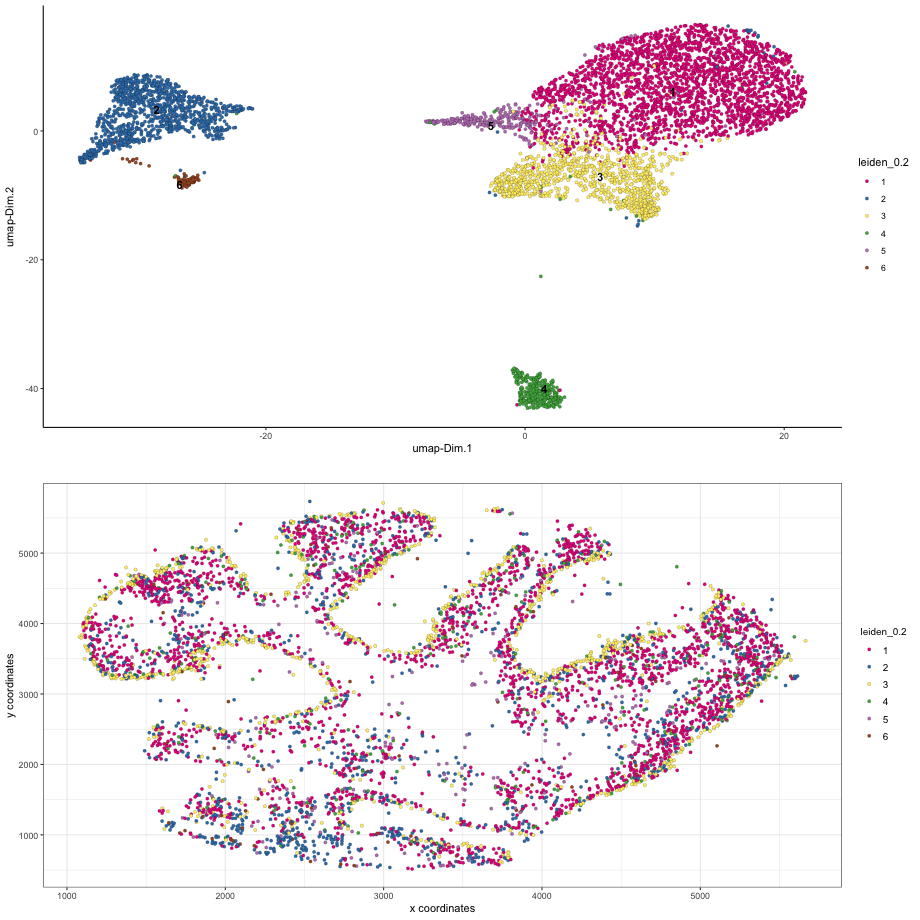{width=16cm} 


***

</details>


### 5. differential expression ####

<details>
  <summary>Expand</summary>
  \
  
```{r eval=FALSE}
# markers with scran
markers_scran = findMarkers_one_vs_all(gobject = Slide_test,
                                 method = 'scran',
                                 expression_values = 'normalized',
                                 cluster_column = 'leiden_0.2',
                                 min_genes = 5, rank_score = 2)

# markers with gini
markers_gini = findMarkers_one_vs_all(gobject = Slide_test,
                                       method = 'gini',
                                       expression_values = 'normalized',
                                       cluster_column = 'leiden_0.2',
                                       min_genes = 5, rank_score = 2)

# cluster heatmap with combined markers
markergenes_scran = unique(markers_scran[, head(.SD, 4), by = 'cluster_ID'][['gene_ID']])
markergenes_gini = unique(markers_gini[, head(.SD, 4), by = 'cluster'][['genes']])

plotMetaDataHeatmap(Slide_test,
                    selected_genes = unique(c(markergenes_scran, markergenes_gini)),
                    expression_values = 'scaled',
                    metadata_cols = c('leiden_0.2'))
```

cluster heatmap:
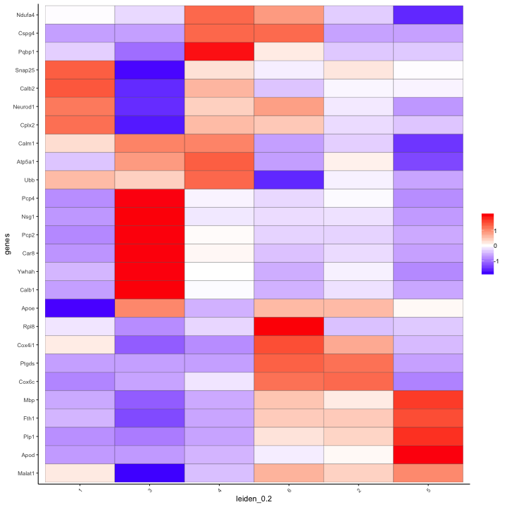{width=16cm} 


***

</details>


### 6. cell-type annotation

<details>
  <summary>Expand</summary>
  \
  
```{r eval=FALSE}
## create vector with names
clusters_cerebellum = c('Granule', 'Oligo', 'Purkinje', 'Astrocyte', 'Oligo_mature', 'OPC')
names(clusters_cerebellum) = 1:6
Slide_test = annotateGiotto(gobject = Slide_test, annotation_vector = clusters_cerebellum,
                          cluster_column = 'leiden_0.2', name = 'cell_types')

# all cell types
visSpatDimPlot(gobject = Slide_test, cell_color = 'cell_types', sdimx = 'sdimx', sdimy = 'sdimy',
               dim_point_size = 2, spatial_point_size = 2)

# only Granule cells
visSpatDimPlot(gobject = Slide_test, plot_method = 'ggplot',
               sdimx = 'sdimx', sdimy = 'sdimy',
               cell_color = 'cell_types',
               spatial_point_size = 1.5,
               dim_point_size = 1.5,
               show_NN_network = F,
               select_cell_groups = c('Granule'))

# only Purkinje cells
visSpatDimPlot(gobject = Slide_test, plot_method = 'ggplot',
               sdimx = 'sdimx', sdimy = 'sdimy',
               cell_color = 'cell_types',
               spatial_point_size = 1.5,
               dim_point_size = 1.5,
               show_NN_network = F,
               select_cell_groups = c('Purkinje'))

# only Oligodendrocytes
visSpatDimPlot(gobject = Slide_test, plot_method = 'ggplot',
               sdimx = 'sdimx', sdimy = 'sdimy',
               cell_color = 'cell_types',
               spatial_point_size = 1.5,
               dim_point_size = 1.5,
               show_NN_network = F,
               select_cell_groups = c('Oligo'))
```

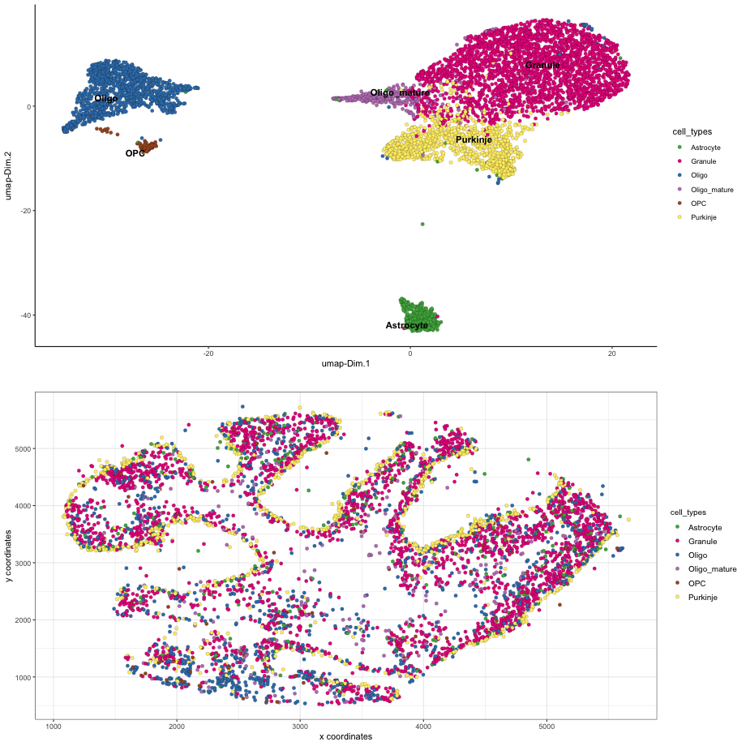{width=16cm} 
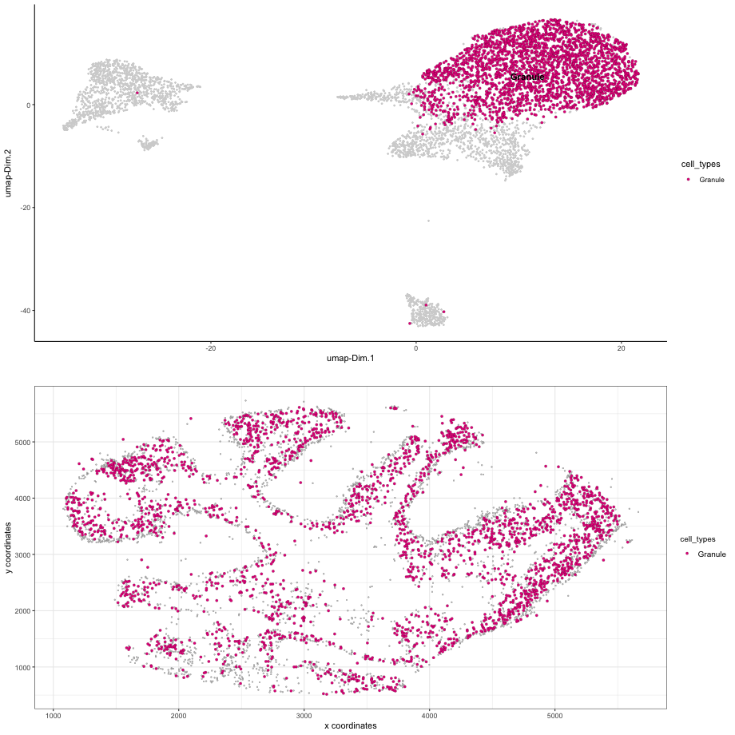{width=16cm} 
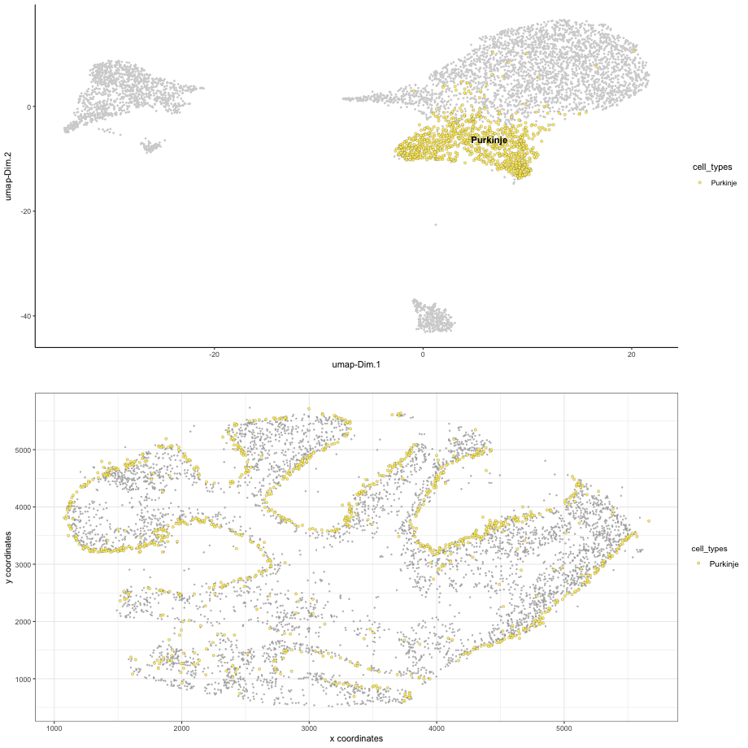{width=16cm} 
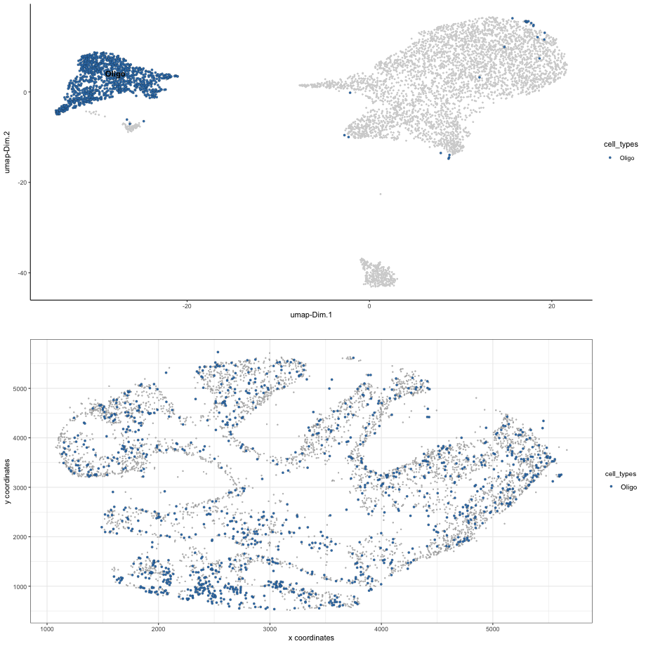{width=16cm} 


  
***

</details>


### 7. spatial grid ####

<details>
  <summary>Expand</summary>
  \
  
```{r eval=FALSE}
## spatial grid
Slide_test <- createSpatialGrid(gobject = Slide_test,
                              sdimx_stepsize = 200,
                              sdimy_stepsize = 200,
                              minimum_padding = 0)
visPlot(Slide_test, cell_color = 'cell_types', sdimx = 'sdimx', sdimy = 'sdimy',
        show_grid = T, grid_color = 'lightblue', spatial_grid_name = 'spatial_grid',
        point_size = 1.5, plot_method = 'ggplot')

```

{width=16cm} 


```{r eval=FALSE}
#### spatial patterns ####
pattern_cerebellum = detectSpatialPatterns(gobject = Slide_test, 
                                    spatial_grid_name = 'spatial_grid',
                                    min_cells_per_grid = 5, 
                                    scale_unit = T, 
                                    PC_zscore = 1, 
                                    show_plot = T)

showPattern(pattern_cerebellum, dimension = 1,  plot_dim = 2, point_size = 4)
showPatternGenes(pattern_cerebellum, dimension = 1)

showPattern(pattern_cerebellum, dimension = 2,  plot_dim = 2, point_size = 4)
showPatternGenes(pattern_cerebellum, dimension = 2)
```

pattern 1:
{width=16cm} 

{width=16cm}  


pattern 2:
{width=10cm} 

{width=10cm} 
***  

</details>


### 8. spatial network ####

<details>
  <summary>Expand</summary>
  \
  
```{r eval=FALSE}
# network
Slide_test <- createSpatialNetwork(gobject = Slide_test, k = 5)
visPlot(gobject = Slide_test, show_network = T,
        sdimx = "sdimx",sdimy = "sdimy",
        network_color = 'blue', spatial_network_name = 'spatial_network',
        point_size = 1, cell_color = 'cell_types')
```

{width=16cm} 
  
```{r eval=FALSE}
# distance restricted
Slide_test <- createSpatialNetwork(gobject = Slide_test, k = 5, maximum_distance = 100, name = 'res_spatial_network')
visPlot(gobject = Slide_test, show_network = T,
        sdimx = "sdimx",sdimy = "sdimy",
        network_color = 'blue', spatial_network_name = 'res_spatial_network',
        point_size = 1, cell_color = 'cell_types')
```

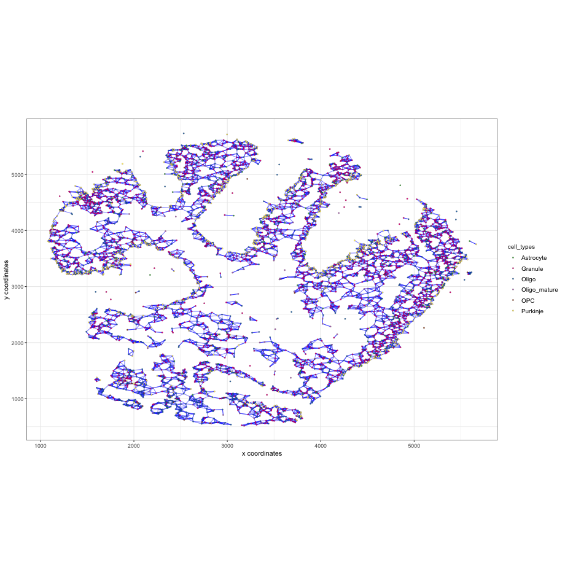{width=16cm} 

***  

</details>


### 9. spatial genes ####

<details>
  <summary>Expand</summary>
  \
  
```{r eval=FALSE}
ranktest = binGetSpatialGenes(Slide_test, bin_method = 'rank',
                              do_fisher_test = F, community_expectation = 5,
                              spatial_network_name = 'res_spatial_network', verbose = T)
ranktest[N > 100]
visGenePlot(Slide_test, plot_method = 'ggplot', expression_values = 'scaled',
            genes = c('Aldoc', 'Pcp4', 'Nnat'), point_size = 2,
            cow_n_col = 3, scale_alpha_with_expression = F,
            genes_high_color = 'red', genes_mid_color = 'white', genes_low_color = 'darkblue', midpoint = 0)
```

Spatial genes:  
{width=16cm} 


***

</details>


### 10. HMRF domains ####
<details>
  <summary>Expand</summary>
  \

Not available at this time.

***

</details>


### 11. Cell-cell preferential proximity 

<details>
  <summary>Expand</summary>
  \

{width=12cm}  

```{r eval=FALSE}
## calculate frequently seen proximities
cell_proximities = cellProximityEnrichment(gobject = Slide_test,
                                           cluster_column = 'cell_types',
                                           spatial_network_name = 'res_spatial_network',
                                           number_of_simulations = 200)

## barplot
cellProximityBarplot(CPscore = cell_proximities, min_orig_ints = 25, min_sim_ints = 25)
```
barplot:  
{width=16cm} 

```{r eval=FALSE}
## heatmap
cellProximityHeatmap(CPscore = cell_proximities, order_cell_types = T, scale = T,
                     color_breaks = c(-1.5, 0, 1.5), color_names = c('blue', 'white', 'red'))
```
heatmap:  
{width=16cm} 


```{r eval=FALSE}
## network
cellProximityNetwork(CPscore = cell_proximities)
```
networks:  
{width=16cm} 


```{r eval=FALSE}
## visualization
spec_interaction = "Oligo--OPC"

## heatmap
cellProximityVisPlot(gobject = Slide_test,
                     interaction_name = spec_interaction,
                     cluster_column = 'cell_types',
                     cell_color = 'cell_types', coord_fix_ratio = 0.5,
                     point_size_select = 4, point_size_other = 2)
```

{width=16cm} 


***

</details>


