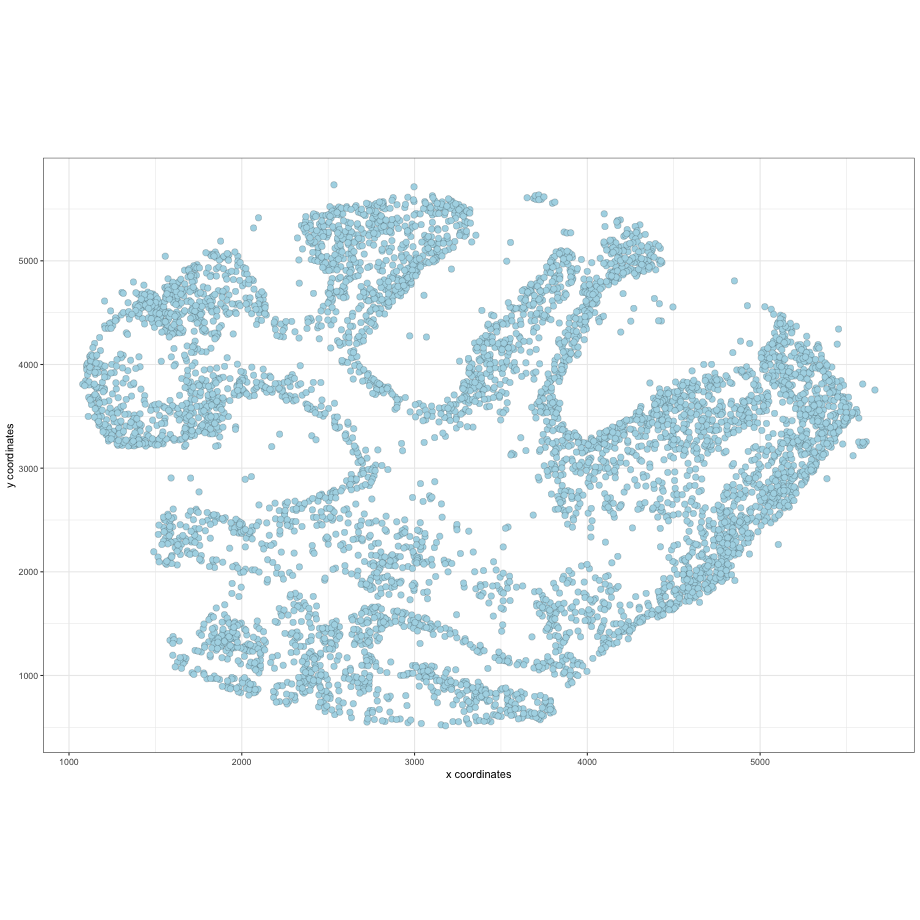

<!-- mouse_cortex_1_simple.md is generated from mouse_cortex_1_simple.Rmd Please edit that file -->

``` r
library(Giotto)
# this example works with Giotto v.0.1.2
```

### Data input

<details>

<summary>Expand</summary>  

[Rodrigues, Stickels et
al.](https://science.sciencemag.org/content/363/6434/1463) used
Slide-seq as a scalable technology to profile the cerebellum ast spatial
resolution.

 .

``` r
## select the directory where you have saved the osmFISH data
Slideseq_data_folder = '/Volumes/Ruben_Seagate/Dropbox/Projects/GC_lab/Ruben_Dries/190225_spatial_package/Data/Slideseq_data/Puck_180430_6/'
bead_positions <- fread(file = paste0(Slideseq_data_folder, '/', "BeadLocationsForR.csv"))
expr_matrix <- fread(paste0(Slideseq_data_folder, '/', "MappedDGEForR.csv"))
expr_mat = as.matrix(expr_matrix[,-1]);rownames(expr_mat) = expr_matrix$Row
```

-----

</details>

 

### 1\. Create Giotto object & process data

<details>

<summary>Expand</summary>  

``` r
Slide_test <- createGiottoObject(raw_exprs = expr_mat, spatial_locs = bead_positions[,.(xcoord, ycoord)])
filterDistributions(Slide_test, detection = 'genes', nr_bins = 100, scale_axis = 'log2')
filterDistributions(Slide_test, detection = 'cells', nr_bins = 100, scale_axis = 'log2')
filterCombinations(Slide_test, expression_thresholds = c(1, 1), gene_det_in_min_cells = c(10, 20), min_det_genes_per_cell = c(100, 200))

# spatial data before filtering
visPlot(gobject = Slide_test)

Slide_test <- filterGiotto(gobject = Slide_test,
                           gene_det_in_min_cells = 30,
                           min_det_genes_per_cell = 150)

# remove mt-genes and blood genes (contamination)
non_mito_genes = grep(pattern = 'mt-', Slide_test@gene_ID, value = T, invert = T)
non_mito_or_blood_genes = grep(pattern = 'Hb[ab]', non_mito_genes, value = T, invert = T)

Slide_test = subsetGiotto(gobject = Slide_test, gene_ids = non_mito_or_blood_genes)

## normalize & adjust
Slide_test <- normalizeGiotto(gobject = Slide_test, scalefactor = 10000, verbose = T)
Slide_test <- addStatistics(gobject = Slide_test)
Slide_test <- adjustGiottoMatrix(gobject = Slide_test, expression_values = c('normalized'),
                                batch_columns = NULL, covariate_columns = c('nr_genes', 'total_expr'),
                                return_gobject = TRUE,
                                update_slot = c('custom'))

# spatial data after filtering
visPlot(gobject = Slide_test)
```

Slide-seq data before filter steps: 

Slide-seq data after filter steps: 
