<!-- mouse_cortex_1_simple.md is generated from mouse_cortex_1_simple.Rmd Please edit that file -->

``` r
library(Giotto)
# this example works with Giotto v.0.1.2
```

### Data input

<details>

<summary>Expand</summary>  

[Rodrigues, Stickels et
al.](https://science.sciencemag.org/content/363/6434/1463) used
Slide-seq as a scalable technology to profile the cerebellum ast spatial
resolution.

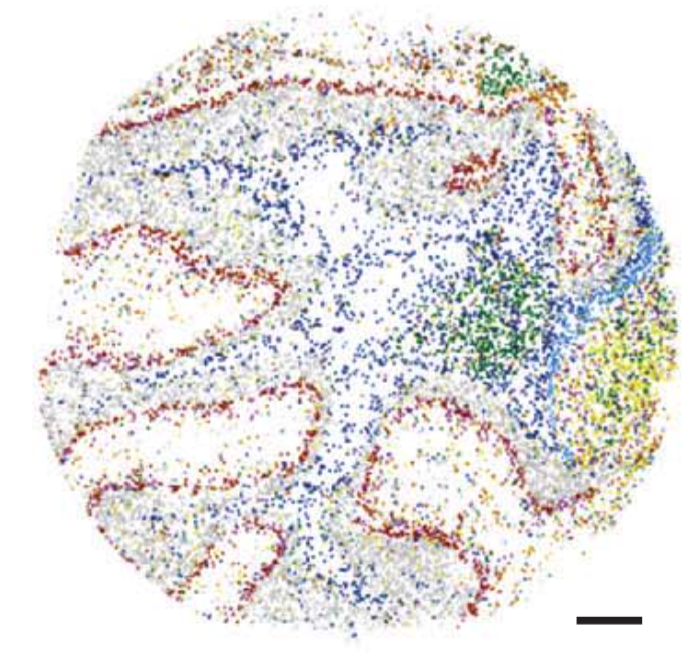 .

``` r
## select the directory where you have saved the osmFISH data
Slideseq_data_folder = '/Volumes/Ruben_Seagate/Dropbox/Projects/GC_lab/Ruben_Dries/190225_spatial_package/Data/Slideseq_data/Puck_180430_6/'
bead_positions <- fread(file = paste0(Slideseq_data_folder, '/', "BeadLocationsForR.csv"))
expr_matrix <- fread(paste0(Slideseq_data_folder, '/', "MappedDGEForR.csv"))
expr_mat = as.matrix(expr_matrix[,-1]);rownames(expr_mat) = expr_matrix$Row
```

-----

</details>

### 1\. Create Giotto object & process data

<details>

<summary>Expand</summary>  

``` r
Slide_test <- createGiottoObject(raw_exprs = expr_mat, spatial_locs = bead_positions[,.(xcoord, ycoord)])
filterCombinations(Slide_test, expression_thresholds = c(1, 1), gene_det_in_min_cells = c(20, 20, 20), min_det_genes_per_cell = c(20, 32, 100))
```

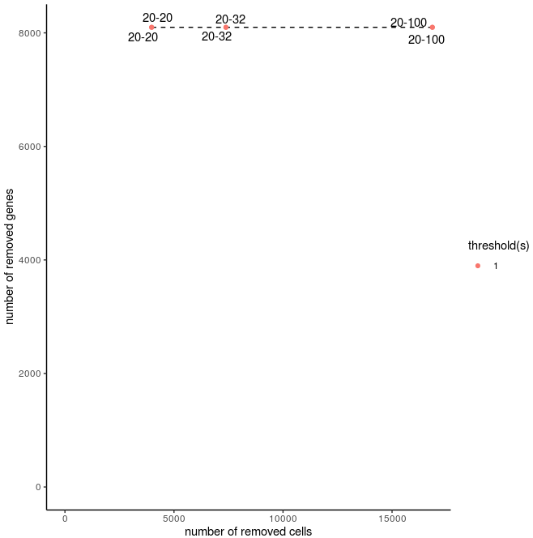


``` r
#slideseq before filtering
visPlot(gobject = Slide_test, point_size=0.5)
```

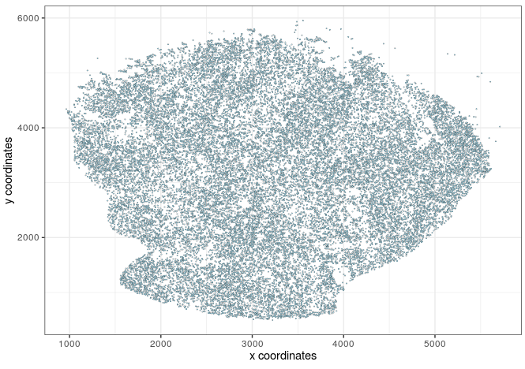

``` r
Slide_test<-filterGiotto(gobject=Slide_test, gene_det_in_min_cells=20, min_det_genes_per_cell=20)

# remove mt-genes and blood genes (contamination)
non_mito_genes = grep(pattern = 'mt-', Slide_test@gene_ID, value = T, invert = T)
non_mito_or_blood_genes = grep(pattern = 'Hb[ab]', non_mito_genes, value = T, invert = T)

Slide_test = subsetGiotto(gobject = Slide_test, gene_ids = non_mito_or_blood_genes)

#slideseq after filtering
visPlot(gobject = Slide_test, point_size=0.5)
```

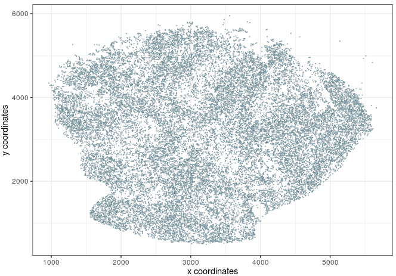

``` r
dim(Slide_test@raw_exprs)
Slide_test <- normalizeGiotto(gobject = Slide_test, scalefactor = 10000, verbose = T)
Slide_test <- addStatistics(gobject = Slide_test)
Slide_test <- calculateHVG(gobject = Slide_test, method = 'cov_groups', zscore_threshold = 0.5, nr_expression_groups = 10)
```
Highly variable genes 
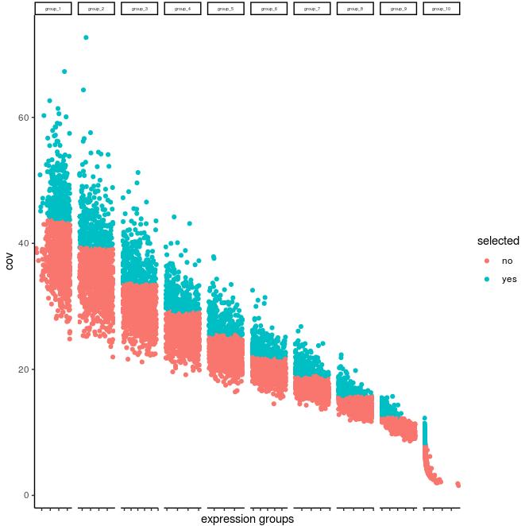


``` r
gene_metadata = fDataDT(Slide_test)

#filter by HVG
featgenes = gene_metadata[hvg == 'yes' & perc_cells > 0.5 & mean_expr_det > 1]$gene_ID
featgenes
featgenes = gene_metadata[hvg == 'yes']$gene_ID
featgenes

#adjust matrix to make sure technical artifacts (library size, total_expr) are removed
Slide_test <- adjustGiottoMatrix(gobject = Slide_test, expression_values = c('normalized'), batch_columns = NULL, covariate_columns = c('nr_genes', 'total_expr'),  return_gobject = TRUE, update_slot = c('custom'))

#Run PCA analysis
Slide_test <- runPCA(gobject = Slide_test, expression_values = 'custom', genes_to_use = featgenes, scale_unit = F)
signPCA(Slide_test, genes_to_use = featgenes, scale_unit = F, scree_ylim = c(0,0.3))
plotPCA(gobject=Slide_test)
```

 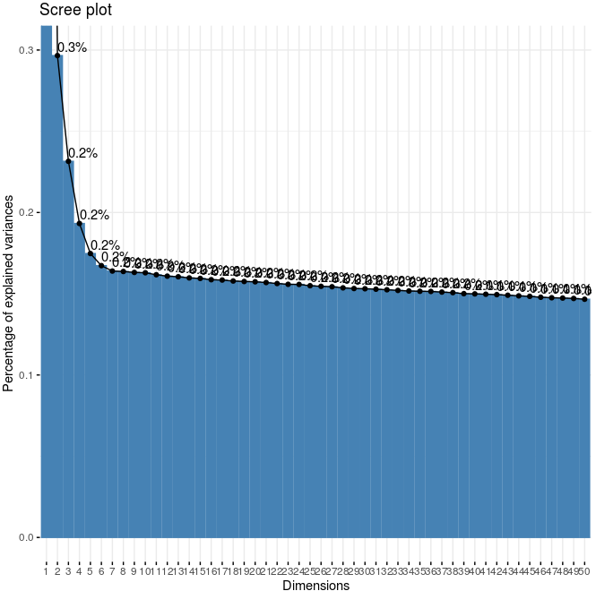

``` r
#run UMAP
Slide_test <- runUMAP(Slide_test, dimensions_to_use=1:9, n_components=2)
plotUMAP(gobject=Slide_test, point_size=1)
```

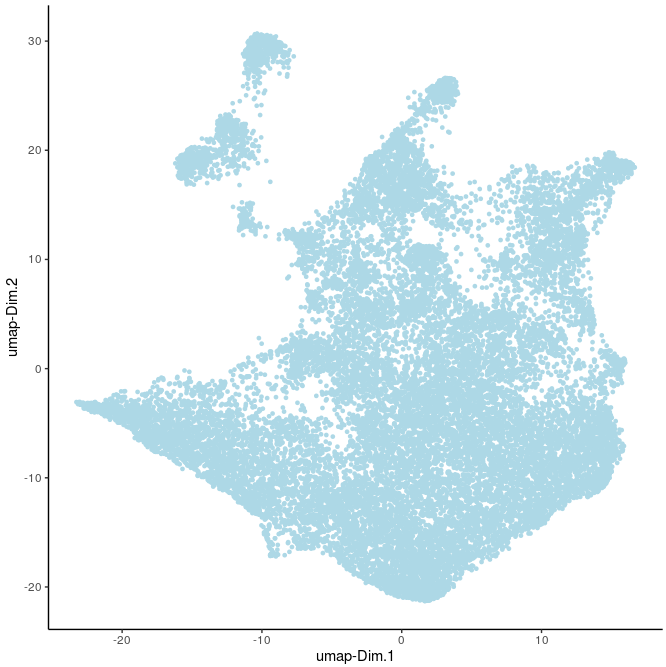

-----

</details>

### 3\. Clustering and differential expression 

<details>

<summary>Expand</summary>  

``` r
## sNN network (default)
Slide_test <- createNearestNetwork(gobject = Slide_test, dimensions_to_use = 1:9, k = 20)

## Leiden clustering
## 0.5 resolution
Slide_test<-doLeidenCluster(gobject=Slide_test, resolution=0.5, n_iterations=10, name="leiden", python_path="/n/app/python/3.6.0/bin/python3")

plotUMAP(gobject=Slide_test, cell_color="leiden", point_size=1, plot_method="ggplot")
```


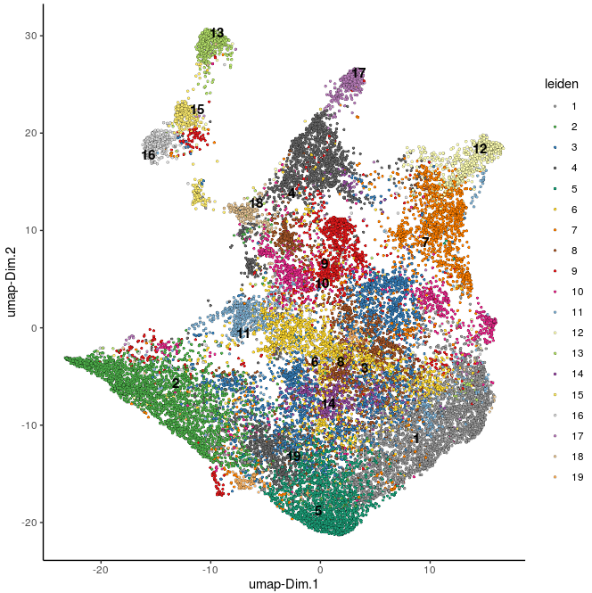

``` r
#find markers per cluster
markers_scarn=findMarkers_one_vs_all(gobject=Slide_test, method="scran", expression_values="normalized", cluster_column="leiden", min_genes=5)
markergenes_scran = unique(markers_scarn[, head(.SD, 8), by="cluster_ID"][["gene_ID"]])
plotMetaDataHeatmap(Slide_test, expression_values="normalized", metadata_cols=c("leiden"), selected_genes=markergenes_scran)
```

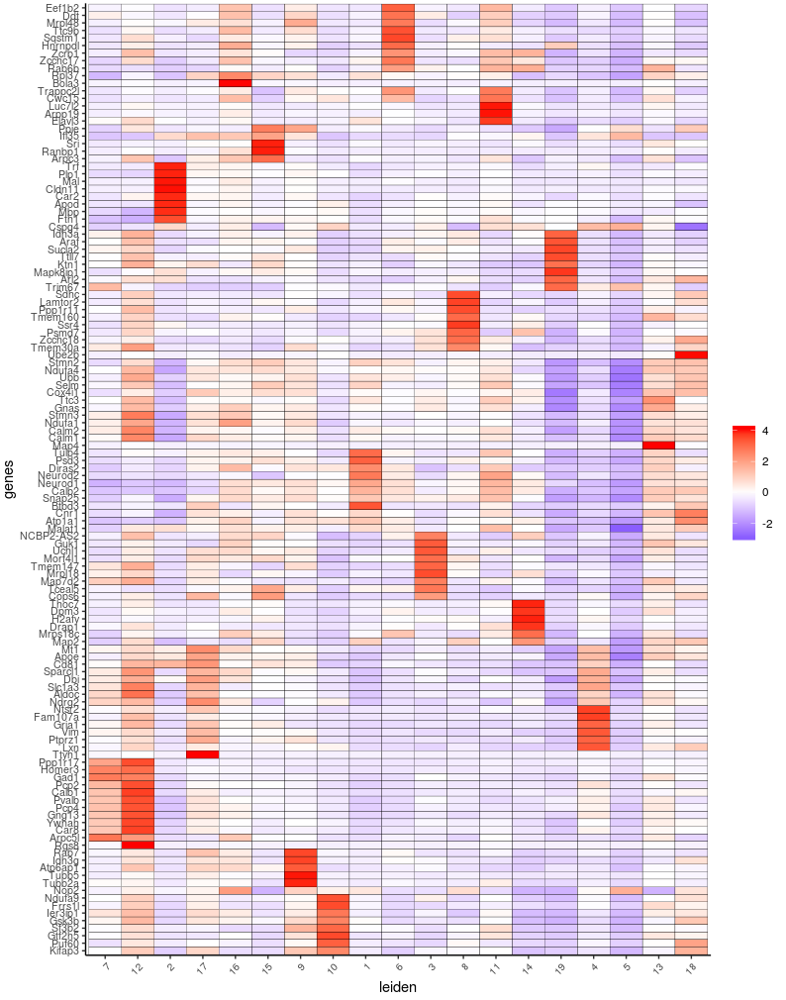

``` r
plotMetaDataHeatmap(Slide_test, expression_values="custom", metadata_cols=c("leiden"), selected_genes=markergenes_scran)
```
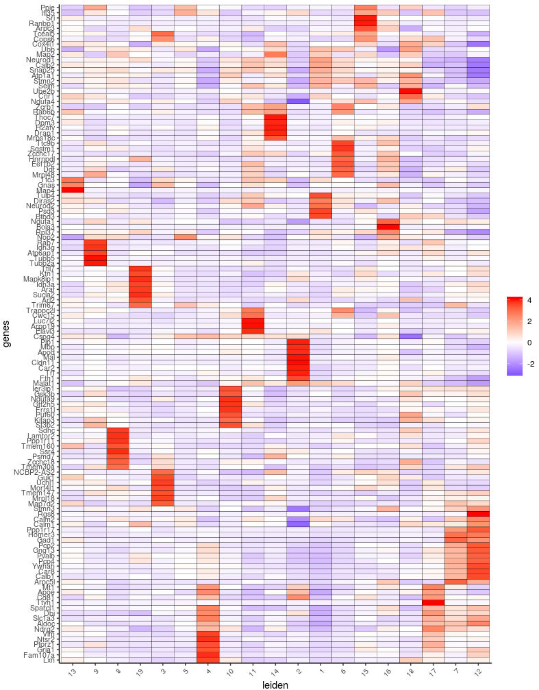

-----

</details>

### 4\. Co-visualize

<details>

<summary>Expand</summary>  

``` r
#not available
```

-----

</details>


### 6\. Cell-type annotation

<details>

<summary>Expand</summary>  

``` r
#not available at this time
```
-----

</details>

### 7\. Spatial grid

<details>

<summary>Expand</summary>  

``` r
## Spatial grid
Slide_test <- createSpatialGrid(gobject = Slide_test,
                              sdimx_stepsize = 200,
                              sdimy_stepsize = 200,
                              minimum_padding = 0)
visPlot(Slide_test, cell_color = 'cell_types', sdimx = 'sdimx', sdimy = 'sdimy',
        show_grid = T, grid_color = 'lightblue', spatial_grid_name = 'spatial_grid',
        point_size = 1.5, plot_method = 'ggplot')
```

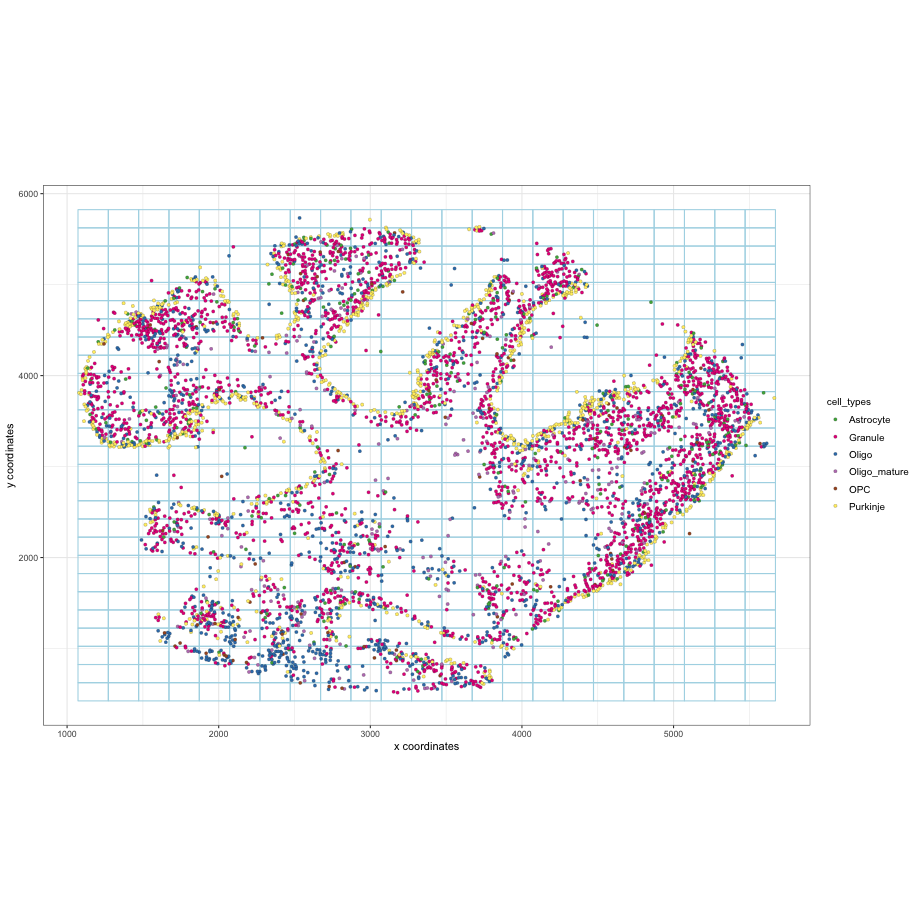

``` r
#### spatial patterns ####
pattern_cerebellum = detectSpatialPatterns(gobject = Slide_test, 
                                    spatial_grid_name = 'spatial_grid',
                                    min_cells_per_grid = 5, 
                                    scale_unit = T, 
                                    PC_zscore = 1, 
                                    show_plot = T)

showPattern(pattern_cerebellum, dimension = 1,  plot_dim = 2, point_size = 4)
showPatternGenes(pattern_cerebellum, dimension = 1)

showPattern(pattern_cerebellum, dimension = 2,  plot_dim = 2, point_size = 4)
showPatternGenes(pattern_cerebellum, dimension = 2)
```

pattern 1: 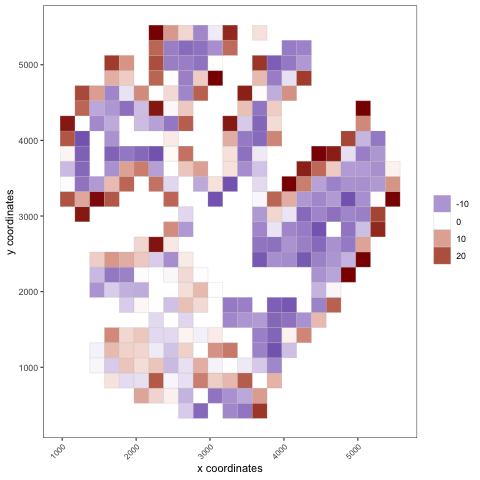

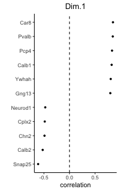

pattern 2: 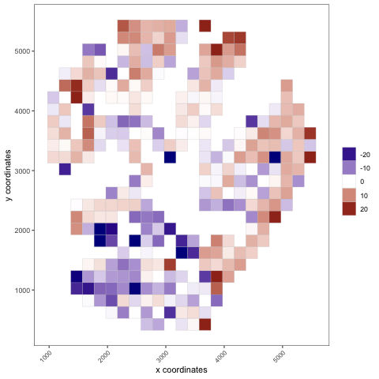

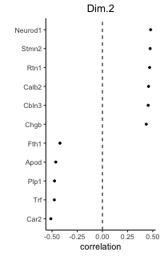 \*\*\*

</details>

### 8\. Spatial network

<details>

<summary>Expand</summary>  

``` r
# network
Slide_test<-createSpatialNetwork(gobject=Slide_test, k=7, maximum_distance=100, minimum_k=1)
visPlot(gobject=Slide_test, show_network=T, sdimx="sdimx", sdimy="sdimy", point_size=1, network_color="blue")
```

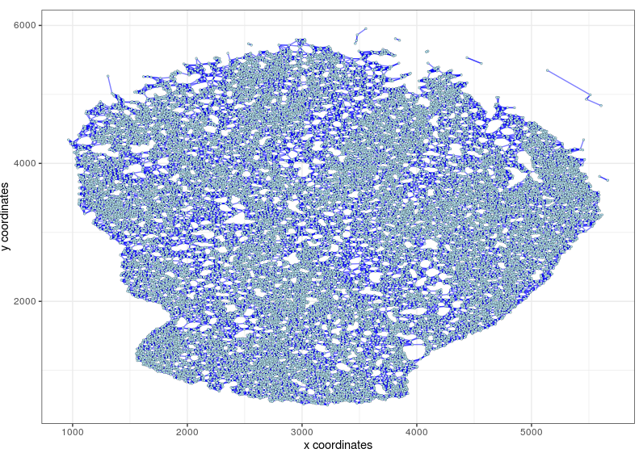


-----

</details>

### 9\. Spatial genes

<details>

<summary>Expand</summary>  

``` r
spatial_genes<-calculate_spatial_genes_python(gobject=Slide_test, expression_values="scaled", python_path="/n/app/python/3.6.0/bin/python3", rbp_p=0.99, examine_top=0.1)

spatial_genes_0_95<-calculate_spatial_genes_python(gobject=Slide_test, expression_values="scaled", python_path="/n/app/python/3.6.0/bin/python3", rbp_p=0.95, examine_top=0.1)

visGenePlot(Slide_test, plot_method = 'ggplot', expression_values = 'scaled',
            genes = c('Aldoc', 'Pcp4', 'Nnat'), point_size = 2,
            cow_n_col = 3, scale_alpha_with_expression = F,
            genes_high_color = 'red', genes_mid_color = 'white', genes_low_color = 'darkblue', midpoint = 0)
```

Spatial genes:  
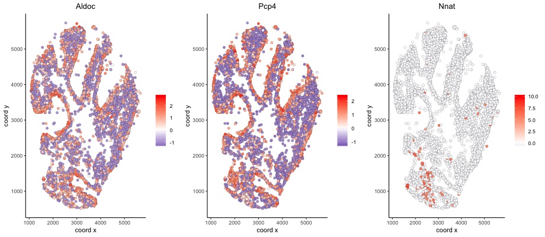

-----

</details>

### 10\. HMRF domains

<details>

<summary>Expand</summary>  

Not available at this time.

-----

</details>

### 11\. Cell-cell preferential proximity

<details>

<summary>Expand</summary>  


``` r
## calculate frequently seen proximities
cell_proximities = cellProximityEnrichment(gobject = Slide_test,
                                           cluster_column = 'cell_types',
                                           spatial_network_name = 'res_spatial_network',
                                           number_of_simulations = 200)

## barplot
cellProximityBarplot(CPscore = cell_proximities, min_orig_ints = 25, min_sim_ints = 25)
```

barplot:  
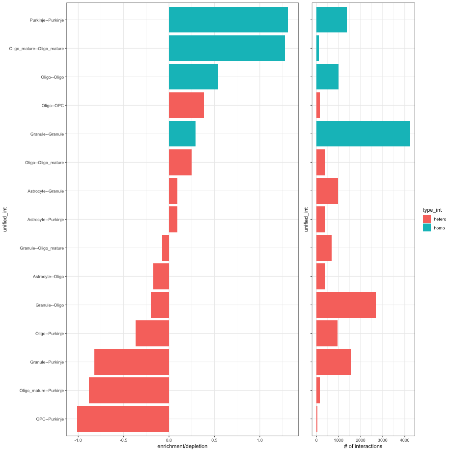

``` r
## heatmap
cellProximityHeatmap(CPscore = cell_proximities, order_cell_types = T, scale = T,
                     color_breaks = c(-1.5, 0, 1.5), color_names = c('blue', 'white', 'red'))
```

heatmap:  
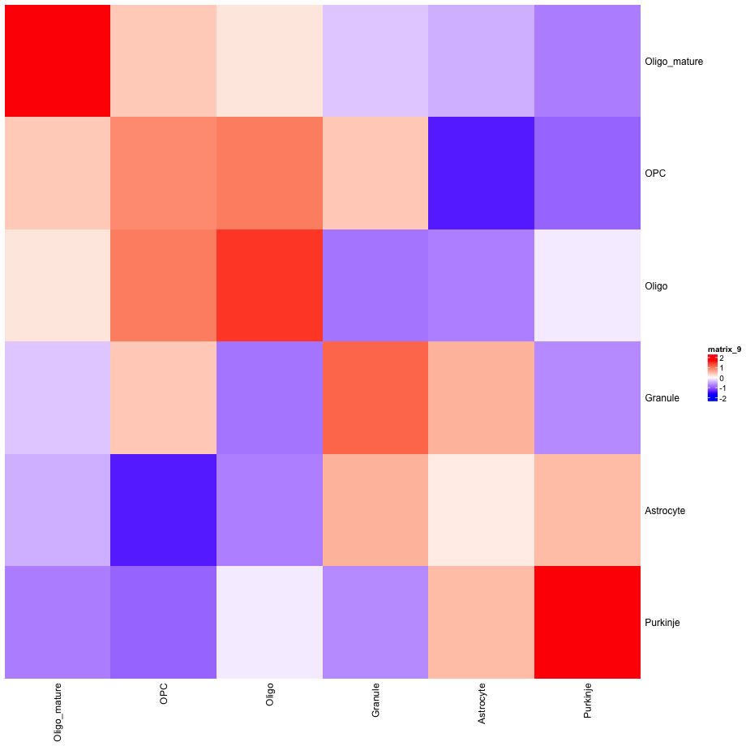

``` r
## network
cellProximityNetwork(CPscore = cell_proximities)
```

networks:  
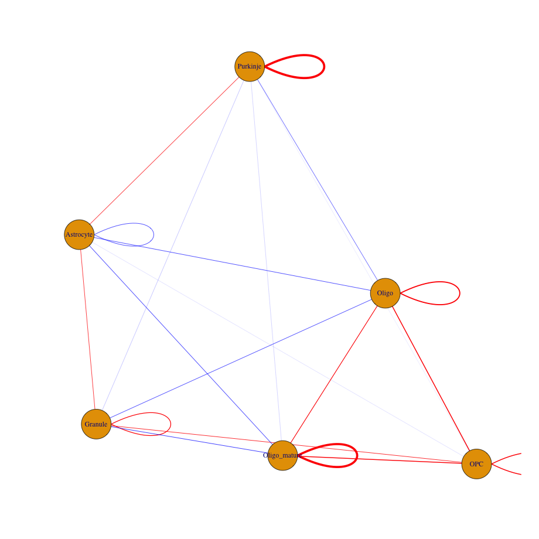

``` r
## visualization
spec_interaction = "Oligo--OPC"

## heatmap
cellProximityVisPlot(gobject = Slide_test,
                     interaction_name = spec_interaction,
                     cluster_column = 'cell_types',
                     cell_color = 'cell_types', coord_fix_ratio = 0.5,
                     point_size_select = 4, point_size_other = 2)
```


-----

</details>
