<!-- mouse_cortex_1_simple.md is generated from mouse_cortex_1_simple.Rmd Please edit that file -->

``` r
library(Giotto)
# this example works with Giotto v.0.1.2
```

### Data input

<details>

<summary>Expand</summary>  

[Wang et al.](https://science.sciencemag.org/content/361/6400/eaat5691)
created a 3D spatial expression dataset consisting of 28 genes from
32,845 single cells acquired over multiple rounds in visual cortex
STARmap volumes.

 .

``` r
STARMAP_data_folder = '/Volumes/Ruben_Seagate/Dropbox/Projects/GC_lab/Ruben_Dries/190225_spatial_package/Data/Starmap_data/'
expr = read.table(paste0(STARMAP_data_folder, '/', 'STARmap_3D_data_expression.txt'))
cell_loc = read.table(paste0(STARMAP_data_folder, '/', 'STARmap_3D_data_cell_locations.txt'))
```

-----

</details>

### 1\. Create Giotto object & process data

<details>

<summary>Expand</summary>  

``` r
# create
STAR_test <- createGiottoObject(raw_exprs = expr, spatial_locs = cell_loc)

# check distributions, test different thresholds and filter
filterDistributions(STAR_test, detection = 'genes', show_plot = F)
filterDistributions(STAR_test, detection = 'cells', show_plot = F)
filterCombinations(STAR_test,
                   expression_thresholds = c(1, 2),
                   gene_det_in_min_cells = c(20000, 30000),
                   min_det_genes_per_cell = c(20, 25))
STAR_test <- filterGiotto(gobject = STAR_test,
                          gene_det_in_min_cells = 20000,
                          min_det_genes_per_cell = 20)

## normalize & adjust
STAR_test <- normalizeGiotto(gobject = STAR_test, scalefactor = 10000, verbose = T)
STAR_test <- addStatistics(gobject = STAR_test)
STAR_test <- adjustGiottoMatrix(gobject = STAR_test, expression_values = c('normalized'),
                                batch_columns = NULL, covariate_columns = c('nr_genes', 'total_expr'),
                                return_gobject = TRUE,
                                update_slot = c('custom'))
```

Data can be presented in 3D for both the spatial (if captured in 3D) and
expression space. Output is generated by plotly and can be saved as an
html widget as show belown. These html widgets can be opened again in
any browser for further exploration and to generate static figures. For
this example we will only present static figures for each interactive 3D
plot.

``` r
real_3D = visPlot(gobject = STAR_test,
                  sdimx = "sdimx", sdimy = "sdimy", sdimz = "sdimz",
                  point_size = 1, axis_scale = "real", z_ticks = 2)
htmlwidgets::saveWidget(plotly::as_widget(real_3D), file = paste0(gobject_folder,'/', 'starmap_real_3D.html'))

cube_3D = visPlot(gobject = STAR_test,
                  sdimx = "sdimx", sdimy = "sdimy", sdimz = "sdimz",
                  point_size = 1, axis_scale = "cube", z_ticks = 2)
htmlwidgets::saveWidget(plotly::as_widget(cube_3D), file = paste0(gobject_folder,'/', 'starmap_cube_3D.html'))
```

Real scale 3D image: 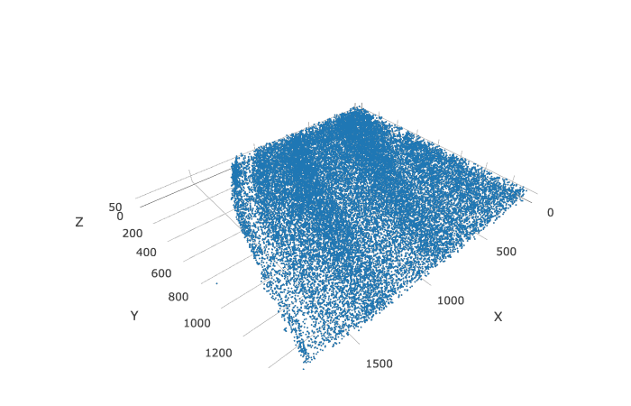

Cube scale 3D image: 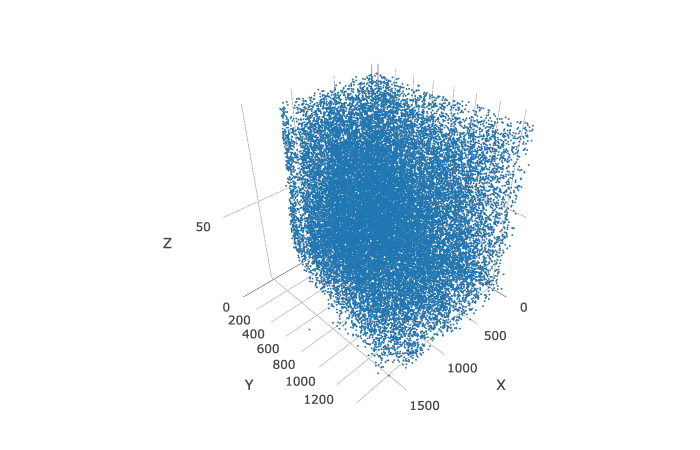

-----

</details>

### 2\. dimension reduction

<details>

<summary>Expand</summary>  

``` r
STAR_test <- calculateHVG(gobject = STAR_test, method = 'cov_groups', zscore_threshold = 0.5, nr_expression_groups = 3)
# use all genes (= default)
STAR_test <- runPCA(gobject = STAR_test, genes_to_use = NULL, scale_unit = F)
signPCA(STAR_test)
STAR_test <- runUMAP(STAR_test, dimensions_to_use = 1:8, n_components = 3, n_threads = 4)
```

-----

</details>

### 3\. cluster

<details>

<summary>Expand</summary>  

``` r

## sNN network (default)
STAR_test <- createNearestNetwork(gobject = STAR_test, dimensions_to_use = 1:8, k = 15)
## Leiden clustering
STAR_test <- doLeidenCluster(gobject = STAR_test, resolution = 0.2, n_iterations = 1000,
                             name = 'leiden_0.2',
                             python_path = "/Users/rubendries/Bin/anaconda3/envs/py36/bin/python")
```

``` r
STAR_UMAP <- plotUMAP(gobject = STAR_test, cell_color = 'leiden_0.2', 
                      point_size = 1.5,
                      plot_method = "plotly",
                      show_NN_network = T, 
                      edge_alpha = 0.05,
                      dim1_to_use = 1,
                      dim2_to_use = 2,
                      dim3_to_use = 3)
htmlwidgets::saveWidget(plotly::as_widget(STAR_UMAP), file = paste0(cluster_folder,'/', 'cluster_UMAP.html'))
```

3D UMAP plot: 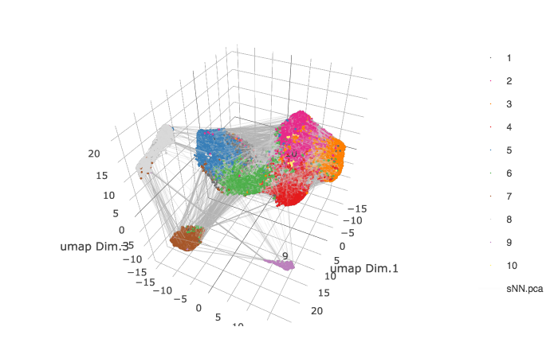

-----

</details>

### 4\. co-visualize

<details>

<summary>Expand</summary>  

``` r
coPlot = visSpatDimPlot(gobject = STAR_test,
                        cell_color = 'leiden_0.2',
                        dim3_to_use = 3,
                        sdimz = "sdimz",
                        axis_scale = "real",
                        z_ticks = 2,
                        dim_point_size = 1,
                        spatial_point_size = 1,
                        show_NN_network = F)
htmlwidgets::saveWidget(plotly::as_widget(coPlot), file = paste0(covis_folder,'/', 'coPlot.html'))
```

Co-visualzation: 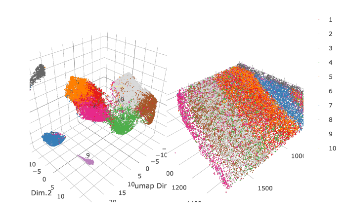

-----

</details>

### 5\. differential expression

<details>

<summary>Expand</summary>  

``` r
markers = findMarkers_one_vs_all(gobject = STAR_test,
                                 method = 'gini',
                                 expression_values = 'normalized',
                                 cluster_column = 'leiden_0.2',
                                 min_genes = 5, rank_score = 2)
markers[, head(.SD, 4), by = 'cluster']


# violinplot
violinPlot(STAR_test, genes = unique(markers$genes), cluster_column = 'leiden_0.2')

# individual genes and cells heatmap
plotHeatmap(STAR_test, genes = STAR_test@gene_ID, cluster_column = 'leiden_0.2',
            legend_nrows = 2, expression_values = 'scaled',
            cluster_order = 'correlation', gene_order = 'correlation', show_plot = F)

# individual genes and average cluster heatmap
plotMetaDataHeatmap(STAR_test, expression_values = 'scaled',
                    metadata_cols = c('leiden_0.2'))
```

violinplot: 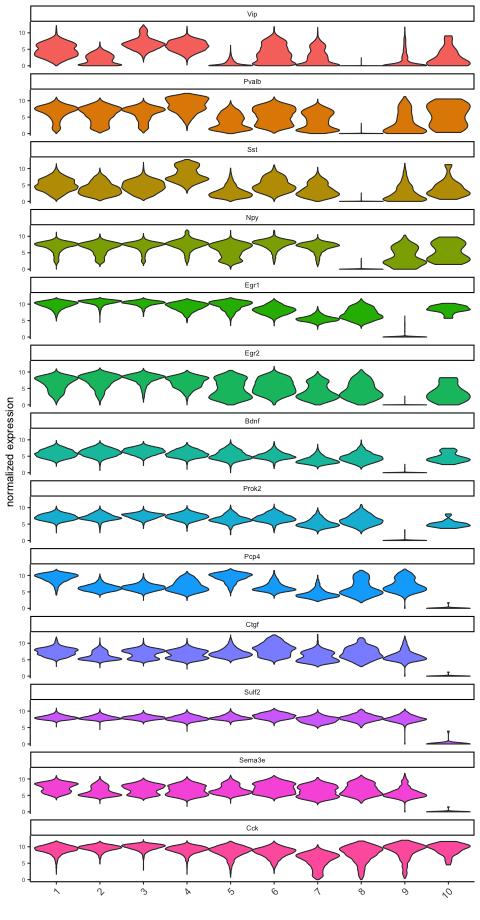

Heatmap cells: 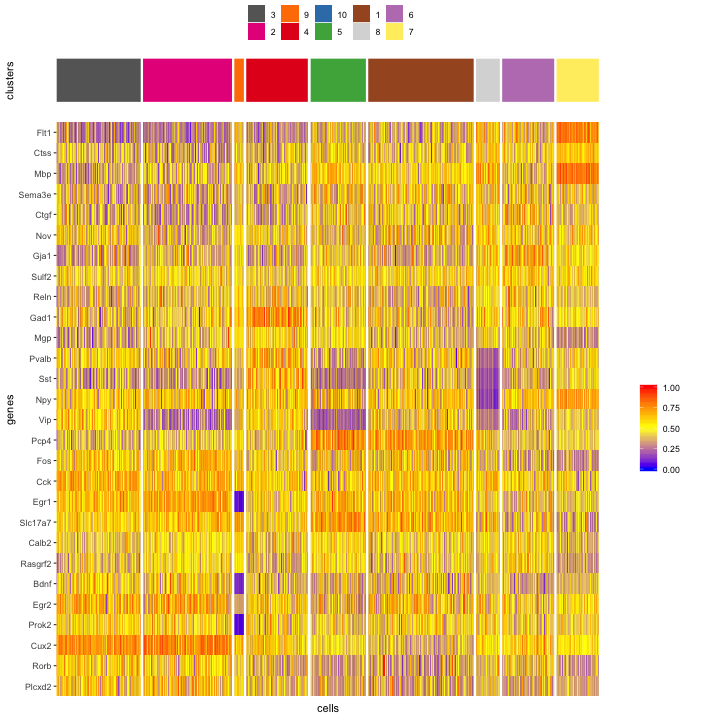

Heatmap clusters: 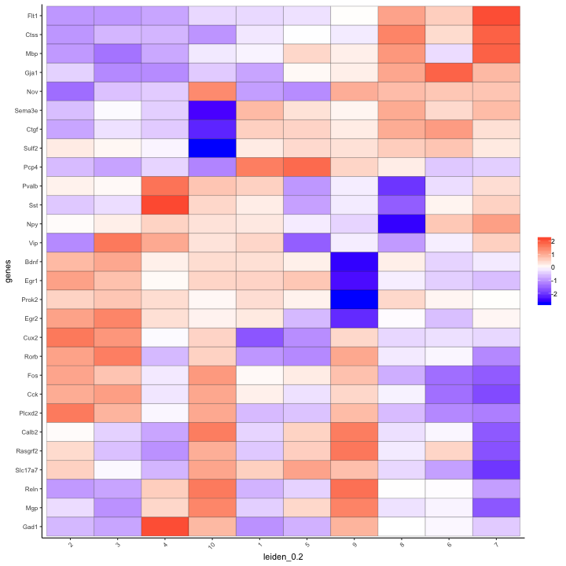

-----

</details>

### 6\. cell-type annotation

<details>

<summary>Expand</summary>  

``` r

## general cell types
clusters_cell_types_cortex = c('excit','excit','excit', 'inh', 'excit',
                               'other', 'other', 'other', 'inh', 'inh')
names(clusters_cell_types_cortex) = c(1:10)
STAR_test = annotateGiotto(gobject = STAR_test, annotation_vector = clusters_cell_types_cortex,
                           cluster_column = 'leiden_0.2', name = 'general_cell_types')

plotUMAP(STAR_test, plot_method = 'ggplot', cell_color = 'general_cell_types', point_size = 1.5)
plotMetaDataHeatmap(STAR_test, expression_values = 'scaled',
                    metadata_cols = c('general_cell_types'))
```

UMAP: 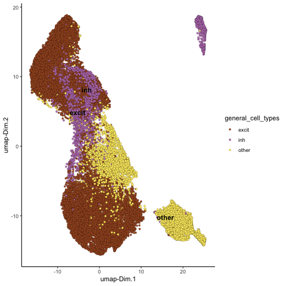

Heatmap: 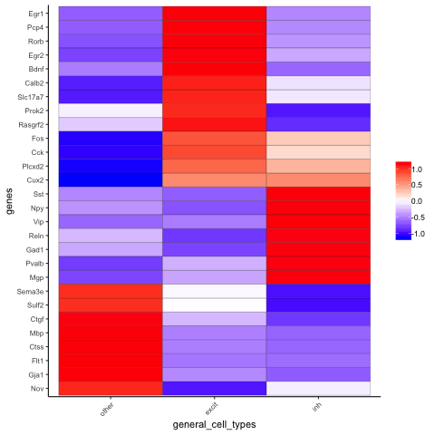

``` r
## detailed cell types
clusters_cell_types_cortex = c('L5','L4','L2/3', 'PV', 'L6',
                               'Astro', 'Olig1', 'Olig2', 'Calretinin', 'SST')
names(clusters_cell_types_cortex) = c(1:10)
STAR_test = annotateGiotto(gobject = STAR_test, annotation_vector = clusters_cell_types_cortex,
                         cluster_column = 'leiden_0.2', name = 'cell_types')


plotUMAP(STAR_test, plot_method = 'ggplot', cell_color = 'cell_types', point_size = 1.5)
plotMetaDataHeatmap(STAR_test, expression_values = 'scaled',
                    metadata_cols = c('cell_types'))
```

UMAP: 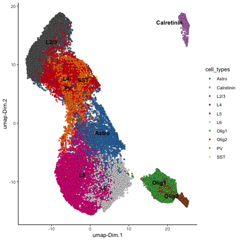

Heatmap: 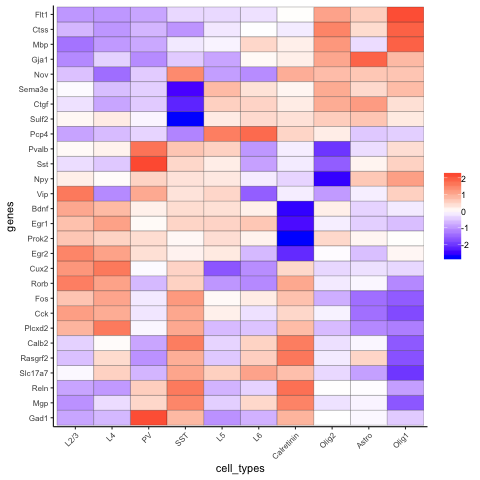

``` r
# create consistent color code
mynames = unique(pDataDT(STAR_test)$cell_types)
mycolorcode = Giotto:::getDistinctColors(n = 10)
names(mycolorcode) = mynames

## all cell types
realCellTypes =  visPlot(STAR_test, cell_color = 'cell_types', axis_scale = 'real',
                         sdimx = 'sdimx', sdimy = 'sdimy', sdimz = 'sdimz',
                         show_grid = F, cell_color_code = mycolorcode)
htmlwidgets::saveWidget(plotly::as_widget(realCellTypes), file = paste0(annotation_folder,'/', 'realCellTypes.html'))

## excitatory neurons
excit = visPlot(STAR_test, cell_color = 'cell_types', plot_method = 'plotly',
        sdimx = 'sdimx', sdimy = 'sdimy', sdimz = 'sdimz', axis_scale = 'real',
        select_cell_groups = c('L6','L5','L4','L2/3'),
        show_grid = F, cell_color_code = mycolorcode)
htmlwidgets::saveWidget(plotly::as_widget(excit), file = paste0(annotation_folder,'/', 'realCellTypes_excit.html'))

## inhibitory neurons
inhib = visPlot(STAR_test, cell_color = 'cell_types', plot_method = 'plotly',
        sdimx = 'sdimx', sdimy = 'sdimy', sdimz = 'sdimz', axis_scale = 'real',
        select_cell_groups = c('PV','Calretinin', 'SST'),
        show_grid = F, cell_color_code = mycolorcode)
htmlwidgets::saveWidget(plotly::as_widget(inhib), file = paste0(annotation_folder,'/', 'realCellTypes_inh.html'))

## other cell types
other = visPlot(STAR_test, cell_color = 'cell_types', plot_method = 'plotly',
        sdimx = 'sdimx', sdimy = 'sdimy', sdimz = 'sdimz', axis_scale = 'real',
        select_cell_groups = c('Astro', 'Olig1', 'Olig2'),
        show_grid = F, cell_color_code = mycolorcode)
htmlwidgets::saveWidget(plotly::as_widget(other), file = paste0(annotation_folder,'/', 'realCellTypes_other.html'))
```

All cells: 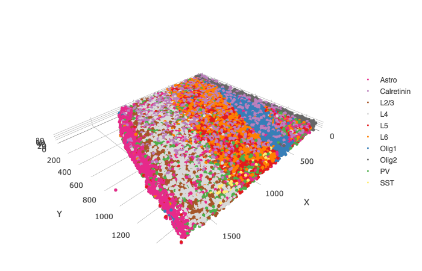

Excitatory neurons: 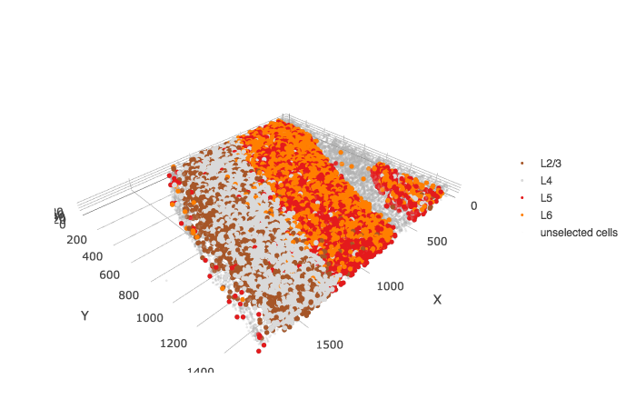

Inhibitory neurons: 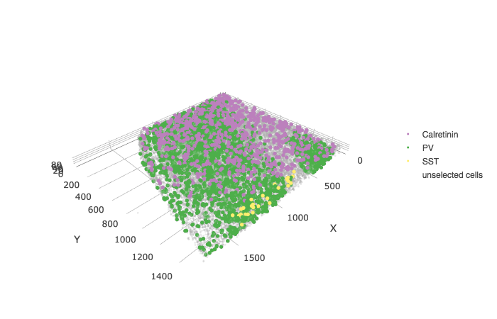

Other cell types: 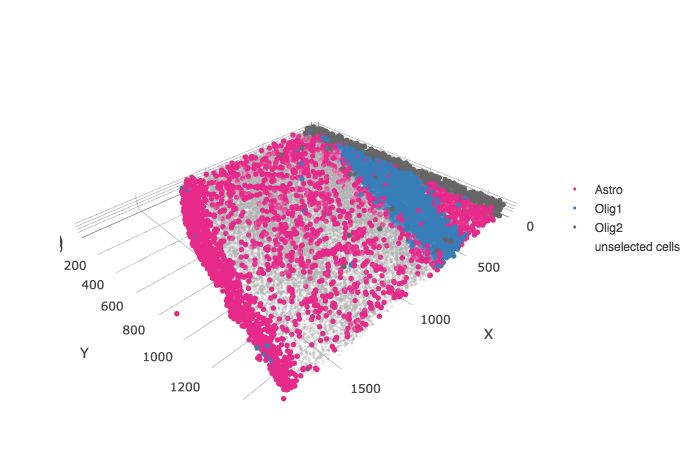

-----

</details>

### 7\. spatial grid

<details>

<summary>Expand</summary>  

``` r

## spatial grid
STAR_test <- createSpatialGrid(gobject = STAR_test,
                               sdimx_stepsize = 100,
                               sdimy_stepsize = 100,
                               sdimz_stepsize = 20,
                               minimum_padding = 0)

mycolorcode = c('red', 'blue')
names(mycolorcode) = c("L2/3", "L6")
visPlot(STAR_test, cell_color = 'cell_types', sdimx = 'sdimx', sdimy = 'sdimy',
        show_grid = T, spatial_grid_name = 'large_grid', point_size = 3, plot_method = 'ggplot',
        select_cell_groups = c("L2/3", "L6"), other_cells_alpha = 1, cell_color_code = mycolorcode)
```

Spatial grid and selection example: 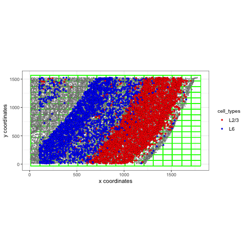

``` r
#### spatial patterns ####
pattern_VC = detectSpatialPatterns(gobject = STAR_test, 
                                   expression_values = 'normalized',
                                   spatial_grid_name = 'spatial_grid',
                                   min_cells_per_grid = 5, 
                                   scale_unit = T, 
                                   PC_zscore = 1, 
                                   show_plot = T)
```

``` r
dim3_pattern = showPattern(pattern_VC,  plot_dim = 3, point_size = 4)
htmlwidgets::saveWidget(plotly::as_widget(dim3_pattern), file = paste0(grid_folder,'/', 'dim3_pattern.html'))
```

Top view of pattern:

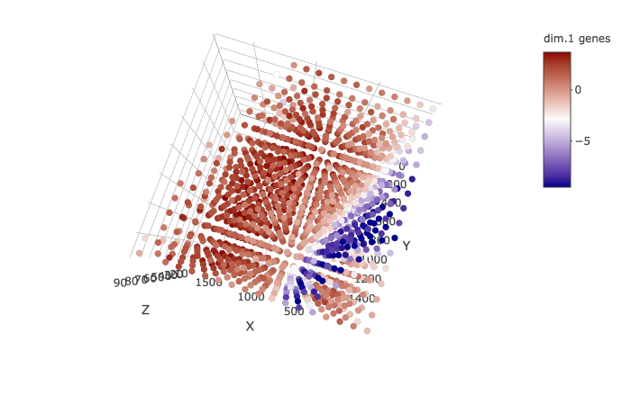

Layered view (cells) of pattern:

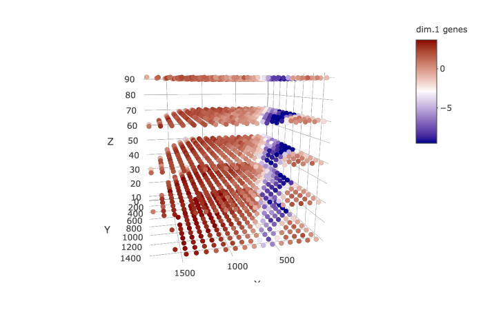

Genes associated with pattern:

``` r
showPatternGenes(pattern_VC, dimension = 1)
```


-----

</details>

### 8\. spatial network

<details>

<summary>Expand</summary>  

``` r

## create spatial networks based on k and/or distance from centroid
STAR_test <- createSpatialNetwork(gobject = STAR_test, k = 3)
```

``` r
networkplot = visPlot(gobject = STAR_test, show_network = T,
        sdimx = "sdimx",sdimy = "sdimy",sdimz = "sdimz",
        network_color = 'blue', spatial_network_name = 'spatial_network',axis_scale = "real",z_ticks = 2,
        point_size = 4, cell_color = 'cell_types')
htmlwidgets::saveWidget(plotly::as_widget(networkplot), file = paste0(spatnet_folder,'/', 'networkplot.html'))
```

Zoom out 3D network:  
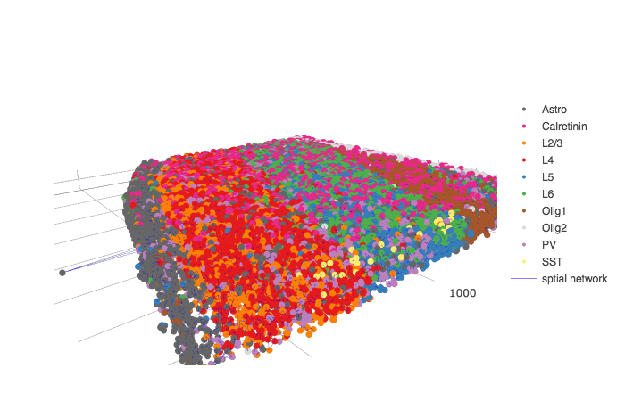

Zoom in 3D network:  
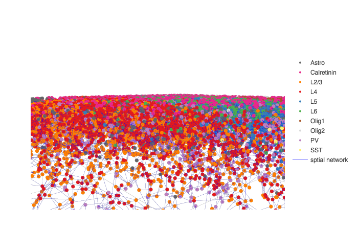 \*\*\*

</details>

### 9\. spatial genes

<details>

<summary>Expand</summary>  

``` r
kmtest = binGetSpatialGenes(STAR_test, bin_method = 'kmeans',
                            do_fisher_test = F, community_expectation = 5,
                            spatial_network_name = 'spatial_network', verbose = T)

ranktest = binGetSpatialGenes(STAR_test, bin_method = 'rank',
                              do_fisher_test = F, community_expectation = 5,
                              spatial_network_name = 'spatial_network', verbose = T)

spatial_genes = calculate_spatial_genes_python(gobject = STAR_test,
                                               expression_values = 'scaled',
                                               python_path = "/Users/rubendries/Bin/anaconda3/envs/py36/bin/pythonw",
                                               rbp_p=0.99, examine_top=0.1)
```

``` r
visSpatDimGenePlot(STAR_test, plot_method = 'ggplot',
                      genes = c('Cux2', 'Pcp4', 'Gja1', 'Mbp'), plot_alignment = 'vertical', cow_n_col = 4,
                      genes_high_color = 'red', genes_mid_color = 'white', genes_low_color = 'darkblue', midpoint = 8)
```

Spatial genes:  
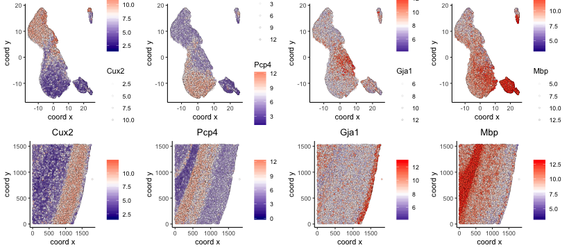

-----

</details>

### 10\. HMRF domains

<details>

<summary>Expand</summary>  

``` r
my_spatial_genes = spatial_genes[1:16]$genes

my_spatial_genes
 [1] "Flt1"    "Mbp"     "Pcp4"    "Plcxd2"  "Cux2"    "Gja1"    "Ctgf"   
 [8] "Egr1"    "Cck"     "Slc17a7" "Ctss"    "Egr2"    "Sst"     "Reln"   
[15] "Rorb"    "Rasgrf2"

showClusterHeatmap(gobject = STAR_test, cluster_column = 'cell_types', genes = my_spatial_genes)

# do HMRF with different betas
HMRF_spatial_genes = doHMRF(gobject = STAR_test, expression_values = 'normalized',
                            spatial_genes = my_spatial_genes,
                            k = 10,
                            betas = c(0, 0.5, 10), 
                            output_folder = 'Spatial_genes/SG_k10_scaled',
                            python_path = my_python_path,
                            zscore = "rowcol", tolerance=1e-5)

## add HMRF of interest to giotto object
STAR_test = addHMRF(gobject = STAR_test,
                   HMRFoutput = HMRF_spatial_genes,
                   k = 10, betas_to_add = c(0, 0.5, 1, 1.5, 2.0),
                   hmrf_name = 'HMRF')

## visualize
# b = 0, no information from cell neighbors
visPlot(gobject = STAR_test, cell_color = 'HMRF_k10_b.0', point_size = 1)

# b = 1.5
visPlot(gobject = STAR_test, cell_color = 'HMRF_k10_b.1.5', point_size = 1)
```

Without information from neighboring cells, b = 0:  
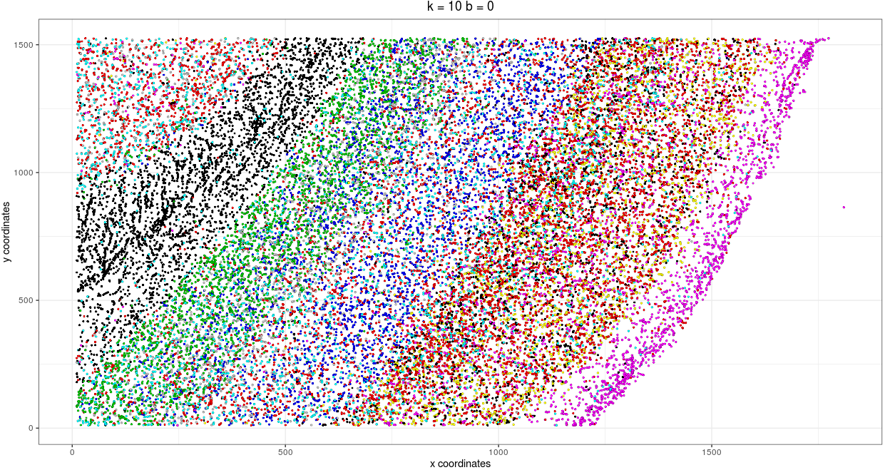

b = 1.5:  
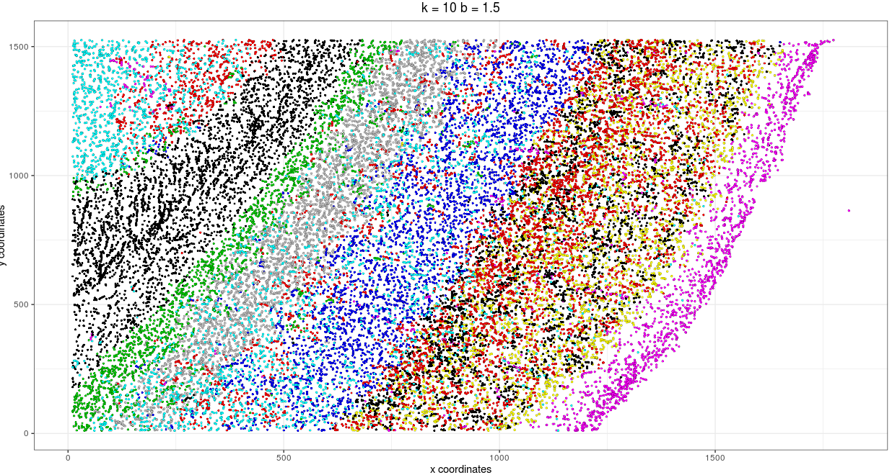

-----

</details>

### 11\. Cell-cell preferential proximity

<details>

<summary>Expand</summary>  


``` r

## calculate frequently seen proximities
cell_proximities = cellProximityEnrichment(gobject = STAR_test,
                                           cluster_column = 'cell_types',
                                           spatial_network_name = 'spatial_network',
                                           number_of_simulations = 400)

cellProximityBarplot(CPscore = cell_proximities, min_orig_ints = 5, min_sim_ints = 5)
cellProximityHeatmap(CPscore = cell_proximities, order_cell_types = T, scale = T)
```

barplot:  
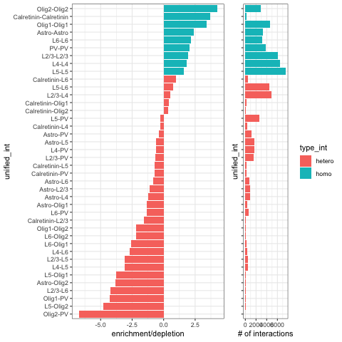

heatmap:  
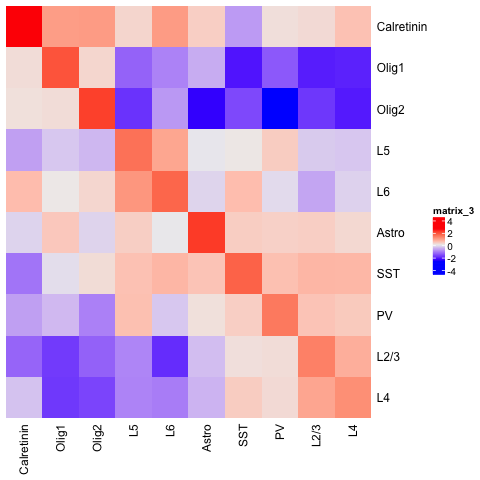

``` r
STAR_astro_pv <- cellProximityVisPlot(gobject = STAR_test, interaction_name = "Astro-PV", spatial_network_name = 'spatial_network',
                                      axis_scale = 'real', 
                                   cluster_column = 'cell_types',
                                   sdimx = "sdimx",sdimy = "sdimy",sdimz = "sdimz",
                                   show_other_cells = F,
                                   cell_color = 'cell_types', 
                                   show_network = T,
                                   network_color = 'blue', 
                                   point_size_select = 4)
htmlwidgets::saveWidget(plotly::as_widget(STAR_astro_pv), file = paste0(cellproxim_folder,'/', 'STAR_astro_pv.html'))
```

Astroycte - PV inhibitory neurons:

Zoom out of selected cell-cell interactions:
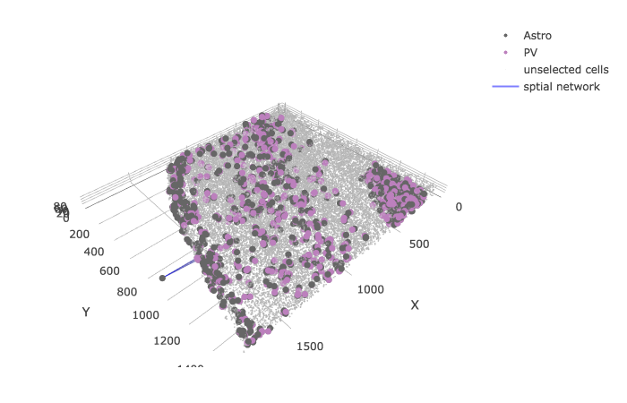

Zoom in of selected cell-cell interactions:
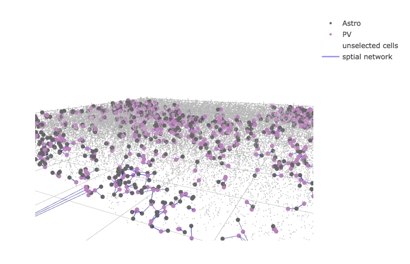

-----

</details>
