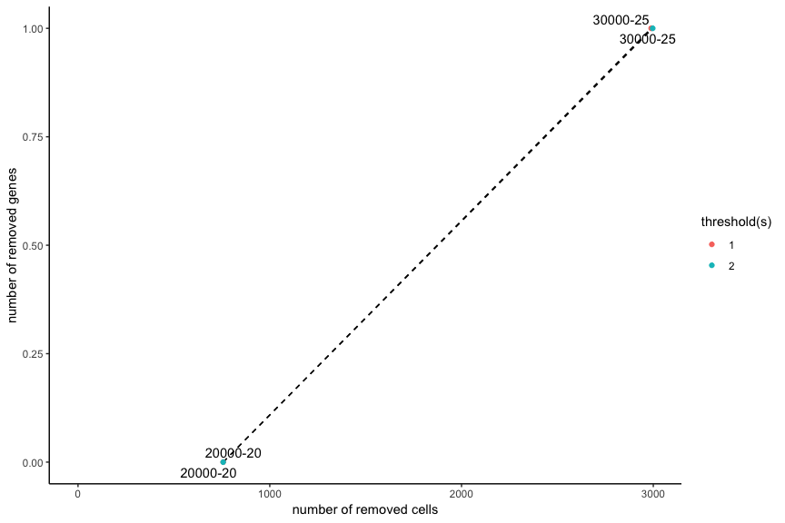

<!-- mouse_cortex_1_simple.md is generated from mouse_cortex_1_simple.Rmd Please edit that file -->

``` r
library(Giotto)
# this example works with Giotto v.0.1.2
```

### Data input

<details>

<summary>Expand</summary>  


created a 3D spatial expression dataset consisting of 28 genes from
32,845 single cells acquired over multiple rounds in visual cortex
STARmap volumes.

 .

    #> R.matlab v3.6.2 (2018-09-26) successfully loaded. See ?R.matlab for help.
    #> 
    #> Attaching package: 'R.matlab'
    #> The following objects are masked from 'package:base':
    #> 
    #>     getOption, isOpen

``` r
# get STARMAP data and extract expression matrix and cell locations
expr[1:4, 1:4]
#>         cell_1 cell_2 cell_3 cell_4
#> Slc17a7      0      0      0      0
#> Mgp          0      0      0      0
#> Gad1         0      0      0      0
#> Nov          0      0      0      0
cell_loc[1:4,]
#>      x    y z
#> [1,] 4  575 7
#> [2,] 4 1074 8
#> [3,] 3 1164 6
#> [4,] 4 1331 6
```

-----

</details>

 

### 1\. Create Giotto object & process data

<details>

<summary>Expand</summary>  

``` r
# create
STAR_test <- createGiottoObject(raw_exprs = expr, spatial_locs = cell_loc)

# check distributions, test different thresholds and filter
filterDistributions(STAR_test, detection = 'genes')
```


``` r
filterDistributions(STAR_test, detection = 'cells')
```


``` r
filterCombinations(STAR_test,
                   expression_thresholds = c(1, 2),
                   gene_det_in_min_cells = c(20000, 30000),
                   min_det_genes_per_cell = c(20, 25))
```



    #> $results
    #>    threshold gene_detected_in_min_cells min_detected_genes_per_cell
    #> 1:         1                      20000                          20
    #> 2:         1                      30000                          25
    #> 3:         2                      20000                          20
    #> 4:         2                      30000                          25
    #>    combination removed_genes removed_cells
    #> 1:    20000-20             0           757
    #> 2:    30000-25             1          2989
    #> 3:    20000-20             0           757
    #> 4:    30000-25             1          2997
    #> 
    #> $ggplot


``` r
STAR_test <- filterGiotto(gobject = STAR_test,
                          gene_det_in_min_cells = 20000,
                          min_det_genes_per_cell = 20)

## normalize & adjust
STAR_test <- normalizeGiotto(gobject = STAR_test, scalefactor = 10000, verbose = T)
#> 
#>  first scale genes and then cells
STAR_test <- addStatistics(gobject = STAR_test)
STAR_test <- adjustGiottoMatrix(gobject = STAR_test, expression_values = c('normalized'),
                                batch_columns = NULL, covariate_columns = c('nr_genes', 'total_expr'),
                                return_gobject = TRUE,
                                update_slot = c('custom'))

## first 3D view
#visPlot(gobject = STAR_test,
#        sdimx = "sdimx", sdimy = "sdimy", sdimz = "sdimz",
#        point_size = 1, axis_scale = "real", z_ticks = 2)
```

-----

</details>

 

### 2\. dimension reduction

<details>

<summary>Expand</summary>  

``` r
STAR_test <- calculateHVG(gobject = STAR_test, method = 'cov_groups', zscore_threshold = 0.5, nr_expression_groups = 3)
# use all genes (= default)
STAR_test <- runPCA(gobject = STAR_test, genes_to_use = NULL, scale_unit = F)
signPCA(STAR_test)
STAR_test <- runUMAP(STAR_test, dimensions_to_use = 1:8, n_components = 3, n_threads = 4)
```

-----

</details>

 

### 3\. cluster

<details>

<summary>Expand</summary>  

``` r


## sNN network (default)
VC_test <- createNearestNetwork(gobject = VC_test, dimensions_to_use = 1:15, k = 15)
## Leiden clustering
VC_test <- doLeidenCluster(gobject = VC_test, resolution = 0.4, n_iterations = 1000,
                           python_path = "/Users/rubendries/Bin/anaconda3/envs/py36/bin/python")

plotUMAP(gobject = VC_test, cell_color = 'leiden_clus', point_size = 2.5,
         show_NN_network = T, edge_alpha = 0.05, plot_method = 'ggplot')


## Leiden subclustering for specified clusters
VC_test = doLeidenSubCluster(gobject = VC_test, cluster_column = 'leiden_clus',
                             resolution = 0.2, k_neighbors = 10,
                             hvg_param = list(reverse_log_scale = T, show_plot = F,
                                              difference_in_variance = 1, expression_values = 'normalized'),
                             pca_param = list(expression_values = 'normalized', scale_unit = F),
                             nn_param = list(dimensions_to_use = 1:5),
                             selected_clusters = c(5,7),
                             name = 'sub_leiden_clus_select')
```

-----

</details>

 

### 4\. co-visualize

<details>

<summary>Expand</summary>  

``` r
# expression and spatial
visSpatDimPlot_2D(gobject = VC_test, cell_color = 'sub_leiden_clus_select',
               dim_point_size = 2, spatial_point_size = 2)
# relationship between clusters
clusterheatmap <- showClusterHeatmap(gobject = VC_test, cluster_column = 'sub_leiden_clus_select')
print(clusterheatmap)
```

-----

</details>

 

### 5\. differential expression

<details>

<summary>Expand</summary>  

``` r

gini_markers_subclusters = findMarkers_one_vs_all(gobject = VC_test,
                                                  method = 'gini',
                                                  expression_values = 'normalized',
                                                  cluster_column = 'sub_leiden_clus_select',
                                                  min_genes = 20,
                                                  min_expr_gini_score = 0.5,
                                                  min_det_gini_score = 0.5)
gini_markers_subclusters_DT = gini_markers_subclusters[, head(.SD, 2), by = 'cluster']
```

-----

</details>

 

### 6\. cell-type annotation

<details>

<summary>Expand</summary>  

``` r

## general cell types
clusters_cell_types_cortex = c('L6 exc neuron', 'L4 exc neuron', 'L2/3 exc neuron',
                               'L5 exc neuron', 'inh neuron', 'inh neuron',
                              'endothelial',
                              'OL', 'OL',
                              'astrocyte', 'microglia')
names(clusters_cell_types_cortex) = c(1.1, 2.1, 3.1, 4.1, 5.1, 5.2, 6.1, 7.1, 7.2, 8.1, 9.1)
VC_test = annotateGiotto(gobject = VC_test, annotation_vector = clusters_cell_types_cortex,
                         cluster_column = 'sub_leiden_clus_select', name = 'cell_types')


## general + subcluster cell types
clusters_sub_cell_types_cortex = c('L6 exc neuron', 'L4 exc neuron', 'L2/3 exc neuron',
                                   'L5 exc neuron', 'inh neuron Lhx6', 'inh neuron Adarb2',
                                   'endothelial',
                                   'OPC', 'OL',
                                   'astrocyte', 'microglia')
names(clusters_sub_cell_types_cortex) = c(1.1, 2.1, 3.1, 4.1, 5.1, 5.2, 6.1, 7.1, 7.2, 8.1, 9.1)
VC_test = annotateGiotto(gobject = VC_test, annotation_vector = clusters_sub_cell_types_cortex,
                         cluster_column = 'sub_leiden_clus_select', name = 'sub_cell_types')
```

``` r
## violinplot
cell_type_order = c('microglia', 'astrocyte', 'OL', 'OPC',
                    'endothelial',
                    'inh neuron Adarb2', 'inh neuron Lhx6',
                    'L5 exc neuron', 'L2/3 exc neuron', 'L4 exc neuron', 'L6 exc neuron')

violingenes = unique(c(gini_markers_subclusters[, head(.SD, 1), by = 'cluster']$genes, 'Lhx6'))
violinPlot(gobject = VC_test, genes = violingenes, cluster_custom_order = cell_type_order,
           strip_text = 6, cluster_column = 'sub_cell_types', color_violin = 'cluster')
```

``` r
## heatmap genes vs cells
plotHeatmap(gobject = VC_test,
            genes = gini_markers_subclusters[, head(.SD, 3), by = 'cluster']$genes,
            cluster_column = 'sub_cell_types', cluster_order = 'custom',
            cluster_custom_order = cell_type_order, legend_nrows = 2)

plotHeatmap(gobject = VC_test,
            genes = gini_markers_subclusters[, head(.SD, 6), by = 'cluster']$genes,
            gene_label_selection = gini_markers_subclusters[, head(.SD, 2), by = 'cluster']$genes,
            cluster_column = 'sub_cell_types', cluster_order = 'custom',
            cluster_custom_order = cell_type_order, legend_nrows = 2)

## heatmap cells
clusterheatmap <- showClusterHeatmap(gobject = VC_test, cluster_column = 'sub_cell_types')
print(clusterheatmap)

## co-visualization
visSpatDimPlot_2D(gobject = VC_test, cell_color = 'sub_cell_types', plot_method = 'ggplot',
               dim_point_size = 2, spatial_point_size = 2, show_cluster_center = F, show_center_label = T)
```

-----

</details>

 

### 7\. spatial grid

<details>

<summary>Expand</summary>  

``` r

## spatial grid
VC_test <- createSpatialGrid(gobject = VC_test,
                             sdimx_stepsize = 500,
                             sdimy_stepsize = 500,
                             minimum_padding = 50)

visPlot(gobject = VC_test, show_grid = T,
        point_size = 1.5, cell_color = NULL)

## identify spatial patterns
pattern_VC = detectSpatialPatterns(gobject = VC_test, expression_values = 'normalized',
                                   min_cells_per_grid = 5, scale_unit = T, PC_zscore = 1, show_plot = T)

## show pattern and top genes for principal component 1
dim1_pattern = showPattern(pattern_VC, dimension = 1)
dim1_genes = showPatternGenes(pattern_VC, dimension = 1)
print(dim1_pattern)
print(dim1_genes)

## show pattern and top genes for principal component 2
dim2_pattern = showPattern(pattern_VC, dimension = 2)
dim2_genes = showPatternGenes(pattern_VC, dimension = 2)
print(dim2_pattern)
print(dim2_genes)

## select genes associated with significant patterns and add to giotto object
patterned_Genes = selectPatternGenes(pattern_VC, dimensions = 1:4,
                                     top_pos_genes = 50, top_neg_genes = 50,
                                     min_pos_cor = 0.3, min_neg_cor = 0.3)

VC_test = addGeneMetadata(gobject = VC_test, new_metadata = patterned_Genes,
                          by_column = T, column_gene_ID = 'gene_ID')
```

-----

</details>

 

### 8\. spatial network

<details>

<summary>Expand</summary>  

``` r

## create spatial networks based on k and/or distance from centroid
VC_test <- createSpatialNetwork(gobject = VC_test, k = 3)
VC_test <- createSpatialNetwork(gobject = VC_test, k = 10, name = 'large_network')
VC_test <- createSpatialNetwork(gobject = VC_test, k = 100, maximum_distance = 200,
                                minimum_k = 2, name = 'distance_network')

## visualize different spatial networks on first field (~ layer 1)
field1_ids = cell_metadata[Field_of_View == 0]$cell_ID
subVC_test = subsetGiotto(VC_test, cell_ids = field1_ids)

visPlot(gobject = subVC_test, show_network = T,
        network_color = 'blue', spatial_network_name = 'spatial_network',
        point_size = 2.5, cell_color = 'sub_cell_types')

visPlot(gobject = subVC_test, show_network = T,
        network_color = 'blue', spatial_network_name = 'large_network',
        point_size = 2.5, cell_color = 'sub_cell_types')

visPlot(gobject = subVC_test, show_network = T,
        network_color = 'blue', spatial_network_name = 'distance_network',
        point_size = 2.5, cell_color = 'sub_cell_types')
```

-----

</details>

 

### 9\. spatial genes

<details>

<summary>Expand</summary>  

``` r

## identify spatial genes based on network and add to object
# VC_test <- calculateSpatialGenes(gobject = VC_test, method = 'kmeans', min_N = 20)

## identify spatial genes, but return results
spatial_gene_DT <- binGetSpatialGenes(gobject = VC_test, bin_method = 'kmeans')

## identify spatial genes based on physical distance directly
spatial_python_DT <- calculate_spatial_genes_python(gobject = VC_test,
                                                    expression_values = 'scaled',
                                                    python_path = "/Users/rubendries/Bin/anaconda3/envs/py36/bin/pythonw")

## visualize genes with spatial expression pattern
visGenePlot(gobject = VC_test,  genes = c('Cux2', 'Grm2', 'Cadm4', 'Islr2'),
            point_size = 2.5, cow_n_col = 1, genes_high_color = 'darkred', genes_mid_color = 'blue', genes_low_color = 'darkblue',
            scale_alpha_with_expression = T, point_border_stroke = 0.05,
            point_border_col = 'lightgrey')
```

-----

</details>

 

### 10\. HMRF domains

<details>

<summary>Expand</summary>  

``` r

# select out put folder
hmrf_folder = '/Volumes/Ruben_Seagate/Dropbox/Projects/GC_lab/Ruben_Dries/190225_spatial_package/Results/Seqfish_cortex_results/190830_results/HMRF_results//'
spatial_genes = spatial_python_DT[1:100]$genes

# do HMRF with different betas
HMRF_spatial_genes = doHMRF(gobject = VC_test, expression_values = 'scaled',
                            spatial_genes = spatial_genes,
                            k = 9,
                            betas = c(28,2,3), 
                            output_folder = paste0(hmrf_folder, '/', 'Spatial_genes/SG_top100_k9_scaled'),
                            python_path = "/Users/rubendries/Bin/anaconda3/envs/py36/bin/pythonw")

## view results of HMRF
viewHMRFresults(gobject = VC_test,
                HMRFoutput = HMRF_spatial_genes,
                k = 9, betas_to_view = seq(28, 34, by = 2),
                point_size = 2)

## add HMRF of interest to giotto object
VC_test = addHMRF(gobject = VC_test,
                  HMRFoutput = HMRF_spatial_genes,
                  k = 9, betas_to_add = 30,
                  hmrf_name = 'HMRF')

## visualize
visPlot(gobject = VC_test, cell_color = 'HMRF_k9_b.30', point_size = 2)
```

-----

</details>

 

### 11\. Cell-cell preferential proximity

<details>

<summary>Expand</summary>  


``` r

## calculate frequently seen proximities
cell_proximities = cellProximityEnrichment(gobject = VC_test,
                                           cluster_column = 'cell_types',
                                           spatial_network_name = 'spatial_network',
                                           number_of_simulations = 400)

## barplot
cellProximityBarplot(CPscore = cell_proximities, min_orig_ints = 5, min_sim_ints = 5)

## heatmap
cellProximityHeatmap(CPscore = cell_proximities, order_cell_types = T, scale = T)


## visualize inh neuron - L5 exc neuron
cellProximityVisPlot(gobject = VC_test, interaction_name = 'inh neuron-L5 exc neuron', spatial_network_name = 'spatial_network',
                     cluster_column = 'cell_types',
                     cell_color = 'cell_types', show_network = T,
                     network_color = 'blue', point_size_select = 2)

## zoom-in of field 2 (~ layer 5)
selected_cells = cell_metadata[Field_of_View %in% c(2)]$cell_ID
sub_VC_test = subsetGiotto(VC_test, cell_ids = selected_cells)

cellProximityVisPlot(gobject = sub_VC_test, interaction_name = 'inh neuron-L5 exc neuron',
                     cluster_column = 'cell_types',
                     cell_color = 'cell_types', show_network = T,
                     network_color = 'blue', point_size_select = 3)
```

-----

</details>

 

### 12\. 1 gene enrichment in cell neighborhood

<details>

<summary>Expand</summary>  


``` r

## get cell proximity scores (CPG scores)
CPGscores = getCellProximityGeneScores(gobject = VC_test, cluster_column = 'cell_types')

## visualize
barplot = showCPGscores(CPGscore = CPGscores, method = 'cell_barplot')
cell_cell_barplot = showCPGscores(CPGscore = CPGscores, method = 'cell-cell')
library(ggalluvial)
sankey = showCPGscores(CPGscore = CPGscores, method = 'cell_sankey')

## filter CPG scores
filter_CPGscores = showCPGscores(CPGscore = CPGscores,
                                 min_cells = 5, min_pval = 0.05,
                                 min_spat_diff = 0.2, min_log2_fc = 0.5,
                                 return_DT = T)
```

-----

</details>

 

### 13\. 2 gene enrichment in cell neighborhood

<details>

<summary>Expand</summary>  

example: ligand - receptor combinations  


``` r
LR_data = fread(system.file("extdata", "mouse_ligand_receptors.txt", package = 'Giotto'))
ligands = LR_data$mouseLigand
receptors = LR_data$mouseReceptor


select_GTG = getGeneToGeneSelection(CPGscore = CPGscores,
                                    specific_genes_1 = ligands, specific_genes_2 = receptors,
                                    min_cells = 1, min_pval = 1, min_spat_diff = 0, min_log2_fc = 0,
                                    verbose = T,
                                    direction = 'both')
```

-----

</details>

 

##### 13.1 difference scRNAseq and seqfish+

<details>

<summary>Expand</summary>  

``` r
# filter nr cells
filter_GTG = select_GTG[nr_1 >= 5 & nr_2 >= 5]
filter_GTG[, all_cell_rank := rank(-all_cell_expr), by = unif_gene_gene]
filter_GTG[, spatial_cell_rank := rank(-spatial_cell_expr), by = unif_gene_gene]

rnaseq_guess = filter_GTG[all_cell_rank == 1]
rnaseq_guess[, spatial_cell_rank := floor(spatial_cell_rank)]
rnaseq_guess[, concordant := ifelse(all_cell_rank == spatial_cell_rank, 'yes', 'no')]
prop.table(table(rnaseq_guess$concordant))

pl <- ggplot()
pl <- pl + geom_bar(data = rnaseq_guess, aes(x = spatial_cell_rank))
pl <- pl + theme_classic()
pl <- pl + labs(x = 'spatial rank vs 1st expression rank')
pl


pl <- ggplot(data = filter_GTG, aes(x = all_cell_rank, y = spatial_cell_rank))
pl <- pl + stat_density2d(aes(fill = stat(level)), geom = 'polygon')
pl <- pl + geom_abline(intercept = 0, slope = 1, linetype = 2)
pl <- pl + scale_fill_viridis_c()
pl <- pl + theme_classic()
pl <- pl + labs(x = 'expression only ranking', y = 'spatial expression ranking')
pl
```

-----

</details>

 

##### 13.2 statistical framework to detect significant cell-cell communication gene-pairs

<details>

<summary>Expand</summary>  

``` r
LR_data[, ligand_det := ifelse(mouseLigand %in% VC_test@gene_ID, T, F)]
LR_data[, receptor_det := ifelse(mouseReceptor %in% VC_test@gene_ID, T, F)]
LR_data_det = LR_data[ligand_det == T & receptor_det == T]

select_ligands = LR_data_det$mouseLigand
select_receptors = LR_data_det$mouseReceptor

## get statistical significance of gene pair expression changes based on expression ##
expr_only_scores = exprOnlyCellCellcommunicationScores(gobject = VC_test,
                                          cluster_column = 'cell_types', 
                                          random_iter = 50,
                                          gene_set_1 = select_ligands,
                                          gene_set_2 = select_receptors)


## get statistical significance of gene pair expression changes upon cell-cell interaction
spatial_all_scores = allCellCellcommunicationsScores(VC_test,
                                                  spatial_network_name = 'spatial_network',
                                                  cluster_column = 'cell_types', 
                                                  random_iter = 200,
                                                  gene_set_1 = select_ligands,
                                                  gene_set_2 = select_receptors,
                                                  verbose = 'none')

## filter
selected_spat = spatial_all_scores[pvalue <= 0.01 & abs(log2fc) > 0.5 &
                                 lig_nr >= 5 & rec_nr >= 5]
selected_spat[, lig_rec_cell_types := paste0(lig_cell_type,'-',rec_cell_type)]


## visualize top ints ##
top_ints = unique(selected_spat[order(-abs(log2fc))]$LR_comb)[1:50]

gdt = spatial_all_scores[LR_comb %in% top_ints]
gdt[, lig_rec_cell_types := paste0(lig_cell_type,' - ',rec_cell_type)]

pl <- ggplot()
pl <- pl + geom_point(data = gdt, aes(x = lig_rec_cell_types,
                                      y = LR_comb, size = pvalue, color = log2fc))
pl <- pl + theme_classic() + theme(axis.text.x = element_text(angle = 90,
                                                              size = 6,
                                                              vjust = 1,
                                                              hjust = 1),
                                   axis.text.y = element_text(size = 6))
pl <- pl + scale_size_continuous(range = c(2, 0.1)) + scale_color_gradientn(colours = c('darkblue', 'blue', 'white', 'red', 'darkred'))
pl <- pl + labs(x = '', y = '')
pl
```

-----

</details>

 

##### 13.3 highlight specific gene pairs (ligand-receptor) interactions

<details>

<summary>Expand</summary>  

example for specific interaction ‘Nrp2-Sema3f’

``` r


## astrocyte - inh neuron
selected_LR = select_GTG[unif_gene_gene == 'Nrp2-Sema3f' &
                           unified_int == 'astrocyte-inh neuron' & genes_1 == 'Nrp2']

plotGTGscores(GTGscore = selected_LR,
              selected_interactions = c('astrocyte-inh neuron'),
              selected_gene_to_gene = 'Nrp2-Sema3f',
              simple_plot = F, detail_plot = T)

cellProximityVisPlot(gobject = VC_test, interaction_name = "astrocyte-inh neuron",
                     spatial_network_name = 'spatial_network',
                     cluster_column = 'cell_types', cell_color_code = NULL,
                     cell_color = 'cell_types', show_network = T,
                     network_color = 'blue', point_size_select = 3)


## microglia - endothelial
selected_LR = select_GTG[unif_gene_gene == 'Nrp2-Sema3f' &
                           unified_int == 'endothelial-microglia' & genes_1 == 'Nrp2']

plotGTGscores(GTGscore = selected_LR,
              selected_interactions = c('endothelial-microglia'),
              selected_gene_to_gene = 'Nrp2-Sema3f',
              simple_plot = F, detail_plot = T)

cellProximityVisPlot(gobject = VC_test, interaction_name = 'endothelial-microglia', spatial_network_name = 'spatial_network',
                     cluster_column = 'cell_types', cell_color_code = NULL,
                     cell_color = 'cell_types', show_network = T,
                     network_color = 'blue', point_size_select = 3)
```

-----

</details>
