<!-- mouse_cortex_1_simple.md is generated from mouse_cortex_1_simple.Rmd Please edit that file -->

``` r
library(Giotto)
# this example works with Giotto v.0.1.2
```

### Data input

<details>

<summary>Expand</summary>  

[Wang et al.](https://science.sciencemag.org/content/361/6400/eaat5691)
created a 3D spatial expression dataset consisting of 28 genes from
32,845 single cells acquired over multiple rounds in visual cortex
STARmap volumes.

 .

    #> R.matlab v3.6.2 (2018-09-26) successfully loaded. See ?R.matlab for help.
    #> 
    #> Attaching package: 'R.matlab'
    #> The following objects are masked from 'package:base':
    #> 
    #>     getOption, isOpen

``` r
# get STARMAP data and extract expression matrix and cell locations
# expression:
expr[1:4, 1:4]
#>         cell_1 cell_2 cell_3 cell_4
#> Slc17a7      0      0      0      0
#> Mgp          0      0      0      0
#> Gad1         0      0      0      0
#> Nov          0      0      0      0
# location:
cell_loc[1:4,]
#>      x    y z
#> [1,] 4  575 7
#> [2,] 4 1074 8
#> [3,] 3 1164 6
#> [4,] 4 1331 6
```

-----

</details>

 

### 1\. Create Giotto object & process data

<details>

<summary>Expand</summary>  

``` r
# create
STAR_test <- createGiottoObject(raw_exprs = expr, spatial_locs = cell_loc)

# check distributions, test different thresholds and filter
filterDistributions(STAR_test, detection = 'genes', show_plot = F)
```

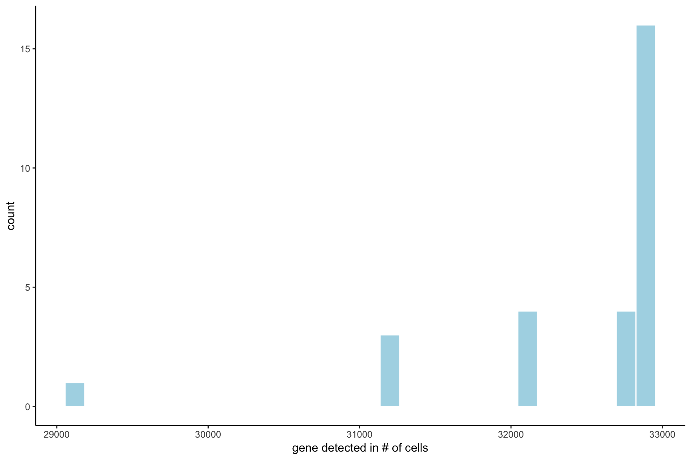

``` r
filterDistributions(STAR_test, detection = 'cells', show_plot = F)
```

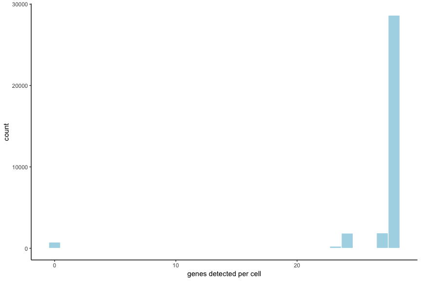

``` r
filterCombinations(STAR_test,
                   expression_thresholds = c(1, 2),
                   gene_det_in_min_cells = c(20000, 30000),
                   min_det_genes_per_cell = c(20, 25))
```


    #> $results
    #>    threshold gene_detected_in_min_cells min_detected_genes_per_cell
    #> 1:         1                      20000                          20
    #> 2:         1                      30000                          25
    #> 3:         2                      20000                          20
    #> 4:         2                      30000                          25
    #>    combination removed_genes removed_cells
    #> 1:    20000-20             0           757
    #> 2:    30000-25             1          2989
    #> 3:    20000-20             0           757
    #> 4:    30000-25             1          2997
    #> 
    #> $ggplot


``` r
STAR_test <- filterGiotto(gobject = STAR_test,
                          gene_det_in_min_cells = 20000,
                          min_det_genes_per_cell = 20)

## normalize & adjust
STAR_test <- normalizeGiotto(gobject = STAR_test, scalefactor = 10000, verbose = T)
#> 
#>  first scale genes and then cells
STAR_test <- addStatistics(gobject = STAR_test)
STAR_test <- adjustGiottoMatrix(gobject = STAR_test, expression_values = c('normalized'),
                                batch_columns = NULL, covariate_columns = c('nr_genes', 'total_expr'),
                                return_gobject = TRUE,
                                update_slot = c('custom'))
```

Data can be presented in 3D for both the spatial (if captured in 3D) and
expression space. Output is generated by plotly and can be saved as an
html widget as show belown. These html widgets can be opened again in
any browser for further exploration and to generate static figures. For
this example we will only present static figures for each interactive 3D
plot.

``` r
real_3D = visPlot(gobject = STAR_test,
                  sdimx = "sdimx", sdimy = "sdimy", sdimz = "sdimz",
                  point_size = 1, axis_scale = "real", z_ticks = 2)
htmlwidgets::saveWidget(plotly::as_widget(real_3D), file = paste0(gobject_folder,'/', 'starmap_real_3D.html'))

cube_3D = visPlot(gobject = STAR_test,
                  sdimx = "sdimx", sdimy = "sdimy", sdimz = "sdimz",
                  point_size = 1, axis_scale = "cube", z_ticks = 2)
htmlwidgets::saveWidget(plotly::as_widget(cube_3D), file = paste0(gobject_folder,'/', 'starmap_cube_3D.html'))
```

Real scale 3D image:


Cube scale 3D image:


-----

</details>

 

### 2\. dimension reduction

<details>

<summary>Expand</summary>  

``` r
STAR_test <- calculateHVG(gobject = STAR_test, method = 'cov_groups', zscore_threshold = 0.5, nr_expression_groups = 3)
```


``` r
# use all genes (= default)
STAR_test <- runPCA(gobject = STAR_test, genes_to_use = NULL, scale_unit = F)
signPCA(STAR_test)
```

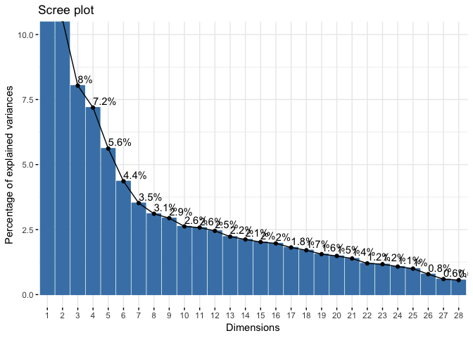

``` r
STAR_test <- runUMAP(STAR_test, dimensions_to_use = 1:8, n_components = 3, n_threads = 4)
```

-----

</details>

 

### 3\. cluster

<details>

<summary>Expand</summary>  

``` r

## sNN network (default)
STAR_test <- createNearestNetwork(gobject = STAR_test, dimensions_to_use = 1:8, k = 15)
## Leiden clustering
STAR_test <- doLeidenCluster(gobject = STAR_test, resolution = 0.2, n_iterations = 1000,
                             name = 'leiden_0.2',
                             python_path = "/Users/rubendries/Bin/anaconda3/envs/py36/bin/python")
```

``` r
STAR_UMAP <- plotUMAP(gobject = STAR_test, cell_color = 'leiden_0.2', 
                      point_size = 1.5,
                      plot_method = "plotly",
                      show_NN_network = T, 
                      edge_alpha = 0.05,
                      dim1_to_use = 1,
                      dim2_to_use = 2,
                      dim3_to_use = 3)
htmlwidgets::saveWidget(plotly::as_widget(STAR_UMAP), file = paste0(cluster_folder,'/', 'cluster_UMAP.html'))
```

3D UMAP plot:


-----

</details>

 

### 4\. co-visualize

<details>

<summary>Expand</summary>  

``` r
coPlot = visSpatDimPlot(gobject = STAR_test,
                        cell_color = 'leiden_0.2',
                        dim3_to_use = 3,
                        sdimz = "sdimz",
                        axis_scale = "real",
                        z_ticks = 2,
                        dim_point_size = 1,
                        spatial_point_size = 1,
                        show_NN_network = F)
htmlwidgets::saveWidget(plotly::as_widget(coPlot), file = paste0(covis_folder,'/', 'coPlot.html'))
```

Co-visualzation:


-----

</details>

 

### 5\. differential expression

<details>

<summary>Expand</summary>  

``` r
markers = findMarkers_one_vs_all(gobject = STAR_test,
                                 method = 'gini',
                                 expression_values = 'normalized',
                                 cluster_column = 'leiden_0.2',
                                 min_genes = 5, rank_score = 2)
#> 
#>  start with cluster  1 
#> 
#>  start with cluster  2 
#> 
#>  start with cluster  3 
#> 
#>  start with cluster  4 
#> 
#>  start with cluster  5 
#> 
#>  start with cluster  6 
#> 
#>  start with cluster  7 
#> 
#>  start with cluster  8 
#> 
#>  start with cluster  9 
#> 
#>  start with cluster  10
markers[, head(.SD, 4), by = 'cluster']
#>        cluster  genes expression expression_gini detection detection_gini
#>  1:  cluster_1    Vip   4.766633    0.0744583523 0.9993858   3.831830e-02
#>  2:  cluster_1  Pvalb   6.480540    0.0502003508 0.9996929   1.609787e-02
#>  3:  cluster_1    Sst   5.006811    0.0363036092 0.9998465   1.605527e-02
#>  4:  cluster_1    Npy   6.839729    0.0214261282 0.9998465   1.544898e-02
#>  5:  cluster_2   Egr2   7.145915    0.0468779066 0.9992747   7.067446e-03
#>  6:  cluster_2   Egr1  10.512750    0.0459988839 1.0000000   6.421542e-03
#>  7:  cluster_2   Bdnf   6.110039    0.0321213990 1.0000000   6.430928e-03
#>  8:  cluster_2  Pvalb   5.731961    0.0106787601 1.0000000   1.558491e-02
#>  9:  cluster_3    Vip   6.732542    0.1761480541 1.0000000   3.649791e-02
#> 10:  cluster_3   Egr2   7.808012    0.0732338525 1.0000000   7.192201e-03
#> 11:  cluster_3  Pvalb   6.060168    0.0272344727 1.0000000   1.538003e-02
#> 12:  cluster_3    Npy   6.931998    0.0243629040 1.0000000   1.471874e-02
#> 13:  cluster_4    Vip   5.982603    0.1321051490 1.0000000   3.474683e-02
#> 14:  cluster_4    Sst   8.132101    0.1717095812 1.0000000   1.458759e-02
#> 15:  cluster_4  Pvalb   8.447224    0.1215180123 1.0000000   1.466984e-02
#> 16:  cluster_4    Npy   7.413062    0.0424576274 1.0000000   1.403991e-02
#> 17:  cluster_5   Egr1   9.515300    0.0144054012 1.0000000   5.971564e-03
#> 18:  cluster_5   Pcp4   9.360037    0.0767049930 1.0000000   2.385415e-04
#> 19:  cluster_5   Ctgf   7.070551    0.0078366443 1.0000000   2.385415e-04
#> 20:  cluster_5  Sulf2   8.031672    0.0025942824 1.0000000   2.385415e-04
#> 21:  cluster_6    Npy   7.557825    0.0469936630 1.0000000   1.375828e-02
#> 22:  cluster_6    Sst   4.974138    0.0302484703 0.9996956   1.420966e-02
#> 23:  cluster_6  Prok2   6.847855    0.0055684086 1.0000000   5.931289e-03
#> 24:  cluster_6    Vip   3.785783    0.0007164072 0.9579909   2.199736e-02
#> 25:  cluster_7    Npy   6.680232    0.0121579803 1.0000000   1.348175e-02
#> 26:  cluster_8   Ctgf   6.972996    0.0037004355 1.0000000   2.240215e-04
#> 27:  cluster_8 Sema3e   6.771731    0.0003444247 1.0000000   2.240215e-04
#> 28: cluster_10    Cck   9.278435    0.0133443101 1.0000000   1.523786e-05
#>        cluster  genes expression expression_gini detection detection_gini
#>     expression_rank detection_rank    comb_gini comb_rank
#>  1:               1              1 2.853117e-03         1
#>  2:               1              1 8.081185e-04         2
#>  3:               1              1 5.828644e-04         3
#>  4:               1              1 3.310119e-04         4
#>  5:               1              1 3.313071e-04         1
#>  6:               1              1 2.953838e-04         2
#>  7:               1              1 2.065704e-04         3
#>  8:               1              1 1.664275e-04         4
#>  9:               1              1 6.429035e-03         1
#> 10:               1              1 5.267126e-04         2
#> 11:               1              1 4.188671e-04         3
#> 12:               1              1 3.585911e-04         4
#> 13:               1              1 4.590235e-03         1
#> 14:               1              1 2.504829e-03         2
#> 15:               1              1 1.782650e-03         3
#> 16:               1              1 5.961013e-04         4
#> 17:               1              1 8.602278e-05         1
#> 18:               1              1 1.829732e-05         2
#> 19:               1              1 1.869365e-06         3
#> 20:               1              1 6.188440e-07         4
#> 21:               1              1 6.465519e-04         1
#> 22:               1              1 4.298205e-04         2
#> 23:               1              1 3.302784e-05         3
#> 24:               1              1 1.575907e-05         4
#> 25:               1              1 1.639108e-04         1
#> 26:               1              1 8.289771e-07         1
#> 27:               1              1 7.715854e-08         2
#> 28:               1              1 2.033388e-07         1
#>     expression_rank detection_rank    comb_gini comb_rank


# violinplot
violinPlot(STAR_test, genes = unique(markers$genes), cluster_column = 'leiden_0.2')
```

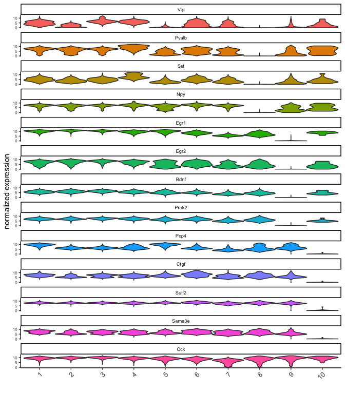

``` r

# individual genes and cells heatmap
plotHeatmap(STAR_test, genes = STAR_test@gene_ID, cluster_column = 'leiden_0.2',
            legend_nrows = 2, expression_values = 'scaled',
            cluster_order = 'correlation', gene_order = 'correlation', show_plot = F)
```

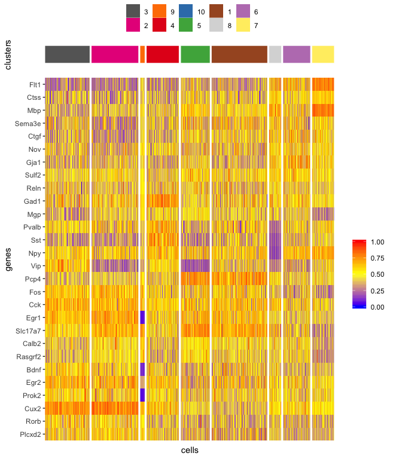

``` r

# individual genes and average cluster heatmap
plotMetaDataHeatmap(STAR_test, expression_values = 'scaled',
                    metadata_cols = c('leiden_0.2'))
```

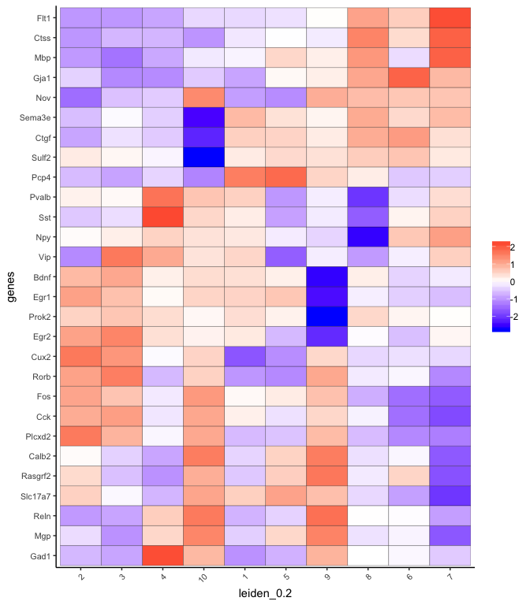

-----

</details>

 

### 6\. cell-type annotation

<details>

<summary>Expand</summary>  

``` r

## general cell types
clusters_cell_types_cortex = c('excit','excit','excit', 'inh', 'excit',
                               'other', 'other', 'other', 'inh', 'inh')
names(clusters_cell_types_cortex) = c(1:10)
STAR_test = annotateGiotto(gobject = STAR_test, annotation_vector = clusters_cell_types_cortex,
                           cluster_column = 'leiden_0.2', name = 'general_cell_types')

## detailed cell types
clusters_cell_types_cortex = c('L5','L4','L2/3', 'PV', 'L6',
                               'Astro', 'Olig1', 'Olig2', 'Calretinin', 'SST')
names(clusters_cell_types_cortex) = c(1:10)
STAR_test = annotateGiotto(gobject = STAR_test, annotation_vector = clusters_cell_types_cortex,
                         cluster_column = 'leiden_0.2', name = 'cell_types')


plotUMAP(STAR_test, plot_method = 'ggplot', cell_color = 'general_cell_types', point_size = 1.5)
```

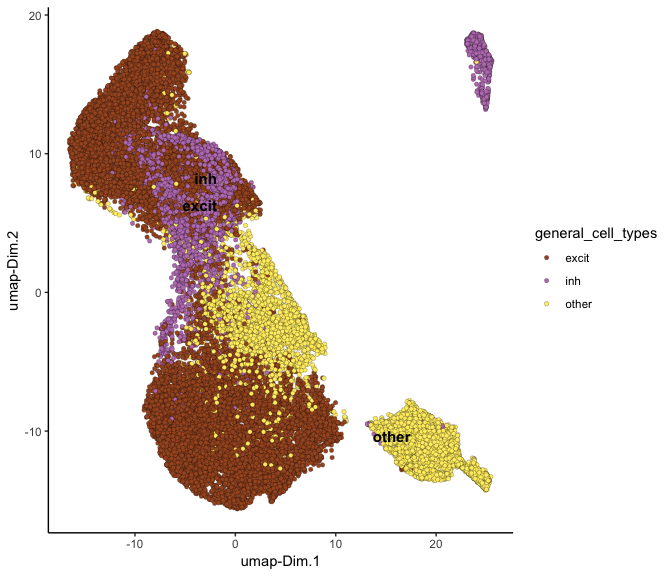

``` r
plotMetaDataHeatmap(STAR_test, expression_values = 'scaled',
                    metadata_cols = c('general_cell_types'))
```


``` r

plotUMAP(STAR_test, plot_method = 'ggplot', cell_color = 'cell_types', point_size = 1.5)
```

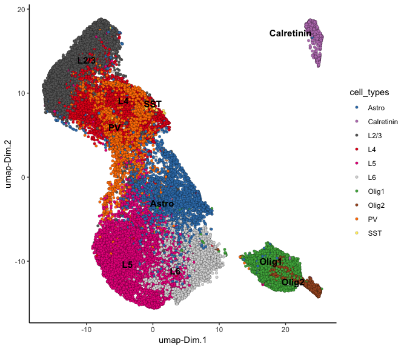

``` r
plotMetaDataHeatmap(STAR_test, expression_values = 'scaled',
                    metadata_cols = c('cell_types'))
```

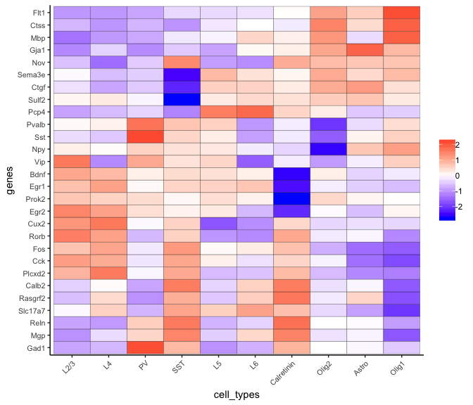

``` r
# create consistent color code
mynames = unique(pDataDT(STAR_test)$cell_types)
mycolorcode = Giotto:::getDistinctColors(n = 10)
names(mycolorcode) = mynames

## all cell types
realCellTypes =  visPlot(STAR_test, cell_color = 'cell_types', axis_scale = 'real',
                         sdimx = 'sdimx', sdimy = 'sdimy', sdimz = 'sdimz',
                         show_grid = F, cell_color_code = mycolorcode)
htmlwidgets::saveWidget(plotly::as_widget(realCellTypes), file = paste0(annotation_folder,'/', 'realCellTypes.html'))

## excitatory neurons
excit = visPlot(STAR_test, cell_color = 'cell_types', plot_method = 'plotly',
        sdimx = 'sdimx', sdimy = 'sdimy', sdimz = 'sdimz', axis_scale = 'real',
        select_cell_groups = c('L6','L5','L4','L2/3'),
        show_grid = F, cell_color_code = mycolorcode)
htmlwidgets::saveWidget(plotly::as_widget(excit), file = paste0(annotation_folder,'/', 'realCellTypes_excit.html'))

## inhibitory neurons
inhib = visPlot(STAR_test, cell_color = 'cell_types', plot_method = 'plotly',
        sdimx = 'sdimx', sdimy = 'sdimy', sdimz = 'sdimz', axis_scale = 'real',
        select_cell_groups = c('PV','Calretinin', 'SST'),
        show_grid = F, cell_color_code = mycolorcode)
htmlwidgets::saveWidget(plotly::as_widget(inhib), file = paste0(annotation_folder,'/', 'realCellTypes_inh.html'))

## other cell types
other = visPlot(STAR_test, cell_color = 'cell_types', plot_method = 'plotly',
        sdimx = 'sdimx', sdimy = 'sdimy', sdimz = 'sdimz', axis_scale = 'real',
        select_cell_groups = c('Astro', 'Olig1', 'Olig2'),
        show_grid = F, cell_color_code = mycolorcode)
htmlwidgets::saveWidget(plotly::as_widget(other), file = paste0(annotation_folder,'/', 'realCellTypes_other.html'))
```

All cells:


Excitatory neurons:


Inhibitory neurons:


Other cell types:


-----

</details>

 

### 7\. spatial grid

<details>

<summary>Expand</summary>  

``` r

## spatial grid
STAR_test <- createSpatialGrid(gobject = STAR_test,
                               sdimx_stepsize = 100,
                               sdimy_stepsize = 100,
                               sdimz_stepsize = 20,
                               minimum_padding = 0)

mycolorcode = c('red', 'blue')
names(mycolorcode) = c("L2/3", "L6")
visPlot(STAR_test, cell_color = 'cell_types', sdimx = 'sdimx', sdimy = 'sdimy',
        show_grid = T, spatial_grid_name = 'large_grid', point_size = 3, plot_method = 'ggplot',
        select_cell_groups = c("L2/3", "L6"), other_cells_alpha = 1, cell_color_code = mycolorcode)
#> create 2D plot with ggplot
```

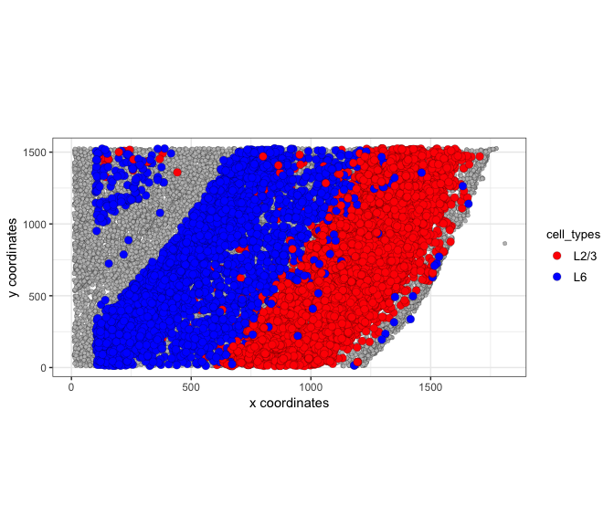

``` r

#### spatial patterns ####
pattern_VC = detectSpatialPatterns(gobject = STAR_test, 
                                   expression_values = 'normalized',
                                   spatial_grid_name = 'spatial_grid',
                                   min_cells_per_grid = 5, 
                                   scale_unit = T, 
                                   PC_zscore = 1, 
                                   show_plot = T)
```

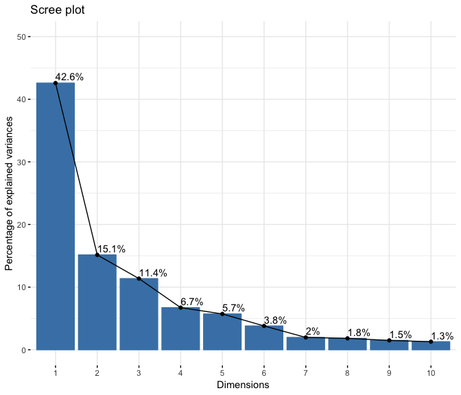

``` r
dim3_pattern = showPattern(pattern_VC,  plot_dim = 3, point_size = 4)
htmlwidgets::saveWidget(plotly::as_widget(dim3_pattern), file = paste0(grid_folder,'/', 'dim3_pattern.html'))
```

Top view of pattern:


Layered view (cells) of pattern:


Genes associated with pattern:

``` r
showPatternGenes(pattern_VC, dimension = 1)
```

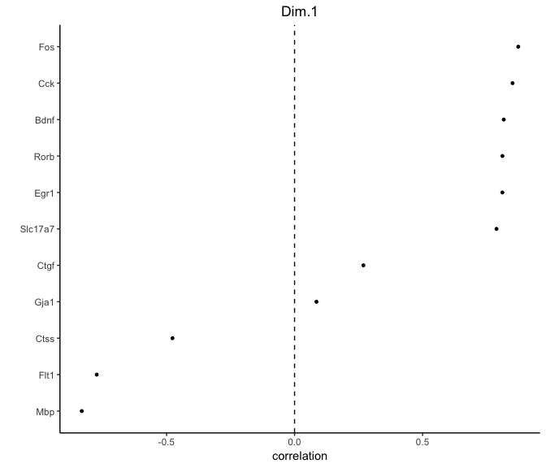

-----

</details>

 

### 8\. spatial network

<details>

<summary>Expand</summary>  

``` r

## create spatial networks based on k and/or distance from centroid
STAR_test <- createSpatialNetwork(gobject = STAR_test, k = 3)
```

``` r
networkplot = visPlot(gobject = STAR_test, show_network = T,
        sdimx = "sdimx",sdimy = "sdimy",sdimz = "sdimz",
        network_color = 'blue', spatial_network_name = 'spatial_network',axis_scale = "real",z_ticks = 2,
        point_size = 4, cell_color = 'cell_types')
htmlwidgets::saveWidget(plotly::as_widget(networkplot), file = paste0(spatnet_folder,'/', 'networkplot.html'))
```

Zoom out 3D network:  


Zoom in 3D network:  

\*\*\*

</details>

 

### 9\. spatial genes

<details>

<summary>Expand</summary>  

``` r
kmtest = binGetSpatialGenes(STAR_test, bin_method = 'kmeans',
                            do_fisher_test = F, community_expectation = 5,
                            spatial_network_name = 'spatial_network', verbose = T)
#> 
#>  1. matrix binarization complete 
#> 
#>  2. average expression and number of high expression cells complete 
#> 
#>  3. fisher test or odds-ratio calculation complete 
#> 
#>  4. community estimate complete, start merging results

ranktest = binGetSpatialGenes(STAR_test, bin_method = 'rank',
                              do_fisher_test = F, community_expectation = 5,
                              spatial_network_name = 'spatial_network', verbose = T)
#> 
#>  1. matrix binarization complete 
#> 
#>  2. average expression and number of high expression cells complete 
#> 
#>  3. fisher test or odds-ratio calculation complete 
#> 
#>  4. community estimate complete, start merging results

visSpatDimGenePlot(STAR_test, plot_method = 'ggplot',
                      genes = c('Cux2', 'Pcp4', 'Gja1', 'Mbp'), plot_alignment = 'vertical', cow_n_col = 4,
                      genes_high_color = 'red', genes_mid_color = 'white', genes_low_color = 'darkblue', midpoint = 8)
```

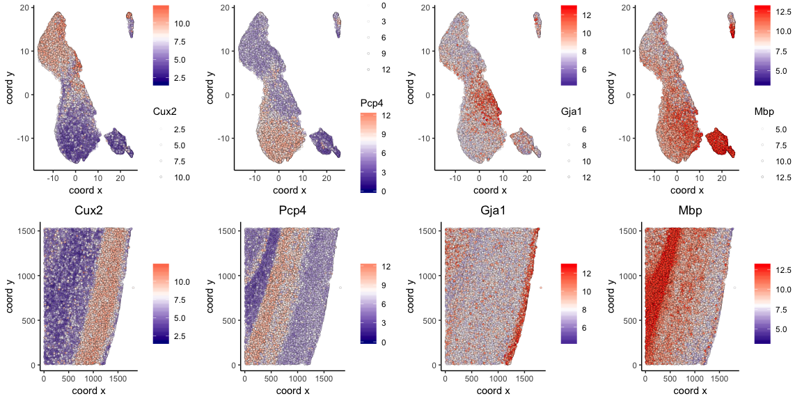

-----

</details>

 

### 10\. HMRF domains

<details>

<summary>Expand</summary>  

Not available at this time.

-----

</details>

 

### 11\. Cell-cell preferential proximity

<details>

<summary>Expand</summary>  


``` r

## calculate frequently seen proximities
cell_proximities = cellProximityEnrichment(gobject = STAR_test,
                                           cluster_column = 'cell_types',
                                           spatial_network_name = 'spatial_network',
                                           number_of_simulations = 400)

cellProximityBarplot(CPscore = cell_proximities, min_orig_ints = 5, min_sim_ints = 5)
```

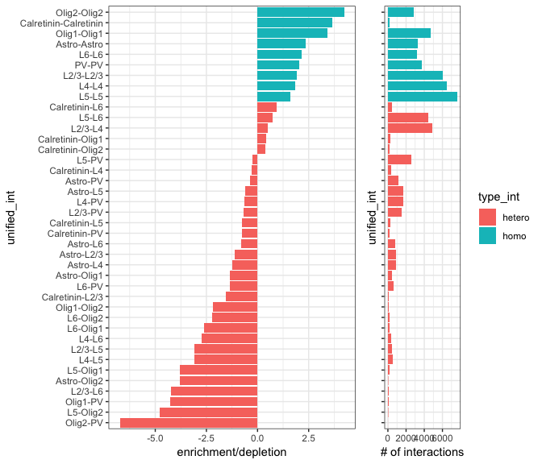

``` r
cellProximityHeatmap(CPscore = cell_proximities, order_cell_types = T, scale = T)
```

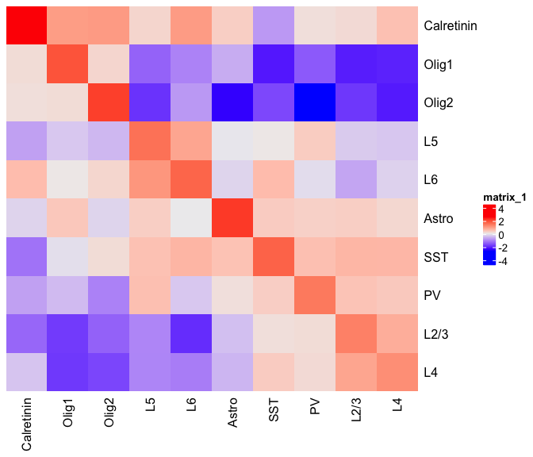

``` r
STAR_astro_pv <- cellProximityVisPlot(gobject = STAR_test, interaction_name = "Astro-PV", spatial_network_name = 'spatial_network',
                                      axis_scale = 'real', 
                                   cluster_column = 'cell_types',
                                   sdimx = "sdimx",sdimy = "sdimy",sdimz = "sdimz",
                                   show_other_cells = F,
                                   cell_color = 'cell_types', 
                                   show_network = T,
                                   network_color = 'blue', 
                                   point_size_select = 4)
htmlwidgets::saveWidget(plotly::as_widget(STAR_astro_pv), file = paste0(cellproxim_folder,'/', 'STAR_astro_pv.html'))
```

Astroycte - PV inhibitory neurons:

Zoom out of selected cell-cell interactions:


Zoom in of selected cell-cell interactions:


-----

</details>
