  - [Giotto global instructions](#giotto-global-instructions)
  - [Data input](#data-input)
  - [part 1: Create Giotto object & process
    data](#part-1-create-giotto-object-process-data)
  - [part 2: dimension reduction](#part-2-dimension-reduction)
  - [part 3: cluster](#part-3-cluster)
  - [part 4: co-visualize](#part-4-co-visualize)
  - [part 5: differential expression](#part-5-differential-expression)
  - [part 6: cell-type annotation](#part-6-cell-type-annotation)
  - [part 7: spatial grid](#part-7-spatial-grid)
  - [part 8: spatial network](#part-8-spatial-network)
  - [part 9: spatial genes](#part-9-spatial-genes)
  - [part 10: HMRF domains](#part-10-hmrf-domains)
  - [part 11: Cell-cell preferential
    proximity](#part-11-cell-cell-preferential-proximity)

<!-- mouse_cortex_1_simple.md is generated from mouse_cortex_1_simple.Rmd Please edit that file -->

### Giotto global instructions

``` r
# this example works with Giotto v.0.1.2
library(Giotto)

# create instructions
my_python_path = "/Users/rubendries/Bin/anaconda3/envs/py36/bin/pythonw"
results_folder = '/path/to/Starmap_neocortex_results/'

instrs = createGiottoInstructions(python_path = my_python_path,
                                  show_plot = F, return_plot = T, save_plot = T,
                                  save_dir = results_folder,
                                  plot_format = 'png',
                                  dpi = 300, height = 9, width = 9)
```

### Data input

[Wang et al.](https://science.sciencemag.org/content/361/6400/eaat5691)
created a 3D spatial expression dataset consisting of 28 genes from
32,845 single cells acquired over multiple rounds in visual cortex
STARmap volumes.

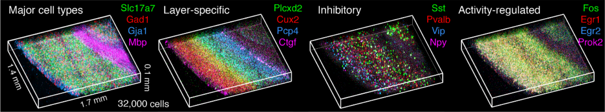 .

``` r
## select the directory where you have saved the Spatial Transcriptomics data
data_dir = '/path/to/Starmap_data/'
expr = read.table(paste0(data_dir, '/', 'STARmap_3D_data_expression.txt'))
cell_loc = read.table(paste0(data_dir, '/', 'STARmap_3D_data_cell_locations.txt'))
```

-----

### part 1: Create Giotto object & process data

<details>

<summary>Expand</summary>  

``` r
## create
STAR_test <- createGiottoObject(raw_exprs = expr, spatial_locs = cell_loc, instructions = instrs)

## filter raw data
# 1. pre-test filter parameters
filterDistributions(STAR_test, detection = 'genes')
filterDistributions(STAR_test, detection = 'cells')
filterCombinations(STAR_test, expression_thresholds = c(1, 1,2), gene_det_in_min_cells = c(20000, 20000, 30000), min_det_genes_per_cell = c(10, 20, 25))
# 2. filter data
STAR_test <- filterGiotto(gobject = STAR_test,
                          gene_det_in_min_cells = 20000,
                          min_det_genes_per_cell = 20)
## normalize
STAR_test <- normalizeGiotto(gobject = STAR_test, scalefactor = 10000, verbose = T)
STAR_test <- addStatistics(gobject = STAR_test)
STAR_test <- adjustGiottoMatrix(gobject = STAR_test, expression_values = c('normalized'),
                                batch_columns = NULL, covariate_columns = c('nr_genes', 'total_expr'),
                                return_gobject = TRUE,
                                update_slot = c('custom'))

# save according to giotto instructions
# 2D
spatPlot2D(gobject = STAR_test,
           save_param = list(save_folder = '2_Gobject', save_name = 'spatial_locations2D', units = 'in'))
spatPlot2D(gobject = STAR_test)

# 3D
spatPlot3D(gobject = STAR_test,
           save_param = list(save_folder = '2_Gobject', save_name = 'spatial_locations3D', units = 'in'))
spatPlot3D(gobject = STAR_test)
```

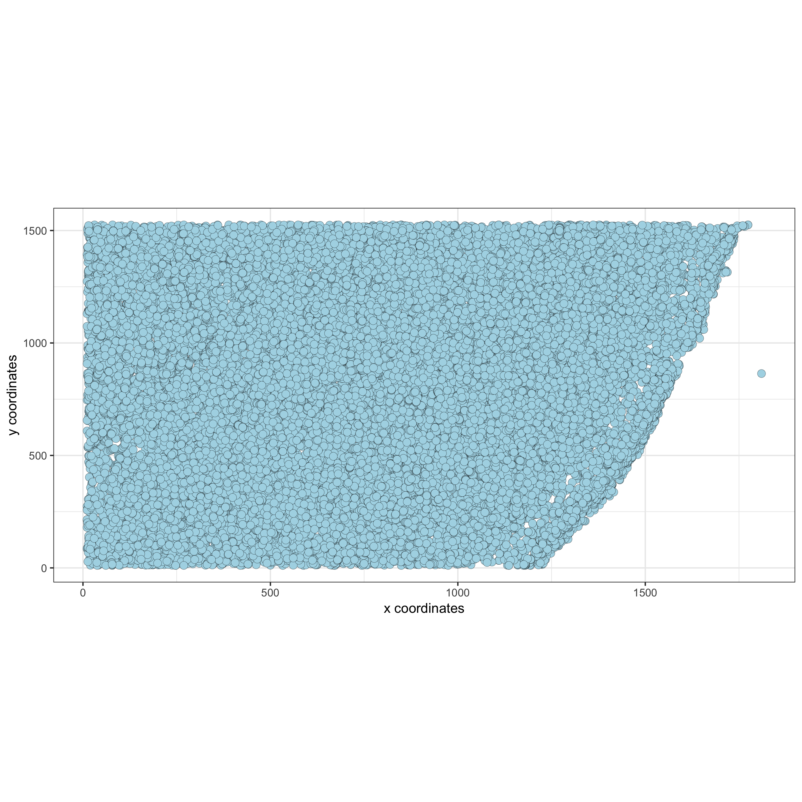

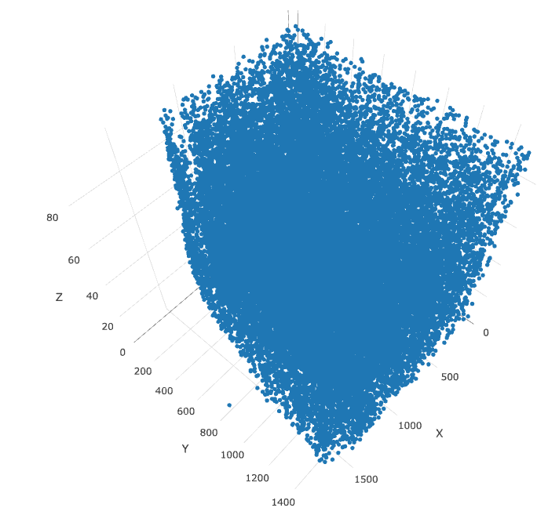

</details>

### part 2: dimension reduction

<details>

<summary>Expand</summary>  

``` r
STAR_test <- calculateHVG(gobject = STAR_test, method = 'cov_groups', zscore_threshold = 0.5, nr_expression_groups = 3)
STAR_test <- runPCA(gobject = STAR_test, genes_to_use = NULL, scale_unit = F)
signPCA(STAR_test)
STAR_test <- runUMAP(STAR_test, dimensions_to_use = 1:8, n_components = 3, n_threads = 4)

plotUMAP_3D(gobject = STAR_test, 
            save_param = list(save_folder = '3_DimRed', save_name = 'UMAP_reduction'))
```

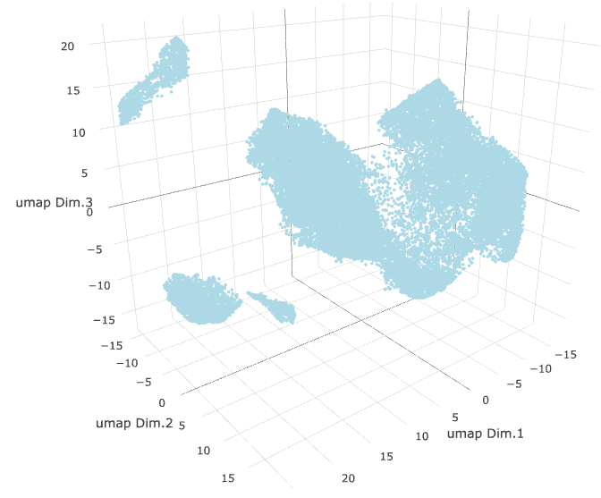

-----

</details>

### part 3: cluster

<details>

<summary>Expand</summary>  

``` r
## sNN network (default)
STAR_test <- createNearestNetwork(gobject = STAR_test, dimensions_to_use = 1:8, k = 15)
## Leiden clustering
STAR_test <- doLeidenCluster(gobject = STAR_test, resolution = 0.2, n_iterations = 100,
                             name = 'leiden_0.2')
plotUMAP_3D(gobject = STAR_test, cell_color = 'leiden_0.2', 
            save_param = list(save_folder = '4_Cluster', save_name = 'UMAP_leiden'))
```

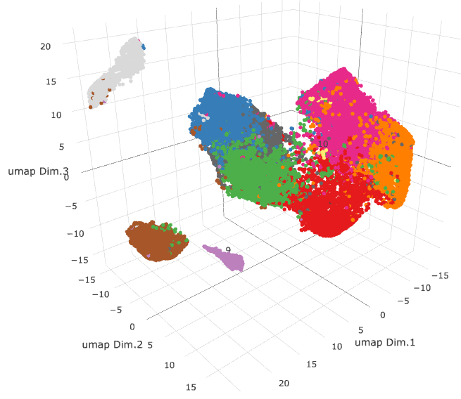

-----

</details>

### part 4: co-visualize

<details>

<summary>Expand</summary>  

``` r
spatDimPlot3D(gobject = STAR_test,
               cell_color = 'leiden_0.2', dim3_to_use = 3,
              save_param = list(save_folder = '5_Covisuals', save_name = 'covis_leiden'))
```

Co-visualzation: 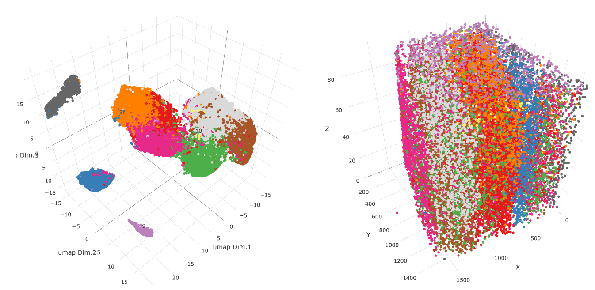

-----

</details>

### part 5: differential expression

<details>

<summary>Expand</summary>  

``` r
markers = findMarkers_one_vs_all(gobject = STAR_test,
                                 method = 'gini',
                                 expression_values = 'normalized',
                                 cluster_column = 'leiden_0.2',
                                 min_genes = 5, rank_score = 2)
markers[, head(.SD, 2), by = 'cluster']


# violinplot
violinPlot(STAR_test, genes = unique(markers$genes), cluster_column = 'leiden_0.2',
           save_param = c(save_name = 'violinplot', save_folder = '6_DEG'))


# cluster heatmap
plotMetaDataHeatmap(STAR_test, expression_values = 'scaled',
                    metadata_cols = c('leiden_0.2'),
                    save_param = c(save_name = 'clusterheatmap', save_folder = '6_DEG'))
```

Gini:

  - violinplot:  
    

  - Heatmap clusters:  
    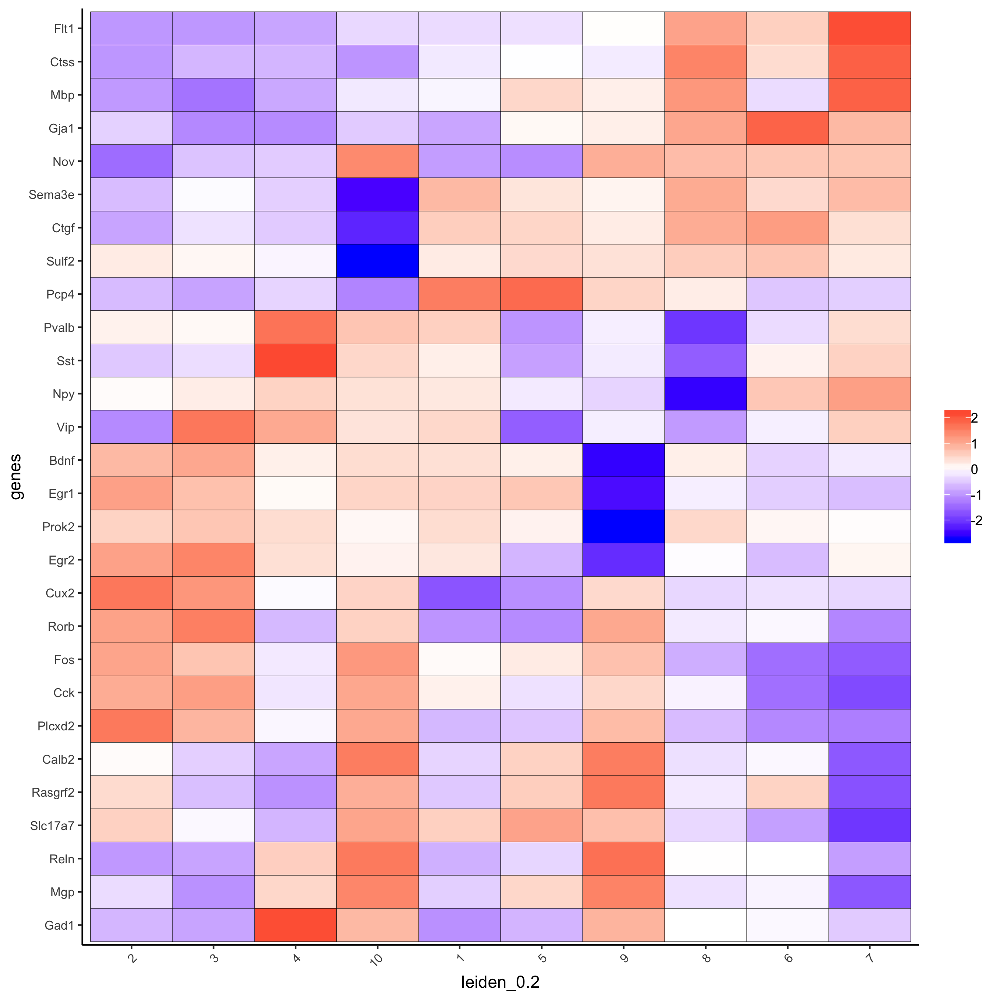

-----

</details>

### part 6: cell-type annotation

<details>

<summary>Expand</summary>  

``` r

## general cell types
clusters_cell_types_cortex = c('excit','excit','excit', 'inh', 'excit',
                               'other', 'other', 'other', 'inh', 'inh')
names(clusters_cell_types_cortex) = c(1:10)
STAR_test = annotateGiotto(gobject = STAR_test, annotation_vector = clusters_cell_types_cortex,
                           cluster_column = 'leiden_0.2', name = 'general_cell_types')

plotMetaDataHeatmap(STAR_test, expression_values = 'scaled',
                    metadata_cols = c('general_cell_types'),
                    save_param = c(save_name = 'heatmap_general_cell_type', save_folder = '7_annotation'))


## detailed cell types
clusters_cell_types_cortex = c('L5','L4','L2/3', 'PV', 'L6',
                               'Astro', 'Olig1', 'Olig2', 'Calretinin', 'SST')
names(clusters_cell_types_cortex) = c(1:10)
STAR_test = annotateGiotto(gobject = STAR_test, annotation_vector = clusters_cell_types_cortex,
                           cluster_column = 'leiden_0.2', name = 'cell_types')

plotUMAP_3D(STAR_test, cell_color = 'cell_types', point_size = 1.5,
            save_param = c(save_name = 'umap_cell_types', save_folder = '7_annotation'))

plotMetaDataHeatmap(STAR_test, expression_values = 'scaled',
                    metadata_cols = c('cell_types'),
                    save_param = c(save_name = 'heatmap_cell_types', save_folder = '7_annotation'))


# create consistent color code
mynames = unique(pDataDT(STAR_test)$cell_types)
mycolorcode = Giotto:::getDistinctColors(n = 10)
names(mycolorcode) = mynames

spatPlot3D(STAR_test, 
           cell_color = 'cell_types', axis_scale = 'real',
           sdimx = 'sdimx', sdimy = 'sdimy', sdimz = 'sdimz',
           show_grid = F, cell_color_code = mycolorcode,
           save_param = c(save_name = 'spatPlot_cell_types_all', save_folder = '7_annotation'))


## subsets
spatPlot3D(STAR_test, 
           cell_color = 'cell_types', axis_scale = 'real',
           sdimx = 'sdimx', sdimy = 'sdimy', sdimz = 'sdimz',
           show_grid = F, cell_color_code = mycolorcode,
           select_cell_groups = c('L6','L5','L4','L2/3'),
           save_param = c(save_name = 'spatPlot_cell_types_excit', save_folder = '7_annotation'))

spatPlot3D(STAR_test, 
           cell_color = 'cell_types', axis_scale = 'real',
           sdimx = 'sdimx', sdimy = 'sdimy', sdimz = 'sdimz',
           show_grid = F, cell_color_code = mycolorcode,
           select_cell_groups = c('PV','Calretinin', 'SST'),
           save_param = c(save_name = 'spatPlot_cell_types_inhib', save_folder = '7_annotation'))

spatPlot3D(STAR_test, 
           cell_color = 'cell_types', axis_scale = 'real',
           sdimx = 'sdimx', sdimy = 'sdimy', sdimz = 'sdimz',
           show_grid = F, cell_color_code = mycolorcode,
           select_cell_groups = c('Astro', 'Olig1', 'Olig2'),
           save_param = c(save_name = 'spatPlot_cell_types_other', save_folder = '7_annotation'))
```

cluster heatmap for general cell types
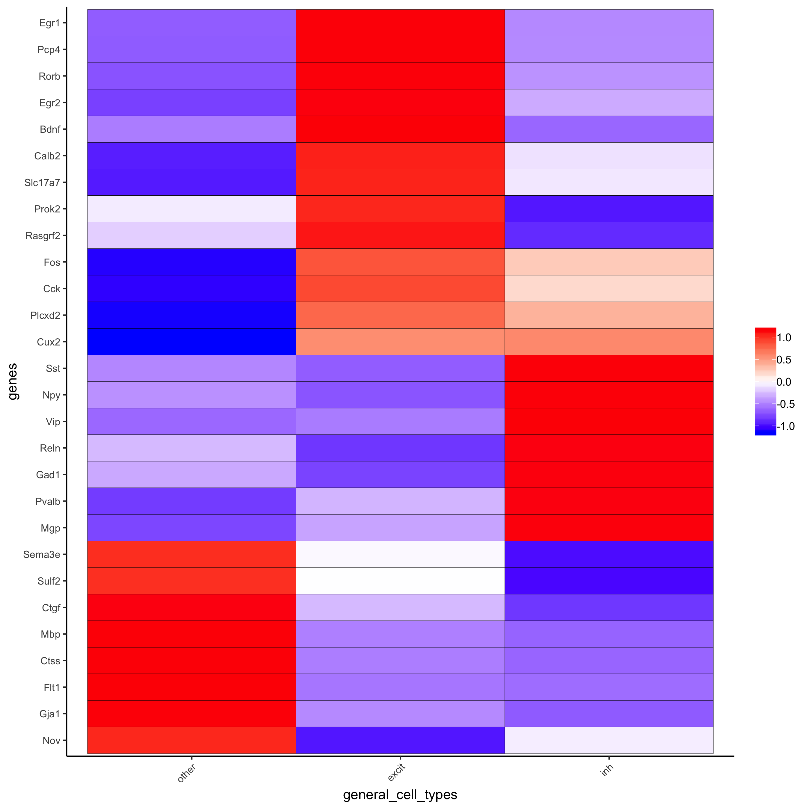

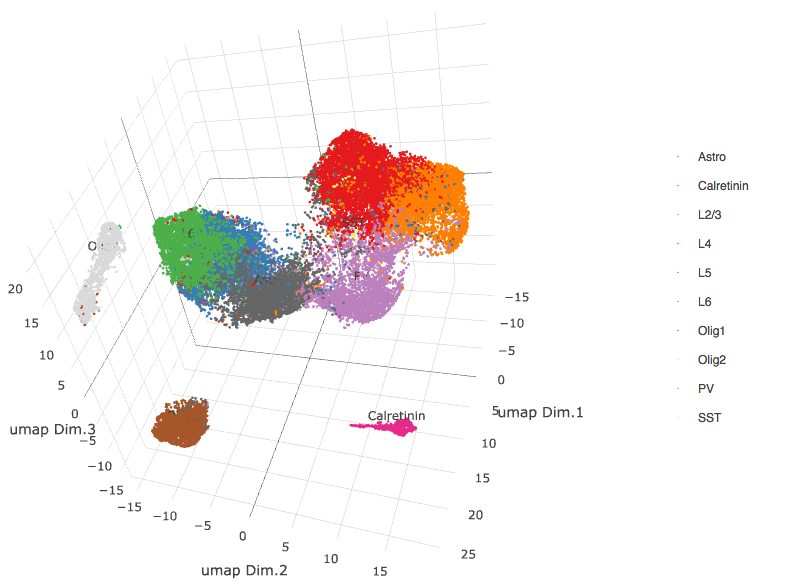

cluster heatmap for specific cell types
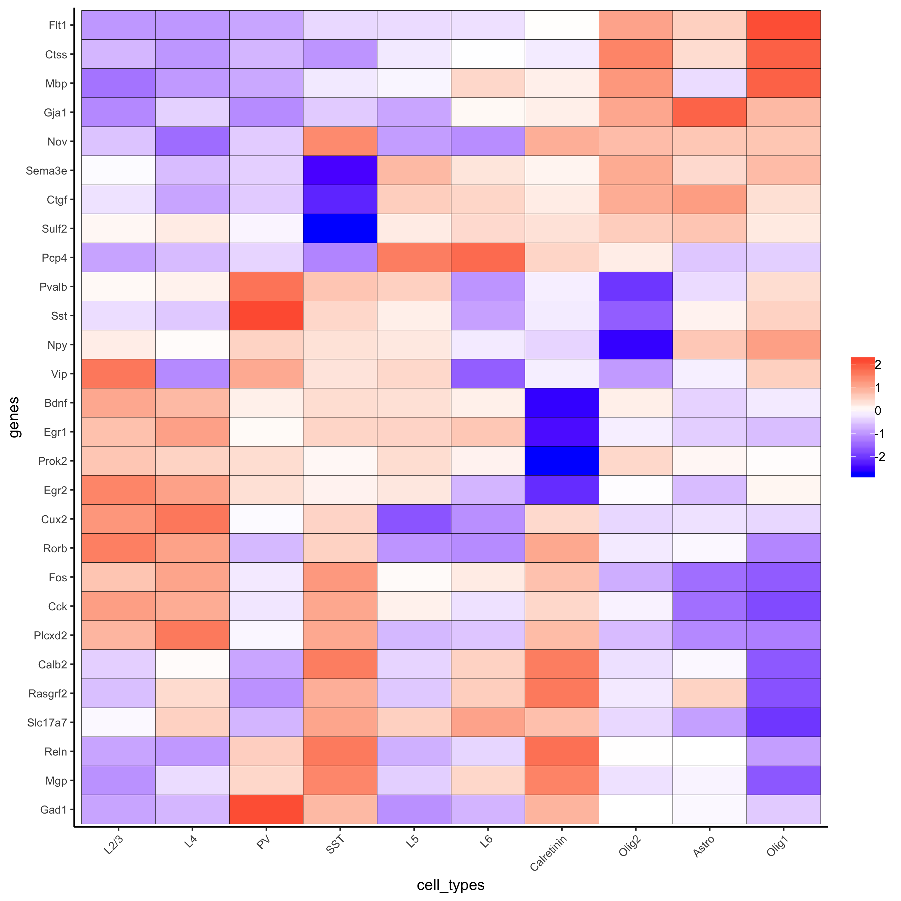

all cells:  
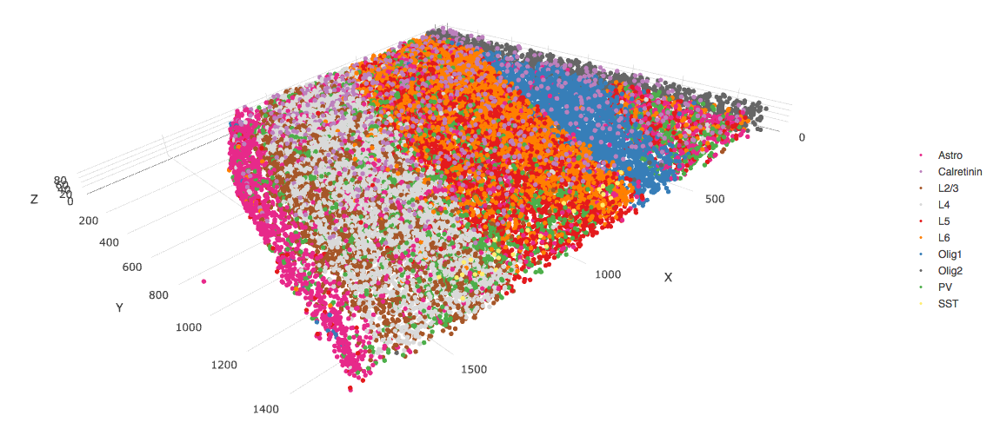

excitatory neurons cells:  
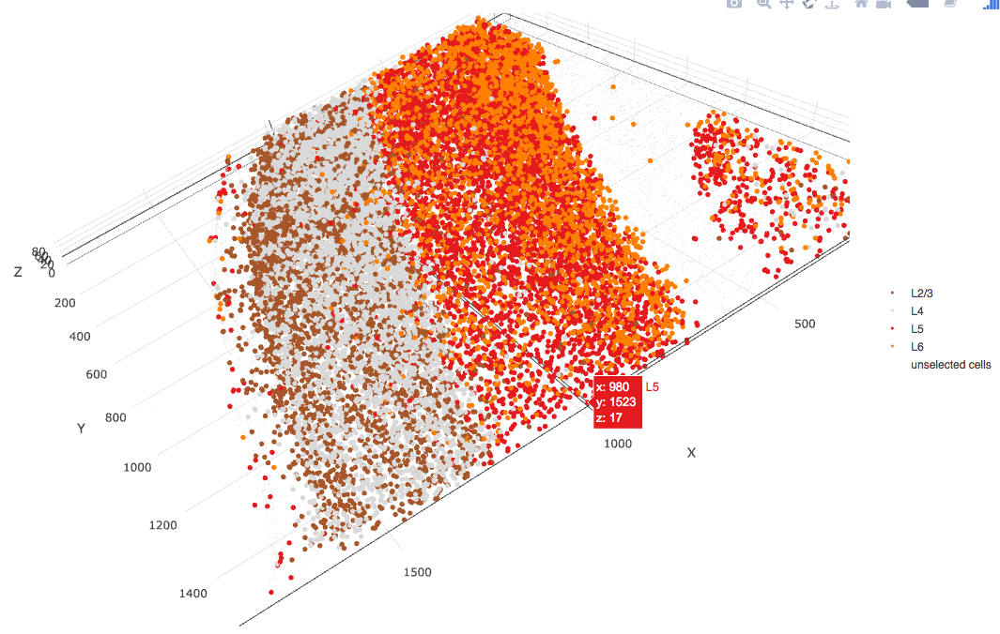

inhibitory neurons cells:  
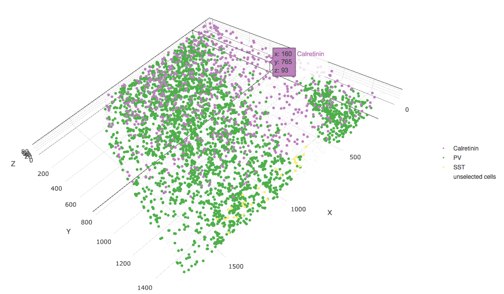

other type of cells:  
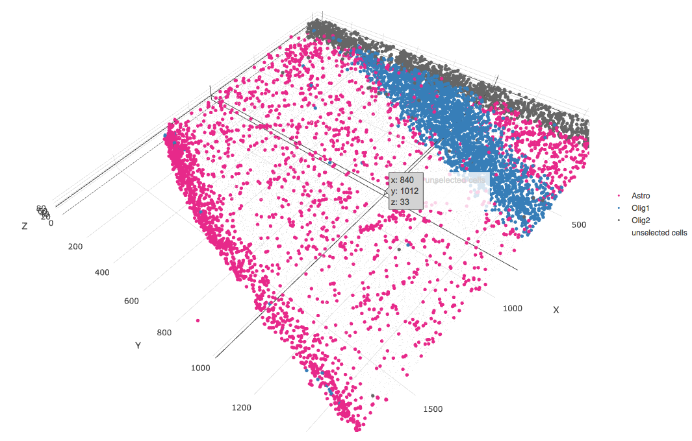

-----

</details>

### part 7: spatial grid

<details>

<summary>Expand</summary>  

``` r
## create spatial grid
STAR_test <- createSpatialGrid(gobject = STAR_test,
                               sdimx_stepsize = 100,
                               sdimy_stepsize = 100,
                               sdimz_stepsize = 20,
                               minimum_padding = 0)

mycolorcode = c('red', 'blue')
names(mycolorcode) = c("L2/3", "L6")

spatPlot3D(STAR_test, cell_color = 'cell_types', 
        show_grid = T, grid_color = 'green', spatial_grid_name = 'spatial_grid',
        point_size = 1.5, 
        select_cell_groups = c("L2/3", "L6"), cell_color_code = mycolorcode,
        save_param = c(save_name = 'grid', save_folder = '8_grid'))

#### spatial patterns ##
pattern_VC = detectSpatialPatterns(gobject = STAR_test, 
                                   expression_values = 'normalized',
                                   spatial_grid_name = 'spatial_grid',
                                   min_cells_per_grid = 5, 
                                   scale_unit = T, 
                                   PC_zscore = 1, 
                                   show_plot = T)

# dimension 1
showPattern3D(gobject = STAR_test,spatPatObj = pattern_VC,
              dimension = 1, point_size = 4,
              save_param = c(save_name = 'dimension1', save_folder = '8_grid'))
showPatternGenes(gobject = STAR_test, spatPatObj = pattern_VC, dimension = 1,
                 save_param = c(save_name = 'dimension1_genes', save_folder = '8_grid',
                                base_height = 3, base_width = 3, dpi = 100))

# dimension 2
showPattern3D(gobject = STAR_test,spatPatObj = pattern_VC,
              dimension = 2, point_size = 4,
              save_param = c(save_name = 'dimension2', save_folder = '8_grid'))
showPatternGenes(gobject = STAR_test, spatPatObj = pattern_VC, dimension = 2,
                 save_param = c(save_name = 'dimension2_genes', save_folder = '8_grid',
                                base_height = 3, base_width = 3, dpi = 100))
```

Dimension 1: no changes over z-axis

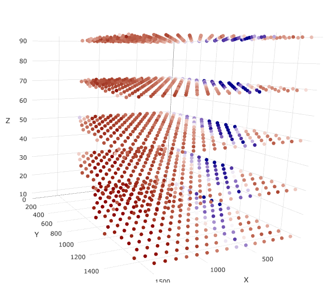


Dimension 2: changes over z-axis

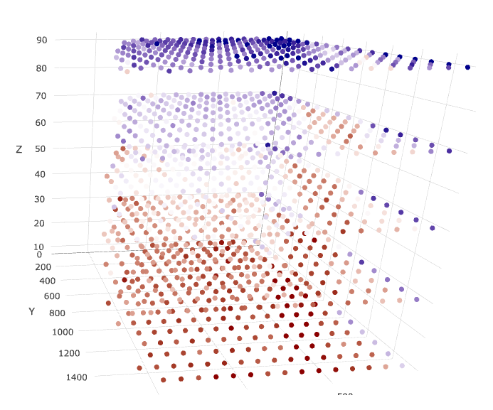

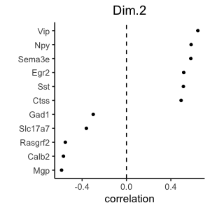

-----

</details>

### part 8: spatial network

<details>

<summary>Expand</summary>  

``` r
STAR_test <- createSpatialNetwork(gobject = STAR_test, k = 10)

spatPlot3D(gobject = STAR_test,
           show_network = T,
           network_color = 'blue', spatial_network_name = 'spatial_network',
           axis_scale = "real", z_ticks = 2,
           point_size = 4, cell_color = 'cell_types',
           save_param = c(save_name = 'network', save_folder = '9_spatial_network'))
```

spatial network:  
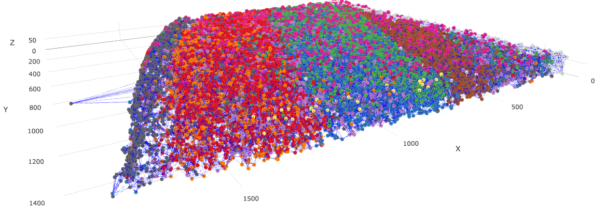

spatial network zoomed in:  
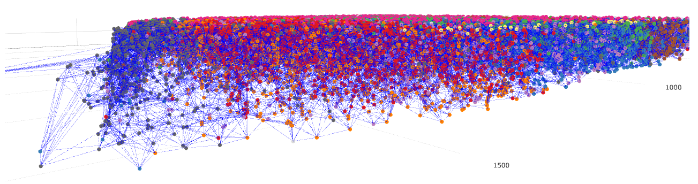

-----

</details>

### part 9: spatial genes

<details>

<summary>Expand</summary>  

``` r
# kmeans binarization
kmtest = binGetSpatialGenes(STAR_test, bin_method = 'kmeans',
                            do_fisher_test = T, community_expectation = 5,
                            spatial_network_name = 'spatial_network', verbose = T)
spatGenePlot2D(STAR_test, expression_values = 'scaled', show_plot = F,
               genes = head(kmtest$genes, 4), point_size = 2, cow_n_col = 2, 
               genes_high_color = 'red', genes_mid_color = 'white', genes_low_color = 'darkblue',
               midpoint = 0, return_plot = F,
               save_param = c(save_name = 'spatial_genes_scaled_km', save_folder = '10_spatial_genes', base_width = 16))

# rank binarization
ranktest = binGetSpatialGenes(STAR_test, bin_method = 'rank',
                              do_fisher_test = T, community_expectation = 5,
                              spatial_network_name = 'spatial_network', verbose = T)
spatGenePlot2D(STAR_test, expression_values = 'scaled', show_plot = F,
               genes = head(ranktest$genes, 4), point_size = 2, cow_n_col = 2, 
               genes_high_color = 'red', genes_mid_color = 'white', genes_low_color = 'darkblue',
               midpoint = 0, return_plot = F,
               save_param = c(save_name = 'spatial_genes_scaled_rank', save_folder = '10_spatial_genes', base_width = 16))

# distance
spatial_genes = calculate_spatial_genes_python(gobject = STAR_test,
                                               expression_values = 'scaled',
                                               rbp_p=0.99, examine_top=0.1)
spatGenePlot2D(STAR_test, expression_values = 'scaled', show_plot = F,
               genes = head(spatial_genes$genes, 4), point_size = 2, cow_n_col = 2, 
               genes_high_color = 'red', genes_mid_color = 'white', genes_low_color = 'darkblue',
               midpoint = 0, return_plot = F,
               save_param = c(save_name = 'spatial_genes_scaled_distance', save_folder = '10_spatial_genes', base_width = 16))
```

Spatial genes:

  - kmeans 

  - rank 

  - distance 

-----

</details>

### part 10: HMRF domains

<details>

<summary>Expand</summary>  

``` r

hmrf_folder = paste0(results_folder,'/','11_HMRF/')
if(!file.exists(hmrf_folder)) dir.create(hmrf_folder, recursive = T)

my_spatial_genes = spatial_genes[1:16]$genes

# do HMRF with different betas
HMRF_spatial_genes = doHMRF(gobject = STAR_test, expression_values = 'scaled',
                            spatial_genes = my_spatial_genes,
                            k = 10,
                            betas = c(0, 0.5, 10), 
                            output_folder = paste0(hmrf_folder, '/', 'Spatial_genes/SG_top100_k10_scaled'),
                            zscore = "rowcol", tolerance=1e-5)

## view results of HMRF
for(i in seq(0, 1, by = 0.5)) {
  viewHMRFresults3D(gobject = STAR_test,
                    HMRFoutput = HMRF_spatial_genes,
                    k = 10, betas_to_view = i,
                    point_size = 2)
}

## add HMRF of interest to giotto object
STAR_test = addHMRF(gobject = STAR_test,
                  HMRFoutput = HMRF_spatial_genes,
                  k = 10, betas_to_add = c(0, 0.5, 1),
                  hmrf_name = 'HMRF')

## visualize
spatPlot2D(gobject = STAR_test, cell_color = 'HMRF_k10_b.0', point_size = 1.5,
           save_param = c(save_name = 'HMRF_k10_b.0', save_folder = '11_HMRF'))
spatPlot3D(gobject = STAR_test, cell_color = 'HMRF_k10_b.0', point_size = 2.5,
           save_param = c(save_name = 'HMRF_k10_b.0_3D', save_folder = '11_HMRF'))

spatPlot2D(gobject = STAR_test, cell_color = 'HMRF_k10_b.0.5', point_size = 1.5,
           save_param = c(save_name = 'HMRF_k10_b.0.5', save_folder = '11_HMRF'))
spatPlot3D(gobject = STAR_test, cell_color = 'HMRF_k10_b.0.5', point_size = 2.5,
```

-----

  - b = 0

2D version:

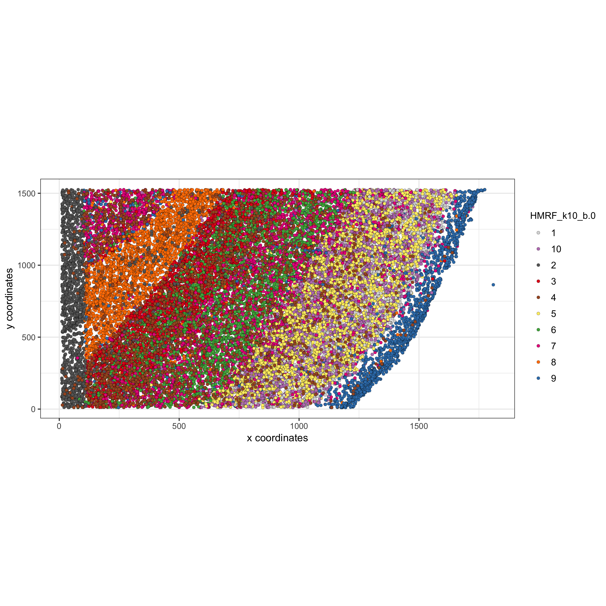

3D version:

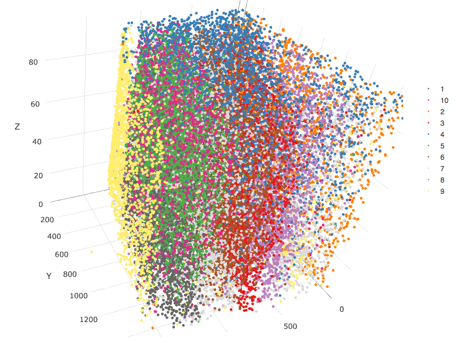

  - b = 0.05

2D version:

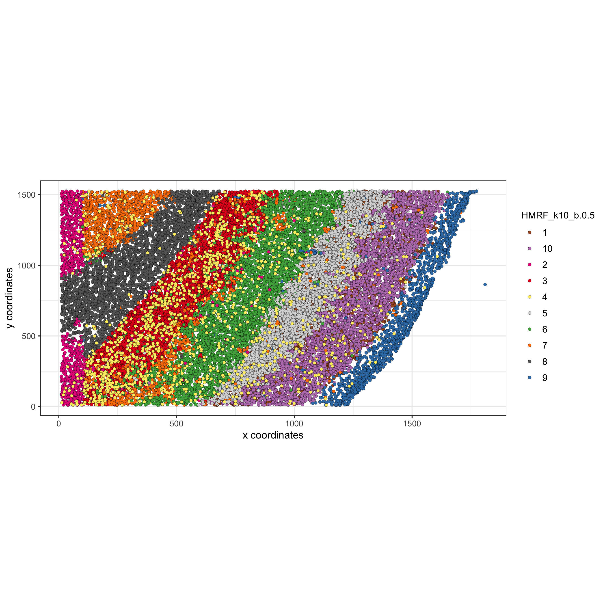

3D version:

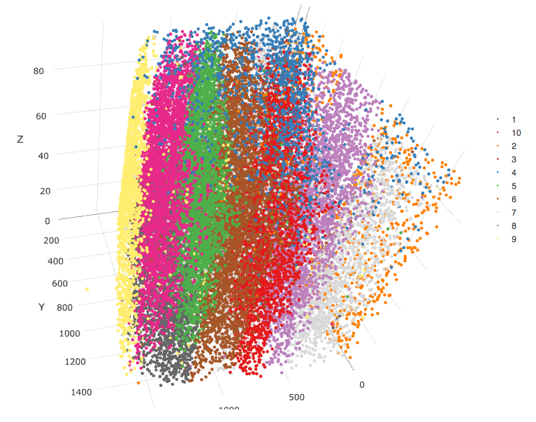

</details>

### part 11: Cell-cell preferential proximity

<details>

<summary>Expand</summary>  

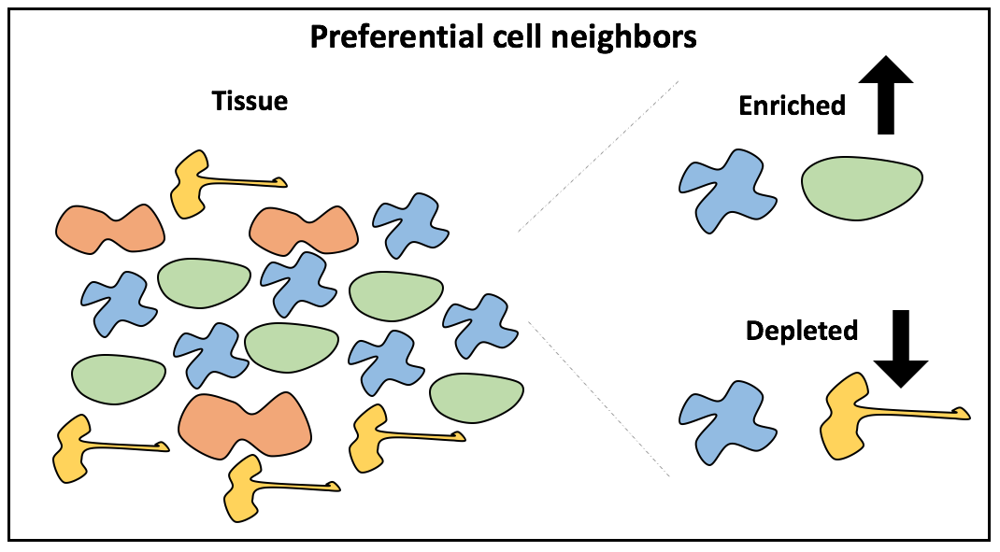

``` r
## calculate frequently seen proximities
cell_proximities = cellProximityEnrichment(gobject = STAR_test,
                                           cluster_column = 'cell_types',
                                           spatial_network_name = 'spatial_network',
                                           number_of_simulations = 400)
## barplot
cellProximityBarplot(gobject = STAR_test, CPscore = cell_proximities, min_orig_ints = 25, min_sim_ints = 25, 
                     save_param = c(save_name = 'barplot_cell_cell_enrichment', save_folder = '12_cell_proxim'))
## heatmap
cellProximityHeatmap(gobject = STAR_test, CPscore = cell_proximities, order_cell_types = T, scale = T,
                     color_breaks = c(-1.5, 0, 1.5), color_names = c('blue', 'white', 'red'),
                     save_param = c(save_name = 'heatmap_cell_cell_enrichment', save_folder = '12_cell_proxim', unit = 'in'))
## network
cellProximityNetwork(gobject = STAR_test, CPscore = cell_proximities, remove_self_edges = T, only_show_enrichment_edges = T,
                     save_param = c(save_name = 'network_cell_cell_enrichment', save_folder = '12_cell_proxim'))


## visualization
spec_interaction = "Calretinin--L6"

# rescaled spatial dimensions
cellProximitySpatPlot3D(gobject = STAR_test,
                        interaction_name = spec_interaction,
                        cluster_column = 'cell_types',
                        cell_color = 'cell_types', coord_fix_ratio = 0.5,
                        point_size_select = 4, point_size_other = 2,
                        save_param = c(save_name = 'cell_cell_enrichment_selected', save_folder = '12_cell_proxim'))

# real spatial dimensions
cellProximitySpatPlot3D(gobject = STAR_test,
                        interaction_name = spec_interaction,
                        cluster_column = 'cell_types',
                        cell_color = 'cell_types', coord_fix_ratio = 0.5,
                        point_size_select = 4, point_size_other = 2, axis_scale = 'real',
                        save_param = c(save_name = 'cell_cell_enrichment_selected_real', save_folder = '12_cell_proxim'))
```

barplot:  
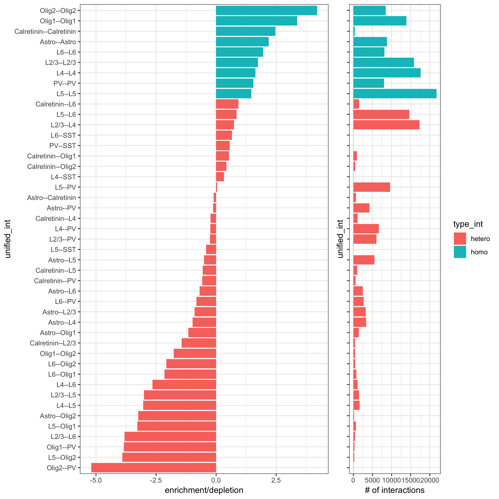

heatmap:  
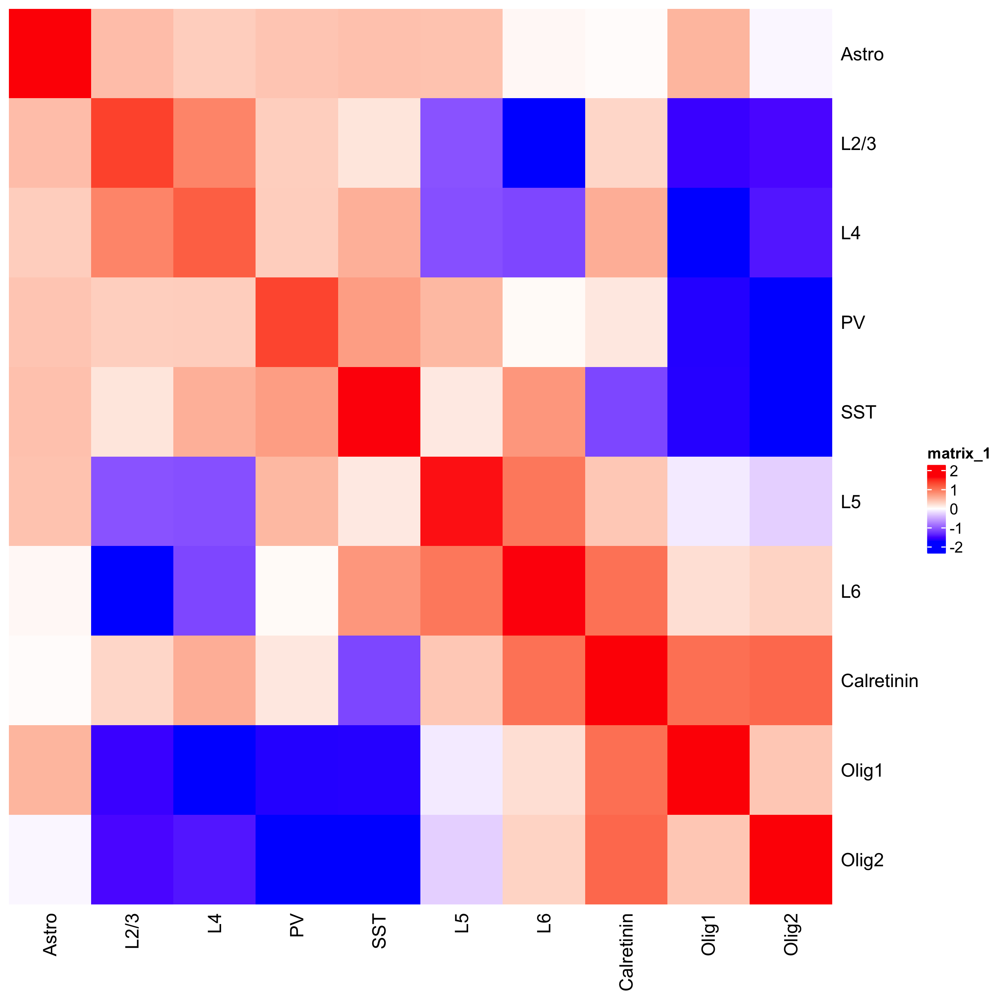

network:  
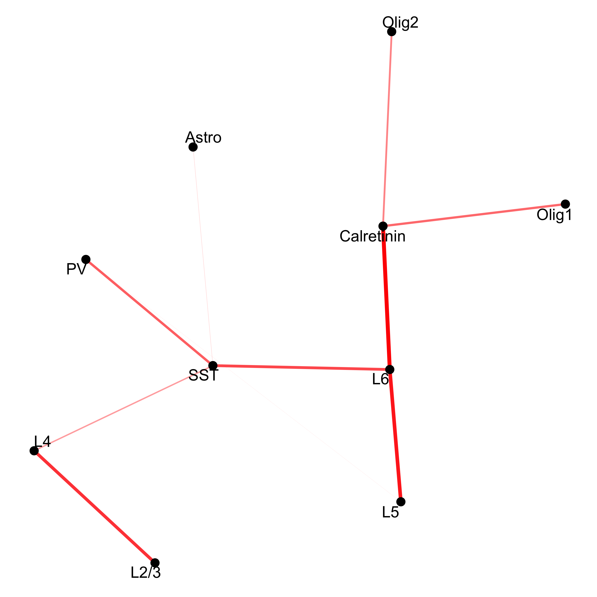

selected enrichment:

  - real dimensions

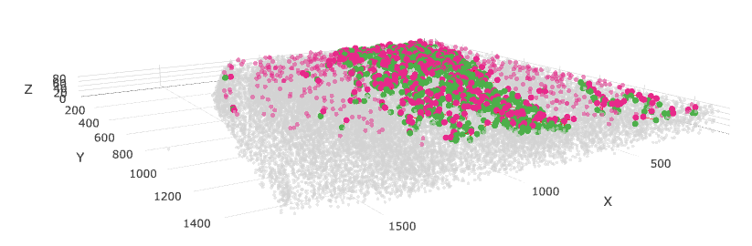

  - rescaled dimensions

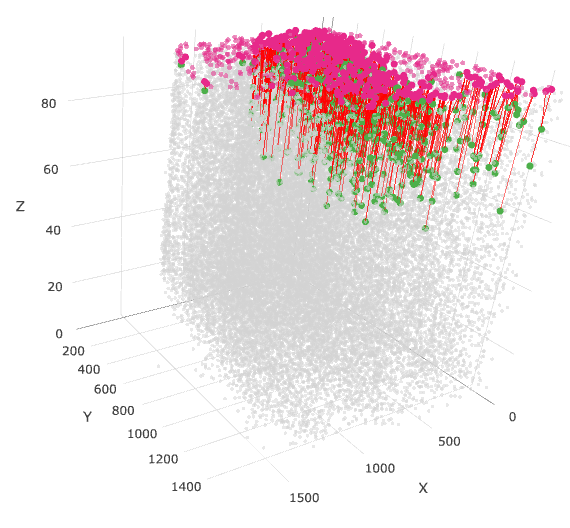

-----

</details>
