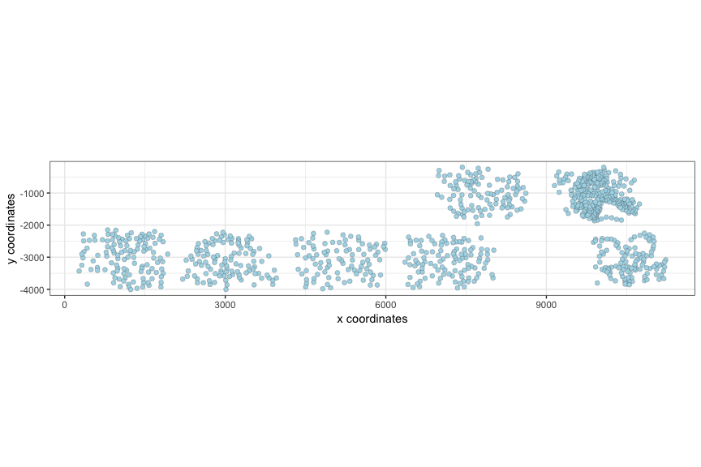
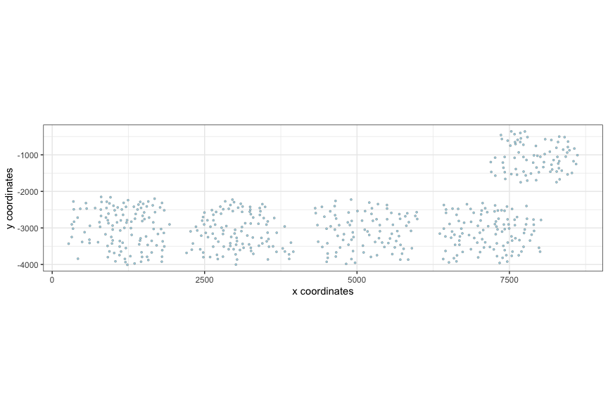

<!-- mouse_cortex_example.md is generated from mouse_cortex_example.Rmd Please edit that file -->

Start from Giotto object from the Mouse Visual Cortex and SVZ:

``` r
visPlot(gobject = VC_test)
```



### 1\. add annotation

### 2\. subset Giotto

  - subset first 500 cells

<!-- end list -->

``` r
cell_metadata = pDataDT(VC_test)
first_500_cells = cell_metadata[1:500][['cell_ID']]

VC_subset = subsetGiotto(VC_test, cell_ids = first_500_cells)

visPlot(gobject = VC_subset)
```


