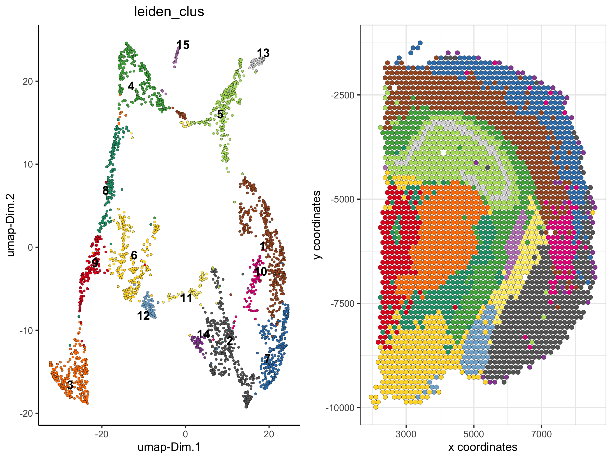
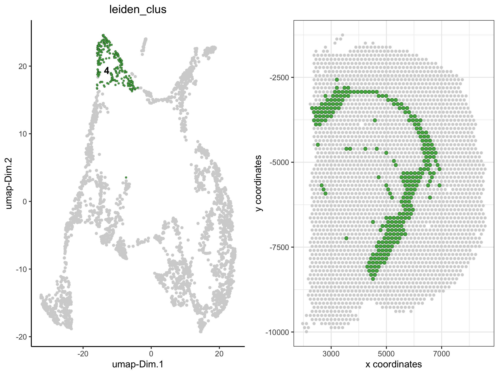
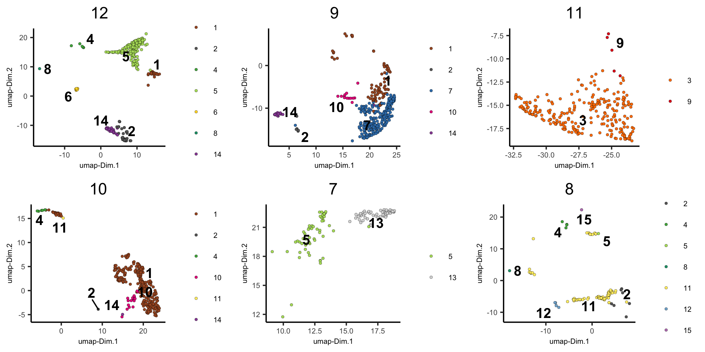
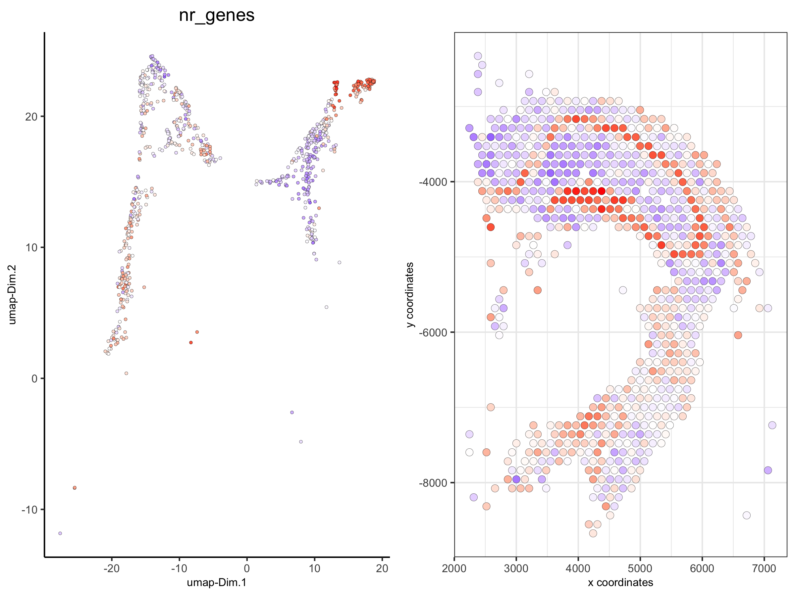

## How to subset a Giotto object?

There are several ways to subset a Giotto object or visualize a subset
of the data. Here we will use the already analyzed [Visium 10X brain
dataset
object](./inst/examples/mouse_visium_brain/mouse_visium_brain_Giotto_v0.1.3.md)
to:  
\- show how to visualize a subset of cells  
\- show how to visualize data by group (example clustering, layers in 3D
images, …)  
\- subset the dataset based on cell IDs (cluster name(s) or individual
cell IDs)  
\- subset the dataset based on spatial locations/coordinates

##### 1\. the Visium 10X whole brain

``` r
spatDimPlot(visium_brain, cell_color = 'leiden_clus',
            plot_alignment = 'horizontal', spat_point_size = 2,
            save_param = list(save_name = '1_whole_brain'))
```



##### 2\. show only a subset of the clusters

``` r
spatDimPlot(visium_brain,
            cell_color = 'leiden_clus',  select_cell_groups = '4',
            plot_alignment = 'horizontal', spat_point_size = 2,
            save_param = list(save_name = '2_whole_brain_clus4'))
```



##### 3\. show only a subset of the clusters, excluding not selected cells

``` r
spatDimPlot(visium_brain,
            cell_color = 'leiden_clus',  select_cell_groups = '4', show_other_cells = F,
            plot_alignment = 'horizontal', spat_point_size = 2,
            save_param = list(save_name = '3_whole_brain_clus4_noOther'))
```


##### 4\. create spatial plots grouped by the leiden clustering result

``` r
spatPlot(visium_brain,
         group_by = 'leiden_clus', group_by_subset = c(1:8),
         cell_color = 'leiden_clus', cow_n_col = 4,
         point_size = 1, axis_text = 6, axis_title = 6, legend_text = 6,
         save_param = list(save_name = '4_whole_brain_by_group_leiden_1', base_height = 4, base_width = 8))

spatPlot(visium_brain,
         group_by = 'leiden_clus', group_by_subset = c(9:16),
         cell_color = 'leiden_clus', cow_n_col = 4,
         point_size = 1, axis_text = 6, axis_title = 6, legend_text = 6,
         save_param = list(save_name = '4_whole_brain_by_group_leiden_2', base_height = 4, base_width = 8))
```


##### 5\. create dimension plots grouped by the HMRF result

``` r
spatDimPlot(visium_brain, cell_color = 'HMRF_k12_b.1',
            plot_alignment = 'horizontal', spat_point_size = 2,
            save_param = list(save_name = '5_whole_brain_HMRF'))

dimPlot(visium_brain,
         group_by = 'HMRF_k12_b.1', group_by_subset = c(1:6),
         cell_color = 'leiden_clus', cow_n_col = 3,
         point_size = 1, axis_text = 6, axis_title = 6, legend_text = 6,
         save_param = list(save_name = '5_whole_brain_by_group_HMRF_1', base_height = 4, base_width = 8))

dimPlot(visium_brain,
        group_by = 'HMRF_k12_b.1', group_by_subset = c(7:14),
        cell_color = 'leiden_clus', cow_n_col = 3,
        point_size = 1, axis_text = 6, axis_title = 6, legend_text = 6,
        save_param = list(save_name = '5_whole_brain_by_group_HMRF_2', base_height = 4, base_width = 8))
```




##### 6\. Create a new Giotto object by subsetting selected clusters

``` r
metadata = pDataDT(visium_brain)
subset_cell_IDs = metadata[leiden_clus %in% c(4, 5, 8, 13)]$cell_ID
visium_brain_small = subsetGiotto(visium_brain, cell_ids = subset_cell_IDs)

spatDimPlot(visium_brain_small,
            cell_color = 'leiden_clus', 
            plot_alignment = 'horizontal', spat_point_size = 2.5,
            save_param = list(save_name = '4_subset_brain'))

spatDimPlot(visium_brain_small,
            cell_color = 'nr_genes', color_as_factor = F,
            plot_alignment = 'horizontal', spat_point_size = 2.5,
            save_param = list(save_name = '5_subset_brain_nr_genes'))
```

Show clusters:  


Show number of genes detected per spot:  


##### 5\. Create a new Giotto object by subsetting based on spatial coordinates/locations

``` r
DG_subset = subsetGiottoLocs(visium_brain,
                             x_max = 6500, x_min = 3000,
                             y_max = -2500, y_min = -5500)

spatDimPlot(DG_subset,
            cell_color = 'leiden_clus', 
            plot_alignment = 'horizontal', spat_point_size = 4,
            save_param = list(save_name = '6_DG_loc_subset', base_height = 4))
```


