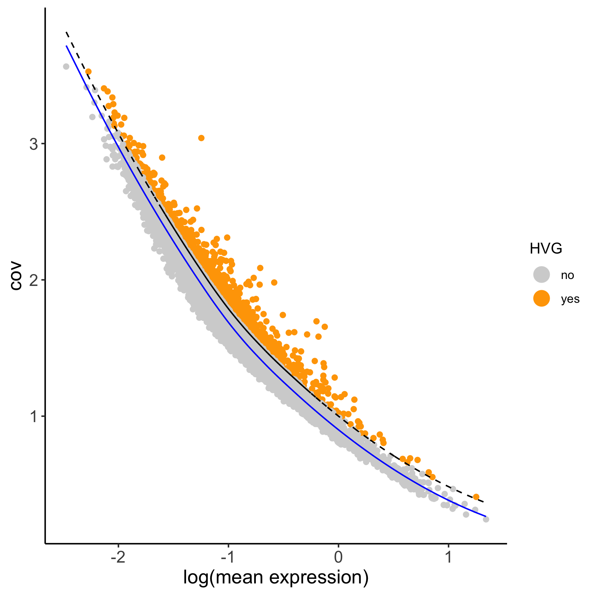
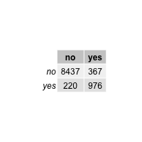
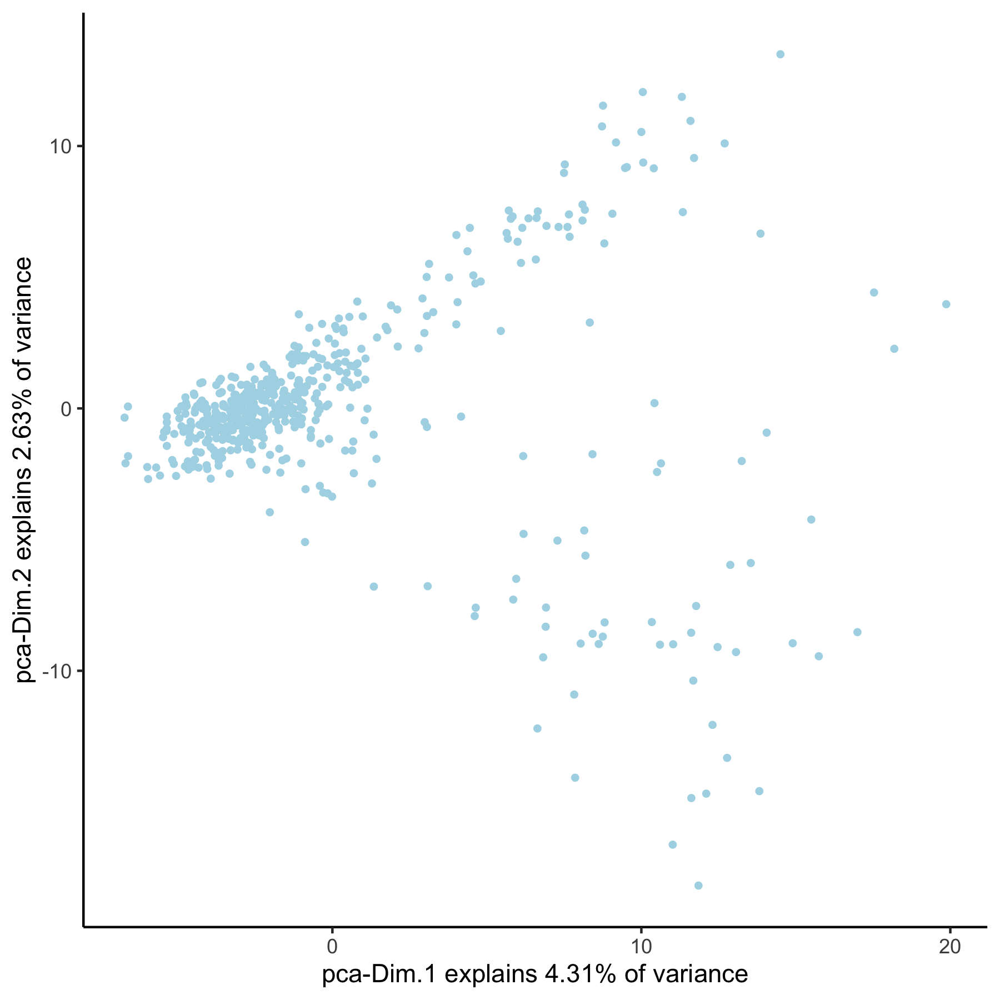
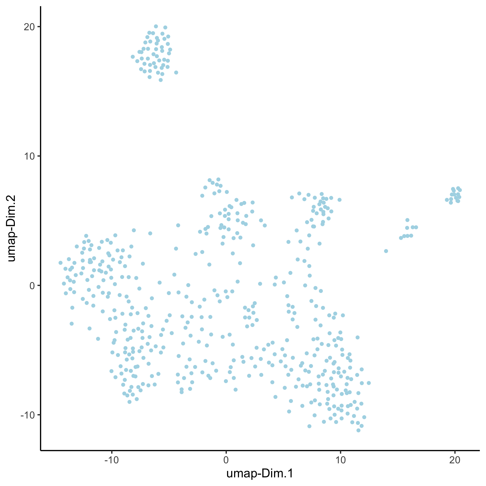

## How to run and store multiple analyses?

The default Giotto workflow is similar to other scRNA-seq workflows and does not require you to provide a custom name for each analysis (e.g. PCA, UMAP, ...), but running an analysis twice will overwrite the previous results with a warning. However, there are situations where being able to run and store multiple analyses can be advantageous:  
- test multiple parameters for a single analysis  
- test multiple combinations across functions (see example **hvg->pca->umap**)  
- use different output results as input for downstream analyses (see example **spatial genes**)  

{width=20cm}

We will use the seqFish+ somatosensory cortex as an example dataset after creating and processing a [Giotto object](./inst/examples/mouse_cortex_svz/seqfish_cortex_Giotto_v0.1.2_update.md).


##### 1. calculate highly variable genes in two different manners   
```{r, eval=FALSE}

# using the loess method
VC_test <- calculateHVG(gobject = VC_test,
                        method = 'cov_loess', difference_in_cov = 0.1,
                        HVGname = 'loess_hvg')
# using the expression groups method
VC_test <- calculateHVG(gobject = VC_test
                        , method = 'cov_group', zscore_threshold = 1,
                        HVGname = 'group_hvg')

# compare the highly variable genes between two methods
gene_metadata = fDataDT(VC_test)
mytable = table(loess = gene_metadata$loess_hvg, group = gene_metadata$group_hvg)
```

loess method:  


group method:  


comparison table:  


##### 2. perform PCA 
- using the 2 different HVG sets  (loess_genes and group_genes)
- store PCA results using custom names  ('pca_loess' and 'pca_group')
- plot PCA results  
```{r, eval=FALSE}
## 2. PCA ##
# pca with genes from loess
loess_genes = gene_metadata[loess_hvg == 'yes']$gene_ID
VC_test <- runPCA(gobject = VC_test, genes_to_use = loess_genes, name = 'pca_loess', scale_unit = F)
plotPCA(gobject = VC_test, dim_reduction_name = 'pca_loess')

# pca with genes from group
group_genes = gene_metadata[group_hvg == 'yes']$gene_ID
VC_test <- runPCA(gobject = VC_test, genes_to_use = group_genes, name = 'pca_group', scale_unit = F)
plotPCA(gobject = VC_test, dim_reduction_name = 'pca_group')
```

loess PCA:    


group PCA:    


##### 3. perform UMAP 
- using the 2 different PCA results  ('pca_loess' and 'pca_group')  
- store UMAP results using custom names ('umap_loess' and 'umap_group')  
- plot UMAP results  
```{r, eval=FALSE}
## 3. UMAP ##
VC_test <- runUMAP(VC_test, dim_reduction_to_use = 'pca', dim_reduction_name = 'pca_loess',
                   name = 'umap_loess', dimensions_to_use = 1:30)
plotUMAP(gobject = VC_test, dim_reduction_name = 'umap_loess')

VC_test <- runUMAP(VC_test, dim_reduction_to_use = 'pca', dim_reduction_name = 'pca_group',
                   name = 'umap_group', dimensions_to_use = 1:30)
plotUMAP(gobject = VC_test, dim_reduction_name = 'umap_group')
```

loess UMAP:    


group UMAP:    


##### 4. Create spatial network 
- create spatial with multiple k's and other parameters  (k=5, k=10, k=100 & maximum_distance=200)
- subset field 1  
- visualize network on field 1  ('spatial_network', 'large_network', 'distance_work')
```{r, eval=FALSE}
## 4. spatial network
VC_test <- createSpatialNetwork(gobject = VC_test, k = 5) # standard name: 'spatial_network'
VC_test <- createSpatialNetwork(gobject = VC_test, k = 10, name = 'large_network')
VC_test <- createSpatialNetwork(gobject = VC_test, k = 100, maximum_distance = 200,
                                minimum_k = 2, name = 'distance_network')

## visualize different spatial networks on first field (~ layer 1)
cell_metadata = pDataDT(VC_test)
field1_ids = cell_metadata[Field_of_View == 0]$cell_ID
subVC_test = subsetGiotto(VC_test, cell_ids = field1_ids)

spatPlot(gobject = subVC_test, show_network = T,
         network_color = 'blue', spatial_network_name = 'spatial_network')

spatPlot(gobject = subVC_test, show_network = T,
         network_color = 'blue', spatial_network_name = 'large_network')

spatPlot(gobject = subVC_test, show_network = T,
         network_color = 'blue', spatial_network_name = 'distance_network')
```


spatial network:      


large network:      
  


distance network:      
  


##### 5. Find spatial genes
- use the different spatial networks as input to identify spatial genes with the rank method 
- visualize top spatial genes for 2 methods
```{r, eval=FALSE}
## 5. spatial genes
# the provided spatial_network_name can be given to downstream analyses

# spatial genes based on large network
ranktest_large = binGetSpatialGenes(VC_test,
                                    subset_genes = loess_genes,
                                    bin_method = 'rank',
                                    do_fisher_test = T,
                                    community_expectation = 5,
                                    spatial_network_name = 'large_network',
                                    verbose = T)
spatGenePlot(VC_test,
             expression_values = 'scaled',
             genes = ranktest_large$genes[1:6], cow_n_col = 2, point_size = 1,
             genes_high_color = 'red', genes_mid_color = 'white', genes_low_color = 'darkblue', midpoint = 0)


# spatial genes based on distance network
ranktest_dist = binGetSpatialGenes(VC_test,
                                    subset_genes = loess_genes,
                                    bin_method = 'rank',
                                    do_fisher_test = T,
                                    community_expectation = 5,
                                    spatial_network_name = 'distance_network',
                                    verbose = T)
spatGenePlot(VC_test,
             expression_values = 'scaled',
             genes = ranktest_dist$genes[1:6], cow_n_col = 2, point_size = 1,
             genes_high_color = 'red', genes_mid_color = 'white', genes_low_color = 'darkblue', midpoint = 0)
```


large network spatial genes:        


distance network spatial genes:        
  
