```{r, eval=FALSE}
# Ensure Giotto Suite is installed.
if(!"Giotto" %in% installed.packages()) {
  devtools::install_github("drieslab/Giotto@suite")
}

# Ensure GiottoData, a small, helper module for tutorials, is installed.
if(!"GiottoData" %in% installed.packages()) {
  devtools::install_github("drieslab/GiottoData")
}

library(Giotto)
# Ensure the Python environment for Giotto has been installed.
genv_exists = checkGiottoEnvironment()
if(!genv_exists){
  # The following command need only be run once to install the Giotto environment.
  installGiottoEnvironment()
}
```


# Set up Giotto environment


```{r, eval=FALSE}
library(Giotto)
library(GiottoData)

# 1. set working directory
results_folder = 'path/to/result'

# Optional: Specify a path to a Python executable within a conda or miniconda 
# environment. If set to NULL (default), the Python executable within the previously
# installed Giotto environment will be used.
my_python_path = NULL # alternatively, "/local/python/path/python" if desired.
```


# Dataset explanation

The CODEX data to run this tutorial can be found [here](https://github.com/drieslab/spatial-datasets/tree/master/data/2018_codex_spleen). Alternatively you can use the **getSpatialDataset** to automatically
download this dataset like we do in this example.

[Goltsev et al.](https://www.cell.com/cell/pdf/S0092-8674(18)30904-8.pdf) created a multiplexed datasets of normal and lupus (MRL/lpr) murine spleens using CODEX technique. The dataset consists of 30 protein markers from 734,101
single cells. In this tutorial, 83,787 cells from sample "BALBc-3" were
selected for the analysis.


```{r, eval=FALSE}
# download data to working directory
# use method = 'wget' if wget is available. This should be much faster.
# if you run into authentication issues with wget, then add " extra = '--no-check-certificate' "
getSpatialDataset(dataset = 'codex_spleen', directory = results_folder, method = 'wget')
```


# 1. Giotto global instructions and preparations


```{r, eval=FALSE}
# 1. (optional) set Giotto instructions
instrs = createGiottoInstructions(show_plot = FALSE,
                                  save_plot = TRUE,
                                  save_dir = results_folder,
                                  python_path = my_python_path)

# 2. create giotto object from provided paths ####
expr_path = paste0(results_folder, "codex_BALBc_3_expression.txt.gz")
loc_path = paste0(results_folder, "codex_BALBc_3_coord.txt")
meta_path = paste0(results_folder, "codex_BALBc_3_annotation.txt")
```


# 2. Create Giotto object & process data


```{r, eval=FALSE}
# read in data information

# expression info
codex_expression = readExprMatrix(expr_path, transpose = F)
# cell coordinate info
codex_locations = data.table::fread(loc_path)
# metadata
codex_metadata = data.table::fread(meta_path)

## stitch x.y tile coordinates to global coordinates 
xtilespan = 1344;
ytilespan = 1008;
# TODO: expand the documentation and input format of stitchTileCoordinates. Probably not enough information for new users.
stitch_file = stitchTileCoordinates(location_file = codex_metadata,
                                    Xtilespan = xtilespan,
                                    Ytilespan = ytilespan)
codex_locations = stitch_file[,.(Xcoord, Ycoord)]

# create Giotto object
codex_test <- createGiottoObject(expression = codex_expression, 
                                 spatial_locs = codex_locations,
                                 instructions = instrs)
codex_metadata$cell_ID<- as.character(codex_metadata$cellID)
codex_test<-addCellMetadata(codex_test, new_metadata = codex_metadata,
                           by_column = T,
                           column_cell_ID = "cell_ID")
# subset Giotto object
cell_meta = pDataDT(codex_test)
cell_IDs_to_keep = cell_meta[Imaging_phenotype_cell_type != "dirt" & Imaging_phenotype_cell_type != "noid" & Imaging_phenotype_cell_type != "capsule",]$cell_ID
codex_test = subsetGiotto(codex_test,
                          cell_ids = cell_IDs_to_keep)

## filter
codex_test <- filterGiotto(gobject = codex_test,
                           expression_threshold = 1,
                           feat_det_in_min_cells = 10,
                           min_det_feats_per_cell = 2,
                           expression_values = c('raw'),
                           verbose = T)

codex_test <- normalizeGiotto(gobject = codex_test,
                              scalefactor = 6000,
                              verbose = T,
                              log_norm = FALSE,
                              library_size_norm = FALSE,
                              scale_feats = FALSE,
                              scale_cells = TRUE)

## add gene & cell statistics
codex_test <- addStatistics(gobject = codex_test,expression_values = "normalized")

## adjust expression matrix for technical or known variables
codex_test <- adjustGiottoMatrix(gobject = codex_test, 
                                 expression_values = c('normalized'),
                                 batch_columns = 'sample_Xtile_Ytile', 
                                 covariate_columns = NULL,
                                 return_gobject = TRUE,
                                 update_slot = c('custom'))

## visualize
spatPlot(gobject = codex_test,point_size = 0.1, 
         coord_fix_ratio = NULL,point_shape = 'no_border',
         save_param = list(save_name = '2_a_spatPlot'))
```


Show different regions of the dataset


```{r, eval=FALSE}
spatPlot(gobject = codex_test,
         point_size = 0.2,
         coord_fix_ratio = 1,
         cell_color = 'sample_Xtile_Ytile',
         legend_symbol_size = 3,
         legend_text = 5,
         save_param = list(save_name = '2_b_spatPlot'))
```


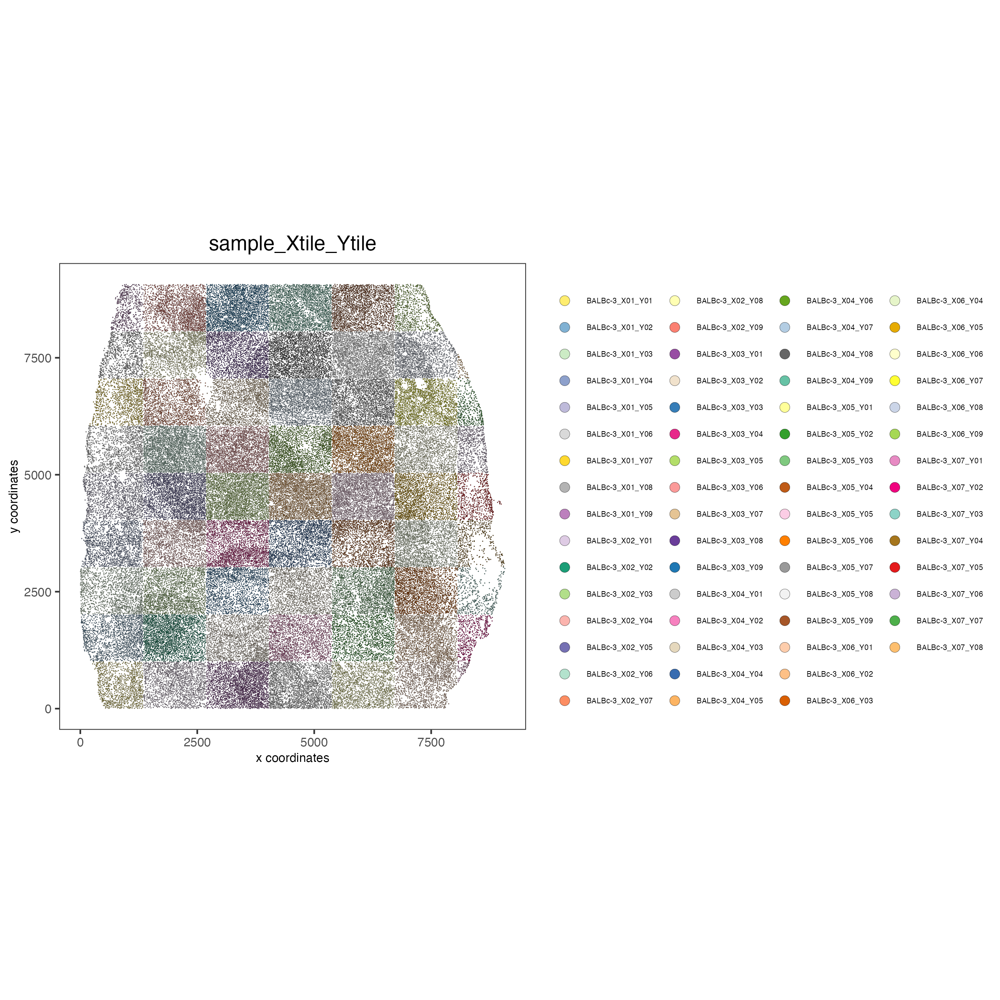

# 3. Dimension reduction


```{r, eval=FALSE}
# use all Abs

# PCA
codex_test <- runPCA(gobject = codex_test,
                     expression_values = 'normalized',
                     scale_unit = T,
                     method = "factominer")
signPCA(codex_test,
        scale_unit = T,
        scree_ylim = c(0, 3),
        save_param = list(save_name = '3_a_spatPlot'))
```


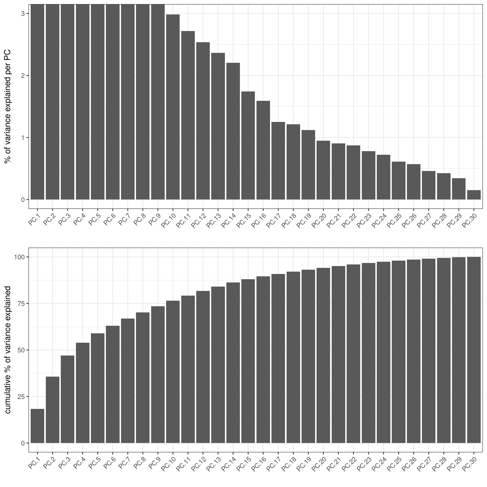


```{r, eval=FALSE}
plotPCA(gobject = codex_test,
        point_shape = 'no_border',
        point_size = 0.2,
        save_param = list(save_name = '3_b_PCA'))
```


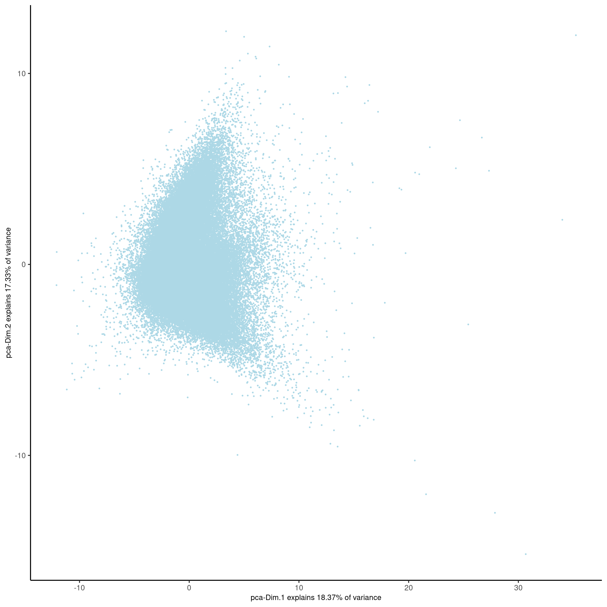


```{r, eval=FALSE}
# UMAP
codex_test <- runUMAP(codex_test,
                      dimensions_to_use = 1:14,
                      n_components = 2,
                      n_threads = 12)
plotUMAP(gobject = codex_test,
         point_shape = 'no_border',
         point_size = 0.2,
         save_param = list(save_name = '3_c_UMAP'))
```


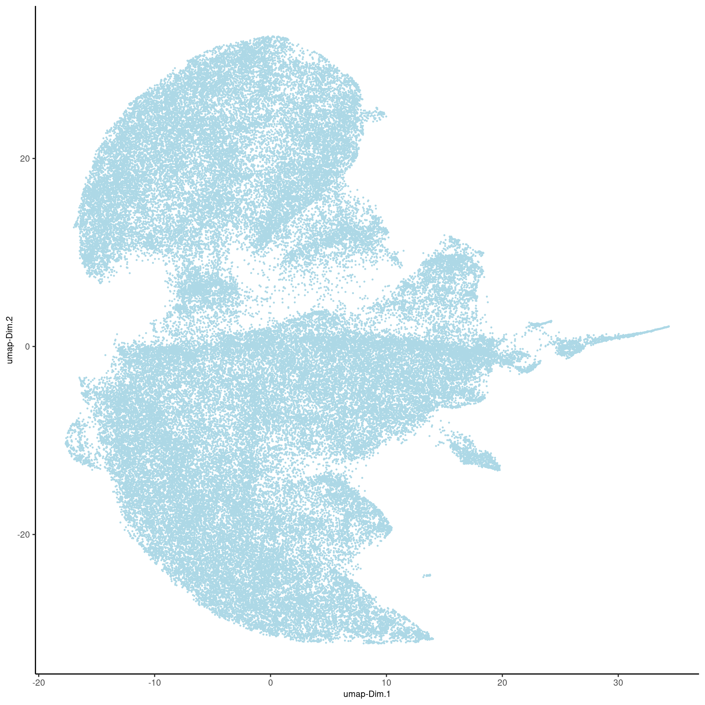

# 4. Cluster


```{r, eval=FALSE}
## sNN network (default)
codex_test <- createNearestNetwork(gobject = codex_test,
                                   dimensions_to_use = 1:14,
                                   k = 20)

## 0.1 resolution
codex_test <- doLeidenCluster(gobject = codex_test,
                              resolution = 0.5,
                              n_iterations = 100,
                              name = 'leiden')

codex_metadata = pDataDT(codex_test)
leiden_colors = GiottogetDistinctColors(length(unique(codex_metadata$leiden)))
names(leiden_colors) = unique(codex_metadata$leiden)

plotUMAP(gobject = codex_test, 
         cell_color = 'leiden',
         point_shape = 'no_border',
         point_size = 0.2,
         cell_color_code = leiden_colors,
         save_param = list(save_name = '4_a_UMAP'))
```


```{r, eval=FALSE}
spatPlot(gobject = codex_test,
         cell_color = 'leiden',
         point_shape = 'no_border',
         point_size = 0.2, 
         cell_color_code = leiden_colors,
         coord_fix_ratio = 1,
         label_size =2,
         legend_text = 5,
         legend_symbol_size = 2,
         save_param = list(save_name = '4_b_spatplot'))
```


# 5. Co-visualize


```{r, eval=FALSE}
spatDimPlot2D(gobject = codex_test,
              cell_color = 'leiden',
              spat_point_shape = 'no_border', 
              spat_point_size = 0.2,
              dim_point_shape = 'no_border',
              dim_point_size = 0.2, 
              cell_color_code = leiden_colors,
              plot_alignment = c("horizontal"),
              save_param = list(save_name = '5_a_spatdimplot'))
```


# 6. Differential expression


```{r, eval=FALSE}
cluster_column = 'leiden'
markers_scran = findMarkers_one_vs_all(gobject=codex_test,
                                       method="scran",
                                       expression_values="normalized",
                                       cluster_column=cluster_column,
                                       min_feats=3)
markergenes_scran = unique(markers_scran[, head(.SD, 5), by="cluster"][["feats"]])

plotMetaDataHeatmap(codex_test,
                    expression_values = "normalized",
                    metadata_cols = c(cluster_column), 
                    selected_feats = markergenes_scran,
                    y_text_size = 8,
                    show_values = 'zscores_rescaled',
                    save_param = list(save_name = '6_a_metaheatmap'))
```


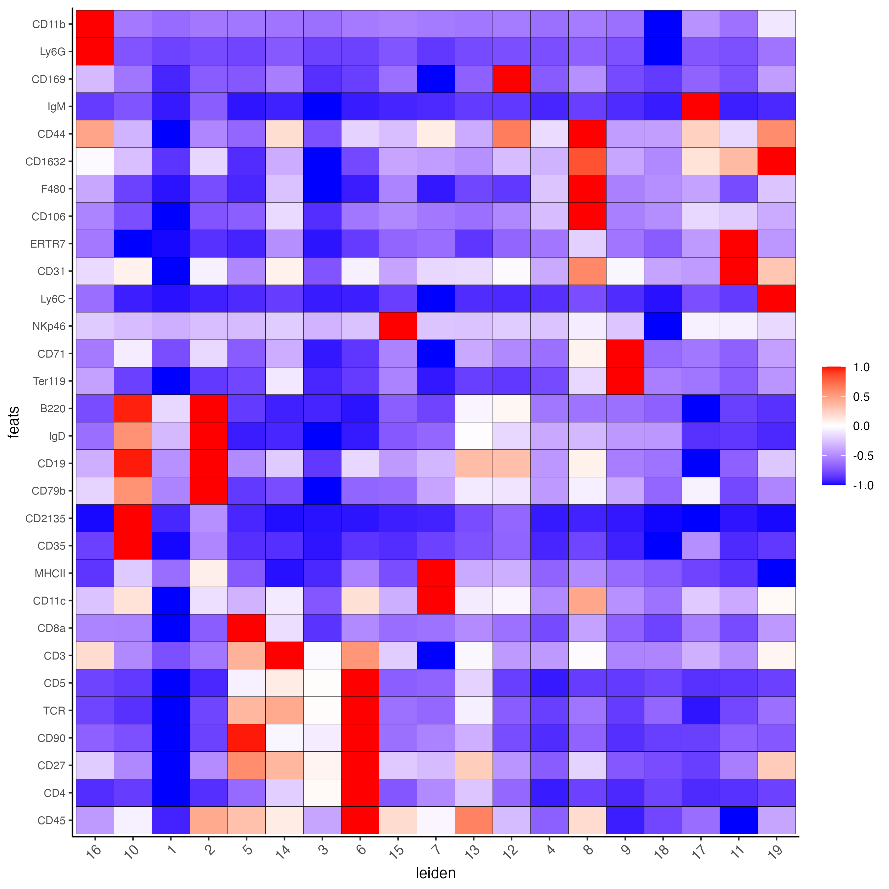


```{r, eval=FALSE}
topgenes_scran = markers_scran[, head(.SD, 1), by = 'cluster']$feats
violinPlot(codex_test,
           feats = unique(topgenes_scran)[1:8],
           cluster_column = cluster_column,
           strip_text = 8,
           strip_position = 'right',
           save_param = list(save_name = '6_b_violinplot'))
```


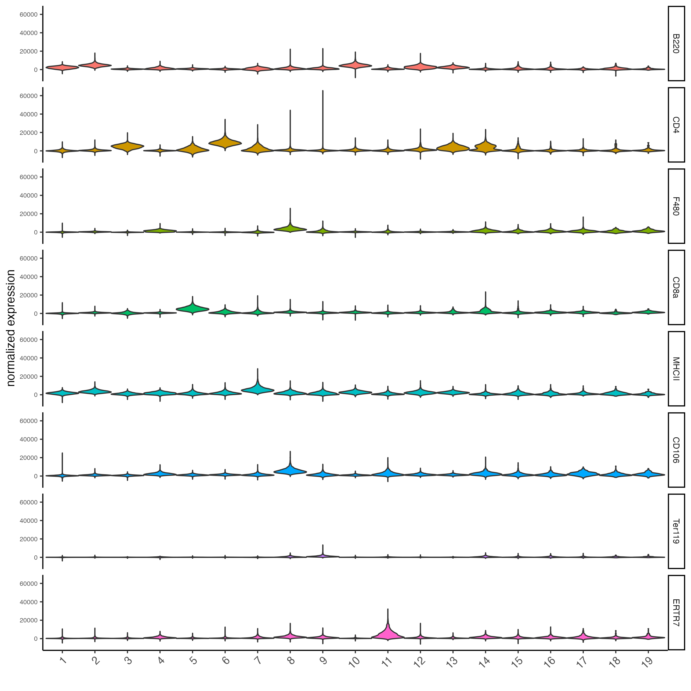


```{r, eval=FALSE}
# gini
markers_gini = findMarkers_one_vs_all(gobject = codex_test,
                                      method = "gini",
                                      expression_values = "normalized",
                                      cluster_column = cluster_column,
                                      min_feats=5)

markergenes_gini = unique(markers_gini[, head(.SD, 5), by = "cluster"][["feats"]])

plotMetaDataHeatmap(codex_test,
                    expression_values = "normalized", 
                    metadata_cols = c(cluster_column),
                    selected_feats = markergenes_gini,
                    show_values = 'zscores_rescaled',
                    save_param = list(save_name = '6_c_metaheatmap'))
```


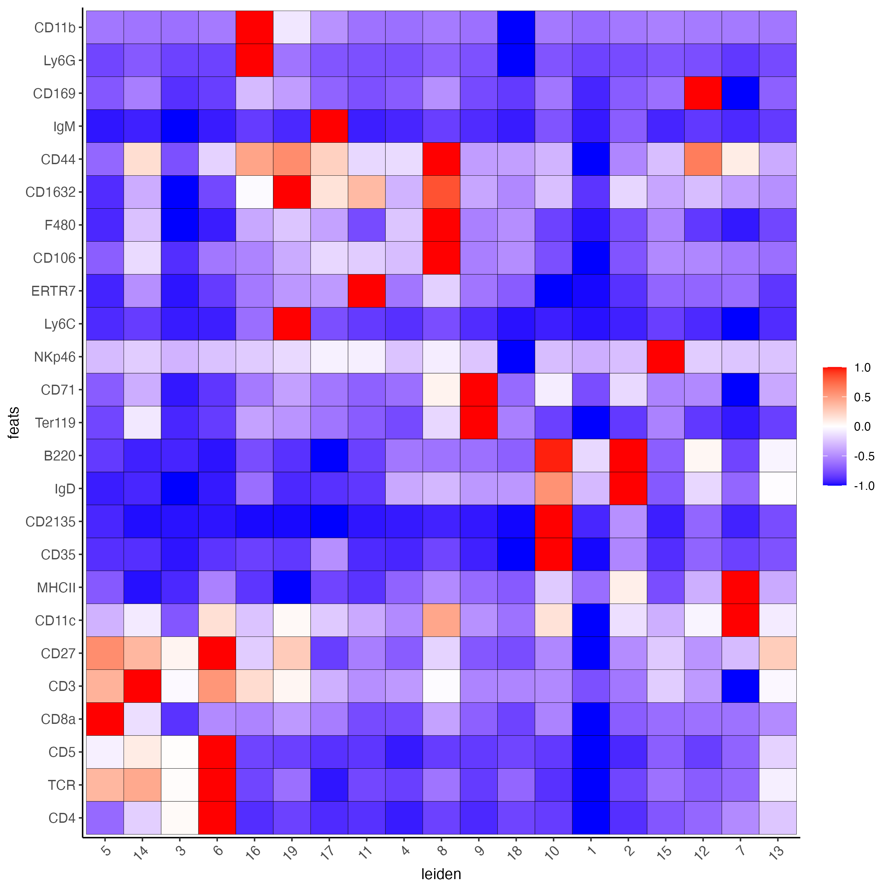


```{r, eval=FALSE}
topgenes_gini = markers_gini[, head(.SD, 1), by = 'cluster']$feats
violinPlot(codex_test,
           feats = unique(topgenes_gini),
           cluster_column = cluster_column,
           strip_text = 8,
           strip_position = 'right',
           save_param = list(save_name = '6_d_violinplot'))
```


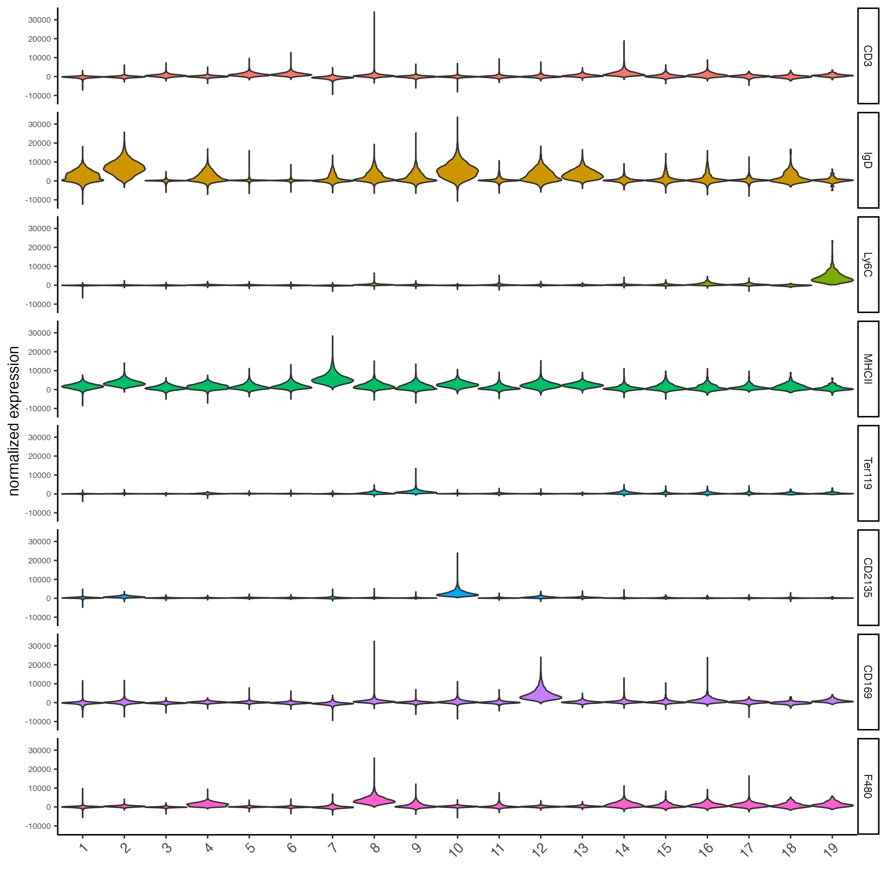

# 7. Cell type annotation


```{r, eval=FALSE}
clusters_cell_types<-c("naive B cells","B cells","B cells","naive B cells","B cells",
                       "macrophages","erythroblasts","erythroblasts","erythroblasts","CD8 + T cells",
                       "Naive T cells","CD4+ T cells","Naive T cells", "CD4+ T cells","Dendritic cells",
                       "NK cells","Dendritic cells","Plasma cells","endothelial cells","monocytes")

names(clusters_cell_types) = c(2,15,13,5,8,9,19,1,10,3,12,14,4,6,7,16,17,18,11,20)

codex_test = annotateGiotto(gobject = codex_test,
                            annotation_vector = clusters_cell_types,
                            cluster_column = 'leiden', name = 'cell_types')

plotUMAP(gobject = codex_test,
         cell_color = 'cell_types',
         point_shape = 'no_border',
         point_size = 0.2,
         show_center_label = F,
         label_size = 2,
         legend_text = 5,
         legend_symbol_size = 2,
         save_param = list(save_name = '7_a_umap_celltypes'))
```


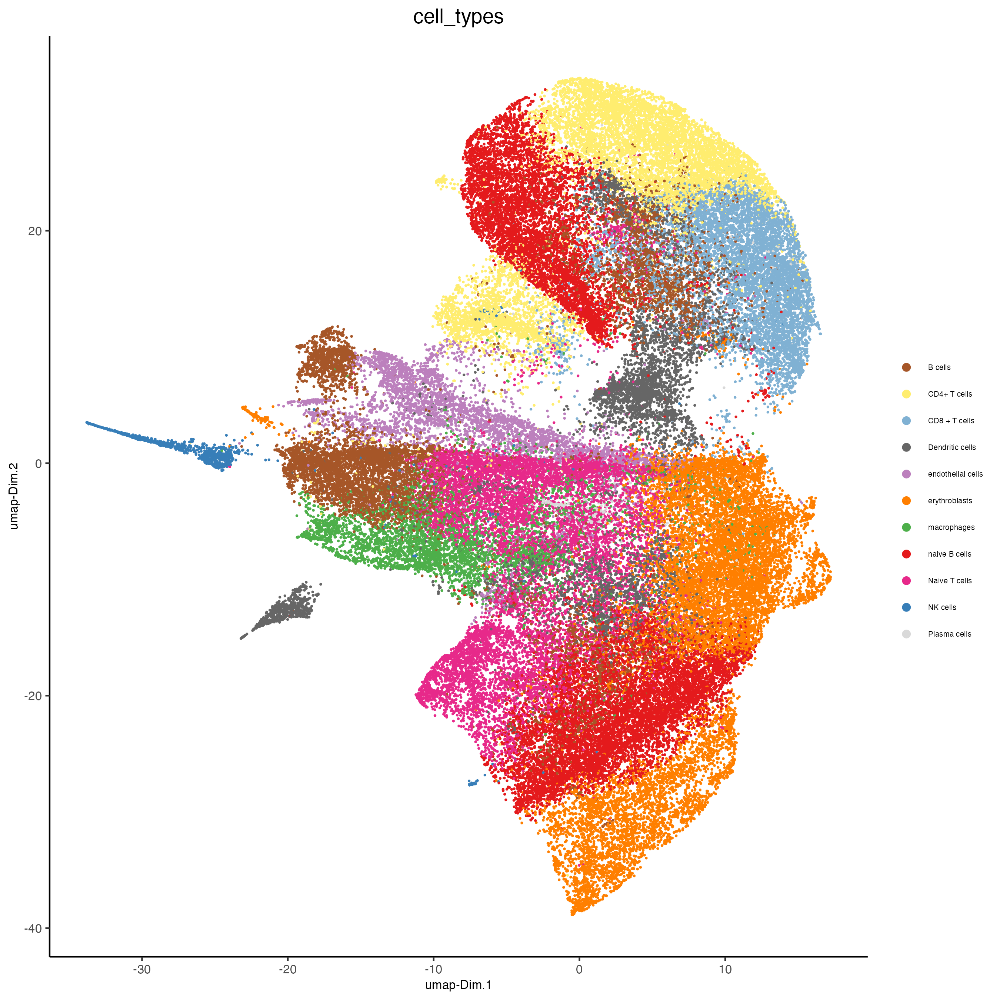

Or, this dataset comes with the imaging phenotype annotation


```{r, eval=FALSE}
plotUMAP(gobject = codex_test,
         cell_color = 'Imaging_phenotype_cell_type',
         point_shape = 'no_border',
         point_size = 0.2,
         show_center_label = F,
         label_size = 2,
         legend_text = 5,
         legend_symbol_size = 2,
         save_param = list(save_name = '7_b_umap'))
```


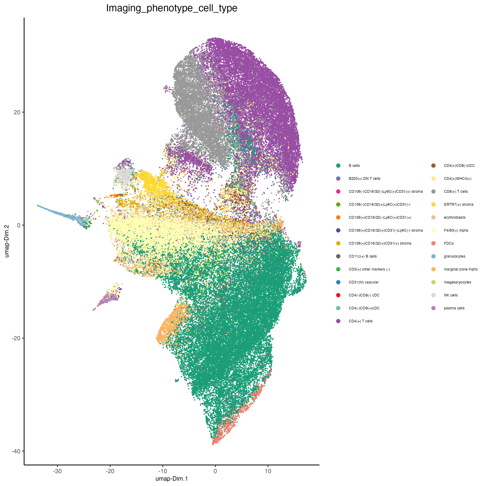


```{r, eval=FALSE}
spatPlot(gobject = codex_test,
         cell_color = 'Imaging_phenotype_cell_type',
         point_shape = 'no_border',
         point_size = 0.2, 
         coord_fix_ratio = 1,
         label_size = 2,
         legend_text = 5,
         legend_symbol_size = 2,
         save_param = list(save_name = '7_c_spatplot'))
```


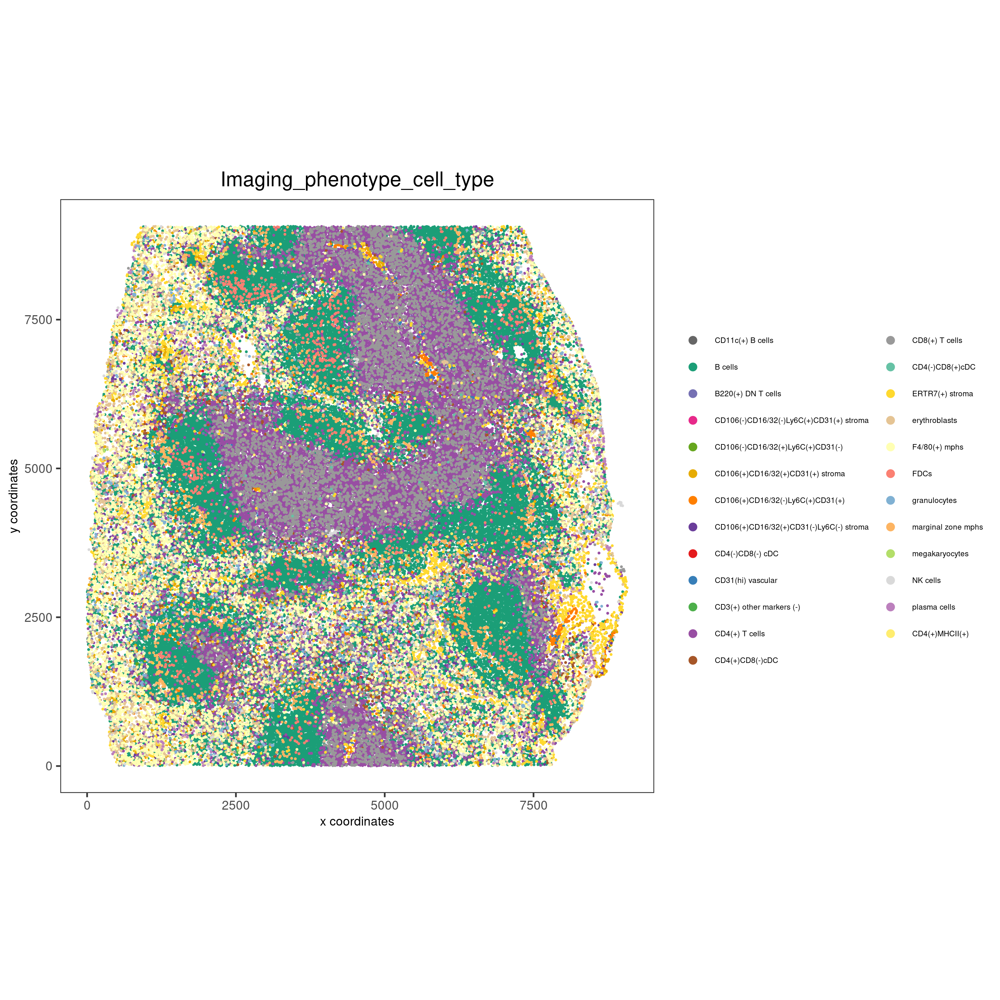

# 8. Visualize cell types and gene expression in selected zones


```{r, eval=FALSE}
cell_metadata = pDataDT(codex_test)
subset_cell_ids = cell_metadata[sample_Xtile_Ytile=="BALBc-3_X04_Y08"]$cell_ID

codex_test_zone1 = subsetGiotto(codex_test,
                                cell_ids = subset_cell_ids)

plotUMAP(gobject = codex_test_zone1, 
         cell_color = 'Imaging_phenotype_cell_type',
         point_shape = 'no_border',
         point_size = 1,
         show_center_label = F,
         label_size = 2,
         legend_text = 5,
         legend_symbol_size = 2,
         save_param = list(save_name = '8_a_umap'))
```


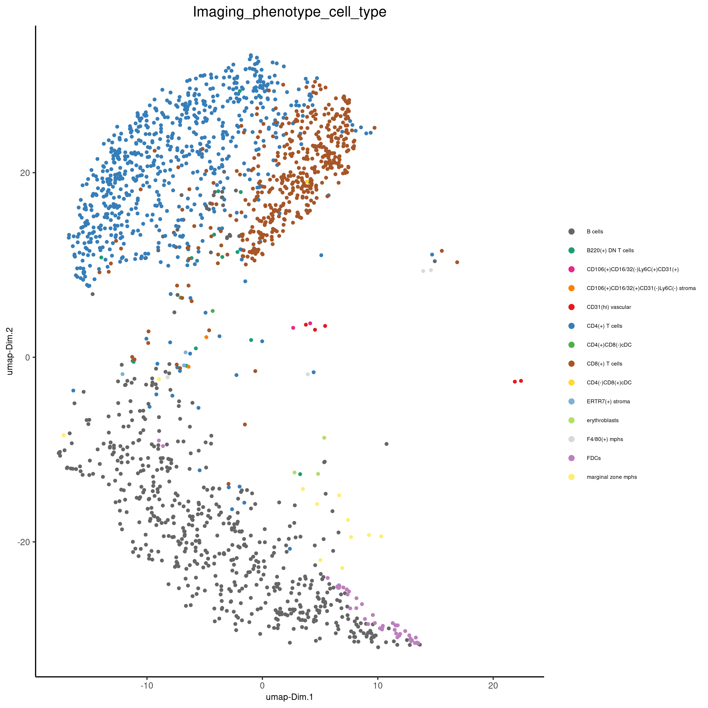


```{r, eval=FALSE}
spatPlot(gobject = codex_test_zone1, 
         cell_color = 'Imaging_phenotype_cell_type',
         point_shape = 'no_border',
         point_size = 1, 
         coord_fix_ratio = 1,
         label_size = 2,
         legend_text = 5,
         legend_symbol_size = 2,
         save_param = list(save_name = '8_b_spatplot'))
```


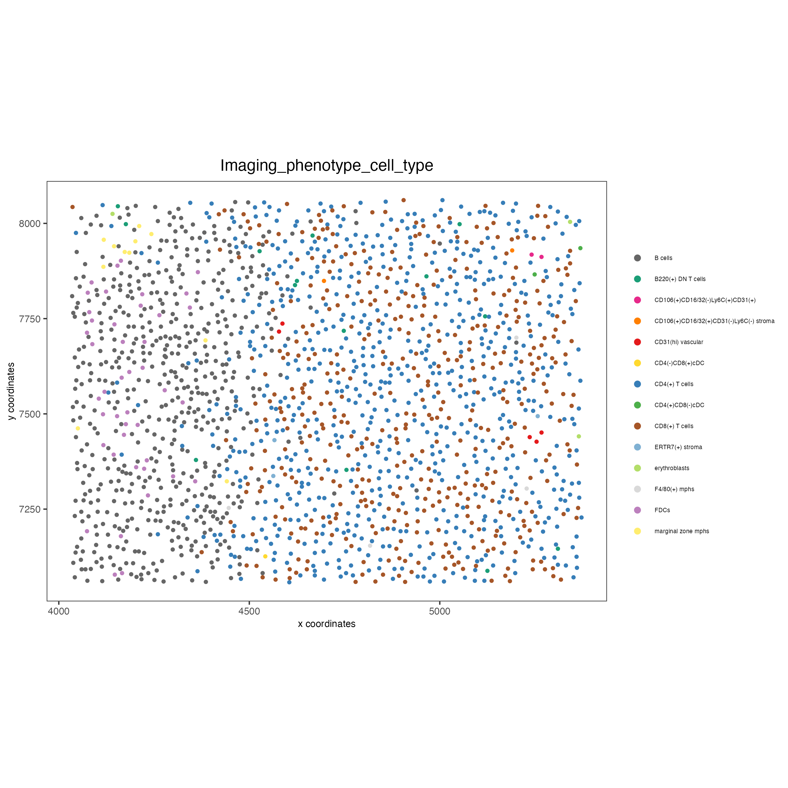


```{r, eval=FALSE}
spatDimFeatPlot2D(codex_test_zone1, 
                expression_values = 'scaled',
                feats = c("CD8a","CD19"),
                spat_point_shape = 'no_border',
                dim_point_shape = 'no_border',
                cell_color_gradient = c("darkblue", "white", "red"),
                save_param = list(save_name = '8_c_spatdimplot'))
```


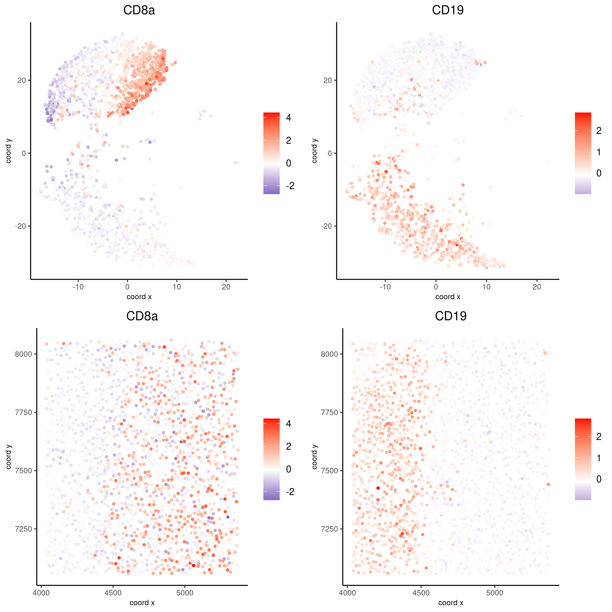

Test on another region:


```{r, eval=FALSE}
cell_metadata = pDataDT(codex_test)
subset_cell_ids = cell_metadata[sample_Xtile_Ytile=="BALBc-3_X04_Y03"]$cell_ID

codex_test_zone2 = subsetGiotto(codex_test, cell_ids = subset_cell_ids)

plotUMAP(gobject = codex_test_zone2,
         cell_color = 'Imaging_phenotype_cell_type',
         point_shape = 'no_border',
         point_size = 1,
         show_center_label = F,
         label_size = 2,
         legend_text = 5,
         legend_symbol_size = 2,
         save_param = list(save_name = '8_d_umap'))
```


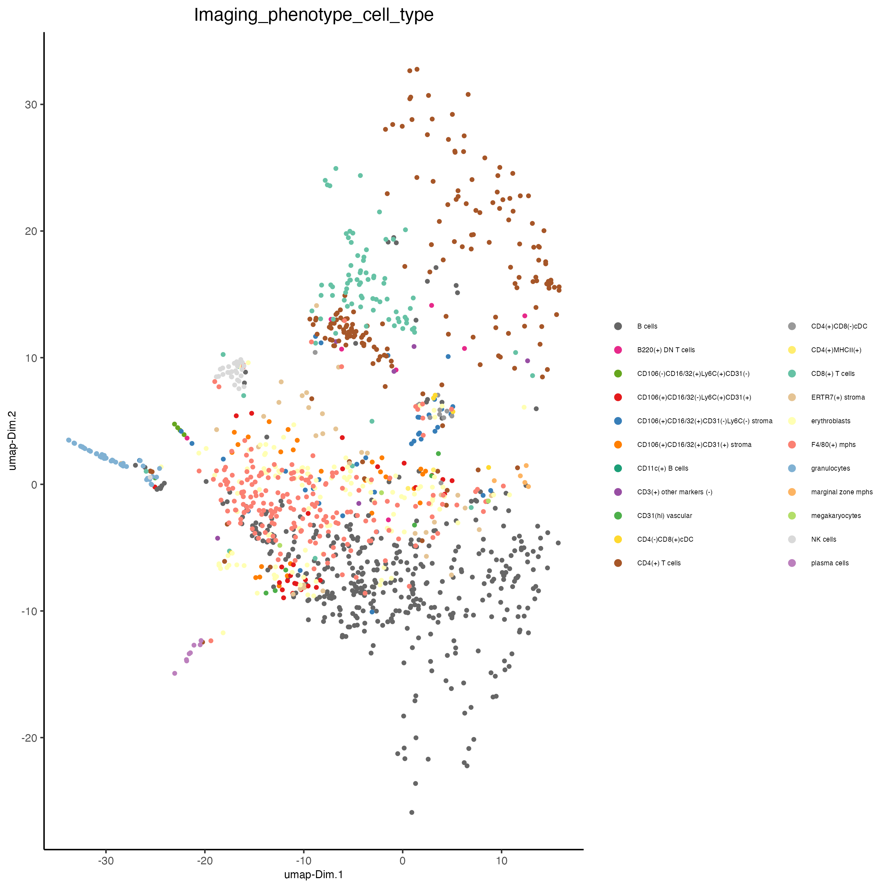


```{r, eval=FALSE}
spatPlot(gobject = codex_test_zone2,
         cell_color = 'Imaging_phenotype_cell_type',
         point_shape = 'no_border',
         point_size = 1, 
         coord_fix_ratio = 1,
         label_size = 2,
         legend_text = 5,
         legend_symbol_size = 2,
         save_param = list(save_name = '8_e_spatPlot'))
```


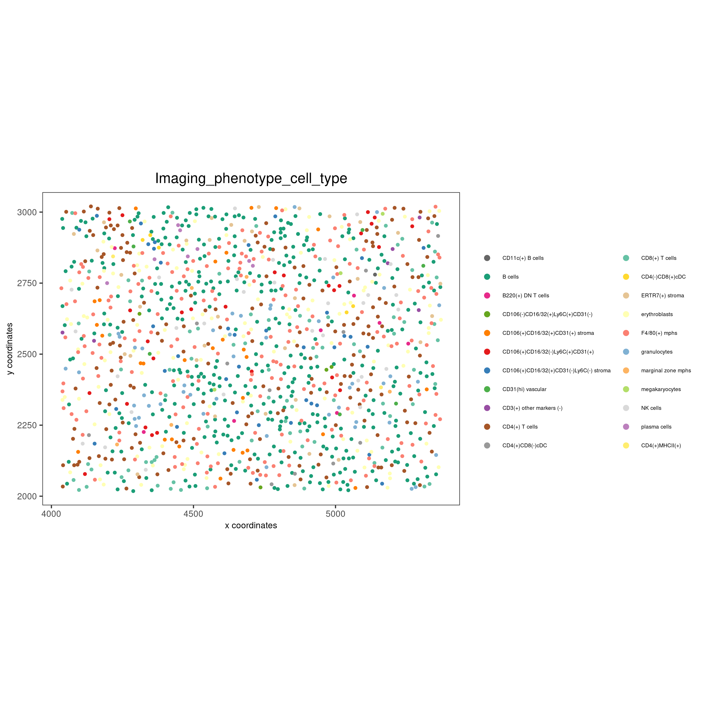


```{r, eval=FALSE}
spatDimFeatPlot2D(codex_test_zone2, 
                expression_values = 'scaled',
                feats = c("CD4", "CD106"),
                spat_point_shape = 'no_border',
                dim_point_shape = 'no_border',
                cell_color_gradient = c("darkblue", "white", "red"),
                save_param = list(save_name = '8_f_spatdimgeneplot'))
```


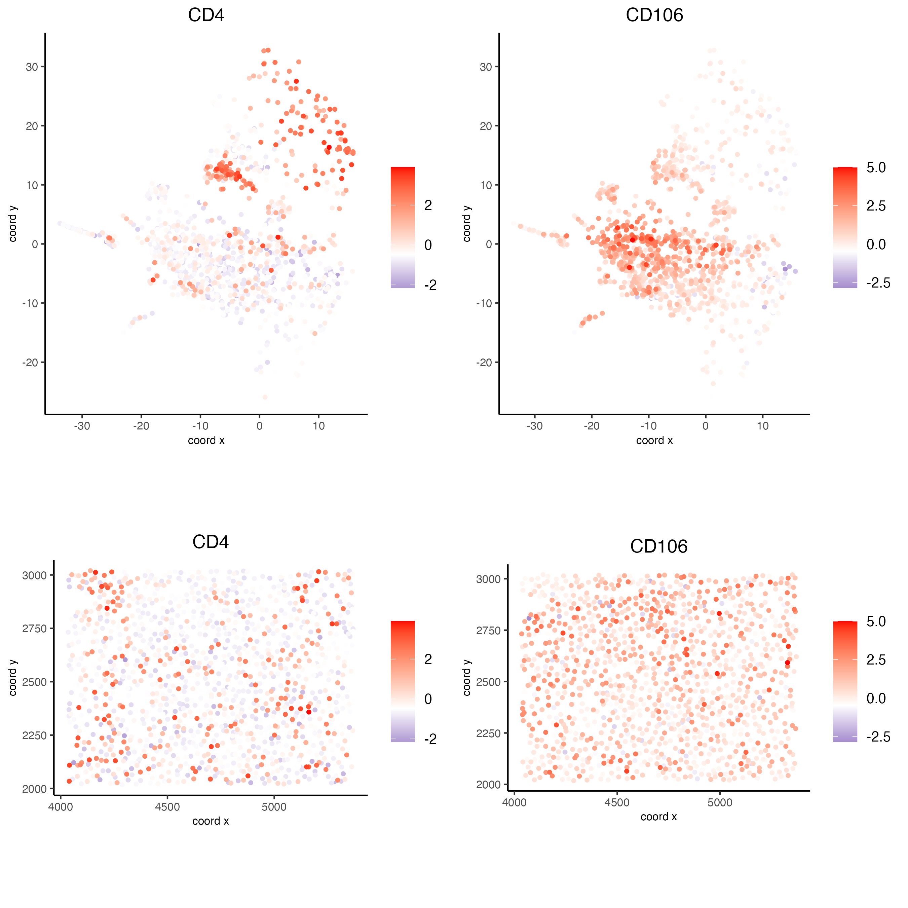
