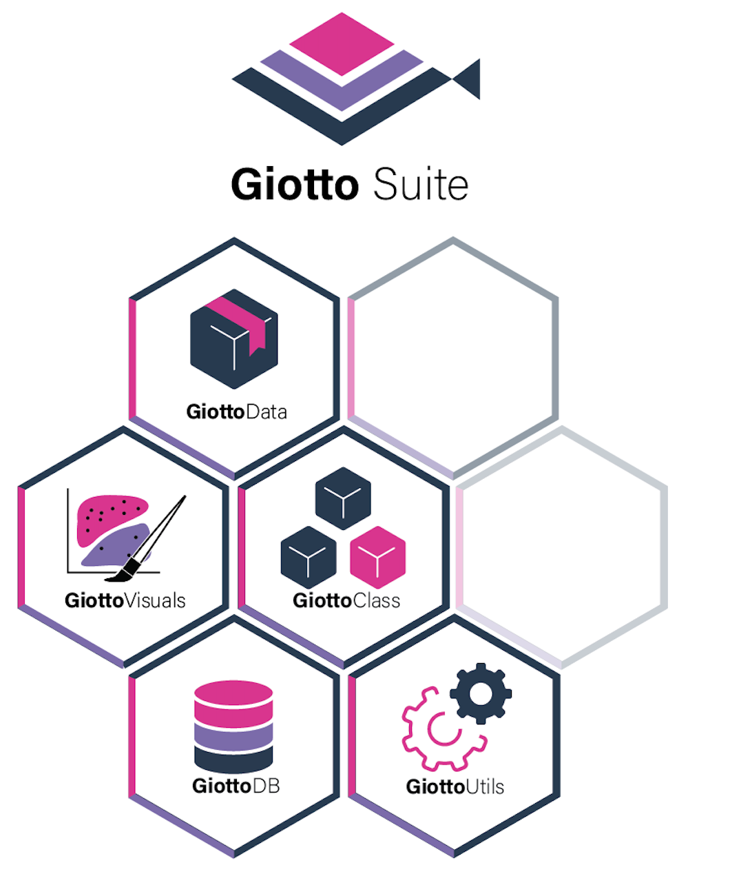

# 1. Explanation

We plan to curate an ecosystem of different, related packages to modularize Giotto Suite as we extend its functionalities. Here, we detail some different helper module(s) within the Giotto Ecosystem.


```{r, echo=FALSE, fig.align='center', out.width='60%'}

```


# 2. GiottoClass

This package contains the Giotto object and subobject class definitions and frameworks. Functionalities relating to data ingestion, basic object creation, data access within the Giotto object, and generics defined for the Giotto classes are all found here.

Applications of this framework and convenience functions for loading specific technologies are found in the base Giotto package.

Find more information [here](https://drieslab.github.io/GiottoClass/)

To install GiottoClass run:

```{r, eval=FALSE}
devtools::install_github('drieslab/GiottoClass')
```

# 3. GiottoUtils

GiottoUtils exports functionalities that are called internally by many of the other packages in the Giotto ecosystem. These range from things such as commonly used imports to pretty prints. Users should not need to directly interact with this package.

Find more information [here](https://drieslab.github.io/GiottoUtils/)

To install GiottoUtils run:

```{r, eval=FALSE}
devtools::install_github('drieslab/GiottoUtils')
```

# 4. GiottoVisuals

GiottoVisuals contains the main plotting functions of Giotto Suite

Find more information [here](https://drieslab.github.io/GiottoVisuals/)

To install GiottoVisuals run:

```{r, eval=FALSE}
devtools::install_github('drieslab/GiottoVisuals')
```

# 5. GiottoData

This package depends on Giotto Suite and leverages various functions within it for saving and loading Giotto objects. It contains dataset helper functions `loadGiottoMini()` and `getSpatialDataset()`. **Note that** `getSpatialDataset()` **was moved from Giotto Suite to GiottoData!**

In addition to dataset helpers, we have created mini Giotto Objects for testing Giotto Suite's capabilities rapidly and streamlining the tutorial experience. GiottoData currently includes two mini Giotto Objects which are derived from Vizgen and Visium data; more mini Giotto Objects will be published in the future. Further, we include mini objects, S4 subobjects of a Giotto Object (i.e. exprObj), in an effort to make the Giotto Object structure as transparent as possible.

Find more information [here](https://drieslab.github.io/GiottoData/)

To install GiottoData run:

```{r, eval=FALSE}
devtools::install_github('drieslab/GiottoData')
```


The scripts used to create both the mini giotto objects and mini objects are available in the repository so that we may extend and/or improve them and that you may utilize them for your own purposes!

## 5.1 Start Giotto


```{r, eval=FALSE}
# Ensure Giotto Suite is installed
if(!"Giotto" %in% installed.packages()) {
  devtools::install_github("drieslab/Giotto@suite_modular")
}

library(Giotto)

# Ensure Giotto Data is installed
if(!"GiottoData" %in% installed.packages()) {
  devtools::install_github("drieslab/GiottoData")
}

library(GiottoData)

# Ensure the Python environment for Giotto has been installed
genv_exists = checkGiottoEnvironment()
if(!genv_exists){
  # The following command need only be run once to install the Giotto environment
  installGiottoEnvironment()
}
```


## 5.2 Create a Giotto object


```{r, eval=FALSE}
visium_mini = loadGiottoMini(dataset = 'visium')
```


# 6. Session Info


```{r, eval=FALSE}
sessionInfo()
```

```{r, eval=FALSE}
 
R version 4.3.1 (2023-06-16)
Platform: aarch64-apple-darwin20 (64-bit)
Running under: macOS Sonoma 14.1.2

Matrix products: default
BLAS:   /System/Library/Frameworks/Accelerate.framework/Versions/A/Frameworks/vecLib.framework/Versions/A/libBLAS.dylib 
LAPACK: /Library/Frameworks/R.framework/Versions/4.3-arm64/Resources/lib/libRlapack.dylib;  LAPACK version 3.11.0

locale:
[1] en_US.UTF-8/en_US.UTF-8/en_US.UTF-8/C/en_US.UTF-8/en_US.UTF-8

time zone: America/New_York
tzcode source: internal

attached base packages:
[1] stats     graphics  grDevices utils     datasets  methods  
[7] base     

other attached packages:
[1] GiottoData_0.2.6.1  Giotto_4.0.0        GiottoVisuals_0.1.0
[4] GiottoClass_0.1.0   GiottoUtils_0.1.0  

loaded via a namespace (and not attached):
 [1] utf8_1.2.4          generics_0.1.3     
 [3] lattice_0.22-5      digest_0.6.33      
 [5] magrittr_2.0.3      evaluate_0.23      
 [7] grid_4.3.1          fastmap_1.1.1      
 [9] jsonlite_1.8.7      Matrix_1.6-4       
[11] backports_1.4.1     fansi_1.0.5        
[13] scales_1.3.0        codetools_0.2-19   
[15] cli_3.6.1           rlang_1.1.2        
[17] XVector_0.42.0      Biobase_2.60.0     
[19] munsell_0.5.0       withr_2.5.2        
[21] colorRamp2_0.1.0    tools_4.3.1        
[23] parallel_4.3.1      checkmate_2.3.0    
[25] dplyr_1.1.4         colorspace_2.1-0   
[27] ggplot2_3.4.4       BiocGenerics_0.48.1
[29] reticulate_1.34.0   png_0.1-8          
[31] vctrs_0.6.5         R6_2.5.1           
[33] stats4_4.3.1        lifecycle_1.0.4    
[35] zlibbioc_1.48.0     S4Vectors_0.40.2   
[37] IRanges_2.36.0      pkgconfig_2.0.3    
[39] terra_1.7-55        pillar_1.9.0       
[41] gtable_0.3.4        data.table_1.14.8  
[43] glue_1.6.2          Rcpp_1.0.11        
[45] xfun_0.41           tibble_3.2.1       
[47] tidyselect_1.2.0    rstudioapi_0.15.0  
[49] knitr_1.45          igraph_1.5.1       
[51] htmltools_0.5.7     rmarkdown_2.25     
[53] compiler_4.3.1     

```
