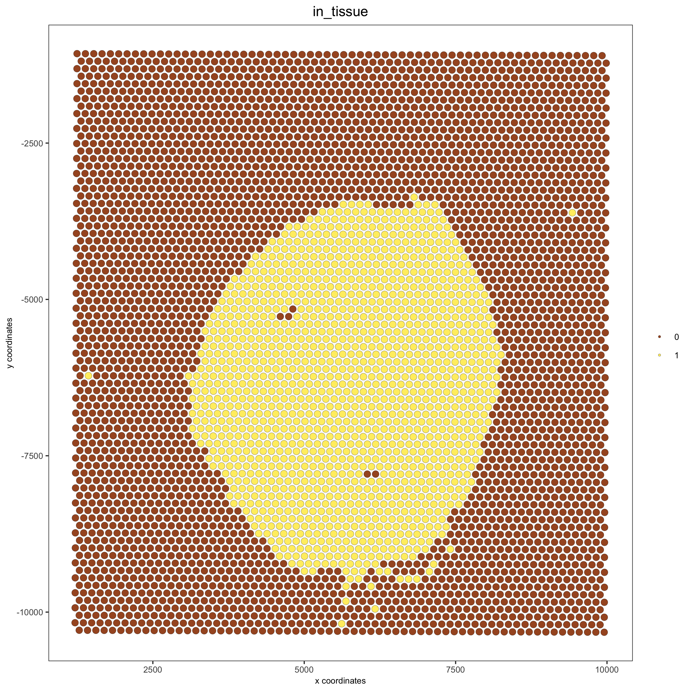
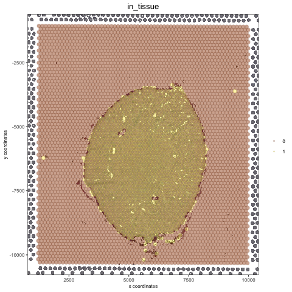
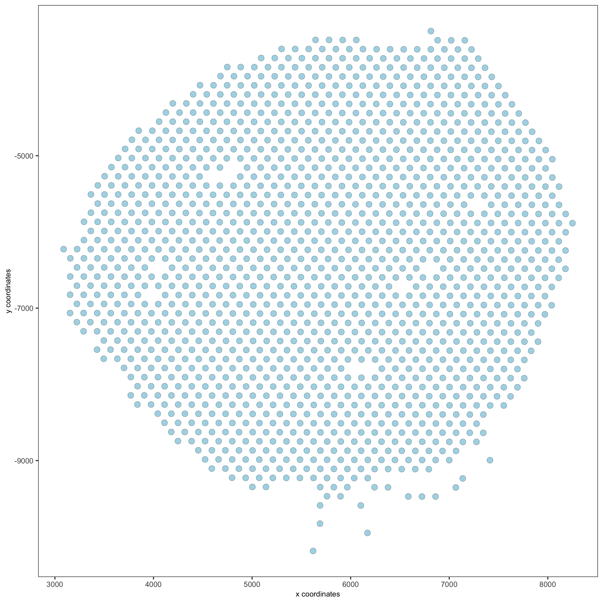
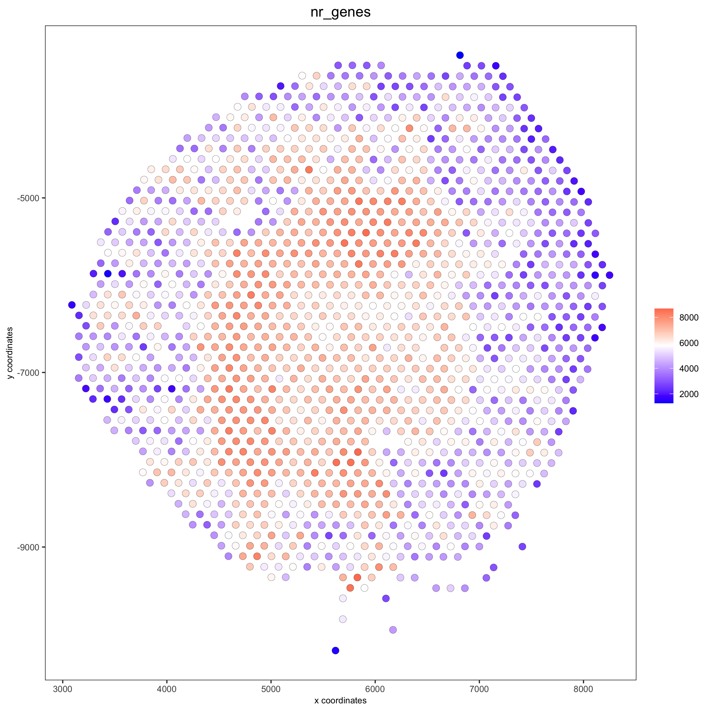
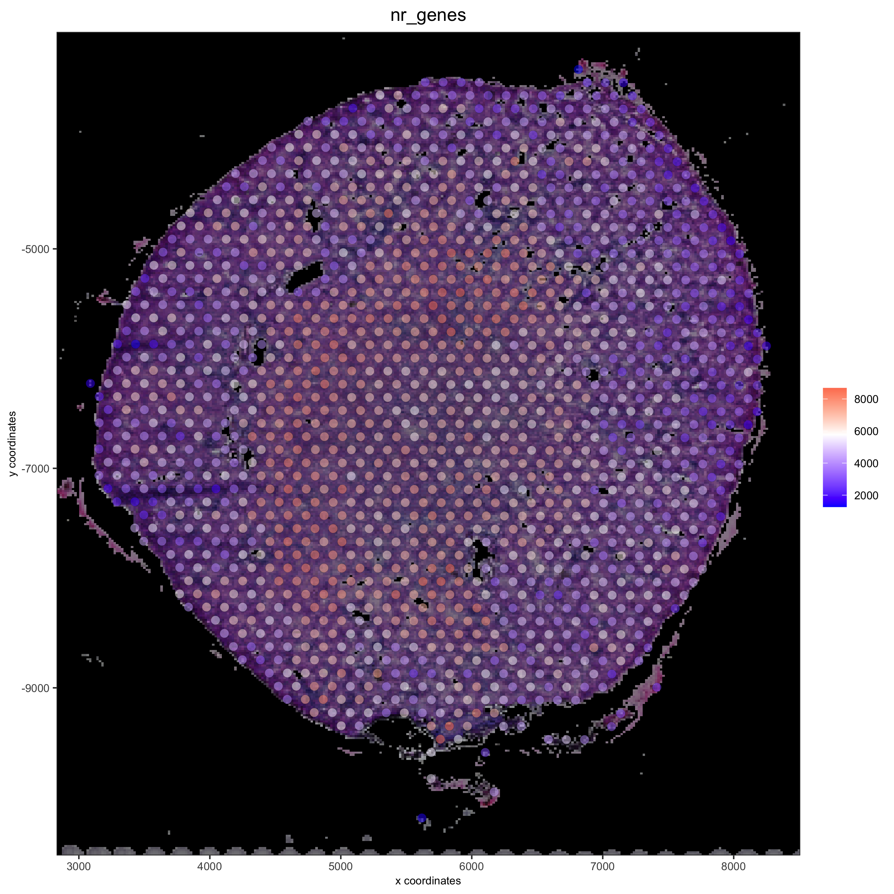
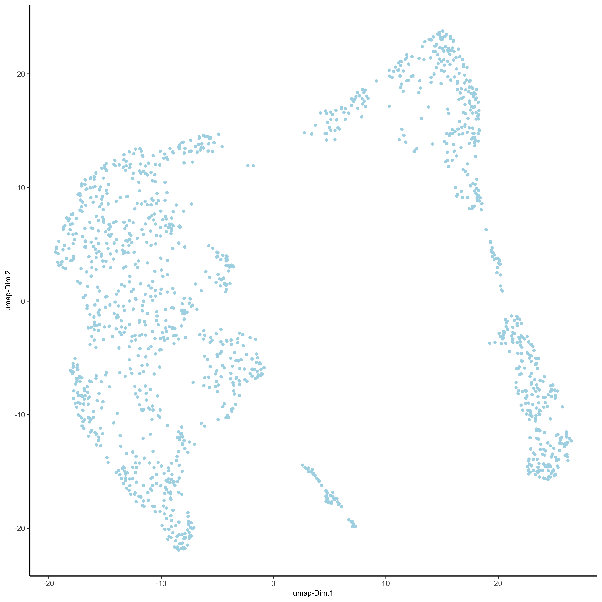
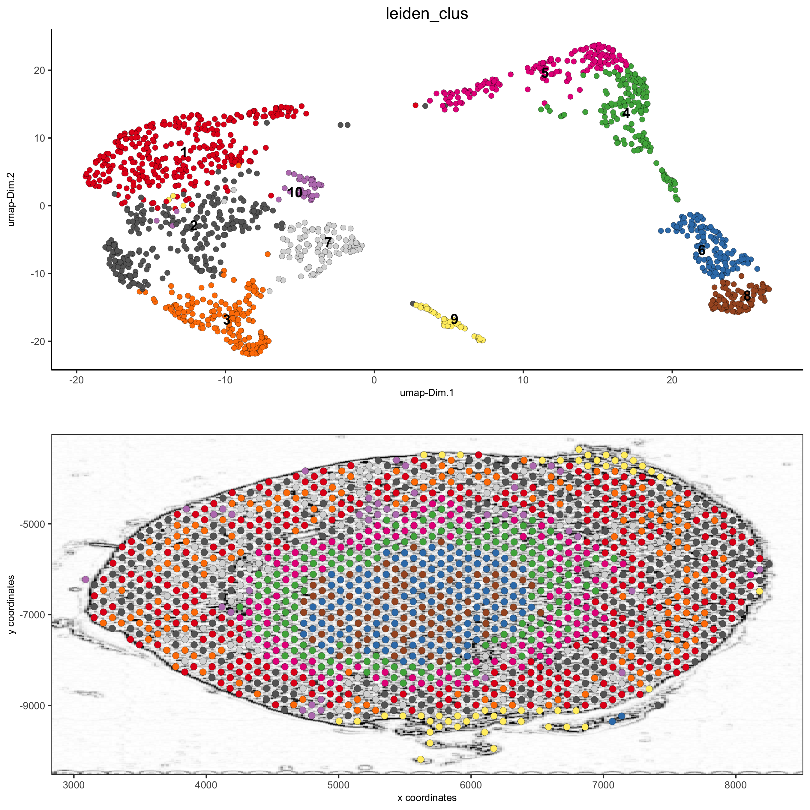
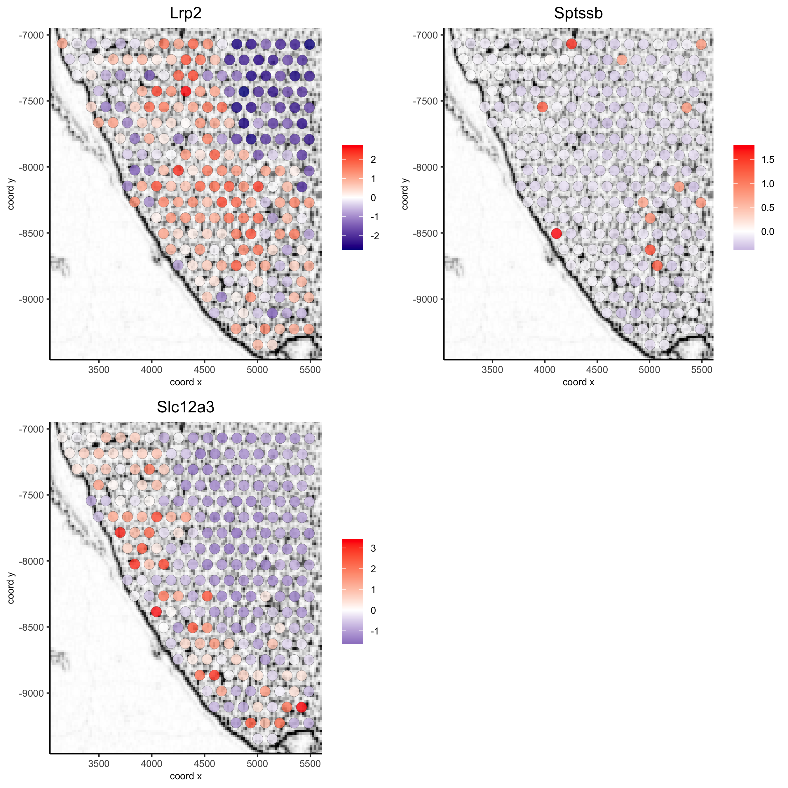
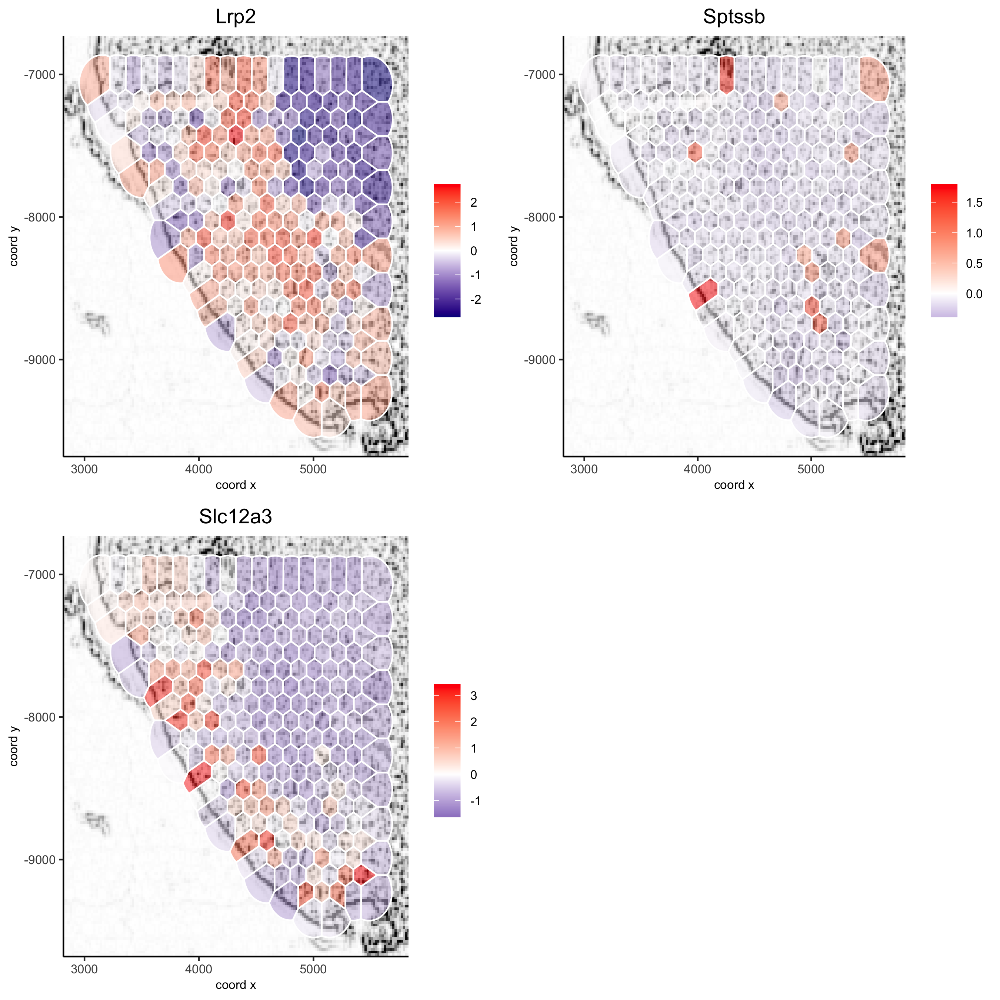

# How to work with background images?  

All spatial visualization functions in the Giotto toolbox can be overlaid on a background image.
This allows you to visualize your results on top of the original tissue image. We provide multiple
ways of adding and modifying figures in Giotto. In short there are 3 things to consider:  

1. how to add an image to a Giotto object?  
  - **createGiottoVisiumObject** can be used directly for a visium 10X dataset  
  - **createGiottoImage** can be used to create a Giotto image object from a magick image object  
  - **addGiottoImage** this add a Giotto image to your Giotto object  
  - **updateGiottoImage** this helps to adjust the alignment of your image with your results    
  
2. how to modify an image? e.g. change background color  
  - **estimateImageBg** function to estimage the background color of your Giotto or magick image
  - **changeImageBg** function to change the background color of your image
  - **plotGiottoImage** function to plot an image by itself  
  
3. how to show these images with your spatial plots? 
  - **showGiottoImageNames** this tells you which giotto image(s) are part of your giotto object
  - Each spatial plotting function has the following 3 parameters:  
    - show_image = TRUE or FALSE, to show a background image or not  
    - image_name = name of associated Giotto image to use for the background image (option 1)
    - gimage = a giotto image object to use (option 2)
  - **addGiottoImageToSpatPlot** to test your giotto images you can use this function to them to spatPlot result 

Here we process the Visium Kidney dataset to illustrate all the different and flexible ways to deal 
with images: 


## 1. create Giotto Giotto object  
 
Here we use the wrapper function createGiottoVisiumObject to create a Giotto object for
a 10X Visium dataset, which includes a png image.
```{r eval=FALSE}
library(Giotto)

visium_kidney = createGiottoVisiumObject(visium_dir = '/path/to/Visium_data/Kidney_data',
                                         png_name = 'tissue_lowres_image.png', gene_column_index = 2)

```


## 2. align plot
The image plot and the Giotto results are not always perfectly aligned. This step just needs
to be done once.

```{r, eval=FALSE}
# output from Giotto
spatPlot(gobject = visium_kidney, cell_color = 'in_tissue')
```

{ width=50% }

```{r, eval=FALSE}
# problem: image is not perfectly aligned
spatPlot(gobject = visium_kidney, cell_color = 'in_tissue', show_image = T, point_alpha = 0.7)
```

{ width=50% }


adjust the x and y minima and maxima to align the image and the giotto output results: 
```{r, eval=FALSE}
# check name
showGiottoImageNames(visium_kidney)
visium_kidney = updateGiottoImage(visium_kidney, image_name = 'image',
                            xmax_adj = 1300, xmin_adj = 1200,
                            ymax_adj = 1100, ymin_adj = 1000)

spatPlot(gobject = visium_kidney, cell_color = 'in_tissue', show_image = T, point_alpha = 0.7)
```

{ width=50% }

```{r, eval=FALSE}
# plot original image
plotGiottoImage(visium_kidney, 'image')
```

{ width=50% }

## 3. change background of a Giotto or magick image 
extract the giotto image from your giotto object and then estimate the background of your image:  
```{r eval=FALSE}
myimage = getGiottoImage(visium_kidney, image_name = 'image') # extract image to modify
estimateImageBg(mg_object = myimage, top_color_range = 1:20)  # estimate background (bg) color
```

{ width=50% }

```{r eval=FALSE}
## create and test black background
orig_black_png = changeImageBg(mg_object = myimage, bg_color = '#949594', perc_range = 10, new_color = '#000000', new_name = 'black_bg')

mypl = spatPlot(gobject = visium_kidney, cell_color = 'in_tissue', return_plot = T, point_alpha = 0.5)
mypl_image = addGiottoImageToSpatPlot(mypl, orig_black_png)
mypl_image
```

{ width=50% }

```{r eval=FALSE}
## create and test white background
orig_white_png = changeImageBg(mg_object = myimage, bg_color = '#949594', perc_range = 10, new_color = '#FFFFFF', new_name = 'white_bg')

mypl = spatPlot(gobject = visium_kidney, cell_color = 'in_tissue', return_plot = T, point_alpha = 0.5)
mypl_image = addGiottoImageToSpatPlot(mypl, orig_white_png)
mypl_image

```

{ width=50% }


## 4. Add image form scratch
```{r eval=FALSE}
## use magick library to load (and optionally modify) figure ##
# original image
png_path = '/Volumes/Ruben_Seagate/Dropbox/Projects/GC_lab/Ruben_Dries/190225_spatial_package/Data/Visium_data/Kidney_data/spatial/tissue_lowres_image.png'
mg_img = magick::image_read(png_path)
```

create a negated image
```{r eval=FALSE}
# original image negated
mg_img2 = magick::image_negate(mg_img)
orig_neg_png = createGiottoImage(gobject = visium_kidney, mg_object = mg_img2, name = 'image_neg',
                                 xmax_adj = 1300, xmin_adj = 1200, ymax_adj = 1100, ymin_adj = 1000)
mypl_image = addGiottoImageToSpatPlot(mypl, orig_neg_png)
mypl_image
```

{ width=50% }

create a charcoal image
```{r eval=FALSE}
# charcoal image (black/white)
mg_img3 = magick::image_charcoal(mg_img, radius = 1)
mg_img3 = magick::image_convert(mg_img3, colorspace = 'rgb')
orig_charc_png = createGiottoImage(gobject = visium_kidney, mg_object = mg_img3, name = 'image_charc',
                                   xmax_adj = 1300, xmin_adj = 1200, ymax_adj = 1100, ymin_adj = 1000)
mypl_image = addGiottoImageToSpatPlot(mypl, orig_charc_png)
mypl_image
```

{ width=50% }

add multiple new images to your giotto object
```{r eval=FALSE}
## add images to Giotto object ##
image_list = list(orig_white_png, orig_black_png, orig_neg_png, orig_charc_png)
visium_kidney = addGiottoImage(gobject = visium_kidney,
                               images = image_list)
showGiottoImageNames(visium_kidney) # shows which Giotto images are attached to you Giotto object
```


## 5. Example Kidney analysis


#### 5.1 processing  
```{r eval=FALSE}

## subset on spots that were covered by tissue
metadata = pDataDT(visium_kidney)
in_tissue_barcodes = metadata[in_tissue == 1]$cell_ID
visium_kidney = subsetGiotto(visium_kidney, cell_ids = in_tissue_barcodes)

## filter
visium_kidney <- filterGiotto(gobject = visium_kidney,
                              expression_threshold = 1,
                              gene_det_in_min_cells = 50,
                              min_det_genes_per_cell = 1000,
                              expression_values = c('raw'),
                              verbose = T)
## normalize
visium_kidney <- normalizeGiotto(gobject = visium_kidney, scalefactor = 6000, verbose = T)
## add gene & cell statistics
visium_kidney <- addStatistics(gobject = visium_kidney)
## visualize
spatPlot(gobject = visium_kidney)
```

{ width=50% }


```{r eval=FALSE}
spatPlot(gobject = visium_kidney, cell_color = 'nr_genes', color_as_factor = F)
```

{ width=50% }

```{r eval=FALSE}
# add black background image
spatPlot(gobject = visium_kidney, show_image = T, image_name = "black_bg",
           cell_color = 'nr_genes', color_as_factor = F, point_alpha = 0.5)
```

{ width=50% }

```{r eval=FALSE}
## alternative: directly provide a gimage (giotto image object), this will override the the image_name param
spatPlot(gobject = visium_kidney, show_image = T, gimage = orig_charc_png,
           cell_color = 'nr_genes', color_as_factor = F, point_alpha = 0.8)

```

{ width=50% }


#### 5.2 dimension reduction

```{r eval=FALSE}
## highly variable genes (HVG)
visium_kidney <- calculateHVG(gobject = visium_kidney, nr_expression_groups = 10)

## select genes based on HVG and gene statistics, both found in gene metadata
gene_metadata = fDataDT(visium_kidney)
featgenes = gene_metadata[hvg == 'yes' & perc_cells > 4 & mean_expr_det > 0.5]$gene_ID

## run PCA on expression values (default)
visium_kidney <- runPCA(gobject = visium_kidney, genes_to_use = featgenes)

## run UMAP and tSNE on PCA space (default)
visium_kidney <- runUMAP(visium_kidney, dimensions_to_use = 1:10)
plotUMAP(gobject = visium_kidney)
```

{ width=50% }

#### 5.3 cluster

```{r eval=FALSE}
## sNN network (default)
visium_kidney <- createNearestNetwork(gobject = visium_kidney, dimensions_to_use = 1:10, k = 15)
## Leiden clustering
visium_kidney <- doLeidenCluster(gobject = visium_kidney, resolution = 0.4, n_iterations = 1000)
plotUMAP(gobject = visium_kidney,
         cell_color = 'leiden_clus', show_NN_network = T, point_size = 2.5)
```

{ width=50% }

#### 5.4 co-visualize


```{r eval=FALSE}
# expression and spatial
showGiottoImageNames(visium_kidney)

spatDimPlot(gobject = visium_kidney, cell_color = 'leiden_clus',
            show_image = T, image_name = 'black_bg',
            dim_point_size = 2, spat_point_size = 2.5,
            save_param = list(save_name = '7_a_covis_leiden_black'))
```

{ width=50% }

```{r eval=FALSE}
spatDimPlot(gobject = visium_kidney, cell_color = 'leiden_clus',
            show_image = T, image_name = 'image_neg',
            dim_point_size = 2, spat_point_size = 2.5,
            save_param = list(save_name = '7_b_covis_leiden_negated'))
```

{ width=50% }

```{r eval=FALSE}
spatDimPlot(gobject = visium_kidney, cell_color = 'leiden_clus',
            show_image = T, image_name = 'image_charc',
            dim_point_size = 2, spat_point_size = 2.5,
            save_param = list(save_name = '7_b_covis_leiden_charc'))
```

{ width=50% }

#### 5.5 spatial gene plots

```{r eval=FALSE}
## gene plots ##
spatGenePlot(visium_kidney, show_image = T, image_name = 'image_charc',
             expression_values = 'scaled', point_size = 2, 
             genes = c('Lrp2', 'Sptssb', 'Slc12a3'),  cow_n_col = 2, 
             cell_color_gradient = c('darkblue', 'white', 'red'), gradient_midpoint = 0, point_alpha = 0.8,
             save_param = list(save_name = '8_a_spatgene_charc'))
```

{ width=50% }

```{r eval=FALSE}
spatGenePlot(visium_kidney, show_image = T, image_name = 'image_charc',
             expression_values = 'scaled', point_size = 2, point_shape = 'voronoi',
             genes = c('Lrp2', 'Sptssb', 'Slc12a3'),  cow_n_col = 2, 
             cell_color_gradient = c('darkblue', 'white', 'red'), gradient_midpoint = 0, vor_alpha = 0.8,
             save_param = list(save_name = '8_b_spatgene_charc_vor'))


```

{ width=50% }

#### 5.6 subset plots

```{r eval=FALSE}
visium_kidney_subset = subsetGiottoLocs(visium_kidney, x_min = 3000, x_max = 5500, y_min = -10000, y_max = -7000)

spatGenePlot(visium_kidney_subset, show_image = T, image_name = 'image_charc',
             expression_values = 'scaled', point_size = 4, 
             genes = c('Lrp2', 'Sptssb', 'Slc12a3'),  cow_n_col = 2, 
             cell_color_gradient = c('darkblue', 'white', 'red'), gradient_midpoint = 0,
             point_alpha = 0.8,
             save_param = list(save_name = '9_a_subset_spatgene_charc'))
```

{ width=50% }

```{r eval=FALSE}
spatGenePlot(visium_kidney_subset, show_image = T, image_name = 'image_charc',
             expression_values = 'scaled', point_size = 4,  point_shape = 'voronoi', vor_alpha = 0.5,
             genes = c('Lrp2', 'Sptssb', 'Slc12a3'),  cow_n_col = 2, 
             cell_color_gradient = c('darkblue', 'white', 'red'), gradient_midpoint = 0,
             save_param = list(save_name = '9_b_subset_spatgene_charc_vor'))
```

{ width=50% }


