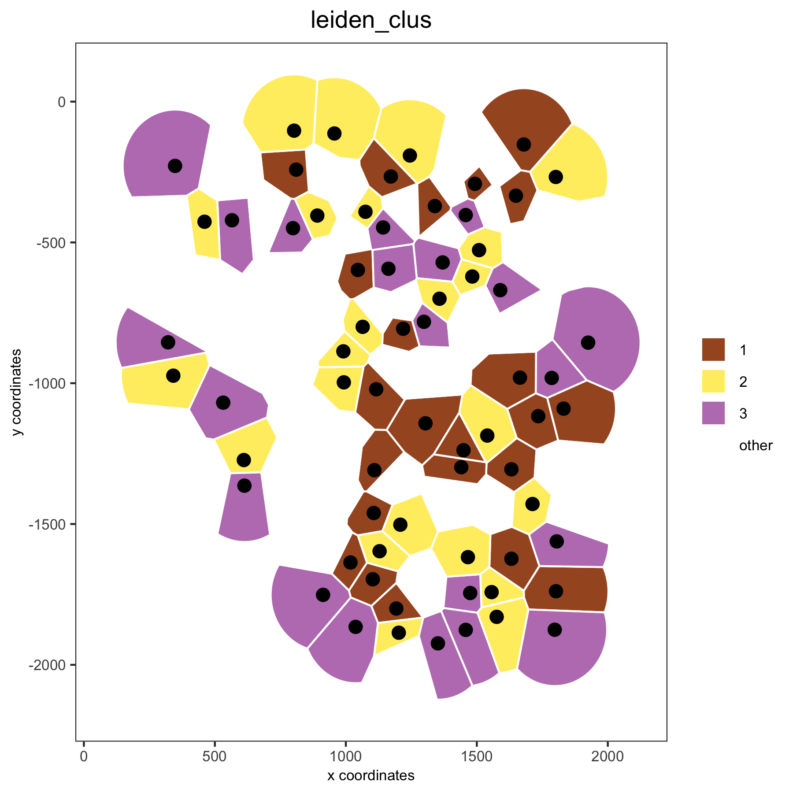
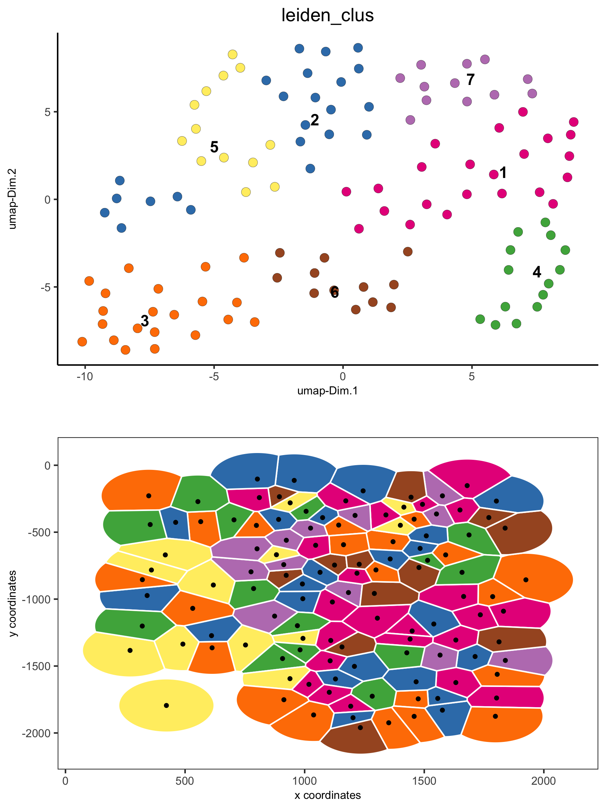
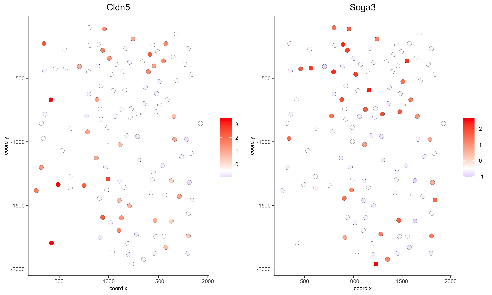
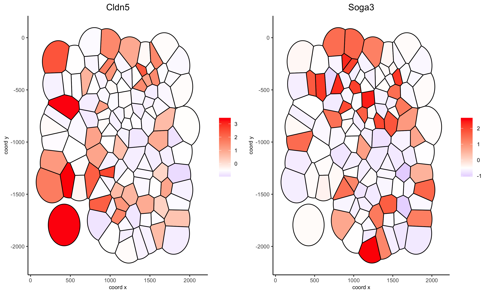
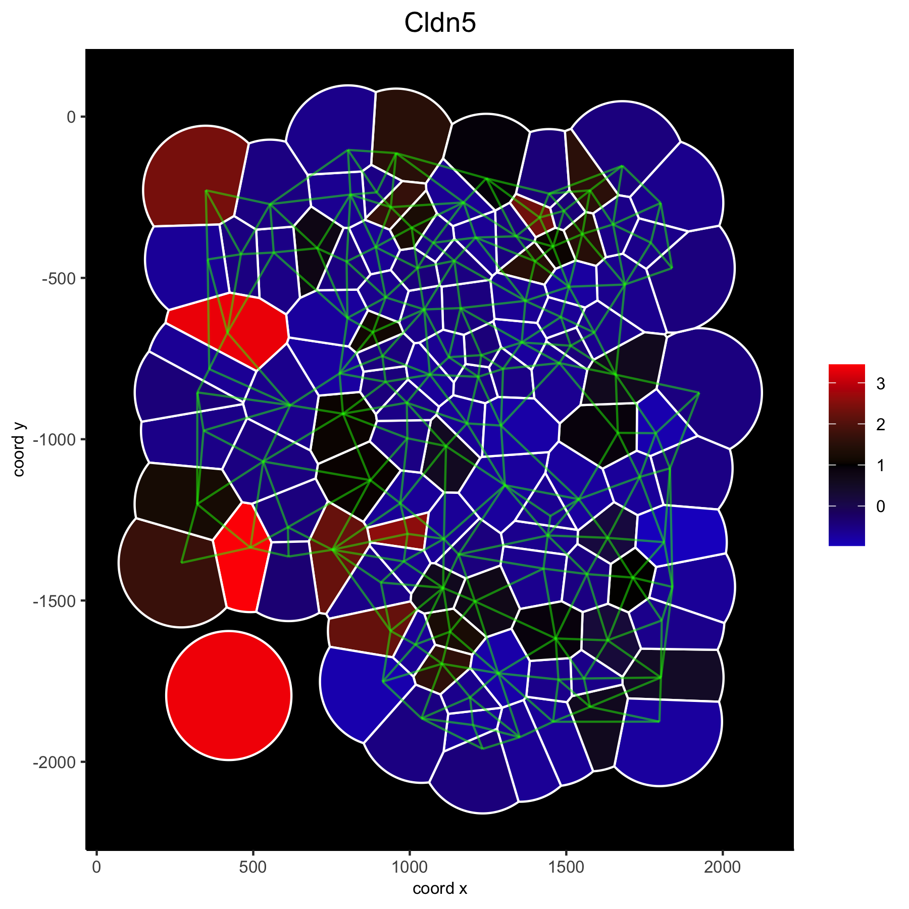

# Voronoi plots to visualize spatial data

Voronoi plots are an attractive way to visualize spatial expression data since it reduces whitespace between single cells or spots,
however the voronoi borders do NOT necessarily mimick the true cell borders. Nevertheless it has been used to 'segment' cells and
assign transcripts to individual cells. Here we merely use it as a beautifull visualization alternative to simple 'points'.


## 1. Start with the analysis of the mini seqFISH+ dataset  
- this dataset is part of the Giotto package
- it's very small and easy to run
```{r, eval=FALSE}
library(Giotto)

# input data
VC_exprs_small = read.table(system.file("extdata", "seqfish_field_expr.txt", package = 'Giotto'))
VC_locs_small = read.table(system.file("extdata", "seqfish_field_locs.txt", package = 'Giotto'))

# giotto object
VC_small <- createGiottoObject(raw_exprs = VC_exprs_small, spatial_locs = VC_locs_small, instructions = instrs)
VC_small <- filterGiotto(gobject = VC_small, expression_threshold = 0.5, gene_det_in_min_cells = 0, min_det_genes_per_cell = 0)
VC_small <- normalizeGiotto(gobject = VC_small, scalefactor = 6000, verbose = T)
VC_small <- addStatistics(gobject = VC_small)

# clustering
VC_small <- calculateHVG(gobject = VC_small)
gene_metadata = fDataDT(VC_small)
featgenes = gene_metadata[hvg == 'yes' & perc_cells > 4 & mean_expr_det > 0.5]$gene_ID
VC_small <- runPCA(gobject = VC_small, genes_to_use = featgenes, scale_unit = F)
VC_small <- runUMAP(VC_small, dimensions_to_use = 1:5, n_threads = 2)
VC_small <- createNearestNetwork(gobject = VC_small, dimensions_to_use = 1:5, k = 5)
VC_small <- doLeidenCluster(gobject = VC_small, resolution = 0.4, n_iterations = 1000)

# spatial grid and network
VC_small = createSpatialNetwork(gobject = VC_small, minimum_k = 2)
VC_small = createSpatialGrid(gobject = VC_small, sdimx_stepsize = 500, sdimy_stepsize = 500)

```


## 2. Voronoi plot examples

```{r, eval=FALSE}
# spatial voronoi plot with selected clusters
spatPlot(VC_small, point_shape = 'voronoi', cell_color ='leiden_clus', select_cell_groups = c(1,2,3))
```

{ width=50% } 

```{r, eval=FALSE}
# spatial voronoi plot without showing not selected clusters
spatPlot(VC_small, point_shape = 'voronoi', cell_color ='leiden_clus', select_cell_groups = c(1,2,3), show_other_cells = F)
```

{ width=50% } 

```{r, eval=FALSE}
# spatial voronoi plot without showing not selected cells, but showing the voronoi borders
spatPlot(VC_small, point_shape = 'voronoi', cell_color ='leiden_clus', select_cell_groups = c(1,2,3), show_other_cells = F, vor_border_color = 'black')
```

{ width=50% } 

```{r, eval=FALSE}
# visualization of both dimension reduction and spatial results
spatDimPlot(gobject = VC_small, cell_color = 'leiden_clus', spat_point_shape = 'voronoi', dim_point_size = 3)
```

{ width=50% } 


## 3. Create neighbors and show neighbors  

```{r, eval=FALSE}
nb_annot = findNetworkNeighbors(VC_small, 
                            spatial_network_name = 'Delaunay_network', 
                            source_cell_ids = c('cell_1', 'cell_6', 'cell_10', 'cell_91', 'cell_92', 'cell_93'))
VC_small = addCellMetadata(VC_small, new_metadata = nb_annot, by_column = T, column_cell_ID = 'cell_ID')

spatPlot(VC_small, point_shape = 'voronoi', cell_color ='nb_cells',
         cell_color_code = c(source = 'blue', target = 'red', both = 'yellow', others = 'lightgrey'))
```

{ width=50% } 


## 4. Gene expression and voronoi plots 

```{r, eval=FALSE}
## overlay gene expression information ##
selected_genes = c('Cldn5', 'Soga3')

# selected genes original
spatGenePlot(gobject = VC_small, expression_values = 'scaled', genes = selected_genes, point_size = 3)
```

{ width=50% } 

```{r, eval=FALSE}
# selected genes voronoi
spatGenePlot(gobject = VC_small, genes = selected_genes, point_shape = 'voronoi',
             expression_values = 'scaled', vor_border_color = 'black')
```

{ width=50% } 

```{r, eval=FALSE}
# one gene + black background and white borders
spatGenePlot(gobject = VC_small, genes = 'Cldn5', point_size = 3, point_shape = 'voronoi',
             expression_values = 'scaled', vor_border_color = 'white', show_network = T, network_color = 'green',
             background_color = 'black', cell_color_gradient = c('blue', 'black', 'red'), gradient_midpoint = 1, cow_n_col = 1)
```

{ width=50% } 
