```{r, include = FALSE}
knitr::opts_chunk$set(
  collapse = TRUE,
  comment = "#>",
  fig.path = "man/figures/README-",
  out.width = "100%"
)
```

### Giotto global instructions

```{r eval=FALSE, message=FALSE, warning=FALSE}
# this example was tested with Giotto v.0.3.0
library(Giotto)

## create instructions
## instructions allow us to automatically save all plots into a chosen results folder
my_python_path = "/your/python/path/python"
results_folder = '/your/results/path/'
instrs = createGiottoInstructions(python_path = my_python_path)
```


### part 1: Data input
  
We will re-analyze the PDAC data generated by tissue-CyCIF as explained in the paper by [Lin et al](https://elifesciences.org/articles/31657).

<center>
{ width=50% }
</center>


  
```{r, eval=FALSE}
Pdac_data = fread('/path/to/rawdata_Figure7&8_PDAC.csv')
Pdac_data[, cell_ID := paste0('cell_', 1:nrow(Pdac_data))]

# locations
pdac_locations = Pdac_data_filter[,.(Xt, -Yt)]
# expression
pdac_expression = as.matrix(Pdac_data[,c(9:15,18:31)]); rownames(pdac_expression) = Pdac_data$cell_ID
# metadata
pdac_metadat = Pdac_data[,c(1:8,16:17,32:39)]
```

***


### part 2: Create Giotto object & process data
 
```{r eval=FALSE}
pdac_test <- createGiottoObject(raw_exprs = t(pdac_expression), 
                                spatial_locs = pdac_locations,
                                instructions = instrs,
                                cell_metadata = pdac_metadat)

## normalize & adjust
pdac_test <- normalizeGiotto(gobject = pdac_test, scalefactor = 10000, verbose = T)
pdac_test <- addStatistics(gobject = pdac_test)


## visualize original annotations ##
spatPlot(gobject = pdac_test, point_size = 0.5, coord_fix_ratio = 1, cell_color = 'frame',  background_color = 'black', legend_symbol_size = 3)

```

<center>
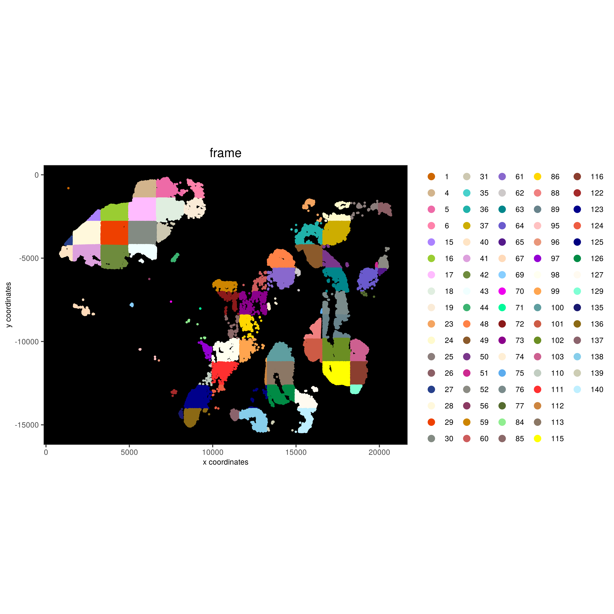{width=10cm} 
</center>

  
  
```{r eval=FALSE}
spatPlot(gobject = pdac_test, point_size = 0.3, coord_fix_ratio = 1, cell_color = 'COL', background_color = 'black', legend_symbol_size = 3)
```

<center>
{width=10cm} 
</center>

```{r eval=FALSE}
spatPlot(gobject = pdac_test, point_size = 0.3, coord_fix_ratio = 1, cell_color = 'ROW', background_color = 'black', legend_symbol_size = 3)
```

<center>
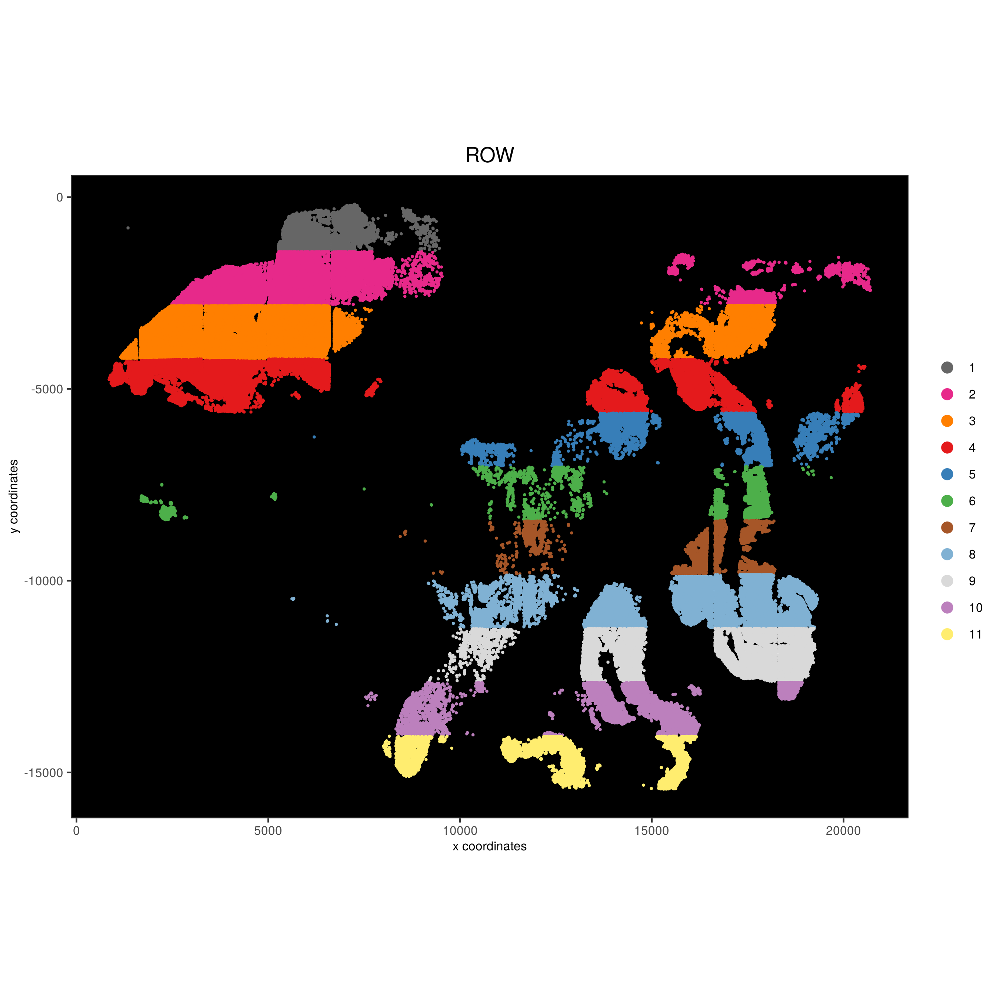{width=10cm} 
</center>


```{r eval=FALSE}
## add external histology information
pdac_metadata = pDataDT(pdac_test)
pancreas_frames = c(1:6, 27:31, 15:19, 40:44)
PDAC_frames = c(23:26, 35:37, 51:52, 64:65, 77)
small_intestines_frames = c(49:50, 63, 75:76, 88:89, 100:103, 112:116, 125:129, 137:140)

# detailed histology
hist_info = ifelse(pdac_metadata$frame %in% pancreas_frames, 'pancr', 
                   ifelse(pdac_metadata$frame %in% PDAC_frames, 'PDAC',
                          ifelse(pdac_metadata$frame %in% small_intestines_frames, 'small_intest', 'other')))
pdac_test = addCellMetadata(pdac_test, new_metadata = hist_info)

spatPlot(gobject = pdac_test, point_size = 0.3, coord_fix_ratio = 1, cell_color = 'hist_info',
         background_color = 'black', legend_symbol_size = 3)
```

<center>
{width=10cm} 
</center>

```{r eval=FALSE}
# coarse histology
hist_info2 = ifelse(pdac_metadata$frame %in% pancreas_frames, 'pancr', 
                    ifelse(pdac_metadata$frame %in% small_intestines_frames, 'small_intest','PDAC'))
pdac_test = addCellMetadata(pdac_test, new_metadata = hist_info2)

spatPlot(gobject = pdac_test, point_size = 0.3, coord_fix_ratio = 1, cell_color = 'hist_info2',
         background_color = 'black', legend_symbol_size = 3, point_border_stroke = 0.001)

```
 
<center>
{width=10cm} 
</center>


### part 3: dimension reduction

```{r eval=FALSE}
# PCA
pdac_test <- runPCA(gobject = pdac_test, expression_values = 'normalized', scale_unit = T)
signPCA(pdac_test, scale_unit = T, scree_ylim = c(0, 3), save_param = list(save_name = '2_screeplot'))
```

<center>
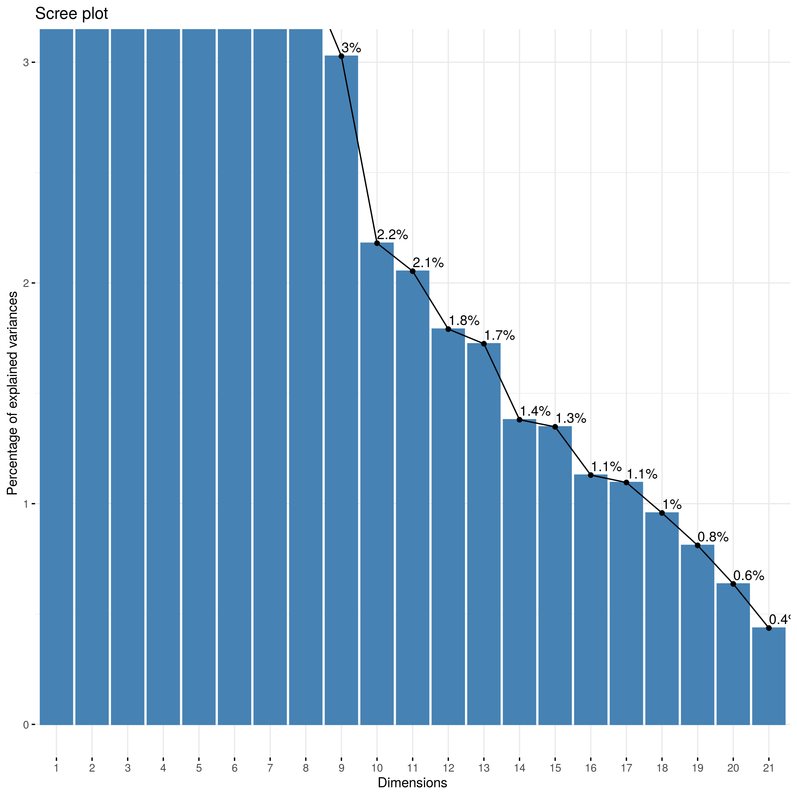{width=10cm} 
</center>

```{r eval=FALSE}
plotPCA(gobject = pdac_test, point_shape = 'no_border', point_size = 0.2, save_param = list(save_name = '2_PCAplot'))
```

<center>
{width=10cm} 
</center>

```{r eval=FALSE}
# UMAP
pdac_test <- runUMAP(pdac_test, dimensions_to_use = 1:14, n_components = 2, n_threads = 12)
plotUMAP(gobject = pdac_test, point_shape = 'no_border', point_size = 0.2, save_param = list(save_name = '2_UMAP'))
```

<center>
{width=10cm} 
</center>


### part 4: cluster


```{r eval=FALSE}
## sNN network (default)
pdac_test <- createNearestNetwork(gobject = pdac_test, dimensions_to_use = 1:14, k = 20)

## 0.2 resolution
pdac_test <- doLeidenCluster(gobject = pdac_test, resolution = 0.2, n_iterations = 100, name = 'leiden')

# create customized color palette for leiden clustering results
pdac_metadata = pDataDT(pdac_test)
leiden_colors = Giotto:::getDistinctColors(length(unique(pdac_metadata$leiden)))
names(leiden_colors) = unique(pdac_metadata$leiden)
color_3 = leiden_colors['3'];color_10 = leiden_colors['10']
leiden_colors['3'] = color_10; leiden_colors['10'] = color_3

plotUMAP(gobject = pdac_test, cell_color = 'leiden', point_shape = 'no_border', point_size = 0.2, cell_color_code = leiden_colors)
```

<center>
{width=10cm} 
</center>


```{r eval=FALSE}
plotUMAP(gobject = pdac_test, cell_color = 'hist_info',point_shape = 'no_border',   point_size = 0.2)
```

<center>
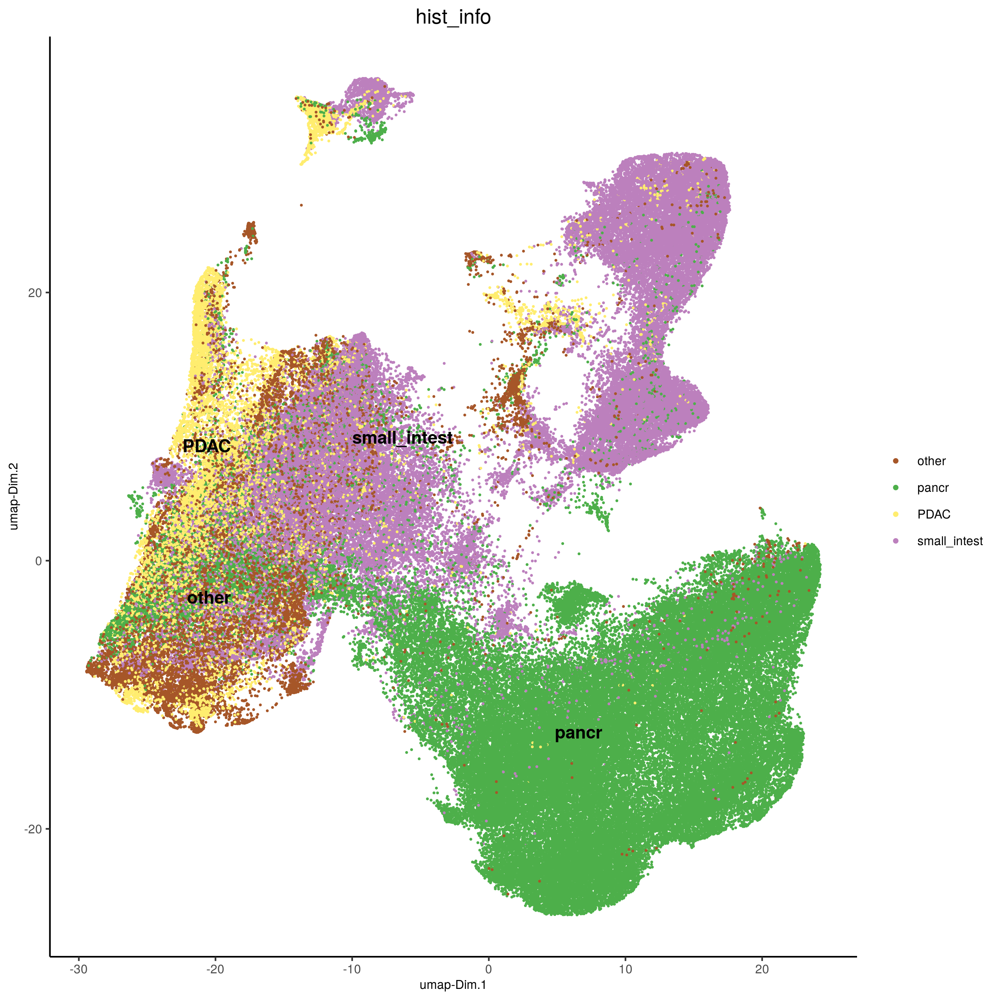{width=10cm} 
</center>


```{r eval=FALSE}
spatPlot(gobject = pdac_test, cell_color = 'leiden', point_shape = 'no_border', point_size = 0.2, 
         cell_color_code = leiden_colors, coord_fix_ratio = 1)
```

<center>
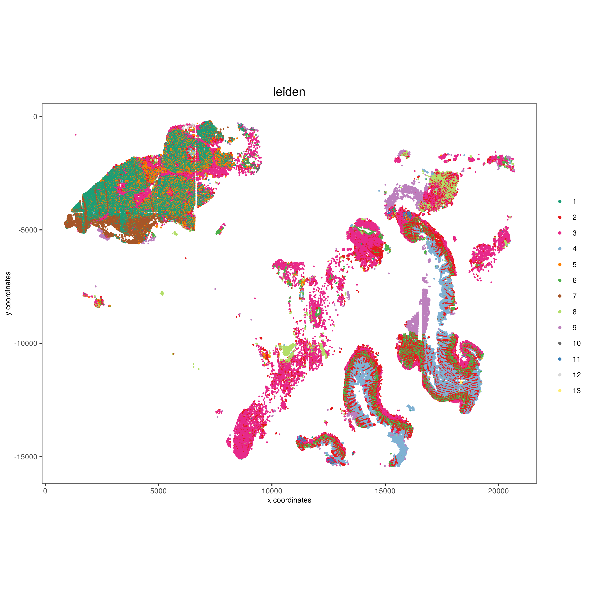{width=10cm} 
</center>


### part 5: visualize spatial and expression space

```{r eval=FALSE}
spatDimPlot2D(gobject = pdac_test, cell_color = 'leiden', spat_point_shape = 'no_border', spat_point_size = 0.2, 
              dim_point_shape = 'no_border', dim_point_size = 0.2, cell_color_code = leiden_colors)
```

<center>
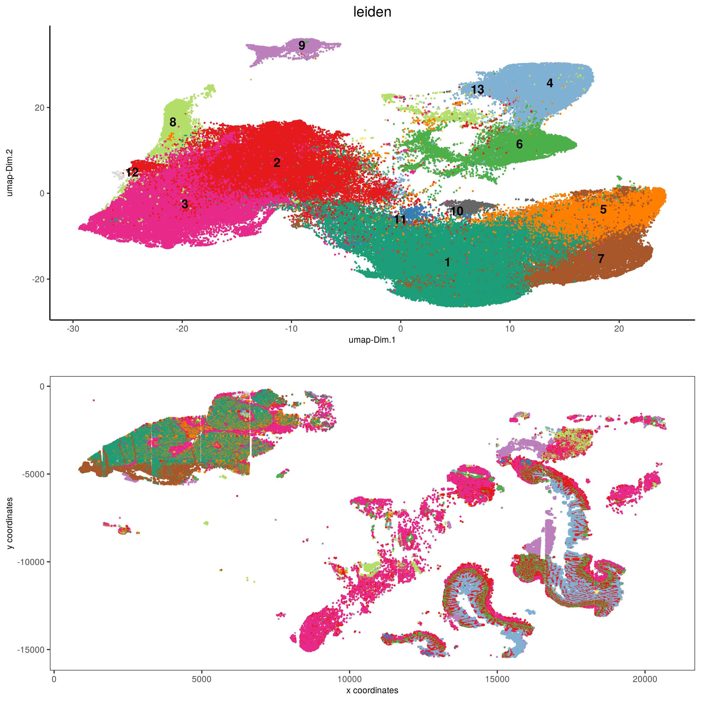{width=10cm} 
</center>

```{r eval=FALSE}
spatDimPlot2D(gobject = pdac_test, cell_color = 'leiden', spat_point_shape = 'border', spat_point_size = 0.2, spat_point_border_stroke = 0.01,
              dim_point_shape = 'border', dim_point_size = 0.2, dim_point_border_stroke = 0.01, cell_color_code = leiden_colors)
```

<center>
{width=10cm} 
</center>

```{r eval=FALSE}
spatDimPlot2D(gobject = pdac_test, cell_color = 'hist_info2', spat_point_shape = 'border', spat_point_size = 0.2, spat_point_border_stroke = 0.01,
              dim_point_shape = 'border', dim_point_size = 0.2, dim_point_border_stroke = 0.01)
```

<center>
{width=10cm} 
</center>


### part 6: cell type marker gene detection

```{r eval=FALSE}
# resolution 0.2
cluster_column = 'leiden'

# gini
markers_gini = findMarkers_one_vs_all(gobject=pdac_test, method="gini", expression_values="scaled",
                                      cluster_column=cluster_column, min_genes=5)
markergenes_gini = unique(markers_gini[, head(.SD, 5), by="cluster"][["genes"]])

plotMetaDataHeatmap(pdac_test, expression_values = "norm", metadata_cols = c(cluster_column), selected_genes = markergenes_gini, 
                    custom_cluster_order = c(1, 10, 3, 12, 8, 2, 9, 6, 11, 13, 4, 5, 7),
                    save_param = list(save_name = '5_heatmap_gini_custom_order'), y_text_size = 8, show_values = 'zscores_rescaled')
```

<center>
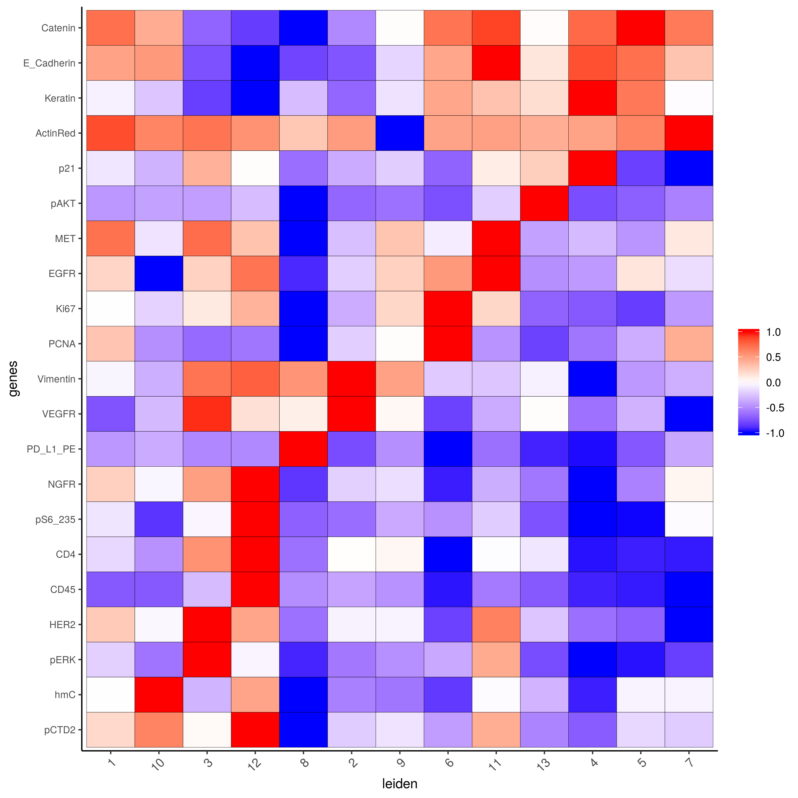{width=10cm} 
</center>

```{r eval=FALSE}
topgenes_gini = markers_gini[, head(.SD, 1), by = 'cluster']$genes
violinPlot(pdac_test, genes = unique(topgenes_gini), cluster_column = cluster_column,
           strip_text = 8, strip_position = 'right',
           save_param = c(save_name = '5_violinplot_gini', base_width = 5, base_height = 10))
```

<center>
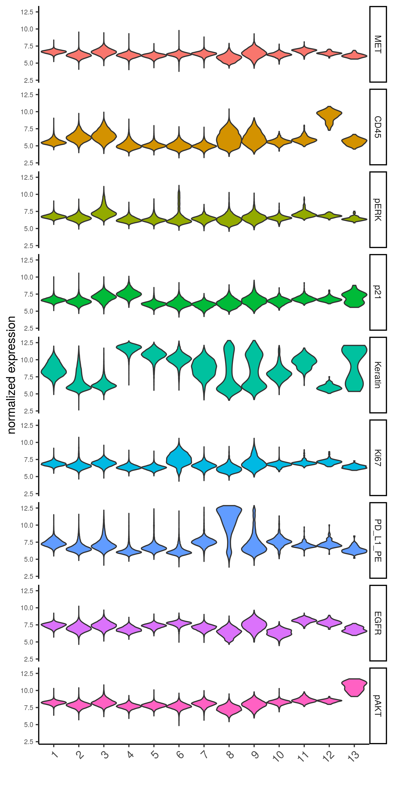{width=10cm} 
</center>


### part 7: cell type annotation

##### Metadata heatmap

Inspect the potential cell type markers
```{r eval=FALSE}
## all genes heatmap
plotMetaDataHeatmap(pdac_test, expression_values = "norm", metadata_cols = 'leiden', 
                    custom_cluster_order = c(1, 10, 3, 12, 8, 2, 9, 6, 11, 13, 4, 5, 7),
                    y_text_size = 8, show_values = 'zscores_rescaled')
```

<center>
{width=10cm} 
</center>

Inspect the potential cell type markers stratified by tissue location
```{r eval=FALSE}
plotMetaDataHeatmap(pdac_test, expression_values = "norm", metadata_cols = c('leiden','hist_info2'), 
                    first_meta_col = 'leiden', second_meta_col = 'hist_info2',
                    y_text_size = 8, show_values = 'zscores_rescaled')
```

<center>
{width=10cm} 
</center>


##### Spatial subsets

Inspect subsets of the data based on tissue location
```{r eval=FALSE}
spatPlot(pdac_test, cell_color = 'leiden', cell_color_code = leiden_colors,
         point_shape = 'no_border', point_size = 0.75, group_by = 'hist_info2')
```
<center>
{width=10cm} 
</center>

```{r eval=FALSE}
spatPlot(pdac_test, cell_color = 'leiden', cell_color_code = leiden_colors, point_shape = 'no_border', point_size = 0.3,
         group_by = 'hist_info2', group_by_subset = c('pancr'), cow_n_col = 1)
```
<center>
{width=10cm} 
</center>

```{r eval=FALSE}
spatPlot(pdac_test, cell_color = 'leiden', cell_color_code = leiden_colors, point_shape = 'no_border', point_size = 0.3,
         group_by = 'hist_info2', group_by_subset = c('PDAC'), cow_n_col = 1)
```
<center>
{width=10cm} 
</center>

```{r eval=FALSE}  
spatPlot(pdac_test, cell_color = 'leiden', cell_color_code = leiden_colors, point_shape = 'no_border', point_size = 0.3,
         group_by = 'hist_info2', group_by_subset = c('small_intest'), cow_n_col = 1)
```
<center>
{width=10cm} 
</center>


##### Spatial distribution of clusters

Visually inspect the spatial distribution of different clusters
```{r eval=FALSE}
# spatial enrichment of groups
for(group in unique(pDataDT(pdac_test)$leiden)) {
  spatPlot(pdac_test, cell_color = 'leiden', point_shape = 'no_border', point_size = 0.3, other_point_size = 0.1,
           select_cell_groups = group, cell_color_code = 'red')
}
```

Here we just show a small subset:  

<center>
{width=10cm} 
</center>

<center>
{width=10cm} 
</center>

<center>
{width=10cm} 
</center>

<center>
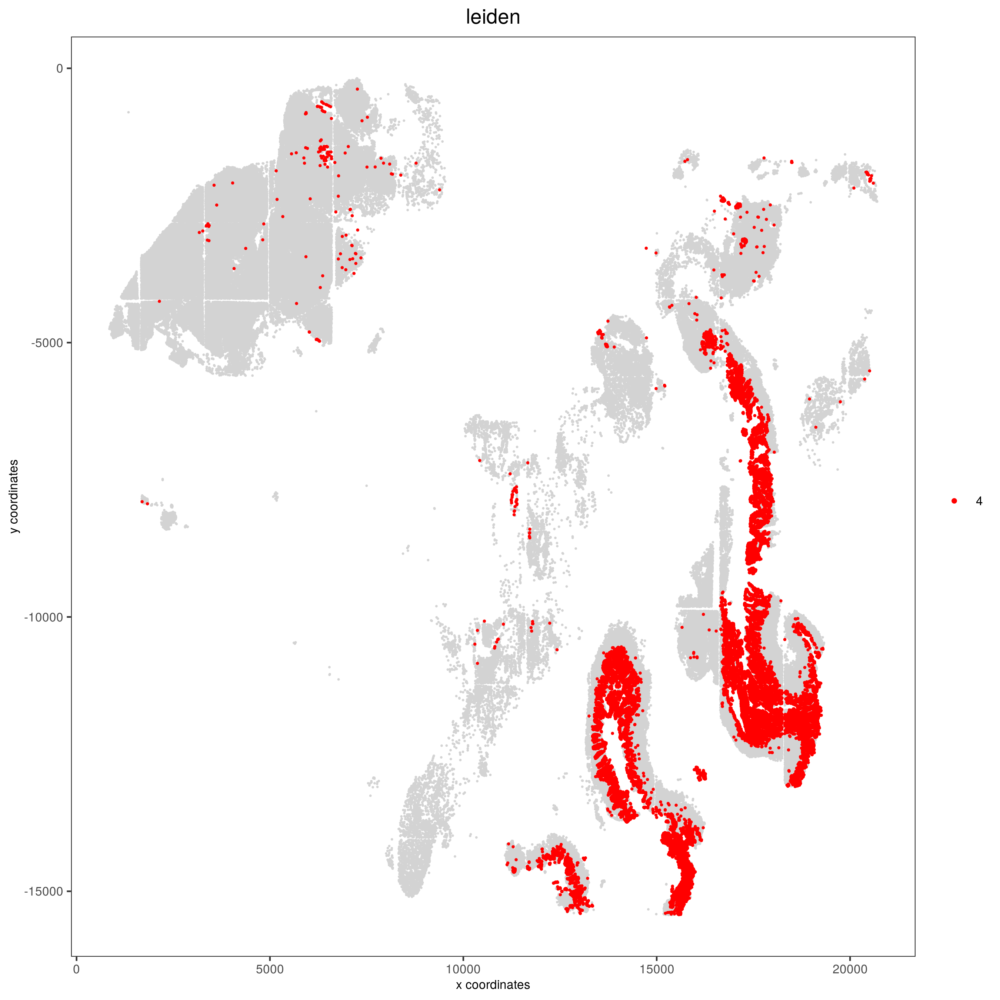{width=10cm} 
</center>


##### Annotate clusters based on spatial position and dominant expression patterns

```{r eval=FALSE}
cell_metadata =  pDataDT(pdac_test)
cluster_data = cell_metadata[, .N, by = c('leiden', 'hist_info2')]
cluster_data[, fraction:= round(N/sum(N), 2), by = c('leiden')]
setorder(cluster_data, leiden, hist_info2, fraction)

# final annotation
names = 1:13
location = c('pancr', 'intest', 'general', 'intest', 'pancr',
             'intest', 'pancr', 'canc', 'general', 'pancr',
             'general', 'pancr', 'intest')
feats = c('epithelial_I', 'fibroblast_VEGFR+', 'stroma_HER2+_pERK+', 'epithelial_lining_p21+', 'epithelial_keratin',
          'epithelial_prolif', 'epithelial_actin++', 'immune_PD-L1+', 'stromal_actin-', 'epithelial_tx_active',
          'epithelial_MET+_EGFR+', 'immune_CD45+', 'epithelial_pAKT')

annot_dt = data.table('names' = names, 'location' = location, 'feats' = feats)
annot_dt[, annotname := paste0(location,'_',feats)]
cell_annot = annot_dt$annotname;names(cell_annot) = annot_dt$names
pdac_test = annotateGiotto(pdac_test, annotation_vector = cell_annot, cluster_column = 'leiden')


# specify colors
leiden_colors
leiden_names = annot_dt$annotname; names(leiden_names) = annot_dt$names

cell_annot_colors = leiden_colors
names(cell_annot_colors) = leiden_names[names(leiden_colors)]

# covisual
spatDimPlot(gobject = pdac_test, cell_color = 'cell_types', cell_color_code = cell_annot_colors,
            spat_point_shape = 'border', spat_point_size = 0.2, spat_point_border_stroke = 0.01,
            dim_point_shape = 'border', dim_point_size = 0.2, dim_point_border_stroke = 0.01,
            dim_show_center_label = F, spat_show_legend = T, dim_show_legend = T, legend_symbol_size = 3)
```
<center>
{width=10cm} 
</center>


```{r eval=FALSE}
# spatial only
spatPlot(gobject = pdac_test, cell_color = 'cell_types', point_shape = 'no_border', point_size = 0.2, 
         coord_fix_ratio = 1, show_legend = T, cell_color_code = cell_annot_colors, background_color = 'black')
```
<center>
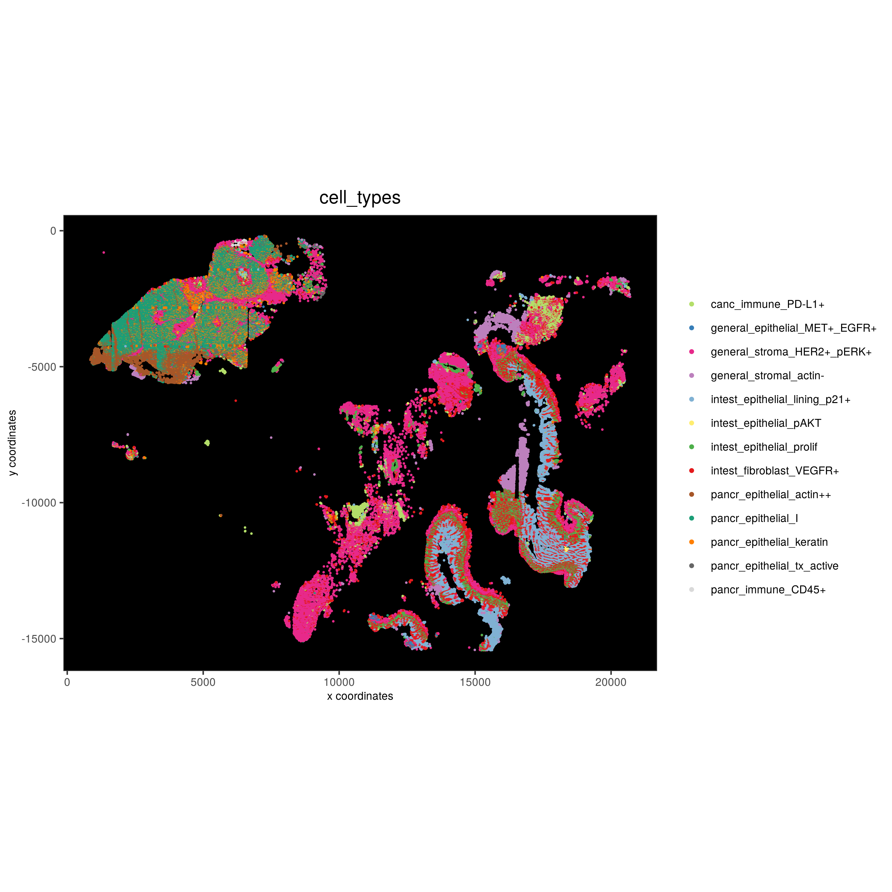{width=10cm} 
</center>


```{r eval=FALSE}
# dimension only
plotUMAP(gobject = pdac_test, cell_color = 'cell_types', point_shape = 'no_border', point_size = 0.2, 
         show_legend = T, cell_color_code = cell_annot_colors, show_center_label = F, background_color = 'black')
```
<center>
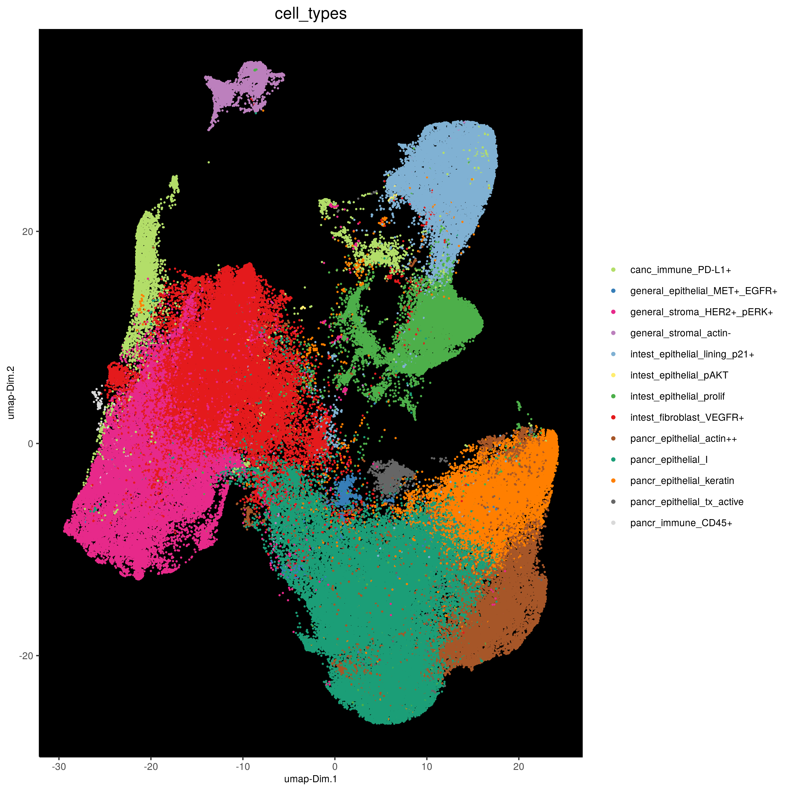{width=10cm} 
</center>


### part X: analyses for paper

Heatmap for cell type annotation:
```{r eval=FALSE}
cell_type_order_pdac = c("pancr_epithelial_actin++", "pancr_epithelial_I", "intest_epithelial_lining_p21+", "pancr_epithelial_keratin", 
                         "intest_epithelial_prolif" ,"general_epithelial_MET+_EGFR+", "intest_epithelial_pAKT", "pancr_epithelial_tx_active",
                         "canc_immune_PD-L1+","general_stromal_actin-", "pancr_immune_CD45+", "intest_fibroblast_VEGFR+",
                         "general_stroma_HER2+_pERK+")

plotMetaDataHeatmap(pdac_test, expression_values = "scaled", metadata_cols = c('cell_types'), 
                    custom_cluster_order = cell_type_order_pdac,
                    y_text_size = 8, show_values = 'zscores_rescaled')
```

<center>
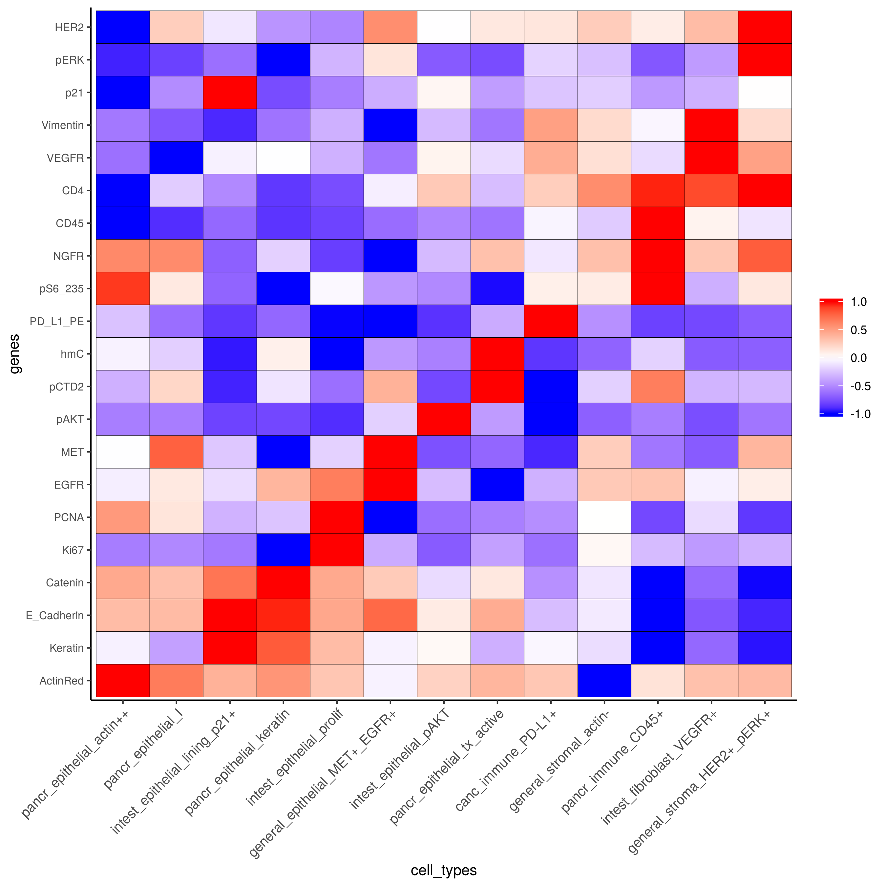{width=10cm} 
</center>

##### Pancreas
Highlight region in pancreas:
```{r eval=FALSE}

## pancreas region ##
my_pancreas_Ids = pdac_metadata[frame == 17][['cell_ID']]
my_pancreas_giotto = subsetGiotto(pdac_test, cell_ids = my_pancreas_Ids)

spatPlot(my_pancreas_giotto, cell_color = 'leiden', point_shape = 'no_border', point_size = 1, cell_color_code = leiden_colors)
```

<center>
{width=10cm} 
</center>

```{r eval=FALSE}
spatGenePlot(my_pancreas_giotto, expression_values = 'scaled', point_border_stroke = 0.01,
             genes = c('E_Cadherin','Catenin', 'Vimentin',  'VEGFR'), point_size = 1)
```

<center>
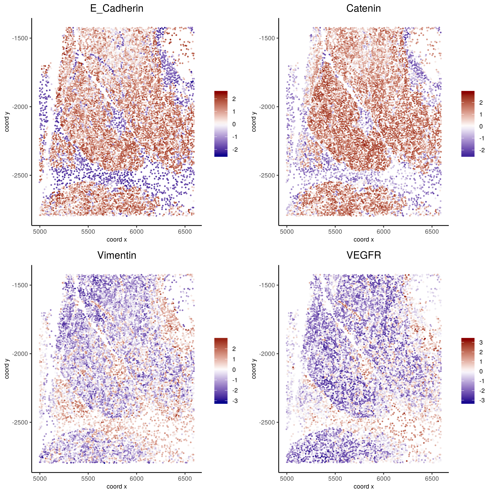{width=10cm} 
</center>

```{r eval=FALSE}
plotUMAP(my_pancreas_giotto, cell_color = 'leiden', point_shape = 'no_border', point_size = 0.5, 
         cell_color_code = leiden_colors, show_center_label = F)
```

<center>
{width=10cm} 
</center>

```{r eval=FALSE}
dimGenePlot(my_pancreas_giotto, expression_values = 'scaled', point_border_stroke = 0.01,
            genes = c('E_Cadherin','Catenin', 'Vimentin',  'VEGFR'), point_size = 1)

```

<center>
{width=10cm} 
</center>

##### Small intestines
Highlight region in small intestines (same as in original paper):
```{r eval=FALSE}
## intestine region ##
my_intest_Ids = pdac_metadata[frame == 115][['cell_ID']]
my_intest_giotto = subsetGiotto(pdac_test, cell_ids = my_intest_Ids)

spatPlot(my_intest_giotto, cell_color = 'leiden', point_shape = 'no_border', point_size = 1, cell_color_code = leiden_colors)
```

<center>
{width=10cm} 
</center>

```{r eval=FALSE}
spatGenePlot(my_intest_giotto, expression_values = 'scaled', point_border_stroke = 0.01,
             genes = c('PCNA','Catenin', 'Ki67',  'pERK'), point_size = 1)
```

<center>
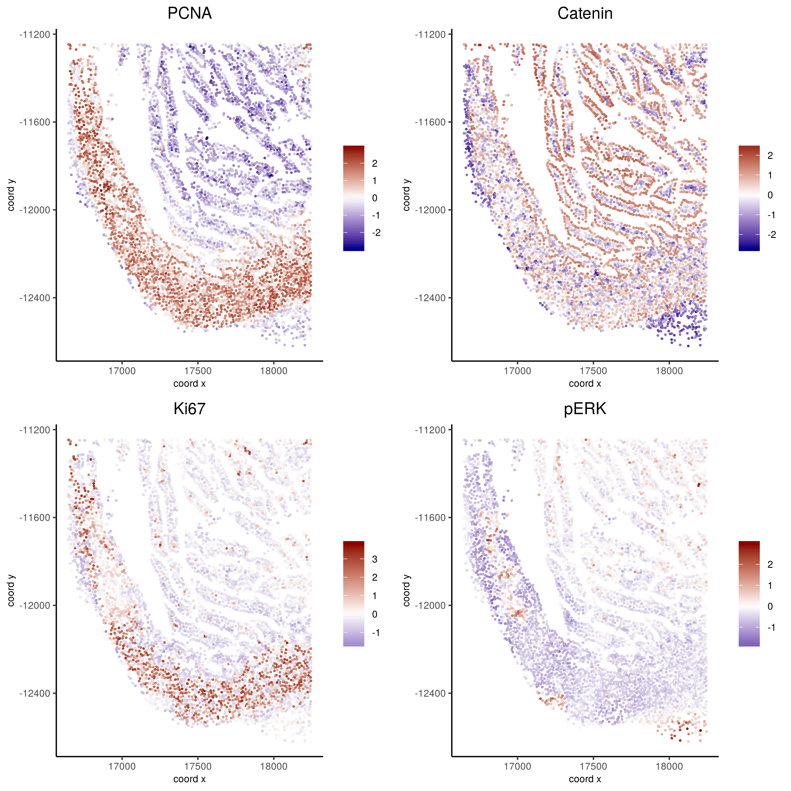{width=10cm} 
</center>

```{r eval=FALSE}
plotUMAP(my_intest_giotto, cell_color = 'leiden', point_shape = 'no_border', point_size = 0.5, 
         cell_color_code = leiden_colors, show_center_label = F)
```

<center>
{width=10cm} 
</center>

```{r eval=FALSE}
dimGenePlot(my_intest_giotto, expression_values = 'scaled', point_border_stroke = 0.01,
            genes = c('PCNA','Catenin', 'Ki67',  'pERK'), point_size = 1)

```

<center>
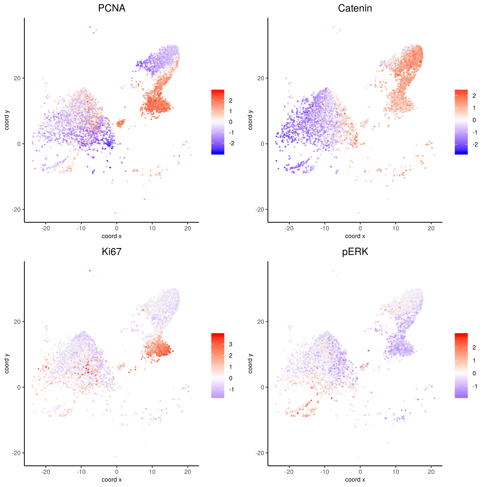{width=10cm} 
</center>


