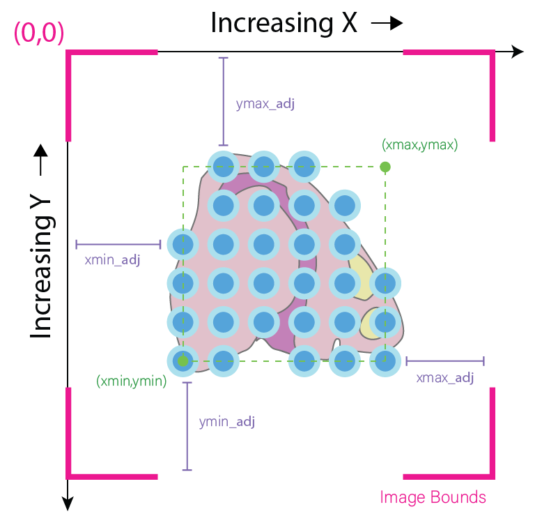
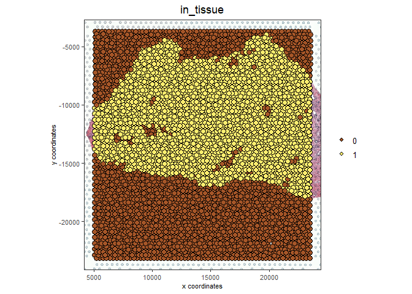
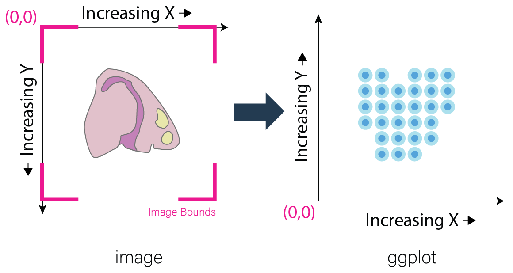
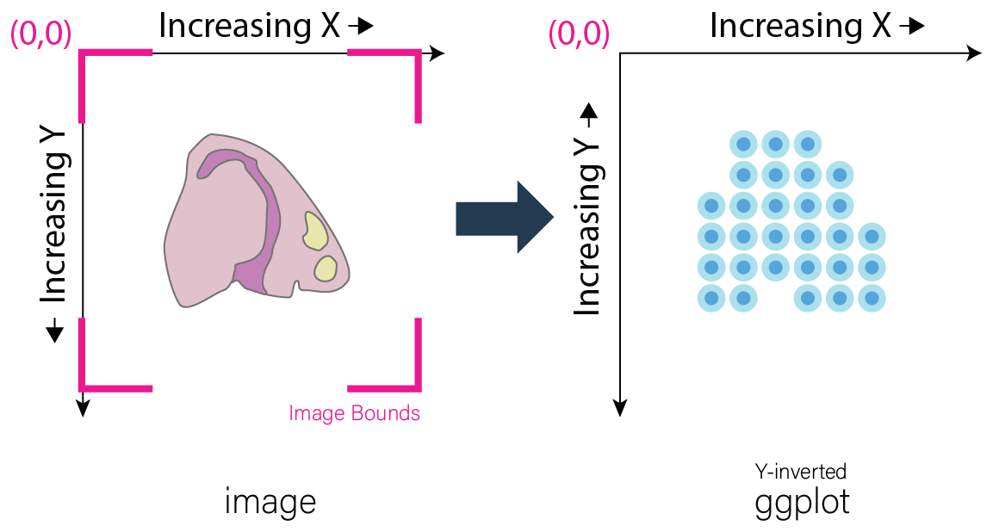
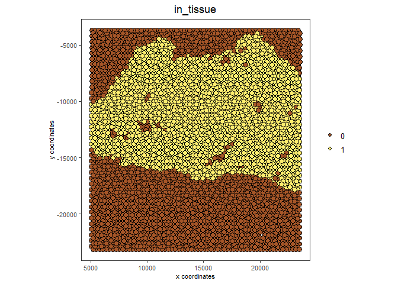

# 1. Giotto and Image Data

Multiple images may be attached to the Giotto object. Spatial data can be overlaid upon these images which may then be used for downstream analyses. While Giotto attempts to automate the addition and alignment of images as much as possible, manual adjustments may sometimes be necessary. This tutorial will be covering both automatic and manual adjustment.

The examples in this tutorial will be worked using Visium's normal human prostate FFPE [dataset](https://www.10xgenomics.com/resources/datasets/normal-human-prostate-ffpe-1-standard-1-3-0) for both the Visium (automatic) and manual adjustment workflows. A manual download of this data is required; please see **Visium Directory Structure Details** below.

For an example of working with high definition images that may require ROI alignment and or stitching, please see the Nanostring CosMx lung data [analysis](./Nanostring_Lung12_jan26_21.html).

# 2. Start Giotto


```{r, eval=FALSE}
# Ensure Giotto Suite is installed
if(!"Giotto" %in% installed.packages()) {
  devtools::install_github("drieslab/Giotto@suite")
}
library(Giotto)

# Ensure Giotto Data is installed
if(!"GiottoData" %in% installed.packages()) {
  devtools::install_github("drieslab/GiottoData")
}
library(GiottoData)

# Ensure the Python environment for Giotto has been installed
genv_exists = checkGiottoEnvironment()
if(!genv_exists){
  # The following command need only be run once to install the Giotto environment
  installGiottoEnvironment()
}
```


# 3. Conceptual Overview

Giotto currently supports two types of image objects. For most purposes, images are loaded in using [terra](https://rdrr.io/cran/terra/) and are then placed into **giottoLargeImage** objects. **giottoLargeImage** objects only load in sampled subsets of the original image that are needed to represent the image, increasing efficiency for analysis of very high-resolution images.

Alternatively, smaller images are loaded in using the [magick](https://rdrr.io/cran/magick/) package and are then placed into **giottoImage** objects. This offers direct access to the powerful image processing functionality in the *magick* package among other Giotto functions for analysis and viewing. **giottoLargeImage** objects can be downsampled into **giottoImage** objects when necessary through use of
the **convertGiottoLargeImageToMG()** function. 


**More about the giottoImage container**

**giottoImages** are S4 class objects with slots containing the image itself and the metadata necessary to plot it properly. The **magick** package allows easy access to image processing functions as well as the ability to access images through pointers, so the images are only loaded into memory when needed.

Please note that as a result of using pointers to access the image, **giottoImages** will not be saved between sessions, since the pointer will die after a given R session is closed. However, the information used to create the image will be retained within the **giottoObject** in the **images** slot, as described below.

When incorporated into a **giottoObject**, **giottoImages** are added into the **images** slot of the **giottoObject**. The **images** slot is organized as a **list()** so multiple **giottoImages** may be added and then referred to individually using the **name** which they have been given.

**giottoImage Structure**

- name - *name of the giottoImage, does not need to match the name of the variable which stores the giotto image. Default is 'image'.*
- mg_object - *image loaded in as magick object (pointer)*
- minmax - *x and y minimum and maximum values found from spatial locations*
- boundaries - *adjustment values for stretching the image based on minmax values*
- scale_factor - *scale factor of spatial locations to image*
- resolution - *spatial location units covered per pixel*
- OS_platform - *computer environment*

*Note that **minmax** refers to the relevant values of the associated spatial locations rather than those of the image. These values are given either by providing spatial locations directly when calling **createGiottoImage()** or in later steps that involve a **giottoObjects** with associated spatial locations.


For maximum flexibility, Giotto plots images and spatial data on different layers that are largely independent of each other. The spatial data is plotted first, essentially serving as an anchor **(xmin, xmax, ymin, ymax)**. The image, no matter its actual dimensions or resolution, is then **stretched** to fit on the plot according to accompanying metadata **(xmin_adj, xmax_adj, ymin_adj, ymax_adj)** which can be edited by the user.



Calling the **giottoImage** by itself will display its class and name, followed the values that occupy its minmax, boundary adjustment, scale_factor, and resolution slots. The actual image boundaries are displayed as spatial values, which detail the points to which the image's edges will be stretched.

Most spatial datasets currently generate spatial locations based on how they map onto an original image. Although this brief explanation is somewhat simplified, Giotto's automatic alignment works as follows:

- Scale image dimensions to original dimensions by dividing by the **scaling_factor**
- **xmin_adj** = (spatial location xmin) - 0
- **xmax_adj** = (xmax image bound in original dimensions) - (spatial  location xmax)
- **ymin_adj** = (spatial location ymin) - (ymin image bound in original dimensions)
- **ymax_adj** = 0 - (spatial location ymax)

For instance, assume a **giottoImage** object named GImage has already been created:


```{r, eval=FALSE}
GImage

## R TERMINAL OUTPUT:
# 
# An object of class ' giottoImage ' with name  image 
#  
# Min and max values are: 
#  Max on x-axis:  23520 
#  Min on x-axis:  5066 
#  Max on y-axis:  -3682 
#  Min on y-axis:  -23148 
#  
# Boundary adjustment are: 
#  Max adjustment on x-axis:  3949.001 
#  Min adjustment on x-axis:  5066 
#  Max adjustment on y-axis:  3682 
#  Min adjustment on y-axis:  2082.277 
#  
# Boundaries are: 
#  Image x-axis max boundary:  27469 
#  Image x-axis min boundary:  0 
#  Image y-axis max boundary:  0 
#  Image y-axis min boundary:  -25230.28 
#
# Scale factor: 
#          x          y 
# 0.07280935 0.07280935 
# 
#  Resolution: 
#        x        y 
#  13.7345  13.7345 
#
# File Path: 
# [1] "/path/to/directory/tissue_image.png"
```


Further intuition for defining these parameters in this way is detailed within the **Why this inversion is necessary** dropdown text beneath Standard workflow.

# 4. Visium Workflow (Automated):

Assembly of Giotto object as well as the reading in and alignment of the tissue staining image from the Visium spatial subdirectory is done automatically using **createGiottoVisiumObject()**.

Note that in order to run the following code, the Output Files "Feature barcode matrix (raw)" and "Spatial imaging data" from the [dataset](https://www.10xgenomics.com/resources/datasets/normal-human-prostate-ffpe-1-standard-1-3-0) must be downloaded and extracted into a structured Visium directory.


**Visium Directory Structure Details**

Here, details on how to structure the Visium Directory for creating a Giotto object using **createGiottoVisiumObject()** for the purposes of this tutorial will be shown. Nonetheless, this procedure is standard practice for using Giotto with Visium Data.

First create a new directory. This will be the Visium Directory. Then, open a terminal within that directory, and enter the following commands:


``` bash
wget https://cf.10xgenomics.com/samples/spatial-exp/1.3.0/Visium_FFPE_Human_Normal_Prostate/Visium_FFPE_Human_Normal_Prostate_raw_feature_bc_matrix.tar.gz
tar -xzvf Visium_FFPE_Human_Normal_Prostate_raw_feature_bc_matrix.tar.gz
wget https://cf.10xgenomics.com/samples/spatial-exp/1.3.0/Visium_FFPE_Human_Normal_Prostate/Visium_FFPE_Human_Normal_Prostate_spatial.tar.gz
tar -xzvf Visium_FFPE_Human_Normal_Prostate_spatial.tar.gz
```


This will create two subdirectories within the Visium Directory, titled "raw_feature_bc_matrix" and "spatial". These subdirectories will contain barcode and expression information, or images and scaling information, respectively. Now, the Visium Directory may be inputted to **createGiottoVisiumObject()**!


A giotto object using either the hires or lowres image will be loaded depending on whether "**tissue_hires_image.png"** or **"tissue_lowres_image.png"** is provided to the **png_name** argument. In this example, the hires image will be plotted.


```{r, eval=FALSE}
library(Giotto)
library(GiottoData)

VisiumDir = '/path/to/visium/directory/'
results_directory = paste0(getwd(),'/gobject_imaging_results/')

# Optional: Specify a path to a Python executable within a conda or miniconda
# environment. If set to NULL (default), the Python executable within the previously
# installed Giotto environment will be used.
my_python_path = NULL # alternatively, "/local/python/path/python" if desired.

# Optional: Set Giotto instructions
instrs = createGiottoInstructions(save_plot = TRUE,
                                  show_plot = TRUE,
                                  save_dir = results_directory,
                                  python_path = my_python_path)
```


```{r, eval=FALSE}
# Create a Giotto Object using Visium Data
FFPE_prostate <- createGiottoVisiumObject(expr_data = 'raw',
                                          visium_dir = VisiumDir,
                                          png_name = "tissue_hires_image.png",
                                          instructions = instrs)
```

```{r, eval=FALSE}
# visualize spots that are in tissue
spatPlot2D(FFPE_prostate,
           show_image = TRUE,
           cell_color = 'in_tissue',
           save_param = list(save_name = 'high_res_IT'))
```





# 5. Standard Workflow

## 5.1 Invert Y-Values

Before beginning, it is important to acknowledge that differences may exist in the conventions for defining coordinates within images and plots. As a result, it is often required to make the spatial location y values negative. This inversion is necessary for the spatial locations to appear in the same orientation as the image. This transformation of the spatial locations is automatically done for Visium datasets during **createGiottoVisiumObject()**. In the standard workflow, it is important to determine if this is necessary for the data at hand.


**Why this inversion is necessary**


**Image Coordinates vs Plotting Coordinates**
By convention, the origin of image coordinates is defined in the upper left, and coordinates increase rightward (x coordinate) and downward (y coordinate). Many spatial methods inherit this convention when  generating spatial location data. However, Giotto plots with the  coordinates originating from the lower left. Thus, without inversion of the y coordinates, the **spatial locations are displayed as vertically flipped compared to how they are intended to be seen**.



**The fix for this is to multiply all the Y-values in spatial locations by -1, inverting them.** This may be done prior to creation of the giotto object by multiplying the y values within the spatial location matrix by -1. If the giotto object has already been created, yet the spatial data still needs inversion, running the following commands will invert the y coordinates.

Here, my_gobject refers to the **giottoObject** and my_spatlocs refers to the name of the **spatial locations** to which the image will be aligned.


```{r, eval=FALSE}
# Retrieve original spatial location data as a spatLocObj
spatlocs <- getSpatialLocations(gobject = my_gobject,
                                spat_loc_name = my_spatlocs,
                                output = 'spatLocsObj')

spatlocs[]$sdimy <- -spatlocs[]$sdimy # Note the negative sign operator for inversion

# Overwrite the original spatial locations with the inverted ones
my_gobject <- setSpatialLocations(gobject = my_gobject,
                                  spat_loc_name = my_spatlocs,
                                  spatlocs = spatlocs)
```





## 5.2 Create giottoImage

giottoImages are created using the **createGiottoImage()** function. This function requires a **magick**-compatible image (eg. jpg, tiff, png) to be provided to the **mg_object** argument as either a filepath or a **magick** object.

If automatic image alignment is desired, the **scale_factor** parameter is required, which scales the spatial locations to the image. *This parameter is required since spatial locations do not contain information about the size of the image is past the spatial xmax and ymin values. Those two image bounds are instead inferred by scaling up the current image dimensions to those of the spatial locations.*

For Visium datasets, scaling information is available in the **scalefactors_json.json** file found within the **spatial** subdirectory.

**scalefactors_json.json** for this [dataset](https://www.10xgenomics.com/resources/datasets/normal-human-prostate-ffpe-1-standard-1-3-0):


```{r, eval=FALSE}
{"tissue_hires_scalef": 0.072809346, "tissue_lowres_scalef": 0.021842804, "fiducial_diameter_fullres": 304.63145798068047, "spot_diameter_fullres": 188.58137874994503}
```


Providing the appropriate factor to the **scale_factor** parameter will result in automatic alignment.


```{r, eval=FALSE}
lowResPath <- paste0(VisiumDir,"Spatial/tissue_lowres_image.png")
lowResG_img <- createGiottoImage(gobject = FFPE_prostate,
                                 mg_object = lowResPath,
                                 name = "low_res",
                                 scale_factor = 0.021842804)
```


Alignment values:


```{r, eval=FALSE}
lowResG_img
```

```{r, eval=FALSE}
    An object of class ' giottoImage ' with name  low_res 

    Min and max values are: 
     Max on x-axis:  23520 
     Min on x-axis:  5066 
     Max on y-axis:  -3682 
     Min on y-axis:  -23148 

    Boundary adjustment are: 
     Max adjustment on x-axis:  3949.001 
     Min adjustment on x-axis:  5066 
     Max adjustment on y-axis:  3682 
     Min adjustment on y-axis:  2077.699 

    Boundaries are: 
     Image x-axis max boundary:  27469 
     Image x-axis min boundary:  0 
     Image y-axis max boundary:  4.547474e-13 
     Image y-axis min boundary:  -25225.7 

    Scale factor: 
            x         y 
    0.0218428 0.0218428 

     Resolution: 
           x        y 
    45.78167 45.78167 

     File Path: 
    [1] "~/Visium_FFPE_Human_Normal_Prostate/Spatial/tissue_lowres_image.png"
```


**Without spatial locations**

```{r, eval=FALSE}
lowResG_img_no_locs <- createGiottoImage(mg_object = lowResPath,
                                         name = "low_res_no_locs",
                                         scale_factor = 0.021842804)
```


Alignment values:


```{r, eval=FALSE}
lowResG_img_no_locs
```

```{r, eval=FALSE}
    An object of class ' giottoImage ' with name  low_res_no_locs 

    Min and max values are: 
     Max on x-axis:  10 
     Min on x-axis:  0 
     Max on y-axis:  10 
     Min on y-axis:  0 

    Boundary adjustment are: 
     Max adjustment on x-axis:  0 
     Min adjustment on x-axis:  0 
     Max adjustment on y-axis:  0 
     Min adjustment on y-axis:  0 

    Boundaries are: 
     Image x-axis max boundary:  10 
     Image x-axis min boundary:  0 
     Image y-axis max boundary:  10 
     Image y-axis min boundary:  0 

    Scale factor: 
            x         y 
    0.0218428 0.0218428 

     Resolution: 
           x        y 
    45.78167 45.78167 

     File Path: 
    [1] "~/Visium_FFPE_Human_Normal_Prostate/Spatial/tissue_lowres_image.png"

```

*Note that only default values are given to minmax and boundaries in this case.*


(**Optional**) Providing spatial location information through either of the **gobject** parameters **spat_loc_name** or **spatial_locs** will populate the minmax and boundary slots in an attempt to auto-align the image with the spatial locations. The auto-alignment can be bypassed by using **do_manual_adj = TRUE** and only the minmax slot will be populated.


**With spatial locations, but also with do_manual_adj = TRUE**


```{r, eval=FALSE}
lowResG_img_manual <- createGiottoImage(gobject = FFPE_prostate,
                                        mg_object = lowResPath,
                                        name = "low_res_manual",
                                        do_manual_adj = TRUE,
                                        xmin_adj = 0,
                                        xmax_adj = 0,
                                        ymin_adj = 0,
                                        ymax_adj = 0,
                                        scale_factor = 0.021842804)
```


Alignment values:


```{r, eval=FALSE}
lowResG_img_manual
```

```{r, eval=FALSE}
    An object of class ' giottoImage ' with name  low_res_manual 

    Min and max values are: 
     Max on x-axis:  23520 
     Min on x-axis:  5066 
     Max on y-axis:  -3682 
     Min on y-axis:  -23148 

    Boundary adjustment are: 
     Max adjustment on x-axis:  0 
     Min adjustment on x-axis:  0 
     Max adjustment on y-axis:  0 
     Min adjustment on y-axis:  0 

    Boundaries are: 
     Image x-axis max boundary:  23520 
     Image x-axis min boundary:  5066 
     Image y-axis max boundary:  -3682 
     Image y-axis min boundary:  -23148 

    Scale factor: 
            x         y 
    0.0218428 0.0218428 

     Resolution: 
           x        y 
    45.78167 45.78167 

     File Path: 
    [1] "~/Visium_FFPE_Human_Normal_Prostate/Spatial/tissue_lowres_image.png"
```


*When* **do_manual_adj = TRUE***, automatic alignment is bypassed in favor of the four manual adjustment values.* *These values (Boundary adjustment) default to 0.*


## 5.3 Add giottoImage to giottoObject and Visualize


```{r, eval=FALSE}
# Since lowResG_img_no_locs is not associated with the gobject FFPE_prostate, it
# may not be added to the gobject.
FFPE_prostate = addGiottoImage(gobject = FFPE_prostate, 
                              images = list(lowResG_img))

spatPlot2D(gobject = FFPE_prostate,
          show_image = TRUE,
          image_name = "low_res",
          cell_color = "in_tissue",
          save_param = list(save_name = 'low_res_IT'))
```


# 6. Manual Adjustment

Manually adjusting the plotting of images comes either during **createGiottoImage()** using **do_manual_adj = TRUE** and the four adjustment values **(xmin_adj, xmax_adj, ymin_adj, ymax_adj)** or after **giottoImage** creation using **updateGiottoImage()**.

This method is performed by eye and may be necessary depending on preference or if despite accounting for scaling, the image coordinates do not match up with the spatial coordinates for some reason.

## 6.1 During giottoImage creation


```{r, eval=FALSE}
# createGiottoImage with manually defined adjustment values
lowResG_img_update_manual <- createGiottoImage(gobject = FFPE_prostate,
                                               mg_object = lowResPath, 
                                               name = "low_res_update_manual",
                                               do_manual_adj = TRUE,
                                               xmin_adj = 5066,
                                               xmax_adj = 3949,
                                               ymin_adj = 2078,
                                               ymax_adj = 3682,
                                               scale_factor = 0.021842804)
```

```{r, eval=FALSE}
FFPE_prostate = addGiottoImage(gobject = FFPE_prostate, 
                               images = list(lowResG_img_update_manual))

spatPlot2D(gobject = FFPE_prostate,
           show_image = TRUE,
           image_name = "low_res_update_manual",
           cell_color = "in_tissue",
           save_param = list(save_name = 'low_res_update_manual_IT'))
```


## 6.2 After giottoImage creation, within the giottoObject


```{r, eval=FALSE}
# createGiottoImage with manually defined adjustment values
lowResG_img_to_update <- createGiottoImage(gobject = FFPE_prostate,
                                           mg_object = lowResPath,
                                           name = "low_res_to_update",
                                           do_manual_adj = TRUE,
                                           xmin_adj = 0,
                                           xmax_adj = 0,
                                           ymin_adj = 0,
                                           ymax_adj = 0,
                                           scale_factor = 0.021842804)
```

```{r, eval=FALSE}
FFPE_prostate = addGiottoImage(gobject = FFPE_prostate, 
                               images = list(lowResG_img_to_update))

spatPlot2D(gobject = FFPE_prostate,
           show_image = TRUE,
           image_name = "low_res_to_update",
           cell_color = "in_tissue",
           save_param = list(save_name = 'low_res_before_update_IT'))
```





```{r, eval=FALSE}
# Use updateGiottoImage() to update the image adjustment values
FFPE_prostate = updateGiottoImage(gobject = FFPE_prostate,
                                  image_name = "low_res_to_update",
                                  xmin_adj = 5066,
                                  xmax_adj = 3949,
                                  ymin_adj = 2078,
                                  ymax_adj = 3682)

spatPlot2D(gobject = FFPE_prostate,
           show_image = TRUE,
           image_name = "low_res_to_update",
           cell_color = "in_tissue",
           save_param = list(save_name = 'low_res_after_update_IT'))
```


# 7. Session Info


```{r, eval=FALSE}
sessionInfo()
```


```{r, eval=FALSE}
    R version 4.2.2 (2022-10-31 ucrt)
    Platform: x86_64-w64-mingw32/x64 (64-bit)
    Running under: Windows 10 x64 (build 22621)

    Matrix products: default

    locale:
    [1] LC_COLLATE=English_United States.utf8 
    [2] LC_CTYPE=English_United States.utf8   
    [3] LC_MONETARY=English_United States.utf8
    [4] LC_NUMERIC=C                          
    [5] LC_TIME=English_United States.utf8    

    attached base packages:
    [1] stats     graphics  grDevices utils     datasets  methods   base     

    other attached packages:
    [1] GiottoData_0.1.0 Giotto_3.2.1    

    loaded via a namespace (and not attached):
     [1] reticulate_1.26    tidyselect_1.2.0   terra_1.7-18       xfun_0.38         
     [5] lattice_0.20-45    colorspace_2.1-0   vctrs_0.6.1        generics_0.1.3    
     [9] htmltools_0.5.4    yaml_2.3.7         utf8_1.2.3         rlang_1.1.0       
    [13] R.oo_1.25.0        pillar_1.9.0       glue_1.6.2         withr_2.5.0       
    [17] R.utils_2.12.2     rappdirs_0.3.3     RColorBrewer_1.1-3 lifecycle_1.0.3   
    [21] munsell_0.5.0      gtable_0.3.3       ragg_1.2.4         R.methodsS3_1.8.2 
    [25] codetools_0.2-18   evaluate_0.20      labeling_0.4.2     knitr_1.42        
    [29] fastmap_1.1.0      parallel_4.2.2     fansi_1.0.4        Rcpp_1.0.10       
    [33] scales_1.2.1       magick_2.7.4       jsonlite_1.8.3     systemfonts_1.0.4 
    [37] farver_2.1.1       textshaping_0.3.6  ggplot2_3.4.1      png_0.1-7         
    [41] digest_0.6.30      dplyr_1.1.1        grid_4.2.2         rprojroot_2.0.3   
    [45] cowplot_1.1.1      here_1.0.1         cli_3.4.1          tools_4.2.2       
    [49] magrittr_2.0.3     tibble_3.2.1       pkgconfig_2.0.3    Matrix_1.5-1      
    [53] data.table_1.14.6  rmarkdown_2.21     rstudioapi_0.14    R6_2.5.1          
    [57] compiler_4.2.2    

```
