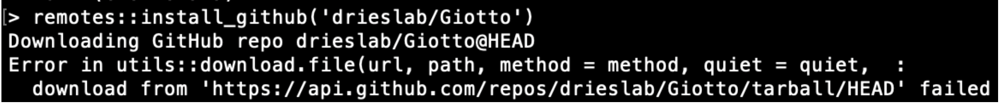

# 1. Installing Giotto Suite

Giotto Suite is installed via R **but there are required Python modules** which **must** be installed in order for Giotto Suite to function properly. Below are the instructions for both the installation of the Giotto Suite package and required Python environment.

## 1.1 Requirements

- R (\>= 4.0.1)
- Python (\>= 3.6)
- Windows, MacOS or Linux specific installation tools for [Posit](https://support.posit.co/hc/en-us/articles/200486498-Package-Development-Prerequisites) (previously RStudio)

# 2. Installation

## 2.1 Install Giotto Suite


```{r, eval=FALSE}
# Necessary for installation from R
if(!"devtools" %in% installed.packages()) {
  install.packages("devtools")
}

devtools::install_github("drieslab/Giotto")
```

NOTE: With the most recent version of Giotto, the following error has been observed, particularly when installing the package from a terminal:




This error is related to the time required for downloading the package. To solve the error, increase the limit of downloading time by running this code in your R console:

```{r, eval=FALSE}
options(timeout = max(1000, getOption("timeout")))
```

If you are doing the installation through a linux terminal, you can run instead this command to directly modify your R environment variable:

```
echo "R_DEFAULT_INTERNET_TIMEOUT = 1000" >> .Renviron
```

## 2.2 Install the Giotto Python Environment


```{r, eval=FALSE}
library(Giotto)
installGiottoEnvironment()
```


# 3. Try Giotto in the cloud

You can also run analyses in Giotto on Terra.bio. Take a look on the [Terra tutorial]https://drieslab.github.io/Giotto/articles/terra.html).

Encountering errors? Checkout out the [Troubleshooting page](https://drieslab.github.io/Giotto/articles/errorsfaqsandtips.html) for help. Alternatively, post to an issue to the Giotto GitHub page [here](https://github.com/drieslab/Giotto). Please include the version numbers of R, Giotto, and the OS in use at the time of the issue.

# 4. Session Info


```{r, eval=FALSE}
sessionInfo()
```


```{r, eval=FALSE}
R version 4.3.2 (2023-10-31)
Platform: aarch64-apple-darwin20 (64-bit)
Running under: macOS Sonoma 14.2.1

Matrix products: default
BLAS:   /System/Library/Frameworks/Accelerate.framework/Versions/A/Frameworks/vecLib.framework/Versions/A/libBLAS.dylib 
LAPACK: /Library/Frameworks/R.framework/Versions/4.3-arm64/Resources/lib/libRlapack.dylib;  LAPACK version 3.11.0

locale:
[1] en_US.UTF-8/en_US.UTF-8/en_US.UTF-8/C/en_US.UTF-8/en_US.UTF-8

time zone: America/Mexico_City
tzcode source: internal

attached base packages:
[1] stats     graphics  grDevices utils     datasets  methods  
[7] base     

other attached packages:
[1] Giotto_4.0.2      GiottoClass_0.1.2

loaded via a namespace (and not attached):
  [1] colorRamp2_0.1.0            DBI_1.2.0                  
  [3] bitops_1.0-7                biomaRt_2.58.0             
  [5] rlang_1.1.2                 magrittr_2.0.3             
  [7] GiottoUtils_0.1.2           matrixStats_1.2.0          
  [9] e1071_1.7-14                compiler_4.3.2             
 [11] RSQLite_2.3.4               png_0.1-8                  
 [13] vctrs_0.6.5                 stringr_1.5.1              
 [15] pkgconfig_2.0.3             SpatialExperiment_1.12.0   
 [17] crayon_1.5.2                fastmap_1.1.1              
 [19] backports_1.4.1             dbplyr_2.4.0               
 [21] magick_2.8.2                XVector_0.42.0             
 [23] utf8_1.2.4                  rmarkdown_2.25             
 [25] purrr_1.0.2                 bit_4.0.5                  
 [27] xfun_0.41                   zlibbioc_1.48.0            
 [29] cachem_1.0.8                GenomeInfoDb_1.38.5        
 [31] progress_1.2.3              blob_1.2.4                 
 [33] rhdf5filters_1.14.1         gmp_0.7-3                  
 [35] DelayedArray_0.28.0         Rhdf5lib_1.24.1            
 [37] terra_1.7-65                parallel_4.3.2             
 [39] prettyunits_1.2.0           R6_2.5.1                   
 [41] stringi_1.8.3               ClusterR_1.3.2             
 [43] GenomicRanges_1.54.1        Rcpp_1.0.11                
 [45] assertthat_0.2.1            SummarizedExperiment_1.32.0
 [47] knitr_1.45                  IRanges_2.36.0             
 [49] Matrix_1.6-4                tidyselect_1.2.0           
 [51] yaml_2.3.8                  rstudioapi_0.15.0          
 [53] abind_1.4-5                 codetools_0.2-19           
 [55] curl_5.2.0                  lattice_0.21-9             
 [57] tibble_3.2.1                Biobase_2.62.0             
 [59] KEGGREST_1.42.0             evaluate_0.23              
 [61] sf_1.0-15                   units_0.8-5                
 [63] proxy_0.4-27                BiocFileCache_2.10.1       
 [65] xml2_1.3.6                  Biostrings_2.70.1          
 [67] pillar_1.9.0                filelock_1.0.3             
 [69] MatrixGenerics_1.14.0       KernSmooth_2.23-22         
 [71] checkmate_2.3.1             stats4_4.3.2               
 [73] generics_0.1.3              RCurl_1.98-1.13            
 [75] S4Vectors_0.40.2            hms_1.1.3                  
 [77] ggplot2_3.4.4               munsell_0.5.0              
 [79] scales_1.3.0                class_7.3-22               
 [81] glue_1.6.2                  tools_4.3.2                
 [83] GiottoVisuals_0.1.1         data.table_1.14.10         
 [85] XML_3.99-0.16               cowplot_1.1.2              
 [87] rhdf5_2.46.1                grid_4.3.2                 
 [89] AnnotationDbi_1.64.1        colorspace_2.1-0           
 [91] SingleCellExperiment_1.24.0 GenomeInfoDbData_1.2.11    
 [93] cli_3.6.2                   rappdirs_0.3.3             
 [95] fansi_1.0.6                 S4Arrays_1.2.0             
 [97] arrow_14.0.0.2              dplyr_1.1.4                
 [99] gtable_0.3.4                digest_0.6.33              
[101] progressr_0.14.0            BiocGenerics_0.48.1        
[103] classInt_0.4-10             SparseArray_1.2.3          
[105] rjson_0.2.21                memoise_2.0.1              
[107] htmltools_0.5.7             lifecycle_1.0.4            
[109] httr_1.4.7                  bit64_4.0.5    
```
