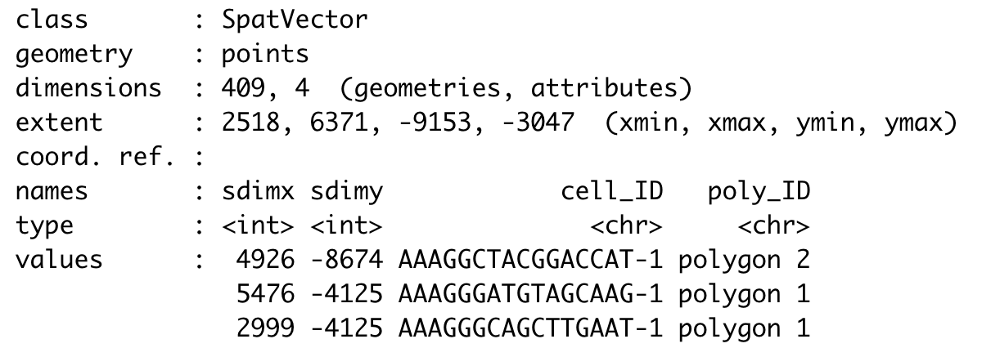

# Set up Giotto object

NOTE: To follow this tutorial, you must pre-run the Parts 1-4 from the [Mouse Visium Brain tutorial](https://giottosuite.readthedocs.io/en/latest/subsections/datasets/mouse_visium_brain.html)

You can use as input either a ggplot2 object, a terra::rast image, or the output of running the spatPlot2D( ) function.


```{r, eval=FALSE}
# Ensure Giotto Suite is installed.
if(!'Giotto' %in% installed.packages()) {
  pak::pkg_install("drieslab/Giotto")
}

# Ensure GiottoData, a small, helper module for tutorials, is installed.
if(!'GiottoData' %in% installed.packages()) {
  pak::pkg_install('drieslab/GiottoData')
}

library(Giotto)

# Ensure the Python environment for Giotto has been installed.
genv_exists = checkGiottoEnvironment()
if(!genv_exists){
  # The following command need only be run once to install the Giotto environment.
  installGiottoEnvironment()
}
```


# 1. Create a Giotto spatPlot object

When creating the spatPlot2D object, you can only plot the spatial cells/spots or show the tissue image in the background.

If you plan to select individual clusters or cell types, we recommend coloring the cells/spots using the cell_color argument.


```{r, eval=FALSE}
## Plot spatial cells/spots
my_spatPlot <- spatPlot2D(gobject = visium_brain,
                          cell_color = 'leiden_clus',
                          point_size = 1.5,
                          point_alpha = 0.5,
                          show_image = FALSE)

## Plot spatial cells/spots with tissue on the background
my_spatPlot <- spatPlot2D(gobject = visium_brain,
                          point_size = 1.5,
                          point_alpha = 0.1,
                          show_image = TRUE)
```


# 2. Run the interactive selection tool

plotInteractivePolygons( ) will run a ShinyApp gadget within your RStudio session. Use your cursor to draw the area of interest and add a name. You can draw as many regions as you wish.


```{r, eval=FALSE}
## Run the Shiny app with default parameters
plotInteractivePolygons(my_spatPlot)
```


```{r, eval=FALSE}
## Run the Shiny app using the tissue image
plotInteractivePolygons(my_spatPlot)
```


You can use additional parameters passed to the polygon( ) function, such as the line thickness and color of the polygons.


```{r, eval=FALSE}
## Modify the width and/or color of the line
plotInteractivePolygons(my_spatPlot,
                        color = 'black',
                        lwd = 2)
```


```{r, eval=FALSE}
## Modify the width or heigh of the plotted image
plotInteractivePolygons(my_spatPlot,
                        height = 500)
```


Use the slider bars to zoom in or out your plot and draw tiny polygons.


```{r, eval=FALSE}
## Use the zoom in and out slide-bars to select small areas
plotInteractivePolygons(my_spatPlot,
                        height = 320)
```


# 3. Save the coordinates

Click on the button *Done* once you have finished selecting the areas of interest.

By default, plotInteractivePolygons() will print the polygon x and y coordinates as a 'data.table' object on the Console panel, but you can store the output using the assignment operator.


```{r, eval=FALSE}
## The polygon coordinates will be saved on my_polygon_coordinates as a data.table object
my_polygon_coordinates <- plotInteractivePolygons(my_spatPlot,
                                                  height = 320)
```


Now, let's add the polygon coordinates to the Giotto object:

Create a polygon object

```{r, eval=FALSE}
## We must transform the data.table or data.frame with coordinates into a Giotto polygon object
my_giotto_polygons <- createGiottoPolygonsFromDfr(my_polygon_coordinates, 
                                                  name = 'selections')
```

If you plan to save and load your Giotto object after adding the selected polygons, include the centroids of the polygon by using the following argument:

```{r, eval=FALSE}
## We must transform the data.table or data.frame with coordinates into a Giotto polygon object
my_giotto_polygons <- createGiottoPolygonsFromDfr(my_polygon_coordinates, 
                                                  name = 'selections',
                                                  calc_centroids = TRUE)
```

Then, add the polygons to the Giotto object

```{r, eval=FALSE}
visium_brain <- addGiottoPolygons(gobject = visium_brain,
                                  gpolygons = list(my_giotto_polygons))
```


Finally, add the corresponding polygon ID to the cell Metadata. By default, the function will add a 'no_polygon' label to cells outside polygons, but you can customize it using the na.label argument.


```{r, eval=FALSE}
## Using the default parameters
visium_brain <- addPolygonCells(visium_brain,
                                polygon_name = 'selections')

## Let's see how it looks like now the cell_metadata
pDataDT(visium_brain)
```


```{r, eval=FALSE}
## Customize the NA label
visium_brain <- addPolygonCells(visium_brain,
                                polygon_name = 'selections',
                                na.label = 'No Polygon')
```


# 4. Get the cells located within each polygon


You can extract the coordinates and IDs from cells located within one or multiple regions of interest.


```{r, eval=FALSE}
## Provide the name of the polygon to extract cells from
getCellsFromPolygon(visium_brain,
                    polygon_name = 'selections',
                    polygons = 'polygon 1')
```


```{r, eval=FALSE}
## If no polygon name is provided, the function will retrieve cells located within all polygons
getCellsFromPolygon(visium_brain,
                    polygon_name = 'selections')
```




# 5. Compare gene expression 

Let's compare the expression levels of some genes of interest between the selected regions.


```{r, eval=FALSE}
## You can provide a list of genes
comparePolygonExpression(visium_brain,
                         selected_feats = c('Stmn1', 'Psd', 'Ly6h'))
```


```{r, eval=FALSE}
## Or calculate the top genes expressed within each region, then provide the result to compare polygons.
scran_results <- findMarkers_one_vs_all(visium_brain,
                                        spat_unit = 'cell',
                                        feat_type = 'rna',
                                        method = 'scran',
                                        expression_values = 'normalized',
                                        cluster_column = 'selections',
                                        min_feats = 10)

top_genes <- scran_results[, head(.SD, 2), by = 'cluster']$feats

comparePolygonExpression(visium_brain,
                         selected_feats = top_genes)
```


# 6. Compare cell type abundance 

If you have run an analysis for finding clusters or have annotated cell types within the cell metadata slot, you can use the column name to compare the abundance of cell types between the selected regions.


```{r, eval=FALSE}
## By default, the function will look for the leiden_cluster
compareCellAbundance(visium_brain)

## You can use other columns within the cell metadata table to compare the cell type abundances
compareCellAbundance(visium_brain, cell_type_column = 'cell_type')
```


# 7. Create a spatPlot per region 

You can use the spatPlot( ) arguments to isolate and plot each region. Also, you can color each cell by cluster, cell type or expression level.


```{r, eval=FALSE}
## Compare clusters within each region
spatPlot2D(visium_brain,
           cell_color = 'leiden_clus',
           group_by = 'selections',
           point_size = 1,
           coord_fix_ratio = 1,
           cow_n_col = 3,
           show_legend = FALSE)
```


```{r, eval=FALSE}
## Compare expression levels between regions
spatFeatPlot2D(visium_brain,
               expression_values = 'scaled',
               group_by = 'selections',
               feats = 'Psd',
               point_size = 1)
```


# 8. Plot again the polygons 

You can plot again all or some drawn polygons. The minimal input is the Giotto object containing polygon coordinates within the spatial_info slot, as well as the spatial plot.


```{r, eval=FALSE}
## Plot all polygons
plotPolygons(visium_brain,
             polygon_name = 'selections',
             x = my_spatPlot)
```


Additionaly, you can plot a few polygons by providing a vector with the polygon IDs.

```{r, eval=FALSE}
## Plot a subset of polygons
plotPolygons(visium_brain,
             polygon_name = 'selections',
             x = my_spatPlot,
             polygons = 'polygon 2')
```


# 9. Session info

```{r, eval=FALSE}
sessionInfo()
```

```{r, eval=FALSE}
R version 4.3.2 (2023-10-31)
Platform: x86_64-apple-darwin20 (64-bit)
Running under: macOS Sonoma 14.3.1

Matrix products: default
BLAS:   /System/Library/Frameworks/Accelerate.framework/Versions/A/Frameworks/vecLib.framework/Versions/A/libBLAS.dylib 
LAPACK: /Library/Frameworks/R.framework/Versions/4.3-x86_64/Resources/lib/libRlapack.dylib;  LAPACK version 3.11.0

locale:
[1] en_US.UTF-8/en_US.UTF-8/en_US.UTF-8/C/en_US.UTF-8/en_US.UTF-8

time zone: America/New_York
tzcode source: internal

attached base packages:
[1] stats     graphics  grDevices utils     datasets  methods   base     

other attached packages:
[1] shiny_1.8.0       Giotto_4.0.2      GiottoClass_0.1.3

loaded via a namespace (and not attached):
  [1] colorRamp2_0.1.0            bitops_1.0-7                rlang_1.1.3                
  [4] magrittr_2.0.3              GiottoUtils_0.1.5           matrixStats_1.2.0          
  [7] compiler_4.3.2              png_0.1-8                   systemfonts_1.0.5          
 [10] vctrs_0.6.5                 pkgconfig_2.0.3             SpatialExperiment_1.12.0   
 [13] crayon_1.5.2                fastmap_1.1.1               ellipsis_0.3.2             
 [16] backports_1.4.1             magick_2.8.2                XVector_0.42.0             
 [19] labeling_0.4.3              utf8_1.2.4                  promises_1.2.1             
 [22] rmarkdown_2.25              ragg_1.2.7                  xfun_0.42                  
 [25] cachem_1.0.8                zlibbioc_1.48.0             beachmat_2.18.0            
 [28] GenomeInfoDb_1.38.6         jsonlite_1.8.8              later_1.3.2                
 [31] DelayedArray_0.28.0         BiocParallel_1.36.0         terra_1.7-71               
 [34] irlba_2.3.5.1               parallel_4.3.2              R6_2.5.1                   
 [37] bslib_0.6.1                 RColorBrewer_1.1-3          reticulate_1.35.0          
 [40] parallelly_1.36.0           jquerylib_0.1.4             GenomicRanges_1.54.1       
 [43] Rcpp_1.0.12                 SummarizedExperiment_1.32.0 knitr_1.45                 
 [46] future.apply_1.11.1         R.utils_2.12.3              IRanges_2.36.0             
 [49] FNN_1.1.4                   httpuv_1.6.14               Matrix_1.6-5               
 [52] igraph_2.0.1.1              tidyselect_1.2.0            rstudioapi_0.15.0          
 [55] abind_1.4-5                 yaml_2.3.8                  codetools_0.2-19           
 [58] miniUI_0.1.1.1              listenv_0.9.1               lattice_0.22-5             
 [61] tibble_3.2.1                Biobase_2.62.0              withr_3.0.0                
 [64] evaluate_0.23               Rtsne_0.17                  future_1.33.1              
 [67] pillar_1.9.0                MatrixGenerics_1.14.0       checkmate_2.3.1            
 [70] stats4_4.3.2                generics_0.1.3              dbscan_1.1-12              
 [73] RCurl_1.98-1.14             S4Vectors_0.40.2            ggplot2_3.4.4              
 [76] munsell_0.5.0               scales_1.3.0                xtable_1.8-4               
 [79] gtools_3.9.5                globals_0.16.2              glue_1.7.0                 
 [82] tools_4.3.2                 GiottoVisuals_0.1.4         data.table_1.15.0          
 [85] ScaledMatrix_1.10.0         cowplot_1.1.3               grid_4.3.2                 
 [88] colorspace_2.1-0            SingleCellExperiment_1.24.0 GenomeInfoDbData_1.2.11    
 [91] BiocSingular_1.18.0         cli_3.6.2                   rsvd_1.0.5                 
 [94] textshaping_0.3.7           fansi_1.0.6                 S4Arrays_1.2.0             
 [97] dplyr_1.1.4                 uwot_0.1.16                 gtable_0.3.4               
[100] R.methodsS3_1.8.2           sass_0.4.8                  digest_0.6.34              
[103] BiocGenerics_0.48.1         SparseArray_1.2.3           ggrepel_0.9.5              
[106] rjson_0.2.21                farver_2.1.1                memoise_2.0.1              
[109] htmltools_0.5.7             R.oo_1.26.0                 lifecycle_1.0.4            
[112] mime_0.12   
```

