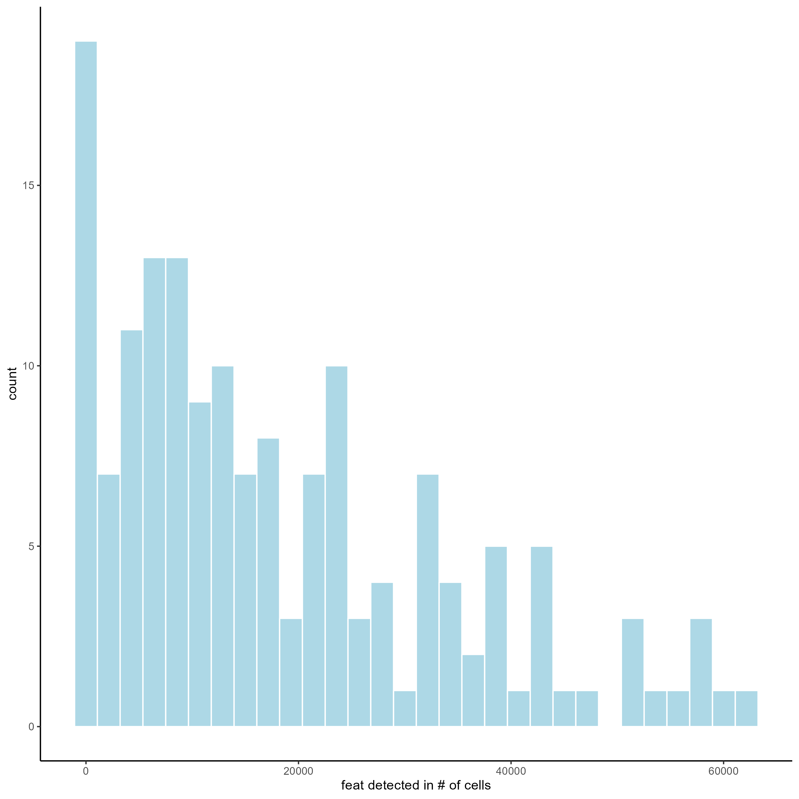
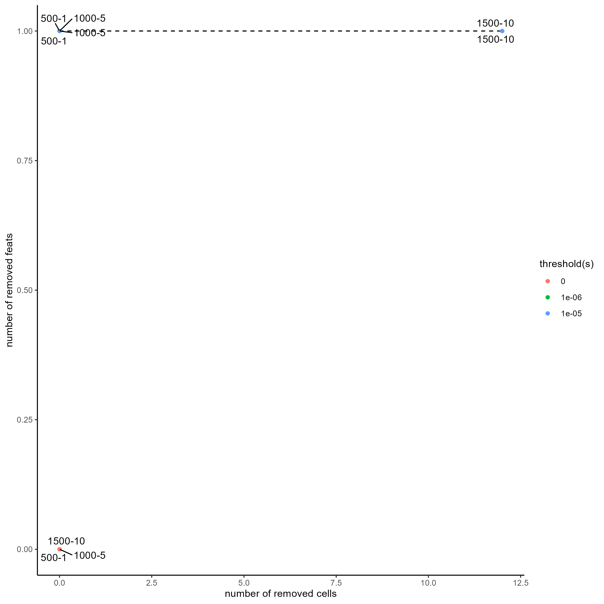
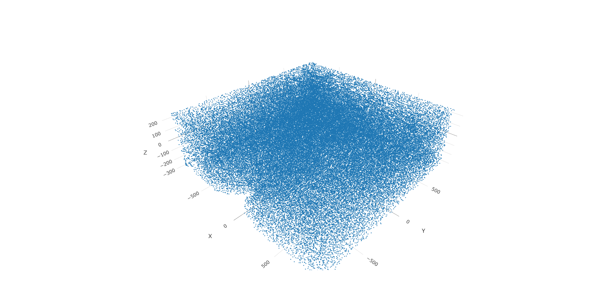
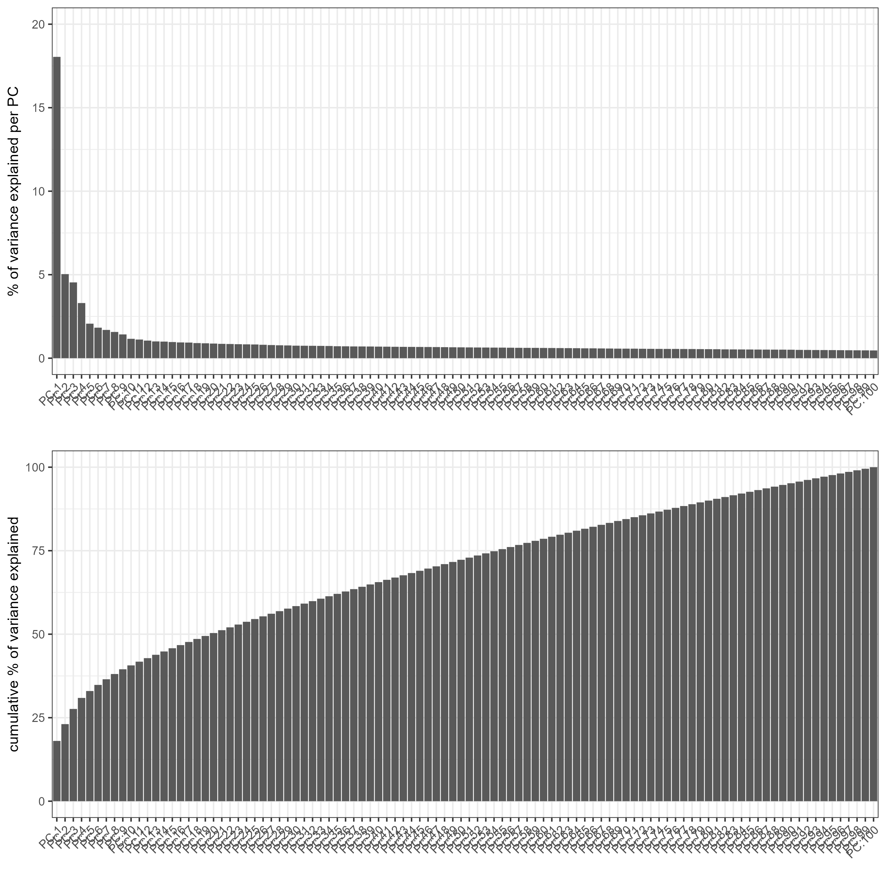
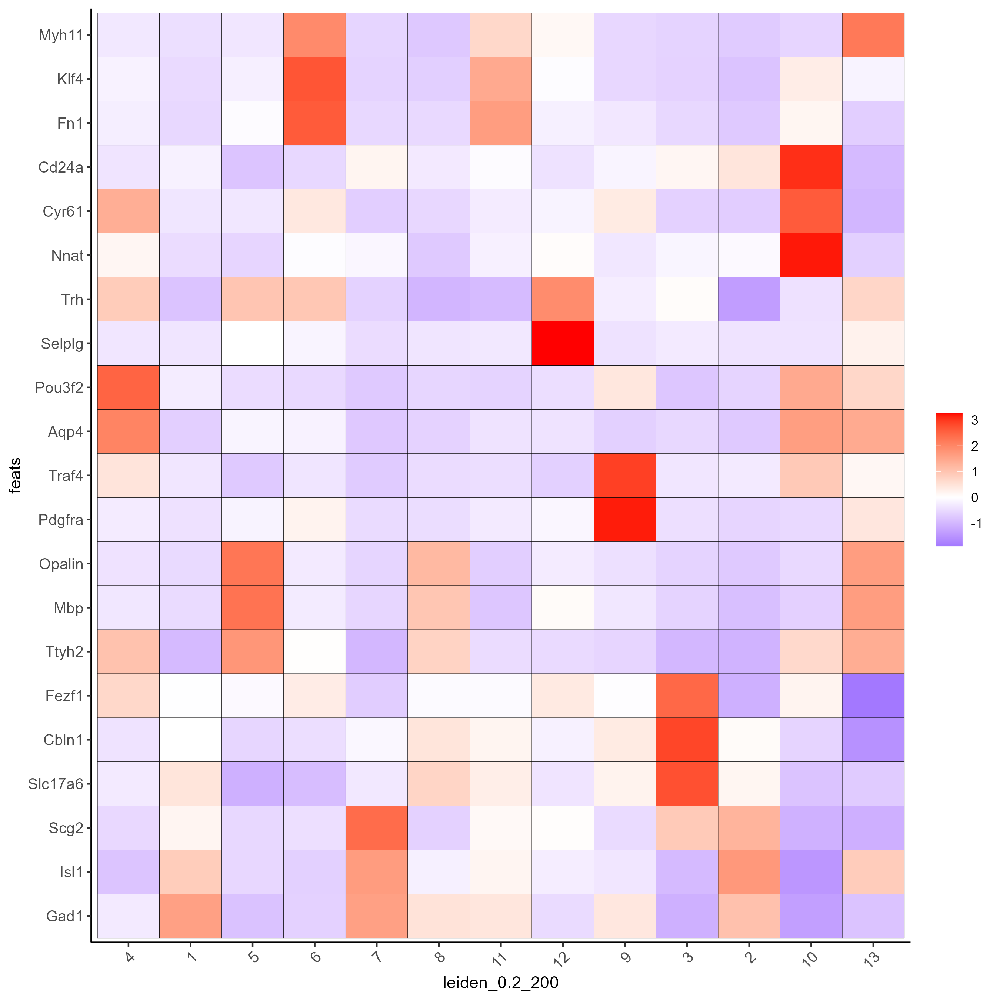
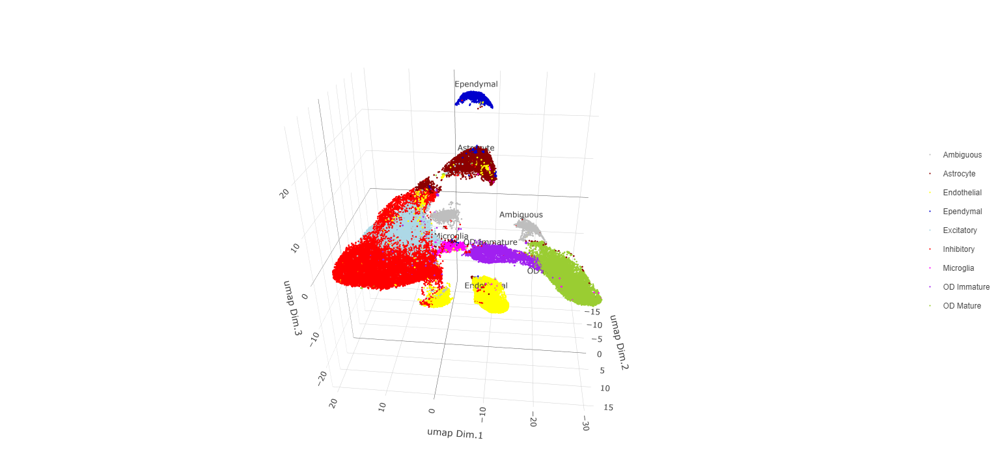
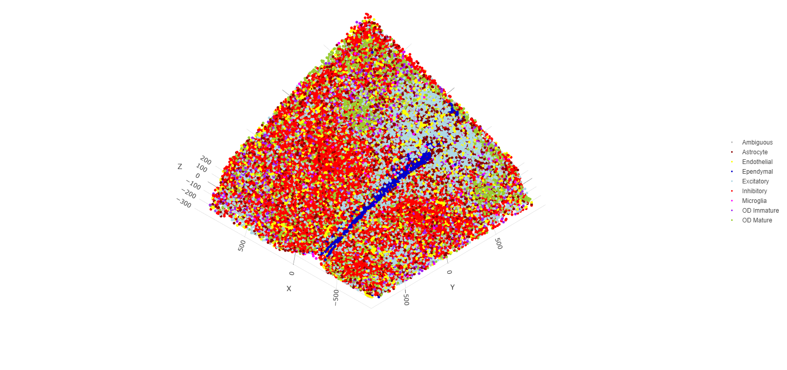
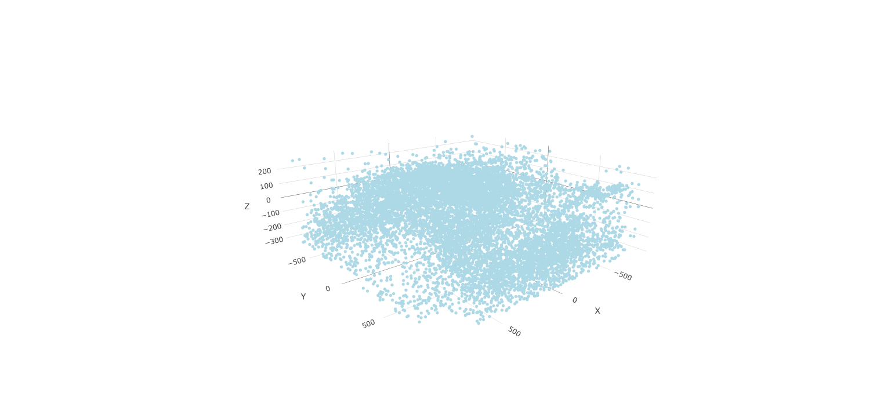
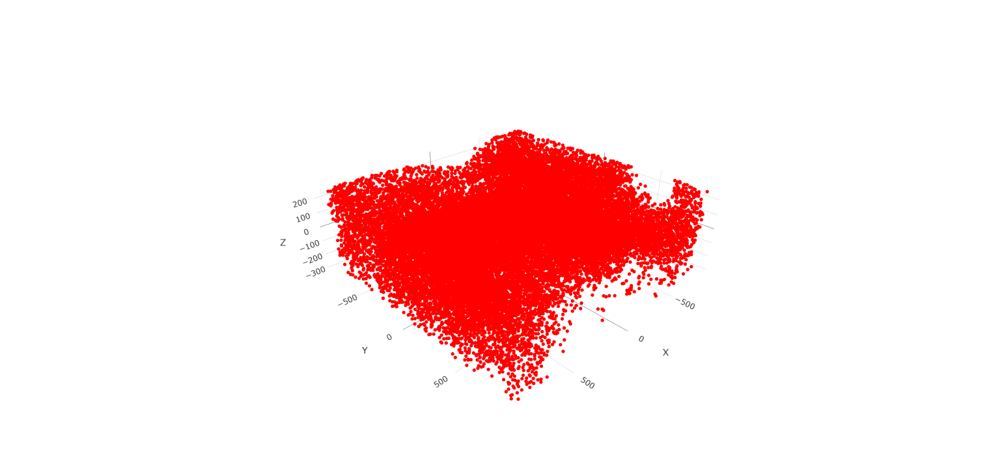
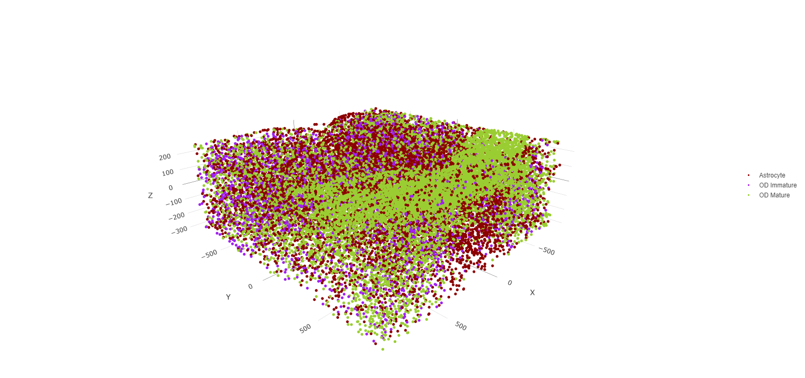

Giotto version 2.0.0.998. Please check the version you are using to get the same results.

Clustering, 3D visualization, and cell type identification of clusters using marker genes will be explored in this tutorial.

```{r, eval=FALSE}
# Ensure Giotto Suite is installed.
if(!"Giotto" %in% installed.packages()) {
  pak::pkg_install("drieslab/Giotto")
}

# Ensure GiottoData, a small, helper module for tutorials, is installed.
if(!"GiottoData" %in% installed.packages()) {
  pak::pkg_install("drieslab/GiottoData")
}

library(Giotto)
# Ensure the Python environment for Giotto has been installed.
genv_exists = checkGiottoEnvironment()
if(!genv_exists){
  # The following command need only be run once to install the Giotto environment.
  installGiottoEnvironment()
}
```


# 1. Start Giotto                                                      


```{r, eval=FALSE}
library(Giotto)
library(GiottoData)

# Specify path from which data may be retrieved/stored
data_directory = paste0(getwd(),'/gobject_visual_data/')
# alternatively, "/path/to/where/the/data/lives/"

# Specify path to which results may be saved
results_directory = paste0(getwd(),'/gobject_visual_results/') 
# alternatively, "/path/to/store/the/results/"

# Optional: Specify a path to a Python executable within a conda or miniconda 
# environment. If set to NULL (default), the Python executable within the previously
# installed Giotto environment will be used.
my_python_path = NULL # alternatively, "/local/python/path/python" if desired.
```


# Dataset Explanation

[Moffitt et al.](https://doi.org/10.1126/science.aau5324) created a 3D spatial expression dataset consisting of 155 genes from ~1 million single cells acquired from mouse hypothalamic preoptic regions. Please ensure that [wget](https://www.gnu.org/software/wget/?) is installed locally to streamline the download.

# Dataset Download


```{r, eval=FALSE}
# In the event of authentication issues with wget, 
# add ", extra = '--no-check-certificate' " after the method argument.
# Get the dataset:
getSpatialDataset(dataset = 'merfish_preoptic', 
                  directory = data_directory, 
                  method = 'wget')
```


# 1. Create Giotto Instructions & Prepare Data


```{r, eval=FALSE}
# Optional, but encouraged: Set Giotto instructions
instrs = createGiottoInstructions(save_plot = TRUE,
                                  show_plot = TRUE,
                                  save_dir = results_directory, 
                                  python_path = my_python_path)

# Create file paths to feed data into Giotto Object
expr_path = paste0(data_directory, "merFISH_3D_data_expression.txt.gz")
loc_path = paste0(data_directory, "merFISH_3D_data_cell_locations.txt")
meta_path = paste0(data_directory, "merFISH_3D_metadata.txt")
```


# 2. Create Giotto Object & Process Data


```{r, eval=FALSE}
# Create Giotto object
merFISH_gobject <- createGiottoObject(expression = expr_path,
                                      spatial_locs = loc_path,
                                      instructions = instrs)


# Add additional metadata
metadata = data.table::fread(meta_path)
merFISH_gobject = addCellMetadata(merFISH_gobject, 
                                  new_metadata = metadata$layer_ID, 
                                  vector_name = 'layer_ID')
merFISH_gobject = addCellMetadata(merFISH_gobject,
                                  new_metadata = metadata$orig_cell_types,
                                  vector_name = 'orig_cell_types')
```


First pre-test filter parameters for both features and cells.


```{r, eval=FALSE}
filterDistributions(merFISH_gobject, detection = 'feats')
```





```{r, eval=FALSE}
filterDistributions(merFISH_gobject, detection = 'cells')
```


```{r, eval=FALSE}
filterCombinations(merFISH_gobject,
                  expression_thresholds = c(0,1e-6,1e-5),
                  feat_det_in_min_cells = c(500, 1000, 1500),
                  min_det_feats_per_cell = c(1, 5, 10))
```




Use the previously generated plots to inform filter decisions.


```{r, eval=FALSE}
## Data Processing

# Filter data
merFISH_gobject <- filterGiotto(gobject = merFISH_gobject,
                                feat_det_in_min_cells = 0,
                                min_det_feats_per_cell = 0)
# Normalize data
merFISH_gobject <- normalizeGiotto(gobject = merFISH_gobject, 
                                   scalefactor = 10000, 
                                   verbose = T)

# Add statistics to Giotto Object
merFISH_gobject <- addStatistics(gobject = merFISH_gobject, 
                                 expression_values = 'normalized')

# Adjust for covariates
merFISH_gobject <- adjustGiottoMatrix(gobject = merFISH_gobject, expression_values = c('normalized'),
                                      batch_columns = NULL, covariate_columns = c('layer_ID'),
                                      return_gobject = TRUE,
                                      update_slot = c('custom'))
```


Now, take a glance at the data in both 2D and 3D.


```{r, eval=FALSE}
# 2D
spatPlot(gobject = merFISH_gobject, point_size = 1.5)
```


```{r, eval=FALSE}
# 3D
spatPlot3D(gobject = merFISH_gobject, point_size = 1.25, axis_scale = 'real')
```




# Part 3: Dimension Reduction

There are only 155 genes within this dataset. Use them all (default) within the dimension reduction.


```{r, eval=FALSE}
merFISH_gobject <- runPCA(gobject = merFISH_gobject, 
                          feats_to_use = NULL, 
                          scale_unit = FALSE, 
                          center = TRUE)

# View details about the principal components
screePlot(merFISH_gobject)
```




After the PCA, a UMAP may be run. Run the UMAP so clusters may be visualized upon it.


```{r, eval=FALSE}
merFISH_gobject <- runUMAP(merFISH_gobject, 
                           dimensions_to_use = 1:8, 
                           n_components = 3, 
                           n_threads = 4)

plotUMAP_3D(gobject = merFISH_gobject, point_size = 1.5) 
```


# Part 4: Cluster

Create a nearest network, then perform Leiden clustering. The clusters may be visualized on a UMAP.


```{r, eval=FALSE}
# Create a sNN network (default)
merFISH_gobject <- createNearestNetwork(gobject = merFISH_gobject, 
                                        dimensions_to_use = 1:8, 
                                        k = 15)
# Leiden cluster
merFISH_gobject <- doLeidenCluster(gobject = merFISH_gobject, 
                                   resolution = 0.2, 
                                   n_iterations = 200,
                                   name = 'leiden_0.2_200')
# Plot the clusters upon the UMAP
plotUMAP_3D(gobject = merFISH_gobject, 
            cell_color = 'leiden_0.2_200', 
            point_size = 1.5, 
            show_center_label = F)
```


# Part 5: Co-Visualize

View the clusters in-tissue on each layer.


```{r, eval=FALSE}
spatPlot2D(gobject = merFISH_gobject, 
           point_size = 1.5, 
           cell_color = 'leiden_0.2_200', 
           group_by = 'layer_ID', 
           cow_n_col = 2, 
           group_by_subset = c(260, 160, 60, -40, -140, -240))
```


# Part 6: Cell Type Marker Gene Detection

Call **findMarkers_one_vs_all** to identify marker features. Click the function to see alternate methods, or look findGiniMarkers section for details on the gini method. Once marker features have been determined, observe the differential expression across clusters within the violin plot.


```{r, eval=FALSE}
markers = findMarkers_one_vs_all(gobject = merFISH_gobject,
                                 method = 'gini',
                                 expression_values = 'normalized',
                                 cluster_column = 'leiden_0.2_200',
                                 min_feats = 1, rank_score = 2)
# Display details about the marker genes in-console
markers[, head(.SD, 2), by = 'cluster']

# violinplot
topgini_genes = unique(markers[, head(.SD, 2), by = 'cluster']$feats)
violinPlot(merFISH_gobject, feats = topgini_genes, cluster_column = 'leiden_0.2_200', strip_position = 'right')
```


```{r, eval=FALSE}
topgini_genes = unique(markers[, head(.SD, 6), by = 'cluster']$feats)
plotMetaDataHeatmap(merFISH_gobject, expression_values = 'scaled',
                    metadata_cols = c('leiden_0.2_200'),
                    selected_feats = topgini_genes)
```


# Part 7: Cell-Type Annotation

Use known marker and differentially expressed genes (DEGs) to identify cell type for each cluster.


```{r, eval=FALSE}
# Known markers and DEGs
selected_genes = c('Myh11', 'Klf4', 'Fn1', 'Cd24a', 'Cyr61', 'Nnat', 'Trh', 
                   'Selplg', 'Pou3f2', 'Aqp4', 'Traf4', 'Pdgfra', 'Opalin', 
                   'Mbp', 'Ttyh2', 'Fezf1', 'Cbln1', 'Slc17a6', 'Scg2', 'Isl1', 'Gad1')

gobject_cell_metadata = pDataDT(merFISH_gobject)
cluster_order = unique(gobject_cell_metadata$leiden_0.2_200)

plotMetaDataHeatmap(merFISH_gobject, expression_values = 'scaled',
                    metadata_cols = c('leiden_0.2_200'),
                    selected_feats = selected_genes,
                    custom_feat_order = rev(selected_genes),
                    custom_cluster_order = cluster_order)
```




Since there are more Leiden clusters than there are types of cells in this dataset, the same cell type may be assigned to different cluster numbers. This may be done only after verifying that particular clusters highly express marker genes corresponding to the same cell type. The above heatmap is used to streamline this process. Call **annotateGiotto** to map cell types to Leiden clusters; these will appear in *cell_metadata* within the **giottoObject**.


```{r, eval=FALSE}
# Name clusters
clusters_cell_types_hypo = c('Inhibitory', 'Inhibitory', 'Excitatory', 'Astrocyte','OD Mature', 'Endothelial',
                             'OD Mature', 'OD Immature',  'Ambiguous','Ependymal', 'Endothelial', 'Microglia', 'OD Mature')
names(clusters_cell_types_hypo) = as.character(sort(cluster_order))

merFISH_gobject = annotateGiotto(gobject = merFISH_gobject, 
                                 annotation_vector = clusters_cell_types_hypo,
                                 cluster_column = 'leiden_0.2_200', 
                                 name = 'cell_types')

## show heatmap
plotMetaDataHeatmap(merFISH_gobject, 
                    expression_values = 'scaled',
                    metadata_cols = c('cell_types'),
                    selected_feats = selected_genes,
                    custom_feat_order = rev(selected_genes),
                    custom_cluster_order = clusters_cell_types_hypo)
```


# Part 8: Visualize


```{r, eval=FALSE}
# Assign colors to each cell type 
mycolorcode = c('red', 'lightblue', 'yellowgreen','purple', 'darkred',
                'magenta', 'mediumblue', 'yellow', 'gray')
names(mycolorcode) = c('Inhibitory', 'Excitatory','OD Mature', 'OD Immature', 
                       'Astrocyte', 'Microglia', 'Ependymal','Endothelial', 'Ambiguous')

plotUMAP_3D(merFISH_gobject, 
            cell_color = 'cell_types', 
            point_size = 1.5, 
            cell_color_code = mycolorcode)
```



```{r, eval=FALSE}
spatPlot3D(merFISH_gobject,
           cell_color = 'cell_types', axis_scale = 'real',
           sdimx = 'sdimx', sdimy = 'sdimy', sdimz = 'sdimz',
           show_grid = F, cell_color_code = mycolorcode)
```



```{r, eval=FALSE}
spatPlot2D(gobject = merFISH_gobject, point_size = 1.0,
           cell_color = 'cell_types', cell_color_code = mycolorcode,
           group_by = 'layer_ID', cow_n_col = 2, group_by_subset = c(seq(260, -290, -100)))
```


## Excitatory Cells Only

```{r, eval=FALSE}
spatPlot3D(merFISH_gobject,
           cell_color = 'cell_types', axis_scale = 'real',
           sdimx = 'sdimx', sdimy = 'sdimy', sdimz = 'sdimz',
           show_grid = F, cell_color_code = mycolorcode,
           select_cell_groups = 'Excitatory', show_other_cells = F)
```



```{r, eval=FALSE}
spatPlot2D(gobject = merFISH_gobject, point_size = 1.0, 
           cell_color = 'cell_types', cell_color_code = mycolorcode,
           select_cell_groups = 'Excitatory', show_other_cells = F,
           group_by = 'layer_ID', cow_n_col = 2, group_by_subset = c(seq(260, -290, -100)))
```


## Inhibitory Cells Only

```{r, eval=FALSE}
spatPlot3D(merFISH_gobject,
           cell_color = 'cell_types', axis_scale = 'real',
           sdimx = 'sdimx', sdimy = 'sdimy', sdimz = 'sdimz',
           show_grid = F, cell_color_code = mycolorcode,
           select_cell_groups = 'Inhibitory', show_other_cells = F)
```



```{r, eval=FALSE}
spatPlot2D(gobject = merFISH_gobject, point_size = 1.0, 
           cell_color = 'cell_types', cell_color_code = mycolorcode,
           select_cell_groups = 'Inhibitory', show_other_cells = F,
           group_by = 'layer_ID', cow_n_col = 2, group_by_subset = c(seq(260, -290, -100)))
```


## OD and Astrocytes Only

```{r, eval=FALSE}
spatPlot3D(merFISH_gobject,
           cell_color = 'cell_types', axis_scale = 'real',
           sdimx = 'sdimx', sdimy = 'sdimy', sdimz = 'sdimz',
           show_grid = F, cell_color_code = mycolorcode,
           select_cell_groups = c('Astrocyte', 'OD Mature', 'OD Immature'), show_other_cells = F)
```



```{r, eval=FALSE}
spatPlot2D(gobject = merFISH_gobject, point_size = 1.0, 
           cell_color = 'cell_types', cell_color_code = mycolorcode,
           select_cell_groups = c('Astrocyte', 'OD Mature', 'OD Immature'), show_other_cells = F,
           group_by = 'layer_ID', cow_n_col = 2, group_by_subset = c(seq(260, -290, -100)))
```


## Other Cells Only

```{r, eval=FALSE}
spatPlot3D(merFISH_gobject,
           cell_color = 'cell_types', axis_scale = 'real',
           sdimx = 'sdimx', sdimy = 'sdimy', sdimz = 'sdimz',
           show_grid = F, cell_color_code = mycolorcode,
           select_cell_groups = c('Microglia', 'Ependymal', 'Endothelial'), show_other_cells = F)
```


```{r, eval=FALSE}
spatPlot2D(gobject = merFISH_gobject, point_size = 1.0, 
           cell_color = 'cell_types', cell_color_code = mycolorcode,
           select_cell_groups = c('Microglia', 'Ependymal', 'Endothelial'), show_other_cells = F,
           group_by = 'layer_ID', cow_n_col = 2, group_by_subset = c(seq(260, -290, -100)))
```


