# Start Giotto

```{r, eval=FALSE}
# Ensure Giotto Suite is installed.
if(!"Giotto" %in% installed.packages()) {
  devtools::install_github("drieslab/Giotto")
}

# Ensure GiottoData, a small, helper module for tutorials, is installed.
if(!"GiottoData" %in% installed.packages()) {
  devtools::install_github("drieslab/GiottoData")
}

# Ensure the Python environment for Giotto has been installed.
genv_exists = Giotto::checkGiottoEnvironment()
if(!genv_exists){
  # The following command need only be run once to install the Giotto environment.
  Giotto::installGiottoEnvironment()
}
```

# 1. Load the Giotto object

```{r, eval=FALSE}
library(Giotto)
library(GiottoData)
```

A small seqFISH data is available through the giottoData package.

```{r, eval=FALSE}
# download data
seqfish_mini = loadGiottoMini("seqfish",
                              python_path = NULL)
```

## Set Giotto instructions (optional)

How to work with Giotto instructions that are part of your Giotto
object:

- Show the instructions associated with your Giotto object with **showGiottoInstructions()**
- Change one or more instructions with **changeGiottoInstructions()**
- Replace all instructions at once with **replaceGiottoInstructions()**
- Read or get a specific Giotto instruction with **readGiottoInstructions()**


```{r, eval=FALSE}
# show instructions associated with giotto object (seqfish_mini)
showGiottoInstructions(seqfish_mini)

# Change one or more instructions
# to automatically save figures in save_dir, set save_plot to TRUE
temp_dir = getwd()
seqfish_mini = changeGiottoInstructions(seqfish_mini,
                                          params = c("save_dir", "save_plot", "show_plot"),
                                          new_values = c(temp_dir,TRUE, TRUE))
```

# 2. Processing steps

- Filter genes and cells based on detection frequencies.
- Normalize expression matrix (log transformation, scaling factor and/or z-scores)
- Add cell and gene statistics (optional)
- Adjust expression matrix for technical covariates or batches (optional). These results will be stored in the *custom* slot.


```{r, eval=FALSE}
seqfish_mini = filterGiotto(gobject = seqfish_mini, 
                            expression_threshold = 0.5, 
                            feat_det_in_min_cells = 20, 
                            min_det_feats_per_cell = 0)

seqfish_mini = normalizeGiotto(gobject = seqfish_mini, 
                               scalefactor = 6000, 
                               verbose = T)

seqfish_mini = addStatistics(gobject = seqfish_mini)

seqfish_mini = adjustGiottoMatrix(gobject = seqfish_mini, 
                                  expression_values = c('normalized'), 
                                  covariate_columns = c('nr_feats',
                                                        'total_expr'))
```

# 3. Dimension reduction

- Identify highly variable features (HVF)

```{r, eval=FALSE}
seqfish_mini = calculateHVF(gobject = seqfish_mini)
```


- Perform PCA
- Identify number of significant principal components (PCs)


```{r, eval=FALSE}
seqfish_mini = runPCA(gobject = seqfish_mini)

screePlot(seqfish_mini, ncp = 20)
```

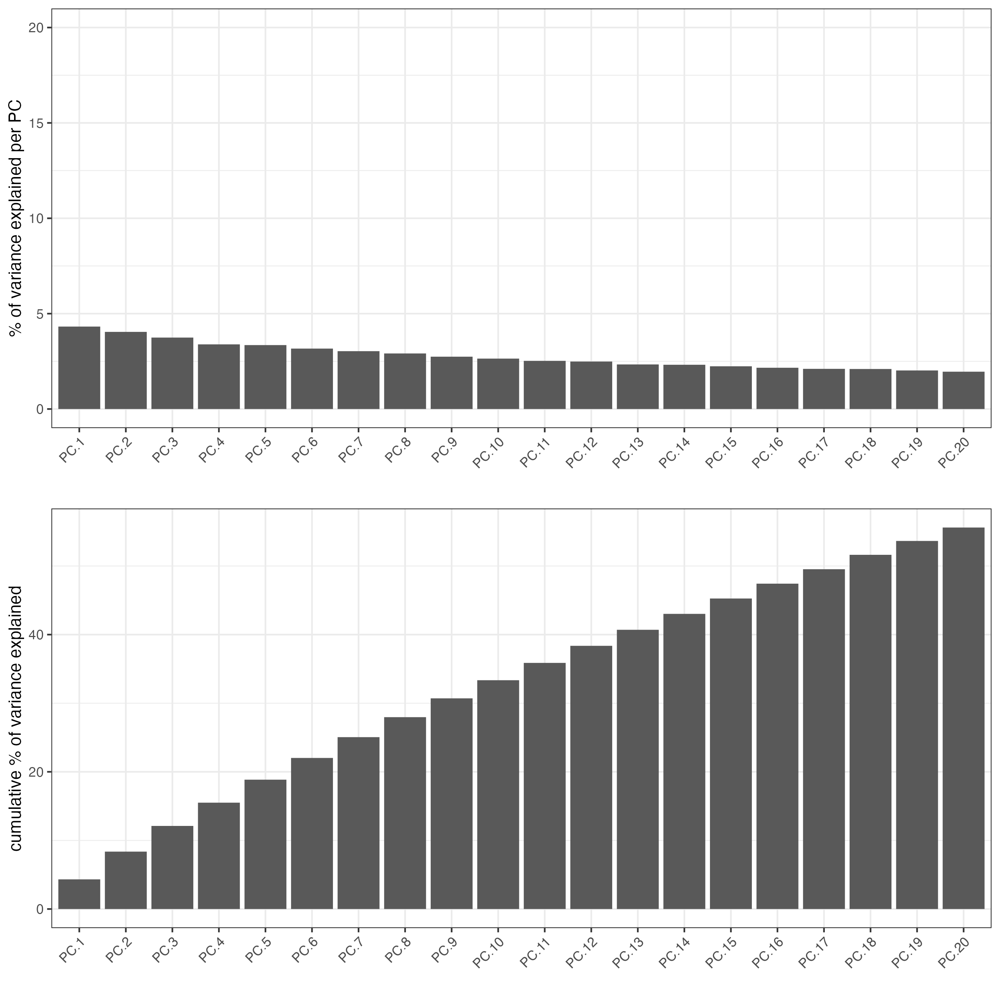

```{r, eval=FALSE}
plotPCA(seqfish_mini)
```

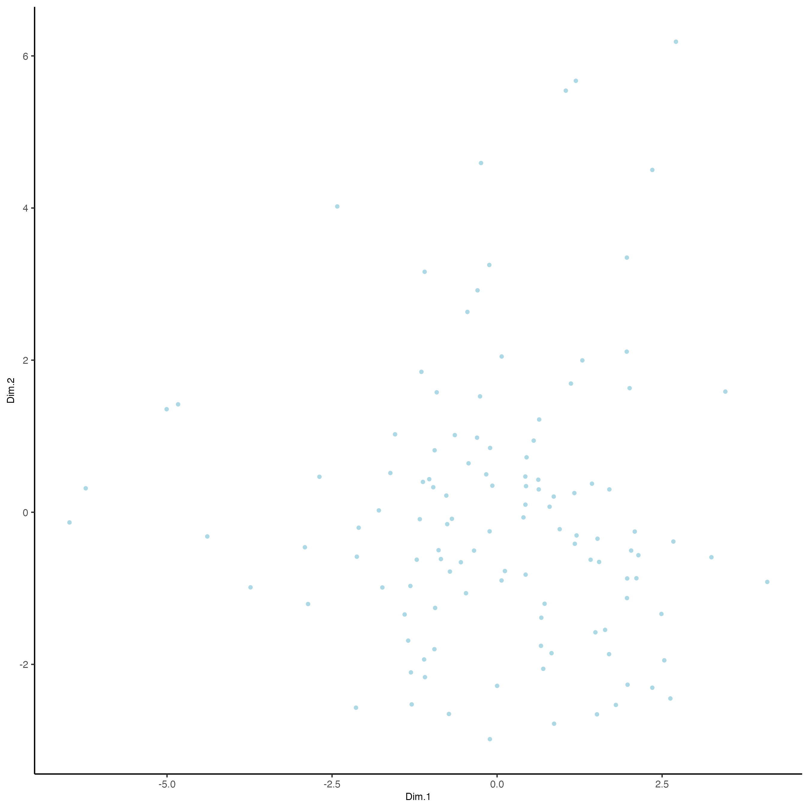

- Run UMAP and/or t-SNE on PCs (or directly on matrix)

```{r, eval=FALSE}
seqfish_mini = runUMAP(seqfish_mini, 
                       dimensions_to_use = 1:5, 
                       n_threads = 2)

plotUMAP(gobject = seqfish_mini)
```

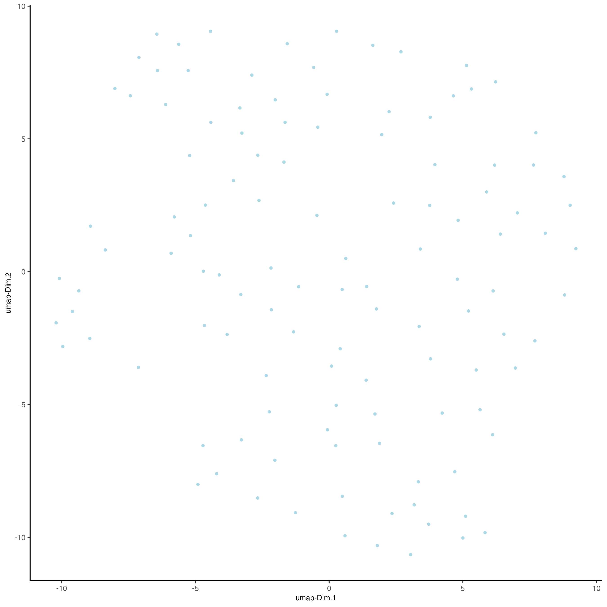

```{r, eval=FALSE}
seqfish_mini = runtSNE(seqfish_mini, 
                       dimensions_to_use = 1:5)

plotTSNE(gobject = seqfish_mini)
```

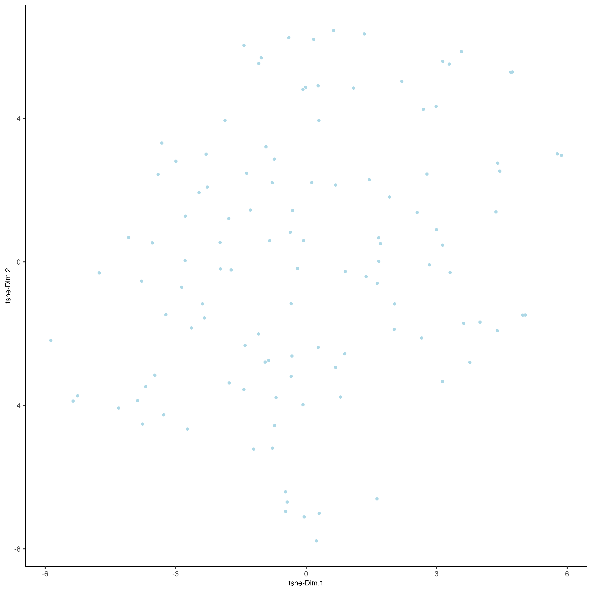

# 4. Clustering

- Create a shared (default) nearest network in PCA space (or directly on matrix)
- Cluster on nearest network with Leiden or Louvain (k-means and hclust are alternatives)

```{r, eval=FALSE}
seqfish_mini = createNearestNetwork(gobject = seqfish_mini, 
                                    dimensions_to_use = 1:5, 
                                    k = 5)

seqfish_mini = doLeidenCluster(gobject = seqfish_mini, 
                               resolution = 0.4, 
                               n_iterations = 1000)

# visualize UMAP cluster results
plotUMAP(gobject = seqfish_mini, 
         cell_color = 'leiden_clus', 
         show_NN_network = T, 
         point_size = 2.5)
```

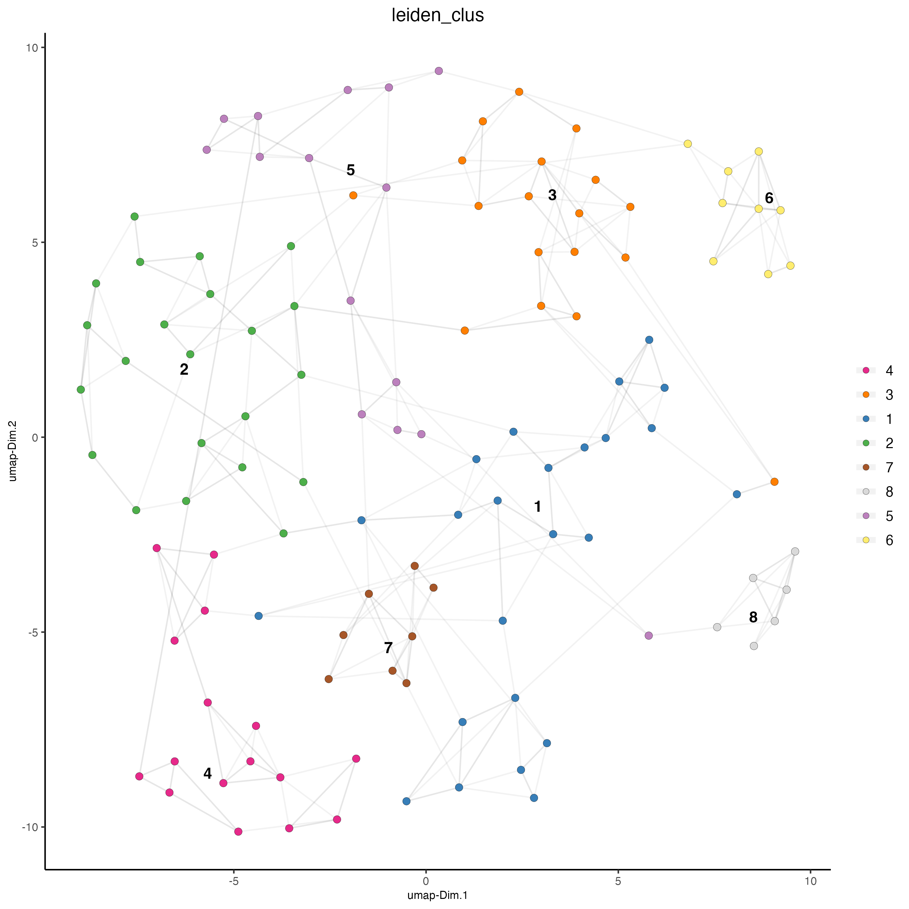

```{r, eval=FALSE}
# visualize UMAP and spatial results
spatDimPlot(gobject = seqfish_mini, 
            cell_color = 'leiden_clus', 
            spat_point_shape = 'voronoi')
```

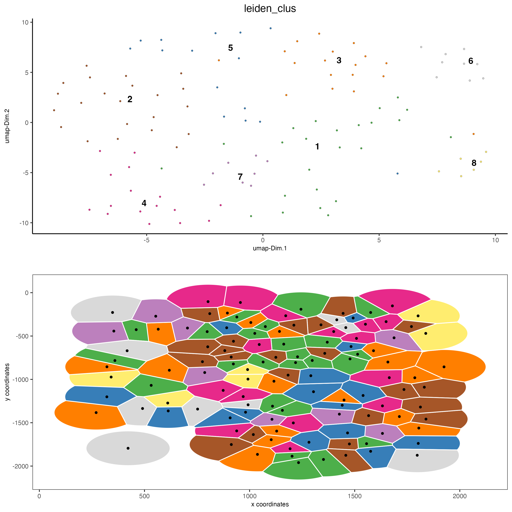

```{r, eval=FALSE}
# heatmap and dendrogram
showClusterHeatmap(gobject = seqfish_mini, 
                   cluster_column = 'leiden_clus')
```

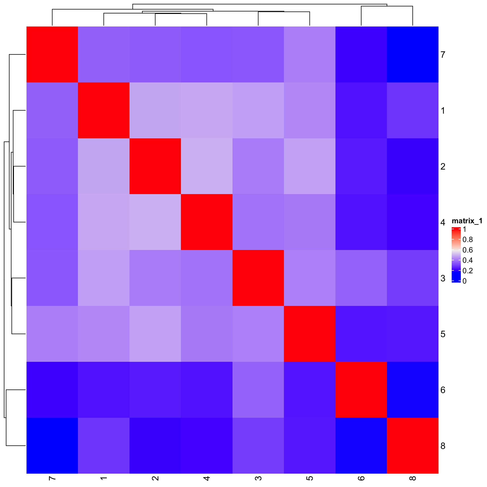

The following step requires the installation of {ggdendro}.

```{r, eval=FALSE}
# install.packages('ggdendro')
library(ggdendro)

showClusterDendrogram(seqfish_mini, 
                      h = 0.5, 
                      rotate = T, 
                      cluster_column = 'leiden_clus')
```


# 5. Differential expression

```{r, eval=FALSE}
gini_markers = findMarkers_one_vs_all(gobject = seqfish_mini,
                                      method = 'gini',
                                      expression_values = 'normalized',
                                      cluster_column = 'leiden_clus',
                                      min_feats = 20,
                                      min_expr_gini_score = 0.5,
                                      min_det_gini_score = 0.5)

# get top 2 genes per cluster and visualize with violin plot
topgenes_gini = gini_markers[, head(.SD, 2), by = 'cluster']

violinPlot(seqfish_mini, 
           feats = topgenes_gini$feats[1:4], 
           cluster_column = 'leiden_clus')
```

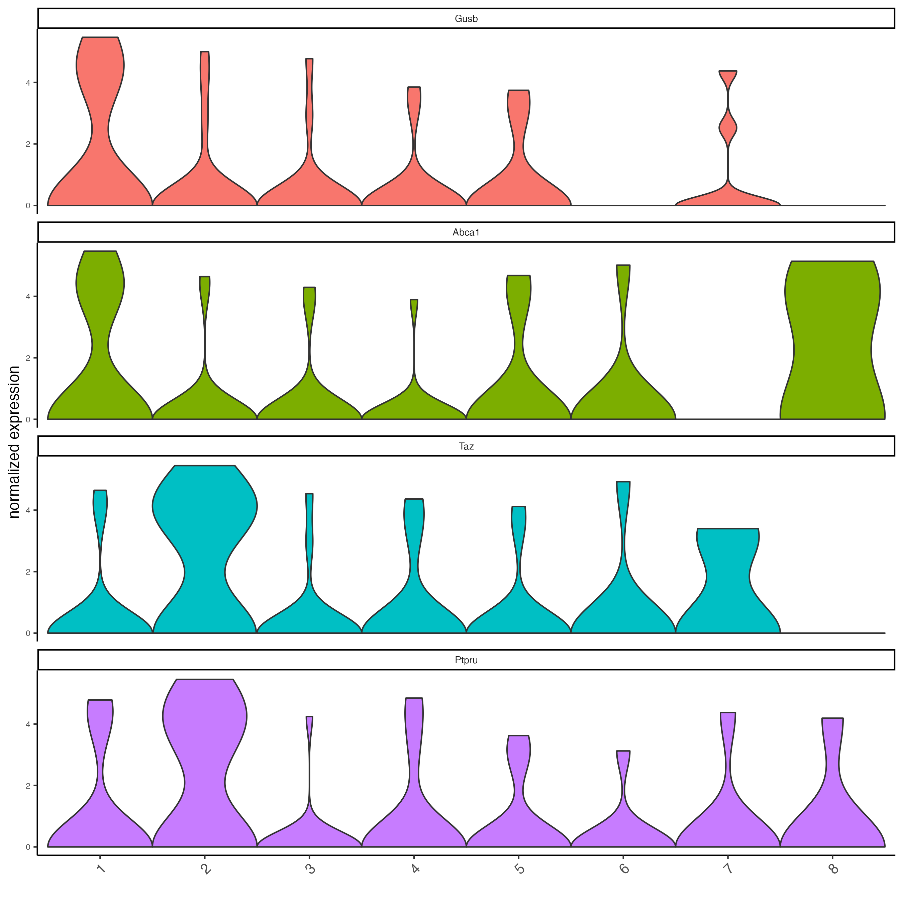

```{r, eval=FALSE}
# get top 6 genes per cluster and visualize with heatmap
topgenes_gini2 = gini_markers[, head(.SD, 6), by = 'cluster']

plotMetaDataHeatmap(seqfish_mini, 
                    selected_feats = topgenes_gini2$feats,
                    metadata_cols = c('leiden_clus'))
```


# 6. Cell type annotation

```{r, eval=FALSE}
clusters_cell_types = c('cell A', 'cell B', 'cell C', 'cell D',
                        'cell E', 'cell F', 'cell G', 'cell H')

names(clusters_cell_types) = 1:8

seqfish_mini = annotateGiotto(gobject = seqfish_mini, 
                              annotation_vector = clusters_cell_types, 
                              cluster_column = 'leiden_clus', 
                              name = 'cell_types')

# check new cell metadata
pDataDT(seqfish_mini)

# visualize annotations
spatDimPlot(gobject = seqfish_mini, 
            cell_color = 'cell_types', 
            spat_point_size = 3, 
            dim_point_size = 3)
```

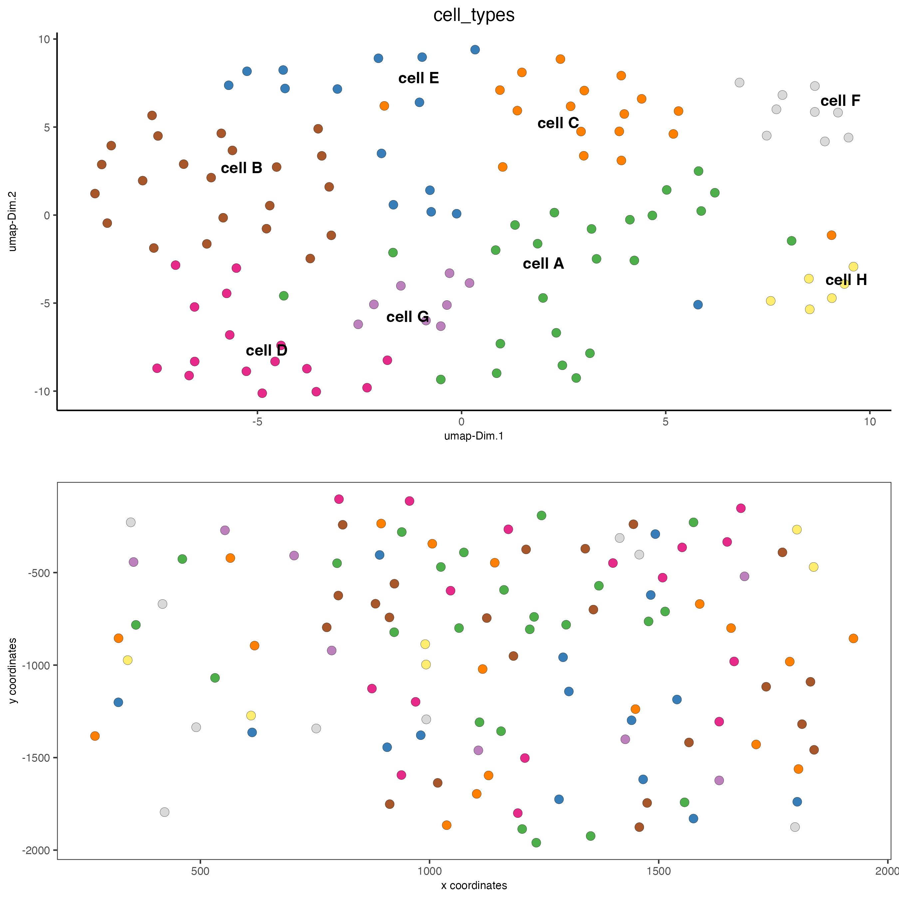

```{r, eval=FALSE}
# heatmap
topgenes_heatmap = gini_markers[, head(.SD, 4), by = 'cluster']

plotHeatmap(gobject = seqfish_mini,
            feats = topgenes_heatmap$feats, 
            feat_order = 'custom',
            feat_custom_order = unique(topgenes_heatmap$feats),
            cluster_column = 'cell_types',
            legend_nrows = 1)
```

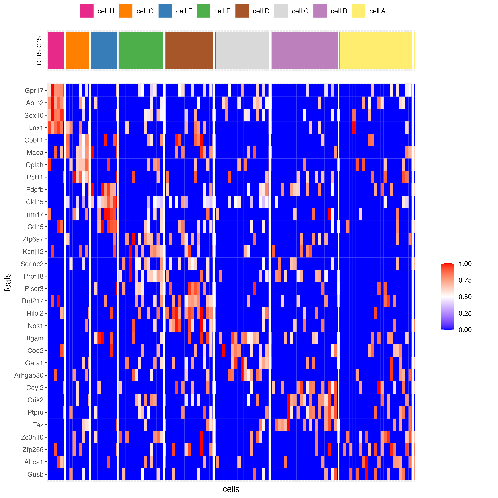

# 7. Spatial grid

- Create a grid based on defined step sizes in the x,y(,z) axes.

```{r, eval=FALSE}
seqfish_mini = createSpatialGrid(gobject = seqfish_mini,
                                 sdimx_stepsize = 300,
                                 sdimy_stepsize = 300,
                                 minimum_padding = 50)

showGiottoSpatGrids(seqfish_mini)

# visualize grid
spatPlot(gobject = seqfish_mini,
         show_grid = T, 
         point_size = 1.5)
```

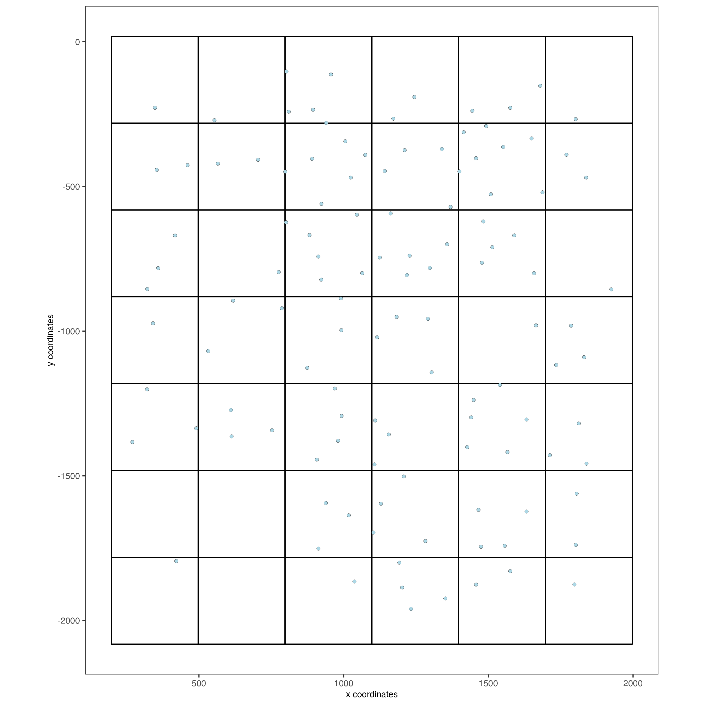

# 8. Spatial network

- Visualize information about the default Delaunay network
- Create a spatial Delaunay network (default)
- Create a spatial kNN network

```{r, eval=FALSE}
plotStatDelaunayNetwork(gobject = seqfish_mini,
                        maximum_distance = 400)
```

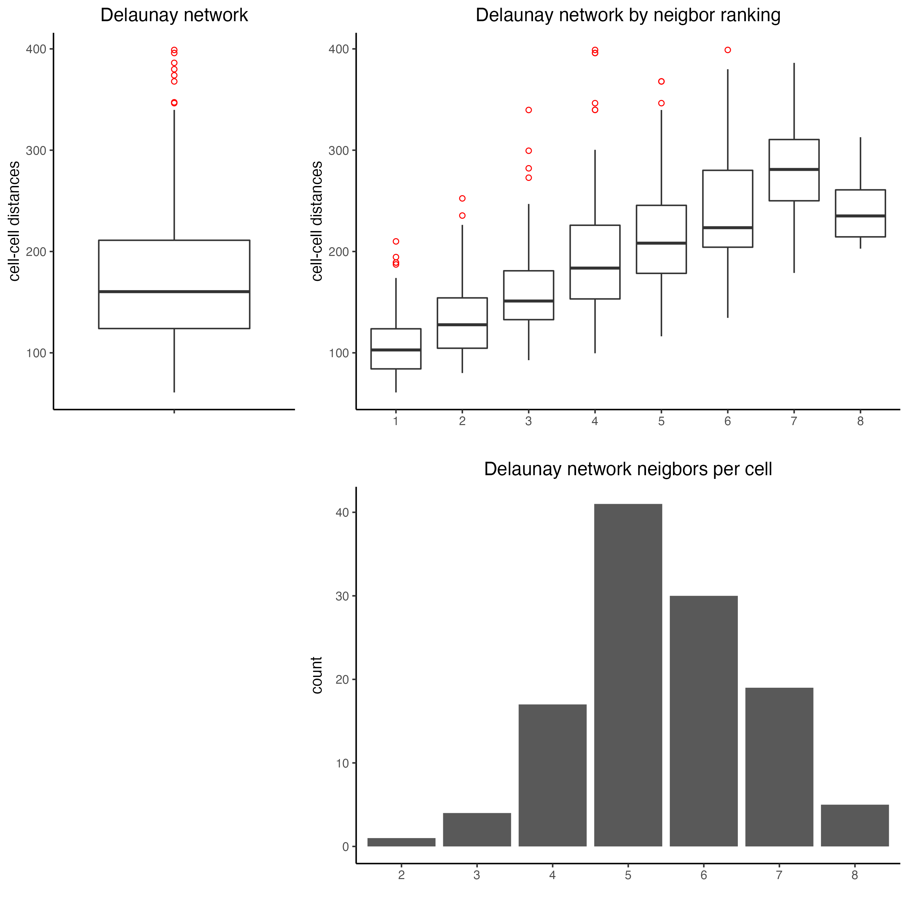

```{r, eval=FALSE}
seqfish_mini = createSpatialNetwork(gobject = seqfish_mini, 
                                    minimum_k = 2, 
                                    maximum_distance_delaunay = 400)

seqfish_mini = createSpatialNetwork(gobject = seqfish_mini,
                                    minimum_k = 2, 
                                    method = 'kNN', k = 10)

showGiottoSpatNetworks(seqfish_mini)

# visualize the two different spatial networks  
spatPlot(gobject = seqfish_mini, 
         show_network = T,
         network_color = 'blue', 
         spatial_network_name = 'Delaunay_network',
         point_size = 2.5, 
         cell_color = 'leiden_clus')
```

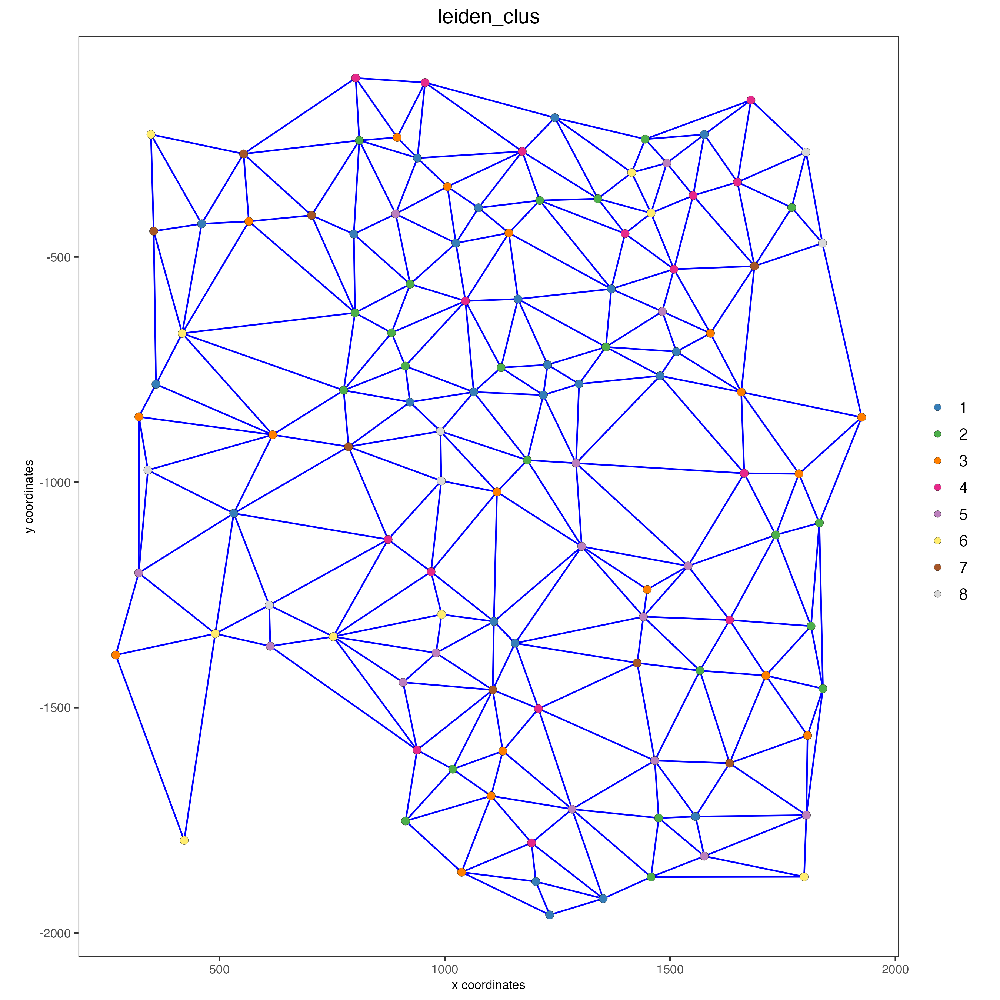

```{r, eval=FALSE}
spatPlot(gobject = seqfish_mini, 
         show_network = T,
         network_color = 'blue', 
         spatial_network_name = 'kNN_network',
         point_size = 2.5, 
         cell_color = 'leiden_clus')
```

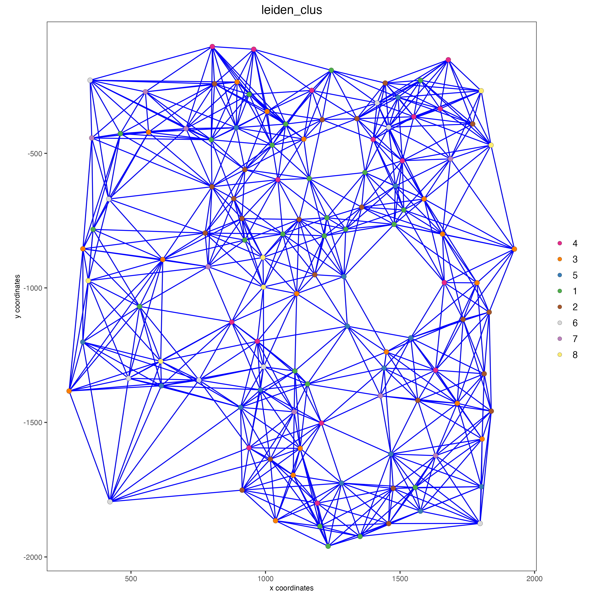

# 9. Spatial genes

Identify spatial genes with 3 different methods:

- binSpect with k-means binarization (default)
- binSpect with rank binarization
- silhouetteRank

Visualize top 4 genes per method.

```{r, eval=FALSE}
km_spatialgenes = binSpect(seqfish_mini)

spatFeatPlot2D(seqfish_mini,
               expression_values = 'scaled', 
               feats = km_spatialgenes[1:4]$feats,
               point_shape = 'border', 
               point_border_stroke = 0.1,
               show_network = F, 
               network_color = 'lightgrey', 
               point_size = 2.5,
               cow_n_col = 2)
```

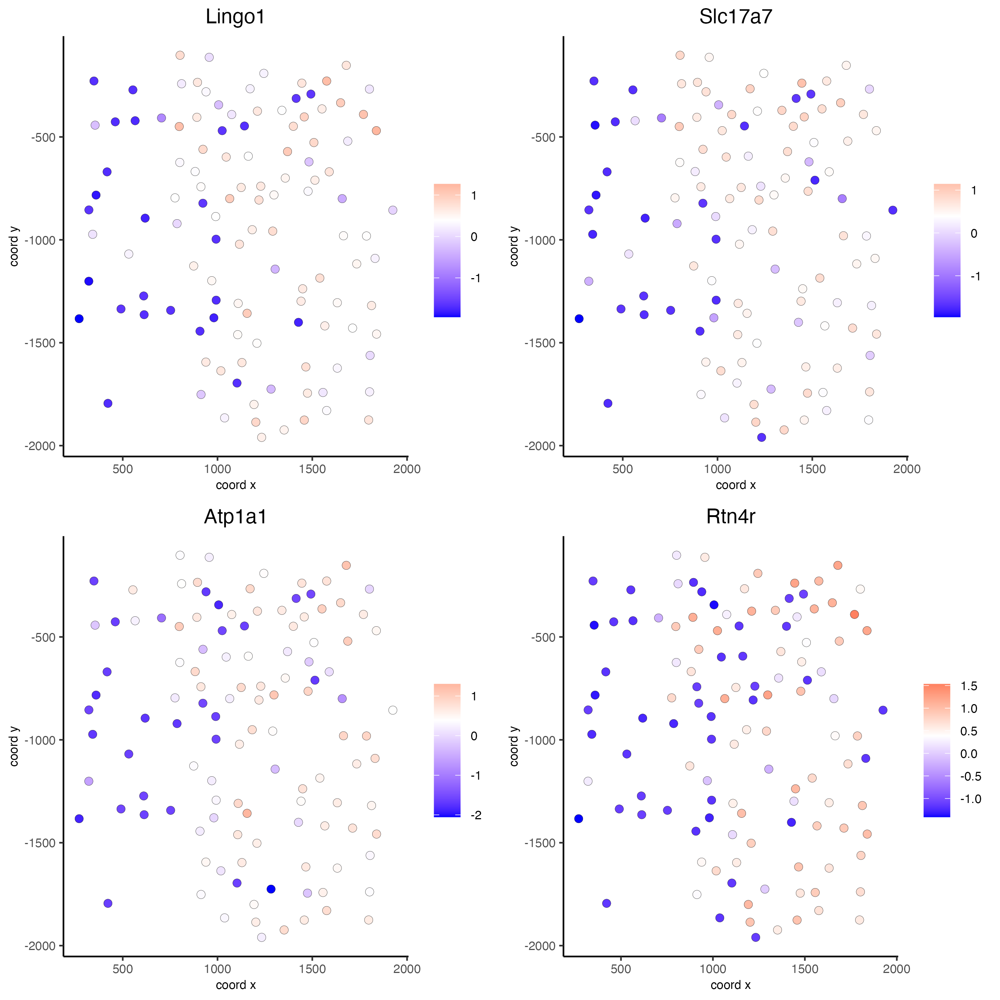

```{r, eval=FALSE}
rank_spatialgenes = binSpect(seqfish_mini, 
                             bin_method = 'rank')

spatFeatPlot2D(seqfish_mini, 
               expression_values = 'scaled', 
               feats = rank_spatialgenes[1:4]$feats,
               point_shape = 'border', 
               point_border_stroke = 0.1,
               show_network = F, 
               network_color = 'lightgrey', 
               point_size = 2.5,
               cow_n_col = 2)
```

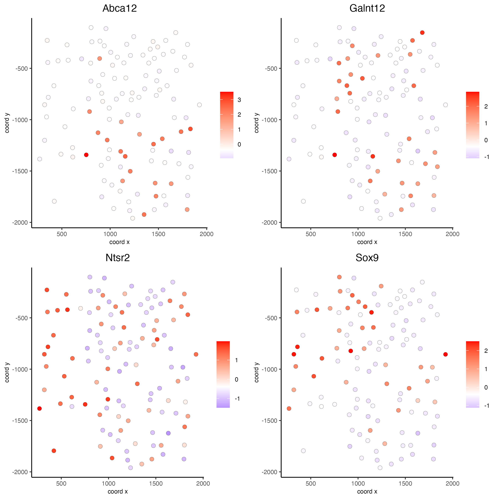

```{r, eval=FALSE}
silh_spatialgenes = silhouetteRank(gobject = seqfish_mini) # TODO: suppress print output

spatFeatPlot2D(seqfish_mini, 
               expression_values = 'scaled', 
               feats = silh_spatialgenes[1:4]$genes,
               point_shape = 'border', 
               point_border_stroke = 0.1,
               show_network = F, 
               network_color = 'lightgrey', 
               point_size = 2.5,
               cow_n_col = 2)
```

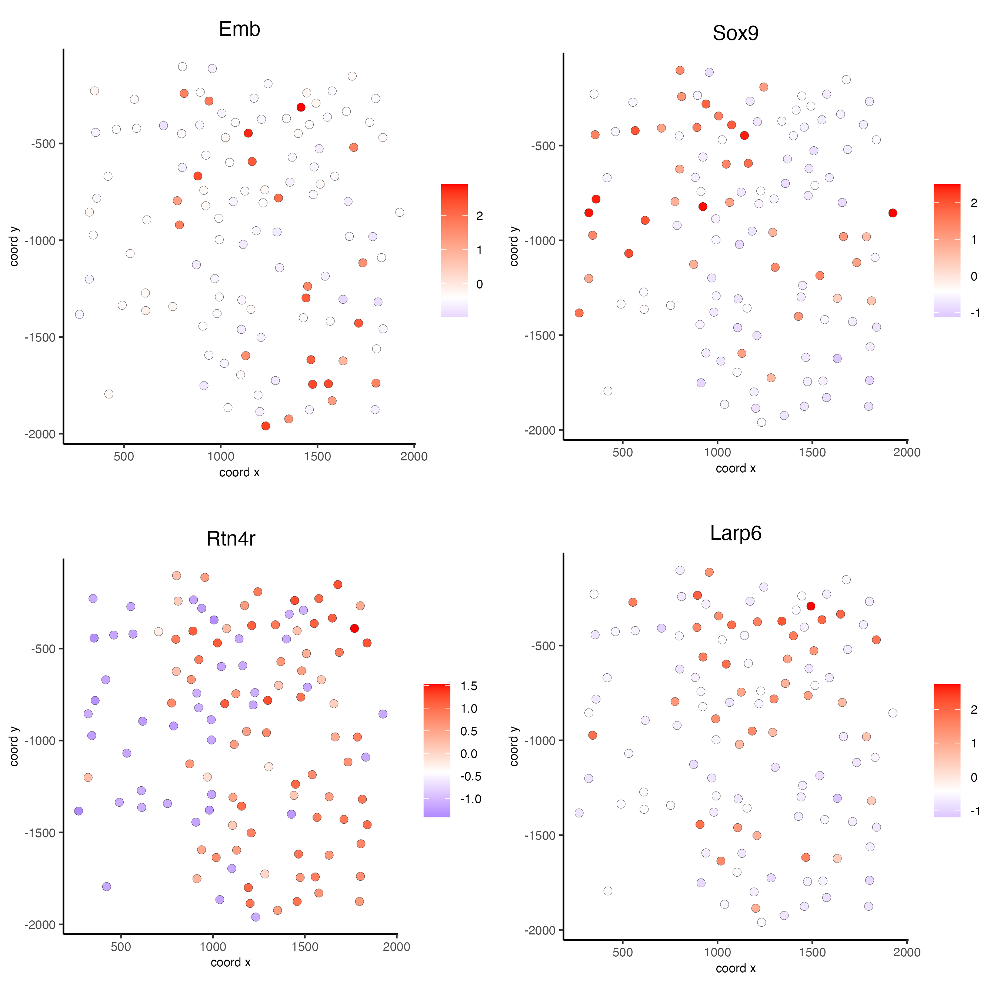

# 10. Spatial co-expression patterns

Identify robust spatial co-expression patterns using the spatial network or grid and a subset of individual spatial genes.

1. Calculate spatial correlation scores
2. Cluster correlation scores

```{r, eval=FALSE}
# 1. calculate spatial correlation scores 
ext_spatial_genes = km_spatialgenes[1:500]$feats

spat_cor_netw_DT = detectSpatialCorFeats(seqfish_mini,
                                         method = 'network', 
                                         spatial_network_name = 'Delaunay_network',
                                         subset_feats = ext_spatial_genes)
# 2. cluster correlation scores
spat_cor_netw_DT = clusterSpatialCorFeats(spat_cor_netw_DT, 
                                          name = 'spat_netw_clus', 
                                          k = 8)

heatmSpatialCorFeats(seqfish_mini, 
                     spatCorObject = spat_cor_netw_DT, 
                     use_clus_name = 'spat_netw_clus')
```

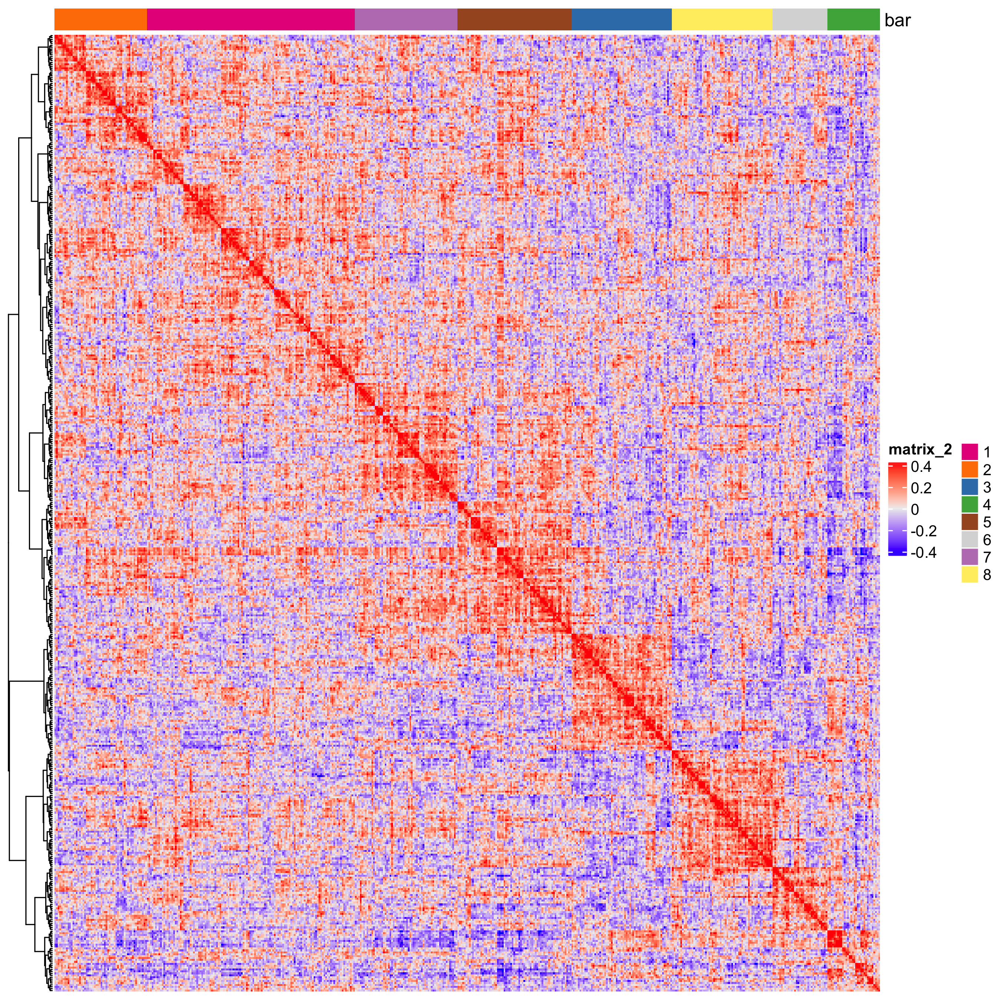

```{r, eval=FALSE}
netw_ranks = rankSpatialCorGroups(seqfish_mini, 
                                  spatCorObject = spat_cor_netw_DT, 
                                  use_clus_name = 'spat_netw_clus')
```

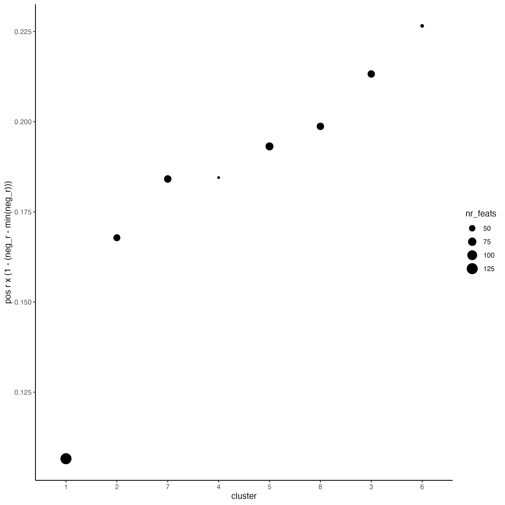

```{r, eval=FALSE}
top_netw_spat_cluster = showSpatialCorFeats(spat_cor_netw_DT, 
                                            use_clus_name = 'spat_netw_clus',
                                            selected_clusters = 6, 
                                            show_top_feats = 1)

cluster_genes_DT = showSpatialCorFeats(spat_cor_netw_DT, 
                                       use_clus_name = 'spat_netw_clus',
                                       show_top_feats = 1)

cluster_genes = cluster_genes_DT$clus; names(cluster_genes) = cluster_genes_DT$feat_ID

seqfish_mini = createMetafeats(seqfish_mini,
                               feat_clusters = cluster_genes,
                               name = 'cluster_metagene')

spatCellPlot(seqfish_mini,
             spat_enr_names = 'cluster_metagene',
             cell_annotation_values = netw_ranks$clusters,
             point_size = 1.5, cow_n_col = 3)
```

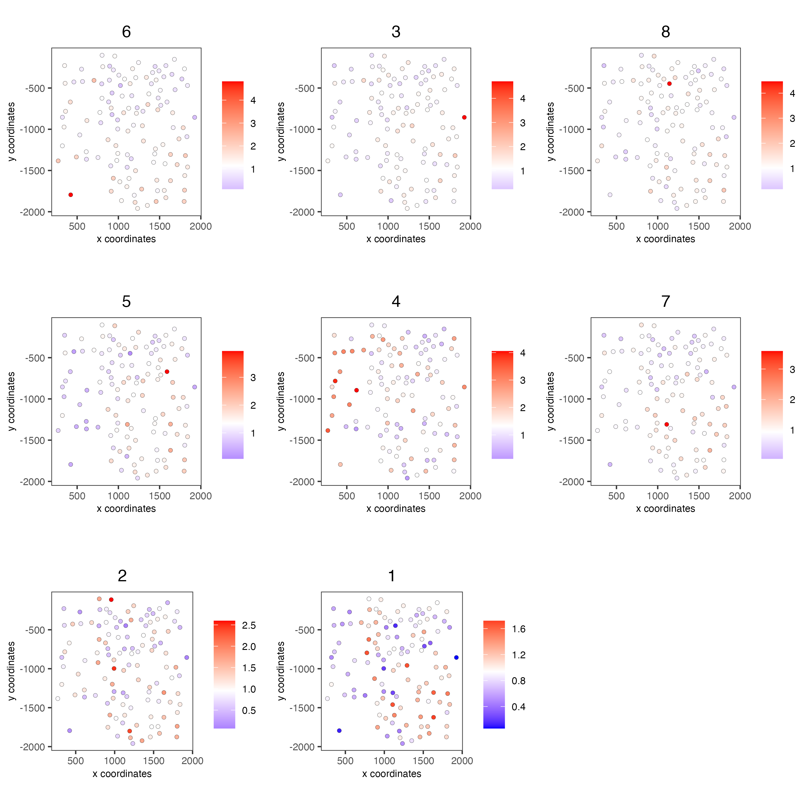

# 11. Spatial HMRF domains

The following HMRF function requires {smfishHmrf} .

```{r, eval=FALSE}
# remotes::install_bitbucket(repo = 'qzhudfci/smfishhmrf-r', ref='master')
library(smfishHmrf)

hmrf_folder = paste0(temp_dir,'/','11_HMRF/')

if(!file.exists(hmrf_folder)) dir.create(hmrf_folder, recursive = T)

# perform hmrf
my_spatial_genes = km_spatialgenes[1:100]$feats

HMRF_spatial_genes = doHMRF(gobject = seqfish_mini,
                            expression_values = 'scaled',
                            spatial_genes = my_spatial_genes,
                            spatial_network_name = 'Delaunay_network',
                            k = 9,
                            betas = c(28,2,2),
                            output_folder = paste0(hmrf_folder, '/', 'Spatial_genes/SG_top100_k9_scaled'))

# check and select hmrf
for(i in seq(28, 30, by = 2)) {
  viewHMRFresults2D(gobject = seqfish_mini,
                    HMRFoutput = HMRF_spatial_genes,
                    k = 9, betas_to_view = i,
                    point_size = 2)
}

seqfish_mini = addHMRF(gobject = seqfish_mini,
                       HMRFoutput = HMRF_spatial_genes,
                       k = 9, betas_to_add = c(28),
                       hmrf_name = 'HMRF')

# visualize selected hmrf result
giotto_colors = Giotto::getDistinctColors(9)
names(giotto_colors) = 1:9

spatPlot(gobject = seqfish_mini, 
         cell_color = 'HMRF_k9_b.28',
         point_size = 3, 
         coord_fix_ratio = 1, 
         cell_color_code = giotto_colors)
```

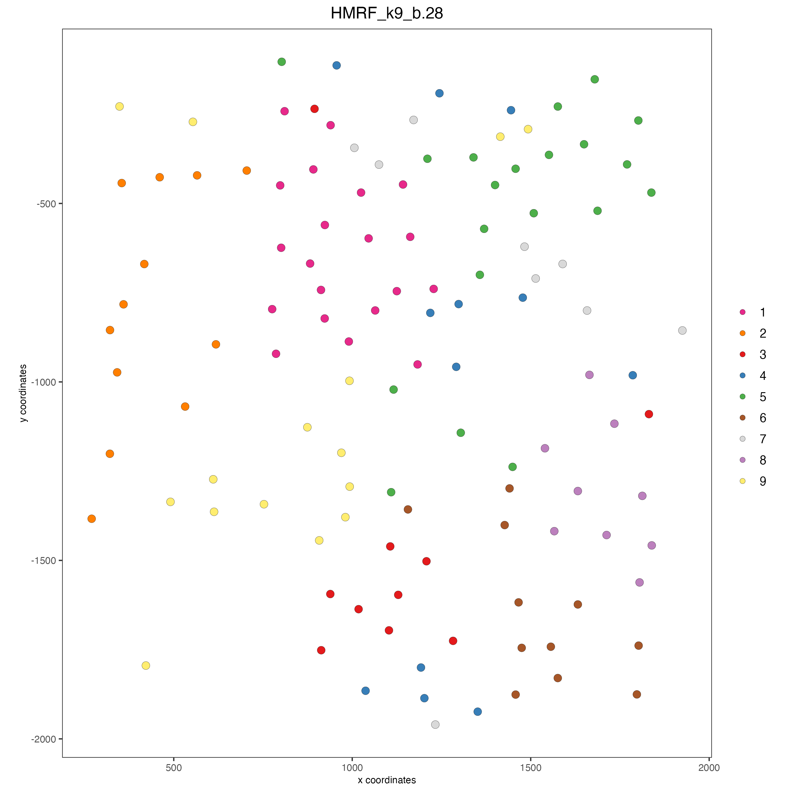

# 12. Cell neighborhood: cell-type/cell-type interactions

```{r, eval=FALSE}
set.seed(seed = 2841)

cell_proximities = cellProximityEnrichment(gobject = seqfish_mini,
                                           cluster_column = 'cell_types',
                                           spatial_network_name = 'Delaunay_network',
                                           adjust_method = 'fdr',
                                           number_of_simulations = 1000)

# barplot
cellProximityBarplot(gobject = seqfish_mini, 
                     CPscore = cell_proximities, 
                     min_orig_ints = 5, 
                     min_sim_ints = 5, 
                     p_val = 0.5)
```


```{r, eval=FALSE}
## heatmap
cellProximityHeatmap(gobject = seqfish_mini, 
                     CPscore = cell_proximities, 
                     order_cell_types = T, 
                     scale = T,
                     color_breaks = c(-1.5, 0, 1.5), 
                     color_names = c('blue', 'white', 'red'))
```

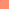

```{r, eval=FALSE}
# network
cellProximityNetwork(gobject = seqfish_mini, 
                     CPscore = cell_proximities, 
                     remove_self_edges = T, 
                     only_show_enrichment_edges = T)
```

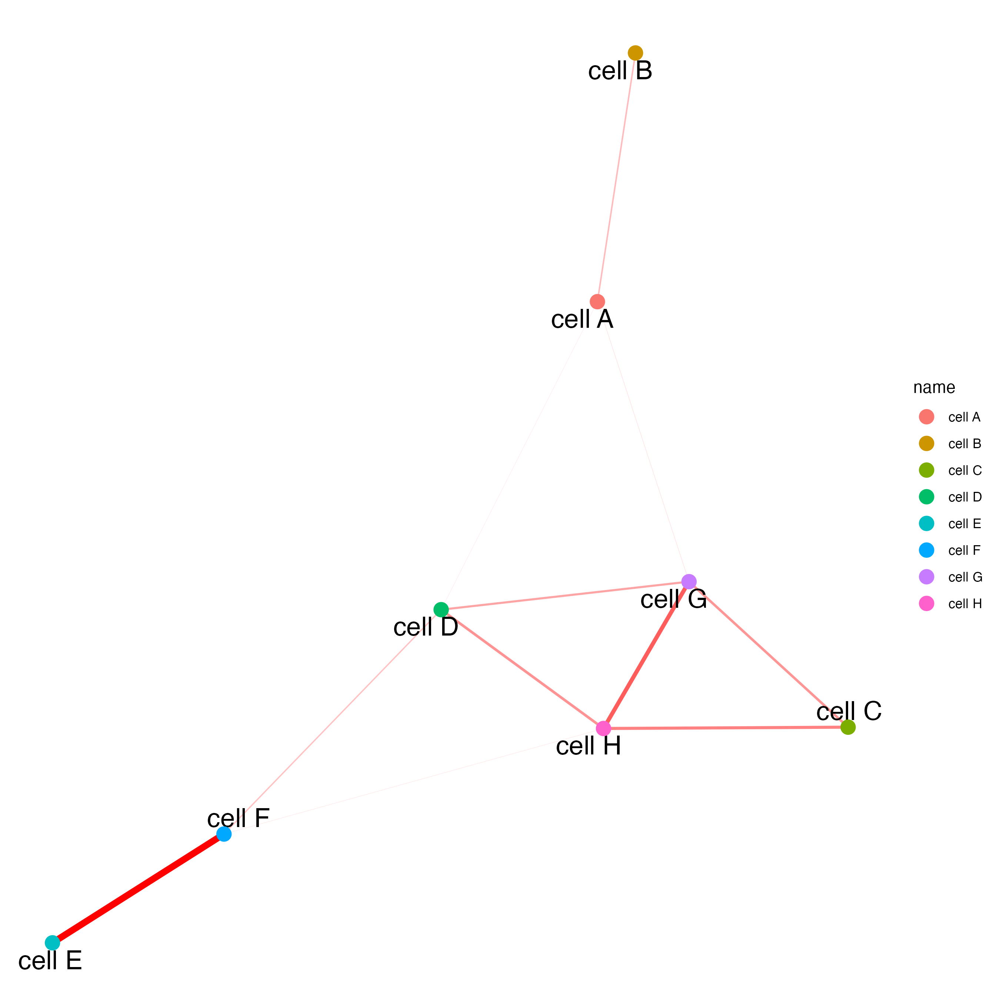

```{r, eval=FALSE}
# network with self-edges
cellProximityNetwork(gobject = seqfish_mini, 
                     CPscore = cell_proximities,
                     remove_self_edges = F, 
                     self_loop_strength = 0.3,
                     only_show_enrichment_edges = F,
                     rescale_edge_weights = T,
                     node_size = 8,
                     edge_weight_range_depletion = c(1, 2),
                     edge_weight_range_enrichment = c(2,5))
```

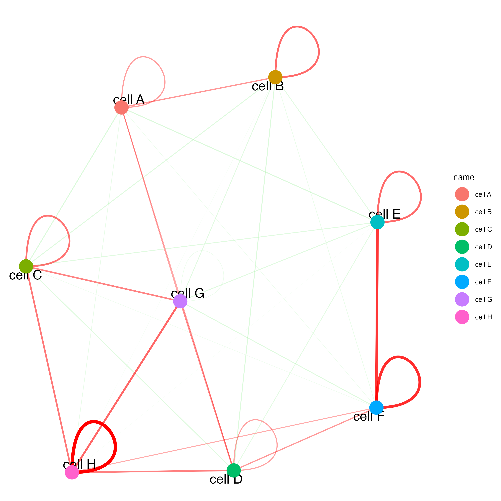

## Visualization of specific cell types

```{r, eval=FALSE}
# Option 1
spec_interaction = "cell D--cell F"

cellProximitySpatPlot2D(gobject = seqfish_mini,
                        interaction_name = spec_interaction,
                        show_network = T,
                        cluster_column = 'cell_types',
                        cell_color = 'cell_types',
                        cell_color_code = c('cell D' = 'lightblue', 'cell F' = 'red'),
                        point_size_select = 4, 
                        point_size_other = 2)
```

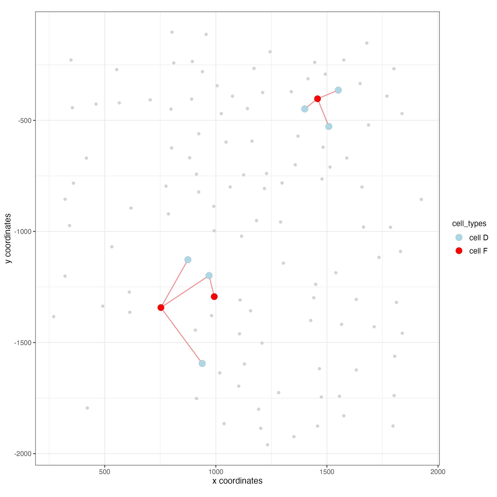

```{r, eval=FALSE}
# Option 2: create additional metadata
seqfish_mini = addCellIntMetadata(seqfish_mini,
                                  spat_unit = "cell",
                                  spatial_network = 'Delaunay_network',
                                  cluster_column = 'cell_types',
                                  cell_interaction = spec_interaction,
                                  name = 'D_F_interactions')

spatPlot(seqfish_mini, 
         cell_color = 'D_F_interactions', 
         legend_symbol_size = 3,
         select_cell_groups =  c('other_cell D', 'other_cell F', 'select_cell D', 'select_cell F'))
```

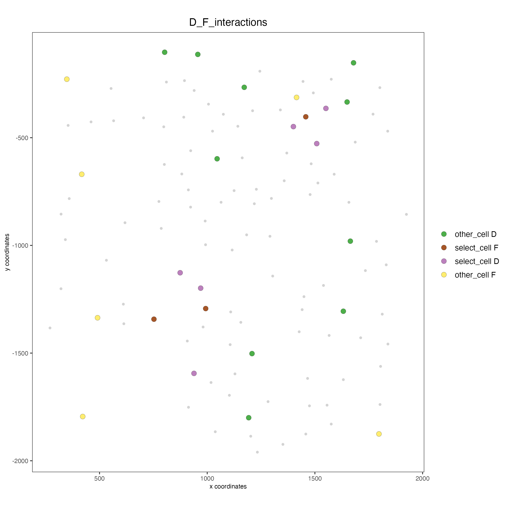

# 13. Cell neighborhood: interaction changed features


```{r, eval=FALSE}
## select top 25 highest expressing genes
gene_metadata = fDataDT(seqfish_mini)

plot(gene_metadata$nr_cells, gene_metadata$mean_expr)

plot(gene_metadata$nr_cells, gene_metadata$mean_expr_det)

quantile(gene_metadata$mean_expr_det)

high_expressed_genes = gene_metadata[mean_expr_det > 4]$feat_ID

## identify features (genes) that are associated with proximity to other cell types
ICFscoresHighGenes = findICF(gobject = seqfish_mini,
                             selected_feats = high_expressed_genes,
                             spatial_network_name = 'Delaunay_network',
                             cluster_column = 'cell_types',
                             diff_test = 'permutation',
                             adjust_method = 'fdr',
                             nr_permutations = 500,
                             do_parallel = T)

## visualize all genes
plotCellProximityFeats(seqfish_mini, 
                       icfObject = ICFscoresHighGenes, 
                       method = 'dotplot')
```


```{r, eval=FALSE}
## filter genes
ICFscoresFilt = filterICF(ICFscoresHighGenes, 
                          min_cells = 2, 
                          min_int_cells = 2, 
                          min_fdr = 0.1,
                          min_spat_diff = 0.1, 
                          min_log2_fc = 0.1, 
                          min_zscore = 1)

## visualize subset of interaction changed genes (ICGs)
ICF_genes = c('Cpne2', 'Scg3', 'Cmtm3', 'Cplx1', 'Lingo1')
ICF_genes_types = c('cell E', 'cell D', 'cell D', 'cell G', 'cell E')
names(ICF_genes) = ICF_genes_types

plotICF(gobject = seqfish_mini,
        icfObject = ICFscoresHighGenes,
        source_type = 'cell A',
        source_markers = c('Csf1r', 'Laptm5'),
        ICF_feats = ICF_genes)
```


# 14. Cell neighborhood: ligand-receptor cell-cell communication

```{r, eval=FALSE}
LR_data = data.table::fread(system.file("Mini_datasets/seqfish/Raw/mouse_ligand_receptors.txt", 
                                        package = "GiottoData"))

LR_data[, ligand_det := ifelse(mouseLigand %in% seqfish_mini@feat_ID[['rna']], T, F)]

LR_data[, receptor_det := ifelse(mouseReceptor %in% seqfish_mini@feat_ID[['rna']], T, F)]

LR_data_det = LR_data[ligand_det == T & receptor_det == T]

select_ligands = LR_data_det$mouseLigand

select_receptors = LR_data_det$mouseReceptor

## get statistical significance of gene pair expression changes based on expression ##
expr_only_scores = exprCellCellcom(gobject = seqfish_mini,
                                   cluster_column = 'cell_types',
                                   random_iter = 50,
                                   feat_set_1 = select_ligands,
                                   feat_set_2 = select_receptors)

## get statistical significance of gene pair expression changes upon cell-cell interaction
spatial_all_scores = spatCellCellcom(seqfish_mini,
                                     spat_unit = 'cell',
                                     feat_type = 'rna',
                                     spatial_network_name = 'Delaunay_network',
                                     cluster_column = 'cell_types',
                                     random_iter = 50,
                                     feat_set_1 = select_ligands,
                                     feat_set_2 = select_receptors,
                                     adjust_method = 'fdr',
                                     do_parallel = T,
                                     cores = 4,
                                     verbose = 'none')

## * plot communication scores ####
## select top LR ##
selected_spat = spatial_all_scores[p.adj <= 0.5 & abs(log2fc) > 0.1 & lig_nr >= 2 & rec_nr >= 2]

data.table::setorder(selected_spat, -PI)

top_LR_ints = unique(selected_spat[order(-abs(PI))]$LR_comb)[1:33]

top_LR_cell_ints = unique(selected_spat[order(-abs(PI))]$LR_cell_comb)[1:33]

plotCCcomHeatmap(gobject = seqfish_mini,
                 comScores = spatial_all_scores,
                 selected_LR = top_LR_ints,
                 selected_cell_LR = top_LR_cell_ints,
                 show = 'LR_expr')
```

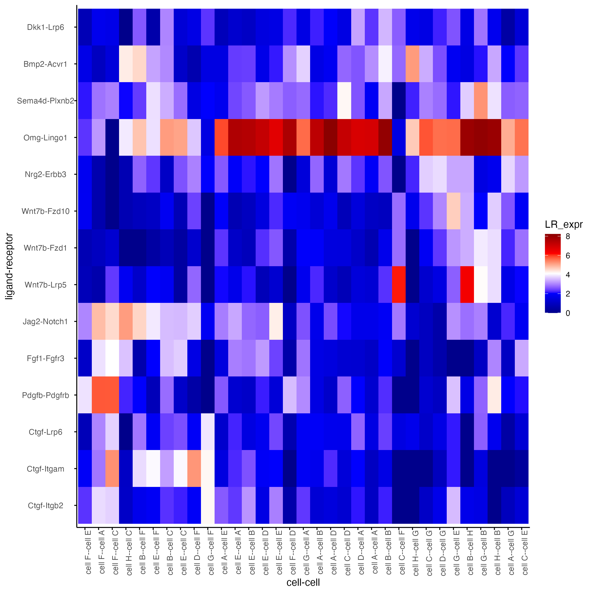

```{r, eval=FALSE}
plotCCcomDotplot(gobject = seqfish_mini,
                 comScores = spatial_all_scores,
                 selected_LR = top_LR_ints,
                 selected_cell_LR = top_LR_cell_ints,
                 cluster_on = 'PI')
```

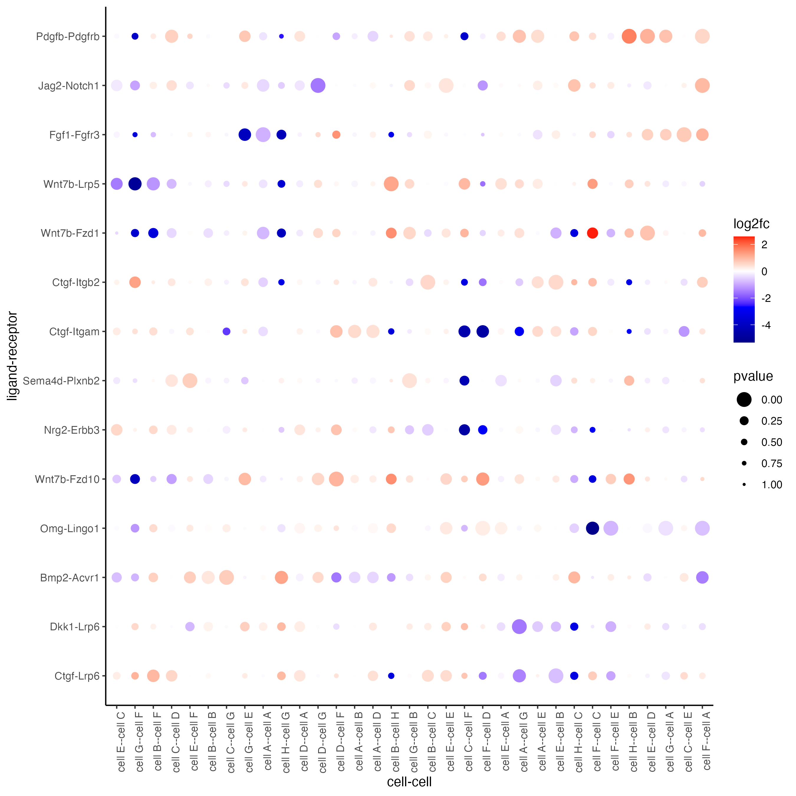

```{r, eval=FALSE}
## * spatial vs rank ####
comb_comm = combCCcom(spatialCC = spatial_all_scores,
                      exprCC = expr_only_scores)

# top differential activity levels for ligand receptor pairs
plotRankSpatvsExpr(gobject = seqfish_mini,
                   comb_comm,
                   expr_rnk_column = 'exprPI_rnk',
                   spat_rnk_column = 'spatPI_rnk',
                   gradient_midpoint = 10)
```

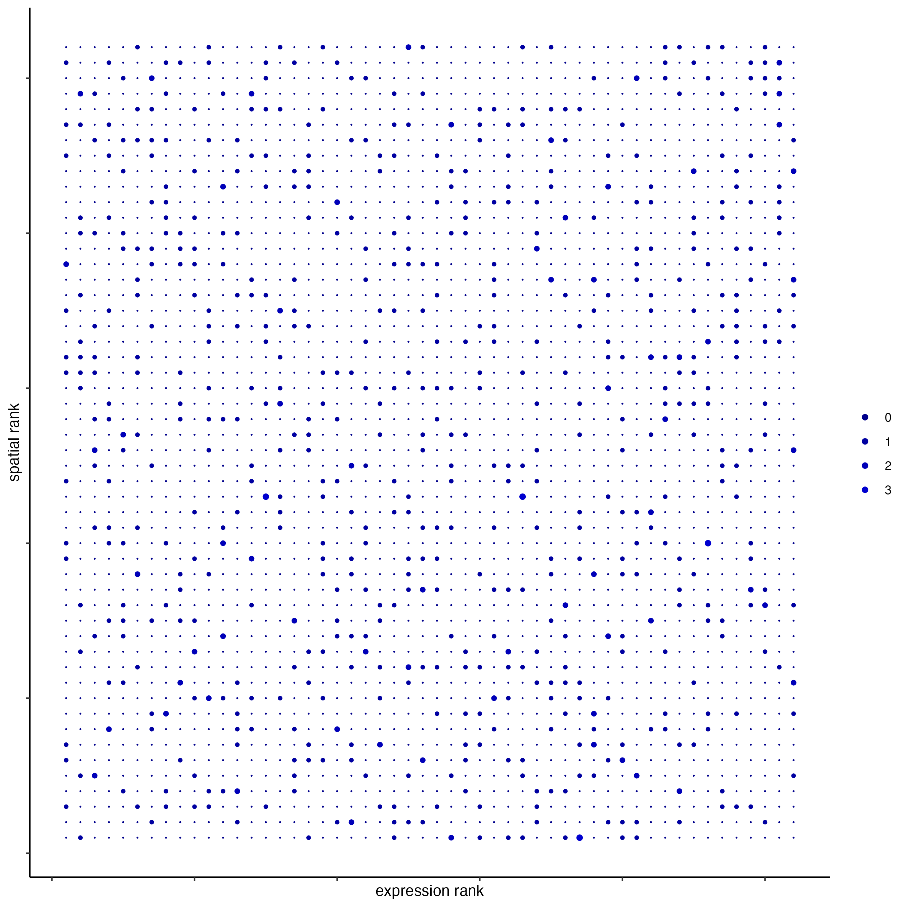

```{r, eval=FALSE}
## * recovery ####
## predict maximum differential activity
plotRecovery(gobject = seqfish_mini,
             comb_comm,
             expr_rnk_column = 'exprPI_rnk',
             spat_rnk_column = 'spatPI_rnk',
             ground_truth = 'spatial')
```

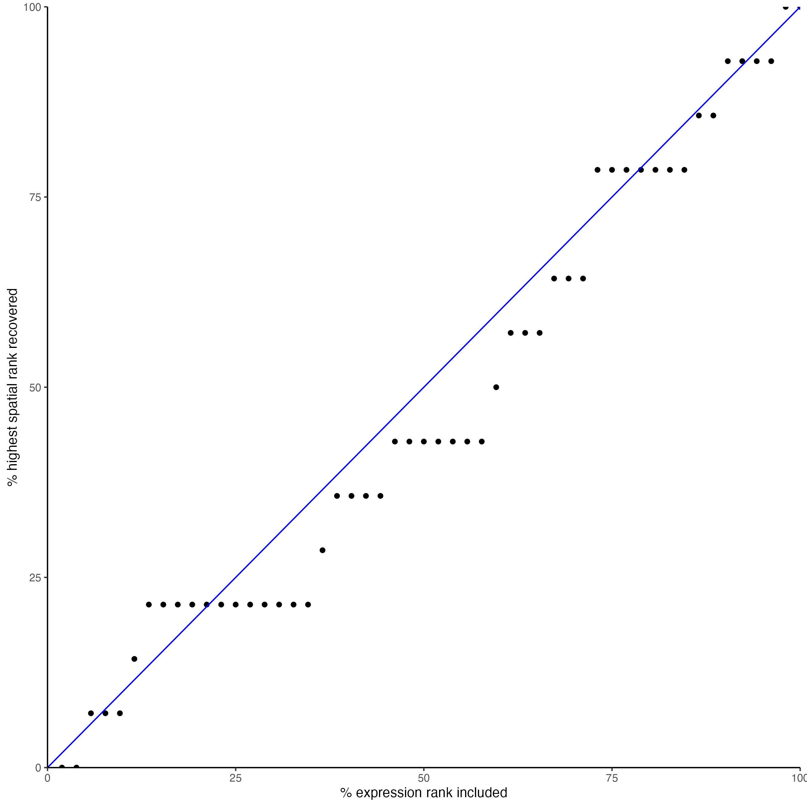

# 15. Session info

```{r, eval=FALSE}
sessionInfo()
```

```{r, eval=FALSE}
R version 4.3.2 (2023-10-31)
Platform: x86_64-apple-darwin20 (64-bit)
Running under: macOS Sonoma 14.3

Matrix products: default
BLAS:   /System/Library/Frameworks/Accelerate.framework/Versions/A/Frameworks/vecLib.framework/Versions/A/libBLAS.dylib 
LAPACK: /Library/Frameworks/R.framework/Versions/4.3-x86_64/Resources/lib/libRlapack.dylib;  LAPACK version 3.11.0

locale:
[1] en_US.UTF-8/en_US.UTF-8/en_US.UTF-8/C/en_US.UTF-8/en_US.UTF-8

time zone: America/New_York
tzcode source: internal

attached base packages:
[1] stats     graphics  grDevices utils     datasets  methods   base     

other attached packages:
[1] smfishHmrf_0.1     fs_1.6.3           pracma_2.4.4       ggdendro_0.1.23   
[5] GiottoData_0.2.6.2 GiottoUtils_0.1.3  Giotto_4.0.2       GiottoClass_0.1.3 

loaded via a namespace (and not attached):
  [1] RColorBrewer_1.1-3          rstudioapi_0.15.0           jsonlite_1.8.8             
  [4] shape_1.4.6                 magrittr_2.0.3              magick_2.8.2               
  [7] farver_2.1.1                GlobalOptions_0.1.2         zlibbioc_1.48.0            
 [10] ragg_1.2.7                  vctrs_0.6.5                 Cairo_1.6-2                
 [13] RCurl_1.98-1.14             terra_1.7-71                S4Arrays_1.2.0             
 [16] SparseArray_1.2.3           parallelly_1.36.0           plyr_1.8.9                 
 [19] igraph_2.0.1.1              lifecycle_1.0.4             iterators_1.0.14           
 [22] pkgconfig_2.0.3             rsvd_1.0.5                  Matrix_1.6-5               
 [25] R6_2.5.1                    GenomeInfoDbData_1.2.11     rbibutils_2.2.16           
 [28] MatrixGenerics_1.14.0       future_1.33.1               clue_0.3-65                
 [31] digest_0.6.34               colorspace_2.1-0            S4Vectors_0.40.2           
 [34] irlba_2.3.5.1               textshaping_0.3.7           GenomicRanges_1.54.1       
 [37] beachmat_2.18.0             labeling_0.4.3              progressr_0.14.0           
 [40] fansi_1.0.6                 polyclip_1.10-6             abind_1.4-5                
 [43] compiler_4.3.2              withr_3.0.0                 doParallel_1.0.17          
 [46] backports_1.4.1             BiocParallel_1.36.0         viridis_0.6.5              
 [49] ggforce_0.4.1               MASS_7.3-60.0.1             DelayedArray_0.28.0        
 [52] rjson_0.2.21                gtools_3.9.5                GiottoVisuals_0.1.4        
 [55] tools_4.3.2                 future.apply_1.11.1         glue_1.7.0                 
 [58] dbscan_1.1-12               grid_4.3.2                  checkmate_2.3.1            
 [61] Rtsne_0.17                  cluster_2.1.6               reshape2_1.4.4             
 [64] generics_0.1.3              gtable_0.3.4                tidyr_1.3.1                
 [67] data.table_1.15.0           BiocSingular_1.18.0         tidygraph_1.3.1            
 [70] ScaledMatrix_1.10.0         utf8_1.2.4                  XVector_0.42.0             
 [73] BiocGenerics_0.48.1         ggrepel_0.9.5               foreach_1.5.2              
 [76] pillar_1.9.0                stringr_1.5.1               limma_3.58.1               
 [79] circlize_0.4.15             dplyr_1.1.4                 tweenr_2.0.2               
 [82] lattice_0.22-5              FNN_1.1.4                   deldir_2.0-2               
 [85] tidyselect_1.2.0            ComplexHeatmap_2.18.0       SingleCellExperiment_1.24.0
 [88] knitr_1.45                  gridExtra_2.3               IRanges_2.36.0             
 [91] SummarizedExperiment_1.32.0 stats4_4.3.2                xfun_0.41                  
 [94] graphlayouts_1.1.0          Biobase_2.62.0              statmod_1.5.0              
 [97] matrixStats_1.2.0           stringi_1.8.3               codetools_0.2-19           
[100] ggraph_2.1.0                tibble_3.2.1                colorRamp2_0.1.0           
[103] cli_3.6.2                   uwot_0.1.16                 reticulate_1.35.0          
[106] systemfonts_1.0.5           Rdpack_2.6                  munsell_0.5.0              
[109] Rcpp_1.0.12                 GenomeInfoDb_1.38.5         globals_0.16.2             
[112] png_0.1-8                   parallel_4.3.2              ggplot2_3.4.4              
[115] bitops_1.0-7                listenv_0.9.1               SpatialExperiment_1.12.0   
[118] viridisLite_0.4.2           scales_1.3.0                purrr_1.0.2                
[121] crayon_1.5.2                GetoptLong_1.0.5            rlang_1.1.3                
[124] cowplot_1.1.3 

```

