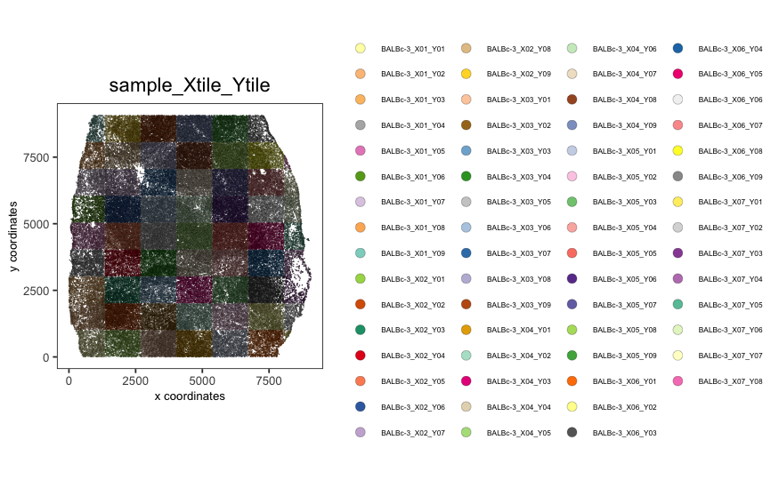
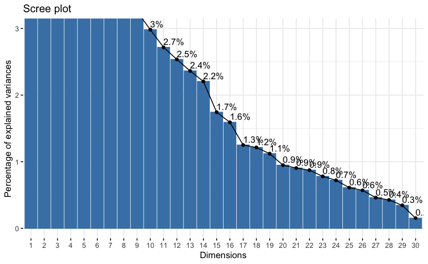
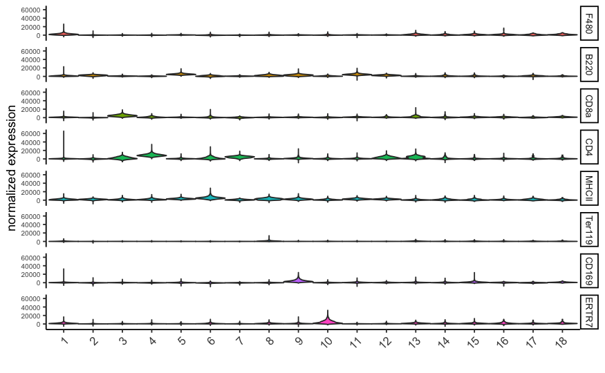
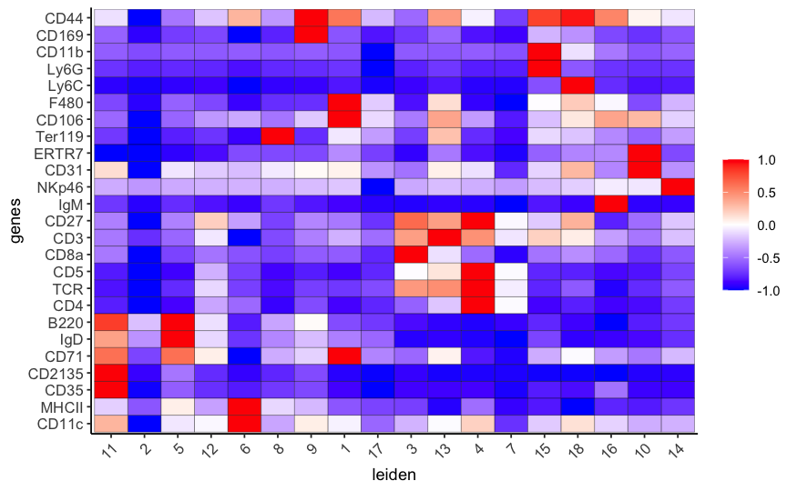
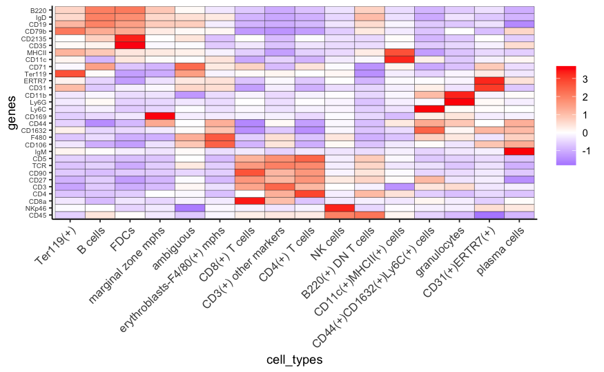
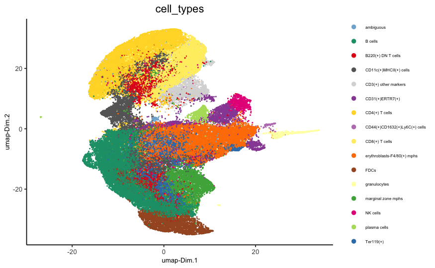
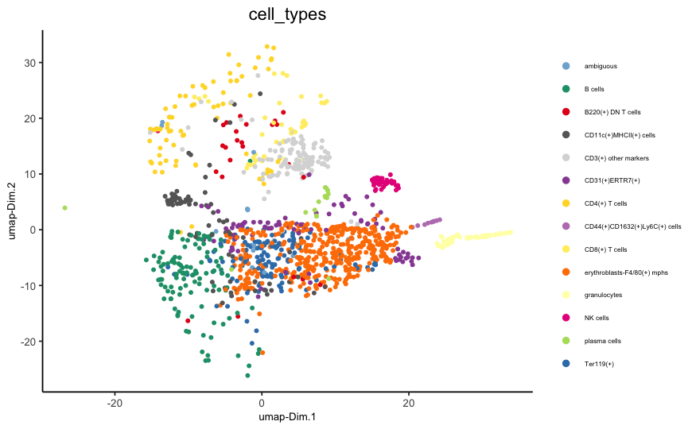
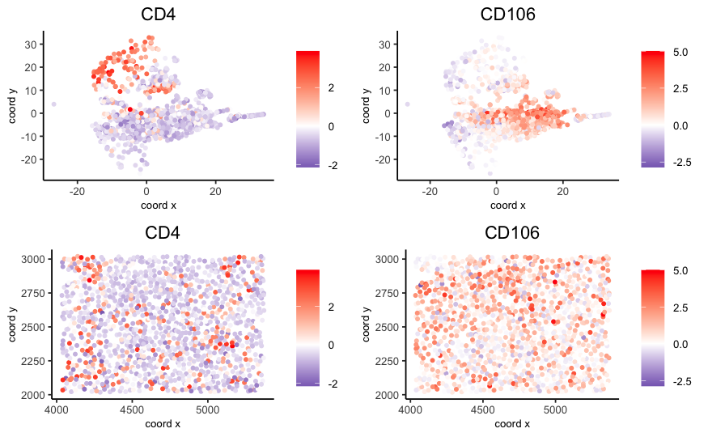

```{r, include = FALSE}
knitr::opts_chunk$set(
  collapse = TRUE,
  comment = "#>",
  fig.path = "man/figures/README-",
  out.width = "100%"
)
```

## Giotto global instructions
   
```{r eval=FALSE, message=FALSE, warning=FALSE}

## 0. Giotto global instructions ####

# this example works with Giotto v.0.3.0
library(Giotto)

## create instructions
## instructions allow you to automatically save all plots into a chosen results folder
## Here we will not automatically save plots, for an example see the seqFISH+ or Visium dataset

## instructions allow us to automatically save all plots into a chosen results folder
my_python_path = "/your/python/path/python"
results_folder = '/your/results/path/'
instrs = createGiottoInstructions(python_path = my_python_path,
                                  show_plot = T,
                                  return_plot = F,
                                  save_plot = F)

```

## Part 1: Data input

[Goltsev et al.](https://www.cell.com/cell/pdf/S0092-8674(18)30904-8.pdf) created a multiplexed datasets of normal and lupus (MRL/lpr) murine spleens using CODEX technique. The dataset consists of 30 protein markers from 734,101 single cells. In this tutorial, 83,787 cells from sampel "BALBc-3" were selected for the analysis. 
  
<center>

</center> 

```{r, eval=FALSE}
## load expression and cell location
data_dir = '/path/to/data/CODEX_3D/'
expr = fread(paste0(data_dir, '/', 'count_matrix/codex_BALBc_3_expression.csv.gz'))
cell_loc = fread(paste0(data_dir, '/', 'cell_locations/codex_BALBc_3_coord_annot.csv.gz'))

## remove duplicated locations
duplicated_locs = duplicated(cell_loc[,c("X.X", "Y.Y", "sample_Xtile_Ytile")])
cell_loc_dedup = cell_loc[!duplicated_locs,]
expr_dedup = expr[!duplicated_locs,]
expr_dedup_transpose = t(expr_dedup)
colnames(expr_dedup_transpose)=cell_loc_dedup$cellID

## stitch x.y tile coordinates to global coordinates 
xtilespan = 1344;
ytilespan = 1008;
stitch_file = stitchTileCoordinates(location_file = cell_loc_dedup, Xtilespan = xtilespan, Ytilespan = ytilespan);
stitch_file = stitch_file[,.(Xcoord, Ycoord)]


## exlude ambiguous cells from analysis ##
sub_set = cell_loc_dedup$Imaging_phenotype_annotation != "dirt" & cell_loc_dedup$Imaging_phenotype_annotation != "noid" & cell_loc_dedup$Imaging_phenotype_annotation != "capsule"

```


## Part 2: Create Giotto object & process data

```{r eval=FALSE}
## create

codex_test <- createGiottoObject(raw_exprs = expr_dedup_transpose[,sub_set], spatial_locs = stitch_file[sub_set,],
                              offset_file = NULL, instructions = instrs)
codex_test = addCellMetadata(codex_test, new_metadata = cell_loc_dedup[sub_set,])

## filter
codex_test <- filterGiotto(gobject = codex_test,
                        expression_threshold = 1,
                        gene_det_in_min_cells = 10,
                        min_det_genes_per_cell = 2,
                        expression_values = c('raw'),
                        verbose = T)

codex_test <- normalizeGiotto(gobject = codex_test, scalefactor = 6000, verbose = T,
                              log_norm = FALSE,library_size_norm = FALSE,scale_genes = FALSE,scale_cells = TRUE)

## add gene & cell statistics
codex_test <- addStatistics(gobject = codex_test,expression_values = "normalized")

## adjust expression matrix for technical or known variables
codex_test <- adjustGiottoMatrix(gobject = codex_test, 
                              expression_values = c('normalized'),
                              batch_columns = NULL, 
                              covariate_columns = NULL,
                              return_gobject = TRUE,
                              update_slot = c('custom'))

## visualize
spatPlot(gobject = codex_test,point_size = 0.1, 
         coord_fix_ratio = 1,point_shape = 'no_border')

spatPlot(gobject = codex_test, point_size = 0.2, coord_fix_ratio = 1, cell_color = 'sample_Xtile_Ytile',
         legend_symbol_size = 3,legend_text = 5)


```
<center>


</center> 


## Part 3: Dimension reduction
 
```{r eval=FALSE}
# use all Abs
# PCA
codex_test <- runPCA(gobject = codex_test, expression_values = 'normalized', scale_unit = T)
signPCA(codex_test, scale_unit = T, scree_ylim = c(0, 3))
plotPCA(gobject = codex_test, point_shape = 'no_border', point_size = 0.2)

# UMAP
codex_test <- runUMAP(codex_test, dimensions_to_use = 1:14, n_components = 2, n_threads = 12)
plotUMAP(gobject = codex_test, point_shape = 'no_border', point_size = 0.2)

```

<center>



</center> 

## Part 4: Cluster 

```{r eval=FALSE}
## sNN network (default)
codex_test <- createNearestNetwork(gobject = codex_test, dimensions_to_use = 1:14, k = 20)

## 0.1 resolution
codex_test <- doLeidenCluster(gobject = codex_test, resolution = 0.5, n_iterations = 100, name = 'leiden',python_path = my_python_path)

codex_metadata = pDataDT(codex_test)
leiden_colors = Giotto:::getDistinctColors(length(unique(codex_metadata$leiden)))
names(leiden_colors) = unique(codex_metadata$leiden)

plotUMAP(gobject = codex_test, cell_color = 'leiden', point_shape = 'no_border', point_size = 0.2, cell_color_code = leiden_colors)

spatPlot(gobject = codex_test, cell_color = 'leiden', point_shape = 'no_border', point_size = 0.2, 
         cell_color_code = leiden_colors, coord_fix_ratio = 1,label_size =2,
         legend_text = 5,legend_symbol_size = 2)

```


<center>


</center> 

## Part 5: Co-visualize

```{r eval=FALSE}

spatDimPlot2D(gobject = codex_test, cell_color = 'leiden', spat_point_shape = 'no_border', 
              spat_point_size = 0.2, dim_point_shape = 'no_border', dim_point_size = 0.2, 
              cell_color_code = leiden_colors,plot_alignment = c("horizontal"))

```
<center>

</center> 

## Part 6: Differential expression

```{r eval=FALSE}

# resolution 0.5
cluster_column = 'leiden'
markers_scran = findMarkers_one_vs_all(gobject=codex_test, method="scran",
                                       expression_values="norm", cluster_column=cluster_column, min_genes=3)
markergenes_scran = unique(markers_scran[, head(.SD, 5), by="cluster"][["genes"]])

plotMetaDataHeatmap(codex_test, expression_values = "norm", metadata_cols = c(cluster_column), 
                    selected_genes = markergenes_scran,
                    y_text_size = 8, show_values = 'zscores_rescaled')

topgenes_scran = markers_scran[, head(.SD, 1), by = 'cluster']$genes
violinPlot(codex_test, genes = unique(topgenes_scran)[1:8], cluster_column = cluster_column,
           strip_text = 8, strip_position = 'right')

# gini
markers_gini = findMarkers_one_vs_all(gobject=codex_test, method="gini", expression_values="norm",
                                      cluster_column=cluster_column, min_genes=5)
markergenes_gini = unique(markers_gini[, head(.SD, 5), by="cluster"][["genes"]])
plotMetaDataHeatmap(codex_test, expression_values = "norm", metadata_cols = c(cluster_column), selected_genes = markergenes_gini,
                    show_values = 'zscores_rescaled')

topgenes_gini = markers_gini[, head(.SD, 1), by = 'cluster']$genes
violinPlot(codex_test, genes = unique(topgenes_gini), cluster_column = cluster_column,
           strip_text = 8, strip_position = 'right')
```
<center>




</center> 

## Part 7: Cell type annotation

```{r eval=FALSE}

clusters_cell_types = c('erythroblasts-F4/80(+) mphs','B cells','CD8(+) T cells', 
                        'CD4(+) T cells', 'B cells','CD11c(+)MHCII(+) cells',
                        'CD4(+) T cells','Ter119(+)', 'marginal zone mphs', 
                        'CD31(+)ERTR7(+)', 'FDCs', 'B220(+) DN T cells',
                        'CD3(+) other markers','NK cells','granulocytes',
                        'plasma cells','ambiguous','CD44(+)CD1632(+)Ly6C(+) cells')

names(clusters_cell_types) = c(1:18)
codex_test = annotateGiotto(gobject = codex_test, annotation_vector = clusters_cell_types,
                           cluster_column = 'leiden', name = 'cell_types')

plotMetaDataHeatmap(codex_test, expression_values = 'scaled',
                    metadata_cols = c('cell_types'),y_text_size = 6)

# create consistent color code
mynames = unique(pDataDT(codex_test)$cell_types)
mycolorcode = Giotto:::getDistinctColors(n = length(mynames))
names(mycolorcode) = mynames

plotUMAP(gobject = codex_test, cell_color = 'cell_types',point_shape = 'no_border',   point_size = 0.2,
         cell_color_code = mycolorcode,
         show_center_label = F,
         label_size =2,
         legend_text = 5,
         legend_symbol_size = 2)

spatPlot(gobject = codex_test, cell_color = 'cell_types', point_shape = 'no_border', point_size = 0.2, 
        cell_color_code = mycolorcode,
        coord_fix_ratio = 1,
         label_size =2,
         legend_text = 5,
         legend_symbol_size = 2)

```

<center>



</center> 

## part 8: Visualize cell types and gene expression in selected zones

```{r eval=FALSE}

codex_test_zone1 = subsetGiotto(codex_test, cell_ids = codex_test@cell_metadata$cell_ID[codex_test@cell_metadata$sample_Xtile_Ytile=="BALBc-3_X04_Y08"])

plotUMAP(gobject = codex_test_zone1, cell_color = 'cell_types',point_shape = 'no_border',   point_size = 1,
         cell_color_code = mycolorcode,
         show_center_label = F,
         label_size =2,
         legend_text = 5,
         legend_symbol_size = 2)

spatPlot(gobject = codex_test_zone1, cell_color = 'cell_types', point_shape = 'no_border', point_size = 1, 
        cell_color_code = mycolorcode,
        coord_fix_ratio = 1,
         label_size =2,
         legend_text = 5,
         legend_symbol_size = 2)

spatDimGenePlot(codex_test_zone1, 
                expression_values = 'scaled',
                genes = c("CD8a","CD19"),
                spat_point_shape = 'no_border',
                dim_point_shape = 'no_border',
                genes_high_color = 'red', genes_mid_color = 'white', genes_low_color = 'darkblue')


```

<center>


</center> 

```{r eval=FALSE}

codex_test_zone2 = subsetGiotto(codex_test, cell_ids = codex_test@cell_metadata$cell_ID[codex_test@cell_metadata$sample_Xtile_Ytile=="BALBc-3_X04_Y03"])

plotUMAP(gobject = codex_test_zone2, cell_color = 'cell_types',point_shape = 'no_border',   point_size = 1,
         cell_color_code = mycolorcode,
         show_center_label = F,
         label_size =2,
         legend_text = 5,
         legend_symbol_size = 2)

spatPlot(gobject = codex_test_zone2, cell_color = 'cell_types', point_shape = 'no_border', point_size = 1, 
        cell_color_code = mycolorcode,
        coord_fix_ratio = 1,
         label_size =2,
         legend_text = 5,
         legend_symbol_size = 2)

spatDimGenePlot(codex_test_zone2, 
                expression_values = 'scaled',
                genes = c("CD4", "CD106"),
                spat_point_shape = 'no_border',
                dim_point_shape = 'no_border',
                genes_high_color = 'red', genes_mid_color = 'white', genes_low_color = 'darkblue')


```

<center>



</center> 
