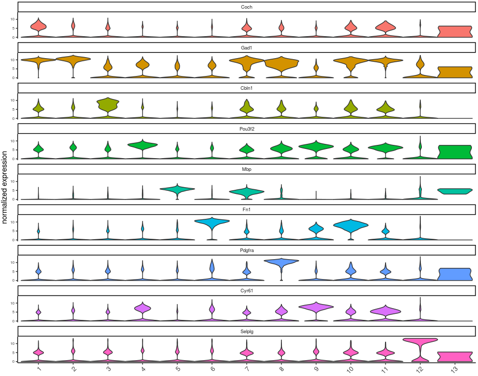
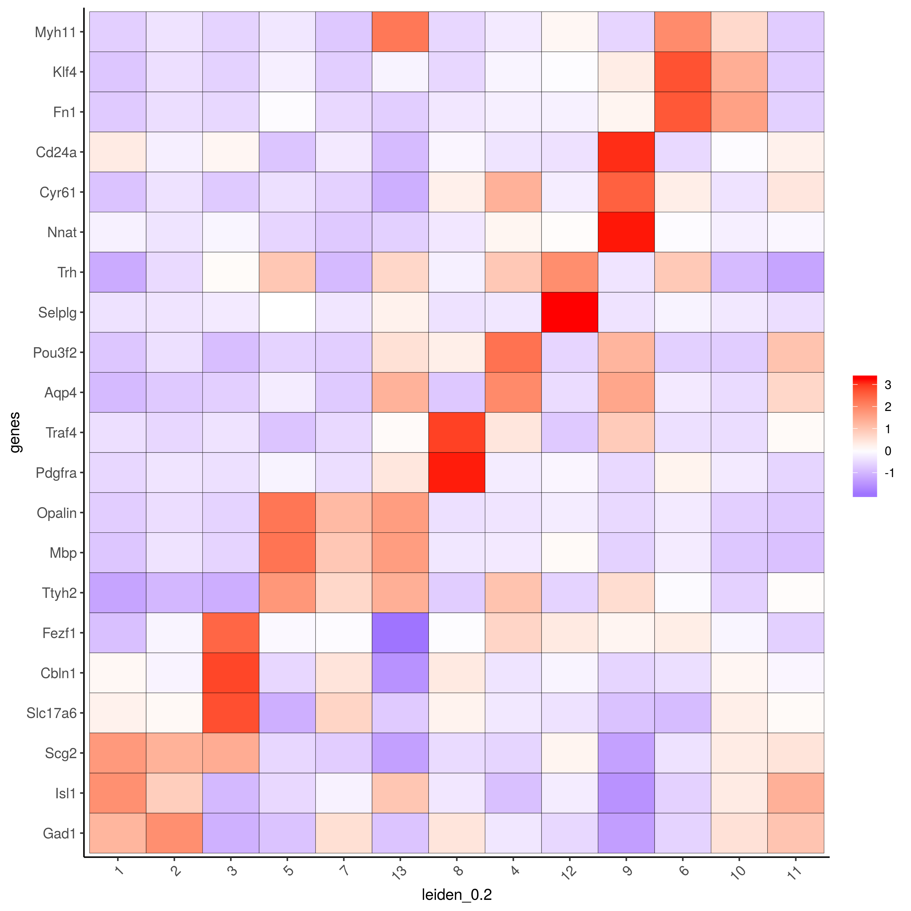
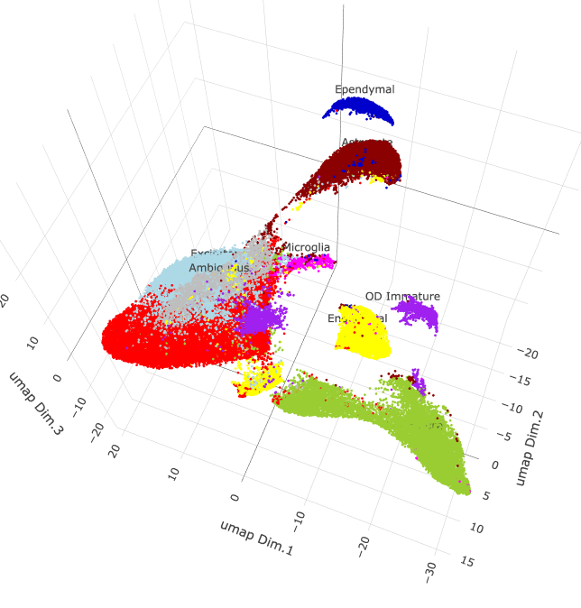
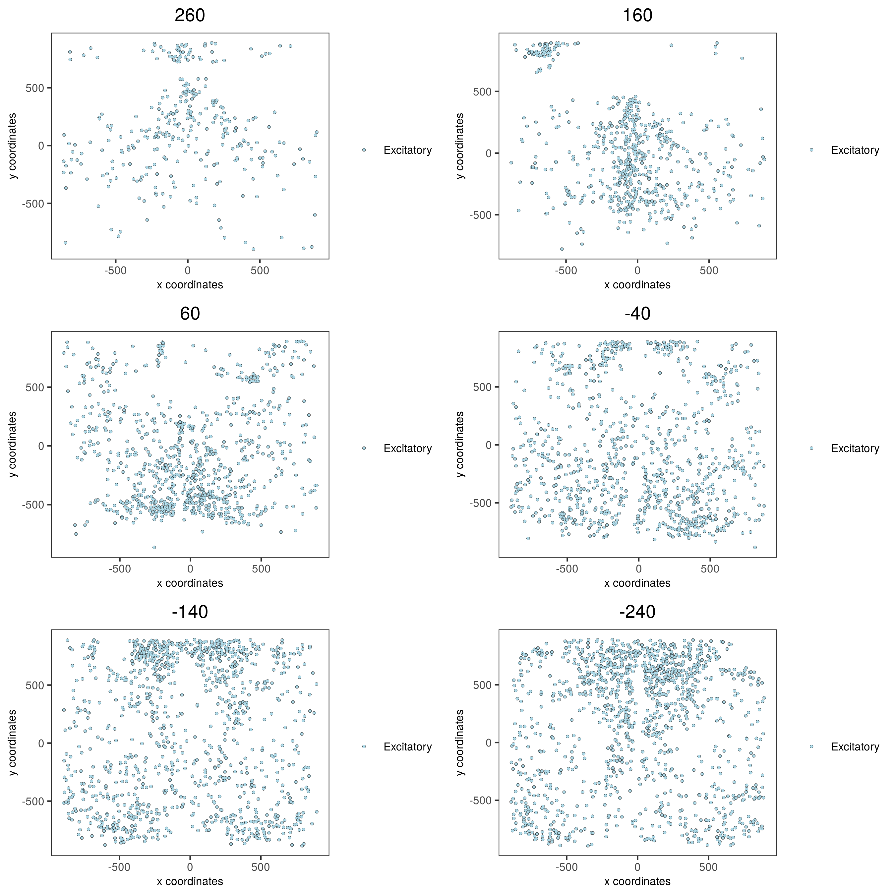
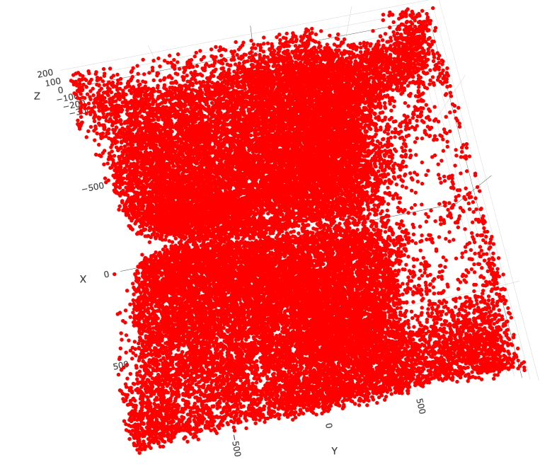
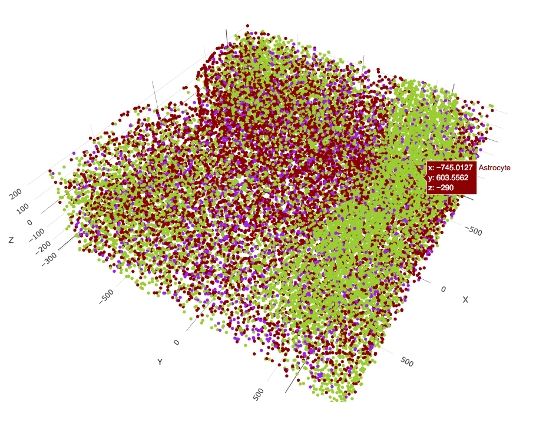

<!-- mouse_cortex_1_simple.md is generated from mouse_cortex_1_simple.Rmd Please edit that file -->

```{r, include = FALSE}
knitr::opts_chunk$set(
  collapse = TRUE,
  comment = "#>",
  fig.path = "man/figures/README-",
  out.width = "100%"
)
```

## Giotto global instructions
```{r eval=FALSE, message=FALSE, warning=FALSE}
library(Giotto)

## create instructions
## instructions allow us to automatically save all plots into a chosen results folder
## Here we will automatically save plots, for an example without automatic saving see the visium brain dataset
my_python_path = "/your/python/path/python"
results_folder = '/your/results/path/'
instrs = createGiottoInstructions(python_path = my_python_path,
                                  save_dir = results_folder,
                                  show_plot = F, return_plot = T, save_plot = T,
                                  plot_format = 'png', dpi = 300, height = 9, width = 9)

```


## part 1: Data input
[Moffitt et al.](https://science.sciencemag.org/content/362/6416/eaau5324) created a 3D spatial expression dataset consisting of 155 genes from ~1 million single cells acquired over the mouse hypothalamic preoptic regions.
  
```{r, eval=FALSE} 
data_dir = 'path/to/merFISH_data/'
expr = read.table(paste0(data_dir, '/', 'count_matrix/merFISH_3D_data_expression.txt'))
cell_loc = read.table(paste0(data_dir, '/', 'cell_locations/merFISH_3D_data_cell_locations.txt'))

cell_type = read.table(paste0(data_dir, '/', 'cell_types/merFISH_3D_data_cell_types.txt'))
```


## part 2: Create Giotto object & process data
```{r, eval=FALSE}
## 2. Create & Process Giotto ####
merFISH_test <- createGiottoObject(raw_exprs = expr, spatial_locs = cell_loc, instructions = instrs)

# add layer information
layer_ID = cell_loc$z
merFISH_test = addCellMetadata(merFISH_test, new_metadata = layer_ID)

annot = cell_type$x
merFISH_test = addCellMetadata(merFISH_test, new_metadata = annot)

## filter raw data
# 1. pre-test filter parameters
filterDistributions(merFISH_test, detection = 'genes')
filterDistributions(merFISH_test, detection = 'cells')
filterCombinations(merFISH_test, expression_thresholds = c(0,1e-6,1e-5), gene_det_in_min_cells = c(500, 1000, 1500), min_det_genes_per_cell = c(1, 5, 10))


# 2. filter data
merFISH_test <- filterGiotto(gobject = merFISH_test,
                             gene_det_in_min_cells = 0,
                             min_det_genes_per_cell = 0)
## normalize
merFISH_test <- normalizeGiotto(gobject = merFISH_test, scalefactor = 10000, verbose = T)
merFISH_test <- addStatistics(gobject = merFISH_test)
merFISH_test <- adjustGiottoMatrix(gobject = merFISH_test, expression_values = c('normalized'),
                                   batch_columns = NULL, covariate_columns = c('nr_genes', 'total_expr'),
                                   return_gobject = TRUE,
                                   update_slot = c('custom'))

# save according to giotto instructions
# 2D
spatPlot(gobject = merFISH_test, point_size = 1.5, 
         save_param = list(save_name = '2_spatial_locations2D'))
```

{ width=50% } 

```{r, eval=FALSE}
# 3D
spatPlot3D(gobject = merFISH_test, point_size = 2.0, axis_scale = 'real',
           save_param = list(save_name = '2_spatial_locations3D'))
```

{ width=50% } 

## part 3: dimension reduction

```{r, eval=FALSE}
# only 155 genes, use them all (default)
merFISH_test <- runPCA(gobject = merFISH_test, genes_to_use = NULL, scale_unit = F)
merFISH_test <- runUMAP(merFISH_test, dimensions_to_use = 1:8, n_components = 3, n_threads = 4)

plotUMAP_3D(gobject = merFISH_test, point_size = 1.5,
            save_param = list(save_name = '3_UMAP_reduction'))
```

{ width=50% } 

## part 4:  cluster

```{r, eval=FALSE}
## sNN network (default)
merFISH_test <- createNearestNetwork(gobject = merFISH_test, dimensions_to_use = 1:8, k = 15)
## Leiden clustering
merFISH_test <- doLeidenCluster(gobject = merFISH_test, resolution = 0.2, n_iterations = 100,
                                name = 'leiden_0.2')
plotUMAP_3D(gobject = merFISH_test, cell_color = 'leiden_0.2', point_size = 1.5, show_center_label = F,
            save_param = list(save_name = '4_UMAP_leiden'))
```

{ width=50% } 

## part 5: co-visualize

```{r, eval=FALSE}

spatDimPlot3D(gobject = merFISH_test, show_center_label = F,
              cell_color = 'leiden_0.2', dim3_to_use = 3,
              axis_scale = 'real', spatial_point_size = 2.0,
              save_param = list(save_name = '5_covis_leiden'))
```

{ width=50% } 


```{r, eval=FALSE}
spatPlot2D(gobject = merFISH_test, point_size = 1.5, 
           cell_color = 'leiden_0.2', 
           group_by = 'layer_ID', cow_n_col = 2, group_by_subset = c(seq(1, 12, 2)),
           save_param = list(save_name = '5_leiden_2D'))
```

{ width=50% } 

## part 6: cell type marker gene detection

```{r, eval=FALSE}
markers = findMarkers_one_vs_all(gobject = merFISH_test,
                                 method = 'gini',
                                 expression_values = 'normalized',
                                 cluster_column = 'leiden_0.2',
                                 min_genes = 1, rank_score = 2)
markers[, head(.SD, 2), by = 'cluster']

# violinplot
topgini_genes = unique(markers[, head(.SD, 2), by = 'cluster']$genes)
violinPlot(merFISH_test, genes = topgini_genes, cluster_column = 'leiden_0.2', strip_position = 'right',
           save_param = c(save_name = '6_violinplot'))

```

{ width=50% } 


## part 7: cell-type annotation

### Annotation
```{r, eval=FALSE}

# known markers and DEGs
selected_genes = c('Myh11', 'Klf4', 'Fn1', 'Cd24a', 'Cyr61', 'Nnat', 'Trh', 'Selplg', 'Pou3f2', 'Aqp4', 'Traf4',
                   'Pdgfra', 'Opalin', 'Mbp', 'Ttyh2', 'Fezf1', 'Cbln1', 'Slc17a6', 'Scg2', 'Isl1', 'Gad1')
cluster_order = c(1, 2, 3, 5, 7, 13, 8, 4, 12, 9, 6, 10, 11)

plotMetaDataHeatmap(merFISH_test, expression_values = 'scaled',
                    metadata_cols = c('leiden_0.2'),
                    selected_genes = selected_genes,
                    custom_gene_order = rev(selected_genes),
                    custom_cluster_order = cluster_order,
                    save_param = c(save_name = '7_clusterheatmap_markers'))
```

{ width=50% } 


```{r, eval=FALSE}
## name clusters
clusters_cell_types_hypo = c('Inhibitory', 'Inhibitory', 'Excitatory',  'OD Mature','OD Mature','OD Mature', 'OD Immature', 
                             'Astrocyte', 'Microglia', 'Ependymal', 'Endothelial','Endothelial', 'Ambiguous')
names(clusters_cell_types_hypo) = as.character(cluster_order)
merFISH_test = annotateGiotto(gobject = merFISH_test, annotation_vector = clusters_cell_types_hypo,
                              cluster_column = 'leiden_0.2', name = 'cell_types')

## show heatmap
plotMetaDataHeatmap(merFISH_test, expression_values = 'scaled',
                    metadata_cols = c('cell_types'),
                    selected_genes = selected_genes,
                    custom_gene_order = rev(selected_genes),
                    custom_cluster_order = clusters_cell_types_hypo,
                    save_param = c(save_name = '7_clusterheatmap_markers_celltypes'))
```

{ width=50% } 


### Visualization

```{r, eval=FALSE}
## visualize ##
mycolorcode = c('red', 'lightblue', 'yellowgreen','purple', 'darkred', 'magenta', 'mediumblue', 'yellow', 'gray')
names(mycolorcode) = c('Inhibitory', 'Excitatory','OD Mature', 'OD Immature', 'Astrocyte', 'Microglia', 'Ependymal','Endothelial', 'Ambiguous')

plotUMAP_3D(merFISH_test, cell_color = 'cell_types', point_size = 1.5, cell_color_code = mycolorcode,
            save_param = c(save_name = '7_umap_cell_types'))
```


{ width=50% } 

```{r, eval=FALSE}
spatPlot3D(merFISH_test,
           cell_color = 'cell_types', axis_scale = 'real',
           sdimx = 'sdimx', sdimy = 'sdimy', sdimz = 'sdimz',
           show_grid = F, cell_color_code = mycolorcode,
           save_param = c(save_name = '7_spatPlot_cell_types_all'))
```

{ width=50% } 

```{r, eval=FALSE}
spatPlot2D(gobject = merFISH_test, point_size = 1.0,
           cell_color = 'cell_types', cell_color_code = mycolorcode,
           group_by = 'layer_ID', cow_n_col = 2, group_by_subset = c(seq(260, -290, -100)),
           save_param = c(save_name = '7_spatPlot2D_cell_types_all'))

```


{ width=50% } 


### Excitatory cells only
```{r, eval=FALSE}
spatPlot3D(merFISH_test,
           cell_color = 'cell_types', axis_scale = 'real',
           sdimx = 'sdimx', sdimy = 'sdimy', sdimz = 'sdimz',
           show_grid = F, cell_color_code = mycolorcode,
           select_cell_groups = 'Excitatory', show_other_cells = F,
           save_param = c(save_name = '7_spatPlot_cell_types_excit'))
```

{ width=50% } 

```{r, eval=FALSE}
spatPlot2D(gobject = merFISH_test, point_size = 1.0, 
           cell_color = 'cell_types', cell_color_code = mycolorcode,
           select_cell_groups = 'Excitatory', show_other_cells = F,
           group_by = 'layer_ID', cow_n_col = 2, group_by_subset = c(seq(260, -290, -100)),
           save_param = c(save_name = '7_spatPlot2D_cell_types_excit'))
```

{ width=50% } 

### Inhibitory cells only
```{r, eval=FALSE}
# inhibitory
spatPlot3D(merFISH_test,
           cell_color = 'cell_types', axis_scale = 'real',
           sdimx = 'sdimx', sdimy = 'sdimy', sdimz = 'sdimz',
           show_grid = F, cell_color_code = mycolorcode,
           select_cell_groups = 'Inhibitory', show_other_cells = F,
           save_param = c(save_name = '7_spatPlot_cell_types_inhib'))
```

{ width=50% } 

```{r, eval=FALSE}
spatPlot2D(gobject = merFISH_test, point_size = 1.0, 
           cell_color = 'cell_types', cell_color_code = mycolorcode,
           select_cell_groups = 'Inhibitory', show_other_cells = F,
           group_by = 'layer_ID', cow_n_col = 2, group_by_subset = c(seq(260, -290, -100)),
           save_param = c(save_name = '7_spatPlot2D_cell_types_inhib'))
```

{ width=50% } 

### OD and astrocytes only
```{r, eval=FALSE}
spatPlot3D(merFISH_test,
           cell_color = 'cell_types', axis_scale = 'real',
           sdimx = 'sdimx', sdimy = 'sdimy', sdimz = 'sdimz',
           show_grid = F, cell_color_code = mycolorcode,
           select_cell_groups = c('Astrocyte', 'OD Mature', 'OD Immature'), show_other_cells = F,
           save_param = c(save_name = '7_spatPlot_cell_types_ODandAstro'))
```

{ width=50% } 

```{r, eval=FALSE}
spatPlot2D(gobject = merFISH_test, point_size = 1.0, 
           cell_color = 'cell_types', cell_color_code = mycolorcode,
           select_cell_groups = c('Astrocyte', 'OD Mature', 'OD Immature'), show_other_cells = F,
           group_by = 'layer_ID', cow_n_col = 2, group_by_subset = c(seq(260, -290, -100)),
           save_param = c(save_name = '7_spatPlot2D_cell_types_ODandAstro'))
```

{ width=50% } 

### Other cells only
```{r, eval=FALSE}
spatPlot3D(merFISH_test,
           cell_color = 'cell_types', axis_scale = 'real',
           sdimx = 'sdimx', sdimy = 'sdimy', sdimz = 'sdimz',
           show_grid = F, cell_color_code = mycolorcode,
           select_cell_groups = c('Microglia', 'Ependymal', 'Endothelial'), show_other_cells = F,
           save_param = c(save_name = '7_spatPlot_cell_types_other'))
```

{ width=50% } 

```{r, eval=FALSE}
spatPlot2D(gobject = merFISH_test, point_size = 1.0, 
           cell_color = 'cell_types', cell_color_code = mycolorcode,
           select_cell_groups = c('Microglia', 'Ependymal', 'Endothelial'), show_other_cells = F,
           group_by = 'layer_ID', cow_n_col = 2, group_by_subset = c(seq(260, -290, -100)),
           save_param = c(save_name = '7_spatPlot2D_cell_types_other'))
```

{ width=50% } 


