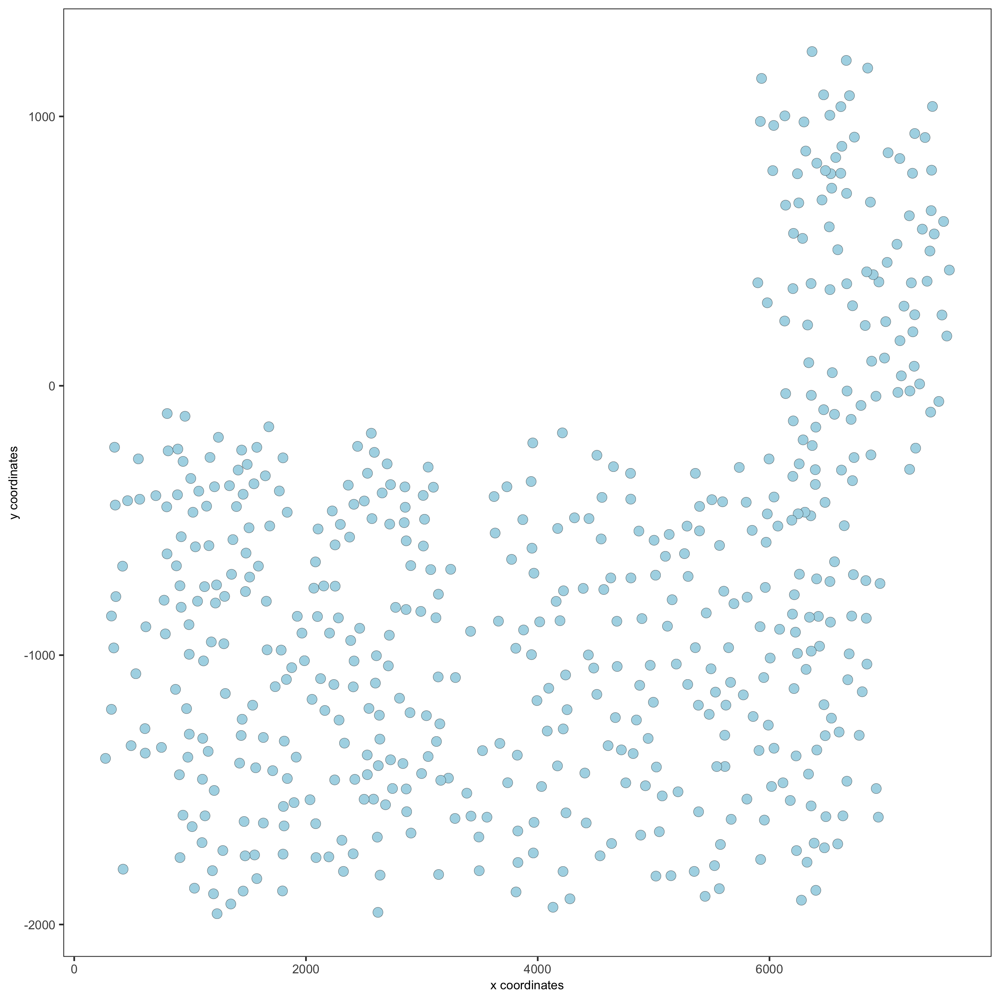
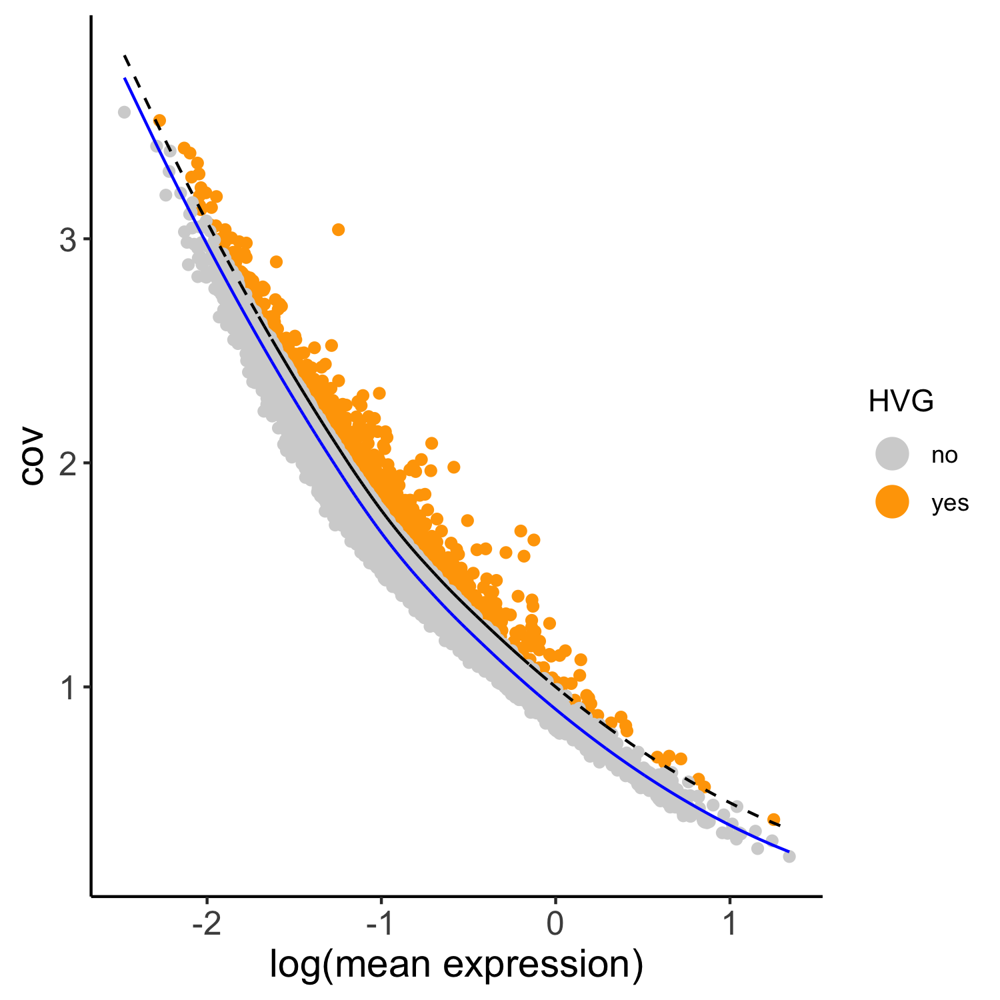

```{r, include = FALSE}
knitr::opts_chunk$set(
  collapse = TRUE,
  comment = "#>",
  fig.path = "man/figures/README-",
  out.width = "100%"
)
```

### Giotto global instructions

```{r eval=FALSE, message=FALSE, warning=FALSE}
# this example was tested with Giotto v.0.3.0
library(Giotto)

## create instructions
## instructions allow us to automatically save all plots into a chosen results folder
my_python_path = "/your/python/path/python"
results_folder = '/your/results/path/'
instrs = createGiottoInstructions(python_path = my_python_path,
                                  show_plot = F, return_plot = T, save_plot = T,
                                  save_dir = results_folder,
                                  plot_format = 'png',
                                  dpi = 300, height = 9, width = 9)
```


### part 1: Data input
  
- load cortex/svz gene expression matrix  
- prepare cell coordinates by stitching imaging fields  

Several fields - containing 100's of cells - in the mouse cortex and subventricular zone were imaged. The coordinates of the cells within each field are independent of eachother, so in order to visualize and process all cells together imaging fields will be stitched together by providing x and y-offset values specific to each field. These offset values are known or estimates based on the original raw image:  

<center>
{ width=50% }
</center>


  
```{r, eval=FALSE}
## A. expression and cell location
data_dir = '/path/to/data/Seqfish_SS_cortex/'
VC_exprs = read.table(paste0(data_dir,"/", "count_matrix/cortex_svz_expression.txt"))
VC_locs = fread(paste0(data_dir,"/", "cell_locations/cortex_svz_centroids_rotated.csv"))

## B. offset file to combine fields
my_offset_file = data.table(field = c(0, 1, 2, 3, 4, 5, 6),
                            x_offset = c(0, 1654.97, 1750.75, 1674.35, 675.5, 2048, 675),
                            y_offset = c(0, 0, 0, 0, -1438.02, -1438.02, 0))
stitch_file = stitchFieldCoordinates(location_file = VC_locs, offset_file = my_offset_file,
                                     cumulate_offset_x = T, cumulate_offset_y = F,
                                     field_col = 'Field of View',
                                     reverse_final_x = F, reverse_final_y = T)
stitch_file    = stitch_file[,.(X_final, Y_final)]
my_offset_file = my_offset_file[,.(field, x_offset_final, y_offset_final)]
```

***


### part 2: Create Giotto object & process data
 
```{r eval=FALSE}
## create
VC_test <- createGiottoObject(raw_exprs = VC_exprs, spatial_locs = stitch_file,
                              offset_file = my_offset_file, instructions = instrs)

## add known field annotation
cortex_fields = fread(paste0(data_dir,"/", "cortex_fields_info.txt"))
VC_test = addCellMetadata(VC_test, new_metadata = cortex_fields,
                          by_column = T, column_cell_ID = 'uniq_ID')

## subset for cortex only (first 5 fields)
cell_metadata = pDataDT(VC_test)
cortex_cell_ids = cell_metadata[Field_of_View %in% 0:4]$cell_ID
VC_test = subsetGiotto(VC_test, cell_ids = cortex_cell_ids)

## filter
VC_test <- filterGiotto(gobject = VC_test,
                        expression_threshold = 1,
                        gene_det_in_min_cells = 10,
                        min_det_genes_per_cell = 10,
                        expression_values = c('raw'),
                        verbose = T)

## normalize
VC_test <- normalizeGiotto(gobject = VC_test, scalefactor = 6000, verbose = T)

## add gene & cell statistics
VC_test <- addStatistics(gobject = VC_test)

## adjust expression matrix for technical or known variables
VC_test <- adjustGiottoMatrix(gobject = VC_test, expression_values = c('normalized'),
                              batch_columns = NULL, covariate_columns = c('nr_genes', 'total_expr'),
                              return_gobject = TRUE,
                              update_slot = c('custom'))

## visualize
spatPlot(gobject = VC_test)

```
  
<center>
{width=10cm} 
</center>


### part 3: dimension reduction


```{r eval=FALSE}
## highly variable genes (HVG)
VC_test <- calculateHVG(gobject = VC_test, method = 'cov_loess', difference_in_cov = 0.1,
                        save_param = list(save_name = '3_HVGplot', base_height = 5, base_width = 5))

```

<center>
{width=10cm} 
</center>

```{r eval=FALSE}
## select genes based on HVG and gene statistics, both found in gene metadata
gene_metadata = fDataDT(VC_test)
featgenes = gene_metadata[hvg == 'yes' & perc_cells > 4 & mean_expr_det > 0.5]$gene_ID

## run PCA on expression values (default)
VC_test <- runPCA(gobject = VC_test, genes_to_use = featgenes, scale_unit = F)

signPCA(VC_test, genes_to_use = featgenes, scale_unit = F,
        save_param = list(save_name = '3_screeplot'))

plotPCA(gobject = VC_test,
        save_param = list(save_name = '3_PCA_reduction'))
```

<center>
{width=10cm} 
</center>

<center>
{width=10cm} 
</center>


```{r eval=FALSE}
## run UMAP and tSNE on PCA space (default)
VC_test <- runUMAP(VC_test, dimensions_to_use = 1:15, n_threads = 10)
plotUMAP(gobject = VC_test,
         save_param = list(save_name = '3_UMAP_reduction'))
```

<center>
{width=10cm} 
</center>


```{r eval=FALSE}
VC_test <- runtSNE(VC_test, dimensions_to_use = 1:30)
plotTSNE(gobject = VC_test,
         save_param = list(save_name = '3_tSNE_reduction'))
```

<center>
{width=10cm} 
</center>


### part 4: cluster


```{r eval=FALSE}

## sNN network (default)
VC_test <- createNearestNetwork(gobject = VC_test, dimensions_to_use = 1:15, k = 15)
## Leiden clustering
VC_test <- doLeidenCluster(gobject = VC_test, resolution = 0.4, n_iterations = 1000)
plotUMAP(gobject = VC_test,
         cell_color = 'leiden_clus', show_NN_network = T, point_size = 2.5,
         save_param = list(save_name = '4_UMAP_leiden'))

```

<center>
{width=10cm} 
</center>

```{r eval=FALSE}
## Leiden subclustering for specified clusters
VC_test = doLeidenSubCluster(gobject = VC_test, cluster_column = 'leiden_clus',
                             resolution = 0.2, k_neighbors = 10,
                             hvg_param = list(method = 'cov_loess', difference_in_cov = 0.1),
                             pca_param = list(expression_values = 'normalized', scale_unit = F),
                             nn_param = list(dimensions_to_use = 1:5),
                             selected_clusters = c(4, 6, 7),
                             name = 'sub_leiden_clus_select')

## set colors for clusters
subleiden_order = c( 1.1, 5.1,  2.1, 3.1,
                     4.1,  4.2, 4.3, 6.2, 6.1,
                     7.1,  7.2, 8.1)
subleiden_colors = Giotto:::getDistinctColors(length(subleiden_order)) 
names(subleiden_colors) = subleiden_order

plotUMAP(gobject = VC_test,
         cell_color = 'sub_leiden_clus_select', cell_color_code = subleiden_colors,
         show_NN_network = T, point_size = 2.5, show_center_label = F, 
         legend_text = 12, legend_symbol_size = 3,
         save_param = list(save_name = '4_UMAP_leiden_subcluster'))
```

<center>
{width=10cm} 
</center>


```{r eval=FALSE}
## show cluster relationships
showClusterHeatmap(gobject = VC_test, cluster_column = 'sub_leiden_clus_select',
                   save_param = list(save_name = '4_heatmap', units = 'cm'),
                   row_names_gp = grid::gpar(fontsize = 9), column_names_gp = grid::gpar(fontsize = 9))

```

<center>
{width=10cm} 
</center>

```{r eval=FALSE}
showClusterDendrogram(VC_test, h = 0.5, rotate = T, cluster_column = 'sub_leiden_clus_select',
                      save_param = list(save_name = '4_dendro', units = 'cm'))


```

<center>
{width=10cm} 
</center>


### part 5: visualize spatial and expression space

```{r eval=FALSE}
# expression and spatial
spatDimPlot(gobject = VC_test, cell_color = 'sub_leiden_clus_select', cell_color_code = subleiden_colors,
            dim_point_size = 2, spat_point_size = 2,
            save_param = list(save_name = '5_covis_leiden'))
```

<center>
{width=10cm} 
</center>


```{r eval=FALSE}
# selected groups and provide new colors
groups_of_interest = c(4.1, 6.1, 6.2, 7.1)
group_colors = c('red', 'green', 'blue', 'purple'); names(group_colors) = groups_of_interest

spatDimPlot(gobject = VC_test, cell_color = 'sub_leiden_clus_select', 
            dim_point_size = 2, spat_point_size = 2,
            select_cell_groups = groups_of_interest, cell_color_code = group_colors,
            save_param = list(save_name = '5_covis_leiden_selected'))

```

<center>
{width=10cm} 
</center>


### part 6: cell type marker gene detection


```{r eval=FALSE}
## gini ##
gini_markers_subclusters = findMarkers_one_vs_all(gobject = VC_test,
                                                  method = 'gini',
                                                  expression_values = 'normalized',
                                                  cluster_column = 'sub_leiden_clus_select',
                                                  min_genes = 20,
                                                  min_expr_gini_score = 0.5,
                                                  min_det_gini_score = 0.5)
topgenes_gini = gini_markers_subclusters[, head(.SD, 2), by = 'cluster']

# violinplot
violinPlot(VC_test, genes = unique(topgenes_gini$genes), cluster_column = 'sub_leiden_clus_select',
           strip_text = 8, strip_position = 'right', cluster_custom_order = unique(topgenes_gini$cluster),
           save_param = c(save_name = '6_violinplot_gini', base_width = 5, base_height = 10))

```

<center>
{width=10cm} 
</center>

```{r eval=FALSE}
# cluster heatmap
topgenes_gini2 = gini_markers_subclusters[, head(.SD, 6), by = 'cluster']
plotMetaDataHeatmap(VC_test, selected_genes = unique(topgenes_gini2$genes), 
                    custom_gene_order = unique(topgenes_gini2$genes),
                    custom_cluster_order = unique(topgenes_gini2$cluster),
                    metadata_cols = c('sub_leiden_clus_select'), x_text_size = 10, y_text_size = 10,
                    save_param = c(save_name = '6_metaheatmap_gini'))
```

<center>
{width=10cm} 
</center>


### part 7: cell type annotation

```{r eval=FALSE}
## general cell types
# create vector with names
clusters_cell_types_cortex = c('microglia', 'L4 eNeuron', 'endothelial',
                               'astrocytes', 'Adarb2 iNeuron', 'Lhx6 iNeuron',
                               'L6 eNeuron', 'L5 eNeuron', 'L2/3 eNeuron',
                               'OPC', 'Olig', 'mural')
names(clusters_cell_types_cortex) = c(8.1, 2.1, 7.1,
                                      4.1, 6.2, 6.1,
                                      1.1, 5.1, 3.1,
                                      4.3, 4.2, 7.2)

VC_test = annotateGiotto(gobject = VC_test, annotation_vector = clusters_cell_types_cortex,
                         cluster_column = 'sub_leiden_clus_select', name = 'cell_types')

# cell type order and colors
cell_type_order = c('L6 eNeuron', 'L5 eNeuron', 'L4 eNeuron', 'L2/3 eNeuron',
                    'astrocytes', 'Olig', 'OPC','Adarb2 iNeuron', 'Lhx6 iNeuron',
                    'endothelial', 'mural', 'microglia')
cell_type_colors = Giotto:::getDistinctColors(length(cell_type_order)) 
names(cell_type_colors) = cell_type_order

## violinplot
violinPlot(gobject = VC_test, genes = unique(topgenes_gini$genes),
           strip_text = 7, strip_position = 'right', 
           cluster_custom_order = cell_type_order,
           cluster_column = 'cell_types', color_violin = 'cluster',
           save_param = c(save_name = '7_violinplot', base_width = 5))

```

<center>
{width=10cm} 
</center>


```{r eval=FALSE}
## co-visualization
spatDimPlot(gobject = VC_test, cell_color = 'cell_types',
            dim_point_size = 2, spat_point_size = 2, dim_show_cluster_center = F, dim_show_center_label = T,
            save_param = c(save_name = '7_covisualization'))
```

<center>
{width=10cm} 
</center>


```{r eval=FALSE}
## heatmap genes vs cells
gini_markers_subclusters[, cell_types := clusters_cell_types_cortex[cluster] ]
gini_markers_subclusters[, cell_types := factor(cell_types, cell_type_order)]
setorder(gini_markers_subclusters, cell_types)

plotHeatmap(gobject = VC_test,
            genes = gini_markers_subclusters[, head(.SD, 3), by = 'cell_types']$genes, 
            gene_order = 'custom',
            gene_custom_order = unique(gini_markers_subclusters[, head(.SD, 3), by = 'cluster']$genes),
            cluster_column = 'cell_types', cluster_order = 'custom',
            cluster_custom_order = unique(gini_markers_subclusters[, head(.SD, 3), by = 'cell_types']$cell_types), 
            legend_nrows = 2,
            save_param = c(save_name = '7_heatmap'))
```

<center>
{width=10cm} 
</center>


```{r eval=FALSE}
plotHeatmap(gobject = VC_test, cluster_color_code = cell_type_colors,
            genes = gini_markers_subclusters[, head(.SD, 6), by = 'cell_types']$genes,
            gene_order = 'custom',
            gene_label_selection = gini_markers_subclusters[, head(.SD, 2), by = 'cluster']$genes,
            gene_custom_order = unique(gini_markers_subclusters[, head(.SD, 6), by = 'cluster']$genes),
            cluster_column = 'cell_types', cluster_order = 'custom',
            cluster_custom_order = unique(gini_markers_subclusters[, head(.SD, 3), by = 'cell_types']$cell_types), 
            legend_nrows = 2,
            save_param = c(save_name = '7_heatmap_selected'))

```

<center>
{width=10cm} 
</center>


### part 8: spatial grid

```{r eval=FALSE}
## spatial grid
VC_test <- createSpatialGrid(gobject = VC_test,
                             sdimx_stepsize = 500,
                             sdimy_stepsize = 500,
                             minimum_padding = 50)

spatPlot(gobject = VC_test, show_grid = T, point_size = 1.5,
         save_param = c(save_name = '8_grid'))
```


<center>
{width=10cm} 
</center>


### part 9: spatial network

```{r eval=FALSE}

## delaunay network: stats + creation
plotStatDelaunayNetwork(gobject = VC_test, maximum_distance = 400, save_plot = F)
VC_test = createSpatialNetwork(gobject = VC_test, minimum_k = 2, maximum_distance_delaunay = 400)

## create spatial networks based on k and/or distance from centroid
VC_test <- createSpatialNetwork(gobject = VC_test, method = 'kNN', k = 5, name = 'spatial_network')
VC_test <- createSpatialNetwork(gobject = VC_test, method = 'kNN', k = 10, name = 'large_network')
VC_test <- createSpatialNetwork(gobject = VC_test, method = 'kNN', k = 100,
                                maximum_distance_knn = 200, minimum_k = 2, name = 'distance_network')

## visualize different spatial networks on first field (~ layer 1)
cell_metadata = pDataDT(VC_test)
field1_ids = cell_metadata[Field_of_View == 0]$cell_ID
subVC_test = subsetGiotto(VC_test, cell_ids = field1_ids)

spatPlot(gobject = subVC_test, show_network = T,
         network_color = 'blue', spatial_network_name = 'Delaunay_network',
         point_size = 2.5, cell_color = 'cell_types', 
         save_param = c(save_name = '9_spatial_network_delaunay', base_height = 6))
```

<center>
{width=10cm} 
</center>


```{r eval=FALSE}
spatPlot(gobject = subVC_test, show_network = T,
         network_color = 'blue', spatial_network_name = 'spatial_network',
         point_size = 2.5, cell_color = 'cell_types',
         save_param = c(save_name = '9_spatial_network_k3', base_height = 6))

```

<center>
{width=10cm} 
</center>

```{r eval=FALSE}
spatPlot(gobject = subVC_test, show_network = T,
         network_color = 'blue', spatial_network_name = 'large_network',
         point_size = 2.5, cell_color = 'cell_types',
         save_param = c(save_name = '9_spatial_network_k10', base_height = 6))
```

<center>
{width=10cm} 
</center>


```{r eval=FALSE}
spatPlot(gobject = subVC_test, show_network = T,
         network_color = 'blue', spatial_network_name = 'distance_network',
         point_size = 2.5, cell_color = 'cell_types',
         save_param = c(save_name = '9_spatial_network_dist', base_height = 6))

```

<center>
{width=10cm} 
</center>


### part 10: spatial genes


#### Individual spatial genes  

```{r eval=FALSE}
# 3 new methods to identify spatial genes
km_spatialgenes = binSpect(VC_test)
spatGenePlot(VC_test, expression_values = 'scaled', genes = km_spatialgenes[1:6]$genes,
             point_shape = 'border', point_border_stroke = 0.1,
             show_network = F, network_color = 'lightgrey', point_size = 2.5, 
             genes_high_color = 'red', genes_mid_color = 'white', genes_low_color = 'white',
             cow_n_col = 2,
             save_param = list(save_name = '10_spatialgenes_km'))
```

<center>
{width=10cm} 
</center>

```{r eval=FALSE}
rank_spatialgenes = binSpect(VC_test, bin_method = 'rank')
spatGenePlot(VC_test, expression_values = 'scaled', genes = rank_spatialgenes[1:6]$genes,
             point_shape = 'border', point_border_stroke = 0.1,
             show_network = F, network_color = 'lightgrey', point_size = 2.5, 
             genes_high_color = 'red', genes_mid_color = 'white', genes_low_color = 'white',
             cow_n_col = 2,
             save_param = list(save_name = '10_spatialgenes_rank'))
```

<center>
{width=10cm} 
</center>

```{r eval=FALSE}
silh_spatialgenes = silhouetteRank(gobject = VC_test)
spatGenePlot(VC_test, expression_values = 'scaled', genes = silh_spatialgenes[1:6]$genes,
             point_shape = 'border', point_border_stroke = 0.1,
             show_network = F, network_color = 'lightgrey', point_size = 2.5, 
             genes_high_color = 'red', genes_mid_color = 'white', genes_low_color = 'white',
             cow_n_col = 2,
             save_param = list(save_name = '10_spatialgenes_silh'))

```

<center>
{width=10cm} 
</center>


#### Spatial genes co-expression modules  

```{r eval=FALSE}
## spatial co-expression patterns ##
ext_spatial_genes = kmtest[1:500]$genes

# 1. calculate gene spatial correlation and single-cell correlation 
# create spatial correlation object
spat_cor_netw_DT = detectSpatialCorGenes(VC_test, 
                                         method = 'network', spatial_network_name = 'Delaunay_network',
                                         subset_genes = ext_spatial_genes)


# 2. cluster correlated genes & visualize
spat_cor_netw_DT = clusterSpatialCorGenes(spat_cor_netw_DT, name = 'spat_netw_clus', k = 8)

heatmSpatialCorGenes(VC_test, spatCorObject = spat_cor_netw_DT, use_clus_name = 'spat_netw_clus',
                     save_param = c(save_name = '10b_spatialcoexpression_heatmap',
                                    base_height = 6, base_width = 8, units = 'cm'), 
                     heatmap_legend_param = list(title = NULL))

```

<center>
{width=10cm} 
</center>


```{r eval=FALSE}
# 3. rank spatial correlated clusters and show genes for selected clusters
netw_ranks = rankSpatialCorGroups(VC_test, spatCorObject = spat_cor_netw_DT, use_clus_name = 'spat_netw_clus',
                                  save_param = c(save_name = '10b_spatialcoexpression_rank',
                                                 base_height = 3, base_width = 5))

top_netw_spat_cluster = showSpatialCorGenes(spat_cor_netw_DT, use_clus_name = 'spat_netw_clus',
                                            selected_clusters = 6, show_top_genes = 1)
```

<center>
{width=10cm} 
</center>

```{r eval=FALSE}
# 5. create metagene enrichment score for clusters
cluster_genes_DT = showSpatialCorGenes(spat_cor_netw_DT, use_clus_name = 'spat_netw_clus', show_top_genes = 1)
cluster_genes = cluster_genes_DT$clus; names(cluster_genes) = cluster_genes_DT$gene_ID

VC_test = createMetagenes(VC_test, gene_clusters = cluster_genes, name = 'cluster_metagene')

spatCellPlot(VC_test,
             spat_enr_names = 'cluster_metagene',
             cell_annotation_values = netw_ranks$clusters,
             point_size = 1.5, cow_n_col = 3,
             save_param = c(save_name = '10b_spatialcoexpression_metagenes',
                            base_width = 11, base_height = 6))

```

<center>
{width=10cm} 
</center>


### part 11: HMRF spatial domains

```{r eval=FALSE}
hmrf_folder = paste0(results_folder,'/','11_HMRF/')
if(!file.exists(hmrf_folder)) dir.create(hmrf_folder, recursive = T)

my_spatial_genes = km_spatialgenes[1:100]$genes

# do HMRF with different betas
HMRF_spatial_genes = doHMRF(gobject = VC_test, 
                            expression_values = 'scaled',
                            spatial_genes = my_spatial_genes,
                            spatial_network_name = 'Delaunay_network',
                            k = 9,
                            betas = c(28,2,3), 
                            output_folder = paste0(hmrf_folder, '/', 'Spatial_genes/SG_top100_k9_scaled'))


## view results of HMRF
for(i in seq(28, 32, by = 2)) {
  viewHMRFresults2D(gobject = VC_test,
                    HMRFoutput = HMRF_spatial_genes,
                    k = 9, betas_to_view = i,
                    point_size = 2)
}


## add HMRF of interest to giotto object
VC_test = addHMRF(gobject = VC_test,
                  HMRFoutput = HMRF_spatial_genes,
                  k = 9, betas_to_add = c(28),
                  hmrf_name = 'HMRF_2')

## visualize
spatPlot(gobject = VC_test, cell_color = 'HMRF_2_k9_b.28', point_size = 3, coord_fix_ratio = 1, 
         save_param = c(save_name = '11_HMRF_2_k9_b.28', base_height = 3, base_width = 9, save_format = 'pdf'))

```

<center>
{width=10cm} 
</center>


### part 12: cell neighborhood: cell-type/cell-type interactions

```{r eval=FALSE}
cell_proximities = cellProximityEnrichment(gobject = VC_test,
                                           cluster_column = 'cell_types',
                                           spatial_network_name = 'Delaunay_network',
                                           adjust_method = 'fdr',
                                           number_of_simulations = 2000)

## barplot
cellProximityBarplot(gobject = VC_test, CPscore = cell_proximities, min_orig_ints = 5, min_sim_ints = 5, 
                     save_param = c(save_name = '12_barplot_cell_cell_enrichment'))
```

<center>
{width=10cm} 
</center>

```{r eval=FALSE}
## heatmap
cellProximityHeatmap(gobject = VC_test, CPscore = cell_proximities, order_cell_types = T, scale = T,
                     color_breaks = c(-1.5, 0, 1.5), color_names = c('blue', 'white', 'red'),
                     save_param = c(save_name = '12_heatmap_cell_cell_enrichment', unit = 'in'))

```

<center>
{width=10cm} 
</center>


```{r eval=FALSE}
## network
cellProximityNetwork(gobject = VC_test, CPscore = cell_proximities, remove_self_edges = T, only_show_enrichment_edges = T,
                     save_param = c(save_name = '12_network_cell_cell_enrichment'))
```

<center>
{width=10cm} 
</center>

```{r eval=FALSE}
## network with self-edges
cellProximityNetwork(gobject = VC_test, CPscore = cell_proximities,
                     remove_self_edges = F, self_loop_strength = 0.3,
                     only_show_enrichment_edges = F,
                     rescale_edge_weights = T,
                     node_size = 8,
                     edge_weight_range_depletion = c(1, 2),
                     edge_weight_range_enrichment = c(2,5),
                     save_param = c(save_name = '12_network_cell_cell_enrichment_self',
                                    base_height = 5, base_width = 5, save_format = 'pdf'))


```

<center>
{width=10cm} 
</center>


```{r eval=FALSE}
## visualization of specific cell types
# Option 1
spec_interaction = "astrocytes--Olig"
cellProximitySpatPlot2D(gobject = VC_test,
                        interaction_name = spec_interaction,
                        show_network = T,
                        cluster_column = 'cell_types',
                        cell_color = 'cell_types',
                        cell_color_code = c(astrocytes = 'lightblue', Olig = 'red'),
                        point_size_select = 4, point_size_other = 2,
                        save_param = c(save_name = '12_cell_cell_enrichment_selected'))
```

<center>
{width=10cm} 
</center>

```{r eval=FALSE}
# Option 2: create additional metadata
VC_test = addCellIntMetadata(VC_test, 
                             spatial_network = 'spatial_network',
                             cluster_column = 'cell_types',
                             cell_interaction = spec_interaction,
                             name = 'astro_olig_ints')
spatPlot(VC_test, cell_color = 'astro_olig_ints',
         select_cell_groups =  c('other_astrocytes', 'other_Olig', 'select_astrocytes', 'select_Olig'),
         legend_symbol_size = 3, save_param = c(save_name = '12_cell_cell_enrichment_sel_vs_not'))

```

<center>
{width=10cm} 
</center>


### part 13: cell neighborhood: interaction changed genes

```{r eval=FALSE}
## select top 25th highest expressing genes
gene_metadata = fDataDT(VC_test)
plot(gene_metadata$nr_cells, gene_metadata$mean_expr)
plot(gene_metadata$nr_cells, gene_metadata$mean_expr_det)

quantile(gene_metadata$mean_expr_det)
high_expressed_genes = gene_metadata[mean_expr_det > 1.31]$gene_ID

## identify genes that are associated with proximity to other cell types
CPGscoresHighGenes =  findCPG(gobject = VC_test,
                              selected_genes = high_expressed_genes,
                              spatial_network_name = 'Delaunay_network',
                              cluster_column = 'cell_types',
                              diff_test = 'permutation',
                              adjust_method = 'fdr',
                              nr_permutations = 2000, 
                              do_parallel = T, cores = 2)

## visualize all genes
plotCellProximityGenes(VC_test, cpgObject = CPGscoresHighGenes, method = 'dotplot', 
                       save_param = c(save_name = '13_CPG_dotplot', base_width = 5, base_height = 5))

```

<center>
{width=10cm} 
</center>

```{r eval=FALSE}
## filter genes
CPGscoresFilt = filterCPG(CPGscoresHighGenes)

## visualize subset of interaction changed genes (ICGs)
ICG_genes = c('Jakmip1', 'Golgb1', 'Dact2', 'Ddx27', 'Abl1', 'Zswim8')
ICG_genes_types = c('Lhx6 iNeuron', 'Lhx6 iNeuron', 'L4 eNeuron', 'L4 eNeuron', 'astrocytes', 'astrocytes')
names(ICG_genes) = ICG_genes_types

plotICG(gobject = VC_test,
        cpgObject = CPGscoresHighGenes,
        source_type = 'endothelial',
        source_markers = c('Pltp', 'Cldn5', 'Apcdd1'),
        ICG_genes = ICG_genes,
        save_param = c(save_name = '13_ICG_barplot'))


```

<center>
{width=10cm} 
</center>


### part 14: cell neighborhood: ligand-receptor cell-cell communication

```{r eval=FALSE}
# LR expression
# LR activity changes
LR_data = fread(system.file("extdata", "mouse_ligand_receptors.txt", package = 'Giotto'))

LR_data[, ligand_det := ifelse(mouseLigand %in% VC_test@gene_ID, T, F)]
LR_data[, receptor_det := ifelse(mouseReceptor %in% VC_test@gene_ID, T, F)]
LR_data_det = LR_data[ligand_det == T & receptor_det == T]
select_ligands = LR_data_det$mouseLigand
select_receptors = LR_data_det$mouseReceptor


## get statistical significance of gene pair expression changes based on expression ##
expr_only_scores = exprCellCellcom(gobject = VC_test,
                                   cluster_column = 'cell_types', 
                                   random_iter = 1000,
                                   gene_set_1 = select_ligands,
                                   gene_set_2 = select_receptors)

## get statistical significance of gene pair expression changes upon cell-cell interaction
spatial_all_scores = spatCellCellcom(VC_test,
                                     spatial_network_name = 'spatial_network',
                                     cluster_column = 'cell_types', 
                                     random_iter = 1000,
                                     gene_set_1 = select_ligands,
                                     gene_set_2 = select_receptors,
                                     adjust_method = 'fdr',
                                     do_parallel = T,
                                     cores = 12,
                                     verbose = 'a little')


## select top LR ##
selected_spat = spatial_all_scores[p.adj <= 0.01 & abs(log2fc) > 0.25 & lig_nr >= 4 & rec_nr >= 4]
setorder(selected_spat, -PI)

top_LR_ints = unique(selected_spat[order(-abs(PI))]$LR_comb)[1:33]
top_LR_cell_ints = unique(selected_spat[order(-abs(PI))]$LR_cell_comb)[1:33]

plotCCcomDotplot(gobject = VC_test,
                 comScores = spatial_all_scores,
                 selected_LR = top_LR_ints,
                 selected_cell_LR = top_LR_cell_ints,
                 cluster_on = 'PI',
                 save_param = c(save_name = '14_communication_dotplot', save_format = 'pdf'))

```

<center>
{width=10cm} 
</center>


```{r eval=FALSE}
## spatial vs rank ####
comb_comm = combCCcom(spatialCC = spatial_all_scores,
                      exprCC = expr_only_scores)

# top differential activity levels for ligand receptor pairs
plotRankSpatvsExpr(gobject = VC_test,
                   comb_comm,
                   expr_rnk_column = 'exprPI_rnk',
                   spat_rnk_column = 'spatPI_rnk',
                   midpoint = 10,
                   save_param = c(save_name = '14_expr_vs_spatial_activity',
                                  base_height = 4, base_width = 4.5, save_format = 'pdf'))
```

<center>
{width=10cm} 
</center>


```{r eval=FALSE}
## recovery ####
## predict maximum differential activity
plotRecovery(gobject = VC_test,
             comb_comm,
             expr_rnk_column = 'exprPI_rnk',
             spat_rnk_column = 'spatPI_rnk',
             ground_truth = 'spatial',
             save_param = c(save_name = '14_spatial_recovery_activity', 
                            base_height = 3, base_width = 3, save_format = 'pdf'))
```

<center>
{width=10cm} 
</center>


### part 15: export Giotto Analyzer to Viewer

```{r eval=FALSE}
viewer_folder = paste0(results_folder, '/', 'Mouse_cortex_viewer')

# select annotations, reductions and expression values to view in Giotto Viewer
pDataDT(VC_test)
exportGiottoViewer(gobject = VC_test, output_directory = viewer_folder,
                   factor_annotations = c('cell_types',
                                          'leiden_clus',
                                          'sub_leiden_clus_select',
                                          'HMRF_2_k9_b.28'),
                   numeric_annotations = 'total_expr',
                   dim_reductions = c('umap'),
                   dim_reduction_names = c('umap'),
                   expression_values = 'scaled',
                   expression_rounding = 3,
                   overwrite_dir = T)
```


