```{r, include = FALSE}
knitr::opts_chunk$set(
  collapse = TRUE,
  comment = "#>",
  fig.path = "man/figures/README-",
  out.width = "100%"
)
```

## Giotto global instructions
```{r eval=FALSE, message=FALSE, warning=FALSE}
# this example works with Giotto v.0.3.0
library(Giotto)

## create instructions
## instructions allow you to automatically save all plots into a chosen results folder
## Here we will not automatically save plots, for an example see the seqFISH+ or Visium dataset

## instructions allow us to automatically save all plots into a chosen results folder
my_python_path = "/your/python/path/python"
results_folder = '/your/results/path/'
instrs = createGiottoInstructions(python_path = my_python_path,
                                  show_plot = T,
                                  return_plot = F,
                                  save_plot = F)

```

## part 1: Data input

[Wang et al.](https://science.sciencemag.org/content/361/6400/eaat5691) created a 3D spatial expression dataset consisting of 28 genes from 32,845 single cells acquired over multiple rounds in visual cortex STARmap volumes.
  
<center>

</center> 

```{r, eval=FALSE}
## A. expression and cell location
data_dir = '/path/to/data/STARmap_3D/'
expr = read.table(paste0(data_dir, '/', 'count_matrix/STARmap_3D_data_expression.txt'))
cell_loc = read.table(paste0(data_dir, '/', 'cell_locations/STARmap_3D_data_cell_locations.txt'))
```

***

## part 2: Create Giotto object & process data

```{r eval=FALSE}
## create
STAR_test <- createGiottoObject(raw_exprs = expr, spatial_locs = cell_loc, instructions = instrs)

## filter raw data
# pre-test filter parameters
filterDistributions(STAR_test, detection = 'genes')
filterDistributions(STAR_test, detection = 'cells')
filterCombinations(STAR_test, expression_thresholds = c(1, 1,2), gene_det_in_min_cells = c(20000, 20000, 30000), min_det_genes_per_cell = c(10, 20, 25))

# filter
STAR_test <- filterGiotto(gobject = STAR_test,
                          gene_det_in_min_cells = 20000,
                          min_det_genes_per_cell = 20)
## normalize
STAR_test <- normalizeGiotto(gobject = STAR_test, scalefactor = 10000, verbose = T)
STAR_test <- addStatistics(gobject = STAR_test)
STAR_test <- adjustGiottoMatrix(gobject = STAR_test, expression_values = c('normalized'),
                                batch_columns = NULL, covariate_columns = c('nr_genes', 'total_expr'),
                                return_gobject = TRUE,
                                update_slot = c('custom'))
## visualize
# 3D
spatPlot3D(gobject = STAR_test,point_size = 2)
```
  
<center>
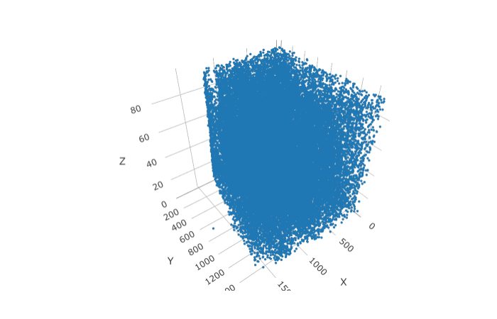
</center> 

## part 3: dimension reduction

```{r eval=FALSE}
STAR_test <- calculateHVG(gobject = STAR_test, method = 'cov_groups', 
                          zscore_threshold = 0.5, nr_expression_groups = 3,show_plot = T)

```

<center>

</center> 


```{r eval=FALSE}
STAR_test <- runPCA(gobject = STAR_test, genes_to_use = NULL, scale_unit = F)
signPCA(STAR_test)
```

<center>

</center> 


```{r eval=FALSE}

STAR_test <- runUMAP(STAR_test, dimensions_to_use = 1:8, n_components = 3, n_threads = 4)
plotUMAP_3D(gobject = STAR_test)
```

<center>
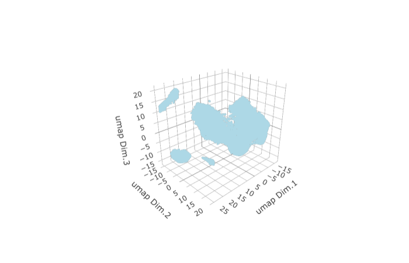
</center> 

***

## part 4: cluster

```{r eval=FALSE}
## sNN network (default)
STAR_test <- createNearestNetwork(gobject = STAR_test, dimensions_to_use = 1:8, k = 15)
## Leiden clustering
STAR_test <- doLeidenCluster(gobject = STAR_test, resolution = 0.2, n_iterations = 100,
                             name = 'leiden_0.2')

plotUMAP_3D(gobject = STAR_test, cell_color = 'leiden_0.2',show_center_label = F)

```

<center>

</center> 


***

## part 5: co-visualize ####

```{r eval=FALSE}
spatDimPlot3D(gobject = STAR_test,
               cell_color = 'leiden_0.2')
```

<center>

</center> 

***

## part 6: differential expression ####
  
```{r eval=FALSE}
markers = findMarkers_one_vs_all(gobject = STAR_test,
                                 method = 'gini',
                                 expression_values = 'normalized',
                                 cluster_column = 'leiden_0.2',
                                  min_expr_gini_score = 2,
                                  min_det_gini_score = 2,
                                 min_genes = 5, rank_score = 2)
markers[, head(.SD, 2), by = 'cluster']

# violinplot
violinPlot(STAR_test, genes = unique(markers$genes), cluster_column = 'leiden_0.2',
           strip_position = "right")

```

<center>

</center> 


```{r eval=FALSE}

# cluster heatmap
plotMetaDataHeatmap(STAR_test, expression_values = 'scaled',
                    metadata_cols = c('leiden_0.2'))

```

<center>

</center> 
***


## part 7: cell-type annotation

```{r eval=FALSE}

## general cell types
clusters_cell_types_cortex = c('excit','excit','excit', 'inh', 'excit',
                               'other', 'other', 'other', 'inh', 'inh')
names(clusters_cell_types_cortex) = c(1:10)
STAR_test = annotateGiotto(gobject = STAR_test, annotation_vector = clusters_cell_types_cortex,
                           cluster_column = 'leiden_0.2', name = 'general_cell_types')

plotMetaDataHeatmap(STAR_test, expression_values = 'scaled',
                    metadata_cols = c('general_cell_types'))
```

<center>
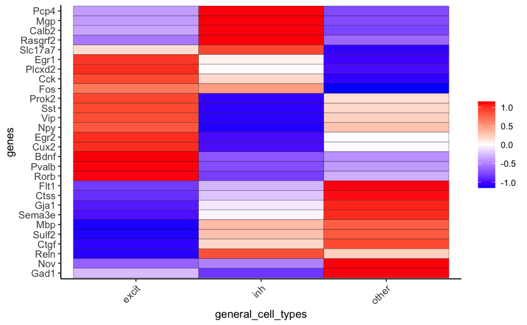
</center> 

```{r eval=FALSE}

## detailed cell types
clusters_cell_types_cortex = c('L5','L4','L2/3', 'PV', 'L6',
                               'Astro', 'Olig1', 'Olig2', 'Calretinin', 'SST')
names(clusters_cell_types_cortex) = c(1:10)
STAR_test = annotateGiotto(gobject = STAR_test, annotation_vector = clusters_cell_types_cortex,
                           cluster_column = 'leiden_0.2', name = 'cell_types')

plotUMAP_3D(STAR_test, cell_color = 'cell_types', point_size = 1.5,show_center_label = F)

```

<center>

</center> 


```{r eval=FALSE}

plotMetaDataHeatmap(STAR_test, expression_values = 'scaled',
                    metadata_cols = c('cell_types'),custom_cluster_order = c("Calretinin", "SST", "L4", "L2/3", "PV", "L5", "L6", "Astro", "Olig2", "Olig1"))

```


<center>

</center> 

***
## part 8: co-visualize cell types


```{r eval=FALSE}
# create consistent color code
mynames = unique(pDataDT(STAR_test)$cell_types)
mycolorcode = Giotto:::getDistinctColors(n = length(mynames))
names(mycolorcode) = mynames

spatDimPlot3D(gobject = STAR_test,
               cell_color = 'cell_types',show_center_label = F)
```

<center>
 
</center> 

***
## part 9: visualize gene expression


```{r eval=FALSE}
dimGenePlot3D(STAR_test, expression_values = 'scaled',
                  genes = "Rorb",
                  genes_high_color = 'red', genes_mid_color = 'white', genes_low_color = 'darkblue')

spatGenePlot3D(STAR_test, 
                  expression_values = 'scaled',
                  genes = "Rorb",
                  show_other_cells = F,
                  genes_high_color = 'red', genes_mid_color = 'white', genes_low_color = 'darkblue')
```
<center>
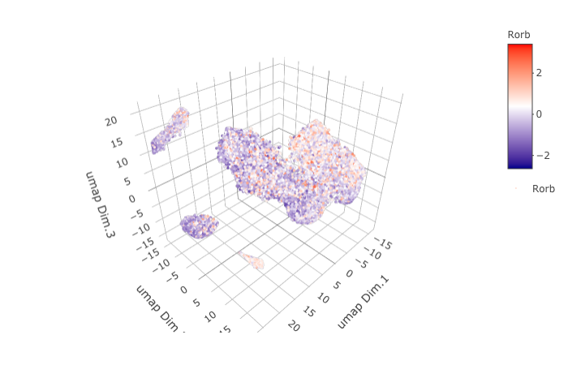

</center> 


```{r eval=FALSE}

dimGenePlot3D(STAR_test, expression_values = 'scaled',
                  genes = "Pcp4",
                  genes_high_color = 'red', genes_mid_color = 'white', genes_low_color = 'darkblue')

spatGenePlot3D(STAR_test, 
                  expression_values = 'scaled',
                  genes = "Pcp4",
                  show_other_cells = F,
                  genes_high_color = 'red', genes_mid_color = 'white', genes_low_color = 'darkblue')
```

<center>
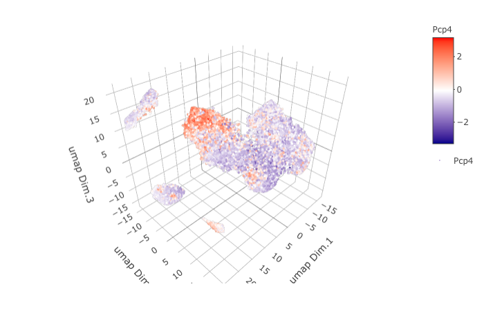
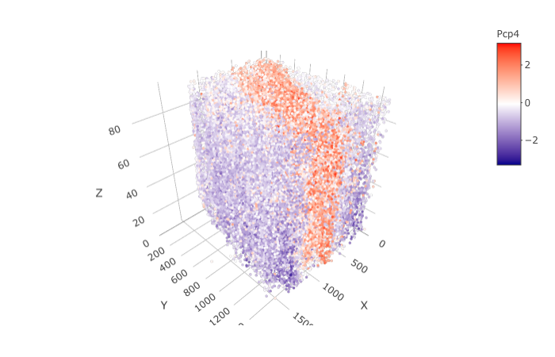
</center> 


```{r eval=FALSE}

dimGenePlot3D(STAR_test, expression_values = 'scaled',
                  genes = "Cux2",
                  genes_high_color = 'red', genes_mid_color = 'white', genes_low_color = 'darkblue')

spatGenePlot3D(STAR_test, 
                  expression_values = 'scaled',
                  genes = "Cux2",
                  show_other_cells = F,
                  genes_high_color = 'red', genes_mid_color = 'white', genes_low_color = 'darkblue')
```

<center>
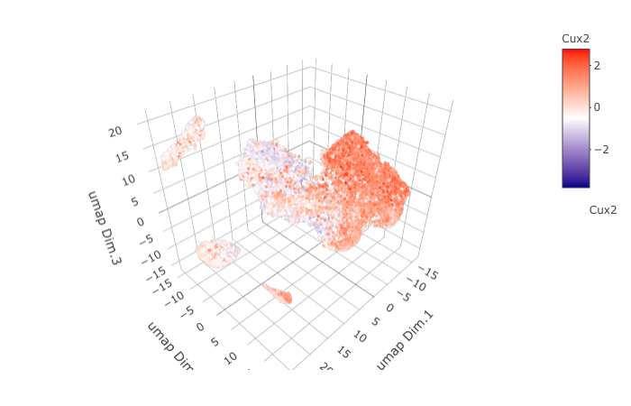

</center> 

```{r eval=FALSE}
dimGenePlot3D(STAR_test, expression_values = 'scaled',
                  genes = "Ctgf",
                  genes_high_color = 'red', genes_mid_color = 'white', genes_low_color = 'darkblue')

spatGenePlot3D(STAR_test, 
                  expression_values = 'scaled',
                  genes = "Ctgf",
                  show_other_cells = F,
                  genes_high_color = 'red', genes_mid_color = 'white', genes_low_color = 'darkblue')
```


<center>
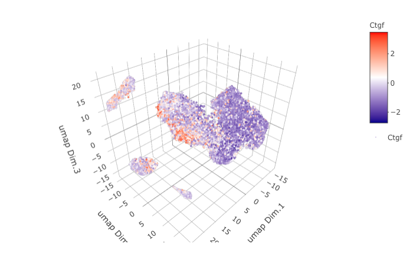
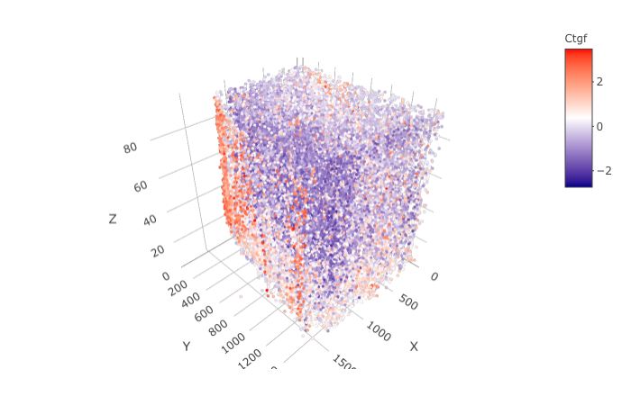
</center> 


***
## part 10: virtual cross section

```{r eval=FALSE}

STAR_test <- createSpatialNetwork(gobject = STAR_test)

STAR_test = createCrossSection(STAR_test,method="equation",equation=c(0,1,0,600),extend_ratio = 0.6)

```


```{r eval=FALSE}

insertCrossSectionSpatPlot3D(STAR_test, cell_color = 'cell_types', axis_scale = 'cube',
           point_size = 2,
           cell_color_code = mycolorcode)

insertCrossSectionGenePlot3D(STAR_test, expression_values = 'scaled',axis_scale = "cube",
                  genes = "Slc17a7")

```

<center>

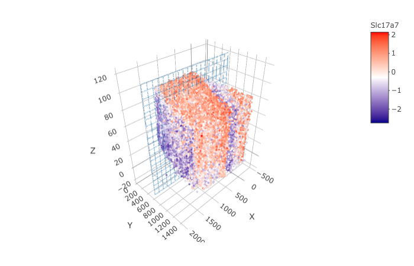
</center> 


```{r eval=FALSE}
crossSectionPlot(STAR_test,
                 point_size = 2,
                 cell_color = "cell_types",cell_color_code = mycolorcode)

crossSectionPlot3D(STAR_test,
                   point_size = 2, cell_color = "cell_types", 
                              cell_color_code = mycolorcode,axis_scale = "cube")

```

<center>
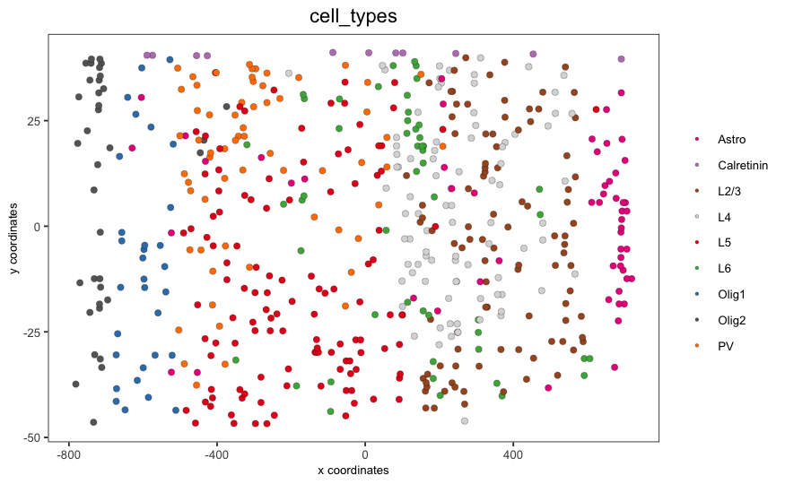

</center> 


```{r eval=FALSE}

crossSectionGenePlot(STAR_test,
                     genes = "Slc17a7",
                     point_size = 2,
                     cow_n_col = 1.5,
                     expression_values = 'scaled')

crossSectionGenePlot3D(STAR_test,
                       point_size = 2,
                       genes = c("Slc17a7"),
                       expression_values = 'scaled')

```


<center>

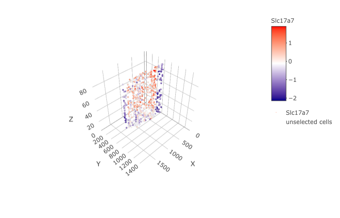
</center> 
