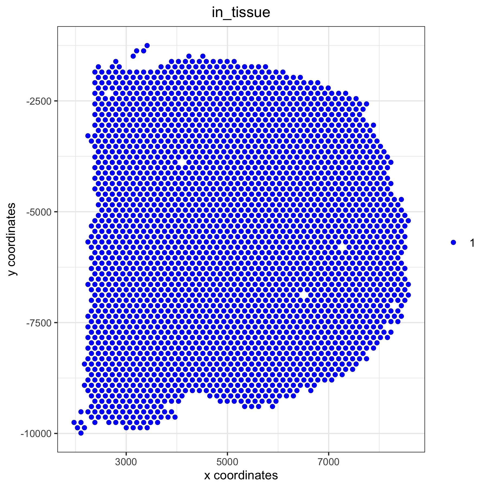
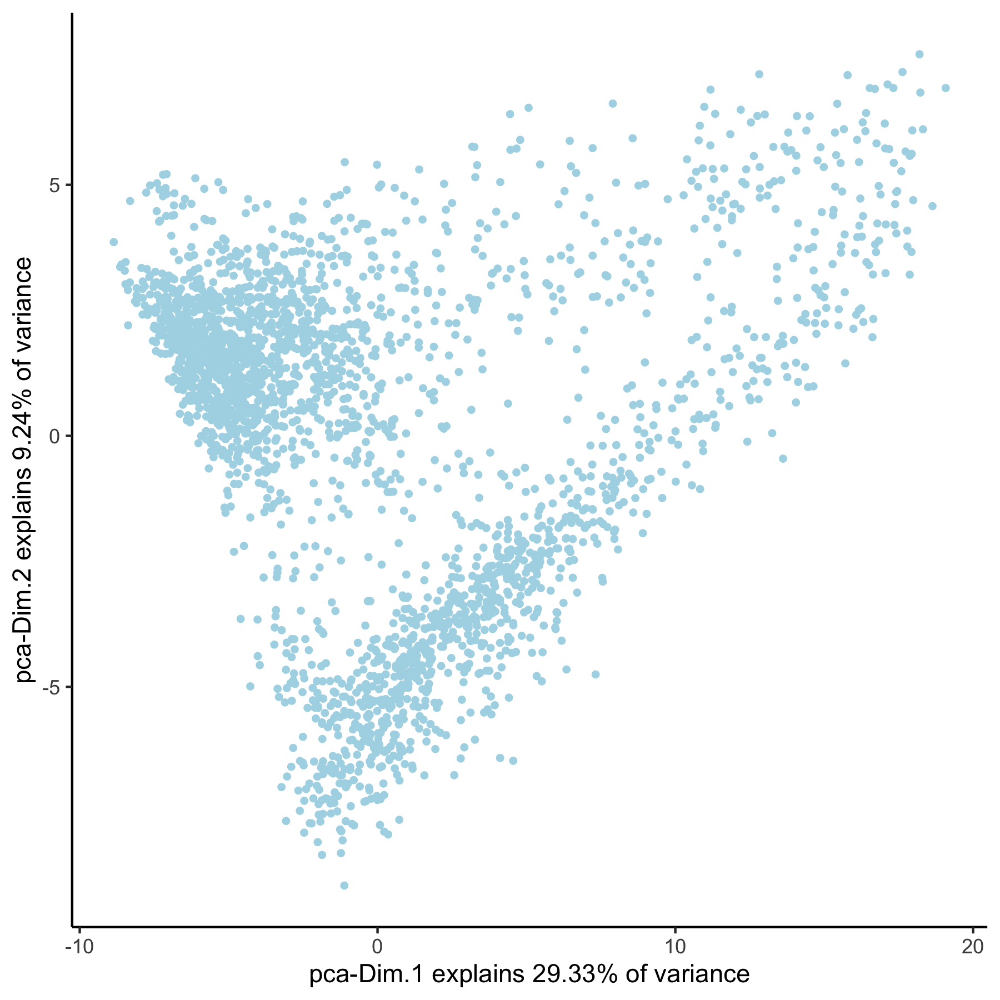
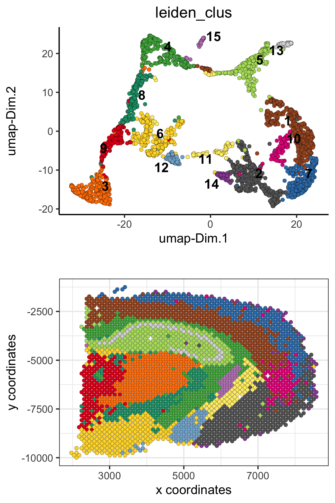
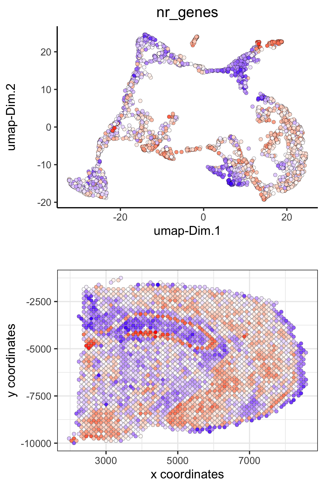
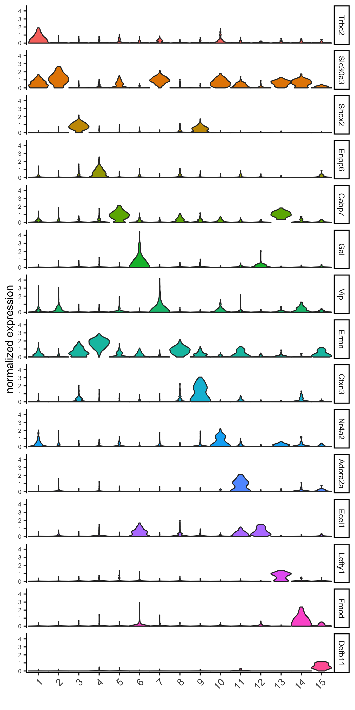
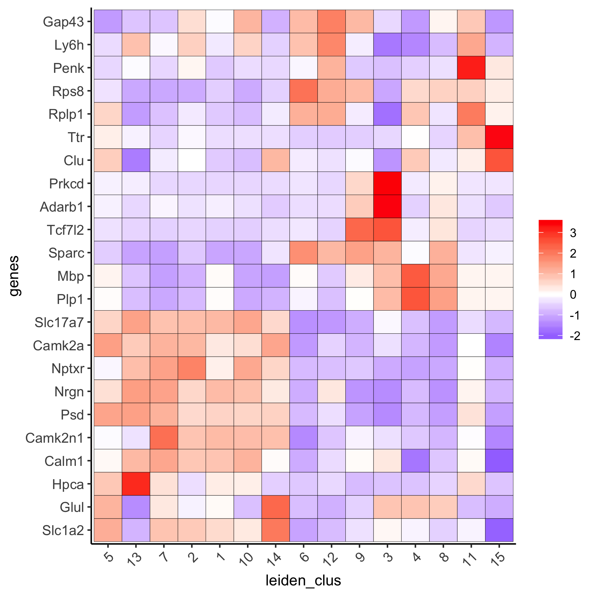
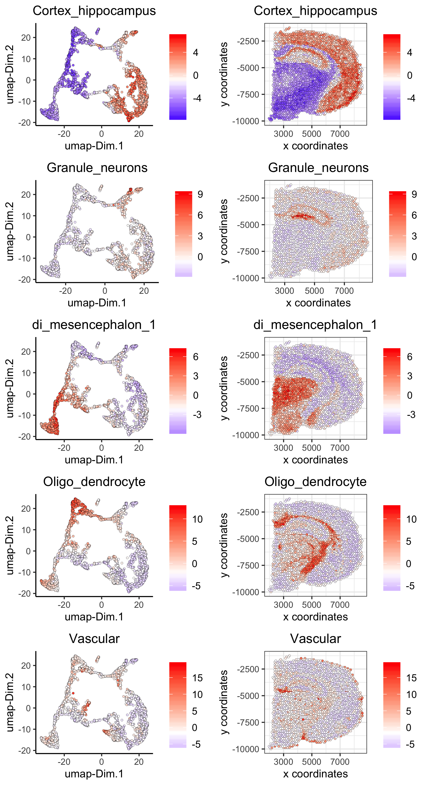
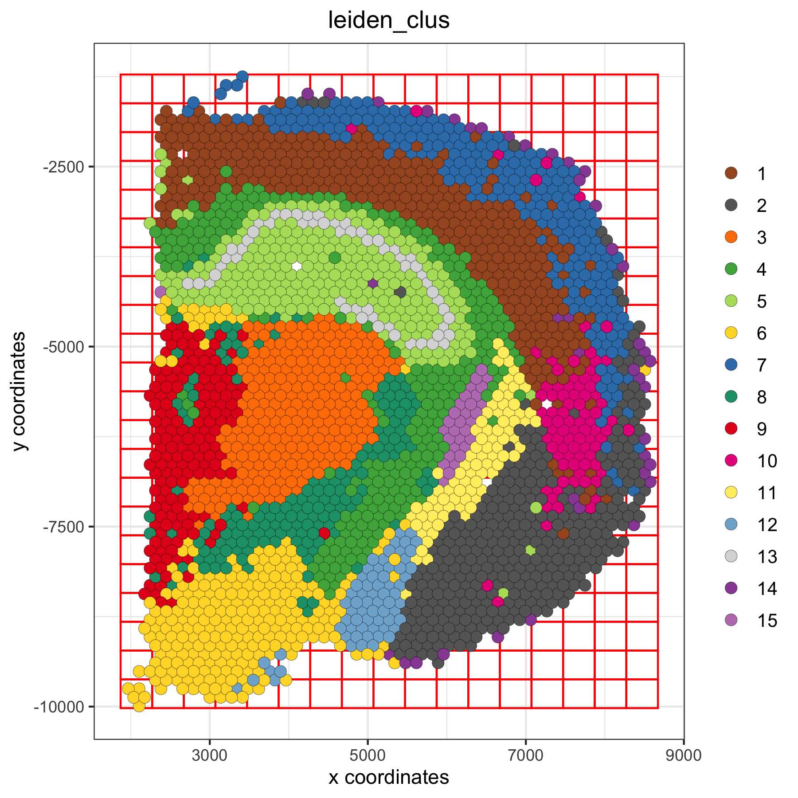
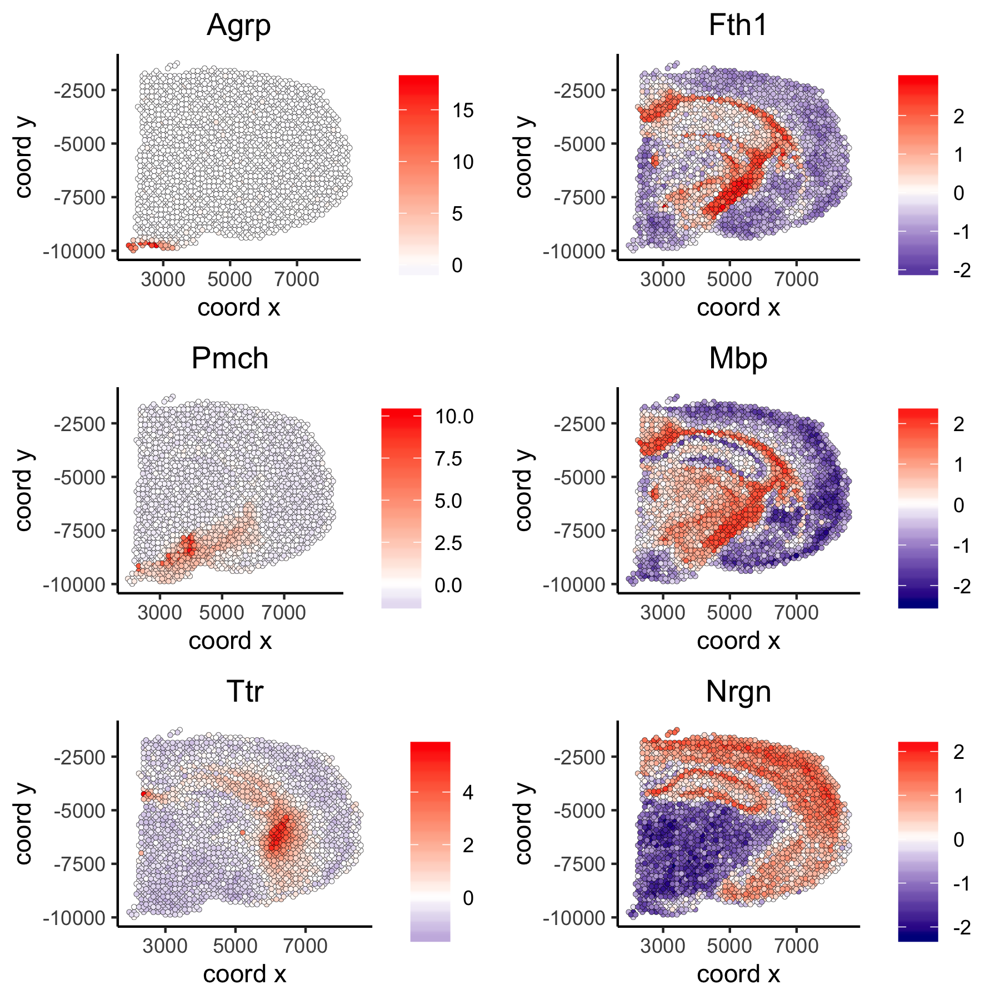

<!-- mouse_cortex_1_simple.md is generated from mouse_cortex_1_simple.Rmd Please edit that file -->


```{r, include = FALSE}
knitr::opts_chunk$set(
  collapse = TRUE,
  comment = "#>",
  fig.path = "man/figures/README-",
  out.width = "100%"
)
```

### Giotto global instructions
```{r eval=FALSE, message=FALSE, warning=FALSE}
library(Giotto)

## create instructions
## instructions allow us to automatically save all plots into a chosen results folder
## Here we will not automatically save plots, for an example see the visium kidney dataset
## We will only set the python path which is needed for certain analyses
my_python_path = "/your/python/path/python"
results_folder = '/your/results/path/'
instrs = createGiottoInstructions(python_path = my_python_path)

```

### part 1: Data input

[10X genomics](https://www.10xgenomics.com/spatial-transcriptomics/) recently launched a new platform to obtain spatial expression data using a Visium Spatial Gene Expression slide.
  
{ width=50% } 

```{r, eval=FALSE}
## expression and cell location
## expression data
data_dir = "path/to/Visum_data/"
data_path = paste0(data_dir,'raw_feature_bc_matrix/')
raw_matrix = get10Xmatrix(path_to_data = data_path, gene_column_index = 2) # gene symbol is in the 2nd column

## spatial locations and metadata
spatial_locations = fread(paste0(data_dir,'spatial/tissue_positions_list.csv'))
spatial_locations = spatial_locations[match(colnames(raw_matrix), V1)]
colnames(spatial_locations) = c('barcode', 'in_tissue', 'array_row', 'array_col', 'col_pxl', 'row_pxl')
```

 
High resolution png from original tissue.  
{ width=50% } 


### part 2: Create Giotto object & process data

 
```{r eval=FALSE}
## create
## we need to reverse the column pixel column (col_pxl) to get the same .jpg image as provided by 10X
visium_brain <- createGiottoObject(raw_exprs = raw_matrix,
                                    spatial_locs = spatial_locations[,.(row_pxl,-col_pxl)],
                                    instructions = instrs,
                                    cell_metadata = spatial_locations[,.(in_tissue, array_row, array_col)])

## check metadata
pDataDT(visium_brain)

## compare in tissue with provided jpg
spatPlot(gobject = visium_brain,  point_size = 2,
           cell_color = 'in_tissue', cell_color_code = c('0' = 'lightgrey', '1' = 'blue'))
```

Spots labeled according to whether they were covered by tissue or not:  
{ width=50% } 

```{r eval=FALSE}
## subset on spots that were covered by brain tissue
metadata = pDataDT(visium_brain)
in_tissue_barcodes = metadata[in_tissue == 1]$cell_ID
visium_brain = subsetGiotto(visium_brain, cell_ids = in_tissue_barcodes)

## filter genes and cells
visium_brain <- filterGiotto(gobject = visium_brain,
                              expression_threshold = 1,
                              gene_det_in_min_cells = 50,
                              min_det_genes_per_cell = 1000,
                              expression_values = c('raw'),
                              verbose = T)

## normalize
visium_brain <- normalizeGiotto(gobject = visium_brain, scalefactor = 6000, verbose = T)

## add gene & cell statistics
visium_brain <- addStatistics(gobject = visium_brain)

## visualize
# location of spots
spatPlot(gobject = visium_brain,  point_size = 2)
```

Spots after subsetting and filtering:  
{ width=50% } 
```{r eval=FALSE}
# number of genes per spot
spatPlot(gobject = visium_brain, cell_color = 'nr_genes', color_as_factor = F,  point_size = 2)

```

Overlay with number of genes detected per spot:  
{ width=50% } 


### part 3: dimension reduction

 
```{r eval=FALSE}
## highly variable genes (HVG)
visium_brain <- calculateHVG(gobject = visium_brain)
```

highly variable genes:  
{ width=50% } 

```{r eval=FALSE}
## select genes based on HVG and gene statistics, both found in gene metadata
gene_metadata = fDataDT(visium_brain)
featgenes = gene_metadata[hvg == 'yes' & perc_cells > 3 & mean_expr_det > 0.4]$gene_ID

## run PCA on expression values (default)
visium_brain <- runPCA(gobject = visium_brain, genes_to_use = featgenes, scale_unit = F)
# significant PCs
signPCA(visium_brain, genes_to_use = featgenes, scale_unit = F)
```

screeplot to determine number of Principal Components to keep:  
{ width=50% } 

```{r eval=FALSE}
# plot PCA
plotPCA(gobject = visium_brain)
```

PCA:  
{ width=50% } 

```{r eval=FALSE}
## run UMAP 
visium_brain <- runUMAP(visium_brain, dimensions_to_use = 1:10)
plotUMAP(gobject = visium_brain)
```

UMAP: 
{ width=50% } 

```{r eval=FALSE}
## run tSNE
visium_brain <- runtSNE(visium_brain, dimensions_to_use = 1:10)
plotTSNE(gobject = visium_brain)
```

tSNE: 
{ width=50% } 


### part 4:  cluster

```{r eval=FALSE}
## sNN network (default)
visium_brain <- createNearestNetwork(gobject = visium_brain, dimensions_to_use = 1:10, k = 15)

## Leiden clustering
visium_brain <- doLeidenCluster(gobject = visium_brain, resolution = 0.4, n_iterations = 1000)

# default cluster result name from doLeidenCluster = 'leiden_clus'
plotUMAP(gobject = visium_brain, cell_color = 'leiden_clus', show_NN_network = T, point_size = 2)
```

Leiden clustering:  
{ width=50% }


### part 5: co-visualize ####

```{r eval=FALSE}
# leiden clustering results
spatDimPlot(gobject = visium_brain, cell_color = 'leiden_clus',
            dim_point_size = 1.5, spat_point_size = 1.5)
```

Co-visualzation:
{ width=50% }
```{r eval=FALSE}
# number of genes detected per spot
spatDimPlot(gobject = visium_brain, cell_color = 'nr_genes', color_as_factor = F,
            dim_point_size = 1.5, spat_point_size = 1.5)
```

Co-visualzation overlaid with number of genes detected:  
{ width=50% }

```{r eval=FALSE}
# zoom-in on Dentate Gyrus by subsetting giotto object based on spatial coordinates/locations
DG_subset = subsetGiottoLocs(visium_brain, x_max = 6500, x_min = 3000, y_max = -2500, y_min = -5500, return_gobject = T)
spatDimPlot(gobject = DG_subset, cell_color = 'leiden_clus', spat_point_size = 5)

```

Zoom-in on Dentate Gyrus:  
{ width=50% }


### part 6: cell type marker gene detection
  
##### Gini marker genes
```{r eval=FALSE}
## gini ##
## ---- ##
gini_markers_subclusters = findMarkers_one_vs_all(gobject = visium_brain,
                                                  method = 'gini',
                                                  expression_values = 'normalized',
                                                  cluster_column = 'leiden_clus',
                                                  min_genes = 20,
                                                  min_expr_gini_score = 0.5,
                                                  min_det_gini_score = 0.5)

# violinplot
topgenes_gini = gini_markers_subclusters[, head(.SD, 1), by = 'cluster']$genes
violinPlot(visium_brain, genes = unique(topgenes_gini), cluster_column = 'leiden_clus',
           strip_text = 8, strip_position = 'right')
```

Gini:
- violinplot:
{ width=50% }

```{r eval=FALSE}
# cluster heatmap
topgenes_gini = gini_markers_subclusters[, head(.SD, 2), by = 'cluster']$genes
my_cluster_order = c(5, 13, 7, 2, 1, 10, 14, 6, 12, 9, 3, 4 , 8, 11, 15)
plotMetaDataHeatmap(visium_brain, selected_genes = topgenes_gini, custom_cluster_order = my_cluster_order,
                    metadata_cols = c('leiden_clus'), x_text_size = 10, y_text_size = 10)
```

- Heatmap clusters:
{ width=50% }

```{r eval=FALSE}
# umap plots
dimGenePlot2D(visium_brain, expression_values = 'scaled',
              genes = gini_markers_subclusters[, head(.SD, 1), by = 'cluster']$genes,
              cow_n_col = 3, point_size = 1,
              genes_high_color = 'red', genes_mid_color = 'white', genes_low_color = 'darkblue', midpoint = 0)
```

- UMAPs:
{ width=50% }


##### Scran marker genes
```{r eval=FALSE}
scran_markers_subclusters = findMarkers_one_vs_all(gobject = visium_brain,
                                                   method = 'scran',
                                                   expression_values = 'normalized',
                                                   cluster_column = 'leiden_clus')
# violinplot
topgenes_scran = scran_markers_subclusters[, head(.SD, 1), by = 'cluster']$genes
violinPlot(visium_brain, genes = unique(topgenes_scran), cluster_column = 'leiden_clus',
           strip_text = 8, strip_position = 'right')
```

Scran:
- violinplot:
{ width=50% }

```{r eval=FALSE}
# cluster heatmap
topgenes_scran = scran_markers_subclusters[, head(.SD, 2), by = 'cluster']$genes
plotMetaDataHeatmap(visium_brain, selected_genes = topgenes_scran, custom_cluster_order = my_cluster_order,
                    metadata_cols = c('leiden_clus'))
```

- Heatmap clusters:
{ width=50% }

```{r eval=FALSE}
# umap plots
dimGenePlot2D(visium_brain, expression_values = 'scaled',
              genes = scran_markers_subclusters[, head(.SD, 1), by = 'cluster']$genes,
              cow_n_col = 3, point_size = 1,
              genes_high_color = 'red', genes_mid_color = 'white', genes_low_color = 'darkblue', midpoint = 0)
```

- UMAPs:
{ width=50% }


### part 7: cell-type annotation

Visium spatial transcriptomics does not provide single-cell resolution, making cell type annotation a harder problem. Giotto provides 3 ways to calculate enrichment of specific cell-type signature gene list:    
- PAGE  
- rank  
- hypergeometric test  

To generate the cell-type specific gene lists for the mouse brain data we used cell-type specific gene sets as identified in [Zeisel, A. et al. Molecular Architecture of the Mouse Nervous System](https://www.mousebrain.org)

{ width=50% } 

```{r eval=FALSE}

# known markers for different mouse brain cell types:
# Zeisel, A. et al. Molecular Architecture of the Mouse Nervous System. Cell 174, 999-1014.e22 (2018).

## cell type signatures ##
## combination of all marker genes identified in Zeisel et al
brain_sc_markers = fread('/path/to/Visium_data/Brain_data/sig_matrix.txt') # file don't exist in data folder
sig_matrix = as.matrix(brain_sc_markers[,-1]); rownames(sig_matrix) = brain_sc_markers$Event
  
## enrichment tests 
visium_brain = createSpatialEnrich(visium_brain, sign_matrix = sig_matrix, enrich_method = 'PAGE') #default = 'PAGE'

## heatmap of enrichment versus annotation (e.g. clustering result)
cell_types = colnames(sig_matrix)
plotMetaDataCellsHeatmap(gobject = visium_brain,
                         metadata_cols = 'leiden_clus',
                         value_cols = cell_types,
                         spat_enr_names = 'PAGE',x_text_size = 8, y_text_size = 8)
```

{ width=50% }

```{r eval=FALSE}
## spatial enrichment results for all cell type signatures ##
cell_types_subset = colnames(sig_matrix)[1:10]
spatCellPlot(gobject = visium_brain, spat_enr_names = 'PAGE',
             cell_annotation_values = cell_types_subset,
             cow_n_col = 4,coord_fix_ratio = NULL, point_size = 0.75)
```

{ width=50% }


```{r eval=FALSE}
cell_types_subset = colnames(sig_matrix)[11:20]
spatCellPlot(gobject = visium_brain, spat_enr_names = 'PAGE',
             cell_annotation_values = cell_types_subset,
             cow_n_col = 4,coord_fix_ratio = NULL, point_size = 0.75)
```

{ width=50% }

```{r eval=FALSE}
## spatial and dimension reduction visualization with
spatDimCellPlot(gobject = visium_brain, spat_enr_names = 'PAGE',
                cell_annotation_values = c('Cortex_hippocampus', 'Granule_neurons', 'di_mesencephalon_1', 'Oligo_dendrocyte','Vascular'),
                cow_n_col = 1, spat_point_size = 1, plot_alignment = 'horizontal')
```


Co-visualization for selected subset:   
{ width=50% }


```{r eval=FALSE}
## visualize individual spatial enrichments
spatDimPlot(gobject = visium_brain,
            spat_enr_names = 'PAGE',
            cell_color = 'Cortex_hippocampus', color_as_factor = F,
            spat_show_legend = T, dim_show_legend = T,
            gradient_midpoint = 0, 
            dim_point_size = 1.5, spat_point_size = 1.5)
```

{ width=50% }

```{r eval=FALSE}
spatDimPlot(gobject = visium_brain,
            spat_enr_names = 'PAGE',
            cell_color = 'Granule_neurons', color_as_factor = F,
            spat_show_legend = T, dim_show_legend = T,
            gradient_midpoint = 0, 
            dim_point_size = 1.5, spat_point_size = 1.5

```

 { width=50% } 


### part 8: spatial grid ####

```{r eval=FALSE}
# create spatial grid
visium_brain <- createSpatialGrid(gobject = visium_brain,
                                   sdimx_stepsize = 400,
                                   sdimy_stepsize = 400,
                                   minimum_padding = 0)
spatPlot(visium_brain, cell_color = 'leiden_clus', show_grid = T,
         grid_color = 'red', spatial_grid_name = 'spatial_grid')
```

 { width=50% } 

### part 9: spatial network ####

  
```{r eval=FALSE}
# create spatial network
visium_brain <- createSpatialNetwork(gobject = visium_brain, method = 'kNN', k = 5, maximum_distance_knn = 400, name = 'spatial_network')
spatPlot(gobject = visium_brain, show_network = T, point_size = 1,
         network_color = 'blue', spatial_network_name = 'spatial_network')

```

 { width=50% } 

### part 10: spatial genes ####

```{r eval=FALSE}
## kmeans binarization
kmtest = binSpect(visium_brain, calc_hub = T, hub_min_int = 5,
                  spatial_network_name = 'spatial_network')
spatGenePlot(visium_brain, expression_values = 'scaled',
             genes = kmtest$genes[1:6], cow_n_col = 2, point_size = 1,
             genes_high_color = 'red', genes_mid_color = 'white', genes_low_color = 'darkblue', midpoint = 0)
```

{ width=50% } 

 
```{r eval=FALSE}
## rank binarization
ranktest = binSpect(visium_brain, bin_method = 'rank', calc_hub = T, hub_min_int = 5,
                  spatial_network_name = 'spatial_network')
spatGenePlot(visium_brain, expression_values = 'scaled',
             genes = ranktest$genes[1:6], cow_n_col = 2, point_size = 1,
             genes_high_color = 'red', genes_mid_color = 'white', genes_low_color = 'darkblue', midpoint = 0)
```

 { width=50% } 

```{r eval=FALSE}
## silhouette
spatial_genes = silhouetteRank(gobject = visium_brain,
                               expression_values = 'scaled',
                               rbp_p=0.95, examine_top=0.3)
spatGenePlot(visium_brain, expression_values = 'scaled',
             genes = spatial_genes$genes[1:6], cow_n_col = 2, point_size = 1,
             genes_high_color = 'red', genes_mid_color = 'white', genes_low_color = 'darkblue', midpoint = 0)
```

{ width=50% } 


### part 11: HMRF domains ####

```{r, eval=FALSE}
# spatial genes
my_spatial_genes <- spatial_genes[1:100]$genes

# do HMRF with different betas
hmrf_folder = paste0(results_folder,'/','11_HMRF/')
if(!file.exists(hmrf_folder)) dir.create(hmrf_folder, recursive = T)

HMRF_spatial_genes = doHMRF(gobject = visium_brain, expression_values = 'scaled',
                            spatial_genes = my_spatial_genes,
                            k = 12,
                            betas = c(0, 0.5, 6), 
                            output_folder = paste0(hmrf_folder, '/', 'Spatial_genes/SG_topgenes_k12_scaled'))

## view results of HMRF
for(i in seq(0, 3, by = 0.5)) {
  viewHMRFresults2D(gobject = visium_brain,
                    HMRFoutput = HMRF_spatial_genes,
                    k = 12, betas_to_view = i,
                    point_size = 2)
}


## alternative way to add all HMRF results 
#results = writeHMRFresults(gobject = ST_test,
#                           HMRFoutput = HMRF_spatial_genes,
#                           k = 12, betas_to_view = seq(0, 3, by = 0.5))
#ST_test = addCellMetadata(ST_test, new_metadata = results, by_column = T, column_cell_ID = 'cell_ID')


## add HMRF of interest to giotto object
visium_brain = addHMRF(gobject = visium_brain,
                        HMRFoutput = HMRF_spatial_genes,
                        k = 12, betas_to_add = c(0, 0.5),
                        hmrf_name = 'HMRF')

## visualize
# b = 0
spatPlot(gobject = visium_brain, cell_color = 'HMRF_k12_b.0', point_size = 2)
```

{ width=50% } 

```{r, eval=FALSE}
# b = 0.5
spatPlot(gobject = visium_brain, cell_color = 'HMRF_k12_b.0.5', point_size = 2)

```

{ width=50% } 


### Export and create Giotto Viewer ####

##### 1. Export Giotto results to a specificied directory  

- export spot/cell annotations  
- export dimension reduction coordinates (umap, tsne, ...)  
- export expression data  

This function will create a directory that, together with the 10X provided .tiff file,
can be used to create an interactive Giotto Viewer

```{r eval=FALSE}
# select annotations, reductions and expression values to view in Giotto Viewer
viewer_folder = paste0(results_folder, '/', 'mouse_visium_brain_viewer')

exportGiottoViewer(gobject = visium_brain,
                   output_directory = viewer_folder,
                   spat_enr_names = 'PAGE', 
                   factor_annotations = c('in_tissue',
                                          'leiden_clus',
                                          'HMRF_k12_b.1'),
                   numeric_annotations = c('nr_genes',
                                           'Granule_neurons'),
                   dim_reductions = c('tsne', 'umap'),
                   dim_reduction_names = c('tsne', 'umap'),
                   expression_values = 'scaled',
                   expression_rounding = 2,
                   overwrite_dir = T)
```


