<!-- mouse_cortex_1_simple.md is generated from mouse_cortex_1_simple.Rmd Please edit that file -->

```{r, include = FALSE}
knitr::opts_chunk$set(
  collapse = TRUE,
  comment = "#>",
  fig.path = "man/figures/README-",
  out.width = "100%"
)
```

## Giotto global instructions
```{r eval=FALSE, message=FALSE, warning=FALSE}
library(Giotto)

## create instructions
## instructions allow us to automatically save all plots into a chosen results folder
## Here we will automatically save plots, for an example without automatic saving see the visium brain dataset
my_python_path = "/your/python/path/python"
results_folder = '/your/results/path/'
instrs = createGiottoInstructions(python_path = my_python_path,
                                  save_dir = results_folder,
                                  show_plot = F, return_plot = T, save_plot = T,
                                  plot_format = 'png', dpi = 300, height = 9, width = 9)

```

## part 1: Data input

[10X genomics](https://www.10xgenomics.com/spatial-transcriptomics/) recently launched a new platform to obtain spatial expression data using a Visium Spatial Gene Expression slide.
  
{ width=50% } 

```{r, eval=FALSE}
## expression and cell location
## expression data
data_dir = "path/to/Visum_data/"
data_path = paste0(data_dir,'raw_feature_bc_matrix/')
raw_matrix = get10Xmatrix(path_to_data = data_path, gene_column_index = 2) # gene symbol is in the 2nd column

## spatial locations and metadata
spatial_locations = fread(paste0(data_dir,'spatial/tissue_positions_list.csv'))
spatial_locations = spatial_locations[match(colnames(raw_matrix), V1)]
colnames(spatial_locations) = c('barcode', 'in_tissue', 'array_row', 'array_col', 'col_pxl', 'row_pxl')
```

 
High resolution png from original tissue.  
{ width=50% } 


## part 2: Create Giotto object & process data

```{r, eval=FALSE}
## we need to reverse the column pixel to get the same .jpg image as provided by 10X
visium_kidney <- createGiottoObject(raw_exprs = raw_matrix,
                                    spatial_locs = spatial_results[,.(row_pxl,-col_pxl)],
                                    instructions = instrs,
                                    cell_metadata = spatial_results[,.(in_tissue, array_row, array_col)])
## check metadata
pDataDT(visium_kidney)

## compare in tissue with provided jpg
spatPlot(gobject = visium_kidney, cell_color = 'in_tissue', point_size = 2,
         cell_color_code = c('0' = 'lightgrey', '1' = 'blue'),
         save_param = list(save_name = '2_in_tissue'))
```

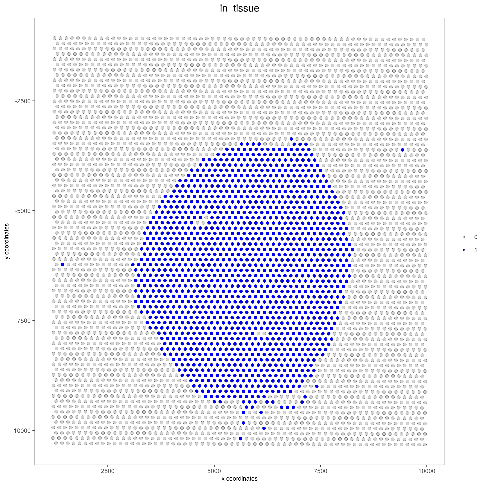{ width=50% } 

```{r, eval=FALSE}
## subset on spots that were covered by tissue
metadata = pDataDT(visium_kidney)
in_tissue_barcodes = metadata[in_tissue == 1]$cell_ID
visium_kidney = subsetGiotto(visium_kidney, cell_ids = in_tissue_barcodes)

## filter
visium_kidney <- filterGiotto(gobject = visium_kidney,
                              expression_threshold = 1,
                              gene_det_in_min_cells = 50,
                              min_det_genes_per_cell = 1000,
                              expression_values = c('raw'),
                              verbose = T)

## normalize
visium_kidney <- normalizeGiotto(gobject = visium_kidney, scalefactor = 6000, verbose = T)

## add gene & cell statistics
visium_kidney <- addStatistics(gobject = visium_kidney)

## visualize
spatPlot2D(gobject = visium_kidney, 
           save_param = list(save_name = '2_spatial_locations'))
```

{ width=50% } 

```{r, eval=FALSE}
spatPlot2D(gobject = visium_kidney, cell_color = 'nr_genes', color_as_factor = F,
           save_param = list(save_name = '2_nr_genes'))
```

{ width=50% } 


## part 3: dimension reduction

```{r, eval=FALSE}
## highly variable genes (HVG)
visium_kidney <- calculateHVG(gobject = visium_kidney,
                              save_param = list(save_name = '3_HVGplot'))
```

{ width=50% } 

```{r, eval=FALSE}
## select genes based on HVG and gene statistics, both found in gene metadata
gene_metadata = fDataDT(visium_kidney)
featgenes = gene_metadata[hvg == 'yes' & perc_cells > 4 & mean_expr_det > 0.5]$gene_ID

## run PCA on expression values (default)
visium_kidney <- runPCA(gobject = visium_kidney, genes_to_use = featgenes, scale_unit = F)
signPCA(visium_kidney, genes_to_use = featgenes, scale_unit = F,
        save_param = list(save_name = '3_screeplot'))
```

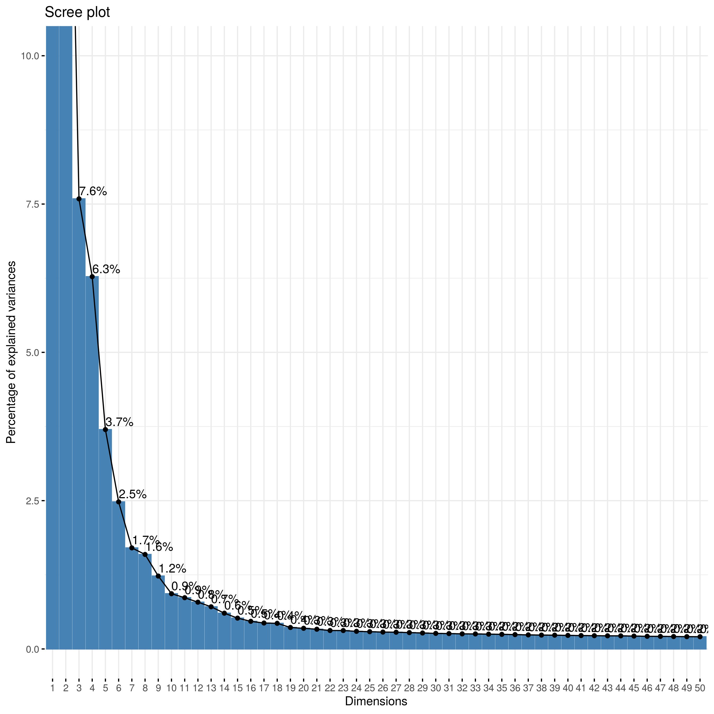{ width=50% } 

```{r, eval=FALSE}
plotPCA(gobject = visium_kidney,
        save_param = list(save_name = '3_PCA_reduction'))
```

{ width=50% } 

```{r, eval=FALSE}
## run UMAP and tSNE on PCA space (default)
visium_kidney <- runUMAP(visium_kidney, dimensions_to_use = 1:10)
plotUMAP(gobject = visium_kidney,
         save_param = list(save_name = '3_UMAP_reduction'))
```

{ width=50% } 

```{r, eval=FALSE}
visium_kidney <- runtSNE(visium_kidney, dimensions_to_use = 1:10)
plotTSNE(gobject = visium_kidney,
         save_param = list(save_name = '3_tSNE_reduction'))
```

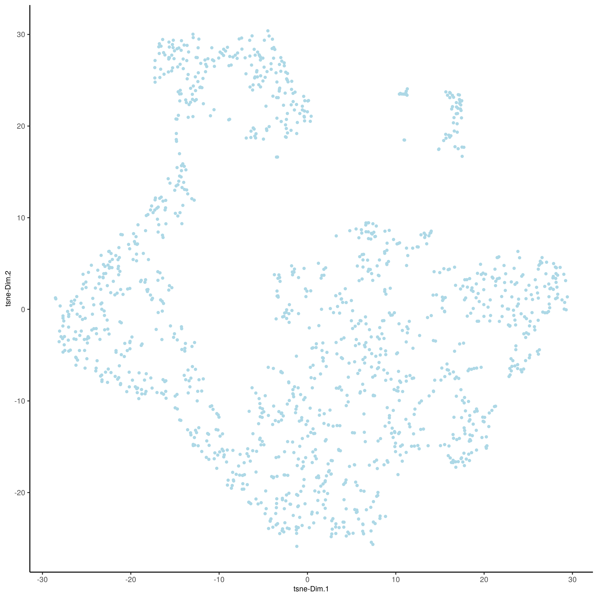{ width=50% } 


## part 4:  cluster

```{r, eval=FALSE}
## sNN network (default)
visium_kidney <- createNearestNetwork(gobject = visium_kidney, dimensions_to_use = 1:10, k = 15)
## Leiden clustering
visium_kidney <- doLeidenCluster(gobject = visium_kidney, resolution = 0.4, n_iterations = 1000)
plotUMAP(gobject = visium_kidney,
         cell_color = 'leiden_clus', show_NN_network = T, point_size = 2.5,
         save_param = list(save_name = '4_UMAP_leiden'))
```

{ width=50% } 

## part 5: co-visualize

```{r, eval=FALSE}
# expression and spatial
spatDimPlot(gobject = visium_kidney, cell_color = 'leiden_clus',
            dim_point_size = 2, spat_point_size = 2.5,
            save_param = list(save_name = '5_covis_leiden'))
```

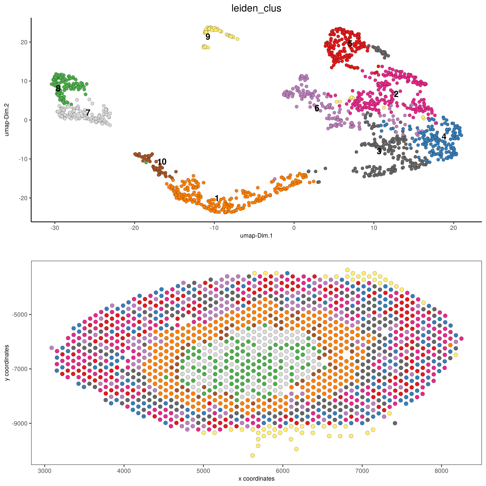{ width=50% } 

```{r, eval=FALSE}
spatDimPlot(gobject = visium_kidney, cell_color = 'nr_genes', color_as_factor = F,
            dim_point_size = 2, spat_point_size = 2.5,
            save_param = list(save_name = '5_nr_genes'))
```

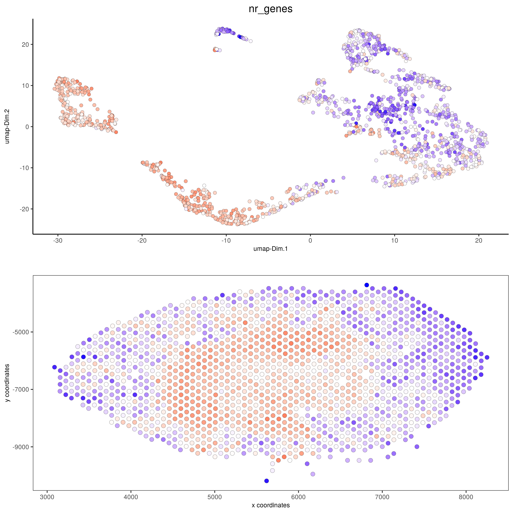{ width=50% } 


## part 6: cell type marker gene detection

#### gini
```{r, eval=FALSE}
## ---- ##
gini_markers_subclusters = findMarkers_one_vs_all(gobject = visium_kidney,
                                                  method = 'gini',
                                                  expression_values = 'normalized',
                                                  cluster_column = 'leiden_clus',
                                                  min_genes = 20,
                                                  min_expr_gini_score = 0.5,
                                                  min_det_gini_score = 0.5)
topgenes_gini = gini_markers_subclusters[, head(.SD, 2), by = 'cluster']$genes

# violinplot
violinPlot(visium_kidney, genes = unique(topgenes_gini), cluster_column = 'leiden_clus',
           strip_text = 8, strip_position = 'right',
           save_param = c(save_name = '6_violinplot_gini', base_width = 5, base_height = 10))
```

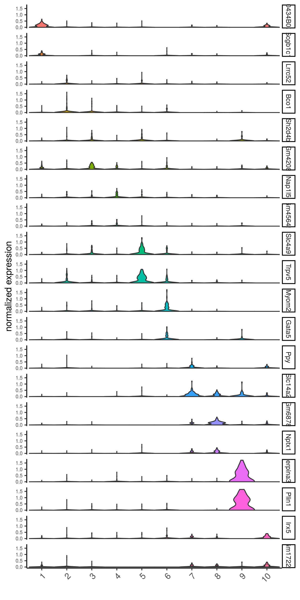{ width=50% } 

```{r, eval=FALSE}
# cluster heatmap
my_cluster_order = c(2, 4, 5, 3, 6, 7, 8, 9, 10, 1)
plotMetaDataHeatmap(visium_kidney, selected_genes = topgenes_gini, custom_cluster_order = my_cluster_order,
                    metadata_cols = c('leiden_clus'), x_text_size = 10, y_text_size = 10,
                    save_param = c(save_name = '6_metaheatmap_gini'))
```

{ width=50% } 

```{r, eval=FALSE}
# umap plots
dimGenePlot2D(visium_kidney, expression_values = 'scaled',
              genes = gini_markers_subclusters[, head(.SD, 1), by = 'cluster']$genes,
              cow_n_col = 3, point_size = 1,
              genes_high_color = 'red', genes_mid_color = 'white', genes_low_color = 'darkblue', midpoint = 0,
              save_param = c(save_name = '6_gini_umap', base_width = 8, base_height = 5))
```

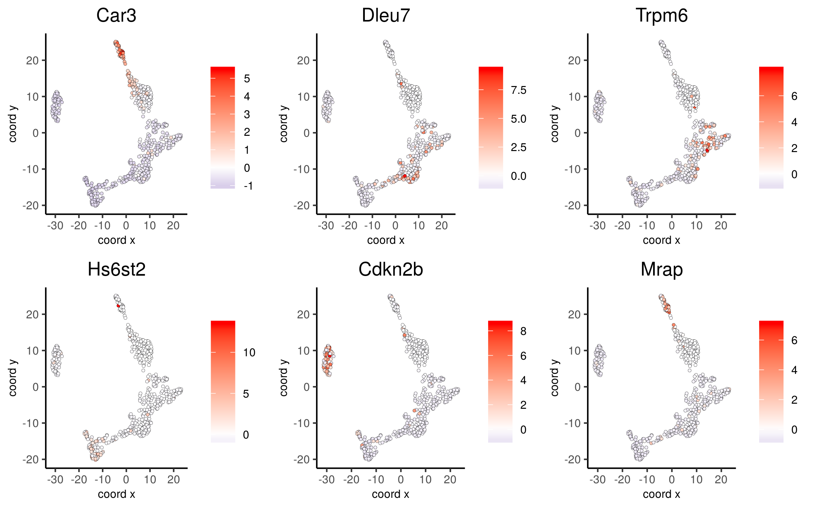{ width=50% } 


#### scran

```{r, eval=FALSE}
## ----- ##
scran_markers_subclusters = findMarkers_one_vs_all(gobject = visium_kidney,
                                                   method = 'scran',
                                                   expression_values = 'normalized',
                                                   cluster_column = 'leiden_clus')
topgenes_scran = scran_markers_subclusters[, head(.SD, 2), by = 'cluster']$genes

# violinplot
violinPlot(visium_kidney, genes = unique(topgenes_scran), cluster_column = 'leiden_clus',
           strip_text = 10, strip_position = 'right',
           save_param = c(save_name = '6_violinplot_scran', base_width = 5))
```

{ width=50% } 

```{r, eval=FALSE}
# cluster heatmap
plotMetaDataHeatmap(visium_kidney, selected_genes = topgenes_scran, custom_cluster_order = my_cluster_order,
                    metadata_cols = c('leiden_clus'),
                    save_param = c(save_name = '6_metaheatmap_scran'))
```

{ width=50% } 

```{r, eval=FALSE}
# umap plots
dimGenePlot(visium_kidney, expression_values = 'scaled',
            genes = scran_markers_subclusters[, head(.SD, 1), by = 'cluster']$genes,
            cow_n_col = 3, point_size = 1,
            genes_high_color = 'red', genes_mid_color = 'white', genes_low_color = 'darkblue', midpoint = 0,
            save_param = c(save_name = '6_scran_umap', base_width = 8, base_height = 5))
```

{ width=50% } 


## part 7: cell-type annotation

Visium spatial transcriptomics does not provide single-cell resolution, making cell type annotation a harder problem. Giotto provides 3 ways to calculate enrichment of specific cell-type signature gene list:    
- PAGE  
- rank  
- hypergeometric test

See the [mouse Visium brain dataset](./mouse_visium_brain_200325.html) for an example.


## part 8: spatial grid ####

```{r, eval=FALSE}
visium_kidney <- createSpatialGrid(gobject = visium_kidney,
                                   sdimx_stepsize = 400,
                                   sdimy_stepsize = 400,
                                   minimum_padding = 0)
spatPlot(visium_kidney, cell_color = 'leiden_clus', show_grid = T,
         grid_color = 'red', spatial_grid_name = 'spatial_grid', 
         save_param = c(save_name = '8_grid'))
```

{ width=50% } 


## part 9: spatial network ####

```{r, eval=FALSE}
## (default) delaunay network: stats + creation
plotStatDelaunayNetwork(gobject = visium_kidney, maximum_distance = 400, save_plot = F)
visium_kidney = createSpatialNetwork(gobject = visium_kidney, maximum_distance_delaunay = 400, minimum_k = 2)

spatPlot(gobject = visium_kidney, show_network = T,
         network_color = 'blue', spatial_network_name = 'delaunay_network',
         save_param = c(save_name = '9_delaunay_network'))
```

{ width=50% } 

```{r, eval=FALSE}
## kNN network
visium_kidney <- createSpatialNetwork(gobject = visium_kidney, method = 'kNN', k = 5, maximum_distance_knn = 400)
spatPlot(gobject = visium_kidney, show_network = T,
         network_color = 'blue', spatial_network_name = 'spatial_network',
         save_param = c(save_name = '9_spatial_network_k5'))
```

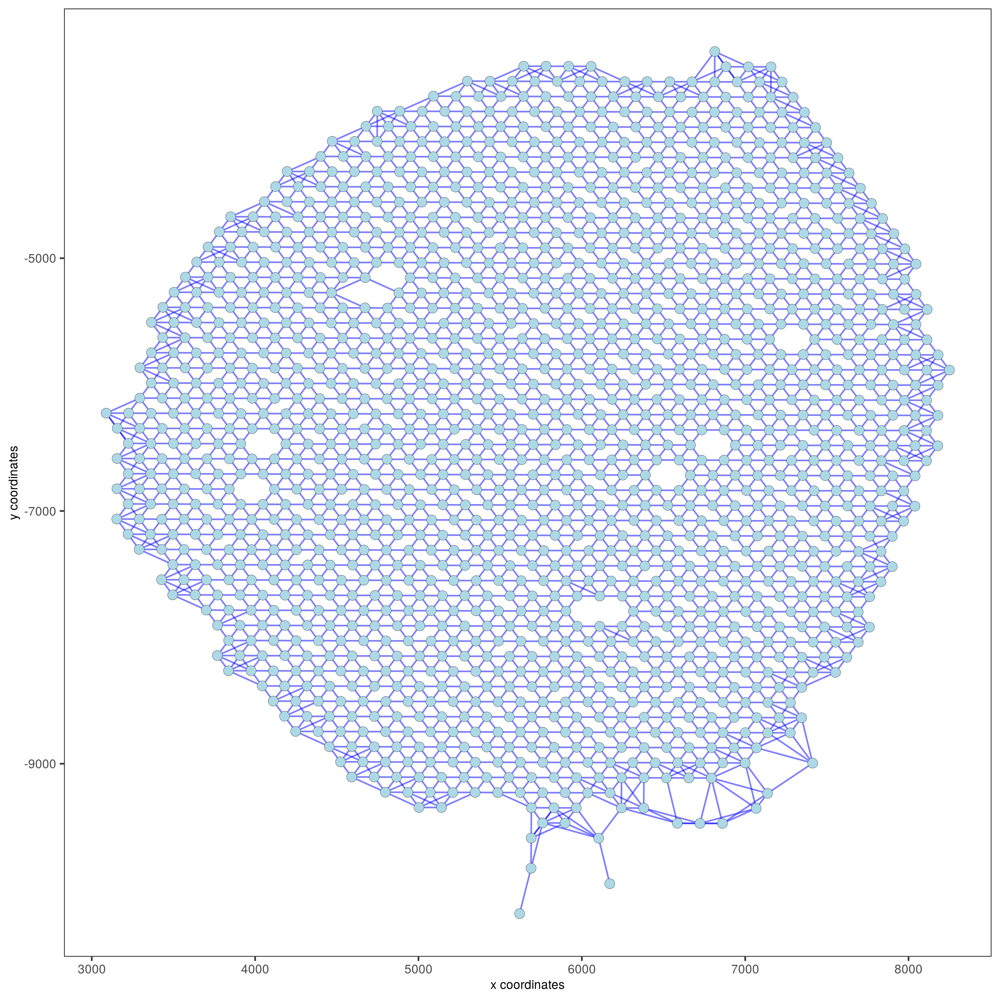{ width=50% } 


## part 10: spatial genes ####

### Spatial genes

```{r, eval=FALSE}
## kmeans binarization
kmtest = binSpect(visium_kidney, bin_method = 'kmeans',
                            do_fisher_test = T, 
                            spatial_network_name = 'delaunay_network', verbose = T)
spatGenePlot(visium_kidney, expression_values = 'scaled',
             genes = kmtest$genes[1:6], cow_n_col = 2, point_size = 1.5,
             genes_high_color = 'red', genes_mid_color = 'white', genes_low_color = 'darkblue', midpoint = 0,
             save_param = c(save_name = '10_spatial_genes_km'))
```

{ width=50% } 

```{r, eval=FALSE}
## rank binarization
ranktest = binSpect(visium_kidney, bin_method = 'rank', 
                              do_fisher_test = T, percentage_rank = 30,
                              spatial_network_name = 'delaunay_network', verbose = T)
spatGenePlot(visium_kidney, expression_values = 'scaled',
             genes = ranktest$genes[1:6], cow_n_col = 2, point_size = 1.5,
             genes_high_color = 'red', genes_mid_color = 'white', genes_low_color = 'darkblue', midpoint = 0,
             save_param = c(save_name = '10_spatial_genes_rank'))
```

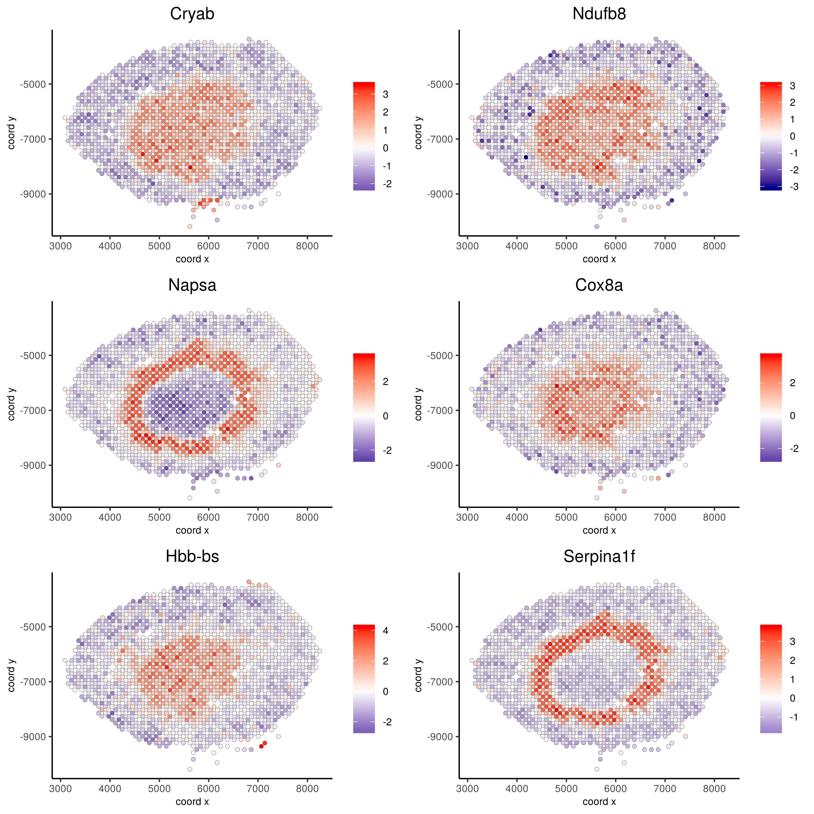{ width=50% } 

```{r, eval=FALSE}
## silhouette
spatial_genes = silhouetteRank(gobject = visium_kidney,
                               expression_values = 'scaled',
                               rbp_p=0.95, examine_top=0.3)
spatGenePlot(visium_kidney, expression_values = 'scaled',
             genes = spatial_genes$genes[1:6], cow_n_col = 2, point_size = 1.5,
             genes_high_color = 'red', genes_mid_color = 'white', genes_low_color = 'darkblue', midpoint = 0,
             save_param = c(save_name = '10_spatial_genes'))
```

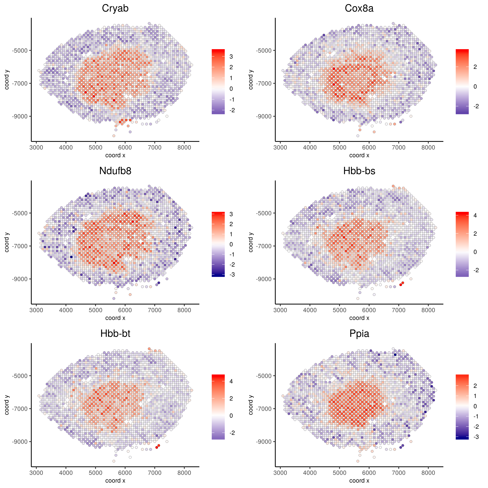{ width=50% } 


### Spatial co-expression patterns


```{r, eval=FALSE}
## spatially correlated genes ##
ext_spatial_genes = kmtest[1:500]$genes

# 1. calculate gene spatial correlation and single-cell correlation 
# create spatial correlation object
spat_cor_netw_DT = detectSpatialCorGenes(visium_kidney, 
                                         method = 'network', spatial_network_name = 'delaunay_network',
                                         subset_genes = ext_spatial_genes)


# 2. identify most similar spatially correlated genes for one gene
Napsa_top10_genes = showSpatialCorGenes(spat_cor_netw_DT, genes = 'Napsa', show_top_genes = 10)
spatGenePlot(visium_kidney, expression_values = 'scaled',
             genes = c('Napsa', 'Kap', 'Defb29', 'Prdx1'), point_size = 3,
             save_param = c(save_name = '10_Napsa_correlated_genes'))
```

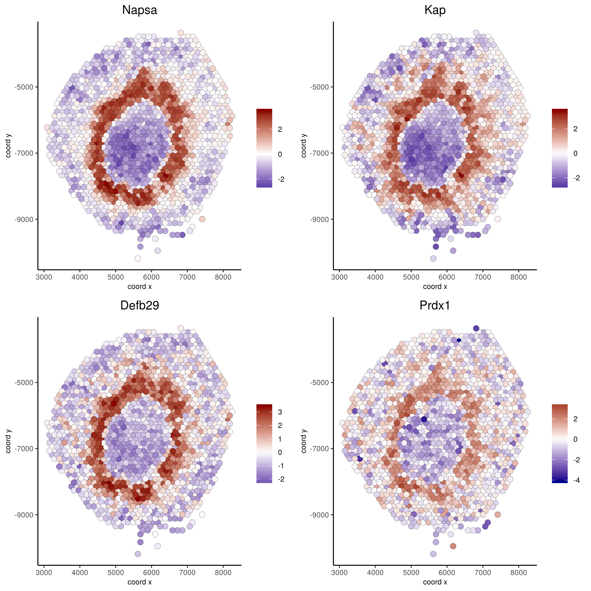{ width=50% } 

```{r, eval=FALSE}
# 3. cluster correlated genes & visualize
spat_cor_netw_DT = clusterSpatialCorGenes(spat_cor_netw_DT, name = 'spat_netw_clus', k = 8)

heatmSpatialCorGenes(visium_kidney, spatCorObject = spat_cor_netw_DT, use_clus_name = 'spat_netw_clus',
                     save_param = c(save_name = '10_heatmap_correlated_genes', save_format = 'pdf',
                                    base_height = 6, base_width = 8, units = 'cm'), 
                     heatmap_legend_param = list(title = NULL))
```

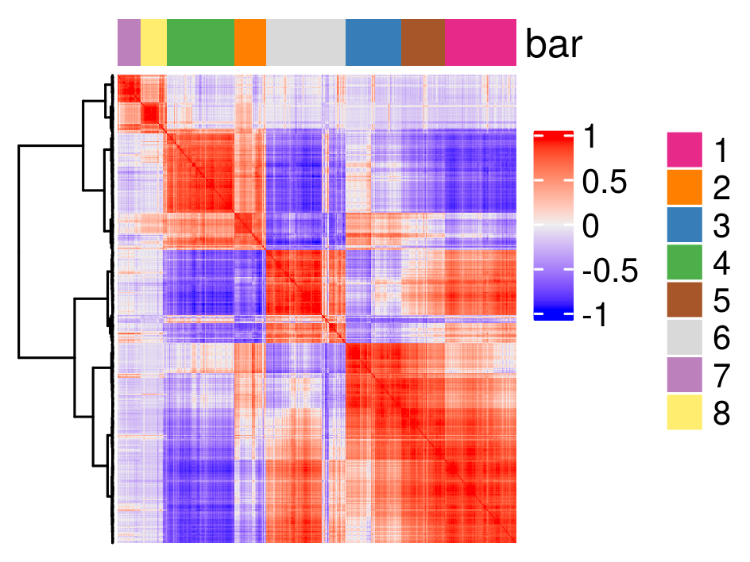{ width=50% } 

```{r, eval=FALSE}
# 4. rank spatial correlated clusters and show genes for selected clusters
netw_ranks = rankSpatialCorGroups(visium_kidney, spatCorObject = spat_cor_netw_DT, use_clus_name = 'spat_netw_clus',
                                  save_param = c(save_name = '10_rank_correlated_groups',
                                                 base_height = 3, base_width = 5))
```

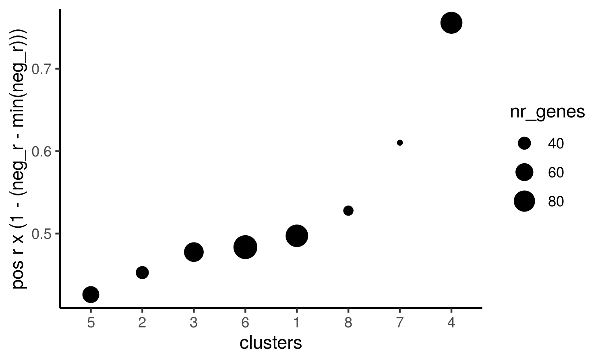{ width=50% } 

```{r, eval=FALSE}
top_netw_spat_cluster = showSpatialCorGenes(spat_cor_netw_DT, use_clus_name = 'spat_netw_clus',
                                            selected_clusters = 6, show_top_genes = 1)

# 5. create metagene enrichment score for clusters
cluster_genes_DT = showSpatialCorGenes(spat_cor_netw_DT, use_clus_name = 'spat_netw_clus', show_top_genes = 1)
cluster_genes = cluster_genes_DT$clus; names(cluster_genes) = cluster_genes_DT$gene_ID

visium_kidney = createMetagenes(visium_kidney, gene_clusters = cluster_genes, name = 'cluster_metagene')

spatCellPlot(visium_kidney,
             spat_enr_names = 'cluster_metagene',
             cell_annotation_values = netw_ranks$clusters,
             point_size = 1.5, cow_n_col = 4, 
             save_param = c(save_name = '10_spat_enrichment_score_plots',
                            base_width = 13, base_height = 6))
```

{ width=50% } 

```{r, eval=FALSE}
# example for gene per cluster
top_netw_spat_cluster = showSpatialCorGenes(spat_cor_netw_DT, use_clus_name = 'spat_netw_clus',
                                            selected_clusters = 1:8, show_top_genes = 1)
first_genes = top_netw_spat_cluster[, head(.SD, 1), by = clus]$gene_ID
cluster_names = top_netw_spat_cluster[, head(.SD, 1), by = clus]$clus
names(first_genes) = cluster_names
first_genes = first_genes[as.character(netw_ranks$clusters)]

spatGenePlot(visium_kidney, genes = first_genes, expression_values = 'scaled', cow_n_col = 4, midpoint = 0, point_size = 2,
             save_param = c(save_name = '10_spat_enrichment_score_plots_genes',
                            base_width = 11, base_height = 6))
```

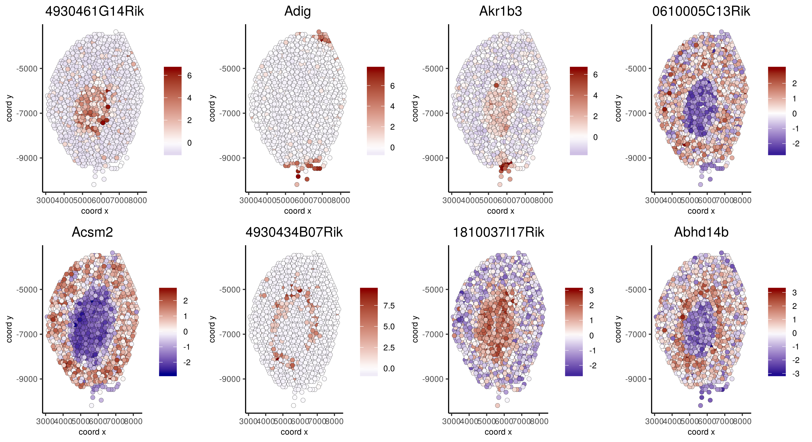{ width=50% } 


## part 11: HMRF domains


```{r, eval=FALSE}
# spatial genes
my_spatial_genes <- kmtest[1:100]$genes

# do HMRF with different betas
hmrf_folder = paste0(results_folder,'/','11_HMRF/')
if(!file.exists(hmrf_folder)) dir.create(hmrf_folder, recursive = T)

HMRF_spatial_genes = doHMRF(gobject = visium_kidney, expression_values = 'scaled', 
                            spatial_network_name = 'delaunay_network',
                            spatial_genes = my_spatial_genes,
                            k = 5,
                            betas = c(0, 1, 6), 
                            output_folder = paste0(hmrf_folder, '/', 'Spatial_genes/SG_topgenes_k5_scaled'))

## view results of HMRF
## results not displayed
for(i in seq(0, 5, by = 1)) {
  viewHMRFresults2D(gobject = visium_kidney,
                    HMRFoutput = HMRF_spatial_genes,
                    k = 5, betas_to_view = i,
                    point_size = 2)
}
```

```{r, eval=FALSE}
## alternative way to view HMRF results
#results = writeHMRFresults(gobject = ST_test,
#                           HMRFoutput = HMRF_spatial_genes,
#                           k = 5, betas_to_view = seq(0, 25, by = 5))
#ST_test = addCellMetadata(ST_test, new_metadata = results, by_column = T, column_cell_ID = 'cell_ID')

## add HMRF of interest to giotto object
visium_kidney = addHMRF(gobject = visium_kidney,
                        HMRFoutput = HMRF_spatial_genes,
                        k = 5, betas_to_add = c(0, 2),
                        hmrf_name = 'HMRF')

## visualize
spatPlot(gobject = visium_kidney, cell_color = 'HMRF_k5_b.0', point_size = 5,
         save_param = c(save_name = '11_HMRF_k5_b.0'))
```

{ width=50% } 

```{r, eval=FALSE}
spatPlot(gobject = visium_kidney, cell_color = 'HMRF_k5_b.2', point_size = 5,
         save_param = c(save_name = '11_HMRF_k5_b.2'))
```

{ width=50% } 


## Export and create Giotto Viewer 


```{r, eval=FALSE}
# check which annotations are available
combineMetadata(visium_kidney, spat_enr_names = 'PAGE')

# select annotations, reductions and expression values to view in Giotto Viewer
viewer_folder = paste0(results_folder, '/', 'mouse_visium_kidney_viewer')

exportGiottoViewer(gobject = visium_kidney,
                   output_directory = viewer_folder,
                   spat_enr_names = 'PAGE', 
                   factor_annotations = c('in_tissue',
                                          'leiden_clus',
                                          'MRF_k5_b.2'),
                   numeric_annotations = c('nr_genes',
                                           'clus_25'),
                   dim_reductions = c('tsne', 'umap'),
                   dim_reduction_names = c('tsne', 'umap'),
                   expression_values = 'scaled',
                   expression_rounding = 2,
                   overwrite_dir = T)
```


