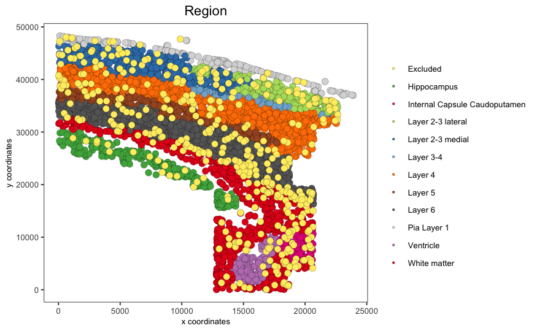
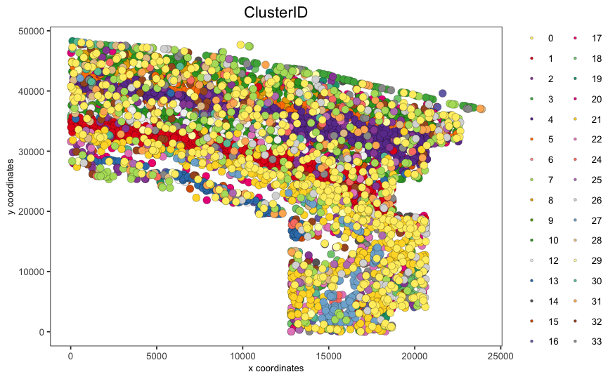
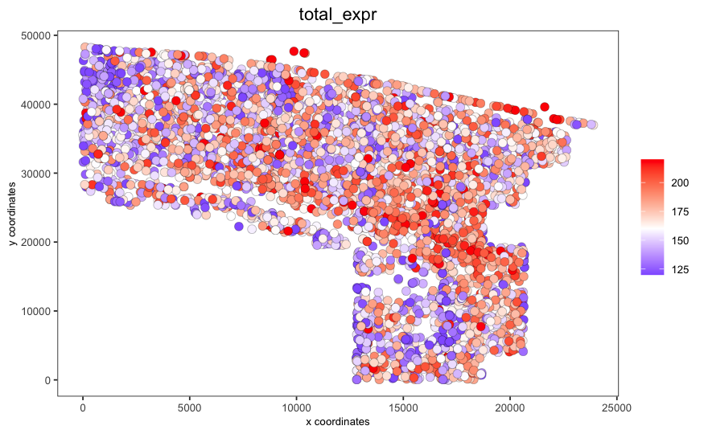
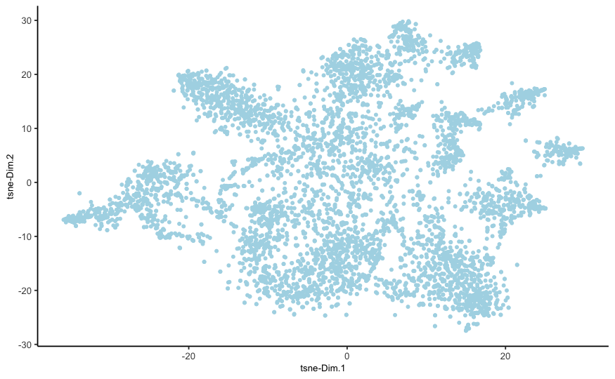
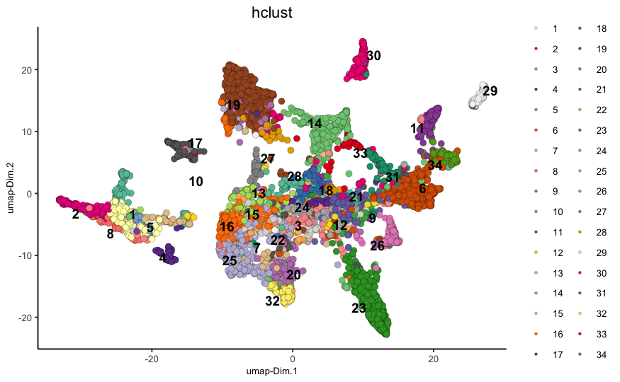
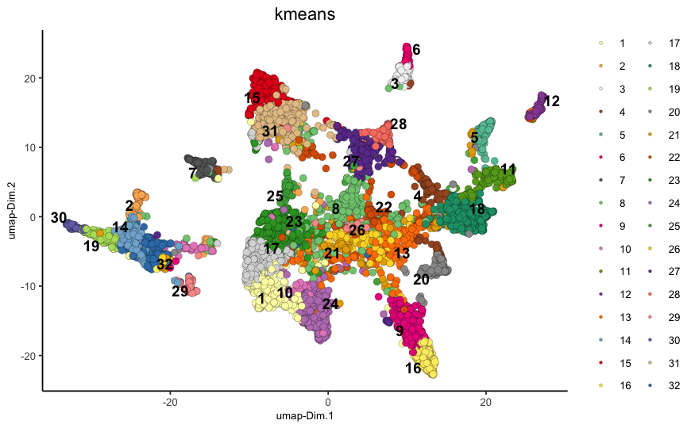
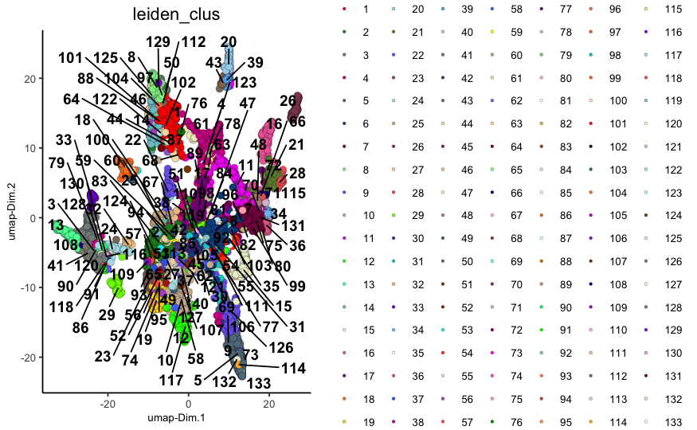
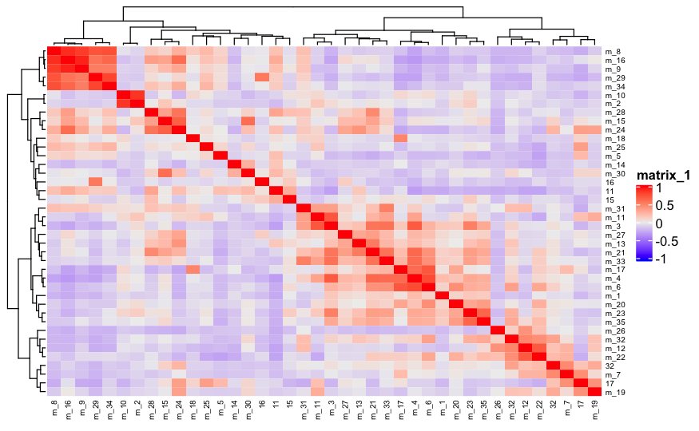
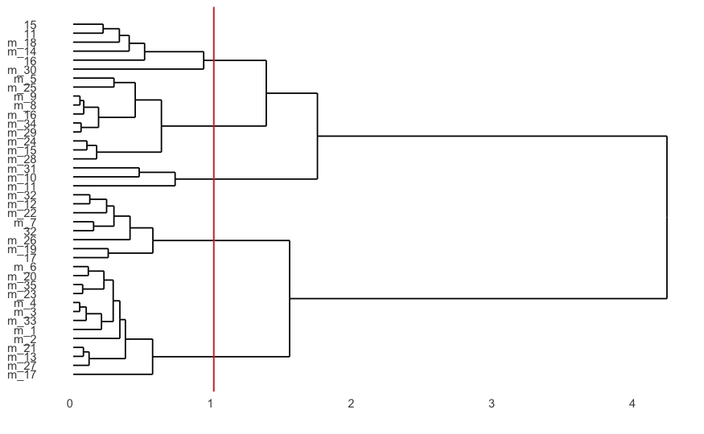

```{r, include = FALSE}
knitr::opts_chunk$set(
  collapse = TRUE,
  comment = "#>",
  fig.path = "man/figures/README-",
  out.width = "100%"
)
```

## Giotto global instructions
   
```{r eval=FALSE, message=FALSE, warning=FALSE}

## 0. Giotto global instructions ####

# this example works with Giotto v.0.3.0
library(Giotto)

## create instructions
## instructions allow you to automatically save all plots into a chosen results folder
## Here we will not automatically save plots, for an example see the seqFISH+ or Visium dataset

## instructions allow us to automatically save all plots into a chosen results folder
my_python_path = "/your/python/path/python"
results_folder = '/your/results/path/'
instrs = createGiottoInstructions(python_path = my_python_path,
                                  show_plot = T,
                                  return_plot = F,
                                  save_plot = F)

```

## Part 1: Data input

[Codeluppi et al.](https://www.nature.com/articles/s41592-018-0175-z) created a cyclic single-molecule fluorescence in situ hybridization (osmFISH) technology and define the cellular organization of the somatosensory cortex with the expression of 33 genes in 5,328 cells.

<center>

</center> 

```{r eval=FALSE}
## 1. PREPARE DATA ####

## ss cortex expression DATA ##
osm_exprs = read.table(file = paste0(data_dir,'/','count_matrix/osmFISH_prep_expression.txt'))
## prepare cell locations
osm_locs = read.table(file = paste0(data_dir,'/','cell_locations/osmFISH_prep_cell_coordinates.txt'))
osm_locs = osm_locs[rownames(osm_locs) %in% colnames(osm_exprs),]

```

## Part 2: Create & Process Giotto 

```{r eval=FALSE}
## create
osm_test <- createGiottoObject(raw_exprs = osm_exprs, spatial_locs = osm_locs, instructions = instrs)
showGiottoInstructions(osm_test)

## add field annotation
metadata = fread(file = paste0(data_dir,'/','raw_data/osmFISH_prep_cell_metadata.txt'))
osm_test = addCellMetadata(osm_test, new_metadata = metadata,
                           by_column = T, column_cell_ID = 'CellID')
## filter
osm_test <- filterGiotto(gobject = osm_test,
                         expression_threshold = 1,
                         gene_det_in_min_cells = 10,
                         min_det_genes_per_cell = 10,
                         expression_values = c('raw'),
                         verbose = T)
## normalize
# 1. standard z-score way
osm_test <- normalizeGiotto(gobject = osm_test)

# 2. osmFISH way
raw_expr_matrix = osm_test@raw_exprs
norm_genes = (raw_expr_matrix/rowSums(raw_expr_matrix)) * nrow(raw_expr_matrix)
norm_genes_cells = t((t(norm_genes)/colSums(norm_genes)) * ncol(raw_expr_matrix))
osm_test@custom_expr = norm_genes_cells

## add gene & cell statistics
osm_test <- addStatistics(gobject = osm_test)

# save according to giotto instructions
spatPlot(gobject = osm_test, cell_color = 'ClusterName', point_size = 1.5)

spatPlot(gobject = osm_test, cell_color = 'Region')

spatPlot(gobject = osm_test, cell_color = 'ClusterID')

spatPlot(gobject = osm_test, cell_color = 'total_expr', color_as_factor = F, gradient_midpoint = 160,
         gradient_limits = c(120,220))

```
<center>




</center> 

## Part 3: Dimension reduction

```{r}

## highly variable genes (HVG)
# only 33 genes so use all genes

## run PCA on expression values (default)
osm_test <- runPCA(gobject = osm_test, expression_values = 'custom', scale_unit = F)
signPCA(gobject = osm_test, expression_values = 'custom')
plotPCA(osm_test)

## run UMAP and tSNE on PCA space (default)
osm_test <- runUMAP(osm_test, dimensions_to_use = 1:31, expression_values = 'custom', n_threads = 2)
plotUMAP(gobject = osm_test)
plotUMAP(gobject = osm_test,
         cell_color = 'total_expr', color_as_factor = F, gradient_midpoint = 180, gradient_limits = c(120, 220))

osm_test <- runtSNE(osm_test, dimensions_to_use = 1:31, perplexity = 70, check_duplicates = F)
plotTSNE(gobject = osm_test)

```

<center>



</center> 

## Part 4: Cluster

```{r}

## hierarchical clustering
osm_test = doHclust(gobject = osm_test, expression_values = 'custom', k = 34)
plotUMAP(gobject = osm_test, cell_color = 'hclust', point_size = 2.5,
         show_NN_network = F, edge_alpha = 0.05)

## kmeans clustering
osm_test = doKmeans(gobject = osm_test, expression_values = 'custom', centers = 32, nstart = 500)
plotUMAP(gobject = osm_test, cell_color = 'kmeans',
         point_size = 2.5, show_NN_network = F, edge_alpha = 0.05)


## Leiden clustering strategy:
# 1. overcluster
# 2. merge small clusters that are highly similar

# sNN network (default)
osm_test <- createNearestNetwork(gobject = osm_test, dimensions_to_use = 1:31, k = 15)
osm_test <- doLeidenCluster(gobject = osm_test, resolution = 0.17, n_iterations = 1000)
plotUMAP(gobject = osm_test, cell_color = 'leiden_clus', point_size = 2.5,
         show_NN_network = F, edge_alpha = 0.05)

# merge small groups based on similarity
leiden_similarities = getClusterSimilarity(osm_test,
                                           expression_values = 'custom',
                                           cluster_column = 'leiden_clus')
osm_test = mergeClusters(osm_test, expression_values = 'custom',
                         cluster_column = 'leiden_clus',
                         new_cluster_name = 'leiden_clus_m',
                         max_group_size = 30, force_min_group_size = 25)
plotUMAP(gobject = osm_test, cell_color = 'leiden_clus_m', point_size = 2.5,
         show_NN_network = F, edge_alpha = 0.05)

## show cluster relationships
showClusterHeatmap(gobject = osm_test, expression_values = 'custom', cluster_column = 'leiden_clus_m',
                   row_names_gp = grid::gpar(fontsize = 6), column_names_gp = grid::gpar(fontsize = 6))

showClusterDendrogram(osm_test, cluster_column = 'leiden_clus_m', h = 1, rotate = T)

```


<center>






</center> 

## Part 5: Co-visualize

```{r}

# expression and spatial
spatDimPlot2D(gobject = osm_test, cell_color = 'leiden_clus_m')

spatDimPlot2D(gobject = osm_test, cell_color = 'leiden_clus_m', 
              dim_point_size = 2, spat_point_size = 2, select_cell_groups = 'm_8')

spatDimPlot2D(gobject = osm_test, cell_color = 'total_expr', color_as_factor = F,
              gradient_midpoint = 160, gradient_limits = c(120,220))

```


<center>


</center> 

## Part 6: Differential expression

```{r}

## split dendrogram nodes ##
dendsplits = getDendrogramSplits(gobject = osm_test,
                                 expression_values = 'custom',
                                 cluster_column = 'leiden_clus_m')
split_3_markers = findGiniMarkers(gobject = osm_test, expression_values = 'custom', cluster_column = 'leiden_clus_m',
                                  group_1 = unlist(dendsplits[3]$tree_1), group_2 = unlist(dendsplits[3]$tree_2))

## Individual populations ##
markers = findMarkers_one_vs_all(gobject = osm_test,
                                 method = 'scran',
                                 expression_values = 'custom',
                                 cluster_column = 'leiden_clus_m',
                                 min_genes = 2, rank_score = 2)
## violinplot
topgenes = markers[, head(.SD, 1), by = 'cluster']$genes
violinPlot(osm_test, genes = unique(topgenes), cluster_column = 'leiden_clus_m', expression_values = 'custom',
           strip_text = 5, strip_position = 'right')

## cluster heatmap
ranked_genes = c('Pdgfra','Bmp4','Itpr2', 'Tmem2', 'Plp1',
                 'Sox10', 'Anln', 'Ctps', 'Flt1', 'Apln',
                 'Foxj1', 'Gfap', 'Mfge8', 'Lamp5', 'Cnr1',
                 'Rorb', 'Hexb', 'Tbr1', 'Kcnip2', 'Aldoc',
                 'Syt6', 'Serpinf1', 'Cpne5',  'Crhbp', 'Gad2',
                 'Slc32a1', 'Vip', 'Pthlh', 'Crh', 'Acta2',
                 'Mrc1', 'Vtn', 'Ttr')


plotMetaDataHeatmap(osm_test, expression_values = 'custom',
                    metadata_cols = c('leiden_clus_m'), custom_gene_order = ranked_genes)

```


```{r}

## 7. cell type annotation ####
# --------------------------- #
## create vector with names


## compare clusters with osmFISH paper
clusters_det_SS_cortex = c('OPC', 'Olig_COP', 'Olig_NF', 'Olig_mature', 'Olig_mature',
                           'Olig_mature','Olig_MF', 'Olig_MF', 'Endothelial_Flt1', 'Endothelial_Apln',
                           'Ependymal', 'Astrocyte_Gfap', 'Astrocyte_Mfge8', 'Pyr_L2_3_L5','Pyr_L2_3_L5',
                           'Pyr_L2_3_L5', 'Pyr_L3_4', 'Microglia', 'Pyr_L5', 'Hippocampus',
                           'Pyr_L6',  'Pyr_L6', 'Pyr_L2_3', 'Pyr_L2_3', 'Pyr_L2_3',
                           'Inh_Crhbp', 'Inh_Cnr1', 'Inh_CP', 'Inh_CP', 'Inh_Vip',
                           'Inh_Pthlh', 'Inh_Crh', 'Inh_Crh', 'vSMC', 'vSMC',
                           'unknown', 'PVM', 'unknown', 'Pericytes', 'Choroid_Plexus')

names(clusters_det_SS_cortex) = c('m_18', 'm_5', 'm_25', 'm_8', 'm_16',
                                  'm_9', 'm_29', 'm_34', 'm_14', 'm_30',
                                  '16', '11', '15', 'm_17', 'm_4',
                                  'm_6', 'm_1', 'm_20', 'm_23', 'm_35',
                                  'm_10', 'm_2', 'm_31', 'm_11', 'm_3', 
                                  'm_26', 'm_32', 'm_12', 'm_22', '32',
                                  'm_7', '17', 'm_19', 'm_28', 'm_15',
                                  'm_24', 'm_21', 'm_33', 'm_13', 'm_27')
osm_test = annotateGiotto(gobject = osm_test, annotation_vector = clusters_det_SS_cortex,
                          cluster_column = 'leiden_clus_m', name = 'det_cell_types')

spatDimPlot2D(gobject = osm_test, cell_color = 'det_cell_types',dim_point_size = 2, spat_point_size = 2,
              save_param = c(save_name = '7_annotation_leiden_merged_detailed'))


## coarse cell types
clusters_coarse_SS_cortex = c('OPC', 'Olig', 'Olig', 'Olig', 'Olig',
                              'Olig', 'Olig', 'Olig', 'Endothelial', 'Endothelial',
                              'Ependymal', 'Astrocyte', 'Astrocyte', 'Pyr', 'Pyr',
                              'Pyr', 'Pyr', 'Microglia', 'Pyr', 'Hippocampus',
                              'Pyr', 'Pyr', 'Pyr', 'Pyr', 'Pyr',
                              'Inh', 'Inh', 'Inh', 'Inh', 'Inh',
                              'Inh', 'Inh', 'Inh', 'vSMC', 'vSMC',
                              'unknown', 'PVM', 'unknown', 'Pericytes', 'Choroid_Plexus')

names(clusters_coarse_SS_cortex) = c('OPC', 'Olig_COP', 'Olig_NF', 'Olig_mature', 'Olig_mature',
                                     'Olig_mature','Olig_MF', 'Olig_MF', 'Endothelial_Flt1', 'Endothelial_Apln',
                                     'Ependymal', 'Astrocyte_Gfap', 'Astrocyte_Mfge8', 'Pyr_L2_3_L5','Pyr_L2_3_L5',
                                     'Pyr_L2_3_L5', 'Pyr_L3_4', 'Microglia', 'Pyr_L5', 'Hippocampus',
                                     'Pyr_L6',  'Pyr_L6', 'Pyr_L2_3', 'Pyr_L2_3', 'Pyr_L2_3',
                                     'Inh_Crhbp', 'Inh_Cnr1', 'Inh_CP', 'Inh_CP', 'Inh_Vip',
                                     'Inh_Pthlh', 'Inh_Crh', 'Inh_Crh', 'vSMC', 'vSMC',
                                     'unknown', 'PVM', 'unknown', 'Pericytes', 'Choroid_Plexus')

osm_test = annotateGiotto(gobject = osm_test, annotation_vector = clusters_coarse_SS_cortex,
                          cluster_column = 'det_cell_types', name = 'coarse_cell_types')
spatDimPlot2D(gobject = osm_test, cell_color = 'coarse_cell_types',dim_point_size = 2, spat_point_size = 2,
              save_param = c(save_name = '7_annotation_leiden_merged_coarse'))

# heatmaps #
showClusterHeatmap(gobject = osm_test, cluster_column = 'det_cell_types',
                   save_param = c(save_name = '7_clusterHeatmap_det_cell_types', units = 'in'))

plotHeatmap(osm_test, genes = osm_test@gene_ID, cluster_column = 'det_cell_types',
            legend_nrows = 2, expression_values = 'custom',
            gene_order = 'correlation', cluster_order = 'correlation',
            save_param = c(save_name = '7_heatamp_det_cell_types'))


plotMetaDataHeatmap(osm_test, expression_values = 'custom',
                    metadata_cols = c('det_cell_types'), 
                    save_param = c(save_name = '7_metaheatmap'))

mynames = unique(pDataDT(osm_test)$det_cell_types)
mycolorcode = Giotto:::getDistinctColors(n = length(mynames))
names(mycolorcode) = mynames


plotUMAP(gobject = osm_test, cell_color = 'det_cell_types',point_shape = 'no_border',   point_size = 0.2,
         show_plot = F,
         cell_color_code = mycolorcode,
         show_center_label = F,
         label_size =2,
         legend_text = 5,
         legend_symbol_size = 2,
         save_param = list(save_name = '3_UMAP_cell_type_annotation'),)

spatPlot(gobject = osm_test, cell_color = 'det_cell_types', point_shape = 'no_border', point_size = 0.2, 
        #cell_color_code = leiden_colors, 
        cell_color_code = mycolorcode,
        show_legend = F,
        coord_fix_ratio = 0.5,
         show_plot = F,
         label_size =2,
         legend_text = 5,
         legend_symbol_size = 2,
        save_param = list(save_name = '4_spatplot_leiden'))

spatDimGenePlot2D(osm_test, expression_values = 'normalized',
                  genes = c('Rorb', 'Syt6', 'Gfap', 'Kcnip2'),
                  dim_point_size = 0.2,
                  spat_point_size = 0.2,
                  plot_alignment = 'vertical', cow_n_col = 4,
                  spat_point_shape = 'no_border',
                  dim_point_shape = 'no_border',
                  genes_high_color = 'red', genes_mid_color = 'white', genes_low_color = 'darkblue', midpoint = 4,
                  save_param = c(save_name = '10_spatial_genes_norm', base_width = 16))

# spatDimGenePlot2D(osm_test, expression_values = 'scaled',
#                   genes = c('Rorb', 'Syt6', 'Gfap', 'Kcnip2'),
#                   plot_alignment = 'vertical', cow_n_col = 4,
#                   genes_high_color = 'red', genes_mid_color = 'white', genes_low_color = 'darkblue', midpoint = 0,
#                   save_param = c(save_name = '10_spatial_genes_scaled', base_width = 16))


#library(mclust)
#metadata = pDataDT(osm_test)
#mclust::adjustedRandIndex(x = metadata$ClusterName, y = metadata$det_cell_types)

```
```{r}
# 
# osm_test_subset1 = subsetGiotto(osm_test, cell_ids =
# #codex_test@cell_metadata$cell_ID[codex_test@cell_metadata$sample_Xtile_Ytile=="BALBc-3_X04_Y08"])
# osm_test@cell_metadata$cell_ID[osm_test@spatial_locs$sdimx>=0 & osm_test@spatial_locs$sdimx<=5000 & osm_test@spatial_locs$sdimy>=3000 & osm_test@spatial_locs$sdimy<=5000])
# 

osm_test_subset1 = subsetGiottoLocs(osm_test,
                             x_max = 22000, x_min = 13000,
                             y_max = 15000, y_min = 0)

plotUMAP(gobject = osm_test_subset1, cell_color = 'det_cell_types',point_shape = 'no_border',   point_size = 1,
         show_plot = F,
         cell_color_code = mycolorcode,
         show_center_label = F,
         label_size =2,
         legend_text = 5,
         legend_symbol_size = 2,
         save_param = list(save_name = '3_UMAP_cell_type_annotation'),)

spatPlot(gobject = osm_test_subset1, cell_color = 'det_cell_types', point_shape = 'no_border', point_size = 1, 
        #cell_color_code = leiden_colors, 
        cell_color_code = mycolorcode,
       coord_fix_ratio = 0.5,
       show_legend = F,
         show_plot = F,
         label_size =2,
         legend_text = 5,
         legend_symbol_size = 2,
        save_param = list(save_name = '4_spatplot_leiden'))

# CD8a, CD4, CD19, CD106
gene_to_use = "CD4"
spatDimGenePlot(osm_test_subset1, 
                expression_values = 'scaled',
                  #genes = c('Slc17a7', 'Nov', 'Cux2', 'Rorb'),
                  genes = gene_to_use,
                  spat_point_shape = 'no_border',
                  dim_point_shape = 'no_border',
                  # plot_alignment = 'vertical', 
                  #cow_n_col = 4,
                  genes_high_color = 'red', genes_mid_color = 'white', genes_low_color = 'darkblue', 
                  #midpoint = 4,
                  save_param = c(save_name = 'spatial_genes_norm', save_folder = '10_spatial_genes', base_width = 16))

```

