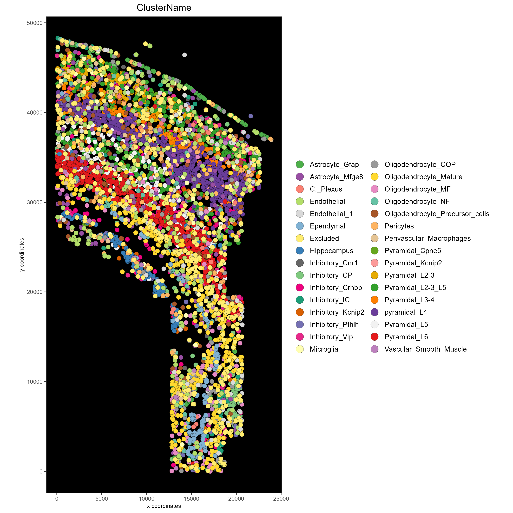

# 1. Explanation

This tutorial walks through saving spatial data in plots. *Please see the* [Configuration](./configuration_04122023.html) *and* [Giotto Object](./getting_started_gobject.html) *vignettes before walking through this tutorial.*

R/Posit and Giotto provide different ways to save spatial data. Here, a **giottoObject** will be created without using **giottoInstructions** so that the save parameters for plotting functions within Giotto as well as the default saving methods built into R/Posit may be emphasized here. Note that for plotting functions, all parameters available to the *save_param* argument may be found by running **showSaveParameters()**.

# 2. Start Giotto

```{r, eval=FALSE}
# Ensure Giotto Suite is installed
if(!"Giotto" %in% installed.packages()) {
  devtools::install_github("drieslab/Giotto@suite")
}

library(Giotto)

# Ensure Giotto Data is installed
if(!"GiottoData" %in% installed.packages()) {
  devtools::install_github("drieslab/GiottoData")
}

library(GiottoData)

# Ensure the Python environment for Giotto has been installed
genv_exists = checkGiottoEnvironment()
if(!genv_exists){
  # The following command need only be run once to install the Giotto environment
  installGiottoEnvironment()
}
```


# 3. Create a Giotto object

Since the focus of this vignette is saving methods, the **giottoObject** will not be created with **giottoInstructions**. See [Giotto Object](./getting_started_gobject.html) for further intuition on working with a **giottoObject** that has been provided instructions.


```{r, eval=FALSE}
data_directory = paste0(getwd(),'/')

# Download dataset 
getSpatialDataset(dataset = 'osmfish_SS_cortex', 
                  directory = data_directory, method = 'wget')

# Specify path to files
osm_exprs = paste0(data_directory, "osmFISH_prep_expression.txt")
osm_locs = paste0(data_directory, "osmFISH_prep_cell_coordinates.txt")
meta_path = paste0(data_directory, "osmFISH_prep_cell_metadata.txt")

## CREATE GIOTTO OBJECT with expression data and location data
my_gobject = createGiottoObject(expression = osm_exprs,
                                spatial_locs = osm_locs)

metadata = data.table::fread(file = meta_path)
my_gobject = addCellMetadata(my_gobject, 
                             new_metadata = metadata,
                             by_column = T, 
                             column_cell_ID = 'CellID')
```


# 4. Standard R Save Methods

Note that by default, plotting functions will return a plot object that may be saved or further manipulated. Manually save plot as a PDF in the current working directory:


```{r, eval=FALSE}
save_path = paste0(getwd(),'/first_plot.pdf')
library(ggplot2)

# This function serves only to ensure the following lines run consecutively.
save_pdf_plot = function(){ 
  pdf(file = save_path, width = 7, height = 7)
  pl = spatPlot(my_gobject)
  dev.off()
}

save_pdf_plot()

### Plot clusters, edit plot object, then save using the ggplot add-on, cowplot:
mypl = spatPlot(gobject = my_gobject, 
                cell_color = 'ClusterName')
```


```{r, eval=FALSE}
# Add a black background
mypl = mypl + theme(panel.background = element_rect(fill ='black'),
                    panel.grid = element_blank())

# Add a legend
mypl = mypl + guides(fill = guide_legend(override.aes = list(size=5)))

# Save in the current working directory
cowplot::save_plot(plot = mypl,
                   filename = 'clusters_black.png', 
                   path = getwd(),
                   device = png(),
                   dpi = 300, 
                   base_height = 10, 
                   base_width = 10)

```




# 5. Save Plot Directly to the Default Folder

The default save folder is the current working directory. This will be the case if instructions are not provided, or if a *save_dir* is not specified within **giottoInstructions**. See the [createGiottoInstructions documentation](http://giottosuite.com/reference/createGiottoInstructions.html) and [Giotto Object](./getting_started_gobject.html) for default
arguments and more details.


```{r, eval=FALSE}
spatPlot(my_gobject, 
         cell_color = 'ClusterName', 
         save_plot = TRUE)
```


# 6. Save plot Directly, but Overwrite Default Save Parameters

In this example, assume it is desired that the plot is: - Shown in the console - Not returned as an object from the plotting function call -Saved in a subdirectory of the current working directory as a .png file with a dpi of 200, height of 9 inches, and width of 9 inches. - Saved with the file name "my_name"

See [Giotto Object](./getting_started_gobject.html) for more details.

Run the command **showSaveParameters()** to see all available parameters.


```{r, eval=FALSE}
# Specify new subdirectory name
results_directory =  'my_subfolder/'

# Plot clusters, create, and save to a new subdirectory with specifications above.
spatPlot(my_gobject, 
         cell_color = 'ClusterName', 
         save_plot = TRUE,
         return_plot = FALSE,
         save_param = list(save_folder = results_directory, # Create subdirectory
                           save_name = 'my_name', 
                           save_format = 'png', 
                           units = 'in',
                           base_height = 9,
                           base_width = 9))
```


# 7. Just View the Plot

See [Giotto Object](./getting_started_gobject.html) for more details.

Set both *save_plot* and *return_plot* to FALSE.


```{r, eval=FALSE}
# Plot without saving
spatPlot(my_gobject, 
         cell_color = 'ClusterName', 
         save_plot = FALSE, return_plot = FALSE, show_plot = T)
```


# 8. Just save the plot (FASTEST for large datasets!)

See [Giotto Object](./getting_started_gobject.html) for more details.

Set show_plot and return_plot to FALSE, set save_plot to TRUE.


```{r, eval=FALSE}
spatPlot(my_gobject, 
         cell_color = 'ClusterName', 
         save_plot = TRUE, 
         return_plot = FALSE, 
         show_plot = FALSE,
         save_param = list(save_name = 'only_save'))
```


# 9. Session Info


```{r, eval=FALSE}
sessionInfo()
```

```{r, eval=FALSE}
R version 4.2.2 (2022-10-31 ucrt)
Platform: x86_64-w64-mingw32/x64 (64-bit)
Running under: Windows 10 x64 (build 22621)

Matrix products: default

locale:
[1] LC_COLLATE=English_United States.utf8 
[2] LC_CTYPE=English_United States.utf8   
[3] LC_MONETARY=English_United States.utf8
[4] LC_NUMERIC=C                          
[5] LC_TIME=English_United States.utf8    

attached base packages:
[1] stats     graphics  grDevices utils     datasets  methods   base     

other attached packages:
[1] ggplot2_3.4.1    GiottoData_0.2.1 Giotto_3.2.1    

loaded via a namespace (and not attached):
[1] Rcpp_1.0.10        RColorBrewer_1.1-3 pillar_1.9.0       compiler_4.2.2    
[5] tools_4.2.2        digest_0.6.30      jsonlite_1.8.3     evaluate_0.20     
[9] lifecycle_1.0.3    tibble_3.2.1       gtable_0.3.3       lattice_0.20-45   
[13] png_0.1-7          pkgconfig_2.0.3    rlang_1.1.0        Matrix_1.5-1      
[17] cli_3.4.1          rstudioapi_0.14    parallel_4.2.2     yaml_2.3.7        
[21] xfun_0.38          fastmap_1.1.0      terra_1.7-18       withr_2.5.0       
[25] dplyr_1.1.1        knitr_1.42         systemfonts_1.0.4  rappdirs_0.3.3    
[29] generics_0.1.3     vctrs_0.6.1        cowplot_1.1.1      grid_4.2.2        
[33] tidyselect_1.2.0   reticulate_1.26    glue_1.6.2         data.table_1.14.6 
[37] R6_2.5.1           textshaping_0.3.6  fansi_1.0.4        rmarkdown_2.21    
[41] farver_2.1.1       magrittr_2.0.3     scales_1.2.1       codetools_0.2-18  
[45] htmltools_0.5.4    colorspace_2.1-0   ragg_1.2.4         labeling_0.4.2    
[49] utf8_1.2.3         munsell_0.5.0     

```
