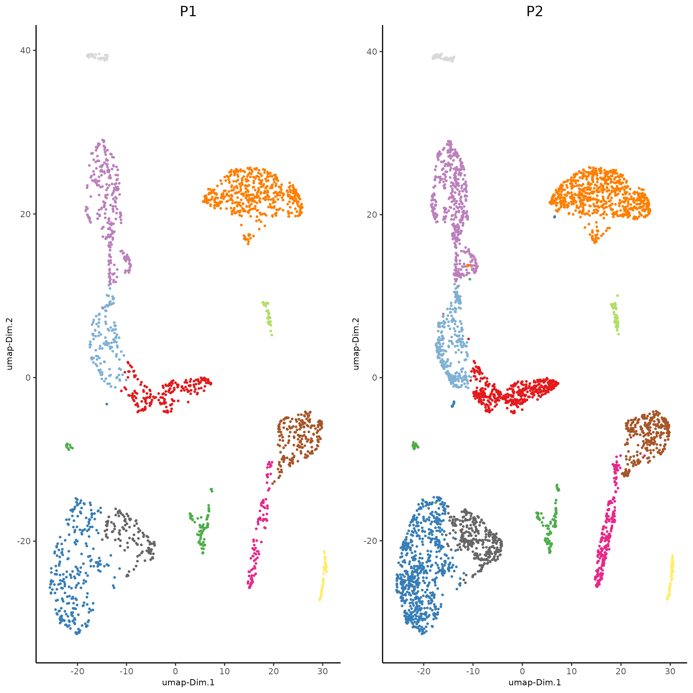

``` {r, eval=FALSE}
# Ensure Giotto Suite is installed.
if(!"Giotto" %in% installed.packages()) {
  devtools::install_github("drieslab/Giotto@suite")
}

# Ensure GiottoData, a small, helper module for tutorials, is installed.
if(!"GiottoData" %in% installed.packages()) {
  devtools::install_github("drieslab/GiottoData")
}
library(Giotto)
# Ensure the Python environment for Giotto has been installed.
genv_exists = checkGiottoEnvironment()
if(!genv_exists){
  # The following command need only be run once to install the Giotto environment.
  installGiottoEnvironment()
}
```


# Set up Giotto Environment


``` {r, eval=FALSE}
library(Giotto)
library(GiottoData)

# 1. set working directory
results_folder = 'path/to/result'

# Optional: Specify a path to a Python executable within a conda or miniconda 
# environment. If set to NULL (default), the Python executable within the previously
# installed Giotto environment will be used.
my_python_path = NULL # alternatively, "/local/python/path/python" if desired.

# 2. create giotto instructions
instrs = createGiottoInstructions(save_dir = results_folder,
                                  save_plot = TRUE,
                                  show_plot = FALSE,
                                  python_path = my_python_path)
```


# Dataset explanation

This is a tutorial for Harmony integration of different single cell
RNAseq datasets using two prostate cancer patient datasets. [Ma et
al.](https:/pubmed.ncbi.nlm.nih.gov/33032611/) Processed 10X Single
Cell RNAseq from two prostate cancer patients. The raw dataset can be
found
[here](https:/www.ncbi.nlm.nih.gov/geo/query/acc.cgi?acc=GSE157703)

# Part 1: Create Giotto object from 10X dataset and join


``` {r, eval=FALSE}
giotto_P1<-createGiottoObject(expression = get10Xmatrix("path/to/P1_result/outs/filtered_feature_bc_matrix", 
    gene_column_index = 2,
    remove_zero_rows = TRUE),
    instructions = instrs) 

giotto_P2<-createGiottoObject(expression = get10Xmatrix("path/to/P2_result/outs/filtered_feature_bc_matrix", 
    gene_column_index = 2,
    remove_zero_rows = TRUE),
    instructions = instrs) 

giotto_SC_join = joinGiottoObjects(gobject_list = list(giotto_P1, giotto_P2),
                                   gobject_names = c('P1', 'P2'),
                                   join_method = "z_stack")
```


# Part 2: Process Joined object


``` {r, eval=FALSE}
giotto_SC_join <- filterGiotto(gobject = giotto_SC_join,
                               expression_threshold = 1,
                               feat_det_in_min_cells = 50,
                               min_det_feats_per_cell = 500,
                               expression_values = c('raw'),
                               verbose = T)

## normalize
giotto_SC_join <- normalizeGiotto(gobject = giotto_SC_join,
                                  scalefactor = 6000)

## add gene & cell statistics
giotto_SC_join <- addStatistics(gobject = giotto_SC_join,
                                expression_values = 'raw')
```


# Part 3: Dimension reduction and clustering


``` {r, eval=FALSE}
## PCA ##
giotto_SC_join <- calculateHVF(gobject = giotto_SC_join)
giotto_SC_join <- runPCA(gobject = giotto_SC_join,
                         center = TRUE,
                         scale_unit = TRUE)
# Check screeplot to select number of PCs for clustering
# screePlot(giotto_SC_join, ncp = 30, save_param = list(save_name = '3_scree_plot'))

## WITHOUT INTEGRATION ##
# --------------------- #

## cluster and run UMAP ##
# sNN network (default)
showGiottoDimRed(giotto_SC_join)
giotto_SC_join <- createNearestNetwork(gobject = giotto_SC_join,
                                       dim_reduction_to_use = 'pca',
                                       dim_reduction_name = 'pca',
                                       dimensions_to_use = 1:10,
                                       k = 15)

# Leiden clustering
giotto_SC_join <- doLeidenCluster(gobject = giotto_SC_join,
                                  resolution = 0.2,
                                  n_iterations = 1000)

# UMAP
giotto_SC_join = runUMAP(giotto_SC_join)

plotUMAP(gobject = giotto_SC_join,
         cell_color = 'leiden_clus',
         show_NN_network = T,
         point_size = 1.5,
         save_param = list(save_name = "4_cluster_without_integration"))
```


{width="50.0%"}


``` {r, eval=FALSE}
dimPlot2D(gobject = giotto_SC_join,
          dim_reduction_name = 'umap',
          point_shape = 'no_border',
          cell_color = "leiden_clus",
          group_by = "list_ID",
          show_NN_network = F,
          point_size = 0.5, 
          show_center_label = F,
          show_legend =F,
          save_param = list(save_name = "4_list_without_integration"))
```


{width="50.0%"}

Harmony is a integration algorithm developed by [Korsunsky, I. et
al.](https:/www.nature.com/articles/s41592-019-0619-0). It was designed
for integration of single cell data but also work well on spatial
datasets.


``` {r, eval=FALSE}
## WITH INTEGRATION ##
# --------------------- #

## data integration, cluster and run UMAP ##

# harmony
#library(devtools)
#install_github("immunogenomics/harmony")
library(harmony)

#pDataDT(giotto_SC_join)
giotto_SC_join = runGiottoHarmony(giotto_SC_join,
                                  vars_use = 'list_ID',
                                  do_pca = F)


## sNN network (default)
#showGiottoDimRed(giotto_SC_join)
giotto_SC_join <- createNearestNetwork(gobject = giotto_SC_join,
                                       dim_reduction_to_use = 'harmony',
                                       dim_reduction_name = 'harmony',
                                       name = 'NN.harmony',
                                       dimensions_to_use = 1:10,
                                       k = 15)

## Leiden clustering
giotto_SC_join <- doLeidenCluster(gobject = giotto_SC_join,
                                  network_name = 'NN.harmony',
                                  resolution = 0.2,
                                  n_iterations = 1000,
                                  name = 'leiden_harmony')

# UMAP dimension reduction
#showGiottoDimRed(giotto_SC_join)
giotto_SC_join = runUMAP(giotto_SC_join,
                         dim_reduction_name = 'harmony',
                         dim_reduction_to_use = 'harmony',
                         name = 'umap_harmony')

plotUMAP(gobject = giotto_SC_join,
         dim_reduction_name = 'umap_harmony',
         cell_color = 'leiden_harmony',
         show_NN_network = T,
         point_size = 1.5,
         save_param = list(save_name = "4_cluster_with_integration"))
```


{width="50.0%"}


``` {r, eval=FALSE}
dimPlot2D(gobject = giotto_SC_join,
          dim_reduction_name = 'umap_harmony',
          point_shape = 'no_border',
          cell_color = "leiden_harmony",
          group_by = "list_ID",
          show_NN_network = F,
          point_size = 0.5, 
          show_center_label = F,
          show_legend =F ,
          save_param = list(save_name = "4_list_with_integration"))
```


{width="50.0%"}
