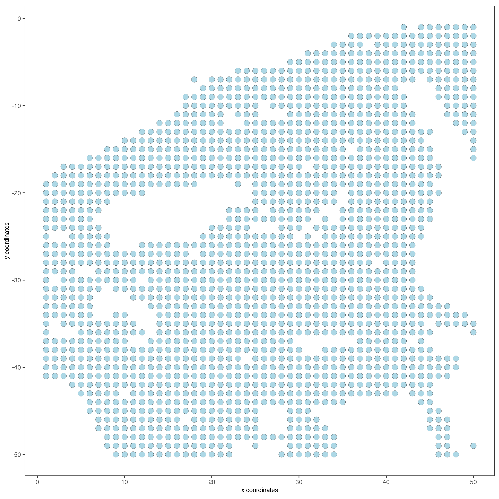
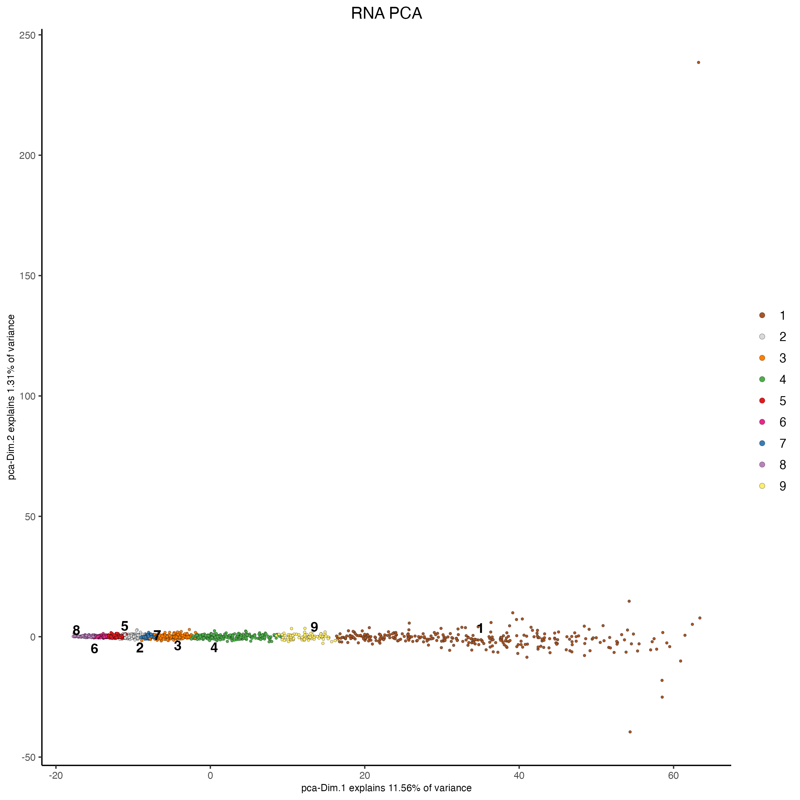
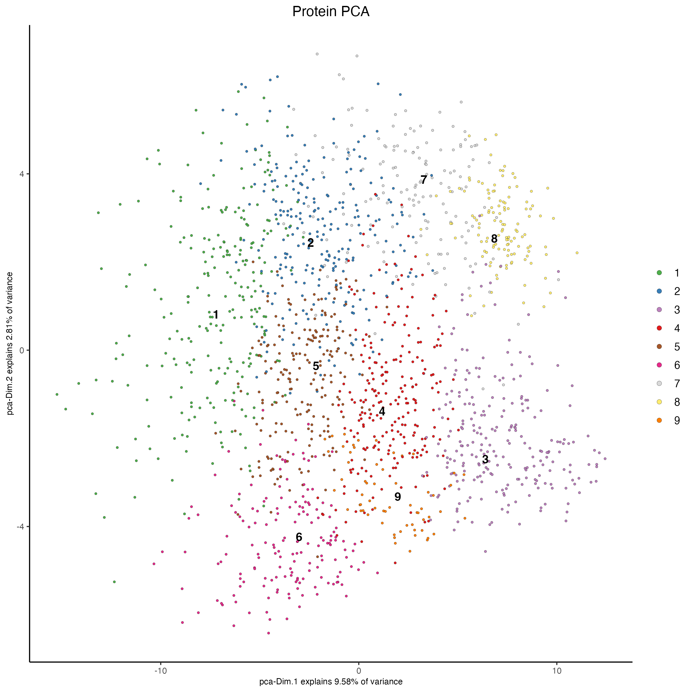
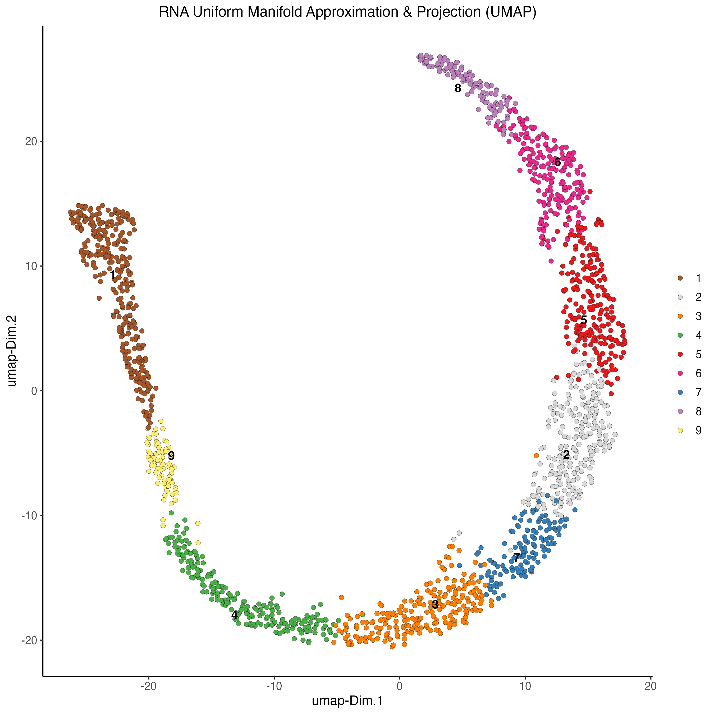
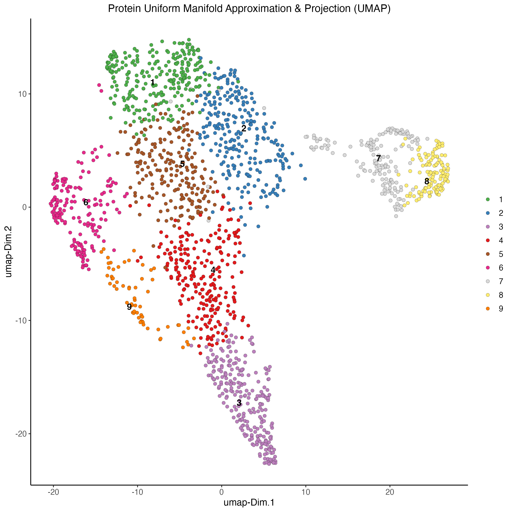
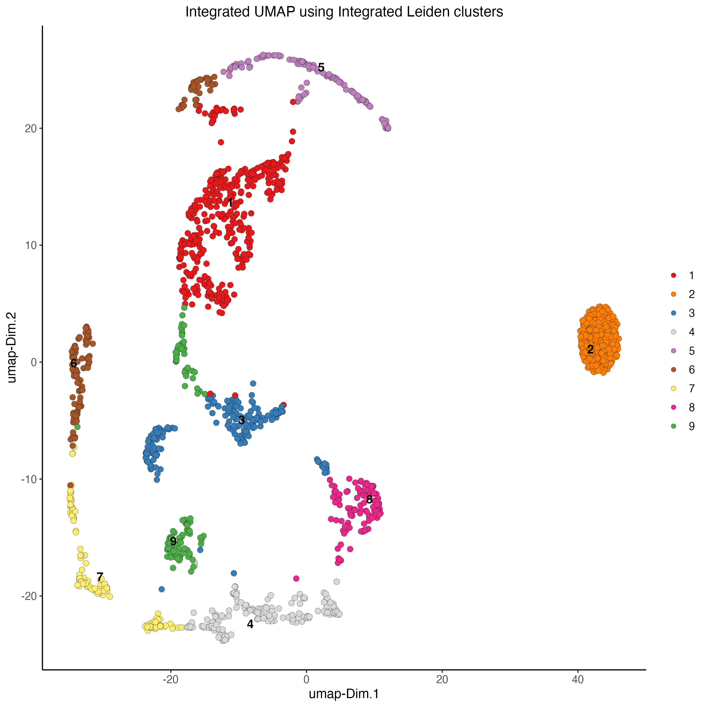
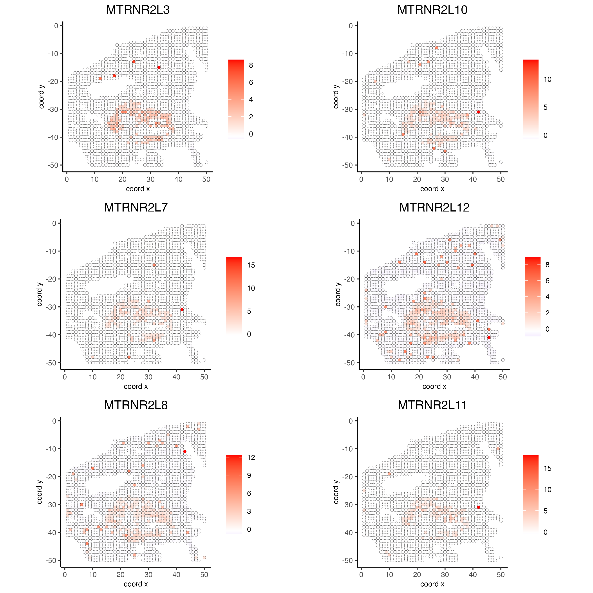
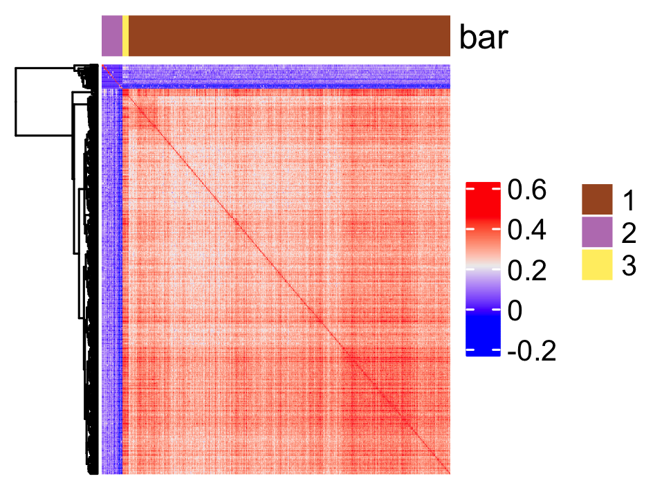
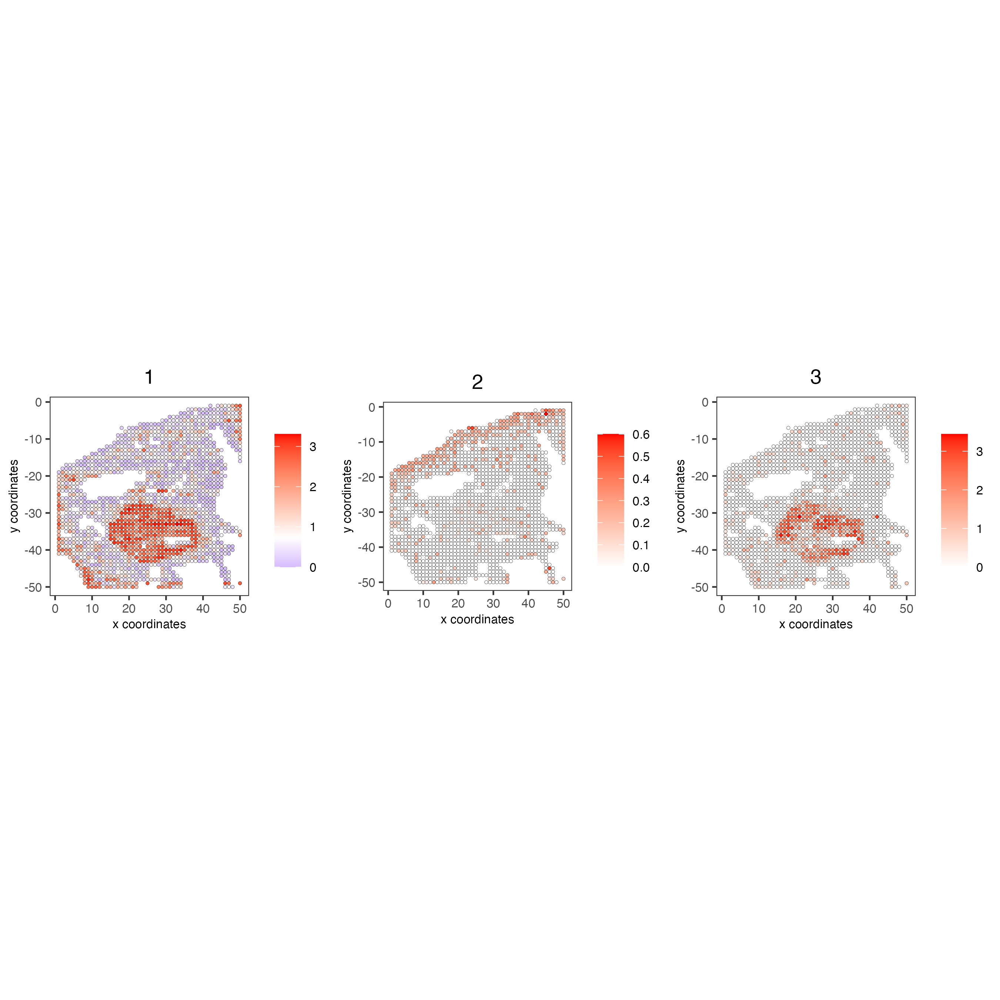
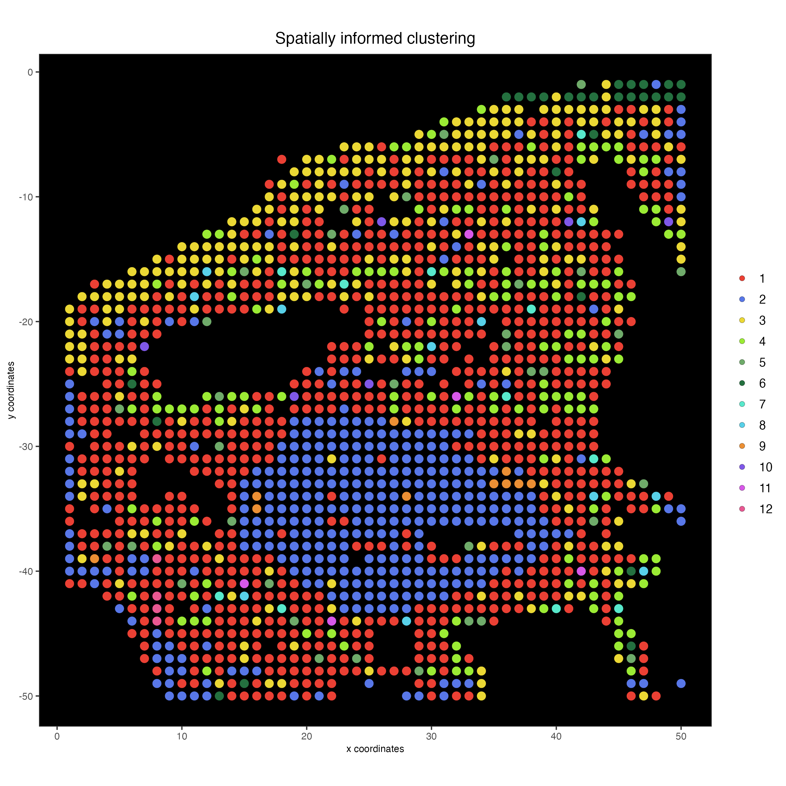

# 1 Dataset explanation

To run this example, we will use the Skin dataset from the article [High-plex protein and whole transcriptome co-mapping at cellular resolution with spatial CITE-seq](https://www.nature.com/articles/s41587-023-01676-0)

# 2 Start Giotto

```{r, eval=FALSE}
# Ensure Giotto Suite is installed
if(!"Giotto" %in% installed.packages()) {
  pak::pkg_install("drieslab/Giotto")
}

# Ensure the Python environment for Giotto has been installed
genv_exists = Giotto::checkGiottoEnvironment()
if(!genv_exists){
  # The following command need only be run once to install the Giotto environment
  Giotto::installGiottoEnvironment()
}
```

# 3 Create Giotto object

```{r, eval=FALSE}
library(Giotto)

instrs <- createGiottoInstructions(save_plot = TRUE,
                                   save_dir = "results",
                                   show_plot = TRUE)
```

Create spatial coords table

```{r, eval=FALSE}
x = data.table::fread("data/GSM6578065_humanskin_RNA.tsv.gz")
spatial_coords = data.frame(cell_ID = x$X)
spatial_coords = cbind(spatial_coords,
                      stringr::str_split_fixed(spatial_coords$cell_ID, 
                                                pattern = "x",
                                                n = 2))
colnames(spatial_coords)[2:3] = c("sdimx", "sdimy")
spatial_coords$sdimx = as.integer(spatial_coords$sdimx)
spatial_coords$sdimy = as.integer(spatial_coords$sdimy)
spatial_coords$sdimy = spatial_coords$sdimy*(-1)
```

Read rna and protein expression matrix

```{r, eval=FALSE}
rna_matrix = data.table::fread("data/GSM6578065_humanskin_RNA.tsv.gz")
rna_matrix = rna_matrix[rna_matrix$X %in% spatial_coords$cell_ID,]
rna_matrix = rna_matrix[match(spatial_coords$cell_ID, rna_matrix$X),]
rna_matrix = t(rna_matrix[,-1])
colnames(rna_matrix) = spatial_coords$cell_ID

protein_matrix = data.table::fread("data/GSM6578074_humanskin_protein.tsv.gz")
protein_matrix = protein_matrix[protein_matrix$X %in% spatial_coords$cell_ID,]
protein_matrix = protein_matrix[match(spatial_coords$cell_ID, protein_matrix$X),]
protein_matrix = t(protein_matrix[,-1])
colnames(protein_matrix) = spatial_coords$cell_ID
```

Create Giotto object using RNA and Protein expression, as well as spatial positions

```{r, eval=FALSE}
my_giotto_object <- createGiottoObject(expression = list(rna = list(raw = rna_matrix),
                                                         protein = list(raw = protein_matrix)),
                                       expression_feat = list("rna", "protein"),
                                       spatial_locs = spatial_coords,
                                       instructions = instrs)
```

Add tissue image

```{r, eval=FALSE}
my_giotto_image <- createGiottoImage(gobject = my_giotto_object,
                                     do_manual_adj = TRUE,
                                     scale_factor = 0.5,
                                     mg_object = "img/skin.jpg",
                                     negative_y = TRUE)

my_giotto_object <- addGiottoImage(gobject = my_giotto_object,
                                   images = list(my_giotto_image),
                                   spat_loc_name = "raw")
```

Visualize image

```{r, eval=FALSE}
spatPlot2D(my_giotto_object,
           point_size = 3.5)
```



# 4 Processing

## Filtering

```{r, eval=FALSE}
# RNA
my_giotto_object <- filterGiotto(gobject = my_giotto_object,
                                 spat_unit = "cell",
                                 feat_type = "rna",
                                 expression_threshold = 1,
                                 feat_det_in_min_cells = 1,
                                 min_det_feats_per_cell = 1)
```

```{r, eval=FALSE}
# Protein
my_giotto_object <- filterGiotto(gobject = my_giotto_object,
                                 spat_unit = "cell",
                                 feat_type = "protein",
                                 expression_threshold = 1,
                                 feat_det_in_min_cells = 1,
                                 min_det_feats_per_cell = 1)
```

## Normalization

```{r, eval=FALSE}
# RNA
my_giotto_object <- normalizeGiotto(gobject = my_giotto_object,
                                    spat_unit = "cell",
                                    feat_type = "rna",
                                    norm_methods = "standard",
                                    scalefactor = 10000,
                                    verbose = TRUE)
```

```{r, eval=FALSE}
# Protein
my_giotto_object <- normalizeGiotto(gobject = my_giotto_object,
                                    spat_unit = "cell",
                                    feat_type = "protein",
                                    scalefactor = 6000,
                                    verbose = T)
```

## Statistics

```{r, eval=FALSE}
# RNA
my_giotto_object <- addStatistics(gobject = my_giotto_object,
                                  spat_unit = "cell",
                                  feat_type = "rna")
```

```{r, eval=FALSE}
# Protein
my_giotto_object <- addStatistics(gobject = my_giotto_object,
                                  spat_unit = "cell",
                                  feat_type = "protein",
                                  expression_values = "normalized")
```

# 5 Dimention Reduction

## Principal component analysis (PCA)

```{r, eval=FALSE}
# RNA
my_giotto_object <- runPCA(gobject = my_giotto_object,
                           spat_unit = "cell",
                           feat_type = "rna",
                           expression_values = "normalized",
                           reduction = "cells",
                           name = "rna.pca")
```

```{r, eval=FALSE}
# Protein
my_giotto_object <- runPCA(gobject = my_giotto_object,
                           spat_unit = "cell",
                           feat_type = "protein",
                           expression_values = "normalized",
                           scale_unit = T,
                           center = F,
                           method = "factominer")
```

# 6 Clustering

## Uniform manifold approximation projection (UMAP)

```{r, eval=FALSE}
# RNA
my_giotto_object <- runUMAP(gobject = my_giotto_object,
                            spat_unit = "cell",
                            feat_type = "rna",
                            expression_values = "normalized",
                            reduction = "cells",
                            dimensions_to_use = 1:10,
                            dim_reduction_name = "rna.pca")
```

```{r, eval=FALSE}
# Protein
my_giotto_object <- runUMAP(gobject = my_giotto_object,
                            spat_unit = "cell",
                            feat_type = "protein",
                            expression_values = "normalized",
                            dimensions_to_use = 1:10)
```

## Create nearest network

```{r, eval=FALSE}
# RNA
my_giotto_object <- createNearestNetwork(gobject = my_giotto_object,
                                         spat_unit = "cell",
                                         feat_type = "rna",
                                         type = "sNN",
                                         dim_reduction_to_use = "pca",
                                         dim_reduction_name = "rna.pca",
                                         dimensions_to_use = 1:10,
                                         k = 20)
```

```{r, eval=FALSE}
# Protein
my_giotto_object <- createNearestNetwork(gobject = my_giotto_object,
                                         spat_unit = "cell",
                                         feat_type = "protein",
                                         type = "sNN",
                                         name = "protein_sNN.pca",
                                         dimensions_to_use = 1:10,
                                         k = 20)
```

## Find Leiden clusters

```{r, eval=FALSE}
# RNA
my_giotto_object <- doLeidenCluster(gobject = my_giotto_object,
                                    spat_unit = "cell",
                                    feat_type = "rna",
                                    nn_network_to_use = "sNN",
                                    name = "leiden_clus",
                                    resolution = 1)
```

```{r, eval=FALSE}
# Protein
my_giotto_object <- doLeidenCluster(gobject = my_giotto_object,
                                    spat_unit = "cell",
                                    feat_type = "protein",
                                    nn_network_to_use = "sNN",
                                    network_name = "protein_sNN.pca",
                                    name = "leiden_clus",
                                    resolution = 1)
```

## Plot PCA

```{r, eval=FALSE}
# RNA
plotPCA(gobject = my_giotto_object,
        spat_unit = "cell",
        feat_type = "rna",
        dim_reduction_name = "rna.pca",
        cell_color = 'leiden_clus',
        title = "RNA PCA")
```



```{r, eval=FALSE}
# Protein
plotPCA(gobject = my_giotto_object,
        spat_unit = "cell",
        feat_type = "protein",
        dim_reduction_name = "protein.pca",
        cell_color = 'leiden_clus',
        title = "Protein PCA")
```



## Plot UMAP

```{r, eval=FALSE}
# RNA
plotUMAP(gobject = my_giotto_object,
         spat_unit = "cell",
         feat_type = "rna",
         cell_color = 'leiden_clus',
         point_size = 2,
         title = "RNA Uniform Manifold Approximation & Projection (UMAP)",
         axis_title = 12,
         axis_text = 10 )
```



```{r, eval=FALSE}
# Protein
plotUMAP(gobject = my_giotto_object,
         spat_unit = "cell",
         feat_type = "protein",
         cell_color = 'leiden_clus',
         dim_reduction_name = "protein.umap",
         point_size = 2,
         title = "Protein Uniform Manifold Approximation & Projection (UMAP)",
         axis_title = 12,
         axis_text = 10 )
```



## Plot spatial locations by cluster

```{r, eval=FALSE}
# RNA
spatPlot2D(my_giotto_object,
           show_image = TRUE,
           point_size = 3.5,
           cell_color = "leiden_clus",
           title = "RNA Leiden clustering")
```


```{r, eval=FALSE}
# Protein
spatPlot2D(my_giotto_object,
           spat_unit = "cell",
           feat_type = "protein",
           cell_color = "leiden_clus",
           point_size = 3.5,
           show_image = TRUE,
           title = "Protein Leiden clustering")
```


# 7 Multi-omics integration

## Create nearest network

```{r, eval=FALSE}
my_giotto_object <- createNearestNetwork(gobject = my_giotto_object,
                                         spat_unit = "cell",
                                         feat_type = "rna",
                                         type = "kNN",
                                         dim_reduction_name = "rna.pca",
                                         name = "rna_kNN.pca",
                                         dimensions_to_use = 1:10,
                                         k = 20)
```

```{r, eval=FALSE}
my_giotto_object <- createNearestNetwork(gobject = my_giotto_object,
                                         spat_unit = "cell",
                                         feat_type = "protein",
                                         type = "kNN",
                                         name = "protein_kNN.pca",
                                         dimensions_to_use = 1:10,
                                         k = 20)
```

## Calculate WNN

```{r, eval=FALSE}
my_giotto_object <- runWNN(my_giotto_object,
                           modality_1 = "rna",
                           modality_2 = "protein",
                           pca_name_modality_1 = "rna.pca",
                           pca_name_modality_2 = "protein.pca",
                           k = 20)
```

## Create integrated UMAP

```{r, eval=FALSE}
my_giotto_object <- runIntegratedUMAP(my_giotto_object,
                                      modality1 = "rna",
                                      modality2 = "protein")
```

## Calculate Leiden clusters

```{r, eval=FALSE}
my_giotto_object <- doLeidenCluster(gobject = my_giotto_object,
                                    spat_unit = "cell",
                                    feat_type = "rna",
                                    nn_network_to_use = "kNN",
                                    network_name = "integrated_kNN",
                                    name = "integrated_leiden_clus",
                                    resolution = 0.7)
```

## Plot integrated UMAP

```{r, eval=FALSE}
plotUMAP(gobject = my_giotto_object,
         spat_unit = "cell",
         feat_type = "rna",
         cell_color = 'integrated_leiden_clus',
         dim_reduction_name = "integrated.umap",
         point_size = 2.5,
         title = "Integrated UMAP using Integrated Leiden clusters",
         axis_title = 12,
         axis_text = 10)
```



## Plot integrated spatial locations by cluster

```{r, eval=FALSE}
spatPlot2D(my_giotto_object,
           spat_unit = "cell",
           feat_type = "rna",
           cell_color = "integrated_leiden_clus",
           point_size = 3.5,
           show_image = TRUE,
           title = "Integrated Leiden clustering")
```


# 8 Calculate spatially variable genes

```{r, eval=FALSE}
my_giotto_object <- createSpatialNetwork(gobject = my_giotto_object,
                                         method = 'kNN', 
                                         k = 6,
                                         maximum_distance_knn = 5,
                                         name = 'spatial_network')

ranktest = binSpect(my_giotto_object, 
                    bin_method = 'rank',
                    calc_hub = T, 
                    hub_min_int = 5,
                    spatial_network_name = 'spatial_network')

spatFeatPlot2D(my_giotto_object, 
               expression_values = 'scaled',
               feats = ranktest$feats[1:6], 
               cow_n_col = 2, 
               point_size = 1.5)
```



## Spatially correlated genes

```{r, eval=FALSE}
# 3.1 cluster the top 500 spatial genes into 20 clusters
ext_spatial_genes = ranktest[1:500,]$feats

# here we use existing detectSpatialCorGenes function to calculate pairwise distances between genes (but set network_smoothing=0 to use default clustering)
spat_cor_netw_DT = detectSpatialCorFeats(my_giotto_object,
                                         method = 'network',
                                         spatial_network_name = 'spatial_network',
                                         subset_feats = ext_spatial_genes)
```

```{r, eval=FALSE}
# 3.3 identify potenial spatial co-expression
spat_cor_netw_DT = clusterSpatialCorFeats(spat_cor_netw_DT, 
                                          name = 'spat_netw_clus', 
                                          k = 3)

# visualize clusters
heatmSpatialCorFeats(my_giotto_object,
                     spatCorObject = spat_cor_netw_DT,
                     use_clus_name = 'spat_netw_clus',
                     heatmap_legend_param = list(title = NULL),
                     save_param = list(base_height = 6, 
                                       base_width = 8, 
                                       units = 'cm'))
```



# 9 Metagenes/co-expression modules 

```{r, eval=FALSE}
# 3.4 create metagenes / co-expression modules
cluster_genes = getBalancedSpatCoexpressionFeats(spat_cor_netw_DT, 
                                                 maximum = 30)

my_giotto_object = createMetafeats(my_giotto_object, 
                                   feat_clusters = cluster_genes, 
                                   name = 'cluster_metagene')

spatCellPlot(my_giotto_object,
             spat_enr_names = 'cluster_metagene',
             cell_annotation_values = as.character(c(1:7)),
             point_size = 1, 
             cow_n_col = 3)
```



# 10 Spatially informed clustering

```{r, eval=FALSE}
my_spatial_genes = names(cluster_genes)

my_giotto_object <- runPCA(gobject = my_giotto_object,
                           feats_to_use = my_spatial_genes,
                           name = 'custom_pca')

my_giotto_object <- runUMAP(my_giotto_object,
                            dim_reduction_name = 'custom_pca',
                            dimensions_to_use = 1:20,
                            name = 'custom_umap')

my_giotto_object <- createNearestNetwork(gobject = my_giotto_object,
                                         dim_reduction_name = 'custom_pca',
                                         dimensions_to_use = 1:20, 
                                         k = 3,
                                         name = 'custom_NN')

my_giotto_object <- doLeidenCluster(gobject = my_giotto_object,
                                    network_name = 'custom_NN',
                                    resolution = 0.1, 
                                    n_iterations = 1000,
                                    name = 'custom_leiden')

spatPlot2D(my_giotto_object,
           show_image = FALSE,
           cell_color = 'custom_leiden', 
           cell_color_code = c("#eb4034",
                               "#5877e8",
                               "#ebd834",
                               "#9beb34",
                               "#6fab6a",
                               "#24703f",
                               "#58e8cb",
                               "#58d0e8",
                               "#eb8f34",
                               "#7f58e8",
                               "#d758e8",
                               "#e85892"),
           point_size = 3.5,
           background_color = "black",
           title = "Spatially informed clustering")
```



# 11 Session Info

```{r, eval = FALSE}
sessionInfo()
```

```{r, eval = FALSE}
R version 4.3.2 (2023-10-31)
Platform: x86_64-apple-darwin20 (64-bit)
Running under: macOS Sonoma 14.3

Matrix products: default
BLAS:   /System/Library/Frameworks/Accelerate.framework/Versions/A/Frameworks/vecLib.framework/Versions/A/libBLAS.dylib 
LAPACK: /Library/Frameworks/R.framework/Versions/4.3-x86_64/Resources/lib/libRlapack.dylib;  LAPACK version 3.11.0

locale:
[1] en_US.UTF-8/en_US.UTF-8/en_US.UTF-8/C/en_US.UTF-8/en_US.UTF-8

time zone: America/New_York
tzcode source: internal

attached base packages:
[1] stats     graphics  grDevices utils     datasets  methods   base     

other attached packages:
[1] Giotto_4.0.2      GiottoClass_0.1.3

loaded via a namespace (and not attached):
  [1] colorRamp2_0.1.0            bitops_1.0-7                rlang_1.1.3                
  [4] magrittr_2.0.3              clue_0.3-65                 GetoptLong_1.0.5           
  [7] GiottoUtils_0.1.4           matrixStats_1.2.0           compiler_4.3.2             
 [10] png_0.1-8                   systemfonts_1.0.5           vctrs_0.6.5                
 [13] stringr_1.5.1               shape_1.4.6                 pkgconfig_2.0.3            
 [16] SpatialExperiment_1.12.0    crayon_1.5.2                fastmap_1.1.1              
 [19] backports_1.4.1             magick_2.8.2                XVector_0.42.0             
 [22] labeling_0.4.3              utf8_1.2.4                  rmarkdown_2.25             
 [25] ragg_1.2.7                  xfun_0.42                   zlibbioc_1.48.0            
 [28] beachmat_2.18.0             GenomeInfoDb_1.38.6         jsonlite_1.8.8             
 [31] flashClust_1.01-2           DelayedArray_0.28.0         BiocParallel_1.36.0        
 [34] terra_1.7-71                irlba_2.3.5.1               parallel_4.3.2             
 [37] cluster_2.1.6               R6_2.5.1                    RColorBrewer_1.1-3         
 [40] stringi_1.8.3               reticulate_1.35.0           GenomicRanges_1.54.1       
 [43] estimability_1.4.1          iterators_1.0.14            Rcpp_1.0.12                
 [46] SummarizedExperiment_1.32.0 knitr_1.45                  R.utils_2.12.3             
 [49] FNN_1.1.4                   IRanges_2.36.0              igraph_2.0.1.1             
 [52] Matrix_1.6-5                tidyselect_1.2.0            rstudioapi_0.15.0          
 [55] abind_1.4-5                 yaml_2.3.8                  doParallel_1.0.17          
 [58] codetools_0.2-19            lattice_0.22-5              tibble_3.2.1               
 [61] Biobase_2.62.0              withr_3.0.0                 evaluate_0.23              
 [64] circlize_0.4.15             pillar_1.9.0                MatrixGenerics_1.14.0      
 [67] foreach_1.5.2               checkmate_2.3.1             DT_0.31                    
 [70] stats4_4.3.2                dbscan_1.1-12               generics_0.1.3             
 [73] RCurl_1.98-1.14             S4Vectors_0.40.2            ggplot2_3.4.4              
 [76] munsell_0.5.0               scales_1.3.0                gtools_3.9.5               
 [79] xtable_1.8-4                leaps_3.1                   glue_1.7.0                 
 [82] emmeans_1.10.0              scatterplot3d_0.3-44        tools_4.3.2                
 [85] GiottoVisuals_0.1.4         data.table_1.15.0           ScaledMatrix_1.10.0        
 [88] mvtnorm_1.2-4               Cairo_1.6-2                 cowplot_1.1.3              
 [91] grid_4.3.2                  colorspace_2.1-0            SingleCellExperiment_1.24.0
 [94] GenomeInfoDbData_1.2.11     BiocSingular_1.18.0         cli_3.6.2                  
 [97] rsvd_1.0.5                  textshaping_0.3.7           fansi_1.0.6                
[100] S4Arrays_1.2.0              ComplexHeatmap_2.18.0       dplyr_1.1.4                
[103] uwot_0.1.16                 gtable_0.3.4                R.methodsS3_1.8.2          
[106] digest_0.6.34               BiocGenerics_0.48.1         SparseArray_1.2.3          
[109] ggrepel_0.9.5               FactoMineR_2.9              rjson_0.2.21               
[112] htmlwidgets_1.6.4           farver_2.1.1                htmltools_0.5.7            
[115] R.oo_1.26.0                 lifecycle_1.0.4             multcompView_0.1-9         
[118] GlobalOptions_0.1.2         MASS_7.3-60.0.1 
```
