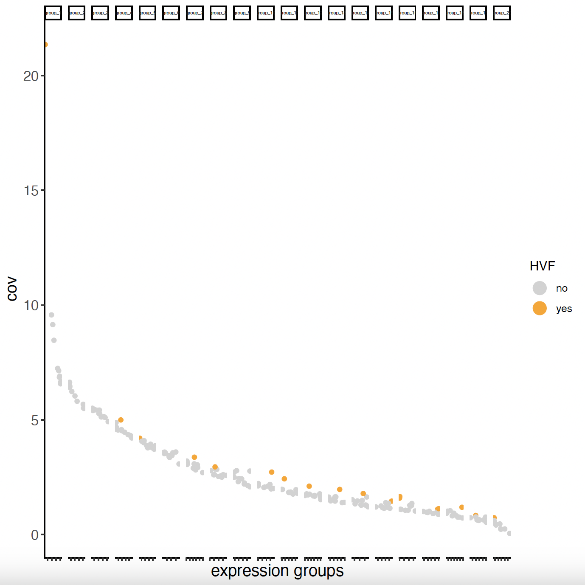
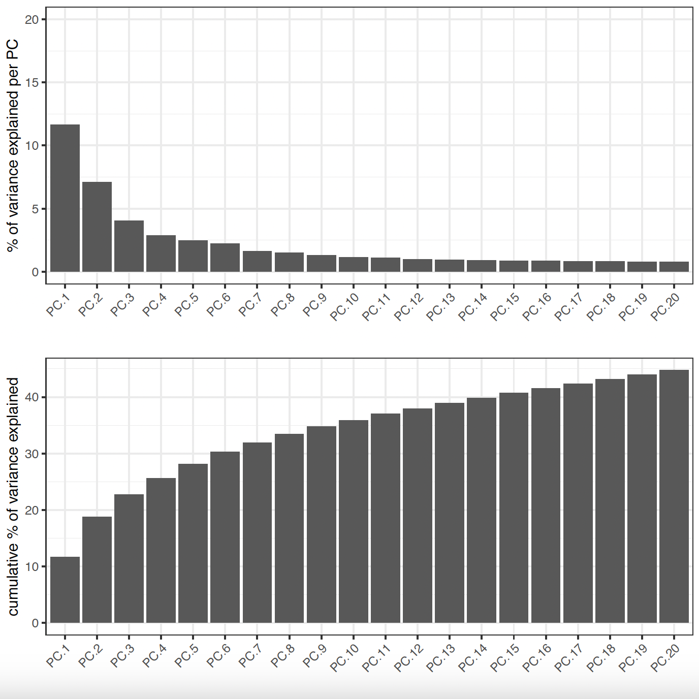
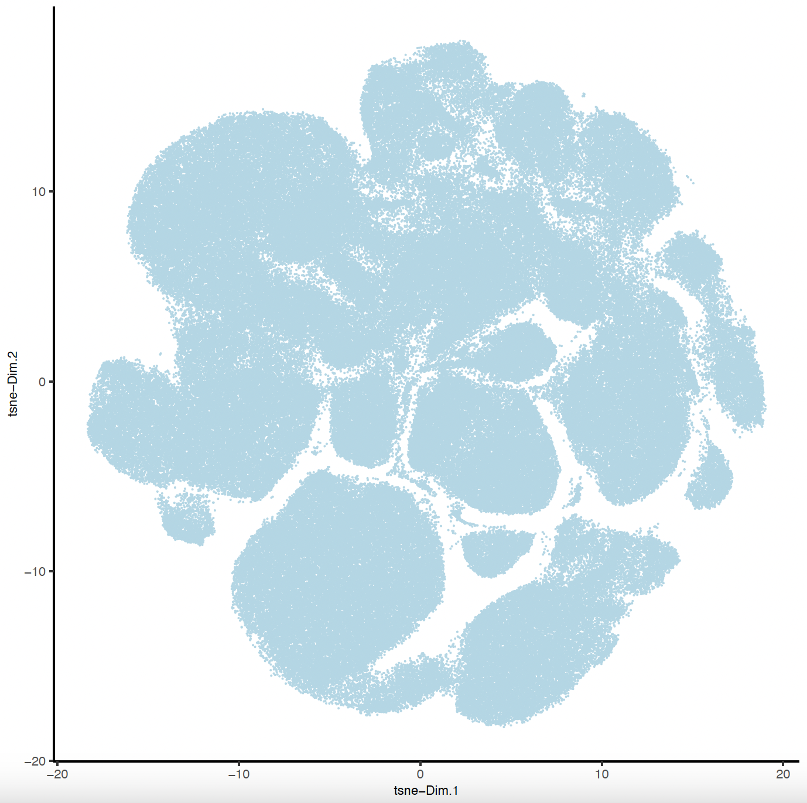
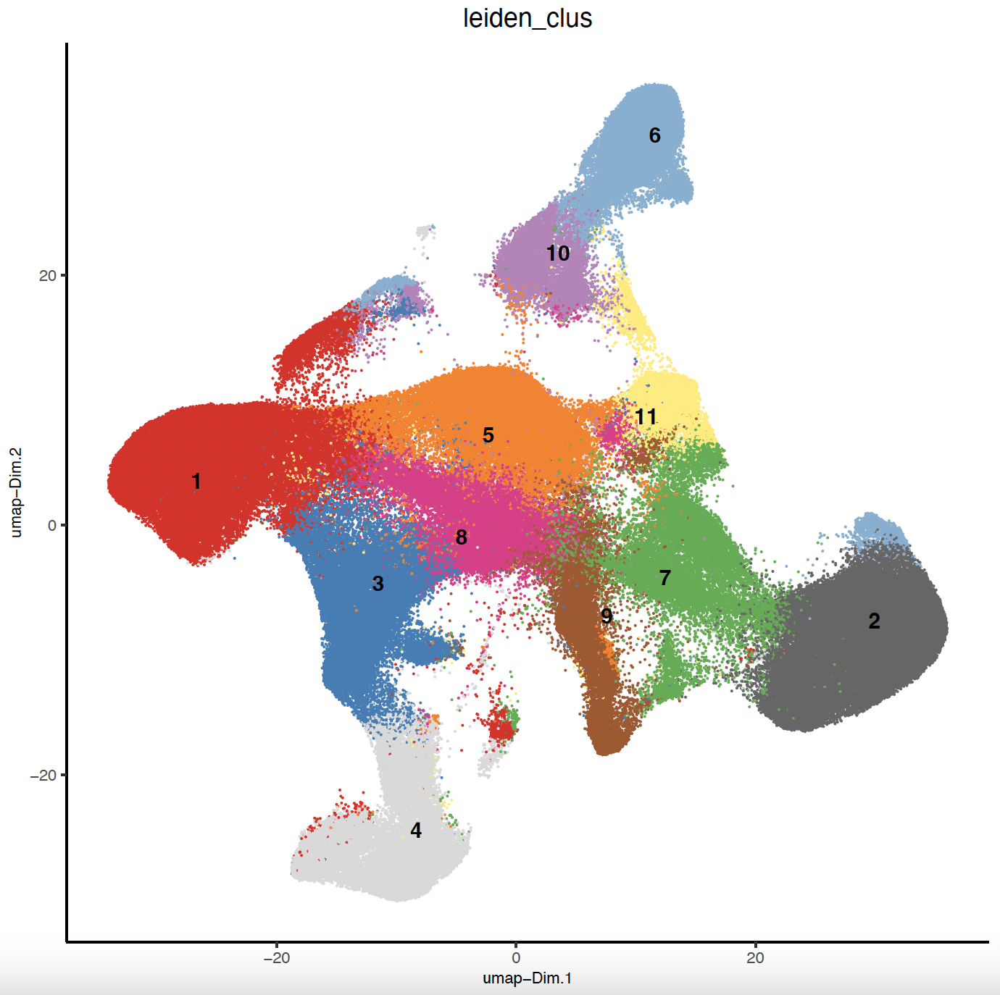
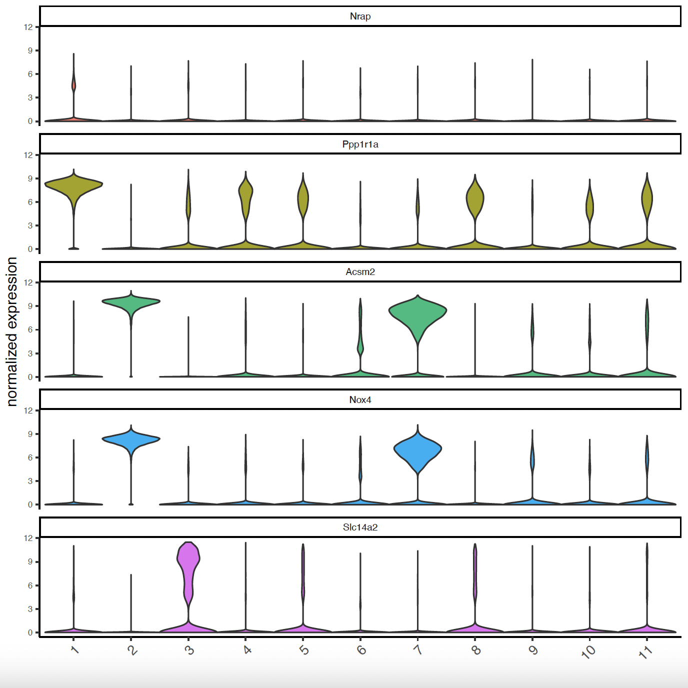
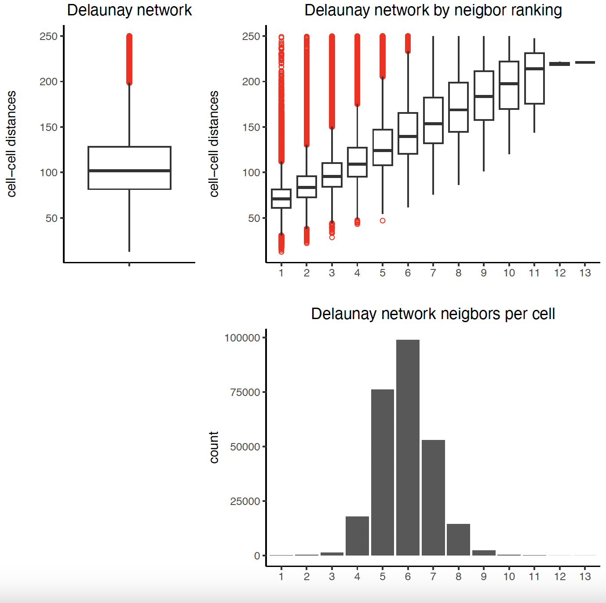
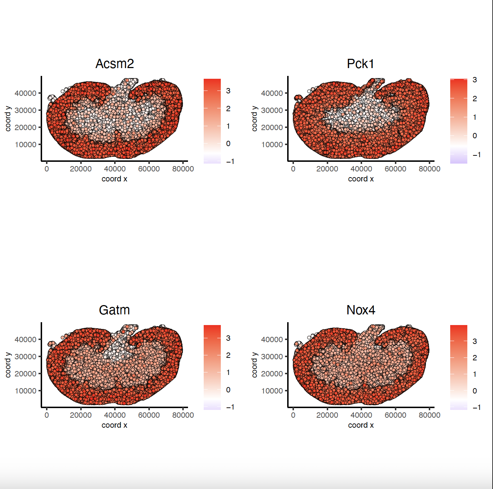
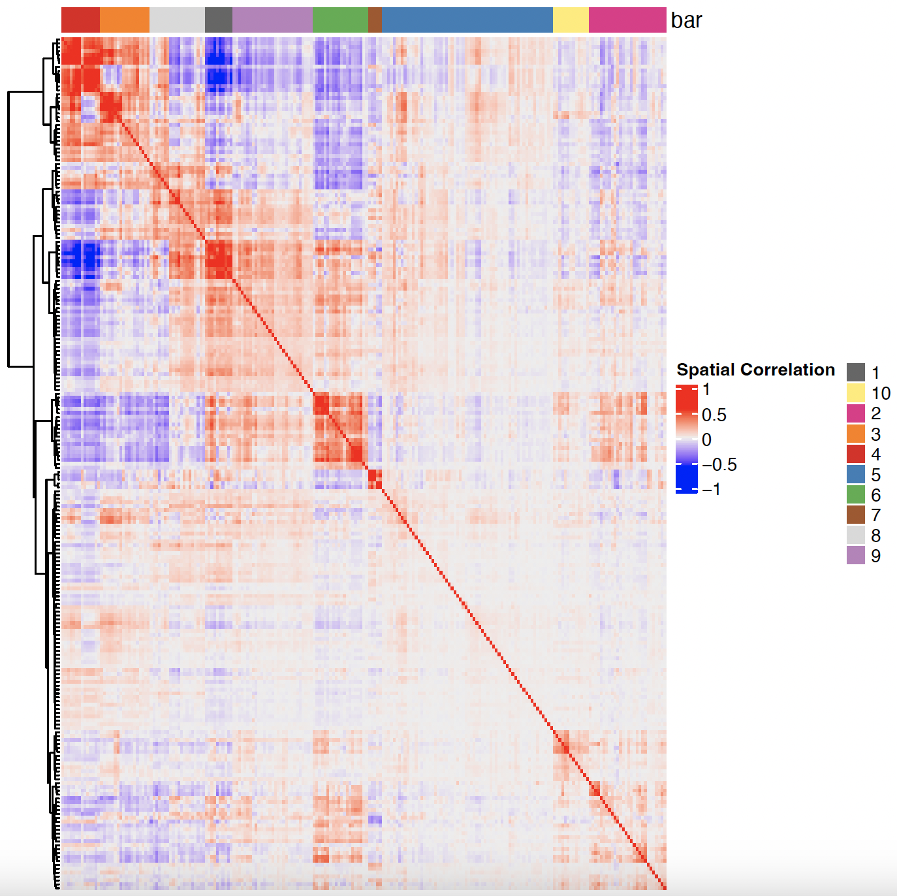

# 1. Dataset explanation

This tutorial covers Giotto object creation and simple exploratory analysis with the gene expression data generated on Spatial Genomics' GenePS instrument of kidney tissue resected from a 2-month-old female mouse. The data was generated using sequential fluorescence in situ hybridization (seqFISH) to visualize 220 genes directly in the sample.

# 2. Start Giotto


```{r, eval=FALSE}
# Ensure Giotto Suite is installed
if(!"Giotto" %in% installed.packages()) {
  pak::pkg_install("drieslab/Giotto")
}

# Ensure Giotto Data is installed
if(!"GiottoData" %in% installed.packages()) {
  pak::pkg_install("drieslab/GiottoData")
}

# Ensure the Python environment for Giotto has been installed
genv_exists = Giotto::checkGiottoEnvironment()
if(!genv_exists){
  # The following command need only be run once to install the Giotto environment
  Giotto::installGiottoEnvironment()
}
```


# 3. Project Data Paths


```{r, eval=FALSE}
library(Giotto)
library(GiottoData)

# Set path to folder containing spatial genomics data
datadir = '/path/to/Spatial/Genomics/data/'

dapi = paste0(datadir, 'SG_MouseKidneyDataRelease_DAPI_section1.ome.tiff')
mask = paste0(datadir, 'SG_MouseKidneyDataRelease_CellMask_section1.tiff')
tx = paste0(datadir, 'SG_MouseKidneyDataRelease_TranscriptCoordinates_section1.csv')
```


# 4. Create a Giotto object


```{r, eval=FALSE}
# Create and plot giotto polygons
gpoly = createGiottoPolygonsFromMask(mask, shift_vertical_step = F, 
                                     shift_horizontal_step = F, 
                                     flip_horizontal = F, 
                                     flip_vertical = F)
plot(gpoly)

# Create and plot giotto points
tx = data.table::fread(tx)
gpoints = createGiottoPoints(tx)
plot(gpoints, raster_size = 1e3)

# Create giottoLargeImage and giottoObject
gimg = createGiottoLargeImage(dapi, use_rast_ext = TRUE)

sg = createGiottoObjectSubcellular(gpoints = list('rna' = gpoints),
                                   gpolygons = list('cell' = gpoly))
sg = addGiottoLargeImage(sg, largeImages = list(image = gimg))
```


# 5. Aggregate, Normalize, and Filter Giotto Data


```{r, eval=FALSE}
# Aggregate
sg = calculateOverlapRaster(sg,
                            spatial_info = 'cell',
                            feat_info = 'rna')
sg = overlapToMatrix(sg)
sg = addSpatialCentroidLocations(sg)
# Filter and Normalize 
filterDistributions(sg, detection = 'feats')
filterDistributions(sg, detection = 'cells')
sg = filterGiotto(sg, feat_det_in_min_cells = 100, min_det_feats_per_cell = 20, expression_threshold = 1)
sg = normalizeGiotto(sg)
# Statistics
sg = addStatistics(sg)
```


# 6. Dimension Reduction

## 6.1 Highly Variable Features


```{r, eval=FALSE}
# Calculate highly variable features
sg = calculateHVF(gobject = sg)
cat(fDataDT(sg)[, sum(hvf == 'yes')], 'hvf found')
# Only 18 hvf found -> better to use ALL genes -> feats_to_use = NULL
sg = runPCA(gobject = sg,
            spat_unit = 'cell',
            expression_values = 'scaled',
            feats_to_use = NULL,
            scale_unit = F,
            center = F)
```




## 6.2 PCA


```{r, eval=FALSE}
# Visualize Screeplot and PCA
screePlot(sg,
          ncp = 20,
          save_param = list(
            save_name = 'sg_screePlot'))
plotPCA(sg,
        spat_unit = 'cell',
        dim_reduction_name = 'pca',
        dim1_to_use = 1,
        dim2_to_use = 2)
```




## 6.3 tSNE and UMAP


```{r, eval=FALSE}
# Run and Plot tSNE and UMAP
sg = runtSNE(sg,
             dimensions_to_use = 1:10,
             spat_unit = 'cell',
             check_duplicates = FALSE)
sg = runUMAP(sg,
             dimensions_to_use = 1:10,
             spat_unit = 'cell')
plotTSNE(sg,
         point_size = 0.01,
         save_param = list(
          save_name = 'sg_tSNE'))
plotUMAP(sg,
         point_size = 0.01,
         save_param = list(
           save_name = 'sg_UMAP'))
```





# 7. Clustering

## 7.1 UMAP Leiden Clustering


```{r, eval=FALSE}
# Clustering and UMAP cluster visualization
sg = createNearestNetwork(sg,
                          dimensions_to_use = 1:10,
                          k = 10,
                          spat_unit = 'cell')
sg = doLeidenCluster(sg,
                     resolution = 0.25,
                     n_iterations = 100,
                     spat_unit = 'cell')
# Plot Leiden clusters onto UMAP
plotUMAP(gobject = sg,
         spat_unit = 'cell',
         cell_color = 'leiden_clus',
         show_legend = FALSE,
         point_size = 0.01,
         point_shape = 'no_border',
         save_param = list(save_name = 'sg_umap_leiden'))
```




## 7.2 Spatial Leiden Clustering


```{r, eval=FALSE}
# Plot Leiden clusters onto spatial image plot
my_spatPlot <- spatPlot2D(gobject = sg,
                          spat_unit = 'cell',
                          cell_color = 'leiden_clus',
                          point_size = 0.4,
                          point_shape = 'no_border',
                          show_legend = TRUE,
                          image_name = gimg,
                          save_param = list(
                            save_name = 'sg_spat_leiden',
                            base_width = 15,
                            base_height = 15))
```


# 8. Cell Type Marker Gene Detection


```{r, eval=FALSE}
# Identify gene markers per cluster
markers = findMarkers_one_vs_all(gobject = sg,
                                 method = 'gini',
                                 expression_values = 'normalized',
                                 cluster_column = 'leiden_clus',
                                 min_feats = 1, rank_score = 2)
# Display details about the marker genes
markers[, head(.SD, 2), by = 'cluster']
# Violinplots to show marker expression
topgini_genes = unique(markers[, head(.SD, 2), by = 'cluster'])
violinPlot(sg, feats = topgini_genes$feats[1:10], cluster_column = 'leiden_clus')
violinPlot(sg, feats = topgini_genes$feats[11:20], cluster_column = 'leiden_clus')
# Known markers to Annotate Giotto
selected_genes = c('My12', 'G6pc', 'Ppp1r1a', 'Grik5', 'Hsd11b2', 'Rhbg', 'Mapk11',
                   'Egf17', 'Gpr55', 'Acsm2', 'Tpm2', 'D1c1', 'Shisa3',
                   'Tspan2', 'Sox17', 'Eef2', 'Cd79b', 'Ctss', 'Serpina1f', 'Cyp51')

gobject_cell_metadata = pDataDT(sg)
cluster_order = unique(gobject_cell_metadata$leiden_clus)
# Plot markers to clusters heatmap
plotMetaDataHeatmap(sg, expression_values = 'scaled',
                    metadata_cols = c('leiden_clus'),
                    selected_feats = selected_genes,
                    custom_feat_order = rev(selected_genes),
                    custom_cluster_order = cluster_order)
```





# 9. Spatial Gene Expression Patterns

## 9.1 Establish Delaunay Network


```{r, eval=FALSE}
plotStatDelaunayNetwork(gobject = sg, maximum_distance = 250)
sg = createSpatialNetwork(gobject = sg, minimum_k = 2,
                          maximum_distance_delaunay = 250)
sg = createSpatialNetwork(gobject = sg, minimum_k = 2,
                          method = 'kNN', k = 10)
```




## 9.2 Binspect by K-Means


```{r, eval=FALSE}
km_spatialgenes = binSpect(sg)
spatFeatPlot2D(sg, expression_values = 'scaled',
               feats = km_spatialgenes[1:4]$feats,
               point_shape = 'no_border', 
               show_network = F, network_color = 'lightgrey', point_size = 0.5,
               cow_n_col = 2)
```




## 9.3 Binspect by Rank


```{r, eval=FALSE}
rank_spatialgenes = binSpect(sg, bin_method = 'rank')
spatFeatPlot2D(sg, expression_values = 'scaled',
               feats = rank_spatialgenes[1:4]$feats,
               point_shape = 'no_border', 
               show_network = F, network_color = 'lightgrey', point_size = 0.5,
               cow_n_col = 2)
```


# 10. Spatial Co-Expression Patterns


```{r, eval=FALSE}
# Spatial Co-Expression
spatial_genes = km_spatialgenes[1:500]$feats

# 1. create spatial correlation object
spat_cor_obj = detectSpatialCorFeats(sg,
                                     method = 'network',
                                     spatial_network_name = 'Delaunay_network',
                                     subset_feats = spatial_genes)

# 2. identify most similar spatially correlated genes for one gene
Acsm2_top10_genes = showSpatialCorFeats(spat_cor_obj, feats = 'Acsm2', show_top_feats = 10)

spatFeatPlot2D(sg, expression_values = 'scaled',
               feats = Acsm2_top10_genes$variable[1:4], point_size = 0.5,
               point_shape = 'no_border')
```


```{r, eval=FALSE}
# 3. cluster correlated genes & visualize
spat_cor_obj = clusterSpatialCorFeats(spat_cor_obj, name = 'spat_netw_clus', k = 10)

heatmSpatialCorFeats(sg, spatCorObject = spat_cor_obj, use_clus_name = 'spat_netw_clus',
                     heatmap_legend_param = list(title = 'Spatial Correlation'))
```





```{r, eval=FALSE}
# 4. rank spatial correlated clusters and show genes for selected clusters
netw_ranks = rankSpatialCorGroups(sg, spatCorObject = spat_cor_obj,
                                  use_clus_name = 'spat_netw_clus')
top_netw_spat_cluster = showSpatialCorFeats(spat_cor_obj, use_clus_name = 'spat_netw_clus',
                                            show_top_feats = 1)
```


```{r, eval=FALSE}
# 5. create metagene enrichment score for clusters
cluster_genes = top_netw_spat_cluster$clus; names(cluster_genes) = top_netw_spat_cluster$feat_ID

sg = createMetafeats(sg, feat_clusters = cluster_genes, name = 'cluster_metagene')
spatCellPlot(sg,
             spat_enr_names = 'cluster_metagene',
             cell_annotation_values = netw_ranks[1:4]$clusters,
             point_size = 0.05, point_shape = 'no_border')
spatCellPlot(sg,
             spat_enr_names = 'cluster_metagene',
             cell_annotation_values = netw_ranks[5:8]$clusters,
             point_size = 0.05, point_shape = 'no_border')
spatCellPlot(sg,
             spat_enr_names = 'cluster_metagene',
             cell_annotation_values = netw_ranks[9:10]$clusters,
             point_size = 0.05, point_shape = 'no_border')
```


## 10.1 Session Info


```{r, eval=FALSE}
sessionInfo()
```

