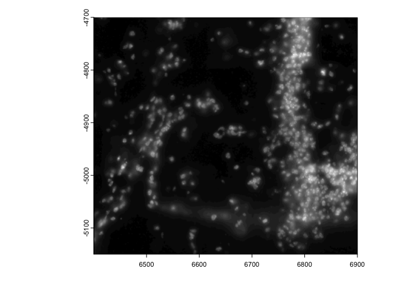

# 1. Spatial Object Manipulation

Spatial-omics data is defined both by the biological information that it contains and the way that it maps to space. When assembling and analyzing a spatial dataset, it may be necessary to spatially manipulate the data so that they are all in a common coordinate reference frame where all data is in at the same scaling and rotation, and properly overlaid.

*Giotto* extends a set of generics from *terra* in order to make it simple to figure out where data is in space and to move it where you need it.

# 2. Start Giotto


```{r, eval=FALSE}
# Ensure Giotto Suite is installed
i_p = installed.packages()
if(!"Giotto" %in% i_p) devtools::install_github("drieslab/Giotto@suite")
library(Giotto)

# Ensure Giotto Data is installed
if(!"GiottoData" %in% i_p) devtools::install_github("drieslab/GiottoData")
library(GiottoData)

# Ensure the Python environment for Giotto has been installed
genv_exists = checkGiottoEnvironment()
if(!genv_exists){
  # The following command need only be run once to install the Giotto environment
  installGiottoEnvironment()
}
```


# 3. Load mini giotto object example

First we will load in the a mini dataset put together from Vizgen's Mouse Brain Receptor Map data release. This mini giotto object has been pre-analyzed and comes with many analyses and data objects attached. Most of these analyses have been performed on the 'aggregate' spatial unit so we will set it as the active spatial unit in order to default to it.


```{r, eval=FALSE}
viz <- GiottoData::loadGiottoMini(dataset = 'vizgen')
activeSpatUnit(viz) <- 'aggregate'
```


# 4. Extract spatial info

Then we will extract the spatial subobjects that we will use. These will be all subobjects in Giotto that contain coordinates data or directly map their data to space.


```{r, eval=FALSE}
image <- getGiottoImage(viz, image_type = 'largeImage', name = 'dapi_z0')
spat_locs <- getSpatialLocations(viz)
spat_net <- getSpatialNetwork(viz)
gpoints <- getFeatureInfo(viz, return_giottoPoints = TRUE)
gpoly <- getPolygonInfo(viz, polygon_name = 'aggregate', return_giottoPolygon = TRUE)
```


# 5. Defining bounds and extent

One of the most convenient descriptors of where an object is in space is its minima and maxima in the coordinate plane, also known as the boundaries or spatial **extent** of that information. It can be thought of as bounding box around where your information exists in space. *Giotto* incorporates usage of the `SpatExtent` class and associated `ext()` generic from *terra* to describe objects spatially.


```{r, eval=FALSE}
ext(image)     # giottoLargeImage
```

```{r, eval=FALSE}
SpatExtent : 6400.029, 6900.037, -5150.007, -4699.967 (xmin, xmax, ymin, ymax)
```

```{r, eval=FALSE}
ext(spat_locs) # spatLocsObj
```

```{r, eval=FALSE}
SpatExtent : 6401.41164725267, 6899.10802819571, -5146.74746408943, -4700.32590047134 (xmin, xmax, ymin, ymax)
```

```{r, eval=FALSE}
ext(spat_net)  # spatNetObj
```

```{r, eval=FALSE}
SpatExtent : 6401.411647, 6899.108028, -5146.747464, -4700.3259 (xmin, xmax, ymin, ymax)
```

```{r, eval=FALSE}
ext(gpoints)   # giottoPoints
```

```{r, eval=FALSE}
SpatExtent : 6400.037, 6900.0317, -5149.9834, -4699.9785 (xmin, xmax, ymin, ymax)
```

```{r, eval=FALSE}
ext(gpoly)     # giottoPolygon
```

```{r, eval=FALSE}
SpatExtent : 6391.46568586489, 6903.57332779812, -5153.89721175534, -4694.86823300896 (xmin, xmax, ymin, ymax)
```


## 5.1 Image extent

With `giottoLargeImage` objects, you are additionally able to assign how they map to space using `ext()`. Note that modifications performed on one `giottoLargeImage` are applied to all references to that object unless `copy()` is used first.


```{r, eval=FALSE}
e <- ext(image) # save extent
plot(image)
```

 



```{r, eval=FALSE}
# modify extent
ext(image) <- c(0,40,0,10) # xmin, xmax, ymin, ymax
plot(image)
```

 


```{r, eval=FALSE}
ext(image) <- e # replace
```


# 6. Spatial Transformations

Commonly used spatial transformations are coordinate translations, flips, and rotations. *Giotto* extends generics from *terra* through the use of `spatShift()` (`shift()` in *terra*), `flip()`, and `spin()` respectively.

## 6.1 coordinate translation

`spatShift()` is used for simple coordinate translations. It takes the params `dx` and `dy` for distance to translate along either axis.


```{r, eval=FALSE}
plot(spat_locs)
```

 


```{r, eval=FALSE}
plot(spatShift(spat_locs, dx = 5e3))
```

 


(pay attention to the x coords)

## 6.2 flip

`flip()` will flip the data over a defined line of either 'vertical' or 'horizontal' symmetry (default is 'vertical' with the line of symmetry being y = 0. The `direction` param partial matches for either 'vertical' or 'horizontal'. The `y0` and `x0` params define where the line of symmetry is.

This is useful for assembling datasets where the data is based on coordinates where the y values increase negatively. This behavior is different from the default behavior in *terra* where objects are flipped over the minima of their extents. This difference is needed because often, values are defined in reference to the coordinate origin and any distance away from the axes is meaningful for alignment after flipping. If the default behavior of flipping over the extent is desired, NULL can be passed to the relevant `y0` or `x0` param.


```{r, eval=FALSE}
rb = getRainbowColors(100)
plot(gpoly, col = rb)
```

 


```{r, eval=FALSE}
plot(flip(gpoly), col = rb) # flip to positive y
```

 


```{r, eval=FALSE}
plot(flip(gpoly, direction = 'h', x0 = 1e4), col = rb) # flip across x = 10000
```

 


## 6.3 spin

`spin()` allows rotating of vector data through degrees passed to `angle` param. The rotation happens about a coordinate defined by `x0` and `y0`. By default `x0` and `y0` are defined as the object center.


```{r, eval=FALSE}
plot(gpoints)
```

 


```{r, eval=FALSE}
plot(spin(gpoints, angle = 45))
```

 


```{r, eval=FALSE}
plot(spin(gpoints, angle = 45, x0 = 0, y0 = 0))
```

 


# 7. Session Info


```{r, eval=FALSE}
sessionInfo()
```

```{r, eval=FALSE}
    R version 4.2.1 (2022-06-23)
    Platform: x86_64-apple-darwin17.0 (64-bit)
    Running under: macOS Big Sur ... 10.16

    Matrix products: default
    BLAS:   /Library/Frameworks/R.framework/Versions/4.2/Resources/lib/libRblas.0.dylib
    LAPACK: /Library/Frameworks/R.framework/Versions/4.2/Resources/lib/libRlapack.dylib

    locale:
    [1] en_US.UTF-8/en_US.UTF-8/en_US.UTF-8/C/en_US.UTF-8/en_US.UTF-8

    attached base packages:
    [1] stats     graphics  grDevices utils     datasets  methods   base     

    other attached packages:
    [1] GiottoData_0.2.3 Giotto_3.3.1    

    loaded via a namespace (and not attached):
     [1] Rcpp_1.0.11       pillar_1.9.0      compiler_4.2.1    tools_4.2.1      
     [5] digest_0.6.31     scattermore_0.8   checkmate_2.2.0   jsonlite_1.8.4   
     [9] evaluate_0.21     lifecycle_1.0.3   tibble_3.2.1      gtable_0.3.3     
    [13] lattice_0.20-45   png_0.1-8         pkgconfig_2.0.3   rlang_1.1.1      
    [17] igraph_1.4.2      Matrix_1.5-4      cli_3.6.1         rstudioapi_0.14  
    [21] parallel_4.2.1    yaml_2.3.7        xfun_0.39         fastmap_1.1.1    
    [25] terra_1.7-39      withr_2.5.0       dplyr_1.1.2       knitr_1.42       
    [29] generics_0.1.3    vctrs_0.6.2       rprojroot_2.0.3   grid_4.2.1       
    [33] tidyselect_1.2.0  here_1.0.1        reticulate_1.28   glue_1.6.2       
    [37] data.table_1.14.8 R6_2.5.1          fansi_1.0.4       rmarkdown_2.21   
    [41] ggplot2_3.4.2     magrittr_2.0.3    backports_1.4.1   scales_1.2.1     
    [45] codetools_0.2-18  htmltools_0.5.5   colorspace_2.1-0  utf8_1.2.3       
    [49] munsell_0.5.0    

```
