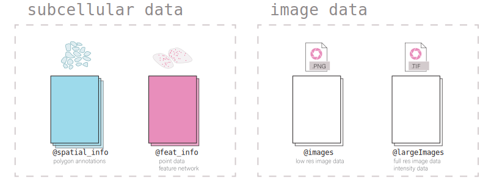

*Giotto* is a technique-agnostic framework and toolbox for spatial-omic analysis. Its structure and classes are designed to be flexible, intuitive, and readable. The framework supports working with both aggregate (cell x count) and un-aggregated spatial data where the polygon annotations are separate from the spatial expression data.

# 1. Giotto Object Structure

Usage of the *Giotto* package revolves around the `giotto` object. This is an S4 class that holds spatial expression data and facilitates its manipulation and visualization with the *Giotto* package's functions. Additional metadata and other outputs generated from certain functions, which may be used in downstream analyses, are also be stored within the `giotto` object. Its self-contained nature provides a convenient representation of the entire spatial experiment and is why most *Giotto* functions take a given `giotto` object as input and return a `giotto` object as output.

Data is organized within the `giotto` object in defined `slots` as described in the diagram below.




# 2. Nested Organization of the Giotto Object

Biology happens across multiple scales of size and types of modalities. While it is possible to simply generate a new object for each combination of the two, the fact that data from most spatial methods are both high resolution and spatially contiguous, requires a more flexible approach that permits the coexistence of multiple spatial units within the same object. This allows the user to define the spatial unit(s) of biology that are most relevant to the analysis and re-aggregate the feature information to those units.

With this organization it is convenient to compare expression across different spatial units. Additionally, by determining spatial overlaps between these spatial units, it becomes possible to represent the hierarchical organization of biological subunits and make queries using it.

## 2.1 Spatial unit and feature type

To accommodate this complexity, information is subnested within many of the `giotto` object's slots first by `spat_unit` (spatial unit) and then by `feat_type` (feature type). This structurally separates each set of information within *Giotto*'s framework so that there is minimal ambiguity.

A summary of what information the object contains can be viewed by directly returning it.


```{r, eval=FALSE}
library(Giotto)
library(GiottoData)
library(data.table)

vizmini = loadGiottoMini('vizgen')
```


```{r, eval=FALSE}
vizmini
```

```{r, eval=FALSE}
    An object of class giotto 
    >Active spat_unit:  z0 
    >Active feat_type:  rna 
    [SUBCELLULAR INFO]
    polygons      : z0 z1 aggregate 
    features      : rna 
    [AGGREGATE INFO]
    expression -----------------------
      [z0][rna] raw
      [z1][rna] raw
      [aggregate][rna] raw normalized scaled pearson
    spatial locations ----------------
      [z0] raw
      [z1] raw
      [aggregate] raw
    spatial networks -----------------
      [aggregate] Delaunay_network kNN_network
    spatial enrichments --------------
      [aggregate][rna] cluster_metagene
    dim reduction --------------------
      [aggregate][rna] pca umap tsne
    nearest neighbor networks --------
      [aggregate][rna] sNN.pca
    attached images ------------------
    giottoLargeImage : 4 items...


    Use objHistory() to see steps and params used

```

Included below is a description of the `giotto` object subnesting for each data slot and also the accessor functions for setting and getting information from them.

```{r table2, eval = FALSE, echo=FALSE, message=FALSE, warnings=FALSE, results='asis'}
tabl <- "
| Tables        | Are           | Cool  |
|---------------|:-------------:|------:|
| col 3 is      | right-aligned | $1600 |
| col 2 is      | centered      |   $12 |
| zebra stripes | are neat      |    $1 |
"
cat(tabl) # output the table in a format good for HTML/PDF/docx conversion
```

  |Slot                       |Nested                  | Example                          | Internal Accessors      |
  |---------------------------|------------------------|----------------------------------|-------------------------|
  |**\@expression**           | <span style="color: darkturquoise;">spat_unit</span> -   |    |   getExpression()       |
  |                           | <span style="color: pink;">feat_type</span> -   | <span style="color: darkturquoise;">cell</span> - <span style="color: pink;">rna</span> - <span style="color: darkred;">raw</span>                  |   setExpression()       |
  |                           | <span style="color: darkred;">name</span>       |                                  |                         |
  |---------------------------|------------------------|----------------------------------|-------------------------|
  |**\@cell_metadata**        | <span style="color: darkturquoise;">spat_unit</span> -   | <span style="color: darkturquoise;">cell</span> - <span style="color: pink;">rna</span>     |   getCellMetadata()     |
  |                           | <span style="color: pink;">feat_type</span>     |                                  |   setCellMetadata()     |
  |---------------------------|------------------------|----------------------------------|-------------------------|
  |**\@feat_metadata**        | <span style="color: darkturquoise;">spat_unit</span> -   | <span style="color: darkturquoise;">cell</span> - <span style="color: pink;">rna</span>     |   getFeatMetadata()     |
  |                           | <span style="color: pink;">feat_type</span>     |                                  |   setFeatMetadata()     |
  |---------------------------|------------------------|----------------------------------|-------------------------|
  |**\@spatial_grid**         | <span style="color: darkturquoise;">spat_unit</span> -   | <span style="color: darkturquoise;">grid</span>- <span style="color: darkred;">grid</span>  |   getSpatialGrid()      |
  |                           | <span style="color: darkred;">name</span>       |                                  |   setSpatialGrid()      |
  |---------------------------|------------------------|----------------------------------|-------------------------|
  |**\@dimension_reduction**  | <span style="color: purple;">approach</span> -  |  |      |
  |                           | <span style="color: darkturquoise;">spat_unit</span> -   |  | getDimReduction()       |
  |                           | <span style="color: pink;">feat_type</span> -   | <span style="color: purple;">cells</span> - <span style="color: darkturquoise;">cell</span> - <span style="color: pink;">rna</span> - <span style="color: orange;">pca</span> - <span style="color: darkred;">pca</span>                  | setDimReduction()         |
  |                           | <span style="color: orange;">method</span> -    |                                  |                         |
  |                           | <span style="color: darkred;">name</span>       |                                  |                         |
  |---------------------------|------------------------|----------------------------------|-------------------------|
  |**\@multiomics**           | <span style="color: darkturquoise;">spat_unit</span> -   |                    |          |
  |                           | <span style="color: pink;">feat_type</span> -   | <span style="color: darkturquoise;">cell</span> - <span style="color: pink;">rna-protein</span> - <span style="color: orange;">WNN</span> - <span style="color: darkred;">theta_weighted_matrix</span> |  getMultiomics()        |
  |                           | <span style="color: orange;">method</span> -    |    |    setMultiomics()                     |
  |                           | <span style="color: darkred;">name</span>       |  |                      |
  |---------------------------|------------------------|----------------------------------|-------------------------|
  |**\@nn_network**           | <span style="color: darkturquoise;">spat_unit</span>-    |  |   getNearestNetwork()   |
  |                           | <span style="color: orange;">method</span> -    | <span style="color: darkturquoise;">cell</span> - <span style="color: orange;">sNN</span> - <span style="color: darkred;">sNN_results1</span>         |   setNearestNetwork()   |
  |                           | <span style="color: darkred;">name</span>      |                                  |                         |
  |---------------------------|------------------------|----------------------------------|-------------------------|
  |**\@spatial_enrichment**   | <span style="color: darkturquoise;">spat_unit</span> -   |   |   getSpatialEnrichment()|
  |                           | <span style="color: pink;">feat_type</span> -   | <span style="color: darkturquoise;">cell</span> - <span style="color: pink;">rna</span> - <span style="color: darkred;">results1</span>             |   setSpatialEnrichment()|
  |                           | <span style="color: darkred;">name</span>       |                                  |                         |
  |---------------------------|------------------------|----------------------------------|-------------------------|
  |**\@spatial_info**         | <span style="color: darkturquoise;">spat_unit</span>     | <span style="color: darkturquoise;">cell</span>                    |   getPolygonInfo()      |
  |                           |                        |                                  |   setPolygonInfo()      |
  |---------------------------|------------------------|----------------------------------|-------------------------|
  |**\@spatial_locs**         | <span style="color: darkturquoise;">spat_unit</span> -   | <span style="color: darkturquoise;">cell</span> - <span style="color: darkred;">raw</span>   |   getSpatialLocations() |
  |                           | <span style="color: darkred;">name</span>       |                                  |   setSpatialLocations() |
  |---------------------------|------------------------|----------------------------------|-------------------------|
  |**\@spatial_network**      | <span style="color: darkturquoise;">spat_unit</span> -   | <span style="color: darkturquoise;">cell</span> - <span style="color: darkred;">Delaunay_network1</span> |   getSpatialNetwork()   |
  |                           | <span style="color: darkred;">name</span>       |    |   setSpatialNetwork()   |
  |---------------------------|------------------------|----------------------------------|-------------------------|
  |**\@feat_info**            | <span style="color: pink;">feat_type</span>     | <span style="color: pink;">rna</span>                     |   getFeatureInfo()        |
  |                           |                        |                                  |   setFeatureInfo()        |
  |---------------------------|------------------------|----------------------------------|-------------------------|
  |**\@images**               | <span style="color: darkred;">name</span>       | <span style="color: darkred;">image</span>                |   getGiottoImage()      |
  |                           |                        |                                  |   setGiottoImage()      |
  |---------------------------|------------------------|----------------------------------|-------------------------|
  |**\@largeImages**          | <span style="color: darkred;">name</span>       | <span style="color: darkred;">image</span>                |   getGiottoImage()      |
  |                           |                        |                                  |   setGiottoImage()      |
  |---------------------------|------------------------|----------------------------------|-------------------------|
  |**\@instructions**         |                        |                                  |   instructions()        |
  |---------------------------|------------------------|----------------------------------|-------------------------|


## 2.2 Show and list functions

Show and list functions are also provided for determining what information exists within each of these slots and its nesting.

- `show` functions print a preview of all the data within the slot, but do not return information


```{r, eval=FALSE}
showGiottoSpatLocs(vizmini)
```

```{r, eval=FALSE}
    ├──Spatial unit "z0"
    │  └──S4 spatLocsObj "raw" coordinates:   (498 rows)
    │        An object of class spatLocsObj 
    │        provenance: z0
    │            ------------------------
    │              sdimx     sdimy                                 cell_ID
    │        1: 6405.067 -4780.499  40951783403982682273285375368232495429
    │        2: 6426.020 -4972.519 240649020551054330404932383065726870513
    │        3: 6428.456 -4799.158 274176126496863898679934791272921588227
    │        4: 6408.155 -4816.583 323754550002953984063006506310071917306
    │        
    │        ranges:
    │                sdimx     sdimy
    │        [1,] 6402.438 -5146.726
    │        [2,] 6899.203 -4700.157
    │        
    │        
    │     
    ├──Spatial unit "z1"
    │  └──S4 spatLocsObj "raw" coordinates:   (504 rows)
    │        An object of class spatLocsObj 
    │        provenance: z1
    │            ------------------------
    │              sdimx     sdimy                                 cell_ID
    │        1: 6404.014 -4779.625  40951783403982682273285375368232495429
    │        2: 6408.296 -4970.794  17685062374745280598492217386845129350
    │        3: 6401.148 -4991.061 223553142498364321238189328942498473503
    │        4: 6430.153 -4971.251 240649020551054330404932383065726870513
    │        
    │        ranges:
    │                sdimx     sdimy
    │        [1,] 6401.148 -5147.193
    │        [2,] 6899.323 -4700.410
    │        
    │        
    │     
    └──Spatial unit "aggregate"
       └──S4 spatLocsObj "raw" coordinates:   (461 rows)
             An object of class spatLocsObj 
             provenance: z0 z1
                 ------------------------
                   sdimx     sdimy                                 cell_ID
             1: 6637.881 -5140.465 100210519278873141813371229408401071444
             2: 6471.978 -4883.541 101161259912191124732236989250178928032
             3: 6801.610 -4968.685 101488859781016188084173008420811094152
             4: 6789.055 -5105.338 101523780333017320796881555775415156847

             ranges:
                     sdimx     sdimy
             [1,] 6401.412 -5146.747
             [2,] 6899.108 -4700.326


-   `list` functions are (internal) functions that return a `data.table`
    of the available information and nesting.

```

```{r, eval=FALSE}
Giottolist_expression(vizmini)
```

```{r, eval=FALSE}

    spat_unit feat_type       name
    1:        z0       rna        raw
    2:        z1       rna        raw
    3: aggregate       rna        raw
    4: aggregate       rna normalized
    5: aggregate       rna     scaled
    6: aggregate       rna    pearson
```


```{r, eval=FALSE}
# Find specific spat_unit objects #
Giottolist_expression(vizmini, spat_unit = 'z0')
```

```{r, eval=FALSE}

    spat_unit feat_type name
    1:        z0       rna  raw

```

- `list names` (internal) functions return a `vector` of object names
    at the specified nesting


```{r, eval=FALSE}
Giottolist_expression_names(vizmini, spat_unit = 'z1', feat_type = 'rna')
```


## 2.3 Provenance

Going further, sometimes different sources of information can be used when aggregating to a particular spatial unit. This is most easily shown with the subcellular datasets from the Vizgen MERSCOPE platform which provide both feature polygon information for multiple confocal planes within a tissue. The aggregated information produced then could be drawn from different z-planes or combinations thereof. Giotto tracks this provenance information for each set of aggregated data.


```{r, eval=FALSE}
expr_mat = getExpression(vizmini, spat_unit = 'aggregate')
prov(expr_mat)
```

```{r, eval=FALSE}
    [1] "z0" "z1"
```


# 3. Giotto subobjects

*Giotto* 3.0 update introduced S4 subobjects that are used within the `giotto` object and its processing. These subobjects provide more formalized definitions for what information and formatting is needed in each of the `giotto` object slots in order for it to be functional. These objects are standalone and extensible and commonly used spatial manipulation and plotting methods are being implemented for them.

In addition, these subobjects carry several pieces of metadata in additional slots alongside the main information (e.g. also slots for `spat_unit` and `feat_type` alongside the `exprDT` slot for the `exprObj` S4). This makes it so that nesting information is retained when they are taken out of the `giotto` object and that nesting information does not need to be supplied anymore when interacting with the `setter` functions.

`getter` functions now have an `output` param that **defaults** to extracting the information from the `giotto` object as the S4 subobject. When extracting information that will be modified and then returned to the `giotto` object, it is preferred that the information is extracted as the S4 both so that tagged information is not lost, and because it is convenient to work with the S4's main data slot through the `[` and `[<-` generics (see Section 3.5).

## 3.1 Creating an S4 subobject

### 3.1.1 Constructors

For directly creating a subobject, constructor functions can be used.


constructors


`createExprObj()` `createCellMetaObj()` `createFeatMetaObj()`
`createDimObj()` `createNearestNetObj()` `createSpatLocsObj()`
`createSpatNetObj()` `createSpatEnrObj()` `createSpatialGrid()`
`createGiottoPoints()` `createGiottoPolygonsFromDfr()`
`createGiottoPolygonsFromMask()` `createGiottoImage()`
`createGiottoLargeImage()`


```{r, eval=FALSE}
coords = data.table(
  sdimx = c(1,2,3),
  sdimy = c(1,2,3),
  cell_ID = c('A','B','C')
)

st = createSpatLocsObj(name = 'test',
                       spat_unit = 'cell',
                       coordinates = coords,
                       provenance = 'cell')
```

There are non numeric or integer columns for the spatial location input at column position(s): 3 The first non-numeric column will be considered as a cell ID to test for consistency with the expression matrix. Other non numeric columns will be removed


```{r, eval=FALSE}
print(st)
```

```{r, eval=FALSE}
    An object of class spatLocsObj : "test"
    spat_unit : "cell"
    provenance: cell 
       ------------------------

    preview:
       sdimx sdimy cell_ID
    1:     1     1       A
    2:     2     2       B
    3:     3     3       C

    ranges:
         sdimx sdimy
    [1,]     1     1
    [2,]     3     3
```


### 3.1.2 Readers

Alternatively, read functions can be used to take named nested lists of raw data input and convert them to lists of subobjects which are directly usable by the setter functions.


readers

`readPolygonData()` `readFeatData()` `readExprData()`
`readCellMetadata()` `readFeatMetadata()` `readSpatLocsData()`
`readSpatNetData()` `readSpatEnrichData()` `readDimReducData()`
`readNearestNetData()`


```{r, eval=FALSE}
st2 = readSpatLocsData(list(cell2 = list(test1 = coords,
                                         test2 = coords)))
```

```{r, eval=FALSE}
    list depth of 2


    List item [1]:
     spat_unit: cell2
     name: test1
```

There are non numeric or integer columns for the spatial location input at column position(s): 3.  The first non-numeric column will be considered as a cell ID to test for consistency with the expression matrix. Other non numeric columns will be removed


```{r, eval=FALSE}

    List item [2]:
     spat_unit: cell2
     name: test2

```

There are non numeric or integer columns for the spatial location input at column position(s): 3. The first non-numeric column will be considered as a cell ID to test for consistency with the expression matrix. Other non numeric columns will be removed


```{r, eval=FALSE}
print(st2)
```

```{r, eval=FALSE}
    [[1]]
    An object of class spatLocsObj : "test1"
    spat_unit : "cell2"
    provenance: cell2 
       ------------------------

    preview:
       sdimx sdimy cell_ID
    1:     1     1       A
    2:     2     2       B
    3:     3     3       C

    ranges:
         sdimx sdimy
    [1,]     1     1
    [2,]     3     3


    [[2]]
    An object of class spatLocsObj : "test2"
    spat_unit : "cell2"
    provenance: cell2 
       ------------------------

    preview:
       sdimx sdimy cell_ID
    1:     1     1       A
    2:     2     2       B
    3:     3     3       C

    ranges:
         sdimx sdimy
    [1,]     1     1
    [2,]     3     3

```

## 3.2 Giotto Accessors

*Giotto* provides `getter` and `setter` functions for manually accessing the information contained within the `giotto` object. Note that the `setters` require that the data be provided as compatible S4 subobjects or lists thereof. External data can read into the appropriate formats using the above `reader` functions. The `getter` functions return S4 subobjects by default.


getters


`getExpression()` `getCellMetadata()` `getFeatMetadata()`
`getSpatialLocations()` `getDimReduction()` `getNearestNetwork()`
`getSpatialNetwork()` `getPolygonInfo()` `getFeatureInfo()`
`getSpatialEnrichment()` `getGiottoImage()`


setters


`setExpression()` `setCellMetadata()` `setFeatureMetadata()`
`setSpatialLocations()` `setDimReduction()` `setNearestNetwork()`
`setSpatialNetwork()` `setPolygonInfo()` `setFeatureInfo()`
`setSpatialEnrichment()` `setGiottoImage()`


```{r, eval=FALSE}
expval = getExpression(vizmini)
print(expval)
```

```{r, eval=FALSE}
    An object of class exprObj : "raw"
    spat_unit : "z0"
    feat_type : "rna"
    provenance: z0 

    contains:
    336 x 498 sparse Matrix of class "dgCMatrix"

    Adora1 . . . . . . . . . . 1 . . ......
    Adgrb1 . . . . 1 . . . . . . . . ......
    Adgrb3 . . . . . . . . . . 1 3 . ......

     ........suppressing 485 columns and 330 rows 

    Blank-128 . . . . . . . . . . . . . ......
    Blank-145 . . . . . . . . . . . . . ......
    Gpr101    . . . . . . . . . . . . . ......

     First four colnames:
     40951783403982682273285375368232495429
     240649020551054330404932383065726870513
     274176126496863898679934791272921588227
     323754550002953984063006506310071917306 

```

## 3.3 Get and set S4 spat_unit, feat_type, provenance

`spatUnit()`, `featType()`, and `prov()` are replacement functions for tagged spatial unit, feature type, and provenance information respectively.


```{r, eval=FALSE}
# spat_unit
spatUnit(expval) <- 'new_spat'
spatUnit(expval)
```

```{r, eval=FALSE}
    [1] "new_spat"
```

```{r, eval=FALSE}
# feat_type
featType(expval) <- 'new_feat'
featType(expval)
```

```{r, eval=FALSE}
    [1] "new_feat"
```

```{r, eval=FALSE}
# provenance
prov(expval) <- 'cell'
prov(expval)
```

```{r, eval=FALSE}
    [1] "cell"
```


## 3.4 Setting an S4 subobject

The `spat_unit`, `feat_type`, and `name` params no longer need to be given when setting an S4 subobject with tagged information into a `giottoObject`. However, if input is given to the `set` function parameters then it is prioritized over the tagged information and the tagged information is updated.


```{r, eval=FALSE}
# set exprObj to tagged nesting location
vizmini <- setExpression(vizmini, expval)
```

```{r, eval=FALSE}
    Setting expression [new_spat][new_feat] raw
```

```{r, eval=FALSE}
Giottolist_expression(vizmini)
```

```{r, eval=FALSE}
    spat_unit feat_type       name
    1:        z0       rna        raw
    2:        z1       rna        raw
    3: aggregate       rna        raw
    4: aggregate       rna normalized
    5: aggregate       rna     scaled
    6: aggregate       rna    pearson
    7:  new_spat  new_feat        raw
```


## 3.5 Working with S4 subobjects {#sec-working_with_subobjects}

Giotto's S4 subobjects each wrap one main data object. The empty `[]` and `[]<-` operators are defined as shorthand for directly accessing this slot that contains the data. For example, with a `spatLocsObj`:

`class(spatLocsObj[])` is equivalent to `class(spatLocsObj@coordinates)`

In this way, the S4 subobjects can be used in contexts that the wrapped objects could be.


```{r, eval=FALSE}
st = getSpatialLocations(vizmini)
class(st)
```

```{r, eval=FALSE}
    [1] "spatLocsObj"
    attr(,"package")
    [1] "Giotto"
```

```{r, eval=FALSE}
# With empty brackets
class(st[])
```

```{r, eval=FALSE}
    [1] "data.table" "data.frame"
```


**Setting information**


```{r, eval=FALSE}
print(st)
```

```{r, eval=FALSE}
    An object of class spatLocsObj : "raw"
    spat_unit : "z0"
    provenance: z0 
       ------------------------

    preview:
            sdimx     sdimy                                 cell_ID
      1: 6405.067 -4780.499  40951783403982682273285375368232495429
      2: 6426.020 -4972.519 240649020551054330404932383065726870513
      3: 6428.456 -4799.158 274176126496863898679934791272921588227
      4: 6408.155 -4816.583 323754550002953984063006506310071917306
      5: 6425.894 -4862.808  87260224659312905497866017323180367450
     ---                                                           
    494: 6863.376 -4764.372 264234489423886906860498828392801290668
    495: 6833.515 -4724.922 328891726607418454659643302361160567789
    496: 6829.474 -4755.392   6380671372744430258754116433861320161
    497: 6823.512 -4713.632  75286702783716447443887872812098770697
    498: 6842.534 -4717.261   9677424102111816817518421117250891895

    ranges:
            sdimx     sdimy
    [1,] 6402.438 -5146.726
    [2,] 6899.203 -4700.157

```


```{r, eval=FALSE}
st[] = coords
print(st)
```

```{r, eval=FALSE}
    An object of class spatLocsObj : "raw"
    spat_unit : "z0"
    provenance: z0 
       ------------------------

    preview:
       sdimx sdimy cell_ID
    1:     1     1       A
    2:     2     2       B
    3:     3     3       C

    ranges:
         sdimx sdimy
    [1,]     1     1
    [2,]     3     3

```

## 4. Session Info


```{r, eval=FALSE}
sessionInfo()
```

```{r, eval=FALSE}
R version 4.3.2 (2023-10-31)
Platform: aarch64-apple-darwin20 (64-bit)
Running under: macOS Sonoma 14.2.1

Matrix products: default
BLAS:   /System/Library/Frameworks/Accelerate.framework/Versions/A/Frameworks/vecLib.framework/Versions/A/libBLAS.dylib 
LAPACK: /Library/Frameworks/R.framework/Versions/4.3-arm64/Resources/lib/libRlapack.dylib;  LAPACK version 3.11.0

locale:
[1] en_US.UTF-8/en_US.UTF-8/en_US.UTF-8/C/en_US.UTF-8/en_US.UTF-8

time zone: America/Mexico_City
tzcode source: internal

attached base packages:
[1] stats     graphics  grDevices utils     datasets  methods  
[7] base     

other attached packages:
[1] data.table_1.14.10 GiottoData_0.2.6.1 GiottoUtils_0.1.2 
[4] Giotto_4.0.2       GiottoClass_0.1.2 

loaded via a namespace (and not attached):
  [1] rstudioapi_0.15.0           jsonlite_1.8.8             
  [3] magrittr_2.0.3              magick_2.8.2               
  [5] rmarkdown_2.25              fs_1.6.3                   
  [7] zlibbioc_1.48.0             vctrs_0.6.5                
  [9] memoise_2.0.1               RCurl_1.98-1.13            
 [11] terra_1.7-65                usethis_2.2.2              
 [13] htmltools_0.5.7             S4Arrays_1.2.0             
 [15] progress_1.2.3              curl_5.2.0                 
 [17] Rhdf5lib_1.24.1             SparseArray_1.2.3          
 [19] rhdf5_2.46.1                KernSmooth_2.23-22         
 [21] htmlwidgets_1.6.4           cachem_1.0.8               
 [23] igraph_1.6.0                mime_0.12                  
 [25] lifecycle_1.0.4             pkgconfig_2.0.3            
 [27] Matrix_1.6-4                R6_2.5.1                   
 [29] fastmap_1.1.1               GenomeInfoDbData_1.2.11    
 [31] MatrixGenerics_1.14.0       shiny_1.8.0                
 [33] digest_0.6.33               colorspace_2.1-0           
 [35] AnnotationDbi_1.64.1        S4Vectors_0.40.2           
 [37] pkgload_1.3.3               GenomicRanges_1.54.1       
 [39] RSQLite_2.3.4               filelock_1.0.3             
 [41] progressr_0.14.0            fansi_1.0.6                
 [43] httr_1.4.7                  abind_1.4-5                
 [45] compiler_4.3.2              proxy_0.4-27               
 [47] remotes_2.4.2.1             bit64_4.0.5                
 [49] withr_2.5.2                 backports_1.4.1            
 [51] DBI_1.2.0                   pkgbuild_1.4.3             
 [53] biomaRt_2.58.0              sessioninfo_1.2.2          
 [55] rappdirs_0.3.3              DelayedArray_0.28.0        
 [57] rjson_0.2.21                classInt_0.4-10            
 [59] GiottoVisuals_0.1.1         tools_4.3.2                
 [61] units_0.8-5                 httpuv_1.6.13              
 [63] glue_1.6.2                  rhdf5filters_1.14.1        
 [65] promises_1.2.1              grid_4.3.2                 
 [67] sf_1.0-15                   checkmate_2.3.1            
 [69] generics_0.1.3              gtable_0.3.4               
 [71] class_7.3-22                hms_1.1.3                  
 [73] xml2_1.3.6                  utf8_1.2.4                 
 [75] XVector_0.42.0              BiocGenerics_0.48.1        
 [77] pillar_1.9.0                stringr_1.5.1              
 [79] later_1.3.2                 dplyr_1.1.4                
 [81] BiocFileCache_2.10.1        lattice_0.21-9             
 [83] gmp_0.7-3                   bit_4.0.5                  
 [85] tidyselect_1.2.0            SingleCellExperiment_1.24.0
 [87] Biostrings_2.70.1           miniUI_0.1.1.1             
 [89] knitr_1.45                  IRanges_2.36.0             
 [91] SummarizedExperiment_1.32.0 stats4_4.3.2               
 [93] xfun_0.41                   Biobase_2.62.0             
 [95] devtools_2.4.5              matrixStats_1.2.0          
 [97] stringi_1.8.3               yaml_2.3.8                 
 [99] evaluate_0.23               codetools_0.2-19           
[101] tibble_3.2.1                colorRamp2_0.1.0           
[103] cli_3.6.2                   arrow_14.0.0.2             
[105] xtable_1.8-4                reticulate_1.34.0          
[107] munsell_0.5.0               Rcpp_1.0.11                
[109] GenomeInfoDb_1.38.5         dbplyr_2.4.0               
[111] png_0.1-8                   XML_3.99-0.16              
[113] parallel_4.3.2              ellipsis_0.3.2             
[115] ggplot2_3.4.4               assertthat_0.2.1           
[117] blob_1.2.4                  prettyunits_1.2.0          
[119] ClusterR_1.3.2              profvis_0.3.8              
[121] urlchecker_1.0.1            bitops_1.0-7               
[123] SpatialExperiment_1.12.0    scales_1.3.0               
[125] e1071_1.7-14                purrr_1.0.2                
[127] crayon_1.5.2                rlang_1.1.2                
[129] cowplot_1.1.2               KEGGREST_1.42.0            
```
