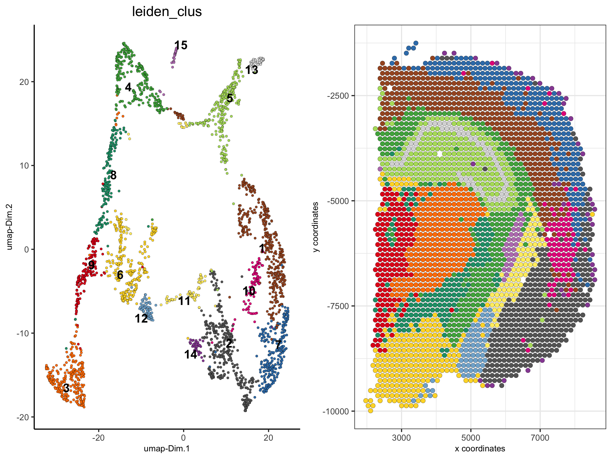
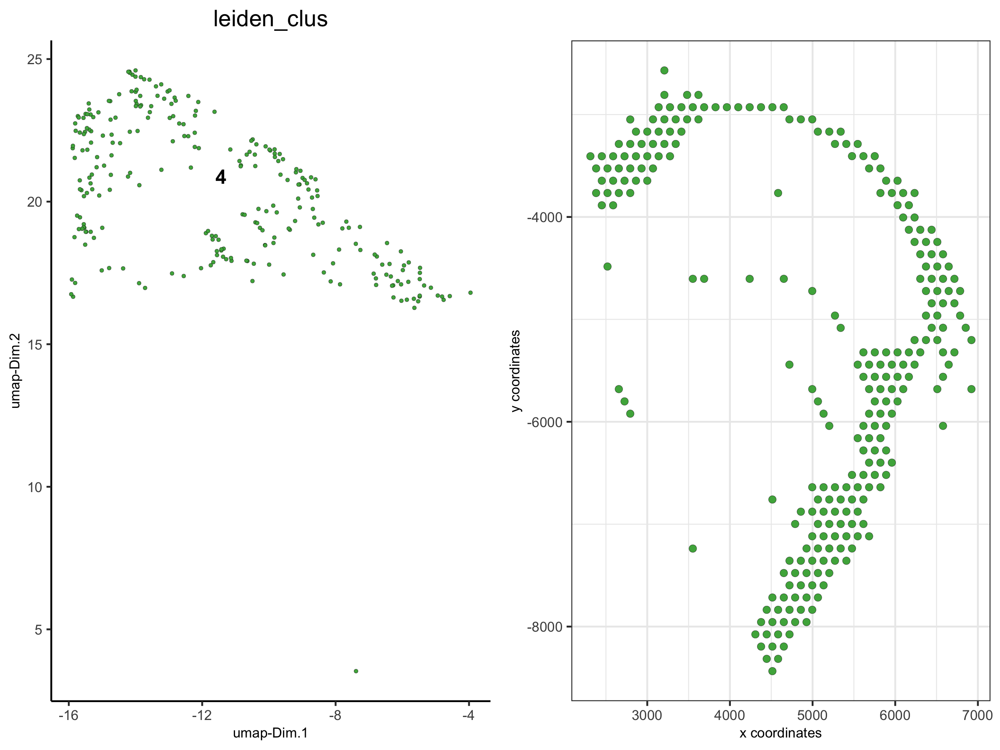
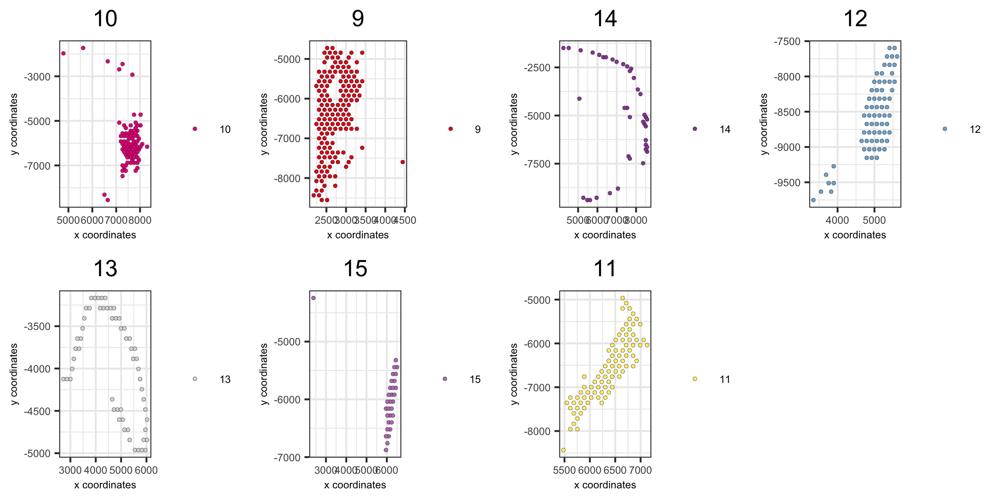
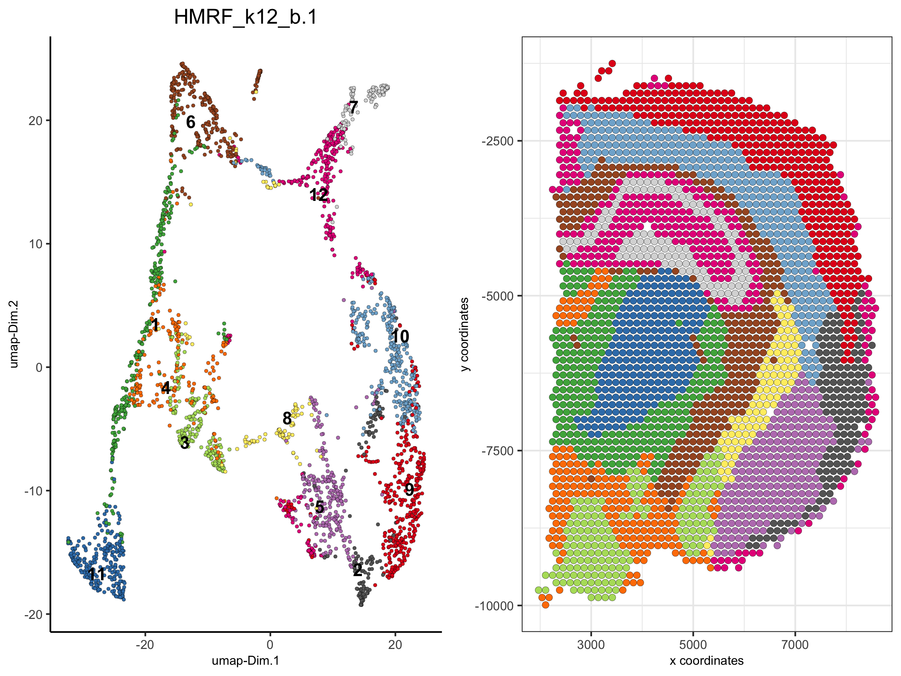
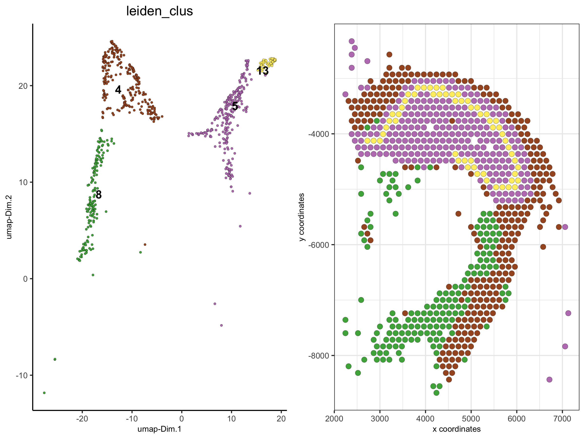

## How to subset a Giotto object?

There are several ways to subset a Giotto object or visualize a subset of the data. Here we will use the already analyzed [Visium 10X brain dataset object](./mouse_visium_brain_200325.html) to:

- show how to visualize a subset of cells  
- show how to visualize data by group (example clustering, layers in 3D images, ...)  
- subset the dataset based on cell IDs (cluster name(s) or individual cell IDs)   
- subset the dataset based on spatial locations/coordinates   


##### 1. the Visium 10X whole brain  
```{r, eval=FALSE}
spatDimPlot(visium_brain, cell_color = 'leiden_clus',
            plot_alignment = 'horizontal', spat_point_size = 2)
```

{ width=50% }


##### 2. show only a subset of the clusters 
```{r, eval=FALSE}
spatDimPlot(visium_brain,
            cell_color = 'leiden_clus',  select_cell_groups = '4',
            plot_alignment = 'horizontal', spat_point_size = 2)
```

{ width=50% }


##### 3. show only a subset of the clusters, excluding not selected cells
```{r, eval=FALSE}
spatDimPlot(visium_brain,
            cell_color = 'leiden_clus',  select_cell_groups = '4', show_other_cells = F,
            plot_alignment = 'horizontal', spat_point_size = 2)
```

{ width=50% }


##### 4. create spatial plots grouped by the leiden clustering result
```{r, eval=FALSE}
spatPlot(visium_brain,
         group_by = 'leiden_clus', group_by_subset = c(1:8),
         cell_color = 'leiden_clus', cow_n_col = 4,
         point_size = 1, axis_text = 6, axis_title = 6, legend_text = 6)
```

{ width=50% }


```{r, eval=FALSE}
spatPlot(visium_brain,
         group_by = 'leiden_clus', group_by_subset = c(9:16),
         cell_color = 'leiden_clus', cow_n_col = 4,
         point_size = 1, axis_text = 6, axis_title = 6, legend_text = 6)
```

{ width=50% }


##### 5. create dimension plots grouped by the HMRF result
```{r, eval=FALSE}
spatDimPlot(visium_brain, cell_color = 'HMRF_k12_b.1',
            plot_alignment = 'horizontal', spat_point_size = 2)
```

{ width=50% }


```{r, eval=FALSE}
dimPlot(visium_brain,
         group_by = 'HMRF_k12_b.1', group_by_subset = c(1:6),
         cell_color = 'leiden_clus', cow_n_col = 3,
         point_size = 1, axis_text = 6, axis_title = 6, legend_text = 6)
```

{ width=50% }


```{r, eval=FALSE}
dimPlot(visium_brain,
        group_by = 'HMRF_k12_b.1', group_by_subset = c(7:14),
        cell_color = 'leiden_clus', cow_n_col = 3,
        point_size = 1, axis_text = 6, axis_title = 6, legend_text = 6)
```

{ width=50% }
 


##### 6. Create a new Giotto object by subsetting selected clusters
```{r, eval=FALSE}
metadata = pDataDT(visium_brain)
subset_cell_IDs = metadata[leiden_clus %in% c(4, 5, 8, 13)]$cell_ID
visium_brain_small = subsetGiotto(visium_brain, cell_ids = subset_cell_IDs)

spatDimPlot(visium_brain_small,
            cell_color = 'leiden_clus', 
            plot_alignment = 'horizontal', spat_point_size = 2.5)
```

{ width=50% }

```{r, eval=FALSE}
spatDimPlot(visium_brain_small,
            cell_color = 'nr_genes', color_as_factor = F,
            plot_alignment = 'horizontal', spat_point_size = 2.5)
```

{ width=50% }


##### 5.  Create a new Giotto object by subsetting based on spatial coordinates/locations
```{r, eval=FALSE}
DG_subset = subsetGiottoLocs(visium_brain,
                             x_max = 6500, x_min = 3000,
                             y_max = -2500, y_min = -5500)

spatDimPlot(DG_subset,
            cell_color = 'leiden_clus', 
            plot_alignment = 'horizontal', spat_point_size = 4,
            save_param = list(save_name = '6_DG_loc_subset', base_height = 4))
```
{ width=50% }


